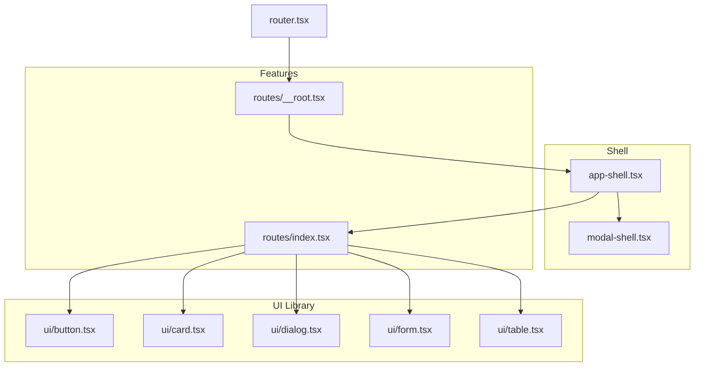
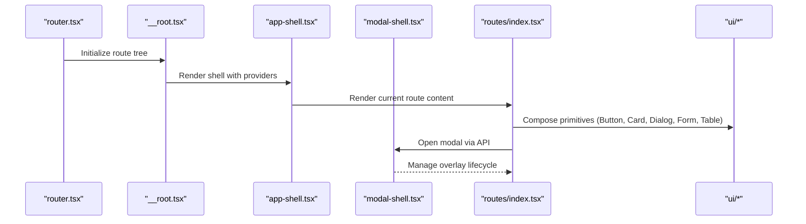
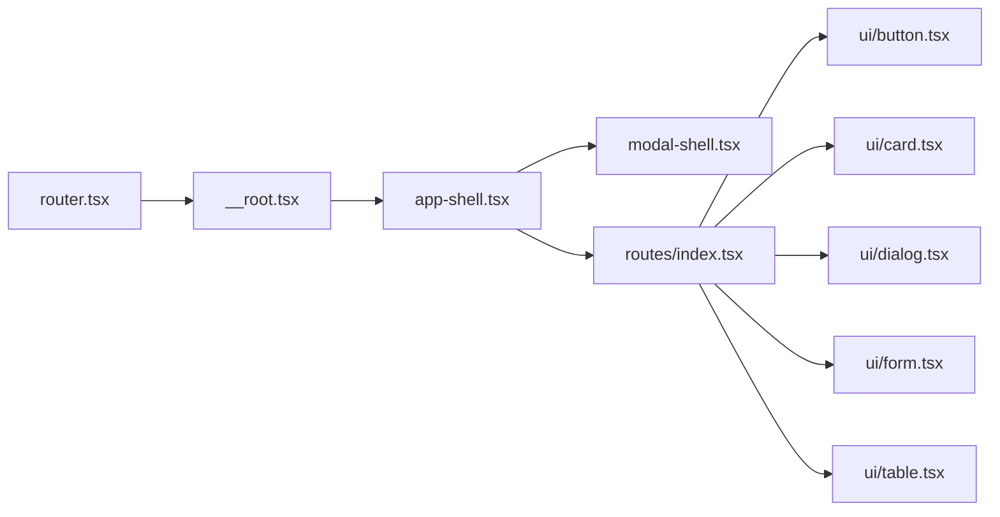

# Component Architecture

<cite>
**Referenced Files in This Document**
- [app-shell.tsx](file://src/components/app-shell.tsx)
- [modal-shell.tsx](file://src/components/modal-shell.tsx)
- [button.tsx](file://src/components/ui/button.tsx)
- [card.tsx](file://src/components/ui/card.tsx)
- [dialog.tsx](file://src/components/ui/dialog.tsx)
- [form.tsx](file://src/components/ui/form.tsx)
- [table.tsx](file://src/components/ui/table.tsx)
- [error-state.tsx](file://src/components/error-state.tsx)
- [loading-skeleton.tsx](file://src/components/loading-skeleton.tsx)
- [router.tsx](file://src/router.tsx)
- [__root.tsx](file://src/routes/__root.tsx)
- [index.tsx](file://src/routes/index.tsx)
- [use-mobile.tsx](file://src/hooks/use-mobile.tsx)
- [theme.tsx](file://src/lib/theme.tsx)
</cite>

## Table of Contents
1. [Introduction](#introduction)
2. [Project Structure](#project-structure)
3. [Core Components](#core-components)
4. [Architecture Overview](#architecture-overview)
5. [Detailed Component Analysis](#detailed-component-analysis)
6. [Dependency Analysis](#dependency-analysis)
7. [Performance Considerations](#performance-considerations)
8. [Troubleshooting Guide](#troubleshooting-guide)
9. [Conclusion](#conclusion)

## Introduction
This document explains the React component architecture with a focus on the modular component system. It covers the hierarchical structure starting from the root container, modal management, and feature-specific components organized in dedicated directories. It also documents the UI component library pattern using reusable primitives such as button, card, dialog, form, and table. Composition patterns, prop interfaces, state management within components, error boundaries, and performance optimizations like memoization and lazy loading are detailed to help both new and experienced developers understand and extend the codebase effectively.

## Project Structure
The application follows a clear separation of concerns:
- Shell containers manage global layout and modals
- Feature modules encapsulate domain-specific logic and UI
- A shared UI library provides consistent, reusable primitives
- Routes define page-level composition and navigation

**Diagram sources**
- [app-shell.tsx](file://src/components/app-shell.tsx)
- [modal-shell.tsx](file://src/components/modal-shell.tsx)
- [button.tsx](file://src/components/ui/button.tsx)
- [card.tsx](file://src/components/ui/card.tsx)
- [dialog.tsx](file://src/components/ui/dialog.tsx)
- [form.tsx](file://src/components/ui/form.tsx)
- [table.tsx](file://src/components/ui/table.tsx)
- [index.tsx](file://src/routes/index.tsx)
- [__root.tsx](file://src/routes/__root.tsx)
- [router.tsx](file://src/router.tsx)

**Section sources**
- [router.tsx](file://src/router.tsx)
- [__root.tsx](file://src/routes/__root.tsx)
- [index.tsx](file://src/routes/index.tsx)
- [app-shell.tsx](file://src/components/app-shell.tsx)
- [modal-shell.tsx](file://src/components/modal-shell.tsx)

## Core Components
- app-shell.tsx: The root container that composes the application shell, theme provider, routing outlet, and global modals. It ensures consistent layout and context availability across all routes.
- modal-shell.tsx: Centralized modal management for opening, closing, and stacking modals. Provides a predictable API for feature components to trigger overlays without managing z-index or portal details themselves.
- UI primitives (button, card, dialog, form, table): Reusable building blocks with consistent props, styling, and accessibility. They are composed by feature components to build complex screens while maintaining design consistency.

Key responsibilities:
- app-shell.tsx orchestrates global providers and layout
- modal-shell.tsx encapsulates modal lifecycle and portal rendering
- UI primitives enforce consistent UX and reduce duplication

**Section sources**
- [app-shell.tsx](file://src/components/app-shell.tsx)
- [modal-shell.tsx](file://src/components/modal-shell.tsx)
- [button.tsx](file://src/components/ui/button.tsx)
- [card.tsx](file://src/components/ui/card.tsx)
- [dialog.tsx](file://src/components/ui/dialog.tsx)
- [form.tsx](file://src/components/ui/form.tsx)
- [table.tsx](file://src/components/ui/table.tsx)

## Architecture Overview
The application uses a layered architecture:
- Route layer defines pages and navigational entry points
- Shell layer provides global layout, theming, and modal orchestration
- Feature layer implements domain-specific screens and workflows
- UI library supplies atomic components used throughout features

**Diagram sources**
- [router.tsx](file://src/router.tsx)
- [__root.tsx](file://src/routes/__root.tsx)
- [app-shell.tsx](file://src/components/app-shell.tsx)
- [modal-shell.tsx](file://src/components/modal-shell.tsx)
- [index.tsx](file://src/routes/index.tsx)
- [button.tsx](file://src/components/ui/button.tsx)
- [card.tsx](file://src/components/ui/card.tsx)
- [dialog.tsx](file://src/components/ui/dialog.tsx)
- [form.tsx](file://src/components/ui/form.tsx)
- [table.tsx](file://src/components/ui/table.tsx)

## Detailed Component Analysis

### Shell Layer: app-shell.tsx
Responsibilities:
- Wraps the application with necessary providers (e.g., theme, router outlet)
- Ensures consistent layout and global state availability
- Integrates modal-shell for overlay management

Composition patterns:
- Uses children prop to render route content
- Applies theme context and layout wrappers
- Mounts modal-shell at the root level for consistent overlay behavior

State management:
- Delegates modal state to modal-shell
- May hold global UI flags (e.g., sidebar open/close) if needed

Error handling:
- Can wrap children with an error boundary to catch rendering errors

Performance considerations:
- Memoize stable contexts where possible
- Avoid re-rendering heavy layouts by splitting into smaller components

**Section sources**
- [app-shell.tsx](file://src/components/app-shell.tsx)

### Modal Management: modal-shell.tsx
Responsibilities:
- Centralizes modal state (open, close, stack)
- Renders portals for overlays
- Provides a simple API for feature components to trigger modals

API surface:
- open(id, payload)
- close(id)
- isModalOpen(id)

Lifecycle:
- Manages mounting/unmounting of modal content
- Handles focus trapping and keyboard interactions through underlying UI primitives

Integration:
- Consumed by app-shell at the root
- Used by feature components to display dialogs, sheets, or custom overlays

**Section sources**
- [modal-shell.tsx](file://src/components/modal-shell.tsx)

### UI Library Primitives
- button.tsx: Accessible button with variants, sizes, and disabled states. Encapsulates common event handling and styling.
- card.tsx: Container component for grouping related content with consistent padding and borders.
- dialog.tsx: Wrapper around accessible dialog primitives, providing title, description, and actions slots.
- form.tsx: Form utilities for validation, field binding, and submission flow. Often integrates with form libraries.
- table.tsx: Data table primitive supporting sorting, pagination, and row selection.

Composition examples:
- Complex forms built from form fields, labels, and validation messages
- Data dashboards composed from table, card, and chart primitives
- Modals composed from dialog, buttons, and form elements

Prop interfaces:
- Consistent naming conventions (variant, size, className, disabled)
- Accessibility attributes (aria-*), keyboard support, and focus management

**Section sources**
- [button.tsx](file://src/components/ui/button.tsx)
- [card.tsx](file://src/components/ui/card.tsx)
- [dialog.tsx](file://src/components/ui/dialog.tsx)
- [form.tsx](file://src/components/ui/form.tsx)
- [table.tsx](file://src/components/ui/table.tsx)

### Error Boundary Implementation
- error-state.tsx provides a user-friendly fallback when components throw errors
- Typically wrapped around critical sections or entire route trees
- Displays actionable messages and recovery options

Usage pattern:
- Wrap high-risk components or data-heavy sections
- Provide retry mechanisms or navigation back to safe states

**Section sources**
- [error-state.tsx](file://src/components/error-state.tsx)

### Loading States and Skeletons
- loading-skeleton.tsx offers lightweight placeholders to improve perceived performance
- Used during data fetching or initial render to avoid layout shifts

Best practices:
- Match skeleton dimensions to actual content
- Avoid blocking interactions; keep skeletons non-interactive

**Section sources**
- [loading-skeleton.tsx](file://src/components/loading-skeleton.tsx)

### Theme and Context Integration
- theme.tsx manages theme state and provides a context for consistent styling
- Hooks and utilities expose theme values to components

Mobile responsiveness:
- use-mobile.tsx exposes breakpoints and responsive helpers
- Components can adapt layout based on device capabilities

**Section sources**
- [theme.tsx](file://src/lib/theme.tsx)
- [use-mobile.tsx](file://src/hooks/use-mobile.tsx)

## Dependency Analysis
The dependency graph shows how shells, routes, and UI primitives interact:

**Diagram sources**
- [router.tsx](file://src/router.tsx)
- [__root.tsx](file://src/routes/__root.tsx)
- [app-shell.tsx](file://src/components/app-shell.tsx)
- [modal-shell.tsx](file://src/components/modal-shell.tsx)
- [index.tsx](file://src/routes/index.tsx)
- [button.tsx](file://src/components/ui/button.tsx)
- [card.tsx](file://src/components/ui/card.tsx)
- [dialog.tsx](file://src/components/ui/dialog.tsx)
- [form.tsx](file://src/components/ui/form.tsx)
- [table.tsx](file://src/components/ui/table.tsx)

**Section sources**
- [router.tsx](file://src/router.tsx)
- [__root.tsx](file://src/routes/__root.tsx)
- [app-shell.tsx](file://src/components/app-shell.tsx)
- [modal-shell.tsx](file://src/components/modal-shell.tsx)
- [index.tsx](file://src/routes/index.tsx)

## Performance Considerations
- Memoization: Use React.memo for pure components and useMemo/useCallback for expensive computations and stable references
- Lazy loading: Code-split routes and heavy components with dynamic imports to reduce initial bundle size
- Virtualization: For large tables or lists, consider virtual scrolling to maintain smooth interactions
- State colocation: Keep state close to where it’s used; lift only when necessary to minimize re-renders
- Avoid unnecessary re-renders: Split large components into smaller ones and pass stable props

[No sources needed since this section provides general guidance]

## Troubleshooting Guide
Common issues and resolutions:
- Modal not appearing: Ensure modal-shell is mounted at the root and the correct id is used to open/close modals
- Form validation errors: Verify field bindings and validation rules; check console for schema mismatches
- Table performance: If rendering is slow, enable virtualization or paginate data
- Theme inconsistencies: Confirm theme provider is present and contexts are correctly consumed
- Error boundaries: Wrap failing components with error-boundary wrappers and inspect error-state outputs

**Section sources**
- [modal-shell.tsx](file://src/components/modal-shell.tsx)
- [form.tsx](file://src/components/ui/form.tsx)
- [table.tsx](file://src/components/ui/table.tsx)
- [theme.tsx](file://src/lib/theme.tsx)
- [error-state.tsx](file://src/components/error-state.tsx)

## Conclusion
The component architecture emphasizes modularity, composition, and consistency. Shells provide global context and layout, modal-shell centralizes overlay management, and the UI library offers reusable primitives. Features compose these primitives to build complex screens while maintaining predictable state and behavior. Adopting memoization, lazy loading, and proper error boundaries ensures a performant and resilient user experience.

[No sources needed since this section summarizes without analyzing specific files]