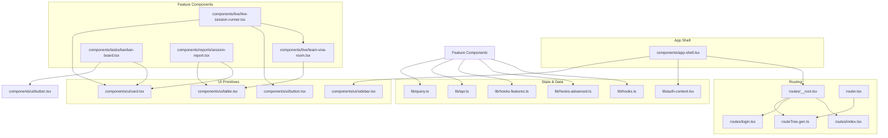
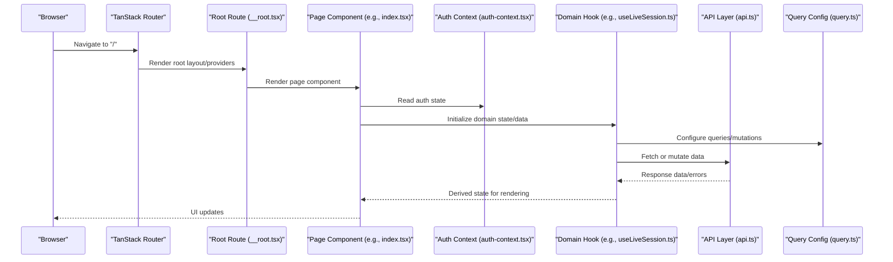
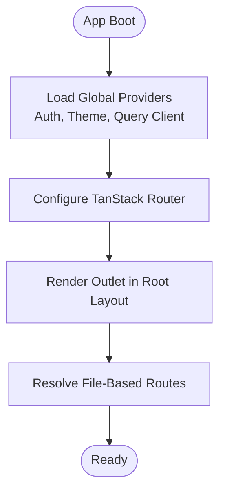
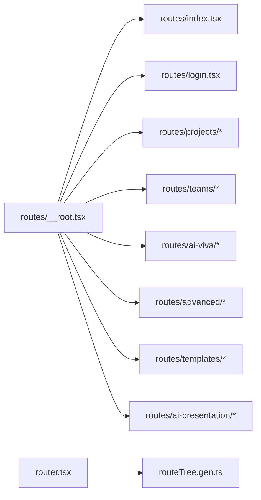
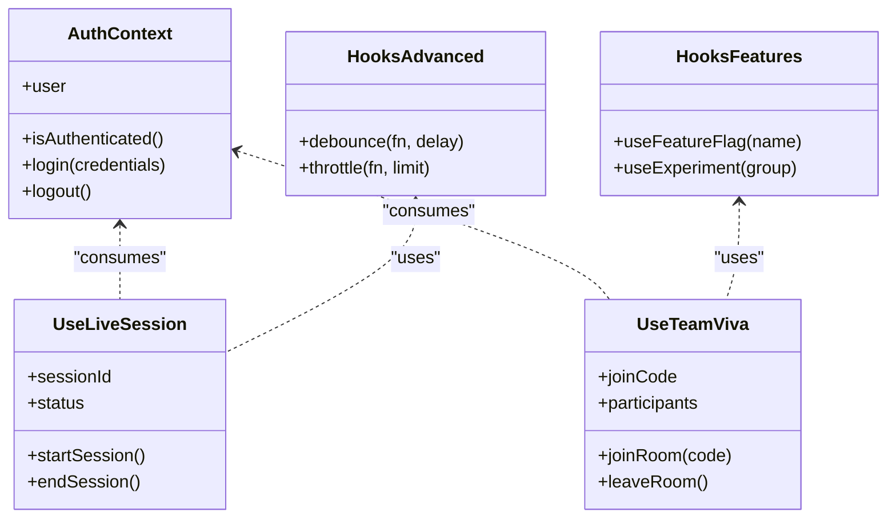
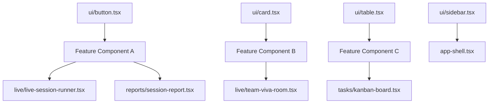
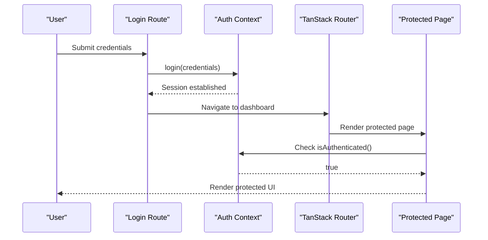
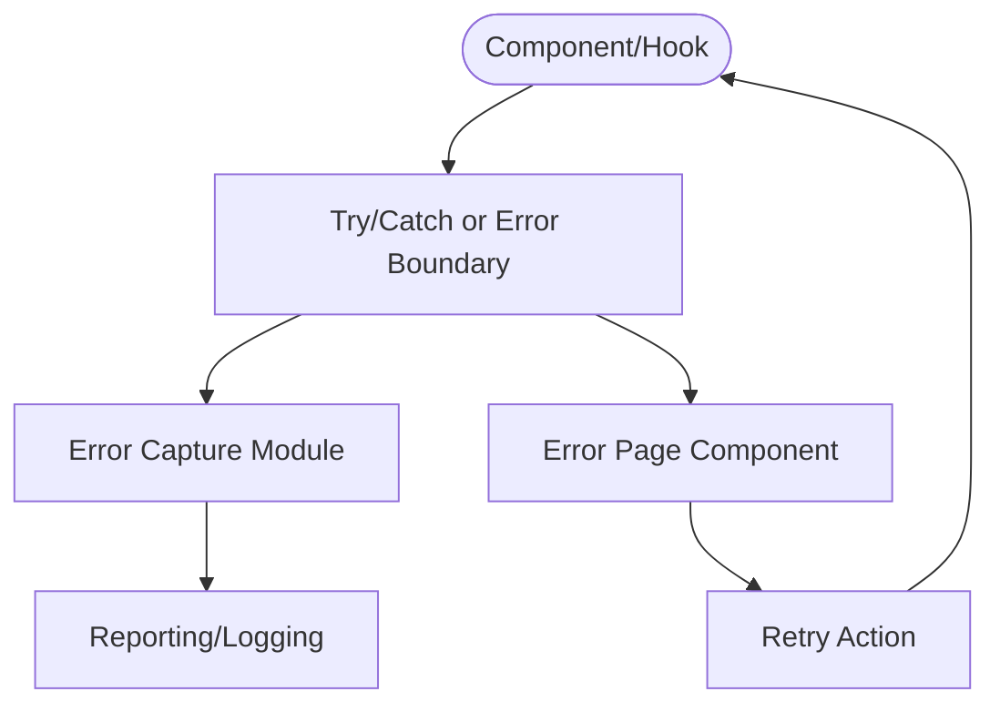
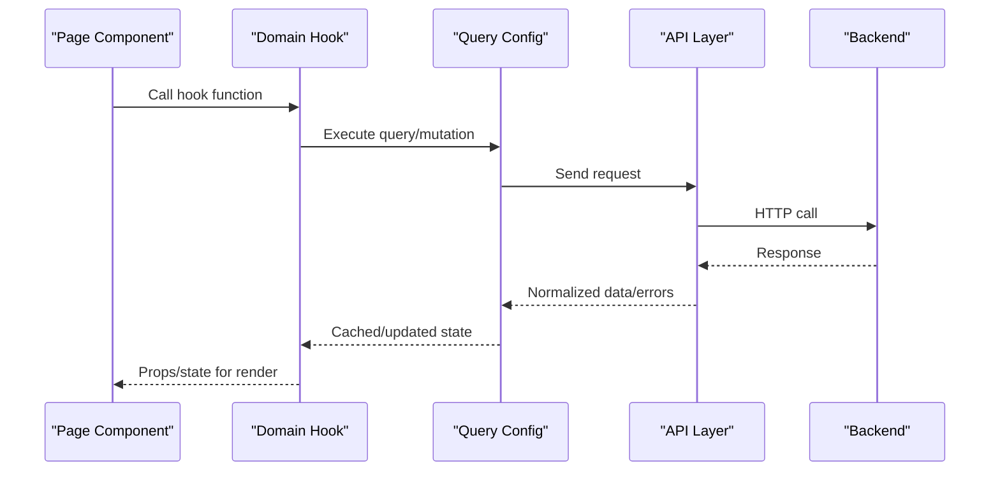
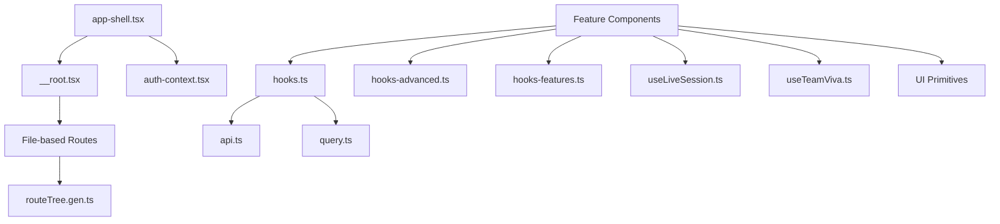

# Frontend Architecture

<cite>
**Referenced Files in This Document**
- [app-shell.tsx](file://src/components/app-shell.tsx)
- [router.tsx](file://src/router.tsx)
- [__root.tsx](file://src/routes/__root.tsx)
- [index.tsx](file://src/routes/index.tsx)
- [login.tsx](file://src/routes/login.tsx)
- [auth-context.tsx](file://src/lib/auth-context.tsx)
- [hooks.ts](file://src/lib/hooks.ts)
- [hooks-advanced.ts](file://src/lib/hooks-advanced.ts)
- [hooks-features.ts](file://src/lib/hooks-features.ts)
- [api.ts](file://src/lib/api.ts)
- [query.ts](file://src/lib/query.ts)
- [error-capture.ts](file://src/lib/error-capture.ts)
- [error-page.ts](file://src/lib/error-page.ts)
- [useLiveSession.ts](file://src/lib/useLiveSession.ts)
- [useTeamViva.ts](file://src/lib/useTeamViva.ts)
- [live-session-runner.tsx](file://src/components/live/live-session-runner.tsx)
- [team-viva-room.tsx](file://src/components/live/team-viva-room.tsx)
- [kanban-board.tsx](file://src/components/tasks/kanban-board.tsx)
- [session-report.tsx](file://src/components/reports/session-report.tsx)
- [button.tsx](file://src/components/ui/button.tsx)
- [card.tsx](file://src/components/ui/card.tsx)
- [table.tsx](file://src/components/ui/table.tsx)
- [sidebar.tsx](file://src/components/ui/sidebar.tsx)
- [routeTree.gen.ts](file://src/routeTree.gen.ts)
</cite>

## Table of Contents
1. [Introduction](#introduction)
2. [Project Structure](#project-structure)
3. [Core Components](#core-components)
4. [Architecture Overview](#architecture-overview)
5. [Detailed Component Analysis](#detailed-component-analysis)
6. [Dependency Analysis](#dependency-analysis)
7. [Performance Considerations](#performance-considerations)
8. [Troubleshooting Guide](#troubleshooting-guide)
9. [Conclusion](#conclusion)

## Introduction
This document describes the React and TypeScript frontend architecture, focusing on:
- The component hierarchy rooted at the application shell
- Routing organization using TanStack Router with file-based route definitions
- State management patterns via Context API and custom hooks
- Modular component library structure (feature components, UI primitives, and shared utilities)
- Separation of concerns between UI, business logic, and utilities
- Authentication flow integration and error handling strategies
- Performance optimization techniques used across the codebase

The goal is to provide a clear mental model for both new contributors and experienced developers navigating the system.

## Project Structure
The frontend follows a feature-oriented layout with clear separation between routes, components, hooks, and libraries:
- Routes are organized under src/routes, including nested folders for features like advanced, ai-presentation, ai-viva, projects, teams, and templates. A root route (__root.tsx) provides global layout and providers.
- Components live under src/components, split into feature-specific folders (e.g., live, tasks, reports), reusable UI primitives under src/components/ui, and top-level layout components such as app-shell.tsx.
- Business logic and state are centralized under src/lib, including authentication context, data fetching, query configuration, and domain-specific hooks.
- Generated route tree and router setup are defined in src/routeTree.gen.ts and src/router.tsx respectively.

**Diagram sources**
- [app-shell.tsx](file://src/components/app-shell.tsx)
- [__root.tsx](file://src/routes/__root.tsx)
- [index.tsx](file://src/routes/index.tsx)
- [login.tsx](file://src/routes/login.tsx)
- [routeTree.gen.ts](file://src/routeTree.gen.ts)
- [router.tsx](file://src/router.tsx)
- [auth-context.tsx](file://src/lib/auth-context.tsx)
- [hooks.ts](file://src/lib/hooks.ts)
- [hooks-advanced.ts](file://src/lib/hooks-advanced.ts)
- [hooks-features.ts](file://src/lib/hooks-features.ts)
- [api.ts](file://src/lib/api.ts)
- [query.ts](file://src/lib/query.ts)
- [live-session-runner.tsx](file://src/components/live/live-session-runner.tsx)
- [team-viva-room.tsx](file://src/components/live/team-viva-room.tsx)
- [kanban-board.tsx](file://src/components/tasks/kanban-board.tsx)
- [session-report.tsx](file://src/components/reports/session-report.tsx)
- [button.tsx](file://src/components/ui/button.tsx)
- [card.tsx](file://src/components/ui/card.tsx)
- [table.tsx](file://src/components/ui/table.tsx)
- [sidebar.tsx](file://src/components/ui/sidebar.tsx)

**Section sources**
- [app-shell.tsx](file://src/components/app-shell.tsx)
- [router.tsx](file://src/router.tsx)
- [__root.tsx](file://src/routes/__root.tsx)
- [index.tsx](file://src/routes/index.tsx)
- [login.tsx](file://src/routes/login.tsx)
- [routeTree.gen.ts](file://src/routeTree.gen.ts)

## Core Components
- Application Shell: Provides global layout, navigation, and provider composition. It typically wraps the routing outlet and integrates authentication and theme contexts.
- Root Route: Defines the base layout and global providers for all pages, ensuring consistent chrome and behavior across routes.
- Feature Pages: Organized by domain (projects, teams, ai-viva, etc.), each page composes feature components and hooks to render content.
- Feature Components: Encapsulate domain-specific UI and orchestrate business logic through hooks. Examples include live session runner and team viva room.
- UI Primitives: Reusable building blocks (buttons, cards, tables, sidebar) consumed by feature components to maintain consistency and reduce duplication.

Key responsibilities:
- UI components focus on presentation and user interactions.
- Business logic resides in hooks and lib modules, keeping components lean.
- Utilities handle cross-cutting concerns like API calls, query configuration, and error capture.

**Section sources**
- [app-shell.tsx](file://src/components/app-shell.tsx)
- [__root.tsx](file://src/routes/__root.tsx)
- [index.tsx](file://src/routes/index.tsx)
- [login.tsx](file://src/routes/login.tsx)
- [live-session-runner.tsx](file://src/components/live/live-session-runner.tsx)
- [team-viva-room.tsx](file://src/components/live/team-viva-room.tsx)
- [kanban-board.tsx](file://src/components/tasks/kanban-board.tsx)
- [session-report.tsx](file://src/components/reports/session-report.tsx)
- [button.tsx](file://src/components/ui/button.tsx)
- [card.tsx](file://src/components/ui/card.tsx)
- [table.tsx](file://src/components/ui/table.tsx)
- [sidebar.tsx](file://src/components/ui/sidebar.tsx)

## Architecture Overview
The frontend uses TanStack Router for declarative, file-based routing. The root route sets up global providers and layout, while individual route files define page-level components. The application shell orchestrates high-level concerns such as authentication and theming.

**Diagram sources**
- [router.tsx](file://src/router.tsx)
- [__root.tsx](file://src/routes/__root.tsx)
- [index.tsx](file://src/routes/index.tsx)
- [auth-context.tsx](file://src/lib/auth-context.tsx)
- [useLiveSession.ts](file://src/lib/useLiveSession.ts)
- [api.ts](file://src/lib/api.ts)
- [query.ts](file://src/lib/query.ts)

## Detailed Component Analysis

### Application Shell and Root Layout
- The application shell composes global providers (authentication, theme, possibly analytics) and renders the router outlet.
- The root route defines the base layout and ensures consistent navigation and header/footer across pages.
- Both layers integrate with the generated route tree to resolve dynamic routes.

**Diagram sources**
- [app-shell.tsx](file://src/components/app-shell.tsx)
- [__root.tsx](file://src/routes/__root.tsx)
- [router.tsx](file://src/router.tsx)
- [routeTree.gen.ts](file://src/routeTree.gen.ts)

**Section sources**
- [app-shell.tsx](file://src/components/app-shell.tsx)
- [__root.tsx](file://src/routes/__root.tsx)
- [router.tsx](file://src/router.tsx)
- [routeTree.gen.ts](file://src/routeTree.gen.ts)

### Routing Organization with TanStack Router
- Routes are declared under src/routes with nested directories representing path segments.
- The generated route tree (routeTree.gen.ts) reflects the file-based structure and enables type-safe navigation.
- The router setup wires the root layout and route tree together.

**Diagram sources**
- [__root.tsx](file://src/routes/__root.tsx)
- [index.tsx](file://src/routes/index.tsx)
- [login.tsx](file://src/routes/login.tsx)
- [routeTree.gen.ts](file://src/routeTree.gen.ts)
- [router.tsx](file://src/router.tsx)

**Section sources**
- [__root.tsx](file://src/routes/__root.tsx)
- [index.tsx](file://src/routes/index.tsx)
- [login.tsx](file://src/routes/login.tsx)
- [routeTree.gen.ts](file://src/routeTree.gen.ts)
- [router.tsx](file://src/router.tsx)

### State Management Patterns: Context API and Custom Hooks
- Authentication state is provided via a dedicated context module, enabling global access to user identity and session status.
- Domain-specific hooks encapsulate complex state and side effects (e.g., live sessions, team viva rooms).
- Shared hooks provide cross-cutting functionality (mobile detection, common utilities).

**Diagram sources**
- [auth-context.tsx](file://src/lib/auth-context.tsx)
- [useLiveSession.ts](file://src/lib/useLiveSession.ts)
- [useTeamViva.ts](file://src/lib/useTeamViva.ts)
- [hooks-advanced.ts](file://src/lib/hooks-advanced.ts)
- [hooks-features.ts](file://src/lib/hooks-features.ts)
- [hooks.ts](file://src/lib/hooks.ts)

**Section sources**
- [auth-context.tsx](file://src/lib/auth-context.tsx)
- [useLiveSession.ts](file://src/lib/useLiveSession.ts)
- [useTeamViva.ts](file://src/lib/useTeamViva.ts)
- [hooks-advanced.ts](file://src/lib/hooks-advanced.ts)
- [hooks-features.ts](file://src/lib/hooks-features.ts)
- [hooks.ts](file://src/lib/hooks.ts)

### Modular Component Library Structure
- UI primitives (button, card, table, sidebar) are implemented as small, focused components with consistent props and styling.
- Feature components compose UI primitives and domain hooks to deliver complete screens.
- This separation promotes reusability and testability.

**Diagram sources**
- [button.tsx](file://src/components/ui/button.tsx)
- [card.tsx](file://src/components/ui/card.tsx)
- [table.tsx](file://src/components/ui/table.tsx)
- [sidebar.tsx](file://src/components/ui/sidebar.tsx)
- [live-session-runner.tsx](file://src/components/live/live-session-runner.tsx)
- [team-viva-room.tsx](file://src/components/live/team-viva-room.tsx)
- [kanban-board.tsx](file://src/components/tasks/kanban-board.tsx)
- [session-report.tsx](file://src/components/reports/session-report.tsx)
- [app-shell.tsx](file://src/components/app-shell.tsx)

**Section sources**
- [button.tsx](file://src/components/ui/button.tsx)
- [card.tsx](file://src/components/ui/card.tsx)
- [table.tsx](file://src/components/ui/table.tsx)
- [sidebar.tsx](file://src/components/ui/sidebar.tsx)
- [live-session-runner.tsx](file://src/components/live/live-session-runner.tsx)
- [team-viva-room.tsx](file://src/components/live/team-viva-room.tsx)
- [kanban-board.tsx](file://src/components/tasks/kanban-board.tsx)
- [session-report.tsx](file://src/components/reports/session-report.tsx)
- [app-shell.tsx](file://src/components/app-shell.tsx)

### Authentication Flow Integration
Authentication integrates with the root layout and protected routes:
- The root route initializes the auth context and guards access based on session state.
- Login and signup routes manage credential flows and redirect to protected areas upon success.
- Protected pages read auth state from context and conditionally render content or redirects.

**Diagram sources**
- [__root.tsx](file://src/routes/__root.tsx)
- [login.tsx](file://src/routes/login.tsx)
- [auth-context.tsx](file://src/lib/auth-context.tsx)
- [router.tsx](file://src/router.tsx)

**Section sources**
- [__root.tsx](file://src/routes/__root.tsx)
- [login.tsx](file://src/routes/login.tsx)
- [auth-context.tsx](file://src/lib/auth-context.tsx)
- [router.tsx](file://src/router.tsx)

### Error Handling Strategies
Error handling spans runtime capture, user-facing error pages, and network-level errors:
- Error capture centralizes logging and reporting for unhandled exceptions.
- Error pages provide graceful fallbacks for failed states.
- API layer and query configuration standardize error propagation and retry policies.

**Diagram sources**
- [error-capture.ts](file://src/lib/error-capture.ts)
- [error-page.ts](file://src/lib/error-page.ts)
- [api.ts](file://src/lib/api.ts)
- [query.ts](file://src/lib/query.ts)

**Section sources**
- [error-capture.ts](file://src/lib/error-capture.ts)
- [error-page.ts](file://src/lib/error-page.ts)
- [api.ts](file://src/lib/api.ts)
- [query.ts](file://src/lib/query.ts)

### Data Flow Patterns
Data flows from hooks to components, leveraging query configuration and API modules:
- Domain hooks encapsulate request lifecycle and derive UI state.
- Query configuration centralizes caching, retries, and invalidation.
- API modules abstract HTTP calls and error mapping.

**Diagram sources**
- [useLiveSession.ts](file://src/lib/useLiveSession.ts)
- [useTeamViva.ts](file://src/lib/useTeamViva.ts)
- [query.ts](file://src/lib/query.ts)
- [api.ts](file://src/lib/api.ts)

**Section sources**
- [useLiveSession.ts](file://src/lib/useLiveSession.ts)
- [useTeamViva.ts](file://src/lib/useTeamViva.ts)
- [query.ts](file://src/lib/query.ts)
- [api.ts](file://src/lib/api.ts)

## Dependency Analysis
The following diagram highlights key dependencies among core modules:

**Diagram sources**
- [app-shell.tsx](file://src/components/app-shell.tsx)
- [__root.tsx](file://src/routes/__root.tsx)
- [routeTree.gen.ts](file://src/routeTree.gen.ts)
- [auth-context.tsx](file://src/lib/auth-context.tsx)
- [hooks.ts](file://src/lib/hooks.ts)
- [hooks-advanced.ts](file://src/lib/hooks-advanced.ts)
- [hooks-features.ts](file://src/lib/hooks-features.ts)
- [useLiveSession.ts](file://src/lib/useLiveSession.ts)
- [useTeamViva.ts](file://src/lib/useTeamViva.ts)
- [api.ts](file://src/lib/api.ts)
- [query.ts](file://src/lib/query.ts)

**Section sources**
- [app-shell.tsx](file://src/components/app-shell.tsx)
- [__root.tsx](file://src/routes/__root.tsx)
- [routeTree.gen.ts](file://src/routeTree.gen.ts)
- [auth-context.tsx](file://src/lib/auth-context.tsx)
- [hooks.ts](file://src/lib/hooks.ts)
- [hooks-advanced.ts](file://src/lib/hooks-advanced.ts)
- [hooks-features.ts](file://src/lib/hooks-features.ts)
- [useLiveSession.ts](file://src/lib/useLiveSession.ts)
- [useTeamViva.ts](file://src/lib/useTeamViva.ts)
- [api.ts](file://src/lib/api.ts)
- [query.ts](file://src/lib/query.ts)

## Performance Considerations
- Prefer memoization and derived state in hooks to avoid unnecessary recalculations.
- Leverage query caching and selective refetching to minimize network requests.
- Use lazy loading for heavy route segments where feasible.
- Keep UI primitives small and pure; avoid passing large objects down the tree without memoization.
- Debounce/throttle expensive operations (search, resize) using advanced hooks.
- Monitor bundle size and tree-shake unused imports.

[No sources needed since this section provides general guidance]

## Troubleshooting Guide
Common issues and strategies:
- Unhandled exceptions: Ensure error capture is initialized early and logs stack traces.
- Network failures: Verify API error mapping and query retry/backoff settings.
- Authentication loops: Confirm that auth guards and redirects are correctly ordered in the root layout.
- Stale data: Validate cache invalidation keys and manual refetch triggers.

**Section sources**
- [error-capture.ts](file://src/lib/error-capture.ts)
- [error-page.ts](file://src/lib/error-page.ts)
- [api.ts](file://src/lib/api.ts)
- [query.ts](file://src/lib/query.ts)
- [__root.tsx](file://src/routes/__root.tsx)

## Conclusion
The frontend architecture emphasizes clear separation of concerns:
- UI components remain presentational and composable.
- Business logic is encapsulated in domain hooks and shared utilities.
- Routing is declarative and type-safe via TanStack Router.
- State and data flows are standardized through context and query configuration.
This structure supports scalability, maintainability, and performance across feature-rich applications.

[No sources needed since this section summarizes without analyzing specific files]