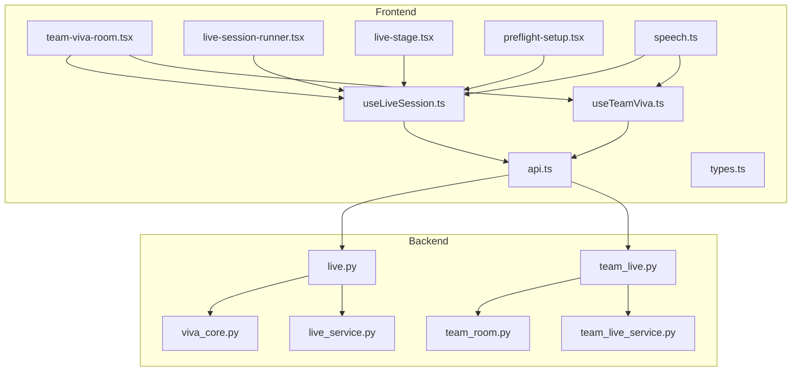
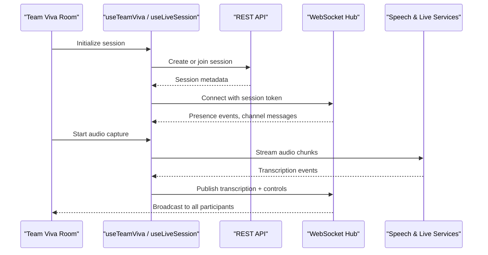
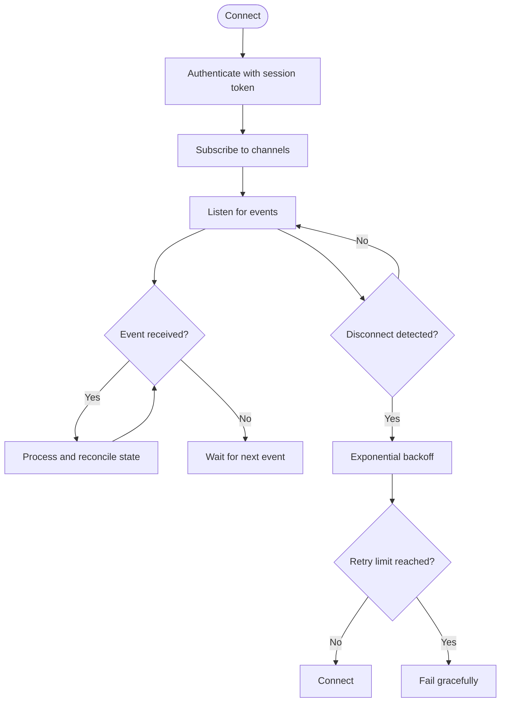
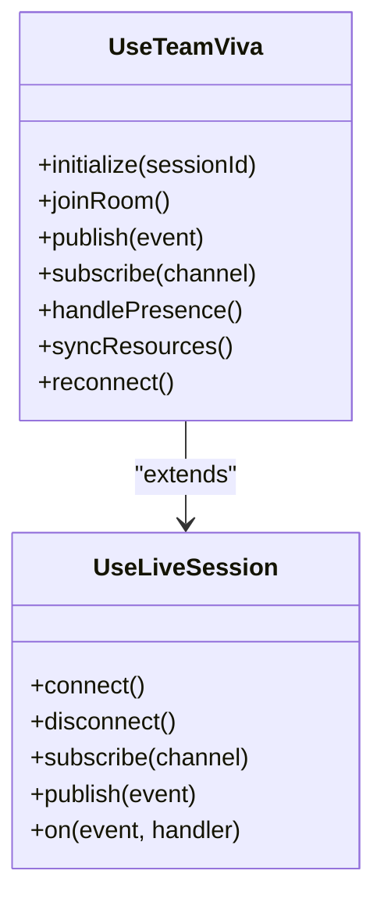
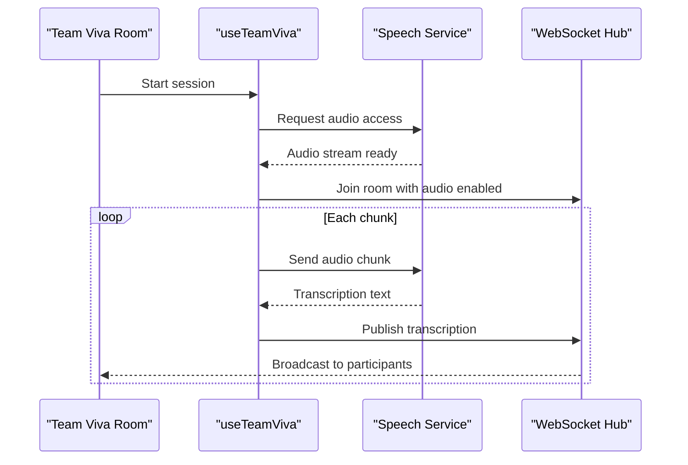
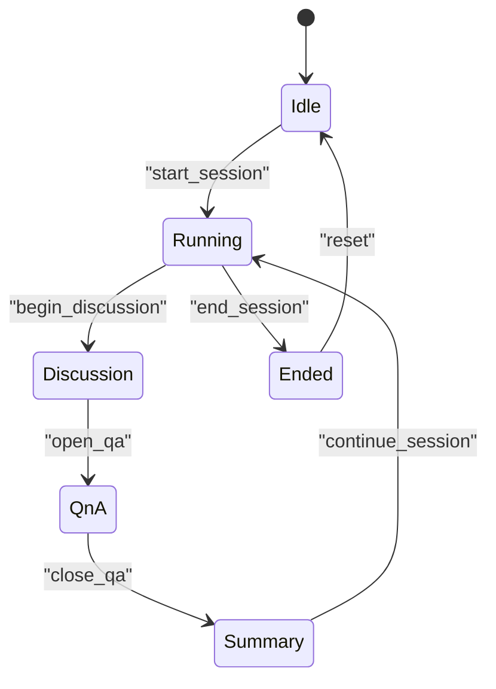
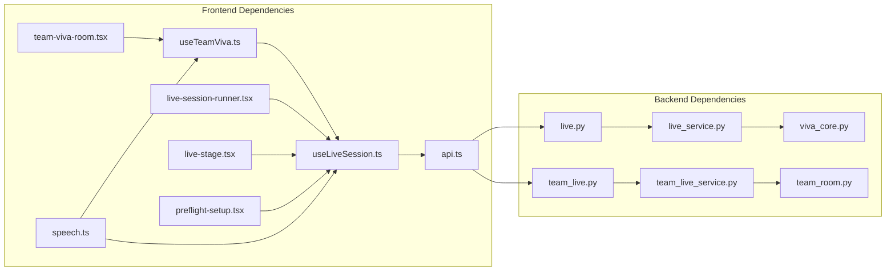

# Real-Time Features

<cite>
**Referenced Files in This Document**
- [useLiveSession.ts](file://src/lib/useLiveSession.ts)
- [useTeamViva.ts](file://src/lib/useTeamViva.ts)
- [team-viva-room.tsx](file://src/components/live/team-viva-room.tsx)
- [live-session-runner.tsx](file://src/components/live/live-session-runner.tsx)
- [live-stage.tsx](file://src/components/live/live-stage.tsx)
- [preflight-setup.tsx](file://src/components/live/preflight-setup.tsx)
- [api.ts](file://src/lib/api.ts)
- [speech.ts](file://src/lib/speech.ts)
- [types.ts](file://src/lib/types.ts)
- [hooks-features.ts](file://src/lib/hooks-features.ts)
- [live.py](file://backend/api/live.py)
- [team_live.py](file://backend/api/team_live.py)
- [viva_core.py](file://backend/ai/viva_core.py)
- [team_room.py](file://backend/ai/team_room.py)
- [live_service.py](file://backend/ai/live_service.py)
- [team_live_service.py](file://backend/ai/team_live_service.py)
</cite>

## Table of Contents
1. [Introduction](#introduction)
2. [Project Structure](#project-structure)
3. [Core Components](#core-components)
4. [Architecture Overview](#architecture-overview)
5. [Detailed Component Analysis](#detailed-component-analysis)
6. [Dependency Analysis](#dependency-analysis)
7. [Performance Considerations](#performance-considerations)
8. [Troubleshooting Guide](#troubleshooting-guide)
9. [Conclusion](#conclusion)

## Introduction
This document explains the real-time collaboration system built with WebSockets and React, focusing on live session management, participant coordination, resource synchronization, and the team viva room for collaborative learning. It covers WebSocket connection management, message broadcasting, error recovery strategies, and performance optimizations for real-time data sync. Practical examples are provided for implementing real-time features, handling connection states, and managing concurrent user interactions.

## Project Structure
The real-time features span both frontend (React hooks and components) and backend (FastAPI endpoints and AI services). Key areas include:
- Frontend hooks for live sessions and team viva state management
- UI components orchestrating live sessions and team viva rooms
- Backend APIs for live session lifecycle and team viva orchestration
- AI services powering speech recognition and live processing

**Diagram sources**
- [useLiveSession.ts](file://src/lib/useLiveSession.ts)
- [useTeamViva.ts](file://src/lib/useTeamViva.ts)
- [team-viva-room.tsx](file://src/components/live/team-viva-room.tsx)
- [live-session-runner.tsx](file://src/components/live/live-session-runner.tsx)
- [live-stage.tsx](file://src/components/live/live-stage.tsx)
- [preflight-setup.tsx](file://src/components/live/preflight-setup.tsx)
- [api.ts](file://src/lib/api.ts)
- [speech.ts](file://src/lib/speech.ts)
- [types.ts](file://src/lib/types.ts)
- [live.py](file://backend/api/live.py)
- [team_live.py](file://backend/api/team_live.py)
- [viva_core.py](file://backend/ai/viva_core.py)
- [team_room.py](file://backend/ai/team_room.py)
- [live_service.py](file://backend/ai/live_service.py)
- [team_live_service.py](file://backend/ai/team_live_service.py)

**Section sources**
- [useLiveSession.ts](file://src/lib/useLiveSession.ts)
- [useTeamViva.ts](file://src/lib/useTeamViva.ts)
- [team-viva-room.tsx](file://src/components/live/team-viva-room.tsx)
- [live-session-runner.tsx](file://src/components/live/live-session-runner.tsx)
- [live-stage.tsx](file://src/components/live/live-stage.tsx)
- [preflight-setup.tsx](file://src/components/live/preflight-setup.tsx)
- [api.ts](file://src/lib/api.ts)
- [speech.ts](file://src/lib/speech.ts)
- [types.ts](file://src/lib/types.ts)
- [live.py](file://backend/api/live.py)
- [team_live.py](file://backend/api/team_live.py)
- [viva_core.py](file://backend/ai/viva_core.py)
- [team_room.py](file://backend/ai/team_room.py)
- [live_service.py](file://backend/ai/live_service.py)
- [team_live_service.py](file://backend/ai/team_live_service.py)

## Core Components
- Live Session Hook: Manages WebSocket connections, event subscriptions, reconnection logic, and session state for a single live session.
- Team Viva Hook: Extends live session capabilities to coordinate multiple participants, broadcast events, and synchronize shared resources within a team viva room.
- Team Viva Room Component: Orchestrates the UI for collaborative learning, including audio capture, transcription display, and participant presence.
- Live Session Runner and Stage: Drive the flow of a live session, manage stages, and integrate with the hooks for real-time updates.
- Preflight Setup: Validates environment and device permissions before starting audio capture and WebSocket connections.
- Speech Utilities: Provide speech-to-text capabilities and handle audio stream processing.
- API Layer: Encapsulates HTTP calls for session creation, joining, and metadata operations.

Key responsibilities:
- Connection lifecycle: connect, subscribe, publish, reconnect, disconnect
- Event-driven communication: typed events for presence, chat, media control, and transcription
- State synchronization: optimistic updates with server reconciliation
- Error handling: network failures, permission denials, and graceful degradation

**Section sources**
- [useLiveSession.ts](file://src/lib/useLiveSession.ts)
- [useTeamViva.ts](file://src/lib/useTeamViva.ts)
- [team-viva-room.tsx](file://src/components/live/team-viva-room.tsx)
- [live-session-runner.tsx](file://src/components/live/live-session-runner.tsx)
- [live-stage.tsx](file://src/components/live/live-stage.tsx)
- [preflight-setup.tsx](file://src/components/live/preflight-setup.tsx)
- [speech.ts](file://src/lib/speech.ts)
- [api.ts](file://src/lib/api.ts)

## Architecture Overview
The system follows an event-driven architecture with a central WebSocket hub coordinating participants. The frontend uses React hooks to encapsulate connection logic and state, while the backend exposes REST endpoints for session setup and WebSocket routing for real-time messaging.

**Diagram sources**
- [team-viva-room.tsx](file://src/components/live/team-viva-room.tsx)
- [useTeamViva.ts](file://src/lib/useTeamViva.ts)
- [useLiveSession.ts](file://src/lib/useLiveSession.ts)
- [api.ts](file://src/lib/api.ts)
- [live.py](file://backend/api/live.py)
- [team_live.py](file://backend/api/team_live.py)
- [speech.ts](file://src/lib/speech.ts)
- [live_service.py](file://backend/ai/live_service.py)
- [team_live_service.py](file://backend/ai/team_live_service.py)

## Detailed Component Analysis

### Live Session Management (useLiveSession)
Responsibilities:
- Establish and maintain WebSocket connections
- Subscribe to session-specific channels
- Handle reconnection with exponential backoff
- Manage local and remote participant presence
- Emit and receive typed events (chat, controls, transcription)

Connection lifecycle:
- Connect: authenticate using session token, subscribe to channels
- Listen: process incoming events and update state
- Publish: send events to the server for broadcasting
- Reconnect: detect disconnects, retry with backoff, resubscribe
- Disconnect: clean up listeners and release resources

Error recovery:
- Network errors trigger automatic reconnection attempts
- Permission errors prompt users to adjust browser settings
- Graceful fallback when audio is unavailable

**Diagram sources**
- [useLiveSession.ts](file://src/lib/useLiveSession.ts)

**Section sources**
- [useLiveSession.ts](file://src/lib/useLiveSession.ts)

### Team Viva Coordination (useTeamViva)
Responsibilities:
- Extend live session capabilities for multi-participant coordination
- Manage shared resources (transcripts, notes, media controls)
- Broadcast participant actions and synchronize state across clients
- Integrate speech recognition streams and transcription events

Participant coordination:
- Presence tracking (join, leave, mute/unmute)
- Role-based permissions (moderator vs participant)
- Conflict resolution for concurrent edits

Resource synchronization:
- Optimistic updates with server reconciliation
- Versioned state to prevent race conditions
- Batched updates to reduce network overhead

**Diagram sources**
- [useTeamViva.ts](file://src/lib/useTeamViva.ts)
- [useLiveSession.ts](file://src/lib/useLiveSession.ts)

**Section sources**
- [useTeamViva.ts](file://src/lib/useTeamViva.ts)
- [useLiveSession.ts](file://src/lib/useLiveSession.ts)

### Team Viva Room Component
Responsibilities:
- Orchestrate the collaborative learning interface
- Manage audio capture and transcription display
- Render participant list and presence indicators
- Handle user interactions (mute, share screen, chat)

Real-time audio processing:
- Capture microphone input
- Stream audio chunks to speech recognition service
- Display live transcription with timestamps
- Allow participants to toggle audio sharing

**Diagram sources**
- [team-viva-room.tsx](file://src/components/live/team-viva-room.tsx)
- [useTeamViva.ts](file://src/lib/useTeamViva.ts)
- [speech.ts](file://src/lib/speech.ts)

**Section sources**
- [team-viva-room.tsx](file://src/components/live/team-viva-room.tsx)
- [useTeamViva.ts](file://src/lib/useTeamViva.ts)
- [speech.ts](file://src/lib/speech.ts)

### Live Session Runner and Stage
Responsibilities:
- Drive the progression of a live session through predefined stages
- Manage transitions between phases (intro, discussion, Q&A, summary)
- Coordinate with hooks to update UI based on session state

Stage management:
- Validate stage transitions
- Notify participants of stage changes
- Persist stage progress for session recovery

**Diagram sources**
- [live-session-runner.tsx](file://src/components/live/live-session-runner.tsx)
- [live-stage.tsx](file://src/components/live/live-stage.tsx)

**Section sources**
- [live-session-runner.tsx](file://src/components/live/live-session-runner.tsx)
- [live-stage.tsx](file://src/components/live/live-stage.tsx)

### Preflight Setup
Responsibilities:
- Check browser compatibility and permissions
- Validate audio device availability
- Prepare WebSocket connection parameters

User guidance:
- Prompt for microphone permissions
- Display error messages for missing dependencies
- Provide fallback options when features are unavailable

**Section sources**
- [preflight-setup.tsx](file://src/components/live/preflight-setup.tsx)

### Speech Recognition Integration
Responsibilities:
- Manage audio stream lifecycle
- Encode and transmit audio chunks efficiently
- Parse transcription results and handle partial text

Optimization techniques:
- Chunk size tuning for latency vs accuracy
- Buffering strategies to handle network jitter
- Language detection and switching

**Section sources**
- [speech.ts](file://src/lib/speech.ts)

### API Layer
Responsibilities:
- Abstract HTTP requests for session management
- Handle authentication and authorization
- Provide typed interfaces for frontend consumption

Endpoints used:
- Create session
- Join session with code
- Update session metadata
- Fetch session history

**Section sources**
- [api.ts](file://src/lib/api.ts)

## Dependency Analysis
The real-time system has clear separation between frontend hooks/components and backend services. Dependencies are minimized through well-defined interfaces and event contracts.

**Diagram sources**
- [useLiveSession.ts](file://src/lib/useLiveSession.ts)
- [useTeamViva.ts](file://src/lib/useTeamViva.ts)
- [team-viva-room.tsx](file://src/components/live/team-viva-room.tsx)
- [live-session-runner.tsx](file://src/components/live/live-session-runner.tsx)
- [live-stage.tsx](file://src/components/live/live-stage.tsx)
- [preflight-setup.tsx](file://src/components/live/preflight-setup.tsx)
- [api.ts](file://src/lib/api.ts)
- [speech.ts](file://src/lib/speech.ts)
- [live.py](file://backend/api/live.py)
- [team_live.py](file://backend/api/team_live.py)
- [live_service.py](file://backend/ai/live_service.py)
- [team_live_service.py](file://backend/ai/team_live_service.py)
- [viva_core.py](file://backend/ai/viva_core.py)
- [team_room.py](file://backend/ai/team_room.py)

**Section sources**
- [useLiveSession.ts](file://src/lib/useLiveSession.ts)
- [useTeamViva.ts](file://src/lib/useTeamViva.ts)
- [team-viva-room.tsx](file://src/components/live/team-viva-room.tsx)
- [live-session-runner.tsx](file://src/components/live/live-session-runner.tsx)
- [live-stage.tsx](file://src/components/live/live-stage.tsx)
- [preflight-setup.tsx](file://src/components/live/preflight-setup.tsx)
- [api.ts](file://src/lib/api.ts)
- [speech.ts](file://src/lib/speech.ts)
- [live.py](file://backend/api/live.py)
- [team_live.py](file://backend/api/team_live.py)
- [live_service.py](file://backend/ai/live_service.py)
- [team_live_service.py](file://backend/ai/team_live_service.py)
- [viva_core.py](file://backend/ai/viva_core.py)
- [team_room.py](file://backend/ai/team_room.py)

## Performance Considerations
- Message batching: Group multiple updates into single broadcasts to reduce network overhead
- Debouncing user inputs: Prevent excessive event emission during rapid interactions
- Efficient audio streaming: Optimize chunk sizes and encoding formats for low latency
- Connection pooling: Reuse WebSocket connections across components where possible
- Memory management: Clean up event listeners and audio streams when components unmount
- Lazy loading: Load heavy components only when needed to improve initial load time
- State optimization: Use selective updates and memoization to minimize re-renders

[No sources needed since this section provides general guidance]

## Troubleshooting Guide
Common issues and solutions:
- WebSocket connection failures: Check network connectivity, firewall settings, and server status
- Audio permission denied: Guide users to browser settings to grant microphone access
- Transcription delays: Adjust chunk sizes and check server load
- Participant sync conflicts: Implement conflict resolution strategies and version checking
- Memory leaks: Ensure proper cleanup of event listeners and media streams
- Browser compatibility: Test across different browsers and provide fallbacks

Debugging tips:
- Enable detailed logging for WebSocket events
- Monitor connection health with heartbeat signals
- Use browser developer tools to inspect network traffic
- Implement error boundaries to catch and display runtime errors

**Section sources**
- [useLiveSession.ts](file://src/lib/useLiveSession.ts)
- [useTeamViva.ts](file://src/lib/useTeamViva.ts)
- [team-viva-room.tsx](file://src/components/live/team-viva-room.tsx)
- [speech.ts](file://src/lib/speech.ts)

## Conclusion
The real-time collaboration system provides a robust foundation for live sessions and team viva rooms through WebSockets and React. The architecture emphasizes event-driven communication, efficient resource synchronization, and resilient connection management. By following the patterns and best practices outlined in this document, developers can implement scalable real-time features that support collaborative learning environments with high reliability and performance.

[No sources needed since this section summarizes without analyzing specific files]