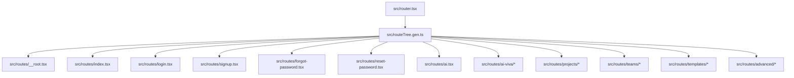
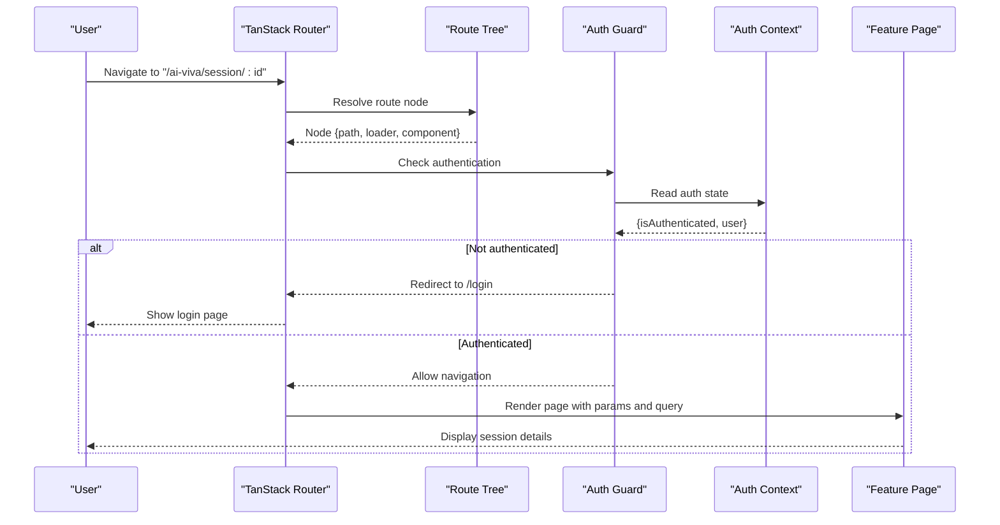
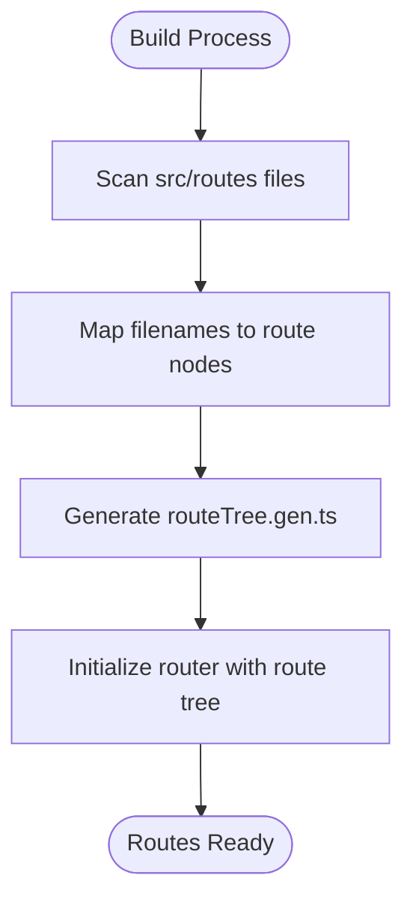
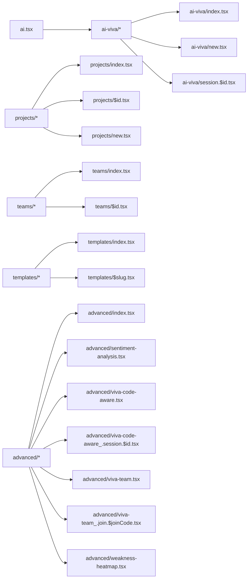
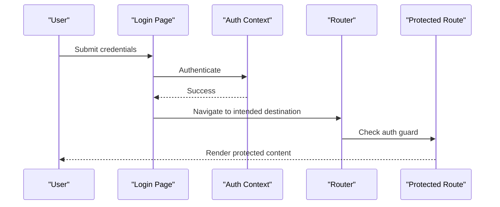
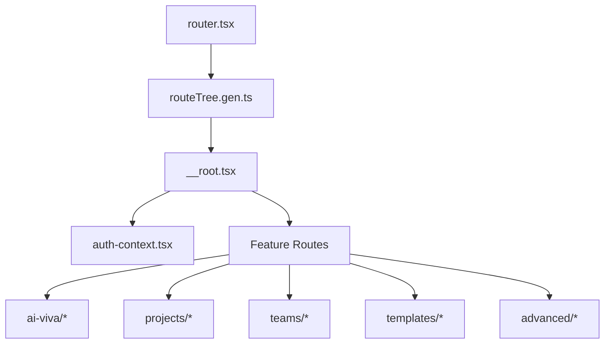

# Routing & Navigation

<cite>
**Referenced Files in This Document**
- [router.tsx](file://src/router.tsx)
- [routeTree.gen.ts](file://src/routeTree.gen.ts)
- [__root.tsx](file://src/routes/__root.tsx)
- [index.tsx](file://src/routes/index.tsx)
- [login.tsx](file://src/routes/login.tsx)
- [signup.tsx](file://src/routes/signup.tsx)
- [forgot-password.tsx](file://src/routes/forgot-password.tsx)
- [reset-password.tsx](file://src/routes/reset-password.tsx)
- [ai.tsx](file://src/routes/ai.tsx)
- [ai-viva/index.tsx](file://src/routes/ai-viva/index.tsx)
- [ai-viva/new.tsx](file://src/routes/ai-viva/new.tsx)
- [ai-viva/session.$id.tsx](file://src/routes/ai-viva/session.$id.tsx)
- [projects/index.tsx](file://src/routes/projects/index.tsx)
- [projects/$id.tsx](file://src/routes/projects/$id.tsx)
- [projects/new.tsx](file://src/routes/projects/new.tsx)
- [teams/index.tsx](file://src/routes/teams/index.tsx)
- [teams/$id.tsx](file://src/routes/teams/$id.tsx)
- [templates/index.tsx](file://src/routes/templates/index.tsx)
- [templates/$slug.tsx](file://src/routes/templates/$slug.tsx)
- [advanced/index.tsx](file://src/routes/advanced/index.tsx)
- [advanced/sentiment-analysis.tsx](file://src/routes/advanced/sentiment-analysis.tsx)
- [advanced/viva-code-aware.tsx](file://src/routes/advanced/viva-code-aware.tsx)
- [advanced/viva-code-aware_.session.$id.tsx](file://src/routes/advanced/viva-code-aware_.session.$id.tsx)
- [advanced/viva-team.tsx](file://src/routes/advanced/viva-team.tsx)
- [advanced/viva-team_.join.$joinCode.tsx](file://src/routes/advanced/viva-team_.join.$joinCode.tsx)
- [advanced/weakness-heatmap.tsx](file://src/routes/advanced/weakness-heatmap.tsx)
- [auth-context.tsx](file://src/lib/auth-context.tsx)
</cite>

## Table of Contents
1. [Introduction](#introduction)
2. [Project Structure](#project-structure)
3. [Core Components](#core-components)
4. [Architecture Overview](#architecture-overview)
5. [Detailed Component Analysis](#detailed-component-analysis)
6. [Dependency Analysis](#dependency-analysis)
7. [Performance Considerations](#performance-considerations)
8. [Troubleshooting Guide](#troubleshooting-guide)
9. [Conclusion](#conclusion)

## Introduction
This document explains the TanStack Router-based navigation system used in the application. It covers how routes are organized into feature areas (ai-viva, projects, teams, templates, advanced), how protected routes are implemented using an authentication context, dynamic routing patterns with URL parameters, and programmatic navigation techniques. It also details the route tree generation process, lazy loading strategies for code splitting, and navigation guards for access control. Examples include route transitions, query parameter handling, and integration with the authentication flow.

## Project Structure
The routing is organized by feature directories under src/routes, with a generated route tree that maps file paths to route definitions. The root route provides shared layout and global providers, while feature routes encapsulate domain-specific pages and nested subroutes. Authentication-related routes live at the top level, and protected features are gated via an authentication context.

**Diagram sources**
- [router.tsx:1-200](file://src/router.tsx#L1-L200)
- [routeTree.gen.ts:1-200](file://src/routeTree.gen.ts#L1-L200)
- [__root.tsx:1-200](file://src/routes/__root.tsx#L1-L200)
- [index.tsx:1-200](file://src/routes/index.ts#L1-L200)
- [login.tsx:1-200](file://src/routes/login.tsx#L1-L200)
- [signup.tsx:1-200](file://src/routes/signup.tsx#L1-L200)
- [forgot-password.tsx:1-200](file://src/routes/forgot-password.tsx#L1-L200)
- [reset-password.tsx:1-200](file://src/routes/reset-password.tsx#L1-L200)
- [ai.tsx:1-200](file://src/routes/ai.tsx#L1-L200)
- [ai-viva/index.tsx:1-200](file://src/routes/ai-viva/index.tsx#L1-L200)
- [ai-viva/new.tsx:1-200](file://src/routes/ai-viva/new.tsx#L1-L200)
- [ai-viva/session.$id.tsx:1-200](file://src/routes/ai-viva/session.$id.tsx#L1-L200)
- [projects/index.tsx:1-200](file://src/routes/projects/index.tsx#L1-L200)
- [projects/$id.tsx:1-200](file://src/routes/projects/$id.tsx#L1-L200)
- [projects/new.tsx:1-200](file://src/routes/projects/new.tsx#L1-L200)
- [teams/index.tsx:1-200](file://src/routes/teams/index.tsx#L1-L200)
- [teams/$id.tsx:1-200](file://src/routes/teams/$id.tsx#L1-L200)
- [templates/index.tsx:1-200](file://src/routes/templates/index.tsx#L1-L200)
- [templates/$slug.tsx:1-200](file://src/routes/templates/$slug.tsx#L1-L200)
- [advanced/index.tsx:1-200](file://src/routes/advanced/index.tsx#L1-L200)
- [advanced/sentiment-analysis.tsx:1-200](file://src/routes/advanced/sentiment-analysis.tsx#L1-L200)
- [advanced/viva-code-aware.tsx:1-200](file://src/routes/advanced/viva-code-aware.tsx#L1-L200)
- [advanced/viva-code-aware_.session.$id.tsx:1-200](file://src/routes/advanced/viva-code-aware_.session.$id.tsx#L1-L200)
- [advanced/viva-team.tsx:1-200](file://src/routes/advanced/viva-team.tsx#L1-L200)
- [advanced/viva-team_.join.$joinCode.tsx:1-200](file://src/routes/advanced/viva-team_.join.$joinCode.tsx#L1-L200)
- [advanced/weakness-heatmap.tsx:1-200](file://src/routes/advanced/weakness-heatmap.tsx#L1-L200)

**Section sources**
- [router.tsx:1-200](file://src/router.tsx#L1-L200)
- [routeTree.gen.ts:1-200](file://src/routeTree.gen.ts#L1-L200)
- [__root.tsx:1-200](file://src/routes/__root.tsx#L1-L200)

## Core Components
- Route configuration: The router entry wires up TanStack Router with the generated route tree and optional providers.
- Root route: Provides global layout, error boundaries, and authentication context consumers.
- Feature routes: Organized by feature folders with index files for list views and parameterized files for detail views.
- Authentication context: Centralizes user state and guards for protected routes.

Key responsibilities:
- Define route hierarchy and path segments.
- Provide data loaders or fetchers per route.
- Implement navigation guards based on authentication state.
- Enable lazy loading for code splitting.

**Section sources**
- [router.tsx:1-200](file://src/router.tsx#L1-L200)
- [__root.tsx:1-200](file://src/routes/__root.tsx#L1-L200)
- [auth-context.tsx:1-200](file://src/lib/auth-context.tsx#L1-L200)

## Architecture Overview
The navigation architecture centers around a generated route tree that maps file paths to route nodes. The router initializes with this tree and applies global providers. Protected routes check the authentication context before rendering content. Dynamic routes use URL parameters to render specific resources. Lazy loading is applied to split bundles per route.

**Diagram sources**
- [router.tsx:1-200](file://src/router.tsx#L1-L200)
- [routeTree.gen.ts:1-200](file://src/routeTree.gen.ts#L1-L200)
- [auth-context.tsx:1-200](file://src/lib/auth-context.tsx#L1-L200)
- [ai-viva/session.$id.tsx:1-200](file://src/routes/ai-viva/session.$id.tsx#L1-L200)

## Detailed Component Analysis

### Route Tree Generation
The build process generates a strongly-typed route tree from the file structure under src/routes. Each file becomes a route node with its path inferred from the filename. Index files represent default children, and parameterized files (e.g., $id, $slug) become dynamic segments.

**Diagram sources**
- [routeTree.gen.ts:1-200](file://src/routeTree.gen.ts#L1-L200)

**Section sources**
- [routeTree.gen.ts:1-200](file://src/routeTree.gen.ts#L1-L200)

### Root Route and Global Layout
The root route defines the application shell, global providers, and error boundaries. It consumes the authentication context to provide consistent UI behavior across all routes.

Responsibilities:
- Wrap child routes with layout components.
- Provide global state and services.
- Handle global errors and redirects.

**Section sources**
- [__root.tsx:1-200](file://src/routes/__root.tsx#L1-L200)
- [auth-context.tsx:1-200](file://src/lib/auth-context.tsx#L1-L200)

### Authentication Context and Protected Routes
Protected routes rely on the authentication context to determine access. Guards can be implemented at the route level or within page components to enforce authorization.

Patterns:
- Use context to read current user and roles.
- Redirect unauthenticated users to login.
- Optionally enforce role-based access for specific routes.

**Section sources**
- [auth-context.tsx:1-200](file://src/lib/auth-context.tsx#L1-L200)
- [login.tsx:1-200](file://src/routes/login.tsx#L1-L200)
- [signup.tsx:1-200](file://src/routes/signup.tsx#L1-L200)
- [forgot-password.tsx:1-200](file://src/routes/forgot-password.tsx#L1-L200)
- [reset-password.tsx:1-200](file://src/routes/reset-password.tsx#L1-L200)

### Dynamic Routing Patterns
Dynamic segments are defined using parameterized filenames. For example, session.$id.tsx captures the id segment, enabling resource-specific rendering.

Examples:
- ai-viva/session.$id.tsx: Renders a specific viva session by id.
- projects/$id.tsx: Renders project details by id.
- templates/$slug.tsx: Renders template details by slug.

Query parameters are handled through the router’s search API, allowing filtering and state-driven UI updates without full reloads.

**Section sources**
- [ai-viva/session.$id.tsx:1-200](file://src/routes/ai-viva/session.$id.tsx#L1-L200)
- [projects/$id.tsx:1-200](file://src/routes/projects/$id.tsx#L1-L200)
- [templates/$slug.tsx:1-200](file://src/routes/templates/$slug.tsx#L1-L200)

### Programmatic Navigation Techniques
Navigation can be triggered programmatically after actions such as form submissions or successful API calls. Typical flows include:
- Redirecting to a dashboard after login.
- Navigating to a newly created resource.
- Returning to previous pages after cancellations.

Best practices:
- Use router APIs for reliable navigation.
- Preserve query parameters when appropriate.
- Handle navigation errors gracefully.

**Section sources**
- [login.tsx:1-200](file://src/routes/login.tsx#L1-L200)
- [projects/new.tsx:1-200](file://src/routes/projects/new.tsx#L1-L200)

### Feature Areas: Nested Routes
Each feature area has a dedicated folder with index and parameterized routes.

- ai-viva: Session management and creation.
- projects: Project listing and details.
- teams: Team listing and details.
- templates: Template browsing and selection.
- advanced: Specialized features like sentiment analysis, code-aware viva, team viva, and weakness heatmap.

**Diagram sources**
- [ai.tsx:1-200](file://src/routes/ai.tsx#L1-L200)
- [ai-viva/index.tsx:1-200](file://src/routes/ai-viva/index.tsx#L1-L200)
- [ai-viva/new.tsx:1-200](file://src/routes/ai-viva/new.tsx#L1-L200)
- [ai-viva/session.$id.tsx:1-200](file://src/routes/ai-viva/session.$id.tsx#L1-L200)
- [projects/index.tsx:1-200](file://src/routes/projects/index.tsx#L1-L200)
- [projects/$id.tsx:1-200](file://src/routes/projects/$id.tsx#L1-L200)
- [projects/new.tsx:1-200](file://src/routes/projects/new.tsx#L1-L200)
- [teams/index.tsx:1-200](file://src/routes/teams/index.tsx#L1-L200)
- [teams/$id.tsx:1-200](file://src/routes/teams/$id.tsx#L1-L200)
- [templates/index.tsx:1-200](file://src/routes/templates/index.tsx#L1-L200)
- [templates/$slug.tsx:1-200](file://src/routes/templates/$slug.tsx#L1-L200)
- [advanced/index.tsx:1-200](file://src/routes/advanced/index.tsx#L1-L200)
- [advanced/sentiment-analysis.tsx:1-200](file://src/routes/advanced/sentiment-analysis.tsx#L1-L200)
- [advanced/viva-code-aware.tsx:1-200](file://src/routes/advanced/viva-code-aware.tsx#L1-L200)
- [advanced/viva-code-aware_.session.$id.tsx:1-200](file://src/routes/advanced/viva-code-aware_.session.$id.tsx#L1-L200)
- [advanced/viva-team.tsx:1-200](file://src/routes/advanced/viva-team.tsx#L1-L200)
- [advanced/viva-team_.join.$joinCode.tsx:1-200](file://src/routes/advanced/viva-team_.join.$joinCode.tsx#L1-L200)
- [advanced/weakness-heatmap.tsx:1-200](file://src/routes/advanced/weakness-heatmap.tsx#L1-L200)

**Section sources**
- [ai-viva/index.tsx:1-200](file://src/routes/ai-viva/index.tsx#L1-L200)
- [ai-viva/new.tsx:1-200](file://src/routes/ai-viva/new.tsx#L1-L200)
- [ai-viva/session.$id.tsx:1-200](file://src/routes/ai-viva/session.$id.tsx#L1-L200)
- [projects/index.tsx:1-200](file://src/routes/projects/index.tsx#L1-L200)
- [projects/$id.tsx:1-200](file://src/routes/projects/$id.tsx#L1-L200)
- [projects/new.tsx:1-200](file://src/routes/projects/new.tsx#L1-L200)
- [teams/index.tsx:1-200](file://src/routes/teams/index.tsx#L1-L200)
- [teams/$id.tsx:1-200](file://src/routes/teams/$id.tsx#L1-L200)
- [templates/index.tsx:1-200](file://src/routes/templates/index.tsx#L1-L200)
- [templates/$slug.tsx:1-200](file://src/routes/templates/$slug.tsx#L1-L200)
- [advanced/index.tsx:1-200](file://src/routes/advanced/index.tsx#L1-L200)
- [advanced/sentiment-analysis.tsx:1-200](file://src/routes/advanced/sentiment-analysis.tsx#L1-L200)
- [advanced/viva-code-aware.tsx:1-200](file://src/routes/advanced/viva-code-aware.tsx#L1-L200)
- [advanced/viva-code-aware_.session.$id.tsx:1-200](file://src/routes/advanced/viva-code-aware_.session.$id.tsx#L1-L200)
- [advanced/viva-team.tsx:1-200](file://src/routes/advanced/viva-team.tsx#L1-L200)
- [advanced/viva-team_.join.$joinCode.tsx:1-200](file://src/routes/advanced/viva-team_.join.$joinCode.tsx#L1-L200)
- [advanced/weakness-heatmap.tsx:1-200](file://src/routes/advanced/weakness-heatmap.tsx#L1-L200)

### Route Transitions and Query Parameter Handling
Transitions are managed by the router, which updates the URL and renders the target route. Query parameters enable filtering and state persistence across navigations.

Flow:
- User triggers navigation (click or programmatic).
- Router resolves target route and loads data.
- Page renders with params and query state.

**Section sources**
- [ai-viva/session.$id.tsx:1-200](file://src/routes/ai-viva/session.$id.tsx#L1-L200)
- [projects/index.tsx:1-200](file://src/routes/projects/index.tsx#L1-L200)

### Integration with Authentication Flow
Authentication integrates with routing via guards and redirects. After successful login, users are redirected to intended destinations or dashboards. Logout clears context and redirects to public routes.

**Diagram sources**
- [login.tsx:1-200](file://src/routes/login.tsx#L1-L200)
- [auth-context.tsx:1-200](file://src/lib/auth-context.tsx#L1-L200)

**Section sources**
- [login.tsx:1-200](file://src/routes/login.tsx#L1-L200)
- [auth-context.tsx:1-200](file://src/lib/auth-context.tsx#L1-L200)

## Dependency Analysis
The router depends on the generated route tree and authentication context. Feature routes depend on their respective contexts and services. The root route provides shared dependencies to all child routes.

**Diagram sources**
- [router.tsx:1-200](file://src/router.tsx#L1-L200)
- [routeTree.gen.ts:1-200](file://src/routeTree.gen.ts#L1-L200)
- [__root.tsx:1-200](file://src/routes/__root.tsx#L1-L200)
- [auth-context.tsx:1-200](file://src/lib/auth-context.tsx#L1-L200)

**Section sources**
- [router.tsx:1-200](file://src/router.tsx#L1-L200)
- [routeTree.gen.ts:1-200](file://src/routeTree.gen.ts#L1-L200)
- [__root.tsx:1-200](file://src/routes/__root.tsx#L1-L200)
- [auth-context.tsx:1-200](file://src/lib/auth-context.tsx#L1-L200)

## Performance Considerations
- Lazy Loading: Configure route-level lazy loading to split bundles per feature, reducing initial load time.
- Data Fetching: Use route loaders to prefetch data only when needed.
- Memoization: Memoize expensive computations within route components.
- Error Boundaries: Wrap heavy components with error boundaries to prevent crashes.

[No sources needed since this section provides general guidance]

## Troubleshooting Guide
Common issues and resolutions:
- Route not found: Verify file naming conventions and ensure the route exists in the generated tree.
- Authentication redirect loops: Ensure guards correctly handle authenticated states and intended destinations.
- Missing query parameters: Validate search parsing and default values.
- Lazy loading failures: Check import paths and ensure modules export default components.

**Section sources**
- [auth-context.tsx:1-200](file://src/lib/auth-context.tsx#L1-L200)
- [__root.tsx:1-200](file://src/routes/__root.tsx#L1-L200)

## Conclusion
The TanStack Router setup provides a scalable, type-safe navigation system with clear separation of concerns across feature areas. Protected routes leverage an authentication context for secure access control. Dynamic routing and query parameters enable flexible, data-driven interfaces. Lazy loading and robust error handling contribute to performance and reliability. Following these patterns ensures maintainable and efficient navigation throughout the application.

[No sources needed since this section summarizes without analyzing specific files]