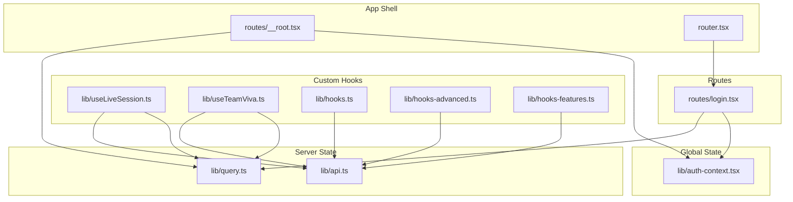
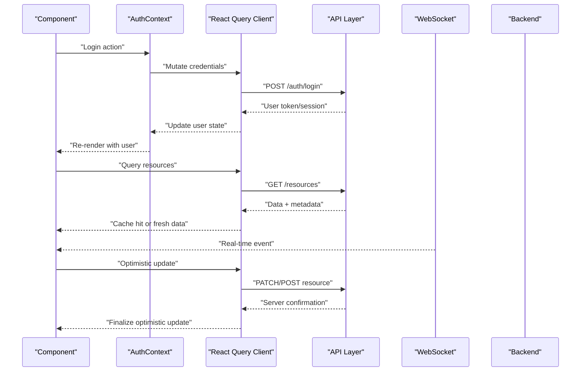
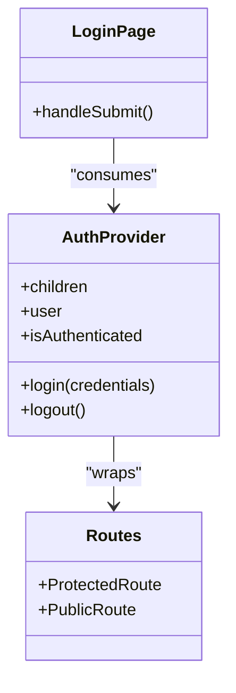
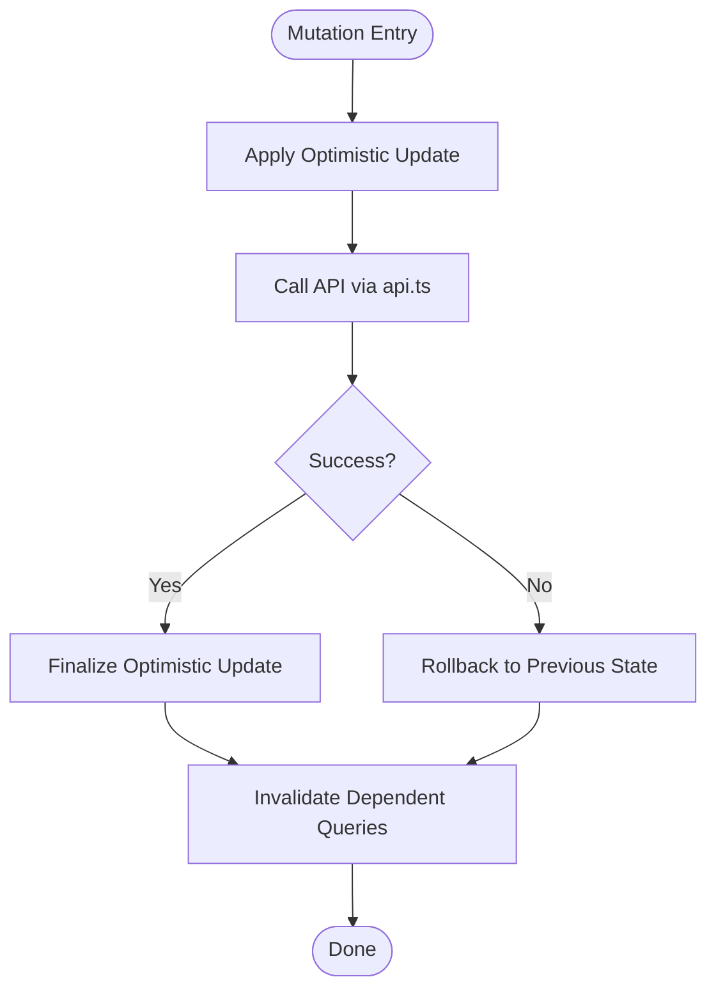
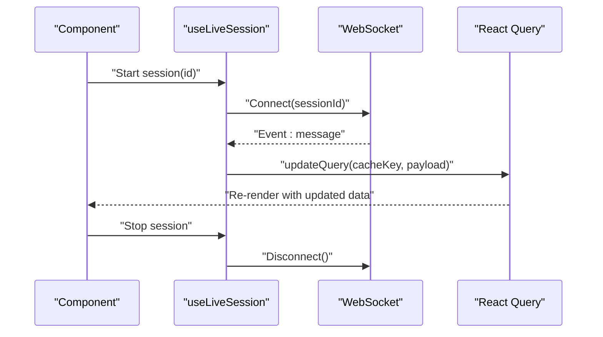
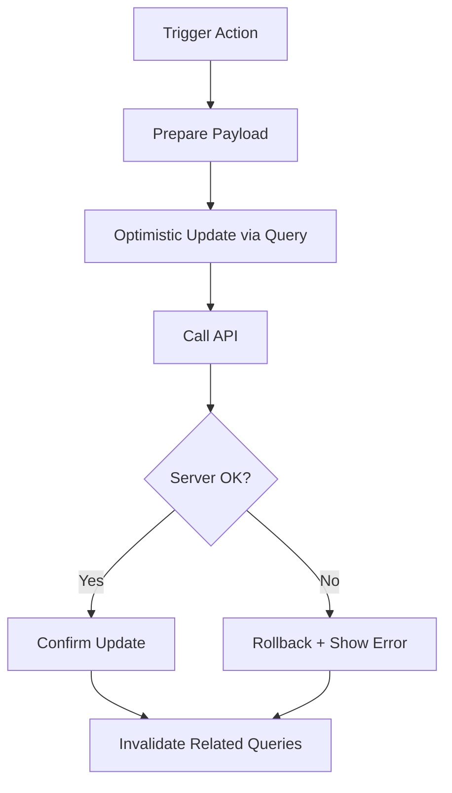
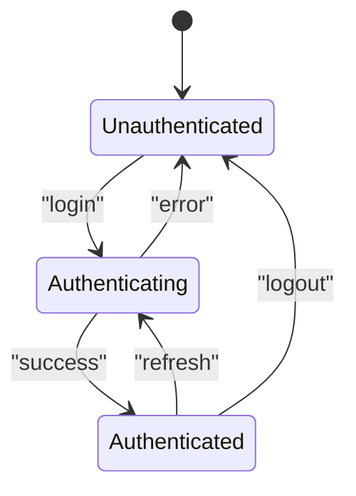
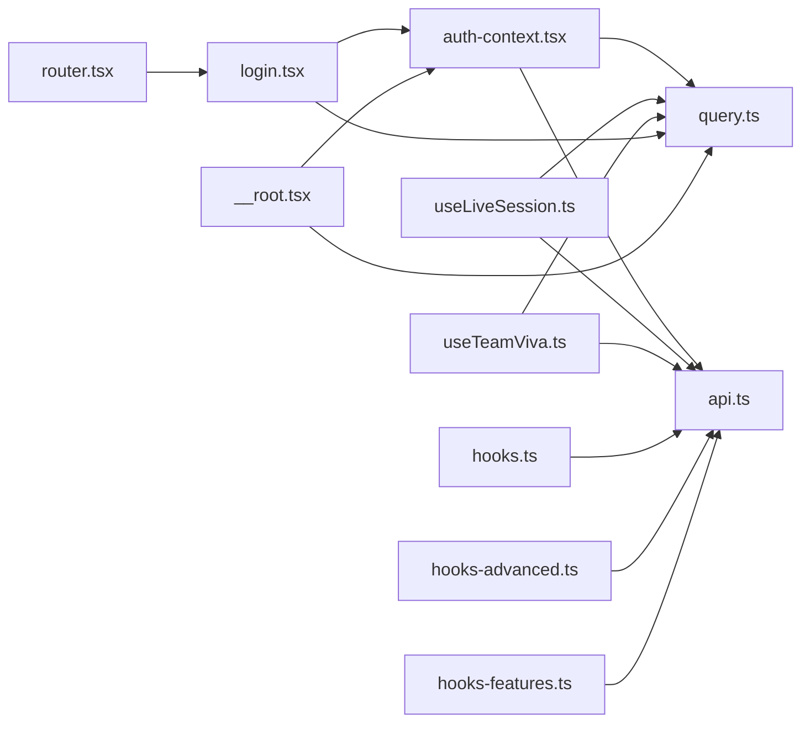

# State Management

<cite>
**Referenced Files in This Document**
- [auth-context.tsx](file://src/lib/auth-context.tsx)
- [query.ts](file://src/lib/query.ts)
- [api.ts](file://src/lib/api.ts)
- [useLiveSession.ts](file://src/lib/useLiveSession.ts)
- [useTeamViva.ts](file://src/lib/useTeamViva.ts)
- [hooks.ts](file://src/lib/hooks.ts)
- [hooks-advanced.ts](file://src/lib/hooks-advanced.ts)
- [hooks-features.ts](file://src/lib/hooks-features.ts)
- [__root.tsx](file://src/routes/__root.tsx)
- [login.tsx](file://src/routes/login.tsx)
- [router.tsx](file://src/router.tsx)
</cite>

## Table of Contents
1. [Introduction](#introduction)
2. [Project Structure](#project-structure)
3. [Core Components](#core-components)
4. [Architecture Overview](#architecture-overview)
5. [Detailed Component Analysis](#detailed-component-analysis)
6. [Dependency Analysis](#dependency-analysis)
7. [Performance Considerations](#performance-considerations)
8. [Troubleshooting Guide](#troubleshooting-guide)
9. [Conclusion](#conclusion)

## Introduction
This document explains the state management architecture that combines React Context for global application state, custom hooks for encapsulating business logic, and React Query for server state synchronization. It covers:
- Authentication context implementation for global user state
- Custom hooks for common patterns and asynchronous operations
- Real-time state synchronization using WebSocket connections
- Separation between local component state, global application state, and server state
- Data fetching patterns, caching strategies, optimistic updates, and error handling
- Examples of creating reusable hooks to maintain consistency across components

## Project Structure
The state management layer is organized under src/lib with clear responsibilities:
- Global application state via Context (authentication)
- Server state via React Query configuration and data access utilities
- Custom hooks for domain-specific logic and real-time features
- Shared utilities and API integration

**Diagram sources**
- [__root.tsx](file://src/routes/__root.tsx)
- [auth-context.tsx](file://src/lib/auth-context.tsx)
- [query.ts](file://src/lib/query.ts)
- [api.ts](file://src/lib/api.ts)
- [useLiveSession.ts](file://src/lib/useLiveSession.ts)
- [useTeamViva.ts](file://src/lib/useTeamViva.ts)
- [hooks.ts](file://src/lib/hooks.ts)
- [hooks-advanced.ts](file://src/lib/hooks-advanced.ts)
- [hooks-features.ts](file://src/lib/hooks-features.ts)
- [router.tsx](file://src/router.tsx)
- [login.tsx](file://src/routes/login.tsx)

**Section sources**
- [__root.tsx](file://src/routes/__root.tsx)
- [router.tsx](file://src/router.tsx)
- [auth-context.tsx](file://src/lib/auth-context.tsx)
- [query.ts](file://src/lib/query.ts)
- [api.ts](file://src/lib/api.ts)
- [useLiveSession.ts](file://src/lib/useLiveSession.ts)
- [useTeamViva.ts](file://src/lib/useTeamViva.ts)
- [hooks.ts](file://src/lib/hooks.ts)
- [hooks-advanced.ts](file://src/lib/hooks-advanced.ts)
- [hooks-features.ts](file://src/lib/hooks-features.ts)
- [login.tsx](file://src/routes/login.tsx)

## Core Components
- Authentication Context: Provides global user session state and actions such as login/logout, persisted across navigation.
- React Query Configuration: Centralized client setup, default options, cache policies, and retry/error behavior.
- API Layer: Typed HTTP client wrappers used by hooks and queries to interact with backend endpoints.
- Custom Hooks: Encapsulate domain logic (e.g., live sessions, team viva), orchestrate React Query mutations/queries, and manage WebSocket connections for real-time updates.

Key responsibilities:
- Keep UI consistent by sharing authentication state globally
- Cache and synchronize server state efficiently with React Query
- Encapsulate complex async flows and real-time events in reusable hooks
- Provide predictable error handling and loading states

**Section sources**
- [auth-context.tsx](file://src/lib/auth-context.tsx)
- [query.ts](file://src/lib/query.ts)
- [api.ts](file://src/lib/api.ts)
- [useLiveSession.ts](file://src/lib/useLiveSession.ts)
- [useTeamViva.ts](file://src/lib/useTeamViva.ts)
- [hooks.ts](file://src/lib/hooks.ts)
- [hooks-advanced.ts](file://src/lib/hooks-advanced.ts)
- [hooks-features.ts](file://src/lib/hooks-features.ts)

## Architecture Overview
The architecture separates concerns into three layers:
- Local component state: UI-only state (e.g., form inputs, toggles)
- Global application state: User session and app-wide settings via Context
- Server state: Remote data managed by React Query with caching, background refetching, and optimistic updates

**Diagram sources**
- [auth-context.tsx](file://src/lib/auth-context.tsx)
- [query.ts](file://src/lib/query.ts)
- [api.ts](file://src/lib/api.ts)
- [useLiveSession.ts](file://src/lib/useLiveSession.ts)
- [useTeamViva.ts](file://src/lib/useTeamViva.ts)

## Detailed Component Analysis

### Authentication Context
Purpose:
- Maintain global user session state and provide actions for login/logout
- Persist session across reloads and share it across routes/components
- Integrate with React Query to invalidate caches on auth changes

Key behaviors:
- Exposes a provider wrapping the app shell
- Offers methods to set/clear user session and tokens
- Triggers query invalidation when authentication state changes

**Diagram sources**
- [auth-context.tsx](file://src/lib/auth-context.tsx)
- [login.tsx](file://src/routes/login.tsx)
- [__root.tsx](file://src/routes/__root.tsx)

**Section sources**
- [auth-context.tsx](file://src/lib/auth-context.tsx)
- [login.tsx](file://src/routes/login.tsx)
- [__root.tsx](file://src/routes/__root.tsx)

### React Query Configuration and Patterns
Responsibilities:
- Configure the React Query client with defaults (retry, staleTime, gcTime)
- Centralize error handling and logging
- Provide helpers for typed queries/mutations and cache keys

Patterns:
- Use query keys to group related data and enable targeted invalidation
- Apply optimistic updates for mutations to improve perceived performance
- Leverage background refetching and pagination where applicable

**Diagram sources**
- [query.ts](file://src/lib/query.ts)
- [api.ts](file://src/lib/api.ts)

**Section sources**
- [query.ts](file://src/lib/query.ts)
- [api.ts](file://src/lib/api.ts)

### Custom Hook: useLiveSession
Responsibilities:
- Manage WebSocket connection lifecycle for live sessions
- Sync real-time events with React Query cache
- Expose a simple interface for components to subscribe to live updates

Flow:
- Initialize connection on mount
- Handle incoming events and update relevant queries
- Clean up connection on unmount

**Diagram sources**
- [useLiveSession.ts](file://src/lib/useLiveSession.ts)
- [query.ts](file://src/lib/query.ts)

**Section sources**
- [useLiveSession.ts](file://src/lib/useLiveSession.ts)
- [query.ts](file://src/lib/query.ts)

### Custom Hook: useTeamViva
Responsibilities:
- Orchestrate team viva-related queries and mutations
- Coordinate optimistic updates and error recovery
- Provide convenience methods for common workflows

**Diagram sources**
- [useTeamViva.ts](file://src/lib/useTeamViva.ts)
- [api.ts](file://src/lib/api.ts)
- [query.ts](file://src/lib/query.ts)

**Section sources**
- [useTeamViva.ts](file://src/lib/useTeamViva.ts)
- [api.ts](file://src/lib/api.ts)
- [query.ts](file://src/lib/query.ts)

### Common Custom Hooks
- hooks.ts: Shared primitives for data fetching, debounced inputs, and UI state helpers
- hooks-advanced.ts: Advanced patterns like polling, conditional queries, and batched updates
- hooks-features.ts: Feature-specific hooks that compose lower-level hooks and React Query

Usage guidelines:
- Prefer composition over duplication
- Keep hooks focused on a single responsibility
- Return stable interfaces to minimize re-renders

**Section sources**
- [hooks.ts](file://src/lib/hooks.ts)
- [hooks-advanced.ts](file://src/lib/hooks-advanced.ts)
- [hooks-features.ts](file://src/lib/hooks-features.ts)

### Conceptual Overview
Separation of concerns:
- Local component state: ephemeral UI state within a component
- Global application state: user session, theme, feature flags via Context
- Server state: remote data via React Query with caching and synchronization

[No sources needed since this diagram shows conceptual workflow, not actual code structure]

## Dependency Analysis
High-level dependencies among state management modules:

**Diagram sources**
- [auth-context.tsx](file://src/lib/auth-context.tsx)
- [query.ts](file://src/lib/query.ts)
- [api.ts](file://src/lib/api.ts)
- [useLiveSession.ts](file://src/lib/useLiveSession.ts)
- [useTeamViva.ts](file://src/lib/useTeamViva.ts)
- [hooks.ts](file://src/lib/hooks.ts)
- [hooks-advanced.ts](file://src/lib/hooks-advanced.ts)
- [hooks-features.ts](file://src/lib/hooks-features.ts)
- [login.tsx](file://src/routes/login.tsx)
- [__root.tsx](file://src/routes/__root.tsx)
- [router.tsx](file://src/router.tsx)

**Section sources**
- [auth-context.tsx](file://src/lib/auth-context.tsx)
- [query.ts](file://src/lib/query.ts)
- [api.ts](file://src/lib/api.ts)
- [useLiveSession.ts](file://src/lib/useLiveSession.ts)
- [useTeamViva.ts](file://src/lib/useTeamViva.ts)
- [hooks.ts](file://src/lib/hooks.ts)
- [hooks-advanced.ts](file://src/lib/hooks-advanced.ts)
- [hooks-features.ts](file://src/lib/hooks-features.ts)
- [login.tsx](file://src/routes/login.tsx)
- [__root.tsx](file://src/routes/__root.tsx)
- [router.tsx](file://src/router.tsx)

## Performance Considerations
- Cache tuning: Set appropriate staleTime and gcTime to balance freshness and network usage
- Pagination and virtualization: For large datasets, paginate and render only visible items
- Debounce and throttle: Avoid excessive requests during rapid user input
- Batch updates: Group multiple mutations to reduce round trips
- Connection pooling: Reuse WebSocket connections per feature scope to avoid overhead
- Selective subscriptions: Subscribe to minimal data slices to limit re-renders

[No sources needed since this section provides general guidance]

## Troubleshooting Guide
Common issues and resolutions:
- Stale data after mutation: Ensure dependent queries are invalidated post-mutation
- Duplicate requests: Verify unique query keys and deduplication settings
- WebSocket disconnects: Implement reconnect logic with exponential backoff
- Optimistic rollback failures: Always implement rollback paths and user feedback
- Auth state drift: Invalidate all sensitive queries on logout and refresh

Operational tips:
- Log query key changes and mutation outcomes for debugging
- Use React Query devtools to inspect cache and network activity
- Wrap API calls with consistent error normalization

**Section sources**
- [query.ts](file://src/lib/query.ts)
- [api.ts](file://src/lib/api.ts)
- [useLiveSession.ts](file://src/lib/useLiveSession.ts)

## Conclusion
This architecture cleanly separates local, global, and server state while providing robust patterns for data fetching, caching, real-time sync, and error handling. The combination of Context for authentication, React Query for server state, and custom hooks for domain logic yields a scalable, testable, and maintainable frontend state strategy.