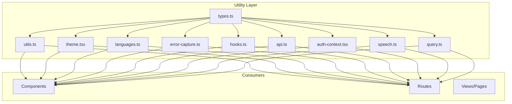
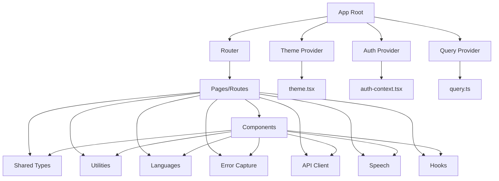
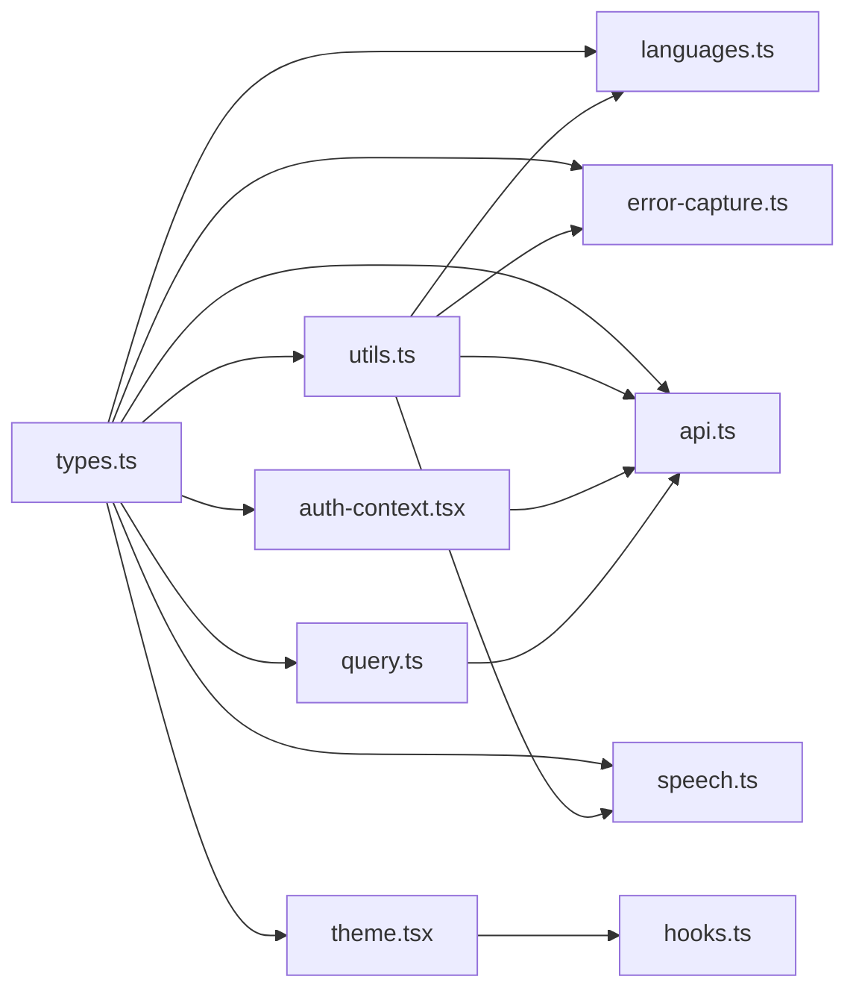

# Utility Libraries

<cite>
**Referenced Files in This Document**
- [utils.ts](file://src/lib/utils.ts)
- [types.ts](file://src/lib/types.ts)
- [theme.tsx](file://src/lib/theme.tsx)
- [languages.ts](file://src/lib/languages.ts)
- [error-capture.ts](file://src/lib/error-capture.ts)
- [hooks.ts](file://src/lib/hooks.ts)
- [api.ts](file://src/lib/api.ts)
- [auth-context.tsx](file://src/lib/auth-context.tsx)
- [speech.ts](file://src/lib/speech.ts)
- [query.ts](file://src/lib/query.ts)
</cite>

## Table of Contents
1. [Introduction](#introduction)
2. [Project Structure](#project-structure)
3. [Core Components](#core-components)
4. [Architecture Overview](#architecture-overview)
5. [Detailed Component Analysis](#detailed-component-analysis)
6. [Dependency Analysis](#dependency-analysis)
7. [Performance Considerations](#performance-considerations)
8. [Troubleshooting Guide](#troubleshooting-guide)
9. [Conclusion](#conclusion)
10. [Appendices](#appendices)

## Introduction
This document describes the shared utility libraries and helper functions that support the entire application. It focuses on:
- Common utility functions used across modules
- Language detection and localization helpers
- Error capture and reporting mechanisms
- Theme management system
- TypeScript type definitions and shared types
It also explains design principles, reusability patterns, integration points, and provides examples for extending and using these utilities consistently.

## Project Structure
The utility layer is organized under src/lib and contains focused modules for cross-cutting concerns such as types, theme, language, errors, hooks, API client, authentication context, speech, and data fetching. The structure promotes separation of concerns and high cohesion within each module while enabling broad reuse across components and routes.

[No sources needed since this diagram shows conceptual workflow, not actual code structure]

## Core Components
This section summarizes the purpose and responsibilities of each utility module and how they integrate into the application.

- Shared Types (types.ts): Centralized TypeScript interfaces, enums, and type guards used by multiple modules to ensure consistency and safety.
- Utilities (utils.ts): Pure helper functions for formatting, validation, string manipulation, date/time handling, and other common tasks.
- Theme Management (theme.tsx): Theme provider, theme tokens, and hooks for switching themes and accessing current theme values.
- Languages and Localization (languages.ts): Language detection, locale resolution, i18n configuration, and translation helpers.
- Error Capture and Reporting (error-capture.ts): Global error boundaries, logging, and reporting integrations.
- Hooks (hooks.ts): Reusable React hooks for UI state, feature flags, and cross-cutting behaviors.
- API Client (api.ts): HTTP client wrapper, interceptors, retry logic, and typed request/response helpers.
- Auth Context (auth-context.tsx): Authentication state, login/logout flows, and protected route helpers.
- Speech Utilities (speech.ts): Web Speech API wrappers for recognition and synthesis.
- Data Fetching (query.ts): Query client setup, caching, and optimistic updates.

Design principles:
- Single responsibility per module
- Pure functions where possible
- Explicit typing via shared types
- Minimal side effects in utilities
- Clear extension points for customization

Integration points:
- Providers at app root (theme, auth, query)
- Hooks consumed in components and routes
- API client used by services and features
- Error capture configured globally

Examples of usage patterns:
- Use shared types to annotate props and function parameters
- Wrap application with theme provider and access theme via hook
- Detect user language and render localized content
- Wrap risky calls with error capture utilities
- Configure API client with base URL and interceptors
- Use speech utilities for voice input/output

**Section sources**
- [types.ts](file://src/lib/types.ts)
- [utils.ts](file://src/lib/utils.ts)
- [theme.tsx](file://src/lib/theme.tsx)
- [languages.ts](file://src/lib/languages.ts)
- [error-capture.ts](file://src/lib/error-capture.ts)
- [hooks.ts](file://src/lib/hooks.ts)
- [api.ts](file://src/lib/api.ts)
- [auth-context.tsx](file://src/lib/auth-context.tsx)
- [speech.ts](file://src/lib/speech.ts)
- [query.ts](file://src/lib/query.ts)

## Architecture Overview
The utility layer sits beneath components and routes, providing foundational capabilities. Consumers depend on these modules but do not expose them back up, maintaining a clear dependency direction.

[No sources needed since this diagram shows conceptual workflow, not actual code structure]

## Detailed Component Analysis

### Shared Types (types.ts)
Purpose:
- Define core domain models, API shapes, and UI primitives
- Provide type guards and discriminators
- Export reusable enums and constants

Design principles:
- Prefer discriminated unions for state machines
- Keep types minimal and composable
- Avoid circular dependencies between type files

Extension points:
- Add new domain entities here
- Introduce type guards for runtime checks
- Centralize enum values to avoid drift

Usage examples:
- Annotate component props with shared interfaces
- Use type guards before branching on union types
- Reference enums for consistent status codes

**Section sources**
- [types.ts](file://src/lib/types.ts)

### Utilities (utils.ts)
Purpose:
- Provide pure helper functions for formatting, validation, and common operations
- Offer deterministic transformations without side effects

Common categories:
- String utilities (trimming, slugifying, masking)
- Date/time formatting and parsing
- Number formatting and currency helpers
- Validation helpers (email, phone, required fields)
- Array/object utilities (deep clone, pick/omit)

Design principles:
- Pure functions with explicit inputs/outputs
- Idempotent behavior
- Defensive programming with early returns

Usage examples:
- Format dates for display
- Validate form inputs before submission
- Transform API responses into UI-friendly structures

**Section sources**
- [utils.ts](file://src/lib/utils.ts)

### Theme Management (theme.tsx)
Purpose:
- Provide theme context, tokens, and hooks
- Support light/dark modes and custom palettes
- Persist user preference and respect system settings

Key concepts:
- ThemeProvider wraps the app
- useTheme hook reads current theme
- CSS variables or class toggling for styling
- Token-based design system

Extending the theme:
- Add new tokens (colors, spacing, typography)
- Create variant presets (e.g., high contrast)
- Implement dynamic overrides at runtime

Integration points:
- Wrap application root with provider
- Consume theme in components via hook
- Apply tokens through CSS variables or styled APIs

**Section sources**
- [theme.tsx](file://src/lib/theme.tsx)

### Languages and Localization (languages.ts)
Purpose:
- Detect browser language and resolve preferred locale
- Load translations and manage pluralization
- Provide helpers for formatted messages and numbers

Key concepts:
- Locale detection from navigator and storage
- Fallback chain for missing translations
- Pluralization rules and date/number formatting

Usage examples:
- Initialize i18n with supported locales
- Render localized strings in components
- Switch languages at runtime and persist choice

**Section sources**
- [languages.ts](file://src/lib/languages.ts)

### Error Capture and Reporting (error-capture.ts)
Purpose:
- Centralize error boundary implementation
- Log errors with context and stack traces
- Report to external services when available

Key concepts:
- Global error boundary wrapping critical sections
- Error serialization and metadata enrichment
- Graceful degradation and user-facing messages

Usage examples:
- Wrap routes or heavy components with error boundary
- Log expected vs unexpected errors
- Surface friendly messages to users

**Section sources**
- [error-capture.ts](file://src/lib/error-capture.ts)

### Hooks (hooks.ts)
Purpose:
- Encapsulate reusable UI and feature logic
- Provide abstractions over localStorage, media queries, and more

Common hooks:
- useLocalStorage for persistence
- useMediaQuery for responsive behavior
- useDebounce/useThrottle for performance
- useFeatureFlag for gradual rollouts

Usage examples:
- Replace inline state with shared hooks
- Standardize debounce behavior across inputs
- Gate features behind flags

**Section sources**
- [hooks.ts](file://src/lib/hooks.ts)

### API Client (api.ts)
Purpose:
- Configure HTTP client with base URL, headers, and interceptors
- Handle retries, timeouts, and error normalization
- Provide typed request/response helpers

Key concepts:
- Interceptors for auth tokens and logging
- Retry policy for transient failures
- Typed endpoints and response schemas

Usage examples:
- Call endpoints with typed methods
- Attach auth headers automatically
- Normalize backend errors into consistent shapes

**Section sources**
- [api.ts](file://src/lib/api.ts)

### Auth Context (auth-context.tsx)
Purpose:
- Manage authentication state and lifecycle
- Provide login/logout and session refresh
- Protect routes and guard sensitive actions

Key concepts:
- Context-based auth state
- Token storage and refresh flow
- Route guards and redirects

Usage examples:
- Wrap app with auth provider
- Access user profile and roles via hook
- Guard routes requiring authentication

**Section sources**
- [auth-context.tsx](file://src/lib/auth-context.tsx)

### Speech Utilities (speech.ts)
Purpose:
- Wrap Web Speech API for recognition and synthesis
- Provide streaming results and event handling
- Abstract platform differences

Usage examples:
- Start/stop voice recognition
- Convert text to speech
- Handle interruptions and errors gracefully

**Section sources**
- [speech.ts](file://src/lib/speech.ts)

### Data Fetching (query.ts)
Purpose:
- Configure query client with caching and retries
- Provide hooks for declarative data fetching
- Enable optimistic updates and background refetch

Usage examples:
- Fetch lists and details with automatic caching
- Invalidate queries after mutations
- Show loading and error states consistently

**Section sources**
- [query.ts](file://src/lib/query.ts)

## Dependency Analysis
The utility modules have clear dependency directions:
- types.ts has no internal dependencies and is consumed everywhere
- utils.ts depends only on types.ts
- theme.tsx depends on types.ts and may consume hooks.ts
- languages.ts depends on types.ts and utils.ts
- error-capture.ts depends on types.ts and utils.ts
- api.ts depends on types.ts and utils.ts
- auth-context.tsx depends on types.ts and api.ts
- speech.ts depends on types.ts and utils.ts
- query.ts depends on types.ts and api.ts

**Diagram sources**
- [types.ts](file://src/lib/types.ts)
- [utils.ts](file://src/lib/utils.ts)
- [theme.tsx](file://src/lib/theme.tsx)
- [languages.ts](file://src/lib/languages.ts)
- [error-capture.ts](file://src/lib/error-capture.ts)
- [api.ts](file://src/lib/api.ts)
- [auth-context.tsx](file://src/lib/auth-context.tsx)
- [speech.ts](file://src/lib/speech.ts)
- [query.ts](file://src/lib/query.ts)

**Section sources**
- [types.ts](file://src/lib/types.ts)
- [utils.ts](file://src/lib/utils.ts)
- [theme.tsx](file://src/lib/theme.tsx)
- [languages.ts](file://src/lib/languages.ts)
- [error-capture.ts](file://src/lib/error-capture.ts)
- [api.ts](file://src/lib/api.ts)
- [auth-context.tsx](file://src/lib/auth-context.tsx)
- [speech.ts](file://src/lib/speech.ts)
- [query.ts](file://src/lib/query.ts)

## Performance Considerations
- Prefer memoization and stable references in hooks to avoid unnecessary re-renders
- Debounce/throttle expensive operations like search and resize handlers
- Cache frequently accessed data via query client and local storage
- Lazy-load heavy modules (e.g., speech recognition) when first needed
- Minimize theme recalculations by batching updates and using CSS variables

[No sources needed since this section provides general guidance]

## Troubleshooting Guide
Common issues and resolutions:
- Missing translations: Ensure fallback chain includes default locale; verify keys exist
- Theme not applying: Confirm provider is mounted at root and CSS variables are applied
- API errors: Check interceptors for token attachment and normalize error payloads
- Speech not working: Verify browser permissions and availability of APIs
- Query cache inconsistencies: Invalidate relevant queries after mutations and handle stale-while-revalidate

Operational tips:
- Use global error capture to log unhandled exceptions
- Add structured logging around network requests
- Instrument key hooks with timing metrics during development

**Section sources**
- [error-capture.ts](file://src/lib/error-capture.ts)
- [api.ts](file://src/lib/api.ts)
- [query.ts](file://src/lib/query.ts)
- [languages.ts](file://src/lib/languages.ts)
- [theme.tsx](file://src/lib/theme.tsx)
- [speech.ts](file://src/lib/speech.ts)

## Conclusion
The utility layer centralizes cross-cutting concerns, enforces type safety, and standardizes behavior across the application. By following the design principles and patterns outlined here—pure utilities, explicit types, clear providers, and robust error handling—you can extend and maintain the system efficiently. Use the provided examples as guides for integrating new features consistently.

[No sources needed since this section summarizes without analyzing specific files]

## Appendices

### Extending the Theme System
- Add new tokens to the theme definition
- Expose a hook or helper to compute derived values
- Update CSS variables or style utilities to consume tokens
- Document new tokens in a central reference

### Handling Errors Consistently
- Normalize backend errors into a common shape
- Enrich logs with context (user, action, timestamp)
- Present actionable messages to users
- Distinguish expected vs unexpected errors

### Leveraging Shared Types for Type Safety
- Import shared interfaces for props and API payloads
- Use type guards before conditional branches
- Prefer discriminated unions for state transitions
- Keep enums centralized to prevent drift

[No sources needed since this section provides general guidance]