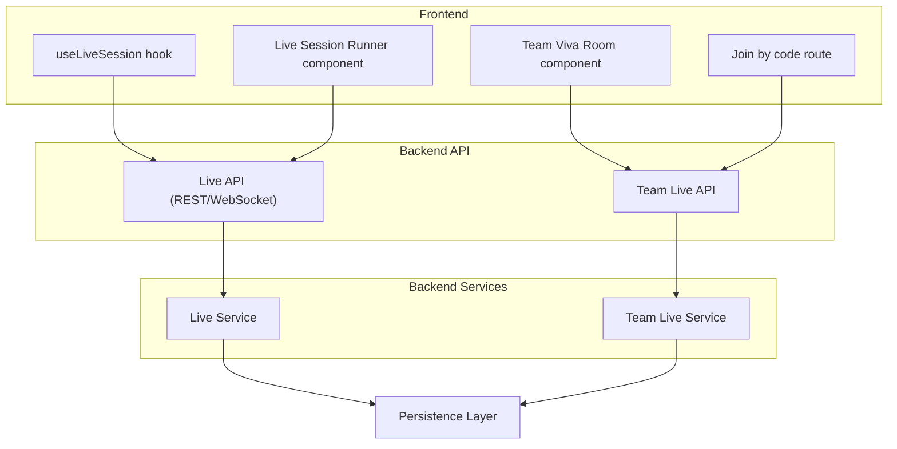
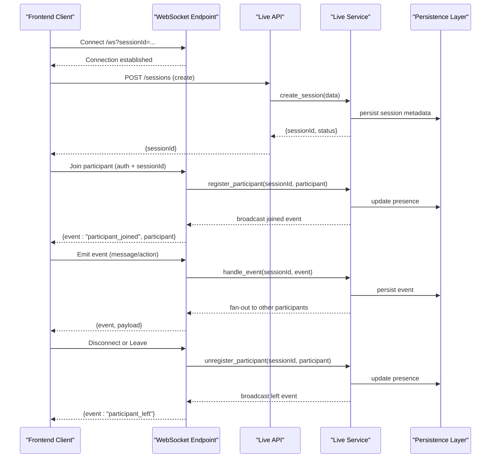
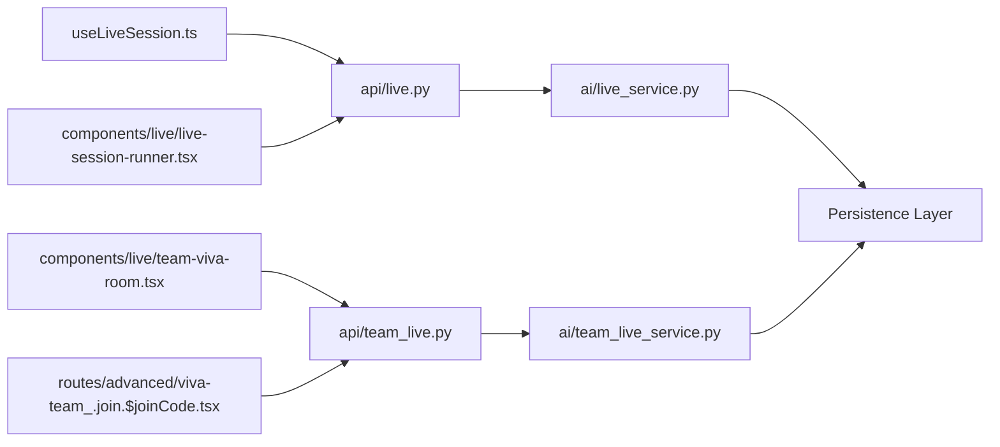

# Live Session Management

<cite>
**Referenced Files in This Document**
- [live_service.py](file://backend/ai/live_service.py)
- [team_live_service.py](file://backend/ai/team_live_service.py)
- [live.py](file://backend/api/live.py)
- [team_live.py](file://backend/api/team_live.py)
- [useLiveSession.ts](file://src/lib/useLiveSession.ts)
- [team-viva-room.tsx](file://src/components/live/team-viva-room.tsx)
- [live-session-runner.tsx](file://src/components/live/live-session-runner.tsx)
- [viva-team_.join.$joinCode.tsx](file://src/routes/advanced/viva-team_.join.$joinCode.tsx)
- [viva-code-aware_.session.$id.tsx](file://src/routes/advanced/viva-code-aware_.session.$id.tsx)
- [test_live_gate.py](file://backend/tests/test_live_gate.py)
- [test_live_persistence.py](file://backend/tests/test_live_persistence.py)
</cite>

## Table of Contents
1. [Introduction](#introduction)
2. [Project Structure](#project-structure)
3. [Core Components](#core-components)
4. [Architecture Overview](#architecture-overview)
5. [Detailed Component Analysis](#detailed-component-analysis)
6. [Dependency Analysis](#dependency-analysis)
7. [Performance Considerations](#performance-considerations)
8. [Troubleshooting Guide](#troubleshooting-guide)
9. [Conclusion](#conclusion)

## Introduction
This document explains the live session management system that powers real-time collaborative sessions. It covers the full lifecycle from session creation to termination, participant join/leave flows, WebSocket connection handling, state synchronization, and event broadcasting. It also documents persistence strategies, error recovery mechanisms, and scalability considerations, with concrete examples for creating sessions, managing participants, and handling events.

## Project Structure
The live session feature spans backend services, API endpoints, and frontend components:
- Backend services implement session orchestration, participant management, and persistence.
- API endpoints expose REST and WebSocket interfaces for clients.
- Frontend hooks and components manage WebSocket connections, local state, and UI updates.

**Diagram sources**
- [live.py](file://backend/api/live.py)
- [team_live.py](file://backend/api/team_live.py)
- [live_service.py](file://backend/ai/live_service.py)
- [team_live_service.py](file://backend/ai/team_live_service.py)
- [useLiveSession.ts](file://src/lib/useLiveSession.ts)
- [team-viva-room.tsx](file://src/components/live/team-viva-room.tsx)
- [live-session-runner.tsx](file://src/components/live/live-session-runner.tsx)
- [viva-team_.join.$joinCode.tsx](file://src/routes/advanced/viva-team_.join.$joinCode.tsx)

**Section sources**
- [live_service.py](file://backend/ai/live_service.py)
- [team_live_service.py](file://backend/ai/team_live_service.py)
- [live.py](file://backend/api/live.py)
- [team_live.py](file://backend/api/team_live.py)
- [useLiveSession.ts](file://src/lib/useLiveSession.ts)
- [team-viva-room.tsx](file://src/components/live/team-viva-room.tsx)
- [live-session-runner.tsx](file://src/components/live/live-session-runner.tsx)
- [viva-team_.join.$joinCode.tsx](file://src/routes/advanced/viva-team_.join.$joinCode.tsx)

## Core Components
- Live Service: Manages session lifecycle, participant registry, message routing, and persistence.
- Team Live Service: Extends core capabilities for team-based rooms, including join codes and group coordination.
- Live API: Exposes endpoints for session CRUD, participant actions, and WebSocket upgrade/handling.
- Team Live API: Provides team-specific routes such as joining via a code and room-scoped operations.
- Frontend useLiveSession Hook: Encapsulates WebSocket lifecycle, reconnection, and event subscription.
- Frontend Components: Render real-time UI, handle user interactions, and emit events to the server.

Key responsibilities:
- Session initialization and teardown
- Participant join/leave with presence tracking
- Real-time event broadcasting and ordering
- Persistence of session metadata and events
- Error detection, retries, and graceful degradation

**Section sources**
- [live_service.py](file://backend/ai/live_service.py)
- [team_live_service.py](file://backend/ai/team_live_service.py)
- [live.py](file://backend/api/live.py)
- [team_live.py](file://backend/api/team_live.py)
- [useLiveSession.ts](file://src/lib/useLiveSession.ts)
- [team-viva-room.tsx](file://src/components/live/team-viva-room.tsx)
- [live-session-runner.tsx](file://src/components/live/live-session-runner.tsx)

## Architecture Overview
The system follows a service-oriented architecture with clear separation between API handlers, business logic, and persistence. The frontend uses a reactive hook to maintain a persistent WebSocket connection and synchronize state with the server.

**Diagram sources**
- [live.py](file://backend/api/live.py)
- [live_service.py](file://backend/ai/live_service.py)
- [useLiveSession.ts](file://src/lib/useLiveSession.ts)

## Detailed Component Analysis

### Live Service
Responsibilities:
- Create and terminate sessions
- Maintain participant registry and presence
- Route and broadcast events within a session
- Persist session state and events
- Handle errors and retries

Lifecycle highlights:
- Initialization: Validate inputs, allocate resources, write initial state
- Participant join: Authenticate, assign roles, broadcast presence
- Event processing: Validate, transform, persist, and broadcast
- Termination: Flush pending writes, notify participants, release resources

Error handling:
- Input validation failures return structured errors
- Network/persistence retries with backoff
- Graceful disconnects on client failure

Scalability:
- In-memory participant maps per session
- Async I/O for persistence and broadcasting
- Stateless API layer for horizontal scaling

**Section sources**
- [live_service.py](file://backend/ai/live_service.py)

### Team Live Service
Responsibilities:
- Manage team-based sessions and join codes
- Coordinate multi-participant workflows
- Enforce team-level policies and permissions

Key flows:
- Generate join codes and validate them at join time
- Track team membership and roles
- Broadcast team-wide events and sync state

Error handling:
- Invalid join codes handled with explicit messages
- Conflict resolution when multiple participants attempt conflicting actions

**Section sources**
- [team_live_service.py](file://backend/ai/team_live_service.py)

### Live API
Endpoints:
- Session CRUD: create, read, update, delete
- Participant management: join, leave, role changes
- WebSocket upgrade and routing

WebSocket handling:
- Upgrade HTTP to WebSocket
- Authenticate and authorize per connection
- Bind messages to session context and participant identity

Event model:
- Typed events with payloads
- Ordered delivery guarantees where applicable
- Acknowledgment patterns for critical actions

**Section sources**
- [live.py](file://backend/api/live.py)

### Team Live API
Endpoints:
- Join by code: resolve code to session and participant
- Room-scoped operations: chat, actions, media control
- Presence queries and leader election helpers

Security:
- Code expiration and rate limiting
- Role-based access control for sensitive actions

**Section sources**
- [team_live.py](file://backend/api/team_live.py)

### Frontend: useLiveSession Hook
Responsibilities:
- Establish and maintain WebSocket connection
- Reconnect on network errors with exponential backoff
- Subscribe/unsubscribe to session events
- Sync local state with server state
- Emit typed events and handle responses

Reconnection strategy:
- Detect disconnects and reconnect automatically
- Rejoin session and resync state after reconnect
- Queue outgoing events until connected

Error handling:
- Distinguish transient vs permanent errors
- Surface actionable errors to UI

**Section sources**
- [useLiveSession.ts](file://src/lib/useLiveSession.ts)

### Frontend: Team Viva Room Component
Responsibilities:
- Render real-time UI for team sessions
- Handle user interactions and emit events
- Display participant presence and activity feeds

State synchronization:
- Local optimistic updates with server reconciliation
- Conflict resolution for concurrent edits

**Section sources**
- [team-viva-room.tsx](file://src/components/live/team-viva-room.tsx)

### Frontend: Live Session Runner Component
Responsibilities:
- Orchestrate session execution flow
- Manage step transitions and progress
- Emit lifecycle events to the backend

Real-time updates:
- Receive and render live feedback and results
- Handle timeouts and retry prompts

**Section sources**
- [live-session-runner.tsx](file://src/components/live/live-session-runner.tsx)

### Frontend: Join by Code Route
Responsibilities:
- Resolve join code to session details
- Authenticate and join the session
- Redirect to appropriate room view

Validation:
- Check code validity and expiration
- Handle invalid/expired codes gracefully

**Section sources**
- [viva-team_.join.$joinCode.tsx](file://src/routes/advanced/viva-team_.join.$joinCode.tsx)

## Dependency Analysis
The following diagram shows how components depend on each other across layers.

**Diagram sources**
- [useLiveSession.ts](file://src/lib/useLiveSession.ts)
- [live.py](file://backend/api/live.py)
- [team_live.py](file://backend/api/team_live.py)
- [live_service.py](file://backend/ai/live_service.py)
- [team_live_service.py](file://backend/ai/team_live_service.py)

**Section sources**
- [useLiveSession.ts](file://src/lib/useLiveSession.ts)
- [live.py](file://backend/api/live.py)
- [team_live.py](file://backend/api/team_live.py)
- [live_service.py](file://backend/ai/live_service.py)
- [team_live_service.py](file://backend/ai/team_live_service.py)

## Performance Considerations
- Use async I/O for database and WebSocket operations to avoid blocking.
- Batch persistence writes where possible to reduce overhead.
- Implement efficient fan-out for event broadcasting; consider message queues for high concurrency.
- Limit payload sizes and compress where appropriate.
- Cache frequently accessed session metadata at the edge or in memory with TTL.
- Apply rate limiting on join and event endpoints to prevent abuse.

[No sources needed since this section provides general guidance]

## Troubleshooting Guide
Common issues and resolutions:
- WebSocket disconnects: Verify network stability and ensure reconnection logic is active. Check server logs for abrupt closures.
- Duplicate participant entries: Ensure idempotent join handling and unique participant identifiers.
- Stale state after reconnect: Force a full state sync upon reconnection and reconcile local diffs.
- Event ordering anomalies: Use sequence numbers or timestamps to order events client-side.
- Permission errors: Validate roles and scopes before executing sensitive actions.

Operational checks:
- Monitor session counts and participant concurrency.
- Alert on high error rates during join and event processing.
- Log persistence latency and failures for performance tuning.

**Section sources**
- [test_live_gate.py](file://backend/tests/test_live_gate.py)
- [test_live_persistence.py](file://backend/tests/test_live_persistence.py)

## Conclusion
The live session management system provides a robust foundation for real-time collaboration. It combines clear lifecycle management, reliable WebSocket communication, and resilient persistence to deliver consistent experiences under varying conditions. By following the patterns outlined here—state synchronization, event-driven updates, and scalable service design—you can extend and operate the system effectively at scale.