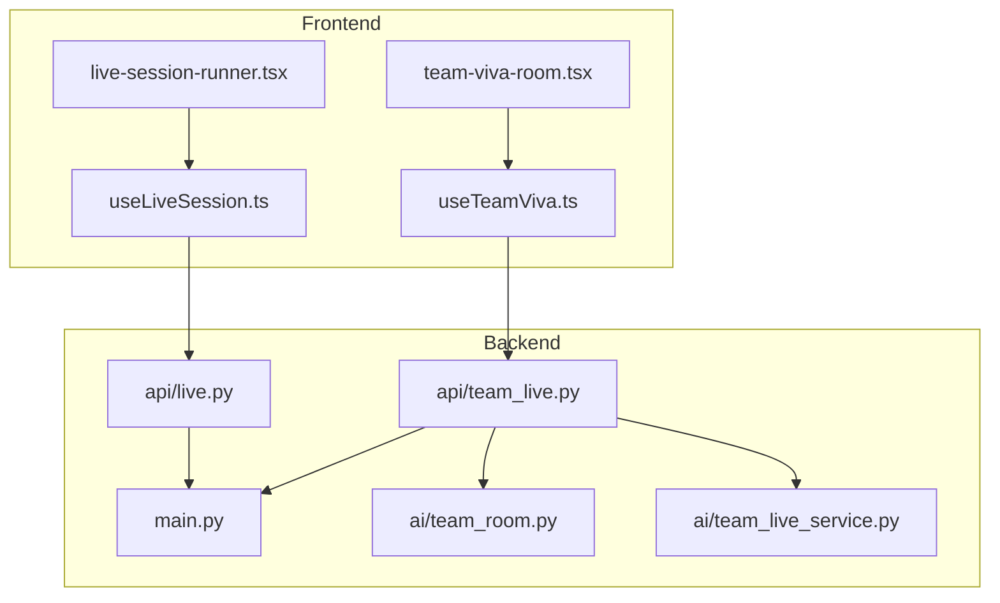
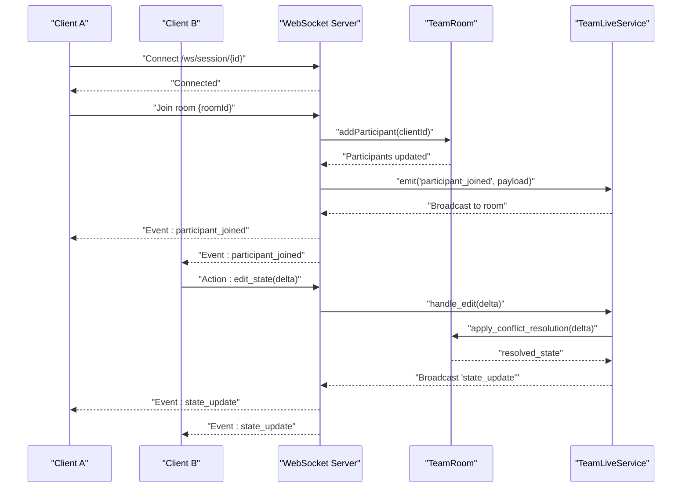
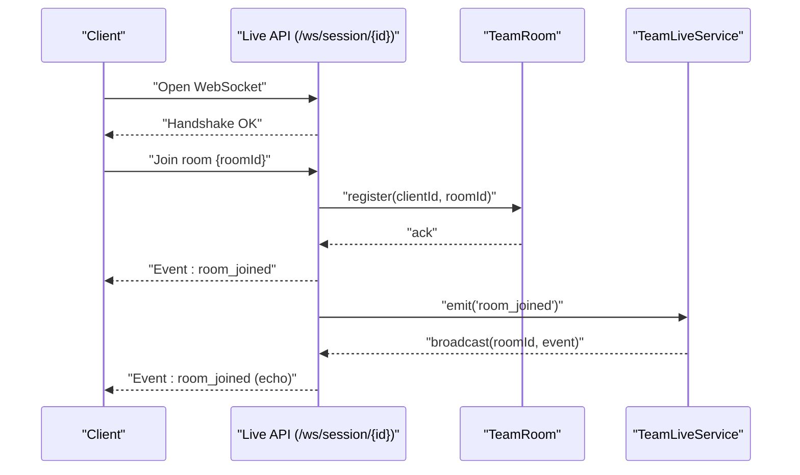
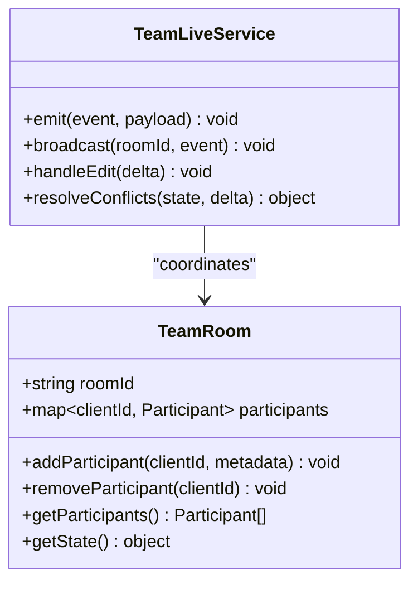
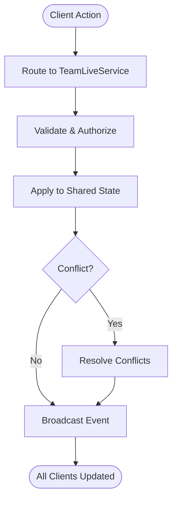
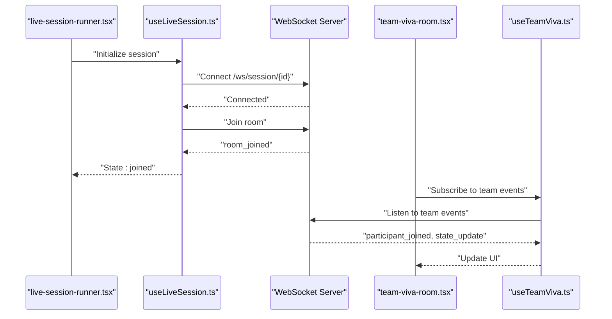
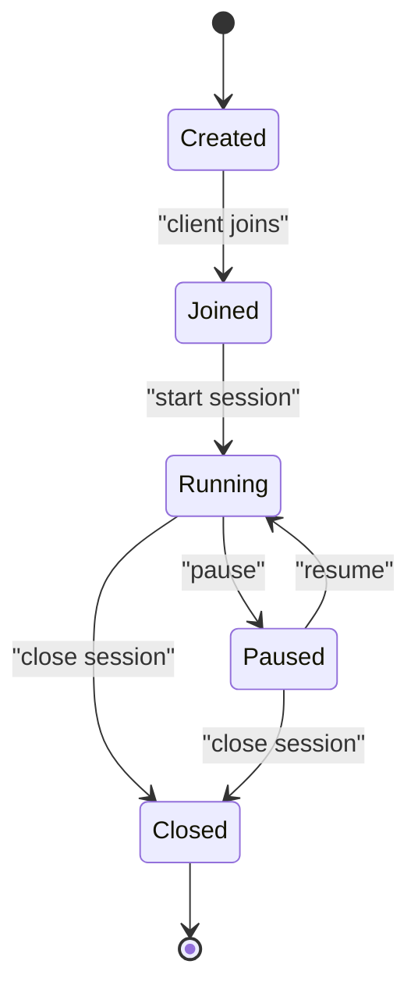
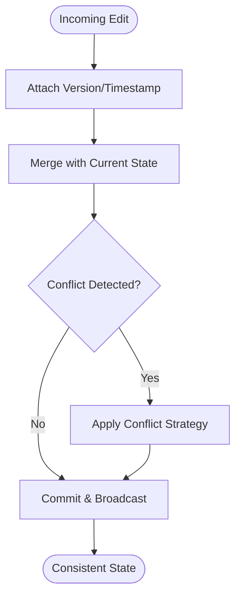
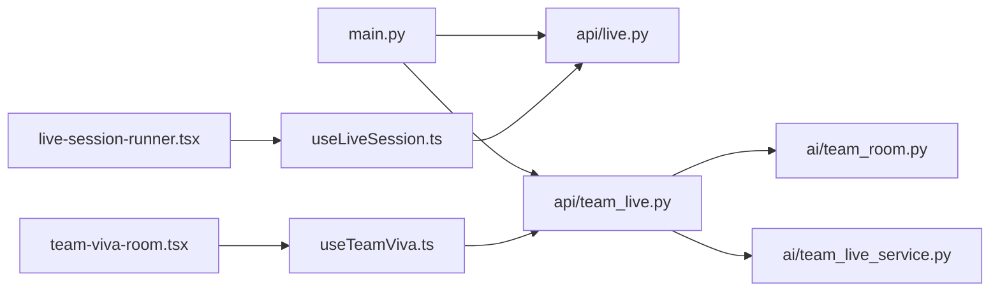

# Real-Time Collaboration System

<cite>
**Referenced Files in This Document**
- [backend/main.py](file://backend/main.py)
- [backend/api/live.py](file://backend/api/live.py)
- [backend/api/team_live.py](file://backend/api/team_live.py)
- [backend/ai/team_room.py](file://backend/ai/team_room.py)
- [backend/ai/team_live_service.py](file://backend/ai/team_live_service.py)
- [src/lib/useLiveSession.ts](file://src/lib/useLiveSession.ts)
- [src/lib/useTeamViva.ts](file://src/lib/useTeamViva.ts)
- [src/components/live/live-session-runner.tsx](file://src/components/live/live-session-runner.tsx)
- [src/components/live/team-viva-room.tsx](file://src/components/live/team-viva-room.tsx)
</cite>

## Table of Contents
1. [Introduction](#introduction)
2. [Project Structure](#project-structure)
3. [Core Components](#core-components)
4. [Architecture Overview](#architecture-overview)
5. [Detailed Component Analysis](#detailed-component-analysis)
6. [Dependency Analysis](#dependency-analysis)
7. [Performance Considerations](#performance-considerations)
8. [Troubleshooting Guide](#troubleshooting-guide)
9. [Conclusion](#conclusion)

## Introduction
This document describes the real-time collaboration system built on WebSocket connections. It explains how live sessions are managed, how team rooms coordinate multiple participants, and how clients communicate with the server in real time. The focus is on session lifecycle management, participant coordination, resource allocation, conflict resolution strategies, event-driven architecture, message broadcasting, and connection handling. Visual diagrams illustrate WebSocket flows, event propagation, and state synchronization across clients.

## Project Structure
The real-time collaboration features span both backend and frontend:
- Backend: FastAPI application exposing REST endpoints for session and room management, plus WebSocket handlers for live communication. Core logic includes team room orchestration and a team live service that coordinates events and broadcasts messages to participants.
- Frontend: React components and hooks manage client-side WebSocket connections, subscribe to events, and synchronize UI state with the server.

**Diagram sources**
- [backend/main.py](file://backend/main.py)
- [backend/api/live.py](file://backend/api/live.py)
- [backend/api/team_live.py](file://backend/api/team_live.py)
- [backend/ai/team_room.py](file://backend/ai/team_room.py)
- [backend/ai/team_live_service.py](file://backend/ai/team_live_service.py)
- [src/lib/useLiveSession.ts](file://src/lib/useLiveSession.ts)
- [src/lib/useTeamViva.ts](file://src/lib/useTeamViva.ts)
- [src/components/live/live-session-runner.tsx](file://src/components/live/live-session-runner.tsx)
- [src/components/live/team-viva-room.tsx](file://src/components/live/team-viva-room.tsx)

**Section sources**
- [backend/main.py](file://backend/main.py)
- [backend/api/live.py](file://backend/api/live.py)
- [backend/api/team_live.py](file://backend/api/team_live.py)
- [backend/ai/team_room.py](file://backend/ai/team_room.py)
- [backend/ai/team_live_service.py](file://backend/ai/team_live_service.py)
- [src/lib/useLiveSession.ts](file://src/lib/useLiveSession.ts)
- [src/lib/useTeamViva.ts](file://src/lib/useTeamViva.ts)
- [src/components/live/live-session-runner.tsx](file://src/components/live/live-session-runner.tsx)
- [src/components/live/team-viva-room.tsx](file://src/components/live/team-viva-room.tsx)

## Core Components
- Live Session API (REST + WebSocket): Provides endpoints to create, join, update, and close live sessions. WebSocket handlers maintain per-session channels and broadcast updates to all connected clients.
- Team Room Orchestrator: Manages multi-participant team rooms, tracks participants, and coordinates shared resources (e.g., active speaker, shared state).
- Team Live Service: Implements event-driven workflows such as turn-taking, voting, or collaborative editing. It centralizes message routing and conflict resolution.
- Client Hooks and Components: Encapsulate WebSocket lifecycle, reconnection, and event subscriptions. Components render real-time UI based on incoming events and local optimistic updates.

Key responsibilities:
- Connection handling: Accept WebSocket connections, authenticate context, and bind to session/room identifiers.
- Event bus: Publish/subscribe model for domain events (join, leave, state change, actions).
- Broadcasting: Fan-out messages to all participants in a session or room.
- State synchronization: Ensure eventual consistency across clients using sequence numbers or timestamps.
- Conflict resolution: Apply deterministic rules (e.g., last-write-wins with versioning, operation transforms) when concurrent edits occur.

**Section sources**
- [backend/api/live.py](file://backend/api/live.py)
- [backend/api/team_live.py](file://backend/api/team_live.py)
- [backend/ai/team_room.py](file://backend/ai/team_room.py)
- [backend/ai/team_live_service.py](file://backend/ai/team_live_service.py)
- [src/lib/useLiveSession.ts](file://src/lib/useLiveSession.ts)
- [src/lib/useTeamViva.ts](file://src/lib/useTeamViva.ts)
- [src/components/live/live-session-runner.tsx](file://src/components/live/live-session-runner.tsx)
- [src/components/live/team-viva-room.tsx](file://src/components/live/team-viva-room.tsx)

## Architecture Overview
The system follows an event-driven architecture with WebSocket-based pub/sub semantics. Clients connect to session-scoped channels; the server routes events to relevant participants and persists critical state changes.

**Diagram sources**
- [backend/api/live.py](file://backend/api/live.py)
- [backend/api/team_live.py](file://backend/api/team_live.py)
- [backend/ai/team_room.py](file://backend/ai/team_room.py)
- [backend/ai/team_live_service.py](file://backend/ai/team_live_service.py)

## Detailed Component Analysis

### WebSocket Connection Flow
Clients establish a WebSocket connection to a session endpoint, then perform room join operations. The server binds the connection to a room and begins broadcasting events to all members.

**Diagram sources**
- [backend/api/live.py](file://backend/api/live.py)
- [backend/api/team_live.py](file://backend/api/team_live.py)
- [backend/ai/team_room.py](file://backend/ai/team_room.py)
- [backend/ai/team_live_service.py](file://backend/ai/team_live_service.py)

**Section sources**
- [backend/api/live.py](file://backend/api/live.py)
- [backend/api/team_live.py](file://backend/api/team_live.py)
- [backend/ai/team_room.py](file://backend/ai/team_room.py)
- [backend/ai/team_live_service.py](file://backend/ai/team_live_service.py)

### Team Room Coordination
The team room maintains participant lists, permissions, and shared resources. It exposes methods to add/remove participants and query current state.

**Diagram sources**
- [backend/ai/team_room.py](file://backend/ai/team_room.py)
- [backend/ai/team_live_service.py](file://backend/ai/team_live_service.py)

**Section sources**
- [backend/ai/team_room.py](file://backend/ai/team_room.py)
- [backend/ai/team_live_service.py](file://backend/ai/team_live_service.py)

### Event Propagation and Broadcasting
Events flow from clients through the API layer into the service, which applies business logic and broadcasts results to all room participants.

**Diagram sources**
- [backend/api/team_live.py](file://backend/api/team_live.py)
- [backend/ai/team_live_service.py](file://backend/ai/team_live_service.py)

**Section sources**
- [backend/api/team_live.py](file://backend/api/team_live.py)
- [backend/ai/team_live_service.py](file://backend/ai/team_live_service.py)

### Client-Side Integration
The frontend uses hooks to manage WebSocket connections, subscribe to events, and keep UI in sync. Components consume these hooks to render real-time content.

**Diagram sources**
- [src/components/live/live-session-runner.tsx](file://src/components/live/live-session-runner.tsx)
- [src/lib/useLiveSession.ts](file://src/lib/useLiveSession.ts)
- [src/components/live/team-viva-room.tsx](file://src/components/live/team-viva-room.tsx)
- [src/lib/useTeamViva.ts](file://src/lib/useTeamViva.ts)

**Section sources**
- [src/components/live/live-session-runner.tsx](file://src/components/live/live-session-runner.tsx)
- [src/lib/useLiveSession.ts](file://src/lib/useLiveSession.ts)
- [src/components/live/team-viva-room.tsx](file://src/components/live/team-viva-room.tsx)
- [src/lib/useTeamViva.ts](file://src/lib/useTeamViva.ts)

### Session Lifecycle Management
The session lifecycle covers creation, joining, running, and closing. The server ensures consistent transitions and cleans up resources upon closure.

[No sources needed since this diagram shows conceptual workflow, not actual code structure]

### Resource Allocation and Conflict Resolution
Resource allocation includes assigning roles (e.g., presenter), managing shared cursors, and coordinating audio/video streams. Conflict resolution strategies include:
- Versioned state updates with last-write-wins and vector clocks.
- Operation transforms for concurrent edits.
- Deterministic tie-breaking rules for simultaneous actions.

[No sources needed since this diagram shows conceptual workflow, not actual code structure]

## Dependency Analysis
The following diagram maps key dependencies between backend modules and frontend integration points.

**Diagram sources**
- [backend/main.py](file://backend/main.py)
- [backend/api/live.py](file://backend/api/live.py)
- [backend/api/team_live.py](file://backend/api/team_live.py)
- [backend/ai/team_room.py](file://backend/ai/team_room.py)
- [backend/ai/team_live_service.py](file://backend/ai/team_live_service.py)
- [src/lib/useLiveSession.ts](file://src/lib/useLiveSession.ts)
- [src/lib/useTeamViva.ts](file://src/lib/useTeamViva.ts)
- [src/components/live/live-session-runner.tsx](file://src/components/live/live-session-runner.tsx)
- [src/components/live/team-viva-room.tsx](file://src/components/live/team-viva-room.tsx)

**Section sources**
- [backend/main.py](file://backend/main.py)
- [backend/api/live.py](file://backend/api/live.py)
- [backend/api/team_live.py](file://backend/api/team_live.py)
- [backend/ai/team_room.py](file://backend/ai/team_room.py)
- [backend/ai/team_live_service.py](file://backend/ai/team_live_service.py)
- [src/lib/useLiveSession.ts](file://src/lib/useLiveSession.ts)
- [src/lib/useTeamViva.ts](file://src/lib/useTeamViva.ts)
- [src/components/live/live-session-runner.tsx](file://src/components/live/live-session-runner.tsx)
- [src/components/live/team-viva-room.tsx](file://src/components/live/team-viva-room.tsx)

## Performance Considerations
- Use lightweight event payloads and avoid sending large binary data over WebSockets; prefer chunked transfers or separate channels for media.
- Implement backpressure by throttling high-frequency events (e.g., cursor movements) and coalescing updates.
- Maintain minimal in-memory state per room; offload persistence to durable storage for auditability and recovery.
- Scale horizontally by sharding rooms across processes and using a distributed pub/sub backbone if needed.
- Monitor connection counts and message throughput; set timeouts and heartbeat intervals to detect stale connections promptly.

[No sources needed since this section provides general guidance]

## Troubleshooting Guide
Common issues and resolutions:
- Connection drops: Ensure heartbeat/ping-pong mechanisms are enabled; implement exponential backoff reconnection on the client.
- Duplicate events: Deduplicate by event IDs or sequence numbers; ensure idempotent handlers on the server.
- Stale state after reconnect: Perform a full state reconciliation by requesting the latest snapshot before resuming incremental updates.
- Permission errors: Verify authorization checks at the API layer before processing actions; log detailed reasons for denials.
- High CPU/memory usage: Profile room handlers; reduce event frequency; consider batching and compression.

**Section sources**
- [backend/api/live.py](file://backend/api/live.py)
- [backend/api/team_live.py](file://backend/api/team_live.py)
- [backend/ai/team_live_service.py](file://backend/ai/team_live_service.py)
- [src/lib/useLiveSession.ts](file://src/lib/useLiveSession.ts)
- [src/lib/useTeamViva.ts](file://src/lib/useTeamViva.ts)

## Conclusion
The real-time collaboration system leverages an event-driven architecture with WebSocket channels to provide low-latency, consistent experiences across multiple clients. The team room orchestrator and live service coordinate participant actions, enforce conflict resolution, and broadcast updates efficiently. On the client side, hooks encapsulate connection management and event subscriptions, enabling components to remain reactive and resilient. With careful attention to performance, error handling, and scalability, the system supports robust live collaboration features.