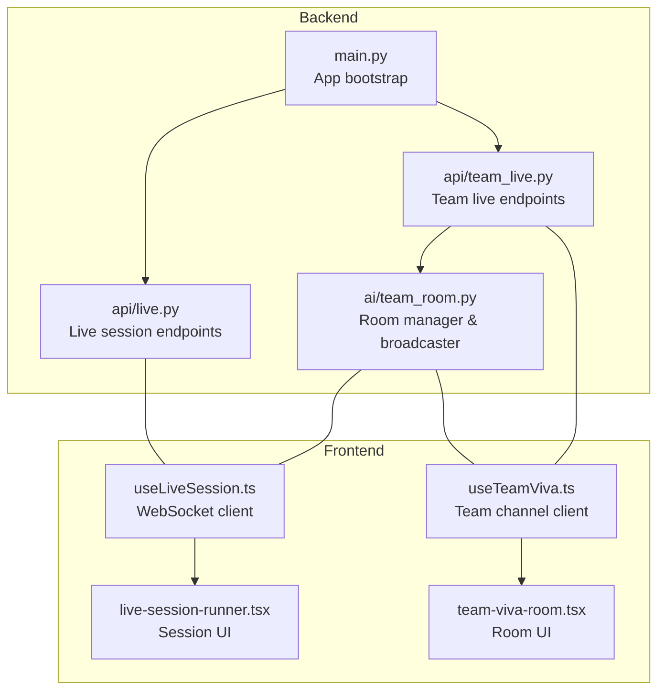
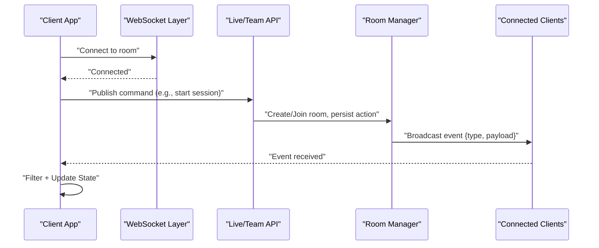
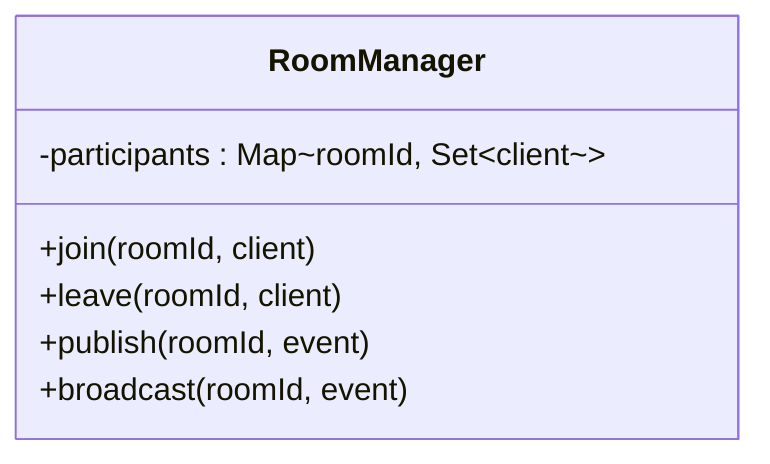
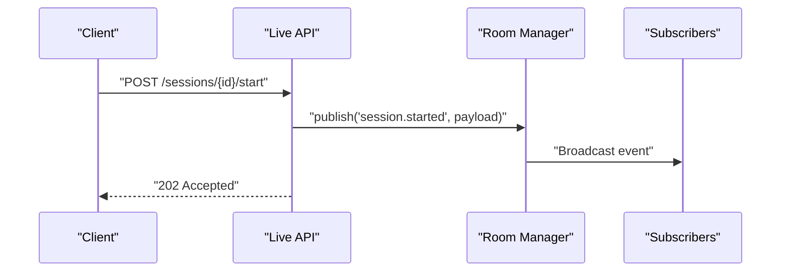
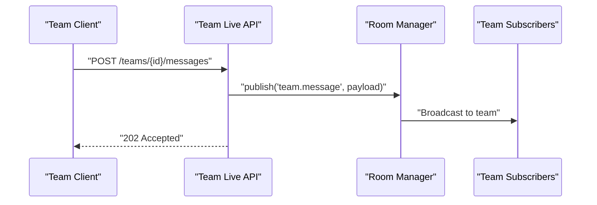
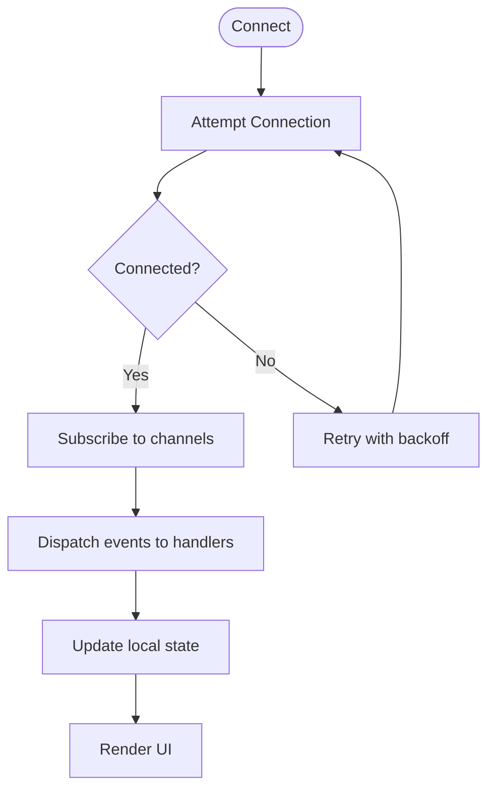
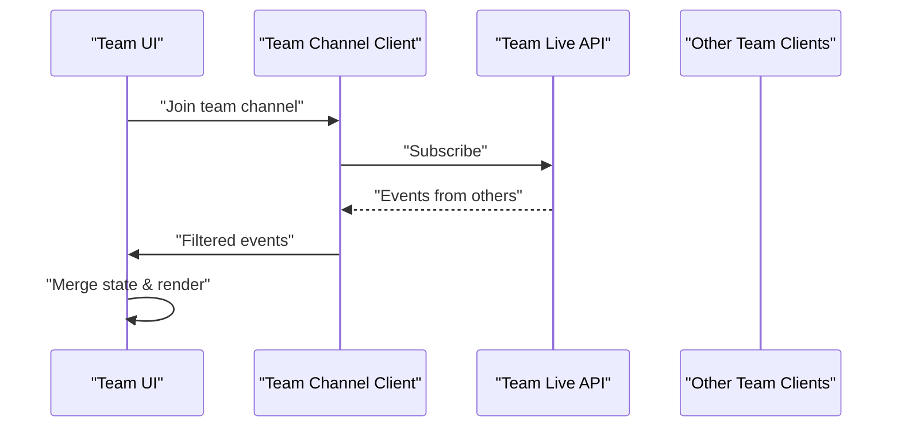
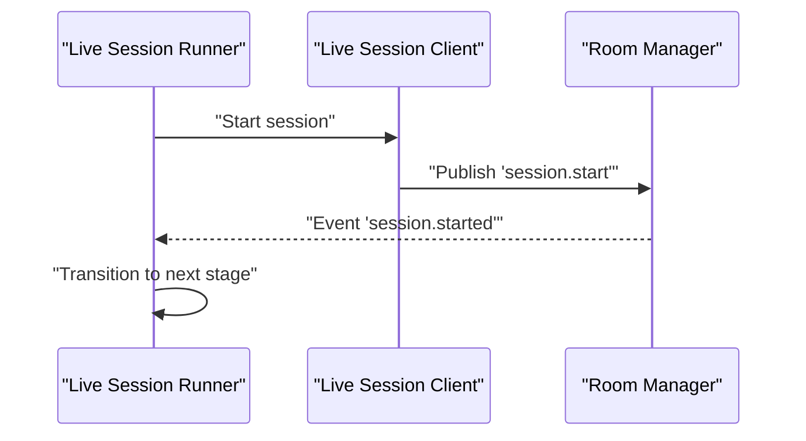
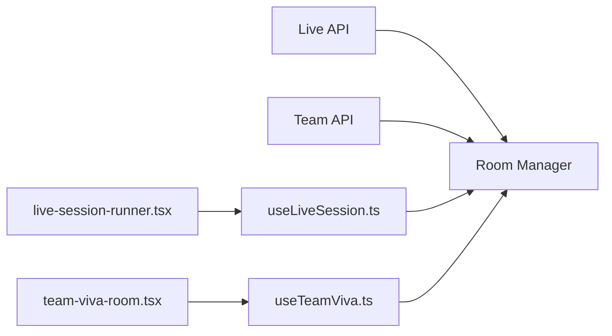

# Real-Time Event System

<cite>
**Referenced Files in This Document**
- [backend/main.py](file://backend/main.py)
- [backend/api/live.py](file://backend/api/live.py)
- [backend/api/team_live.py](file://backend/api/team_live.py)
- [backend/ai/team_room.py](file://backend/ai/team_room.py)
- [src/lib/useLiveSession.ts](file://src/lib/useLiveSession.ts)
- [src/lib/useTeamViva.ts](file://src/lib/useTeamViva.ts)
- [src/components/live/live-session-runner.tsx](file://src/components/live/live-session-runner.tsx)
- [src/components/live/team-viva-room.tsx](file://src/components/live/team-viva-room.tsx)
</cite>

## Table of Contents
1. [Introduction](#introduction)
2. [Project Structure](#project-structure)
3. [Core Components](#core-components)
4. [Architecture Overview](#architecture-overview)
5. [Detailed Component Analysis](#detailed-component-analysis)
6. [Dependency Analysis](#dependency-analysis)
7. [Performance Considerations](#performance-considerations)
8. [Troubleshooting Guide](#troubleshooting-guide)
9. [Conclusion](#conclusion)

## Introduction
This document explains the real-time event system architecture used across the application’s live features. It covers how events are published and subscribed to, how they are routed and broadcast, and how clients consume them. It also documents the event lifecycle, payload structures, delivery guarantees, ordering, duplicate prevention, and failure recovery strategies. Concrete examples illustrate custom event creation, filtering, and distributed handling patterns.

## Project Structure
The real-time event system spans backend endpoints and frontend hooks/components that manage WebSocket connections and event processing:

- Backend entrypoint initializes services and routes for live sessions and team rooms.
- Live API endpoints expose session management and room operations.
- Team room service manages per-room state and broadcasts events to participants.
- Frontend hooks establish and maintain WebSocket connections, subscribe to channels, and dispatch typed events to UI components.

**Diagram sources**
- [backend/main.py](file://backend/main.py)
- [backend/api/live.py](file://backend/api/live.py)
- [backend/api/team_live.py](file://backend/api/team_live.py)
- [backend/ai/team_room.py](file://backend/ai/team_room.py)
- [src/lib/useLiveSession.ts](file://src/lib/useLiveSession.ts)
- [src/lib/useTeamViva.ts](file://src/lib/useTeamViva.ts)
- [src/components/live/live-session-runner.tsx](file://src/components/live/live-session-runner.tsx)
- [src/components/live/team-viva-room.tsx](file://src/components/live/team-viva-room.tsx)

**Section sources**
- [backend/main.py](file://backend/main.py)
- [backend/api/live.py](file://backend/api/live.py)
- [backend/api/team_live.py](file://backend/api/team_live.py)
- [backend/ai/team_room.py](file://backend/ai/team_room.py)
- [src/lib/useLiveSession.ts](file://src/lib/useLiveSession.ts)
- [src/lib/useTeamViva.ts](file://src/lib/useTeamViva.ts)
- [src/components/live/live-session-runner.tsx](file://src/components/live/live-session-runner.tsx)
- [src/components/live/team-viva-room.tsx](file://src/components/live/team-viva-room.tsx)

## Core Components
- Room Manager (backend): Maintains per-room participant sets, persists or forwards messages, and broadcasts events to subscribers within a room.
- Live Session Client (frontend): Manages connection lifecycle, reconnection, message queueing, and typed event subscriptions.
- Team Channel Client (frontend): Specialized client for team-specific channels with filtering and local state updates.
- UI Orchestrators (frontend): Connect UI components to the appropriate clients and react to events.

Key responsibilities:
- Publishing: Endpoints accept commands and publish domain events into the room.
- Routing: Events are scoped by room/session identifiers and delivered only to relevant subscribers.
- Broadcasting: Room manager fans out events to all connected clients in the same room.
- Subscription: Clients register handlers for specific event types and channels.

**Section sources**
- [backend/api/team_live.py](file://backend/api/team_live.py)
- [backend/ai/team_room.py](file://backend/ai/team_room.py)
- [src/lib/useLiveSession.ts](file://src/lib/useLiveSession.ts)
- [src/lib/useTeamViva.ts](file://src/lib/useTeamViva.ts)
- [src/components/live/live-session-runner.tsx](file://src/components/live/live-session-runner.tsx)
- [src/components/live/team-viva-room.tsx](file://src/components/live/team-viva-room.tsx)

## Architecture Overview
The system follows a pub/sub model over WebSockets:

- Clients connect to a server-managed room identified by a session or team ID.
- The server validates requests, publishes events, and routes them to subscribers.
- Clients receive events, apply filters, update local state, and render UI changes.

**Diagram sources**
- [backend/api/live.py](file://backend/api/live.py)
- [backend/api/team_live.py](file://backend/api/team_live.py)
- [backend/ai/team_room.py](file://backend/ai/team_room.py)
- [src/lib/useLiveSession.ts](file://src/lib/useLiveSession.ts)
- [src/lib/useTeamViva.ts](file://src/lib/useTeamViva.ts)

## Detailed Component Analysis

### Room Manager (Server-Side Pub/Sub)
Responsibilities:
- Maintain active rooms keyed by room identifier.
- Track participants and their connections.
- Publish events to all participants in a room.
- Optionally persist events for replay or audit.

Design considerations:
- Concurrency-safe participant registry.
- Backpressure handling when broadcasting large payloads.
- Graceful cleanup on disconnects.

**Diagram sources**
- [backend/ai/team_room.py](file://backend/ai/team_room.py)

**Section sources**
- [backend/ai/team_room.py](file://backend/ai/team_room.py)

### Live Session API (Publishing Entry Points)
Responsibilities:
- Validate incoming requests.
- Create or join sessions.
- Publish domain events to the room manager.
- Return immediate acknowledgments where applicable.

Typical flow:
- Client sends a command via HTTP or WebSocket.
- Server validates and persists if needed.
- Server publishes an event to the room.
- All subscribers receive the event.

**Diagram sources**
- [backend/api/live.py](file://backend/api/live.py)
- [backend/ai/team_room.py](file://backend/ai/team_room.py)

**Section sources**
- [backend/api/live.py](file://backend/api/live.py)

### Team Live API (Team Channels)
Responsibilities:
- Manage team-scoped channels.
- Route events to team members.
- Enforce permissions and presence.

**Diagram sources**
- [backend/api/team_live.py](file://backend/api/team_live.py)
- [backend/ai/team_room.py](file://backend/ai/team_room.py)

**Section sources**
- [backend/api/team_live.py](file://backend/api/team_live.py)

### Frontend Live Session Client
Responsibilities:
- Establish and maintain WebSocket connections.
- Reconnect on failures with exponential backoff.
- Subscribe to typed events and route to handlers.
- Queue outgoing messages during transient failures.

**Diagram sources**
- [src/lib/useLiveSession.ts](file://src/lib/useLiveSession.ts)

**Section sources**
- [src/lib/useLiveSession.ts](file://src/lib/useLiveSession.ts)

### Frontend Team Channel Client
Responsibilities:
- Join team channels.
- Filter events by sender or type.
- Merge remote state with optimistic UI updates.

**Diagram sources**
- [src/lib/useTeamViva.ts](file://src/lib/useTeamViva.ts)
- [src/components/live/team-viva-room.tsx](file://src/components/live/team-viva-room.tsx)

**Section sources**
- [src/lib/useTeamViva.ts](file://src/lib/useTeamViva.ts)
- [src/components/live/team-viva-room.tsx](file://src/components/live/team-viva-room.tsx)

### UI Orchestrators
- Live Session Runner: Coordinates session lifecycle events and renders stage transitions based on events.
- Team Viva Room: Manages collaborative interactions and reflects real-time changes.

**Diagram sources**
- [src/components/live/live-session-runner.tsx](file://src/components/live/live-session-runner.tsx)
- [src/lib/useLiveSession.ts](file://src/lib/useLiveSession.ts)

**Section sources**
- [src/components/live/live-session-runner.tsx](file://src/components/live/live-session-runner.tsx)
- [src/lib/useLiveSession.ts](file://src/lib/useLiveSession.ts)

## Dependency Analysis
- Backend depends on:
  - Room manager for routing and broadcasting.
  - Persistence layer for durable event storage (if enabled).
- Frontend depends on:
  - WebSocket client libraries.
  - Local state managers for reactive UI updates.

**Diagram sources**
- [backend/api/live.py](file://backend/api/live.py)
- [backend/api/team_live.py](file://backend/api/team_live.py)
- [backend/ai/team_room.py](file://backend/ai/team_room.py)
- [src/lib/useLiveSession.ts](file://src/lib/useLiveSession.ts)
- [src/lib/useTeamViva.ts](file://src/lib/useTeamViva.ts)
- [src/components/live/live-session-runner.tsx](file://src/components/live/live-session-runner.tsx)
- [src/components/live/team-viva-room.tsx](file://src/components/live/team-viva-room.tsx)

**Section sources**
- [backend/api/live.py](file://backend/api/live.py)
- [backend/api/team_live.py](file://backend/api/team_live.py)
- [backend/ai/team_room.py](file://backend/ai/team_room.py)
- [src/lib/useLiveSession.ts](file://src/lib/useLiveSession.ts)
- [src/lib/useTeamViva.ts](file://src/lib/useTeamViva.ts)
- [src/components/live/live-session-runner.tsx](file://src/components/live/live-session-runner.tsx)
- [src/components/live/team-viva-room.tsx](file://src/components/live/team-viva-room.tsx)

## Performance Considerations
- Batch small events to reduce overhead.
- Apply client-side filtering to minimize unnecessary processing.
- Use idempotent event IDs to deduplicate messages.
- Implement backpressure by dropping low-priority events under load.
- Keep payloads compact; send references for large objects when possible.

[No sources needed since this section provides general guidance]

## Troubleshooting Guide
Common issues and remedies:
- Connection drops: Ensure exponential backoff and automatic reconnection logic is implemented.
- Duplicate events: Use unique event IDs and client-side deduplication.
- Out-of-order events: Attach sequence numbers and reorder on the client if strict ordering is required.
- Stale state: Include versioned snapshots or delta merges to reconcile state after reconnects.
- Permission errors: Validate room membership and roles before publishing.

**Section sources**
- [src/lib/useLiveSession.ts](file://src/lib/useLiveSession.ts)
- [src/lib/useTeamViva.ts](file://src/lib/useTeamViva.ts)

## Conclusion
The real-time event system leverages a clear pub/sub pattern with room-scoped routing and robust client-side subscription management. By combining server-side broadcasting with client-side filtering and state reconciliation, it supports responsive, collaborative experiences. Following the recommended practices for ordering, deduplication, and recovery ensures reliability at scale.