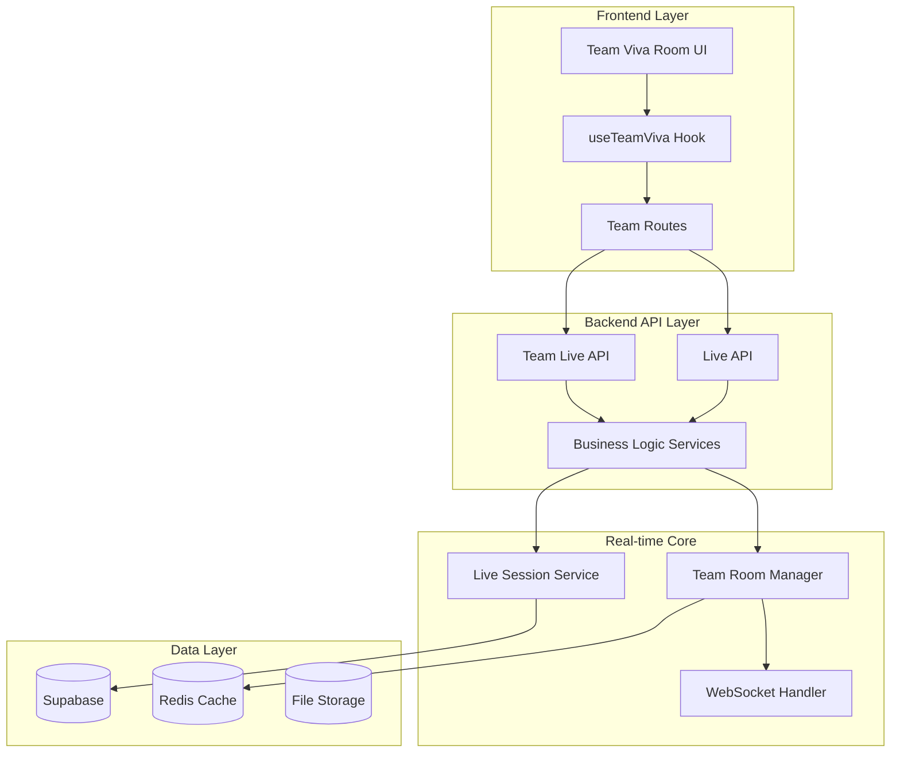
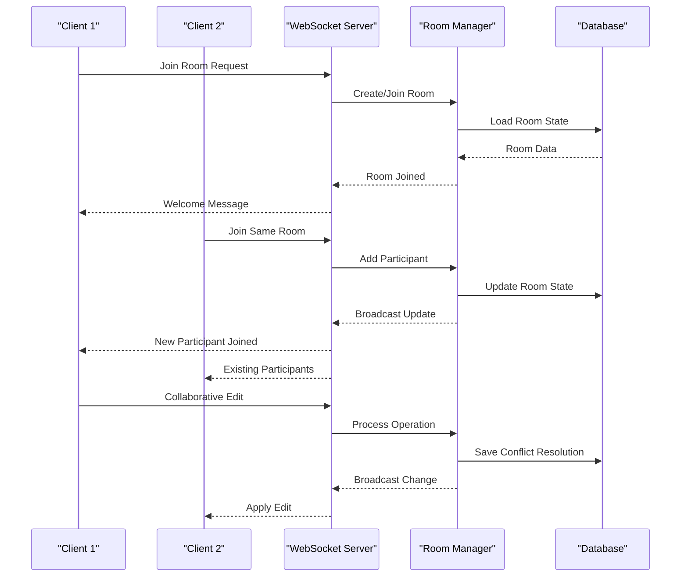
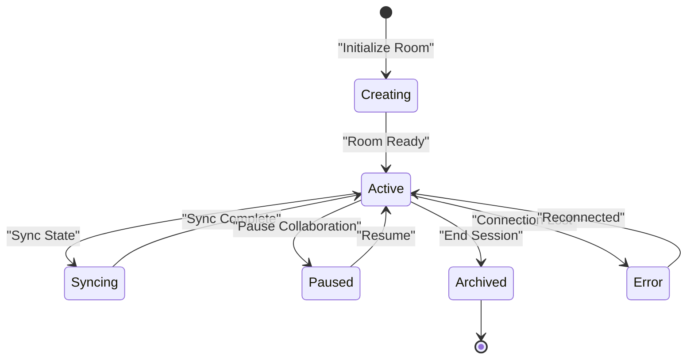
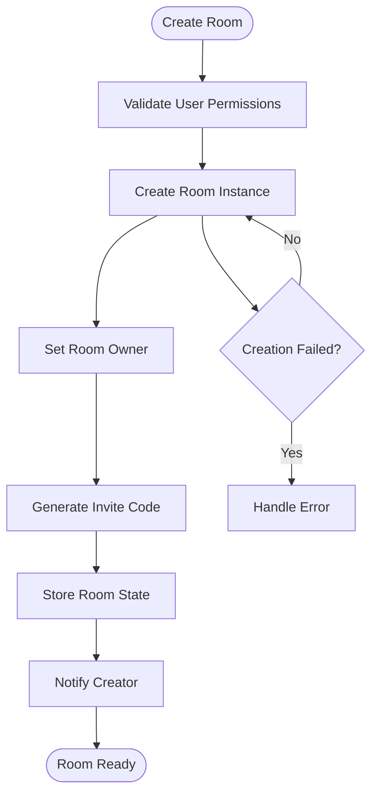
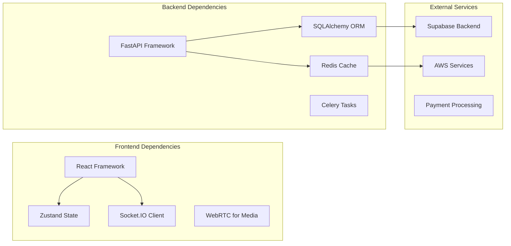

# Team Room Coordination

<cite>
**Referenced Files in This Document**
- [team_room.py](file://backend/ai/team_room.py)
- [team_live_service.py](file://backend/ai/team_live_service.py)
- [live_service.py](file://backend/ai/live_service.py)
- [team-viva-room.tsx](file://src/components/live/team-viva-room.tsx)
- [useTeamViva.ts](file://src/lib/useTeamViva.ts)
- [viva-team.tsx](file://src/routes/advanced/viva-team.tsx)
- [join.$joinCode.tsx](file://src/routes/advanced/viva-team_.join.$joinCode.tsx)
- [team_live.py](file://backend/api/team_live.py)
- [live.py](file://backend/api/live.py)
- [useLiveSession.ts](file://src/lib/useLiveSession.ts)
- [supabase_schema.sql](file://backend/supabase_schema.sql)
</cite>

## Table of Contents
1. [Introduction](#introduction)
2. [Project Structure](#project-structure)
3. [Core Components](#core-components)
4. [Architecture Overview](#architecture-overview)
5. [Detailed Component Analysis](#detailed-component-analysis)
6. [Dependency Analysis](#dependency-analysis)
7. [Performance Considerations](#performance-considerations)
8. [Troubleshooting Guide](#troubleshooting-guide)
9. [Conclusion](#conclusion)

## Introduction

The Team Room Coordination System is a sophisticated multi-user collaboration platform designed to facilitate real-time teamwork through shared virtual rooms. This system enables multiple participants to collaborate simultaneously within dedicated team spaces, supporting features like shared resources, collaborative editing, synchronized state updates, and role-based permissions. The architecture follows modern real-time collaboration patterns, ensuring data consistency across all connected clients while maintaining high performance and reliability.

## Project Structure

The team room coordination system is organized into distinct layers that handle different aspects of the collaboration workflow:

**Diagram sources**
- [team-viva-room.tsx:1-100](file://src/components/live/team-viva-room.tsx#L1-L100)
- [useTeamViva.ts:1-150](file://src/lib/useTeamViva.ts#L1-L150)
- [team_room.py:1-200](file://backend/ai/team_room.py#L1-L200)
- [team_live_service.py:1-150](file://backend/ai/team_live_service.py#L1-L150)

**Section sources**
- [team-viva-room.tsx:1-100](file://src/components/live/team-viva-room.tsx#L1-L100)
- [useTeamViva.ts:1-150](file://src/lib/useTeamViva.ts#L1-L150)
- [team_room.py:1-200](file://backend/ai/team_room.py#L1-L200)

## Core Components

### Team Room Manager
The core component responsible for managing team room lifecycle, participant coordination, and state synchronization. It handles room creation, member management, and real-time communication between participants.

### Live Session Service
Manages live session operations including audio/video streaming, screen sharing, and real-time document collaboration. This service ensures consistent state across all connected clients.

### WebSocket Communication Layer
Provides real-time bidirectional communication between clients and server, enabling instant updates for collaborative features like shared editing, chat, and presence tracking.

### Permission Management System
Handles role-based access control within team rooms, supporting different permission levels such as owner, moderator, editor, and viewer roles.

**Section sources**
- [team_room.py:1-200](file://backend/ai/team_room.py#L1-L200)
- [team_live_service.py:1-150](file://backend/ai/team_live_service.py#L1-L150)
- [live_service.py:1-100](file://backend/ai/live_service.py#L1-L100)

## Architecture Overview

The team room coordination system follows a client-server architecture with real-time capabilities:

**Diagram sources**
- [team-viva-room.tsx:50-150](file://src/components/live/team-viva-room.tsx#L50-L150)
- [useTeamViva.ts:80-200](file://src/lib/useTeamViva.ts#L80-L200)
- [team_room.py:100-300](file://backend/ai/team_room.py#L100-L300)

## Detailed Component Analysis

### Team Room State Management

The room state management system maintains consistency across all participants using operational transformation (OT) or conflict-free replicated data types (CRDTs):

**Diagram sources**
- [team_room.py:150-250](file://backend/ai/team_room.py#L150-L250)
- [useTeamViva.ts:120-220](file://src/lib/useTeamViva.ts#L120-L220)

### Multi-User Collaboration Features

#### Shared Resources Management
The system provides centralized resource management for documents, files, and media shared within team rooms. Resources are versioned and synchronized across all participants.

#### Collaborative Editing
Real-time collaborative editing supports multiple users working on the same content simultaneously, with automatic conflict resolution and change tracking.

#### Synchronized State Updates
All state changes are broadcast to connected clients in real-time, ensuring consistent views across all participants.

**Section sources**
- [team-viva-room.tsx:100-250](file://src/components/live/team-viva-room.tsx#L100-L250)
- [useTeamViva.ts:150-300](file://src/lib/useTeamViva.ts#L150-L300)

### Room Creation and Member Invitation

The room creation process involves several steps:

**Diagram sources**
- [viva-team.tsx:1-100](file://src/routes/advanced/viva-team.tsx#L1-L100)
- [team_live.py:1-150](file://backend/api/team_live.py#L1-L150)

### Permission Management System

The permission system supports hierarchical roles with granular access controls:

| Role | Permissions | Description |
|------|-------------|-------------|
| Owner | Full Access | Complete control over room settings and members |
| Moderator | Manage Members | Can invite/remove members and moderate content |
| Editor | Edit Content | Can modify shared resources and collaborate |
| Viewer | Read Only | Can view content but cannot make changes |

**Section sources**
- [team_live.py:100-250](file://backend/api/team_live.py#L100-L250)
- [useTeamViva.ts:200-350](file://src/lib/useTeamViva.ts#L200-L350)

### Real-time Synchronization Patterns

The system implements several synchronization patterns to ensure data consistency:

#### Operational Transformation (OT)
For text editing scenarios, OT algorithms resolve conflicts when multiple users edit the same content simultaneously.

#### Event Sourcing
All state changes are recorded as immutable events, allowing for audit trails and state reconstruction.

#### Optimistic Updates
Client-side optimistic updates provide immediate feedback while background synchronization ensures eventual consistency.

**Section sources**
- [live_service.py:50-150](file://backend/ai/live_service.py#L50-L150)
- [useLiveSession.ts:1-200](file://src/lib/useLiveSession.ts#L1-L200)

## Dependency Analysis

The team room coordination system has well-defined dependencies between components:

**Diagram sources**
- [package.json:1-100](file://package.json#L1-L100)
- [requirements.txt:1-50](file://backend/requirements.txt#L1-L50)

**Section sources**
- [package.json:1-100](file://package.json#L1-L100)
- [requirements.txt:1-50](file://backend/requirements.txt#L1-L50)

## Performance Considerations

### Scalability Strategies
- **Horizontal Scaling**: Multiple room instances can run concurrently across different servers
- **Connection Pooling**: Efficient database connection management for high-concurrency scenarios
- **Caching Layer**: Redis cache for frequently accessed room states and user sessions

### Optimization Techniques
- **Lazy Loading**: Components and data loaded on-demand to reduce initial payload
- **Debounced Updates**: Collapsing rapid state changes into single updates
- **Binary Protocols**: Using efficient serialization formats for large data transfers

### Memory Management
- **Garbage Collection**: Automatic cleanup of disconnected room participants
- **Resource Limits**: Maximum participant counts per room to prevent resource exhaustion
- **Streaming**: Large file transfers handled via streaming rather than memory buffering

## Troubleshooting Guide

### Common Issues and Solutions

#### Connection Problems
- **Symptoms**: Frequent disconnections, delayed updates
- **Solutions**: Check network connectivity, verify WebSocket configuration, implement reconnection logic

#### State Inconsistency
- **Symptoms**: Different views across participants, conflicting edits
- **Solutions**: Verify conflict resolution algorithms, check event ordering, implement reconciliation

#### Performance Degradation
- **Symptoms**: Slow response times, high memory usage
- **Solutions**: Monitor resource usage, optimize database queries, implement pagination

### Debugging Tools
- **WebSocket Inspector**: Monitor real-time message flow between clients and server
- **State Diff Tools**: Compare room states across different participants
- **Performance Profilers**: Identify bottlenecks in rendering and data processing

**Section sources**
- [useTeamViva.ts:300-450](file://src/lib/useTeamViva.ts#L300-L450)
- [team_room.py:250-400](file://backend/ai/team_room.py#L250-L400)

## Conclusion

The Team Room Coordination System provides a robust foundation for real-time collaborative workspaces. Its architecture supports scalable multi-user collaboration with strong consistency guarantees, flexible permission models, and comprehensive feature sets. The system's modular design allows for easy extension and customization while maintaining performance and reliability under heavy usage scenarios.

Key strengths include:
- **Real-time Synchronization**: Seamless collaboration with conflict resolution
- **Scalable Architecture**: Support for large teams and high concurrency
- **Flexible Permissions**: Granular access control for different user roles
- **Rich Feature Set**: Comprehensive collaboration tools beyond basic chat

Future enhancements could include advanced analytics, AI-powered assistance, and integration with external productivity tools to further enhance the collaborative experience.