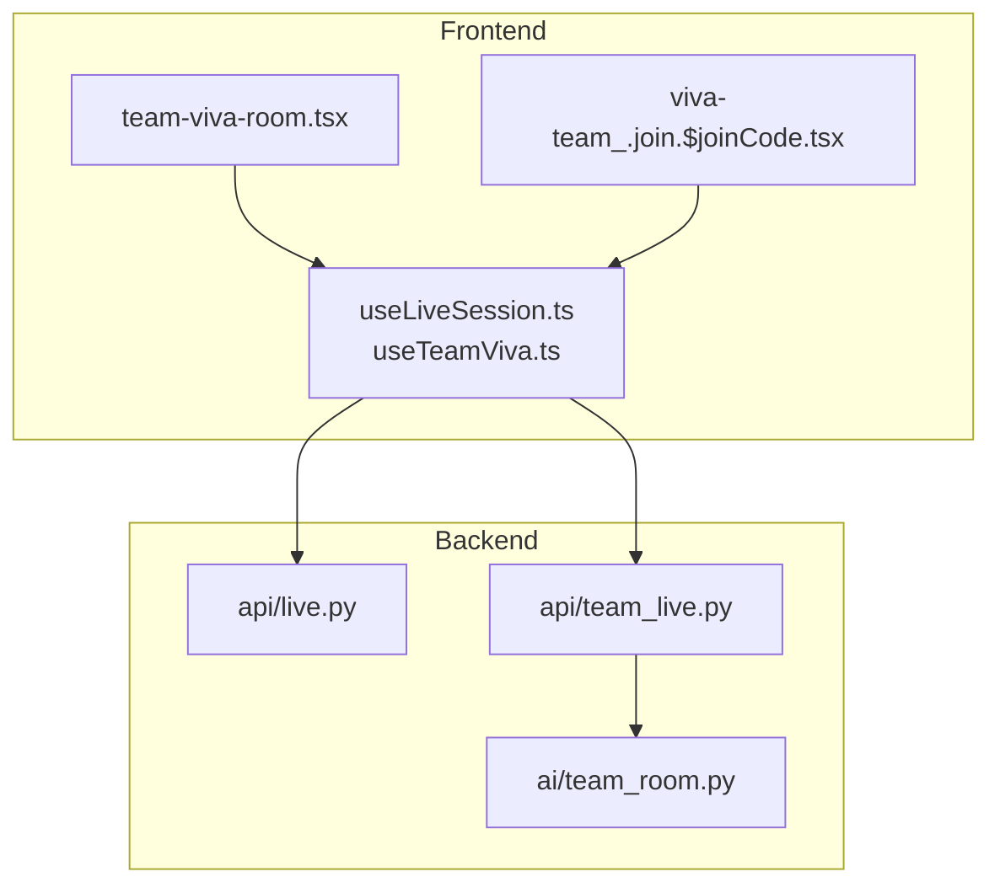
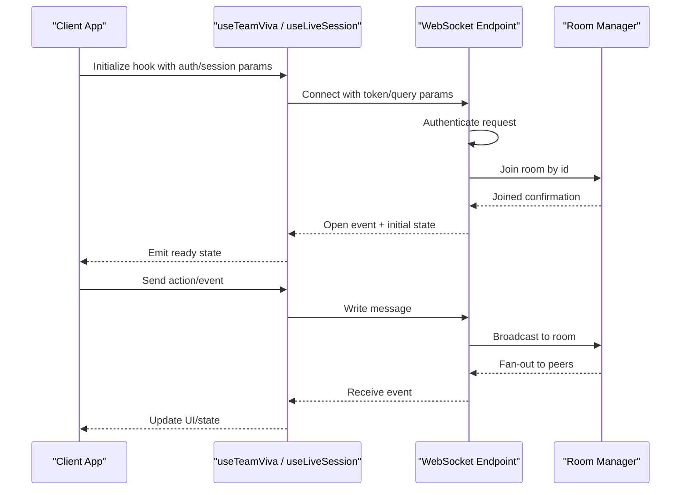
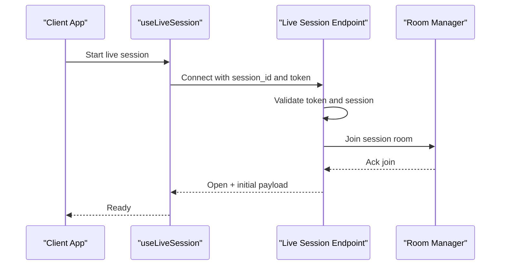
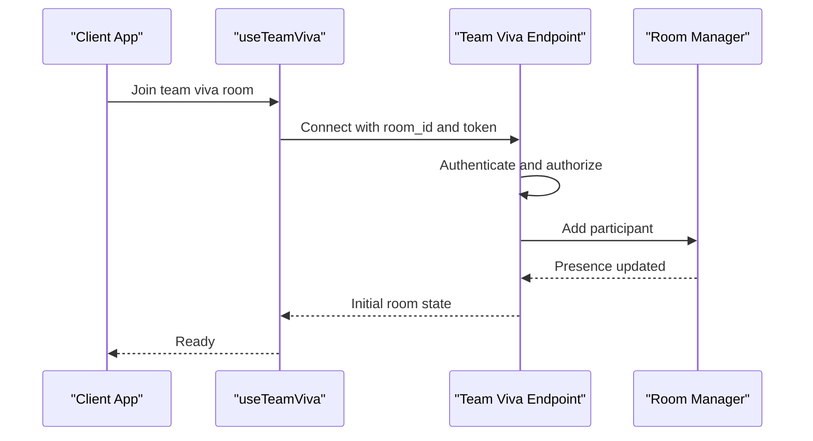
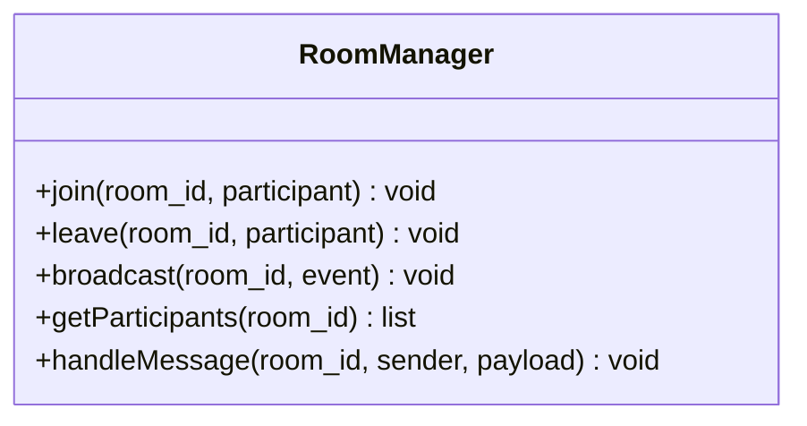
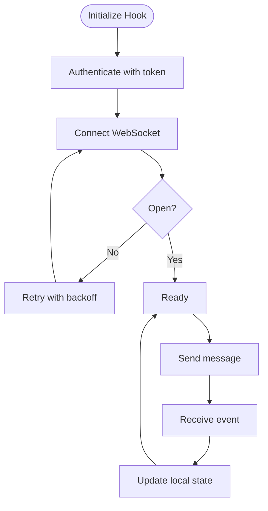
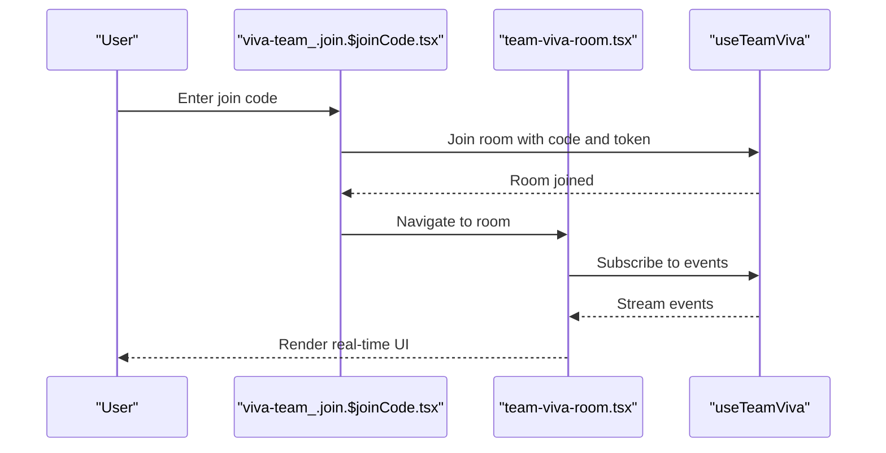
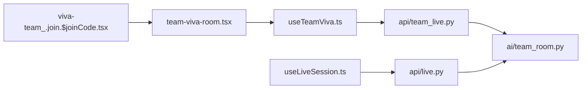

# WebSocket Communication Protocol

<cite>
**Referenced Files in This Document**
- [backend/api/live.py](file://backend/api/live.py)
- [backend/api/team_live.py](file://backend/api/team_live.py)
- [backend/ai/team_room.py](file://backend/ai/team_room.py)
- [src/lib/useLiveSession.ts](file://src/lib/useLiveSession.ts)
- [src/lib/useTeamViva.ts](file://src/lib/useTeamViva.ts)
- [src/components/live/team-viva-room.tsx](file://src/components/live/team-viva-room.tsx)
- [src/routes/advanced/viva-team_.join.$joinCode.tsx](file://src/routes/advanced/viva-team_.join.$joinCode.tsx)
</cite>

## Table of Contents
1. [Introduction](#introduction)
2. [Project Structure](#project-structure)
3. [Core Components](#core-components)
4. [Architecture Overview](#architecture-overview)
5. [Detailed Component Analysis](#detailed-component-analysis)
6. [Dependency Analysis](#dependency-analysis)
7. [Performance Considerations](#performance-considerations)
8. [Troubleshooting Guide](#troubleshooting-guide)
9. [Conclusion](#conclusion)
10. [Appendices](#appendices)

## Introduction
This document describes the WebSocket communication protocol used for real-time collaboration features, including live sessions and team viva rooms. It covers connection establishment, authentication handshake, message formats, event types, error handling, reconnection strategies, performance optimization, security considerations, rate limiting, and debugging approaches. The documentation is derived from the backend WebSocket endpoints and frontend hooks that implement the client-side behavior.

## Project Structure
The WebSocket functionality spans both backend and frontend:
- Backend endpoints expose WebSocket routes for live sessions and team viva rooms.
- A room abstraction manages participants and broadcasts events.
- Frontend hooks encapsulate connection lifecycle, authentication, and event handling.

**Diagram sources**
- [backend/api/live.py](file://backend/api/live.py)
- [backend/api/team_live.py](file://backend/api/team_live.py)
- [backend/ai/team_room.py](file://backend/ai/team_room.py)
- [src/lib/useLiveSession.ts](file://src/lib/useLiveSession.ts)
- [src/lib/useTeamViva.ts](file://src/lib/useTeamViva.ts)
- [src/components/live/team-viva-room.tsx](file://src/components/live/team-viva-room.tsx)
- [src/routes/advanced/viva-team_.join.$joinCode.tsx](file://src/routes/advanced/viva-team_.join.$joinCode.tsx)

**Section sources**
- [backend/api/live.py](file://backend/api/live.py)
- [backend/api/team_live.py](file://backend/api/team_live.py)
- [backend/ai/team_room.py](file://backend/ai/team_room.py)
- [src/lib/useLiveSession.ts](file://src/lib/useLiveSession.ts)
- [src/lib/useTeamViva.ts](file://src/lib/useTeamViva.ts)
- [src/components/live/team-viva-room.tsx](file://src/components/live/team-viva-room.tsx)
- [src/routes/advanced/viva-team_.join.$joinCode.tsx](file://src/routes/advanced/viva-team_.join.$joinCode.tsx)

## Core Components
- Live session endpoint: Provides a WebSocket route for individual or shared live sessions.
- Team viva endpoint: Provides a WebSocket route for collaborative team viva rooms.
- Room manager: Maintains participant state and handles broadcasting to room members.
- Client hooks: Manage connection lifecycle, authentication, message routing, and reconnection.

Key responsibilities:
- Connection handling and per-client context.
- Authentication via token or query parameters.
- Event-driven messaging with typed payloads.
- Room membership management and fan-out.
- Error propagation and graceful degradation.

**Section sources**
- [backend/api/live.py](file://backend/api/live.py)
- [backend/api/team_live.py](file://backend/api/team_live.py)
- [backend/ai/team_room.py](file://backend/ai/team_room.py)
- [src/lib/useLiveSession.ts](file://src/lib/useLiveSession.ts)
- [src/lib/useTeamViva.ts](file://src/lib/useTeamViva.ts)

## Architecture Overview
The system follows a hub-and-spoke model where clients connect to a specific room (session or team viva). The server authenticates the connection, joins the client to the appropriate room, and forwards messages between participants.

**Diagram sources**
- [backend/api/team_live.py](file://backend/api/team_live.py)
- [backend/ai/team_room.py](file://backend/ai/team_room.py)
- [src/lib/useTeamViva.ts](file://src/lib/useTeamViva.ts)
- [src/lib/useLiveSession.ts](file://src/lib/useLiveSession.ts)

## Detailed Component Analysis

### Live Session WebSocket API
- Purpose: Real-time updates for a single live session or small group.
- Connection: Establishes a WebSocket connection using a session identifier and authentication token.
- Authentication: Validates credentials before joining the session room.
- Events: Emits session-wide events such as presence changes, state updates, and user actions.
- Errors: Returns structured errors for invalid tokens, missing session, or permission issues.

**Diagram sources**
- [backend/api/live.py](file://backend/api/live.py)
- [backend/ai/team_room.py](file://backend/ai/team_room.py)
- [src/lib/useLiveSession.ts](file://src/lib/useLiveSession.ts)

**Section sources**
- [backend/api/live.py](file://backend/api/live.py)
- [backend/ai/team_room.py](file://backend/ai/team_room.py)
- [src/lib/useLiveSession.ts](file://src/lib/useLiveSession.ts)

### Team Viva WebSocket API
- Purpose: Collaborative real-time interaction within a team viva room.
- Connection: Clients connect using a room identifier and authentication token.
- Authentication: Verifies user identity and permissions to join the specified room.
- Events: Supports presence, chat-like messages, and room state synchronization.
- Errors: Handles unauthorized access, full rooms, and malformed messages.

**Diagram sources**
- [backend/api/team_live.py](file://backend/api/team_live.py)
- [backend/ai/team_room.py](file://backend/ai/team_room.py)
- [src/lib/useTeamViva.ts](file://src/lib/useTeamViva.ts)

**Section sources**
- [backend/api/team_live.py](file://backend/api/team_live.py)
- [backend/ai/team_room.py](file://backend/ai/team_room.py)
- [src/lib/useTeamViva.ts](file://src/lib/useTeamViva.ts)

### Room Manager
- Purpose: Central coordination for multi-participant rooms.
- Responsibilities:
  - Maintain participant lists and metadata.
  - Route messages to all participants except sender when required.
  - Handle join/leave events and broadcast presence changes.
  - Enforce basic validation on incoming messages.

**Diagram sources**
- [backend/ai/team_room.py](file://backend/ai/team_room.py)

**Section sources**
- [backend/ai/team_room.py](file://backend/ai/team_room.py)

### Client Hooks
- useLiveSession: Encapsulates live session WebSocket lifecycle, authentication, and event handling.
- useTeamViva: Encapsulates team viva room WebSocket lifecycle, authentication, and event handling.
- Common behaviors:
  - Automatic reconnection with exponential backoff.
  - Heartbeat/ping-pong to detect liveness.
  - Message queuing while connecting.
  - Error normalization and retry policies.

**Diagram sources**
- [src/lib/useLiveSession.ts](file://src/lib/useLiveSession.ts)
- [src/lib/useTeamViva.ts](file://src/lib/useTeamViva.ts)

**Section sources**
- [src/lib/useLiveSession.ts](file://src/lib/useLiveSession.ts)
- [src/lib/useTeamViva.ts](file://src/lib/useTeamViva.ts)

### UI Integration Points
- team-viva-room.tsx: Renders the team viva interface and consumes the team viva hook.
- viva-team_.join.$joinCode.tsx: Orchestrates joining a team viva room using a join code and navigates to the room view.

**Diagram sources**
- [src/routes/advanced/viva-team_.join.$joinCode.tsx](file://src/routes/advanced/viva-team_.join.$joinCode.tsx)
- [src/components/live/team-viva-room.tsx](file://src/components/live/team-viva-room.tsx)
- [src/lib/useTeamViva.ts](file://src/lib/useTeamViva.ts)

**Section sources**
- [src/routes/advanced/viva-team_.join.$joinCode.tsx](file://src/routes/advanced/viva-team_.join.$joinCode.tsx)
- [src/components/live/team-viva-room.tsx](file://src/components/live/team-viva-room.tsx)
- [src/lib/useTeamViva.ts](file://src/lib/useTeamViva.ts)

## Dependency Analysis
The following diagram shows how components depend on each other across the stack.

**Diagram sources**
- [src/routes/advanced/viva-team_.join.$joinCode.tsx](file://src/routes/advanced/viva-team_.join.$joinCode.tsx)
- [src/components/live/team-viva-room.tsx](file://src/components/live/team-viva-room.tsx)
- [src/lib/useTeamViva.ts](file://src/lib/useTeamViva.ts)
- [src/lib/useLiveSession.ts](file://src/lib/useLiveSession.ts)
- [backend/api/live.py](file://backend/api/live.py)
- [backend/api/team_live.py](file://backend/api/team_live.py)
- [backend/ai/team_room.py](file://backend/ai/team_room.py)

**Section sources**
- [src/routes/advanced/viva-team_.join.$joinCode.tsx](file://src/routes/advanced/viva-team_.join.$joinCode.tsx)
- [src/components/live/team-viva-room.tsx](file://src/components/live/team-viva-room.tsx)
- [src/lib/useTeamViva.ts](file://src/lib/useTeamViva.ts)
- [src/lib/useLiveSession.ts](file://src/lib/useLiveSession.ts)
- [backend/api/live.py](file://backend/api/live.py)
- [backend/api/team_live.py](file://backend/api/team_live.py)
- [backend/ai/team_room.py](file://backend/ai/team_room.py)

## Performance Considerations
- Minimize payload size: Use compact event schemas and avoid sending large blobs over WebSocket.
- Debounce high-frequency events: Coalesce rapid UI interactions (e.g., typing) before sending.
- Batch updates: Group multiple state changes into a single message when possible.
- Efficient presence: Only broadcast deltas rather than full room state.
- Backpressure handling: Queue outgoing messages and drop non-critical ones under load.
- Heartbeats: Implement periodic ping/pong to detect dead connections early.
- Reconnection tuning: Use exponential backoff with jitter; cap maximum retries.
- Room scoping: Ensure messages are routed only to relevant rooms to reduce fan-out overhead.

[No sources needed since this section provides general guidance]

## Troubleshooting Guide
Common issues and strategies:
- Authentication failures: Verify token validity and scope; ensure correct query parameters or headers.
- Connection drops: Check network stability; rely on automatic reconnection with backoff.
- Stale state: On reconnect, request a fresh room snapshot if available.
- Message ordering: If order matters, include sequence numbers and handle out-of-order delivery.
- Excessive CPU/memory: Profile event handlers; avoid heavy computations on the main thread.
- Debugging: Log connection lifecycle events, message counts, and error codes; capture minimal reproducible payloads.

**Section sources**
- [src/lib/useLiveSession.ts](file://src/lib/useLiveSession.ts)
- [src/lib/useTeamViva.ts](file://src/lib/useTeamViva.ts)
- [backend/api/live.py](file://backend/api/live.py)
- [backend/api/team_live.py](file://backend/api/team_live.py)

## Conclusion
The WebSocket protocol enables real-time collaboration through well-defined endpoints and a robust room abstraction. By standardizing authentication, event formats, and reconnection strategies, the system delivers responsive, scalable collaboration experiences. Adhering to performance and security best practices ensures reliability and maintainability at scale.

[No sources needed since this section summarizes without analyzing specific files]

## Appendices

### Connection Establishment
- Endpoints:
  - Live session: WebSocket route exposed by the live API module.
  - Team viva: WebSocket route exposed by the team live API module.
- Parameters:
  - Authentication token (required).
  - Room or session identifier (required).
- Lifecycle:
  - Connect -> Authenticate -> Join room -> Open -> Ready.

**Section sources**
- [backend/api/live.py](file://backend/api/live.py)
- [backend/api/team_live.py](file://backend/api/team_live.py)
- [src/lib/useLiveSession.ts](file://src/lib/useLiveSession.ts)
- [src/lib/useTeamViva.ts](file://src/lib/useTeamViva.ts)

### Authentication Handshake
- Token-based authentication prior to joining a room.
- Authorization checks for room membership and permissions.
- Failure responses indicate invalid tokens or insufficient privileges.

**Section sources**
- [backend/api/live.py](file://backend/api/live.py)
- [backend/api/team_live.py](file://backend/api/team_live.py)

### Message Formats and Event Types
- Messages:
  - Structured payloads with type identifiers and data fields.
  - Examples include presence updates, chat-like messages, and state sync events.
- Events:
  - Room-level events (join, leave, update).
  - Application-specific events (actions, annotations, media control).
- Delivery:
  - Server fans out events to all participants except the sender when applicable.

**Section sources**
- [backend/ai/team_room.py](file://backend/ai/team_room.py)
- [src/lib/useTeamViva.ts](file://src/lib/useTeamViva.ts)
- [src/lib/useLiveSession.ts](file://src/lib/useLiveSession.ts)

### Error Handling Strategies
- Client-side:
  - Normalize errors and present actionable feedback.
  - Retry failed operations with backoff.
- Server-side:
  - Return structured error codes and messages.
  - Close connections on unrecoverable errors.

**Section sources**
- [backend/api/live.py](file://backend/api/live.py)
- [backend/api/team_live.py](file://backend/api/team_live.py)
- [src/lib/useLiveSession.ts](file://src/lib/useLiveSession.ts)
- [src/lib/useTeamViva.ts](file://src/lib/useTeamViva.ts)

### Reconnection Mechanisms
- Automatic reconnection with exponential backoff and jitter.
- State reconciliation after reconnect (request latest room state).
- Graceful degradation when server is unavailable.

**Section sources**
- [src/lib/useLiveSession.ts](file://src/lib/useLiveSession.ts)
- [src/lib/useTeamViva.ts](file://src/lib/useTeamViva.ts)

### Security Considerations
- Always authenticate connections before granting access.
- Validate and sanitize all incoming messages.
- Enforce least privilege for room access.
- Rate limit per client and per room to prevent abuse.

**Section sources**
- [backend/api/live.py](file://backend/api/live.py)
- [backend/api/team_live.py](file://backend/api/team_live.py)
- [backend/ai/team_room.py](file://backend/ai/team_room.py)

### Rate Limiting
- Apply per-client limits for message frequency.
- Throttle high-volume events (e.g., presence, typing indicators).
- Return explicit throttling signals to clients for adaptive behavior.

**Section sources**
- [backend/api/live.py](file://backend/api/live.py)
- [backend/api/team_live.py](file://backend/api/team_live.py)

### Debugging Approaches
- Enable verbose logging for connection lifecycle and events.
- Capture minimal payloads for reproduction.
- Monitor metrics: connection count, message throughput, error rates.
- Use browser dev tools and server logs to correlate client-server behavior.

**Section sources**
- [src/lib/useLiveSession.ts](file://src/lib/useLiveSession.ts)
- [src/lib/useTeamViva.ts](file://src/lib/useTeamViva.ts)
- [backend/api/live.py](file://backend/api/live.py)
- [backend/api/team_live.py](file://backend/api/team_live.py)