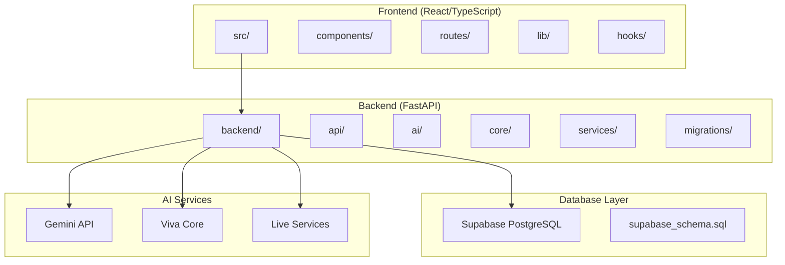
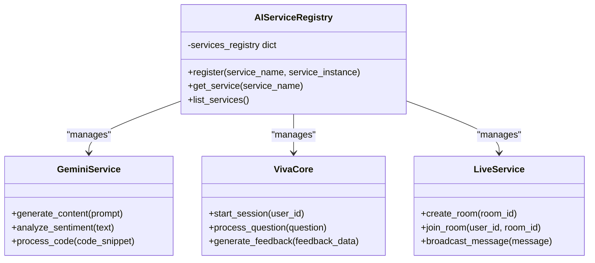
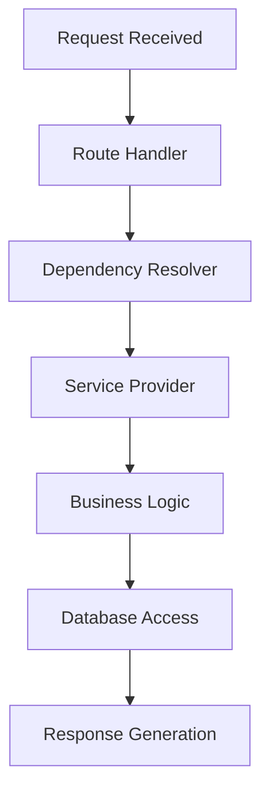
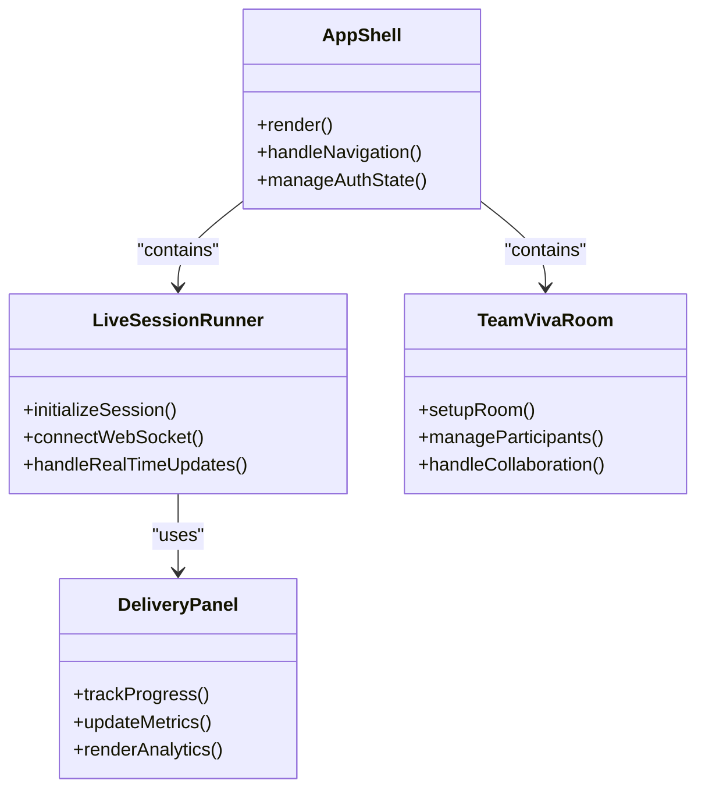
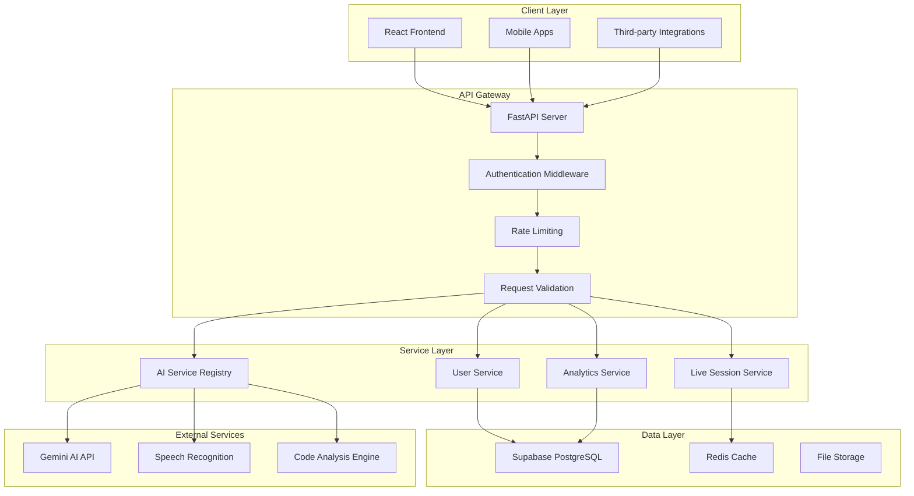
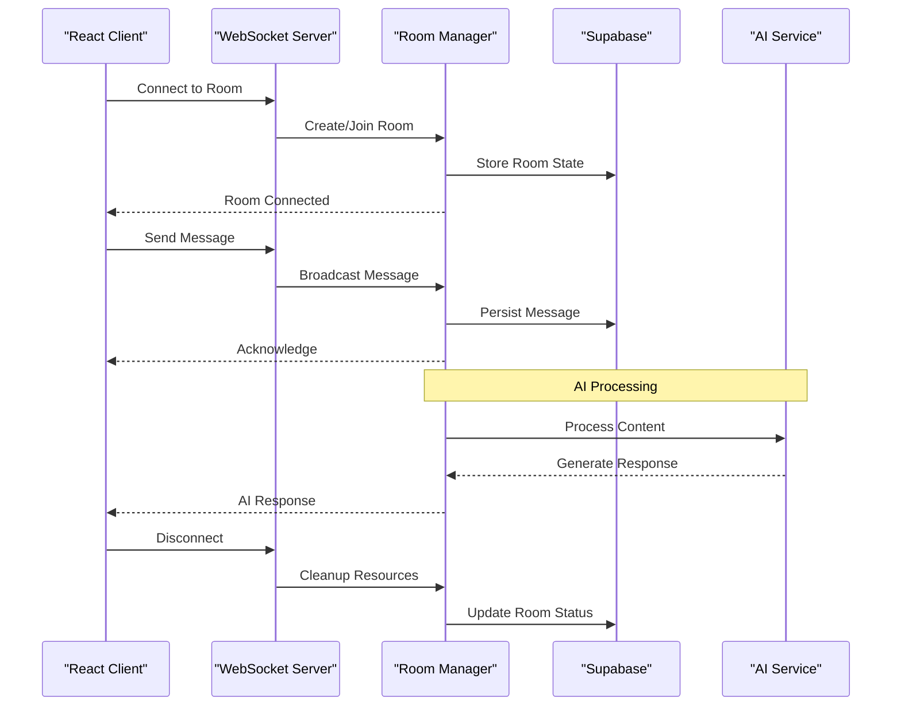
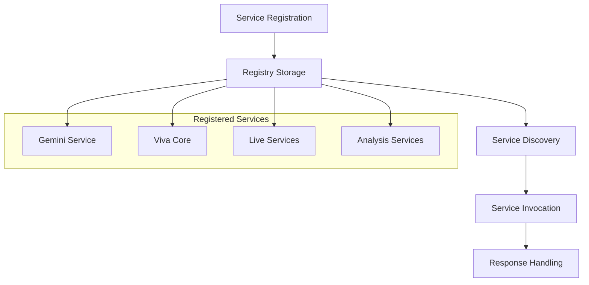
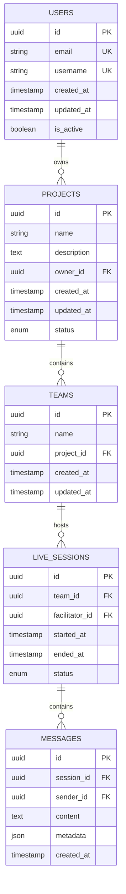
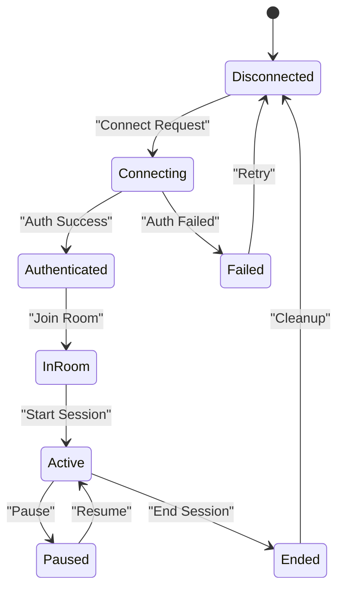
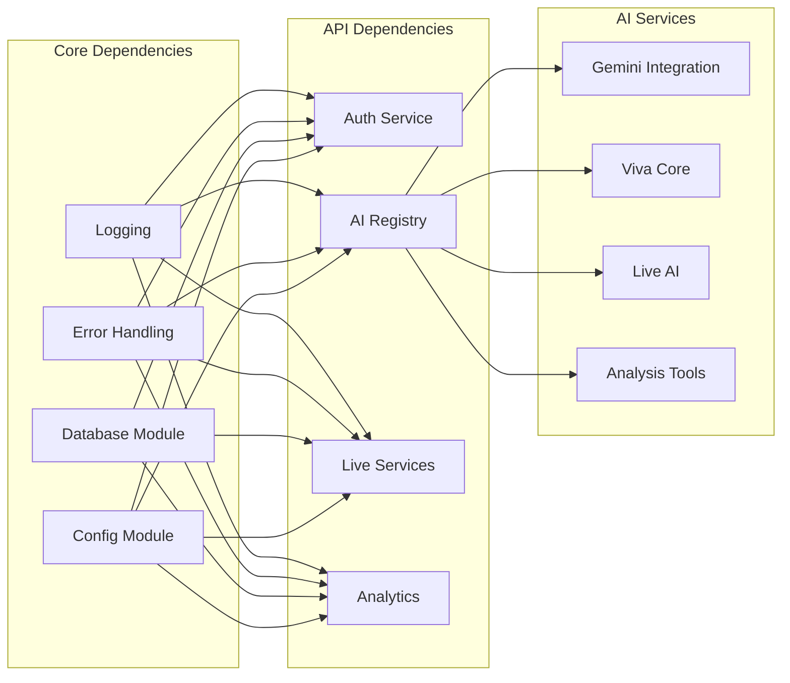

# System Design & Architecture Patterns

<cite>
**Referenced Files in This Document**
- [backend/main.py](file://backend/main.py)
- [backend/ai/registry.py](file://backend/ai/registry.py)
- [backend/core/config.py](file://backend/core/config.py)
- [backend/core/deps.py](file://backend/core/deps.py)
- [src/router.tsx](file://src/router.tsx)
- [backend/api/auth.py](file://backend/api/auth.py)
- [backend/api/live.py](file://backend/api/live.py)
- [backend/ai/gemini_service.py](file://backend/ai/gemini_service.py)
- [backend/ai/viva_core.py](file://backend/ai/viva_core.py)
- [backend/supabase_schema.sql](file://backend/supabase_schema.sql)
- [package.json](file://package.json)
- [vite.config.ts](file://vite.config.ts)
</cite>

## Table of Contents
1. [Introduction](#introduction)
2. [Project Structure](#project-structure)
3. [Core Components](#core-components)
4. [Architecture Overview](#architecture-overview)
5. [Detailed Component Analysis](#detailed-component-analysis)
6. [Dependency Analysis](#dependency-analysis)
7. [Performance Considerations](#performance-considerations)
8. [Troubleshooting Guide](#troubleshooting-guide)
9. [Conclusion](#conclusion)

## Introduction

The Horux platform is a comprehensive AI-powered educational technology platform that combines modern web technologies with advanced artificial intelligence capabilities. The system employs a full-stack architecture featuring a React/TypeScript frontend, FastAPI Python backend, Supabase PostgreSQL database, and multiple AI service integrations. This document provides an in-depth analysis of the platform's architectural patterns, design decisions, and implementation strategies.

The platform leverages several key architectural patterns including registry pattern for AI services, dependency injection, context-based state management, and event-driven communication through WebSockets for real-time collaboration features.

## Project Structure

The Horux platform follows a modular architecture with clear separation between frontend and backend concerns:

**Diagram sources**
- [package.json](file://package.json)
- [vite.config.ts](file://vite.config.ts)

The frontend is built with React 19, TypeScript, and Vite, utilizing modern component composition patterns and context-based state management. The backend uses FastAPI for high-performance API endpoints with async support.

**Section sources**
- [package.json](file://package.json)
- [vite.config.ts](file://vite.config.ts)

## Core Components

### Backend Architecture

The backend follows a layered architecture pattern with clear separation of concerns:

#### API Layer
The API layer exposes RESTful endpoints organized by functional domains:
- Authentication and user management
- Live session management
- AI service integration
- Project and team management
- Analytics and reporting

#### AI Service Registry Pattern
The platform implements a sophisticated registry pattern for managing multiple AI services:

**Diagram sources**
- [backend/ai/registry.py](file://backend/ai/registry.py)
- [backend/ai/gemini_service.py](file://backend/ai/gemini_service.py)
- [backend/ai/viva_core.py](file://backend/ai/viva_core.py)

#### Dependency Injection
The platform uses FastAPI's built-in dependency injection system for managing service dependencies and configuration:

**Diagram sources**
- [backend/core/deps.py](file://backend/core/deps.py)

**Section sources**
- [backend/ai/registry.py](file://backend/ai/registry.py)
- [backend/core/deps.py](file://backend/core/deps.py)

### Frontend Architecture

The frontend implements a component-based architecture with React hooks for state management:

#### Component Composition Pattern
Components are organized using a composition pattern that promotes reusability and maintainability:

**Diagram sources**
- [src/components/app-shell.tsx](file://src/components/app-shell.tsx)
- [src/components/live/live-session-runner.tsx](file://src/components/live/live-session-runner.tsx)
- [src/components/live/team-viva-room.tsx](file://src/components/live/team-viva-room.tsx)

#### Context-Based State Management
The platform uses React Context for global state management, particularly for authentication and application-wide settings.

**Section sources**
- [src/router.tsx](file://src/router.tsx)

## Architecture Overview

The Horux platform follows a microservices-inspired architecture where AI components are treated as independent services that communicate through well-defined interfaces.

**Diagram sources**
- [backend/main.py](file://backend/main.py)
- [backend/core/config.py](file://backend/core/config.py)

### Real-Time Collaboration Architecture

The platform implements real-time collaboration using WebSockets for live sessions and team interactions:

**Diagram sources**
- [backend/api/live.py](file://backend/api/live.py)

**Section sources**
- [backend/api/live.py](file://backend/api/live.py)

## Detailed Component Analysis

### AI Service Registry Implementation

The registry pattern implementation provides a centralized way to manage and access different AI services:

**Diagram sources**
- [backend/ai/registry.py](file://backend/ai/registry.py)

### Database Schema and Data Flow

The platform uses Supabase PostgreSQL with a schema designed for scalability and performance:

**Diagram sources**
- [backend/supabase_schema.sql](file://backend/supabase_schema.sql)

### WebSocket Communication Pattern

The real-time collaboration system implements a robust WebSocket communication pattern:

**Diagram sources**
- [backend/api/live.py](file://backend/api/live.py)

**Section sources**
- [backend/ai/registry.py](file://backend/ai/registry.py)
- [backend/supabase_schema.sql](file://backend/supabase_schema.sql)
- [backend/api/live.py](file://backend/api/live.py)

## Dependency Analysis

The platform maintains loose coupling between components through well-defined interfaces and dependency injection:

**Diagram sources**
- [backend/core/config.py](file://backend/core/config.py)
- [backend/core/deps.py](file://backend/core/deps.py)

### External Service Integrations

The platform integrates with multiple external AI providers and services:

| Service | Purpose | Integration Method |
|---------|---------|-------------------|
| Gemini API | AI content generation | HTTP REST API |
| Speech Recognition | Voice processing | WebSocket streaming |
| Code Analysis Engine | Code understanding | REST API |
| File Storage | Document management | Cloud storage API |

**Section sources**
- [backend/core/config.py](file://backend/core/config.py)
- [backend/core/deps.py](file://backend/core/deps.py)

## Performance Considerations

### Scalability Architecture

The platform is designed for horizontal scalability with the following considerations:

- **Stateless API Layer**: All API endpoints are designed to be stateless, enabling easy horizontal scaling
- **Connection Pooling**: Database connections are pooled to handle concurrent requests efficiently
- **Caching Strategy**: Redis caching layer for frequently accessed data and AI responses
- **Load Balancing**: Multiple backend instances behind a load balancer for high availability

### Memory Management

- **Streaming Responses**: Large AI responses are streamed to prevent memory overflow
- **Connection Limits**: Configurable limits for WebSocket connections per instance
- **Garbage Collection**: Optimized object lifecycle management for long-running processes

### Database Optimization

- **Indexing Strategy**: Strategic indexing on frequently queried columns
- **Query Optimization**: Parameterized queries and connection pooling
- **Read Replicas**: Support for read replicas to distribute query load

## Troubleshooting Guide

### Common Issues and Solutions

#### AI Service Connection Failures
- Verify API keys and credentials in configuration
- Check network connectivity to external AI providers
- Implement retry logic with exponential backoff

#### WebSocket Connection Issues
- Monitor connection pool utilization
- Implement heartbeat mechanisms for connection health
- Handle graceful disconnection and reconnection

#### Database Performance Issues
- Analyze slow queries and optimize indexes
- Monitor connection pool usage
- Implement query result caching

### Monitoring and Logging

The platform includes comprehensive logging and monitoring capabilities:
- Structured logging with correlation IDs
- Performance metrics collection
- Error tracking and alerting
- Resource utilization monitoring

**Section sources**
- [backend/core/errors.py](file://backend/core/errors.py)
- [backend/core/logging.py](file://backend/core/logging.py)

## Conclusion

The Horux platform demonstrates a well-architected approach to building AI-powered educational technology applications. The combination of registry pattern for AI services, dependency injection, context-based state management, and event-driven communication creates a scalable and maintainable system.

Key architectural strengths include:
- **Modular Design**: Clear separation of concerns with well-defined interfaces
- **Scalability**: Horizontal scaling capabilities with stateless architecture
- **Flexibility**: Easy integration of new AI services through the registry pattern
- **Reliability**: Comprehensive error handling and monitoring
- **Performance**: Optimized for high-concurrency scenarios with proper resource management

The platform's microservices-inspired architecture enables independent scaling of AI components while maintaining consistent user experience across all features.