# API Architecture & Design

<cite>
**Referenced Files in This Document**
- [main.py](file://backend/main.py)
- [config.py](file://backend/core/config.py)
- [database.py](file://backend/core/database.py)
- [deps.py](file://backend/core/deps.py)
- [errors.py](file://backend/core/errors.py)
- [logging.py](file://backend/core/logging.py)
- [auth.py](file://backend/api/auth.py)
- [projects.py](file://backend/api/projects.py)
- [teams.py](file://backend/api/teams.py)
- [tasks.py](file://backend/api/tasks.py)
- [conftest.py](file://backend/tests/conftest.py)
</cite>

## Table of Contents
1. [Introduction](#introduction)
2. [Project Structure](#project-structure)
3. [Core Components](#core-components)
4. [Architecture Overview](#architecture-overview)
5. [Detailed Component Analysis](#detailed-component-analysis)
6. [Dependency Analysis](#dependency-analysis)
7. [Performance Considerations](#performance-considerations)
8. [Troubleshooting Guide](#troubleshooting-guide)
9. [Conclusion](#conclusion)

## Introduction
This document describes the architecture and design of the Horux FastAPI backend API. It covers high-level API design patterns, endpoint organization, request/response flow, dependency injection using FastAPI’s DI container, middleware stack configuration, error handling strategies, logging infrastructure, application startup sequence, configuration management, environment-specific settings, database connection pooling, SQLAlchemy session management, transaction handling patterns, and standardized response and error code conventions. The goal is to provide a comprehensive reference for both new contributors and experienced developers working on the backend.

## Project Structure
The backend follows a layered structure:
- Entry point and application factory
- Core subsystems (configuration, database, dependencies, errors, logging)
- API routers organized by domain
- Services layer for business logic
- Tests with fixtures and test isolation

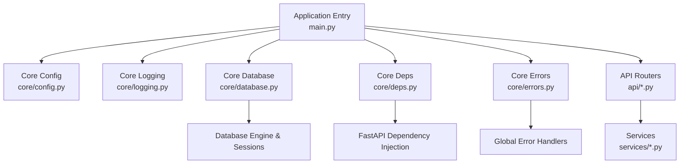

**Diagram sources**
- [main.py](file://backend/main.py)
- [config.py](file://backend/core/config.py)
- [logging.py](file://backend/core/logging.py)
- [database.py](file://backend/core/database.py)
- [deps.py](file://backend/core/deps.py)
- [errors.py](file://backend/core/errors.py)
- [auth.py](file://backend/api/auth.py)
- [projects.py](file://backend/api/projects.py)
- [teams.py](file://backend/api/teams.py)
- [tasks.py](file://backend/api/tasks.py)

**Section sources**
- [main.py](file://backend/main.py)
- [config.py](file://backend/core/config.py)
- [database.py](file://backend/core/database.py)
- [deps.py](file://backend/core/deps.py)
- [errors.py](file://backend/core/errors.py)
- [logging.py](file://backend/core/logging.py)
- [auth.py](file://backend/api/auth.py)
- [projects.py](file://backend/api/projects.py)
- [teams.py](file://backend/api/teams.py)
- [tasks.py](file://backend/api/tasks.py)

## Core Components
- Application entrypoint and startup lifecycle
  - Creates the FastAPI app instance, registers middleware, mounts routers, configures CORS, and sets up lifespan events for initialization and shutdown.
- Configuration management
  - Centralized settings loaded from environment variables or configuration files, validated at startup, and exposed via typed accessors.
- Logging infrastructure
  - Structured logging configured early in startup; log levels and handlers are configurable per environment.
- Database subsystem
  - Connection pool setup, engine creation, base metadata, and session factories. Provides scoped sessions for requests and background tasks.
- Dependency injection
  - Reusable dependencies for DB sessions, current user context, and service instances. Ensures single-responsibility and testability.
- Error handling
  - Global exception handlers map domain exceptions to HTTP responses with consistent status codes and payloads.
- API routers
  - Domain-scoped routers (auth, projects, teams, tasks, etc.) that depend on services and shared dependencies.

**Section sources**
- [main.py](file://backend/main.py)
- [config.py](file://backend/core/config.py)
- [logging.py](file://backend/core/logging.py)
- [database.py](file://backend/core/database.py)
- [deps.py](file://backend/core/deps.py)
- [errors.py](file://backend/core/errors.py)

## Architecture Overview
High-level request flow through the API:
- Client sends an HTTP request to a mounted router.
- Middleware processes headers, auth, rate limiting, and logging.
- Router resolves path parameters and query/body data.
- Endpoint function calls service methods via injected dependencies.
- Service orchestrates business logic and uses DB sessions for persistence.
- Responses are formatted consistently and returned.

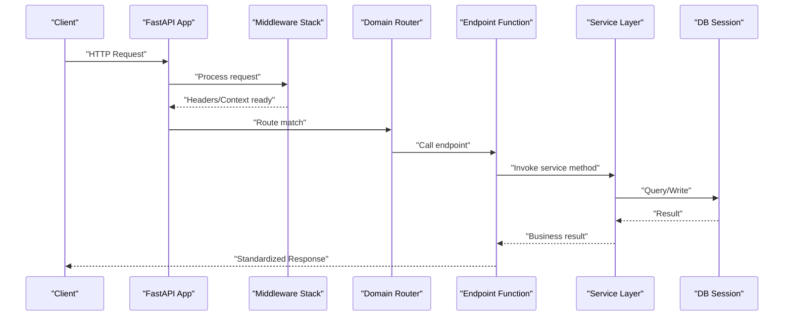

**Diagram sources**
- [main.py](file://backend/main.py)
- [auth.py](file://backend/api/auth.py)
- [projects.py](file://backend/api/projects.py)
- [teams.py](file://backend/api/teams.py)
- [tasks.py](file://backend/api/tasks.py)
- [database.py](file://backend/core/database.py)
- [deps.py](file://backend/core/deps.py)

## Detailed Component Analysis

### Application Startup and Lifecycle
- Application factory creates the FastAPI app and applies global configuration.
- Lifespan events initialize resources (e.g., caches, indexes) and ensure graceful shutdown.
- Routers are mounted under versioned prefixes for API evolution.
- CORS and security policies are applied during startup.

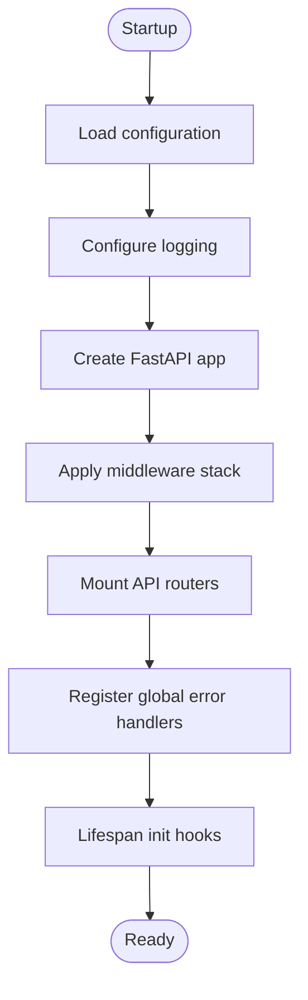

**Diagram sources**
- [main.py](file://backend/main.py)
- [config.py](file://backend/core/config.py)
- [logging.py](file://backend/core/logging.py)

**Section sources**
- [main.py](file://backend/main.py)
- [config.py](file://backend/core/config.py)
- [logging.py](file://backend/core/logging.py)

### Configuration Management
- Environment-driven settings with validation and defaults.
- Separate profiles for development, staging, and production.
- Secrets and sensitive values sourced from environment variables.
- Typed configuration objects consumed by services and database layer.

**Section sources**
- [config.py](file://backend/core/config.py)

### Logging Infrastructure
- Structured logs with contextual fields (request ID, user, correlation).
- Log rotation and output destinations configurable per environment.
- Integration with FastAPI request pipeline for end-to-end tracing.

**Section sources**
- [logging.py](file://backend/core/logging.py)

### Database Connection Pooling and Session Management
- Engine created with connection pool parameters tuned for workload.
- Base metadata defined for declarative models.
- Scoped session factory ensures one session per request.
- Transaction boundaries managed at service or repository level.

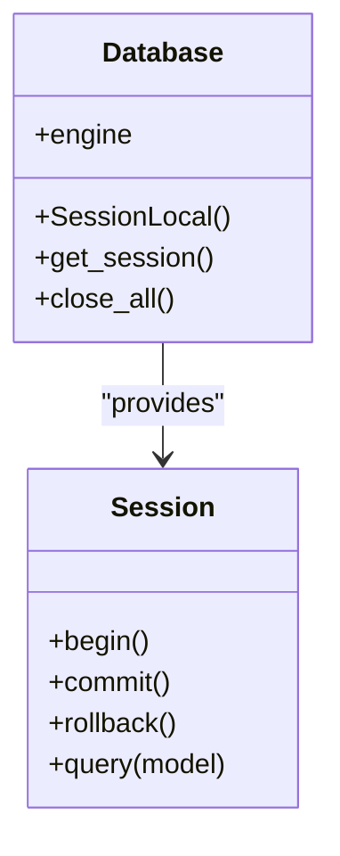

**Diagram sources**
- [database.py](file://backend/core/database.py)

**Section sources**
- [database.py](file://backend/core/database.py)

### Dependency Injection System
- FastAPI’s DI container provides reusable dependencies:
  - Database session provider
  - Current authenticated user context
  - Service instances
- Dependencies are declared in endpoints and services to promote loose coupling.
- Test overrides inject mock implementations for isolation.

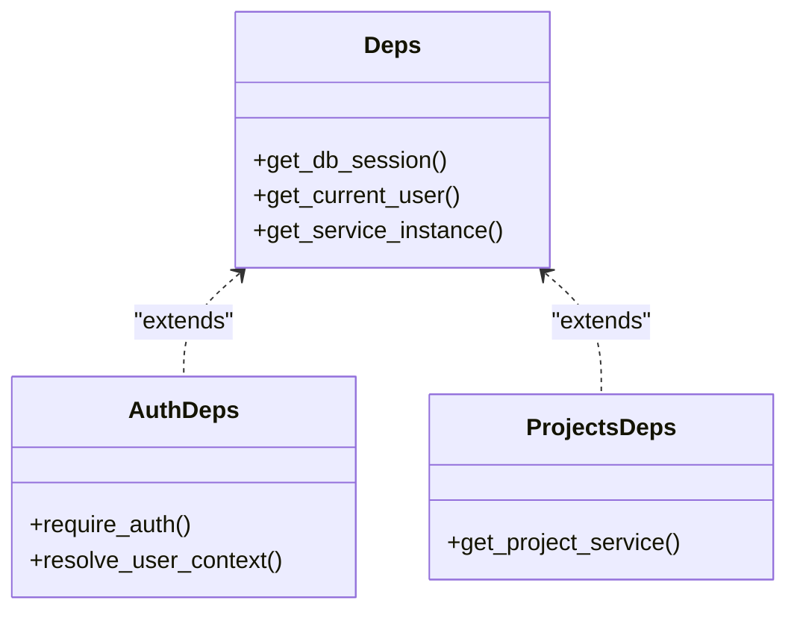

**Diagram sources**
- [deps.py](file://backend/core/deps.py)
- [auth.py](file://backend/api/auth.py)
- [projects.py](file://backend/api/projects.py)

**Section sources**
- [deps.py](file://backend/core/deps.py)
- [auth.py](file://backend/api/auth.py)
- [projects.py](file://backend/api/projects.py)

### Middleware Stack Configuration
- Ordered middleware for cross-cutting concerns:
  - Security headers
  - CORS policy
  - Request ID propagation
  - Rate limiting (optional)
  - Access logging
- Custom middleware can be added for domain-specific needs.

**Diagram sources**
- [main.py](file://backend/main.py)

**Section sources**
- [main.py](file://backend/main.py)

### Error Handling Strategies
- Global exception handlers convert domain exceptions into standardized HTTP responses.
- Consistent payload shape includes error code, message, and optional details.
- Validation errors mapped to appropriate HTTP status codes.

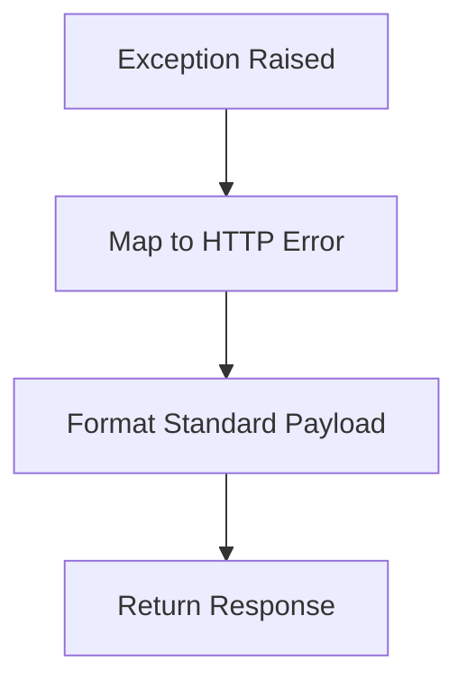

**Diagram sources**
- [errors.py](file://backend/core/errors.py)

**Section sources**
- [errors.py](file://backend/core/errors.py)

### API Endpoints Organization and Patterns
- Domain-based routers:
  - Authentication endpoints
  - Projects endpoints
  - Teams endpoints
  - Tasks endpoints
- Endpoints follow consistent patterns:
  - Input validation via Pydantic schemas
  - Dependency injection for services and DB sessions
  - Uniform response formatting
  - Clear separation of concerns between route and service layers

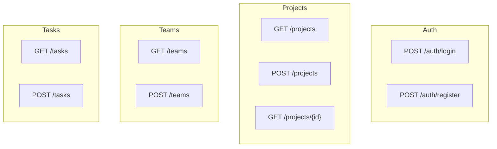

**Diagram sources**
- [auth.py](file://backend/api/auth.py)
- [projects.py](file://backend/api/projects.py)
- [teams.py](file://backend/api/teams.py)
- [tasks.py](file://backend/api/tasks.py)

**Section sources**
- [auth.py](file://backend/api/auth.py)
- [projects.py](file://backend/api/projects.py)
- [teams.py](file://backend/api/teams.py)
- [tasks.py](file://backend/api/tasks.py)

### Request/Response Flow Architecture
- Endpoints receive validated input, delegate to services, and return structured responses.
- Services encapsulate business rules and coordinate multiple repositories or external calls.
- Responses include standard fields: status, data, and error information when applicable.

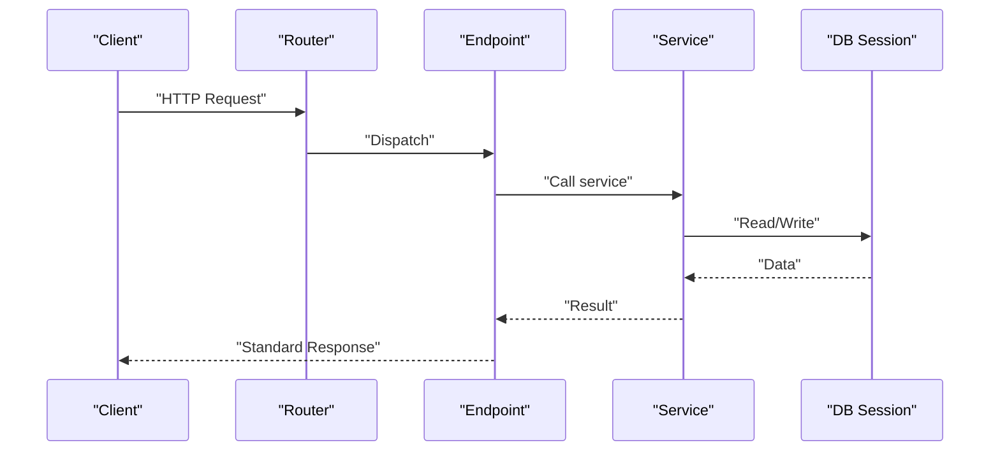

**Diagram sources**
- [projects.py](file://backend/api/projects.py)
- [teams.py](file://backend/api/teams.py)
- [tasks.py](file://backend/api/tasks.py)
- [database.py](file://backend/core/database.py)

**Section sources**
- [projects.py](file://backend/api/projects.py)
- [teams.py](file://backend/api/teams.py)
- [tasks.py](file://backend/api/tasks.py)
- [database.py](file://backend/core/database.py)

### Transaction Handling Patterns
- Begin transaction at service entry when multiple writes occur.
- Commit on success; rollback on failure.
- Use explicit transaction boundaries to maintain consistency across operations.

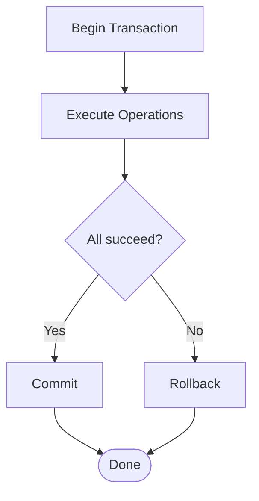

[No sources needed since this diagram shows conceptual workflow, not actual code structure]

### Test Isolation and DI Overrides
- Test fixtures override dependencies to inject in-memory databases and mocks.
- Each test runs with isolated state and deterministic behavior.
- Conftest centralizes shared fixtures and client setup.

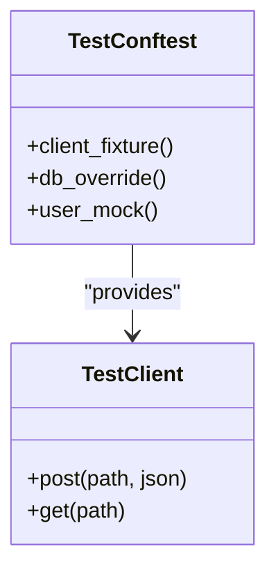

**Diagram sources**
- [conftest.py](file://backend/tests/conftest.py)

**Section sources**
- [conftest.py](file://backend/tests/conftest.py)

## Dependency Analysis
Component relationships and coupling:
- main.py depends on core modules for configuration, logging, database, deps, and errors.
- API routers depend on services and shared dependencies.
- Services depend on database sessions and external integrations.
- Tests depend on conftest fixtures and override dependencies.

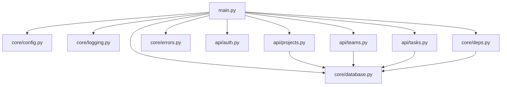

**Diagram sources**
- [main.py](file://backend/main.py)
- [config.py](file://backend/core/config.py)
- [logging.py](file://backend/core/logging.py)
- [database.py](file://backend/core/database.py)
- [deps.py](file://backend/core/deps.py)
- [errors.py](file://backend/core/errors.py)
- [auth.py](file://backend/api/auth.py)
- [projects.py](file://backend/api/projects.py)
- [teams.py](file://backend/api/teams.py)
- [tasks.py](file://backend/api/tasks.py)

**Section sources**
- [main.py](file://backend/main.py)
- [config.py](file://backend/core/config.py)
- [logging.py](file://backend/core/logging.py)
- [database.py](file://backend/core/database.py)
- [deps.py](file://backend/core/deps.py)
- [errors.py](file://backend/core/errors.py)
- [auth.py](file://backend/api/auth.py)
- [projects.py](file://backend/api/projects.py)
- [teams.py](file://backend/api/teams.py)
- [tasks.py](file://backend/api/tasks.py)

## Performance Considerations
- Tune connection pool size based on expected concurrency and database capacity.
- Use connection pooling and reuse sessions per request to minimize overhead.
- Avoid N+1 queries by leveraging eager loading where appropriate.
- Cache frequently accessed read-only data at the service layer.
- Profile slow endpoints and add targeted indexing to database tables.
- Keep middleware minimal and efficient; avoid heavy computations in request path.

[No sources needed since this section provides general guidance]

## Troubleshooting Guide
- Verify configuration values and environment variables at startup.
- Inspect structured logs for request IDs and error traces.
- Check global error handlers for unexpected exceptions and ensure proper mapping to HTTP statuses.
- Validate database connectivity and pool exhaustion symptoms.
- Use test fixtures to reproduce issues deterministically.

**Section sources**
- [config.py](file://backend/core/config.py)
- [logging.py](file://backend/core/logging.py)
- [errors.py](file://backend/core/errors.py)
- [database.py](file://backend/core/database.py)
- [conftest.py](file://backend/tests/conftest.py)

## Conclusion
The Horux FastAPI backend employs a clean, layered architecture with clear separation of concerns. FastAPI’s dependency injection enables modular and testable code. Centralized configuration, logging, and error handling improve reliability and observability. Database pooling and session management support scalable data access. Following the documented patterns ensures consistent API design, robust error handling, and maintainable code.