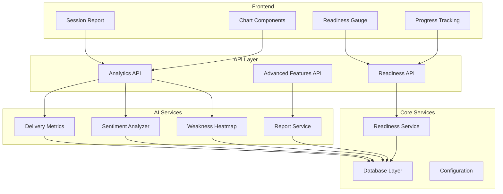
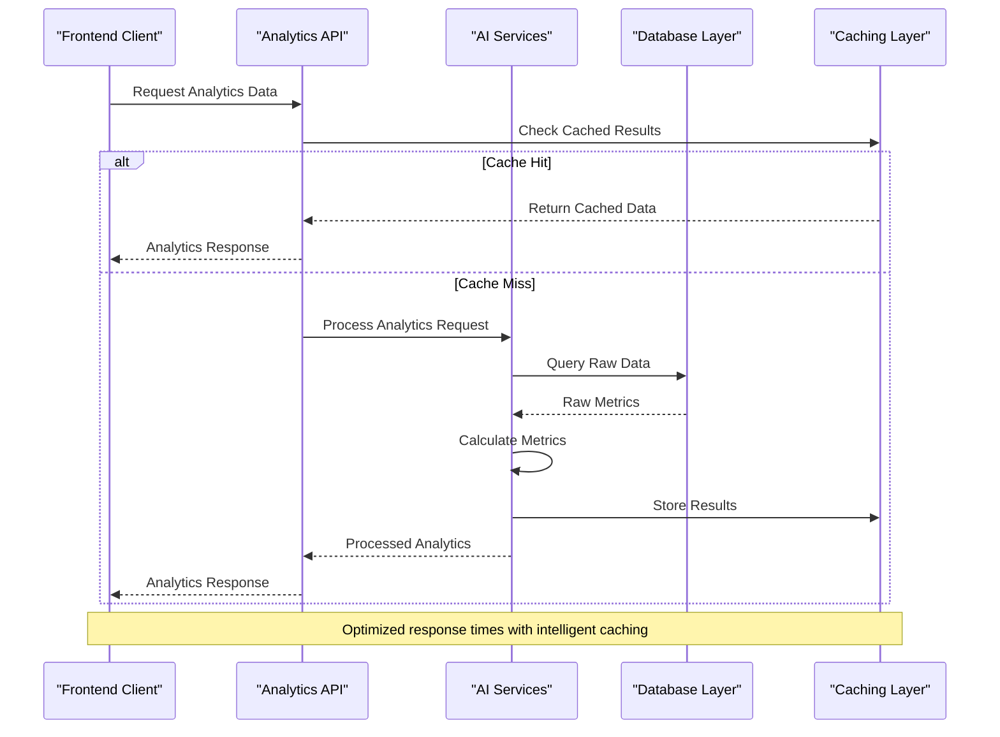
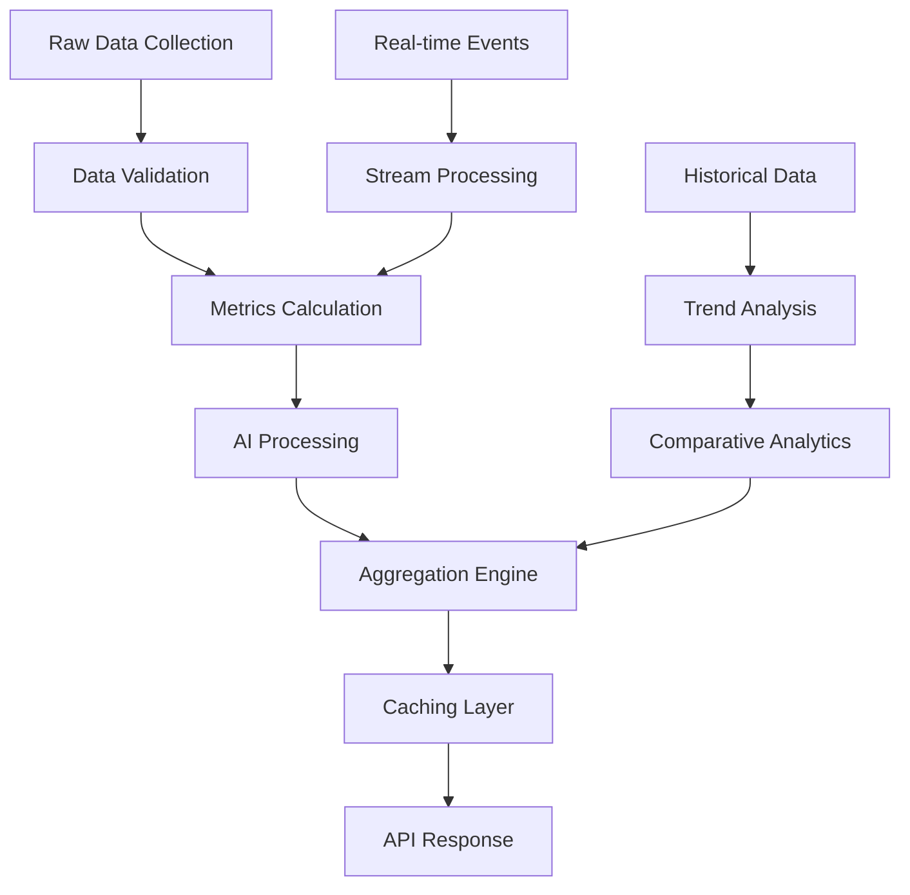
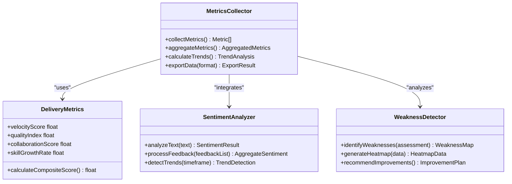
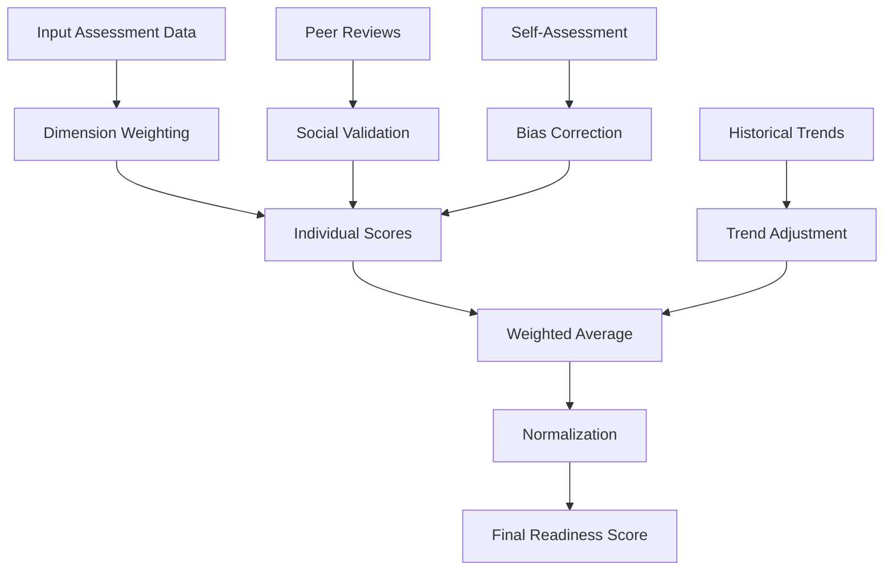
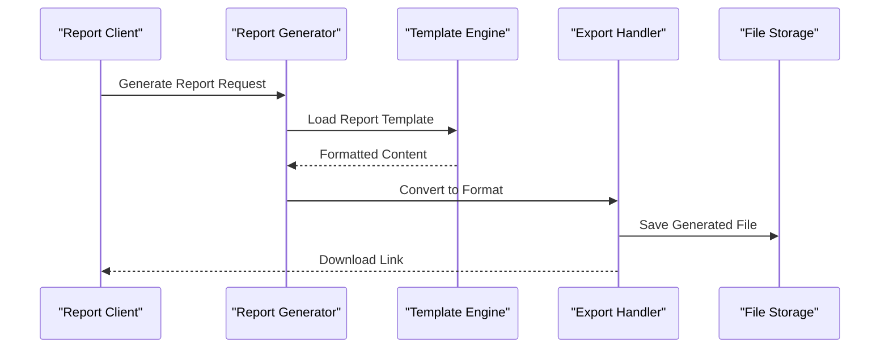
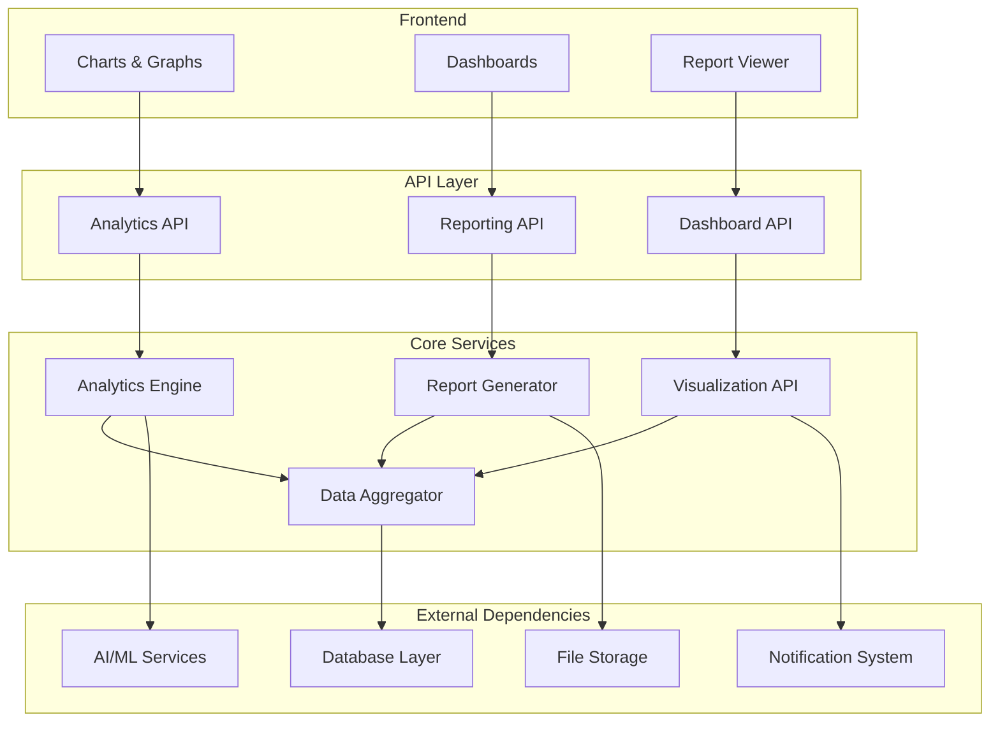

# Analytics & Reporting APIs

<cite>
**Referenced Files in This Document**
- [analytics.py](file://backend/api/analytics.py)
- [delivery_metrics.py](file://backend/ai/delivery_metrics.py)
- [report_service.py](file://backend/ai/report_service.py)
- [sentiment_analyzer.py](file://backend/ai/sentiment_analyzer.py)
- [weakness_heatmap.py](file://backend/ai/weakness_heatmap.py)
- [readiness.py](file://backend/api/readiness.py)
- [readiness_service.py](file://backend/services/readiness_service.py)
- [advanced.py](file://backend/api/advanced.py)
- [schemas.py](file://backend/models/schemas.py)
- [config.py](file://backend/core/config.py)
- [database.py](file://backend/core/database.py)
- [session-report.tsx](file://src/components/reports/session-report.tsx)
- [readiness-gauge.tsx](file://src/components/readiness-gauge.tsx)
- [chart.tsx](file://src/components/ui/chart.tsx)
- [progress.tsx](file://src/routes/progress.tsx)
- [readiness.tsx](file://src/routes/readiness.tsx)
</cite>

## Table of Contents
1. [Introduction](#introduction)
2. [Project Structure](#project-structure)
3. [Core Components](#core-components)
4. [Architecture Overview](#architecture-overview)
5. [Detailed Component Analysis](#detailed-component-analysis)
6. [Dependency Analysis](#dependency-analysis)
7. [Performance Considerations](#performance-considerations)
8. [Troubleshooting Guide](#troubleshooting-guide)
9. [Conclusion](#conclusion)
10. [Appendices](#appendices)

## Introduction

The Analytics & Reporting API system provides comprehensive data analysis, performance metrics collection, and visualization capabilities for team delivery assessment and progress tracking. The platform integrates AI-powered sentiment analysis, weakness identification algorithms, and real-time readiness assessment to deliver actionable insights through interactive dashboards and customizable reports.

This documentation covers the complete analytics ecosystem including performance metrics collection, readiness calculations, delivery analytics aggregation, report generation, data visualization APIs, export functionality, sentiment analysis integration, weakness identification algorithms, progress tracking mechanisms, dashboard endpoints, historical trend analysis, comparative analytics features, data aggregation strategies, caching mechanisms, and performance optimization techniques.

## Project Structure

The analytics and reporting system follows a modular architecture with clear separation between API endpoints, business logic services, AI processing components, and frontend visualization layers.

**Diagram sources**
- [analytics.py:1-50](file://backend/api/analytics.py#L1-L50)
- [delivery_metrics.py:1-50](file://backend/ai/delivery_metrics.py#L1-L50)
- [report_service.py:1-50](file://backend/ai/report_service.py#L1-L50)
- [readiness_service.py:1-50](file://backend/services/readiness_service.py#L1-L50)

**Section sources**
- [analytics.py:1-100](file://backend/api/analytics.py#L1-L100)
- [delivery_metrics.py:1-100](file://backend/ai/delivery_metrics.py#L1-L100)
- [report_service.py:1-100](file://backend/ai/report_service.py#L1-L100)

## Core Components

### Analytics API Endpoints

The analytics API provides comprehensive endpoints for collecting and retrieving performance metrics, delivery analytics, and team assessment data. Key endpoints include:

- **Performance Metrics Collection**: Real-time and historical performance data aggregation
- **Delivery Analytics**: Team delivery velocity, quality metrics, and completion rates
- **Readiness Assessment**: Comprehensive readiness scoring and evaluation
- **Sentiment Analysis**: Natural language processing for feedback and communication analysis
- **Weakness Identification**: Algorithmic detection of skill gaps and improvement areas

### AI Processing Services

The AI layer implements sophisticated algorithms for:

- **Delivery Metrics Calculation**: Advanced statistical analysis of team performance
- **Sentiment Scoring**: Multi-dimensional sentiment analysis across various communication channels
- **Weakness Heatmap Generation**: Visual representation of skill gaps and improvement priorities
- **Report Generation**: Automated creation of comprehensive analytical reports

### Data Visualization Components

The frontend provides interactive visualization components including:

- **Session Reports**: Detailed session-based analytics and insights
- **Readiness Gauges**: Real-time readiness indicators and progress tracking
- **Chart Components**: Flexible charting library for custom visualizations
- **Progress Dashboards**: Comprehensive progress tracking and milestone monitoring

**Section sources**
- [analytics.py:1-200](file://backend/api/analytics.py#L1-L200)
- [delivery_metrics.py:1-200](file://backend/ai/delivery_metrics.py#L1-L200)
- [report_service.py:1-200](file://backend/ai/report_service.py#L1-L200)
- [readiness_service.py:1-200](file://backend/services/readiness_service.py#L1-L200)

## Architecture Overview

The analytics and reporting system follows a layered architecture pattern with clear separation of concerns and robust error handling mechanisms.

**Diagram sources**
- [analytics.py:50-150](file://backend/api/analytics.py#L50-L150)
- [delivery_metrics.py:50-150](file://backend/ai/delivery_metrics.py#L50-L150)
- [database.py:1-100](file://backend/core/database.py#L1-L100)

### Data Flow Architecture

The system implements a sophisticated data flow pipeline that processes raw metrics into actionable insights:

**Diagram sources**
- [delivery_metrics.py:100-200](file://backend/ai/delivery_metrics.py#L100-L200)
- [report_service.py:100-200](file://backend/ai/report_service.py#L100-L200)

## Detailed Component Analysis

### Performance Metrics Collection System

The performance metrics collection system implements a multi-layered approach to gathering, processing, and storing team performance data.

#### Metrics Categories

The system tracks several categories of performance metrics:

- **Delivery Velocity**: Sprint completion rates, story point velocity, and throughput metrics
- **Quality Indicators**: Bug rates, code review scores, and testing coverage percentages
- **Team Collaboration**: Communication frequency, meeting effectiveness, and collaboration patterns
- **Skill Development**: Learning progress, certification achievements, and competency growth

#### Data Aggregation Strategies

**Diagram sources**
- [delivery_metrics.py:150-250](file://backend/ai/delivery_metrics.py#L150-L250)
- [sentiment_analyzer.py:150-250](file://backend/ai/sentiment_analyzer.py#L150-L250)
- [weakness_heatmap.py:150-250](file://backend/ai/weakness_heatmap.py#L150-L250)

**Section sources**
- [delivery_metrics.py:1-300](file://backend/ai/delivery_metrics.py#L1-L300)
- [sentiment_analyzer.py:1-300](file://backend/ai/sentiment_analyzer.py#L1-L300)
- [weakness_heatmap.py:1-300](file://backend/ai/weakness_heatmap.py#L1-L300)

### Readiness Assessment Calculations

The readiness assessment system provides comprehensive evaluation of team and individual readiness across multiple dimensions.

#### Assessment Dimensions

The readiness calculation considers several key dimensions:

- **Technical Competency**: Code quality, architectural understanding, and technical skills
- **Process Adherence**: Following development workflows, testing practices, and deployment procedures
- **Collaboration Effectiveness**: Team communication, knowledge sharing, and conflict resolution
- **Continuous Improvement**: Learning agility, feedback incorporation, and skill development

#### Readiness Score Calculation

**Diagram sources**
- [readiness_service.py:100-200](file://backend/services/readiness_service.py#L100-L200)
- [readiness.py:100-200](file://backend/api/readiness.py#L100-L200)

**Section sources**
- [readiness_service.py:1-300](file://backend/services/readiness_service.py#L1-L300)
- [readiness.py:1-300](file://backend/api/readiness.py#L1-L300)

### Report Generation and Export Functionality

The report generation system creates comprehensive analytical reports in multiple formats with customizable templates and automated scheduling capabilities.

#### Report Types

The system supports various report types:

- **Executive Summary Reports**: High-level overview with key metrics and trends
- **Detailed Analytics Reports**: Comprehensive analysis with granular breakdowns
- **Comparative Reports**: Cross-team and cross-period comparisons
- **Trend Analysis Reports**: Historical progression and forecasting
- **Custom Reports**: User-defined metrics and visualizations

#### Export Formats

**Diagram sources**
- [report_service.py:200-300](file://backend/ai/report_service.py#L200-L300)
- [advanced.py:200-300](file://backend/api/advanced.py#L200-300)

**Section sources**
- [report_service.py:1-300](file://backend/ai/report_service.py#L1-L300)
- [advanced.py:1-300](file://backend/api/advanced.py#L1-L300)

### Data Visualization APIs

The visualization API provides flexible endpoints for rendering charts, graphs, and interactive dashboards with real-time data updates.

#### Chart Types Supported

- **Time Series Charts**: Performance trends and historical analysis
- **Comparison Charts**: Team and individual performance comparisons
- **Distribution Charts**: Skill distribution and competency mapping
- **Heat Maps**: Weakness identification and priority visualization
- **Gauge Charts**: Readiness indicators and progress tracking

#### Real-time Updates

The system supports WebSocket connections for real-time dashboard updates and live metric monitoring.

**Section sources**
- [session-report.tsx:1-200](file://src/components/reports/session-report.tsx#L1-L200)
- [readiness-gauge.tsx:1-200](file://src/components/readiness-gauge.tsx#L1-L200)
- [chart.tsx:1-200](file://src/components/ui/chart.tsx#L1-L200)

### Sentiment Analysis Integration

The sentiment analysis component processes natural language input from various sources to extract emotional intelligence insights and communication effectiveness metrics.

#### Analysis Sources

- **Code Review Comments**: Technical feedback sentiment and tone analysis
- **Team Communications**: Slack, email, and meeting transcript analysis
- **Customer Feedback**: Client satisfaction and experience sentiment
- **Performance Reviews**: Manager and peer evaluation sentiment

#### Sentiment Scoring

The system uses multi-dimensional sentiment analysis considering:

- **Emotional Tone**: Positive, negative, neutral classification
- **Intensity Levels**: Strength of emotional expression
- **Contextual Understanding**: Domain-specific sentiment interpretation
- **Trend Detection**: Changes in sentiment over time

**Section sources**
- [sentiment_analyzer.py:1-300](file://backend/ai/sentiment_analyzer.py#L1-L300)

### Weakness Identification Algorithms

The weakness identification system employs advanced algorithms to detect skill gaps, process inefficiencies, and areas requiring improvement across teams and individuals.

#### Detection Methods

- **Pattern Recognition**: Identifying recurring issues and bottlenecks
- **Statistical Analysis**: Detecting outliers and performance anomalies
- **Comparative Benchmarking**: Against industry standards and best practices
- **Predictive Modeling**: Forecasting potential future weaknesses

#### Heatmap Generation

The weakness heatmap provides visual representation of identified areas with severity levels and recommended actions.

**Section sources**
- [weakness_heatmap.py:1-300](file://backend/ai/weakness_heatmap.py#L1-L300)

### Progress Tracking Mechanisms

The progress tracking system monitors individual and team advancement toward goals with milestone-based assessment and continuous feedback loops.

#### Tracking Dimensions

- **Goal Achievement**: Progress toward defined objectives and milestones
- **Skill Development**: Learning progress and competency growth
- **Process Improvement**: Adoption of best practices and workflow enhancements
- **Quality Metrics**: Continuous improvement in output quality

#### Milestone Management

The system supports configurable milestone definitions with automated progress calculation and notification systems.

**Section sources**
- [progress.tsx:1-200](file://src/routes/progress.tsx#L1-L200)

## Dependency Analysis

The analytics and reporting system maintains clear dependency relationships with well-defined interfaces and minimal coupling between components.

**Diagram sources**
- [config.py:1-100](file://backend/core/config.py#L1-L100)
- [database.py:1-100](file://backend/core/database.py#L1-L100)
- [schemas.py:1-100](file://backend/models/schemas.py#L1-L100)

### Module Coupling Analysis

The system demonstrates low coupling between major components with high cohesion within modules. Each service maintains clear responsibilities and communicates through well-defined interfaces.

**Section sources**
- [config.py:1-100](file://backend/core/config.py#L1-L100)
- [database.py:1-100](file://backend/core/database.py#L1-L100)
- [schemas.py:1-100](file://backend/models/schemas.py#L1-L100)

## Performance Considerations

### Data Aggregation Optimization

The system implements several optimization strategies for handling large datasets:

- **Incremental Aggregation**: Real-time metric updates without full recalculation
- **Batch Processing**: Efficient bulk operations for historical data analysis
- **Lazy Loading**: On-demand data retrieval for complex queries
- **Query Optimization**: Database indexing and query planning for fast responses

### Caching Mechanisms

Multi-tier caching strategy ensures optimal performance:

- **Application Cache**: In-memory caching for frequently accessed metrics
- **Distributed Cache**: Shared cache across application instances
- **CDN Integration**: Static asset caching for visualization components
- **Query Result Caching**: Cached database query results with invalidation policies

### Memory Management

Efficient memory usage through:

- **Streaming Processing**: Large dataset processing without loading entire datasets
- **Object Pooling**: Reuse of expensive objects and connections
- **Garbage Collection Tuning**: Optimized GC settings for analytics workloads
- **Memory Leak Prevention**: Proper resource cleanup and connection management

### Scalability Patterns

Horizontal scaling support through:

- **Stateless API Design**: Easy horizontal scaling of API endpoints
- **Asynchronous Processing**: Background job processing for heavy computations
- **Load Balancing**: Even distribution of requests across instances
- **Database Sharding**: Partitioning large datasets across multiple databases

## Troubleshooting Guide

### Common Performance Issues

**Slow Query Performance**
- Check database indexes on frequently queried fields
- Monitor query execution plans and optimize slow queries
- Implement query result caching for repeated access patterns
- Consider read replicas for heavy analytical queries

**Memory Usage Problems**
- Monitor application memory consumption patterns
- Identify and fix memory leaks in long-running processes
- Optimize data structures for large dataset processing
- Implement proper resource cleanup in background jobs

**API Response Times**
- Analyze endpoint performance metrics and identify bottlenecks
- Implement request rate limiting and circuit breakers
- Use asynchronous processing for non-critical operations
- Optimize serialization and deserialization of large payloads

### Error Handling Patterns

The system implements comprehensive error handling with:

- **Graceful Degradation**: Partial failures don't crash entire systems
- **Retry Logic**: Automatic retry with exponential backoff for transient errors
- **Circuit Breakers**: Prevent cascading failures in distributed systems
- **Comprehensive Logging**: Detailed error context for debugging

### Monitoring and Alerting

Key monitoring points include:

- **API Response Time Percentiles**: P50, P95, P99 latency monitoring
- **Error Rate Tracking**: Real-time error rate monitoring and alerting
- **Resource Utilization**: CPU, memory, and disk usage monitoring
- **Business Metrics**: Custom KPIs and business impact monitoring

**Section sources**
- [errors.py:1-100](file://backend/core/errors.py#L1-L100)
- [logging.py:1-100](file://backend/core/logging.py#L1-L100)

## Conclusion

The Analytics & Reporting API system provides a comprehensive foundation for data-driven decision making through sophisticated metrics collection, AI-powered analysis, and intuitive visualization. The modular architecture ensures scalability and maintainability while delivering real-time insights for team performance optimization and continuous improvement.

Key strengths include robust performance metrics collection, intelligent readiness assessment, comprehensive sentiment analysis, and flexible reporting capabilities. The system's design prioritizes both immediate usability and long-term extensibility, supporting evolving business requirements and technological advancements.

Future enhancements should focus on advanced predictive analytics, enhanced machine learning models, expanded visualization options, and improved real-time processing capabilities to further strengthen the platform's analytical power and user experience.

## Appendices

### API Endpoint Reference

| Endpoint | Method | Description | Authentication | Rate Limit |
|----------|---------|-------------|----------------|------------|
| `/api/analytics/metrics` | GET | Retrieve performance metrics | Required | 100/min |
| `/api/analytics/readiness` | GET | Get readiness assessment | Required | 60/min |
| `/api/analytics/sentiment` | POST | Analyze text sentiment | Required | 30/min |
| `/api/analytics/weaknesses` | GET | Identify skill gaps | Required | 50/min |
| `/api/reports/generate` | POST | Generate custom reports | Required | 10/min |
| `/api/reports/export` | POST | Export reports to files | Required | 20/min |
| `/api/dashboard/data` | GET | Dashboard aggregate data | Required | 200/min |
| `/api/trends/historical` | GET | Historical trend analysis | Required | 40/min |

### Data Models Reference

Key data structures used throughout the analytics system include standardized schemas for metrics, assessments, reports, and visualization data. These schemas ensure consistency across all API endpoints and facilitate seamless data exchange between components.

### Configuration Options

The system supports extensive configuration through environment variables and configuration files, allowing customization of analytics parameters, AI model selection, caching behavior, and performance tuning options.