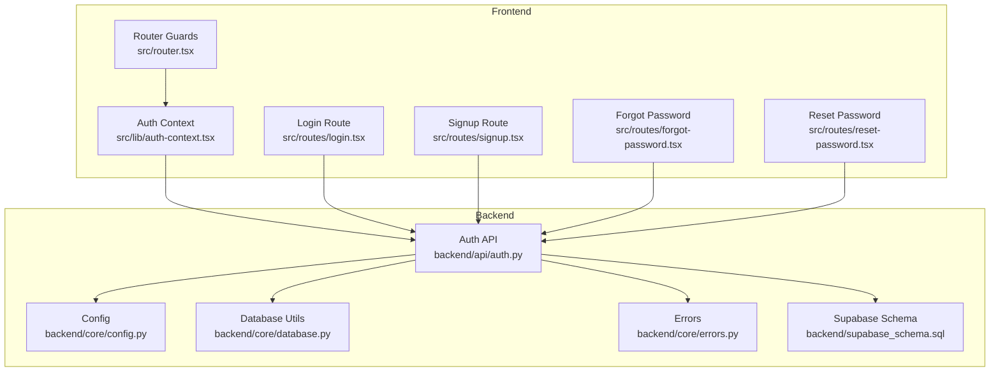
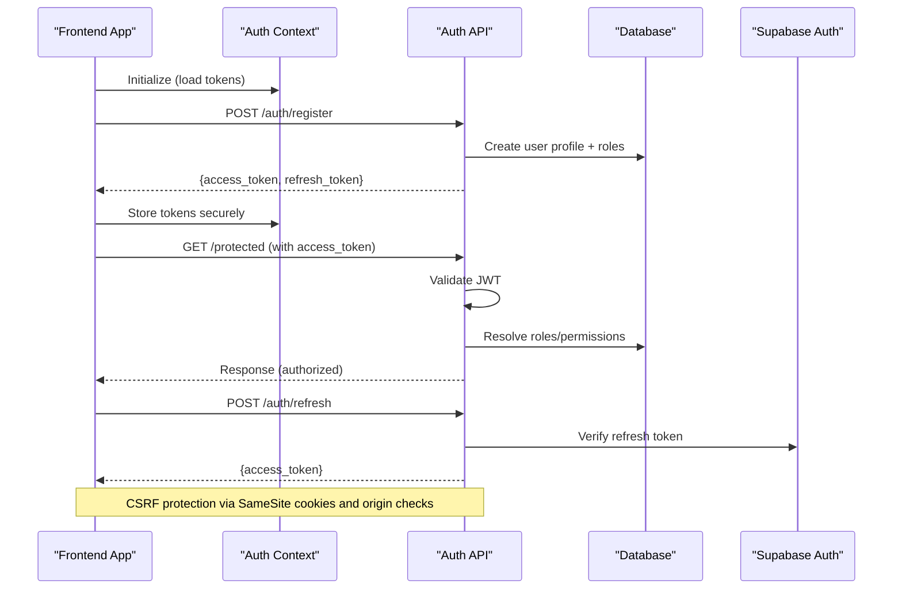
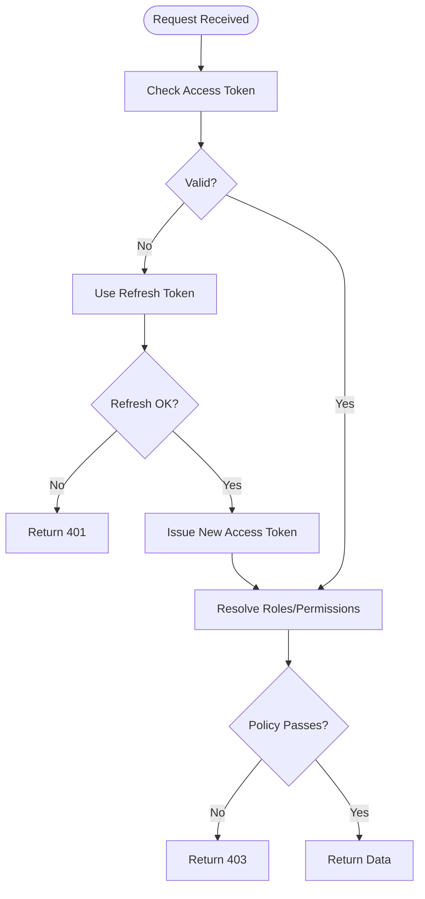
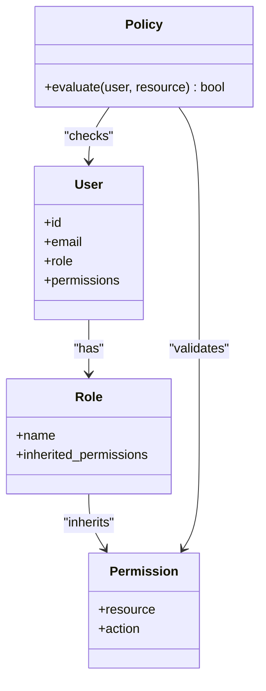
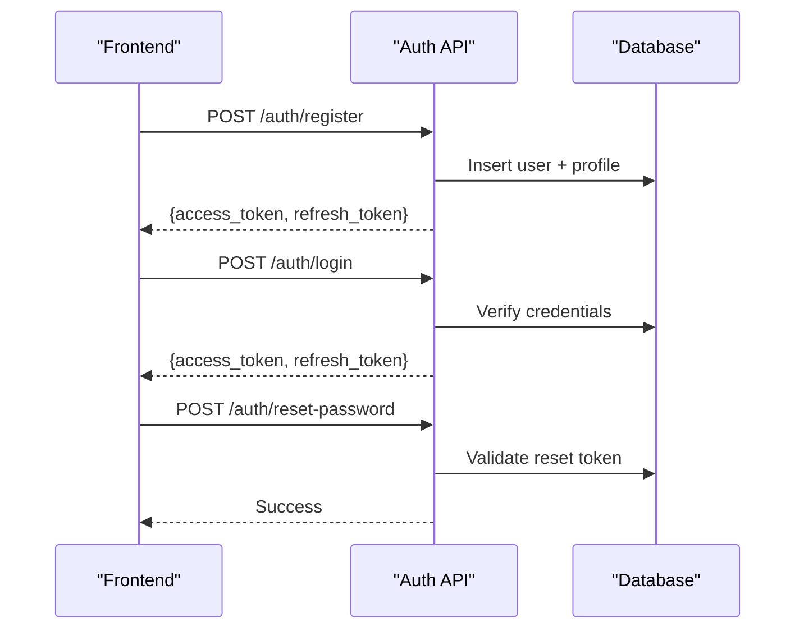
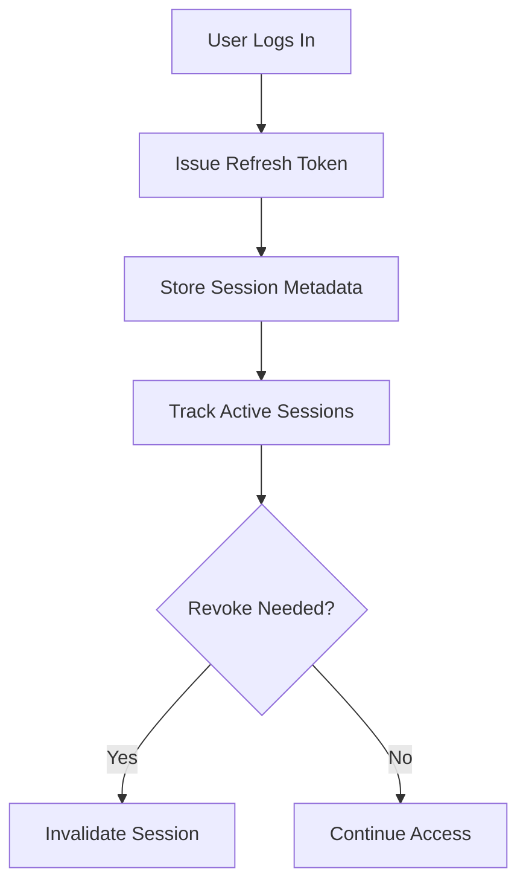
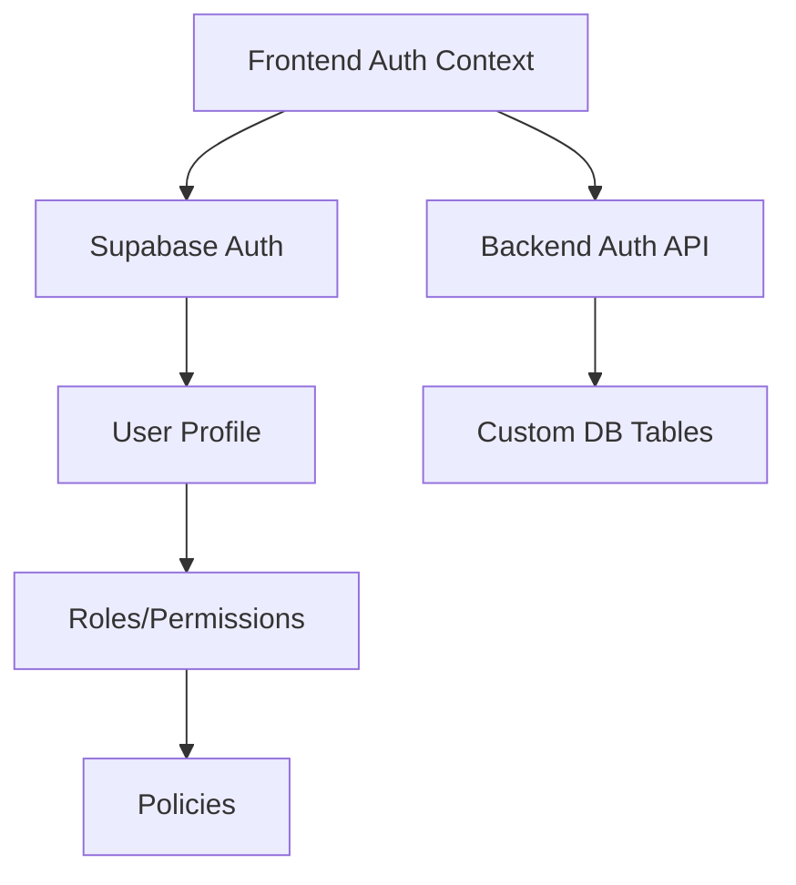
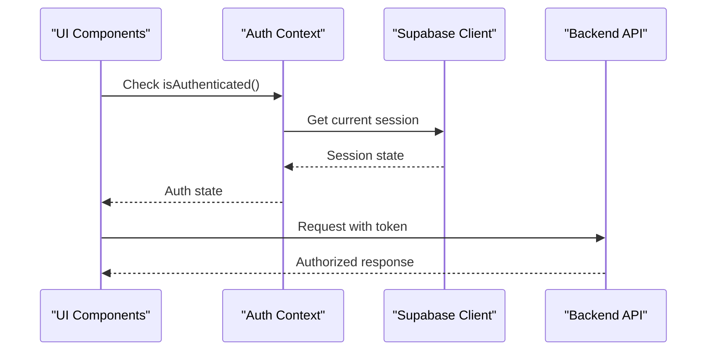
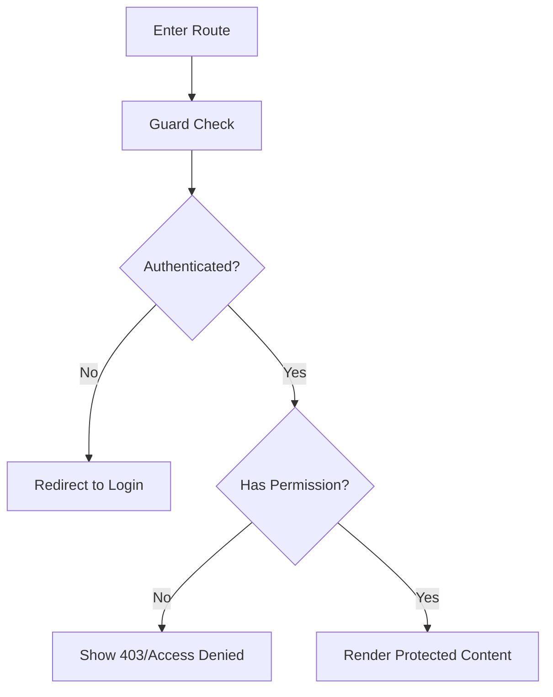
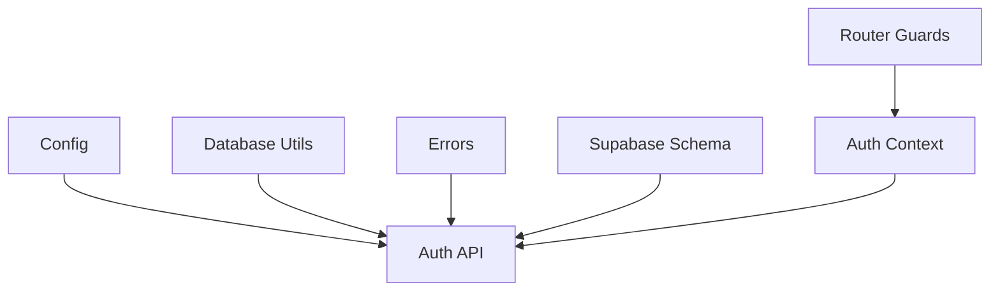

# Authentication & Authorization

<cite>
**Referenced Files in This Document**
- [backend/api/auth.py](file://backend/api/auth.py)
- [backend/core/config.py](file://backend/core/config.py)
- [backend/core/database.py](file://backend/core/database.py)
- [backend/core/errors.py](file://backend/core/errors.py)
- [backend/supabase_schema.sql](file://backend/supabase_schema.sql)
- [src/lib/auth-context.tsx](file://src/lib/auth-context.tsx)
- [src/routes/login.tsx](file://src/routes/login.tsx)
- [src/routes/signup.tsx](file://src/routes/signup.tsx)
- [src/routes/forgot-password.tsx](file://src/routes/forgot-password.tsx)
- [src/routes/reset-password.tsx](file://src/routes/reset-password.tsx)
- [src/router.tsx](file://src/router.tsx)
- [src/server.ts](file://src/server.ts)
</cite>

## Table of Contents
1. [Introduction](#introduction)
2. [Project Structure](#project-structure)
3. [Core Components](#core-components)
4. [Architecture Overview](#architecture-overview)
5. [Detailed Component Analysis](#detailed-component-analysis)
6. [Dependency Analysis](#dependency-analysis)
7. [Performance Considerations](#performance-considerations)
8. [Troubleshooting Guide](#troubleshooting-guide)
9. [Conclusion](#conclusion)
10. [Appendices](#appendices)

## Introduction
This document explains the Horux authentication and authorization system, focusing on JWT-based flows, role-based access control (RBAC), user lifecycle endpoints, session management, and security best practices. It also covers integration with Supabase Auth, custom user models, and frontend synchronization patterns for protected routes and permission checks.

## Project Structure
The authentication system spans backend API endpoints, core configuration and database utilities, Supabase schema definitions, and frontend context/routing for auth state and protected navigation.

**Diagram sources**
- [backend/api/auth.py](file://backend/api/auth.py)
- [backend/core/config.py](file://backend/core/config.py)
- [backend/core/database.py](file://backend/core/database.py)
- [backend/core/errors.py](file://backend/core/errors.py)
- [backend/supabase_schema.sql](file://backend/supabase_schema.sql)
- [src/lib/auth-context.tsx](file://src/lib/auth-context.tsx)
- [src/routes/login.tsx](file://src/routes/login.tsx)
- [src/routes/signup.tsx](file://src/routes/signup.tsx)
- [src/routes/forgot-password.tsx](file://src/routes/forgot-password.tsx)
- [src/routes/reset-password.tsx](file://src/routes/reset-password.tsx)
- [src/router.tsx](file://src/router.tsx)

**Section sources**
- [backend/api/auth.py](file://backend/api/auth.py)
- [backend/core/config.py](file://backend/core/config.py)
- [backend/core/database.py](file://backend/core/database.py)
- [backend/core/errors.py](file://backend/core/errors.py)
- [backend/supabase_schema.sql](file://backend/supabase_schema.sql)
- [src/lib/auth-context.tsx](file://src/lib/auth-context.tsx)
- [src/routes/login.tsx](file://src/routes/login.tsx)
- [src/routes/signup.tsx](file://src/routes/signup.tsx)
- [src/routes/forgot-password.tsx](file://src/routes/forgot-password.tsx)
- [src/routes/reset-password.tsx](file://src/routes/reset-password.tsx)
- [src/router.tsx](file://src/router.tsx)

## Core Components
- Backend Auth API: Endpoints for registration, login, password reset, token refresh, and RBAC enforcement.
- Configuration: Centralized settings for JWT secrets, expiration, and Supabase credentials.
- Database Utilities: Connection handling and query helpers used by auth flows.
- Error Handling: Standardized error responses and validation messages.
- Supabase Schema: Tables and policies that support user profiles, roles, and permissions.
- Frontend Auth Context: Stateful client-side auth store, token storage, and sync hooks.
- Router Guards: Protected route logic to enforce authentication and permissions.

**Section sources**
- [backend/api/auth.py](file://backend/api/auth.py)
- [backend/core/config.py](file://backend/core/config.py)
- [backend/core/database.py](file://backend/core/database.py)
- [backend/core/errors.py](file://backend/core/errors.py)
- [backend/supabase_schema.sql](file://backend/supabase_schema.sql)
- [src/lib/auth-context.tsx](file://src/lib/auth-context.tsx)
- [src/router.tsx](file://src/router.tsx)

## Architecture Overview
The system uses a JWT-based flow where the frontend stores tokens securely and includes them in requests. The backend validates tokens, resolves roles/permissions from the data layer, and enforces RBAC at endpoint or resource boundaries. Supabase Auth can be integrated for identity management while custom RBAC is enforced server-side.

**Diagram sources**
- [backend/api/auth.py](file://backend/api/auth.py)
- [backend/core/database.py](file://backend/core/database.py)
- [backend/core/config.py](file://backend/core/config.py)
- [src/lib/auth-context.tsx](file://src/lib/auth-context.tsx)

## Detailed Component Analysis

### JWT Token Lifecycle
- Generation: On successful login or registration, issue short-lived access tokens and longer-lived refresh tokens.
- Validation: Each request verifies the access token signature and claims; roles and permissions are resolved from the data layer.
- Refresh: Use refresh tokens to obtain new access tokens without re-authentication; rotate refresh tokens on use.
- Secure Storage: Prefer httpOnly cookies for tokens when possible; otherwise use secure storage with strict CSP and XSS protections.

**Diagram sources**
- [backend/api/auth.py](file://backend/api/auth.py)
- [backend/core/config.py](file://backend/core/config.py)

**Section sources**
- [backend/api/auth.py](file://backend/api/auth.py)
- [backend/core/config.py](file://backend/core/config.py)

### Role-Based Access Control (RBAC)
- Roles: Hierarchical roles (e.g., admin, manager, member) with inherited permissions.
- Permissions: Fine-grained actions on resources (read, write, delete).
- Enforcement: Middleware or decorators check roles/permissions before executing handlers.
- Resource-Level Authorization: Policies evaluate user role against resource ownership and required permissions.

**Diagram sources**
- [backend/supabase_schema.sql](file://backend/supabase_schema.sql)
- [backend/api/auth.py](file://backend/api/auth.py)

**Section sources**
- [backend/supabase_schema.sql](file://backend/supabase_schema.sql)
- [backend/api/auth.py](file://backend/api/auth.py)

### User Registration and Login
- Registration: Validates input, creates user profile, assigns default role, returns tokens.
- Login: Authenticates credentials, issues tokens, handles failed attempts with rate limiting.
- Password Reset: Sends reset link/code, validates token, updates password securely.
- Account Management: Update profile, change email/password, manage sessions.

**Diagram sources**
- [backend/api/auth.py](file://backend/api/auth.py)
- [backend/core/database.py](file://backend/core/database.py)

**Section sources**
- [backend/api/auth.py](file://backend/api/auth.py)
- [backend/core/database.py](file://backend/core/database.py)

### Session Management and Concurrent Sessions
- Session Tokens: Refresh tokens represent active sessions; rotate on each refresh.
- Concurrency: Allow multiple concurrent sessions per user; revoke specific sessions if needed.
- Expiration: Short-lived access tokens reduce risk; refresh tokens have longer TTL with rotation.
- Security: Enforce HTTPS, SameSite cookies, and origin validation.

**Diagram sources**
- [backend/api/auth.py](file://backend/api/auth.py)
- [backend/core/database.py](file://backend/core/database.py)

**Section sources**
- [backend/api/auth.py](file://backend/api/auth.py)
- [backend/core/database.py](file://backend/core/database.py)

### Integration with Supabase Auth
- Identity Provider: Use Supabase Auth for email/password, OAuth, and magic links.
- Custom Models: Extend user profiles with roles and permissions in your schema.
- Sync: Keep frontend auth context synchronized with Supabase session state.
- Policies: Leverage Supabase Row Level Security (RLS) for additional data protection.

**Diagram sources**
- [backend/supabase_schema.sql](file://backend/supabase_schema.sql)
- [src/lib/auth-context.tsx](file://src/lib/auth-context.tsx)

**Section sources**
- [backend/supabase_schema.sql](file://backend/supabase_schema.sql)
- [src/lib/auth-context.tsx](file://src/lib/auth-context.tsx)

### Frontend Authentication Context Synchronization
- State: Maintain authenticated state, tokens, and user profile in context.
- Hooks: Provide hooks for checking auth status and permissions.
- Sync: Listen to Supabase session changes and update local state accordingly.
- Storage: Persist tokens securely and handle cleanup on logout.

**Diagram sources**
- [src/lib/auth-context.tsx](file://src/lib/auth-context.tsx)

**Section sources**
- [src/lib/auth-context.tsx](file://src/lib/auth-context.tsx)

### Protected Routes and Middleware Decorators
- Route Guards: Prevent navigation to protected routes if not authenticated or lacking permissions.
- Middleware: Apply RBAC checks to API endpoints using decorators or middleware functions.
- Permission Utilities: Helper functions to check roles and permissions declaratively.

**Diagram sources**
- [src/router.tsx](file://src/router.tsx)

**Section sources**
- [src/router.tsx](file://src/router.tsx)

## Dependency Analysis
- Backend dependencies: Config drives JWT settings; database utilities provide persistence; errors standardize responses.
- Frontend dependencies: Auth context depends on Supabase client and local storage; router guards depend on context state.
- External integrations: Supabase Auth provides identity services; optional RLS policies enhance data security.

**Diagram sources**
- [backend/core/config.py](file://backend/core/config.py)
- [backend/core/database.py](file://backend/core/database.py)
- [backend/core/errors.py](file://backend/core/errors.py)
- [backend/supabase_schema.sql](file://backend/supabase_schema.sql)
- [backend/api/auth.py](file://backend/api/auth.py)
- [src/lib/auth-context.tsx](file://src/lib/auth-context.tsx)
- [src/router.tsx](file://src/router.tsx)

**Section sources**
- [backend/core/config.py](file://backend/core/config.py)
- [backend/core/database.py](file://backend/core/database.py)
- [backend/core/errors.py](file://backend/core/errors.py)
- [backend/supabase_schema.sql](file://backend/supabase_schema.sql)
- [backend/api/auth.py](file://backend/api/auth.py)
- [src/lib/auth-context.tsx](file://src/lib/auth-context.tsx)
- [src/router.tsx](file://src/router.tsx)

## Performance Considerations
- Token Validation: Cache validated claims where appropriate; avoid redundant DB lookups for static roles.
- Rate Limiting: Implement per-IP and per-user limits on sensitive endpoints (login, reset).
- Connection Pooling: Use efficient database connections and reuse sessions.
- Frontend Optimization: Debounce auth checks and minimize re-renders in auth context.

[No sources needed since this section provides general guidance]

## Troubleshooting Guide
- Common Errors: Invalid token, expired refresh token, insufficient permissions, malformed payloads.
- Debugging: Log token validation steps, policy evaluations, and DB queries; ensure CORS and cookie settings are correct.
- Recovery: Provide clear error messages and recovery flows (e.g., re-login, password reset).

**Section sources**
- [backend/core/errors.py](file://backend/core/errors.py)
- [backend/api/auth.py](file://backend/api/auth.py)

## Conclusion
Horux’s authentication and authorization system combines JWT-based token flows with robust RBAC and Supabase Auth integration. Secure storage, session management, and frontend synchronization ensure a safe and responsive user experience. Follow the recommended best practices for token expiration, CSRF protection, and input sanitization to maintain security across the stack.

[No sources needed since this section summarizes without analyzing specific files]

## Appendices

### Endpoint Reference
- Registration: POST /auth/register
- Login: POST /auth/login
- Password Reset: POST /auth/reset-password
- Refresh Token: POST /auth/refresh
- Protected Resources: GET/POST/PUT/DELETE /api/* (requires valid token and permissions)

**Section sources**
- [backend/api/auth.py](file://backend/api/auth.py)

### Frontend Routes
- Login: src/routes/login.tsx
- Signup: src/routes/signup.tsx
- Forgot Password: src/routes/forgot-password.tsx
- Reset Password: src/routes/reset-password.tsx
- Router Guards: src/router.tsx

**Section sources**
- [src/routes/login.tsx](file://src/routes/login.tsx)
- [src/routes/signup.tsx](file://src/routes/signup.tsx)
- [src/routes/forgot-password.tsx](file://src/routes/forgot-password.tsx)
- [src/routes/reset-password.tsx](file://src/routes/reset-password.tsx)
- [src/router.tsx](file://src/router.tsx)