# Backend API

<cite>
**Referenced Files in This Document**
- [main.py](file://backend/main.py)
- [config.py](file://backend/core/config.py)
- [database.py](file://backend/core/database.py)
- [deps.py](file://backend/core/deps.py)
- [errors.py](file://backend/core/errors.py)
- [auth.py](file://backend/api/auth.py)
- [projects.py](file://backend/api/projects.py)
- [teams.py](file://backend/api/teams.py)
- [tasks.py](file://backend/api/tasks.py)
- [templates.py](file://backend/api/templates.py)
- [catalog.py](file://backend/api/catalog.py)
- [files.py](file://backend/api/files.py)
- [live.py](file://backend/api/live.py)
- [team_live.py](file://backend/api/team_live.py)
- [viva.py](file://backend/api/viva.py)
- [advanced.py](file://backend/api/advanced.py)
- [analytics.py](file://backend/api/analytics.py)
- [presentation.py](file://backend/api/presentation.py)
- [project_team.py](file://backend/api/project_team.py)
- [readiness.py](file://backend/api/readiness.py)
- [gamification.py](file://backend/api/gamification.py)
- [schemas.py](file://backend/models/schemas.py)
- [supabase_schema.sql](file://backend/supabase_schema.sql)
- [001_platform_enhancement.sql](file://backend/migrations/001_platform_enhancement.sql)
- [002_quality_upgrade.sql](file://backend/migrations/002_quality_upgrade.sql)
- [003_team_project_linking.sql](file://backend/migrations/003_team_project_linking.sql)
- [004_team_viva_voice.sql](file://backend/migrations/004_team_viva_voice.sql)
</cite>

## Table of Contents
1. [Introduction](#introduction)
2. [Project Structure](#project-structure)
3. [Core Components](#core-components)
4. [Architecture Overview](#architecture-overview)
5. [Detailed Component Analysis](#detailed-component-analysis)
6. [Dependency Analysis](#dependency-analysis)
7. [Performance Considerations](#performance-considerations)
8. [Troubleshooting Guide](#troubleshooting-guide)
9. [Conclusion](#conclusion)
10. [Appendices](#appendices)

## Introduction
This document provides comprehensive API documentation for the Horux backend built with FastAPI. It covers RESTful endpoint organization, request/response patterns, authentication and authorization, dependency injection, middleware stack, service layer abstraction, database integration with SQLAlchemy and Supabase PostgreSQL, security measures (JWT, RBAC, input validation, CORS), API versioning strategies, rate limiting, monitoring, and detailed endpoint specifications with schemas and usage examples.

## Project Structure
The backend is organized into clear layers:
- Entry point and application configuration
- Core utilities (configuration, database, dependencies, errors, logging, languages)
- API routes grouped by domain (auth, projects, teams, tasks, templates, catalog, files, live sessions, viva, analytics, presentation, project-team linking, readiness, gamification, advanced features)
- Data models and Pydantic schemas
- Database schema and migrations
- Services for business logic
- Tests for core functionality

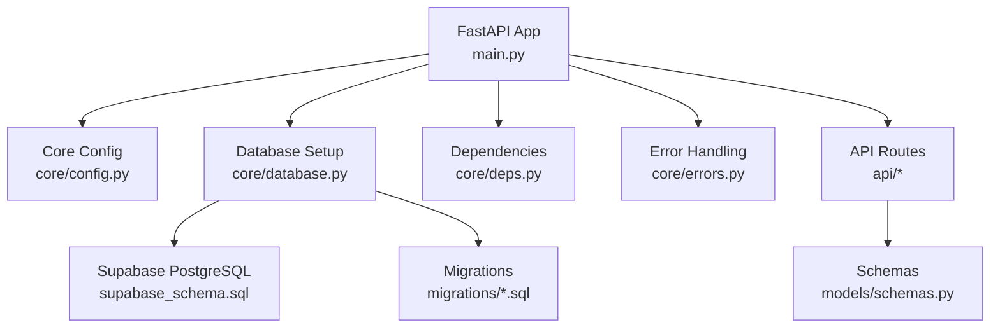

**Diagram sources**
- [main.py](file://backend/main.py)
- [config.py](file://backend/core/config.py)
- [database.py](file://backend/core/database.py)
- [deps.py](file://backend/core/deps.py)
- [errors.py](file://backend/core/errors.py)
- [schemas.py](file://backend/models/schemas.py)
- [supabase_schema.sql](file://backend/supabase_schema.sql)
- [001_platform_enhancement.sql](file://backend/migrations/001_platform_enhancement.sql)
- [002_quality_upgrade.sql](file://backend/migrations/002_quality_upgrade.sql)
- [003_team_project_linking.sql](file://backend/migrations/003_team_project_linking.sql)
- [004_team_viva_voice.sql](file://backend/migrations/004_team_viva_voice.sql)

**Section sources**
- [main.py](file://backend/main.py)
- [config.py](file://backend/core/config.py)
- [database.py](file://backend/core/database.py)
- [deps.py](file://backend/core/deps.py)
- [errors.py](file://backend/core/errors.py)
- [schemas.py](file://backend/models/schemas.py)
- [supabase_schema.sql](file://backend/supabase_schema.sql)
- [001_platform_enhancement.sql](file://backend/migrations/001_platform_enhancement.sql)
- [002_quality_upgrade.sql](file://backend/migrations/002_quality_upgrade.sql)
- [003_team_project_linking.sql](file://backend/migrations/003_team_project_linking.sql)
- [004_team_viva_voice.sql](file://backend/migrations/004_team_viva_voice.sql)

## Core Components
- Application entrypoint and middleware setup
- Configuration management for environment variables and feature flags
- Database engine, session factory, and connection pooling
- Dependency injection providers for DB sessions, auth context, and services
- Centralized error handling and HTTP exception responses
- Pydantic schemas for request/response validation and serialization

Key responsibilities:
- Initialize FastAPI app with CORS, middleware, routers
- Provide typed configuration via environment variables
- Manage SQLAlchemy engine/session lifecycle and pool settings
- Expose reusable dependencies to route handlers
- Define consistent error shapes and status codes
- Validate and serialize payloads using Pydantic models

**Section sources**
- [main.py](file://backend/main.py)
- [config.py](file://backend/core/config.py)
- [database.py](file://backend/core/database.py)
- [deps.py](file://backend/core/deps.py)
- [errors.py](file://backend/core/errors.py)
- [schemas.py](file://backend/models/schemas.py)

## Architecture Overview
The system follows a layered architecture:
- Presentation Layer: FastAPI routers define REST endpoints
- Service Layer: Business logic encapsulated in Python modules
- Data Access Layer: SQLAlchemy ORM with Supabase PostgreSQL
- Security Layer: JWT-based authentication and role-based access control
- Cross-cutting concerns: Logging, error handling, validation, rate limiting

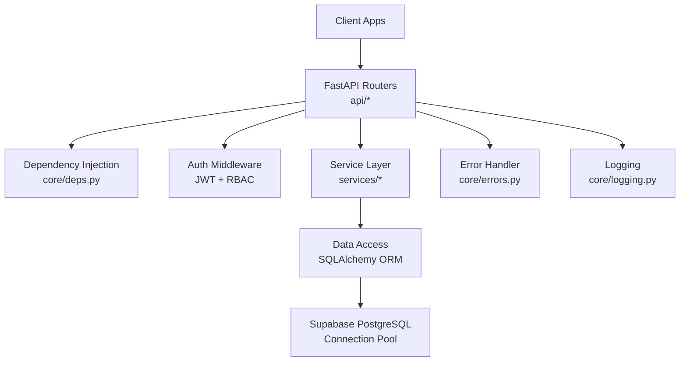

**Diagram sources**
- [auth.py](file://backend/api/auth.py)
- [deps.py](file://backend/core/deps.py)
- [database.py](file://backend/core/database.py)
- [errors.py](file://backend/core/errors.py)
- [supabase_schema.sql](file://backend/supabase_schema.sql)

## Detailed Component Analysis

### Authentication and Authorization
- JWT-based token issuance and verification
- Role-based access control enforced at route or service level
- Secure cookie or header transport options
- Refresh token flow and token expiration handling

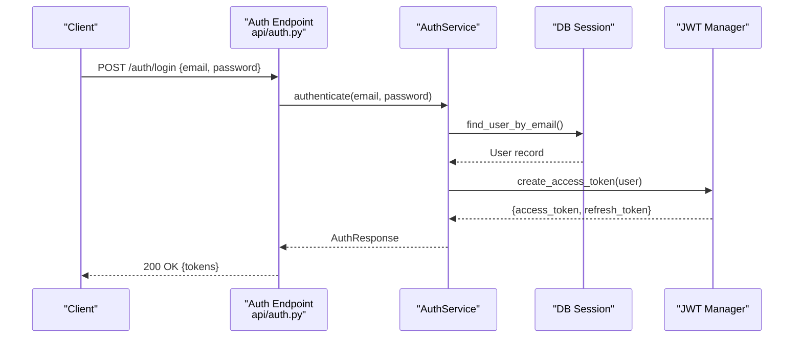

**Diagram sources**
- [auth.py](file://backend/api/auth.py)
- [deps.py](file://backend/core/deps.py)
- [database.py](file://backend/core/database.py)

**Section sources**
- [auth.py](file://backend/api/auth.py)
- [deps.py](file://backend/core/deps.py)

### Projects API
- CRUD operations for projects
- Team association and permissions
- Template-driven project creation
- Versioned endpoints for backward compatibility

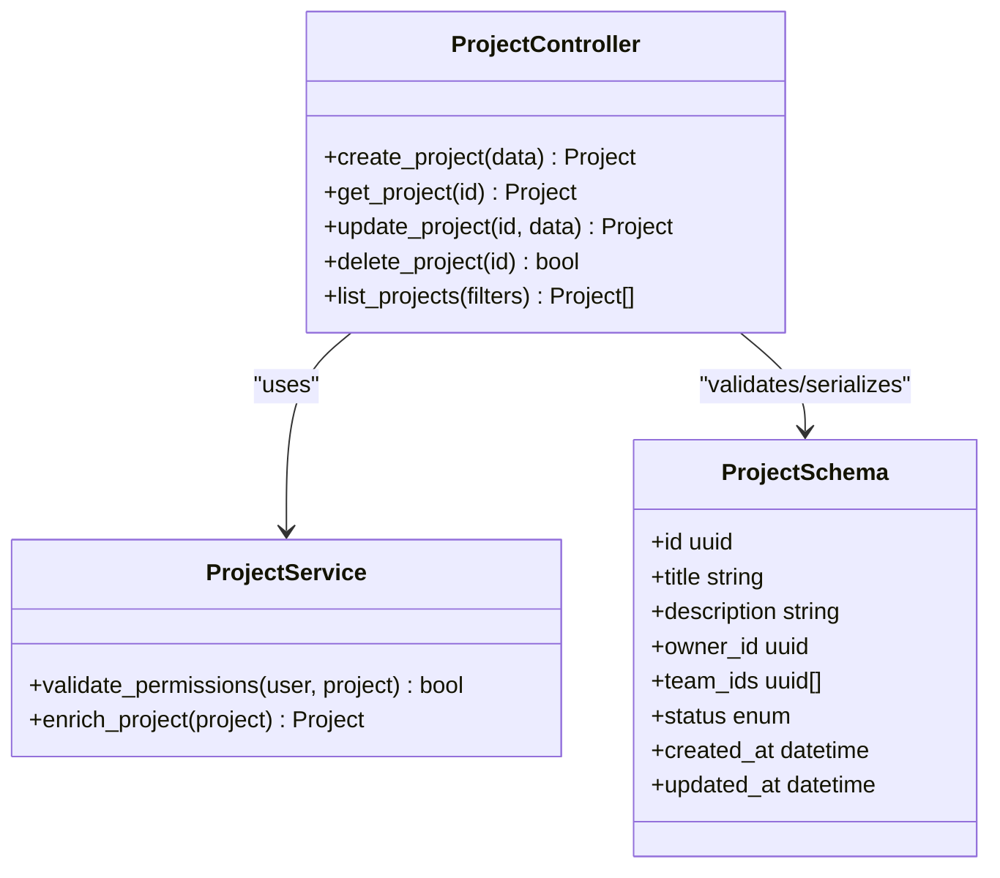

**Diagram sources**
- [projects.py](file://backend/api/projects.py)
- [schemas.py](file://backend/models/schemas.py)

**Section sources**
- [projects.py](file://backend/api/projects.py)
- [schemas.py](file://backend/models/schemas.py)

### Teams API
- Team creation, membership management
- Role assignment within teams
- Team-scoped resource access

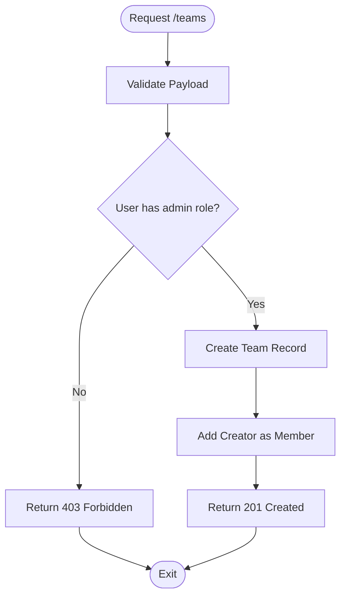

**Diagram sources**
- [teams.py](file://backend/api/teams.py)
- [schemas.py](file://backend/models/schemas.py)

**Section sources**
- [teams.py](file://backend/api/teams.py)
- [schemas.py](file://backend/models/schemas.py)

### Tasks API
- Task lifecycle management
- Reordering and status transitions
- Assignment to users and teams

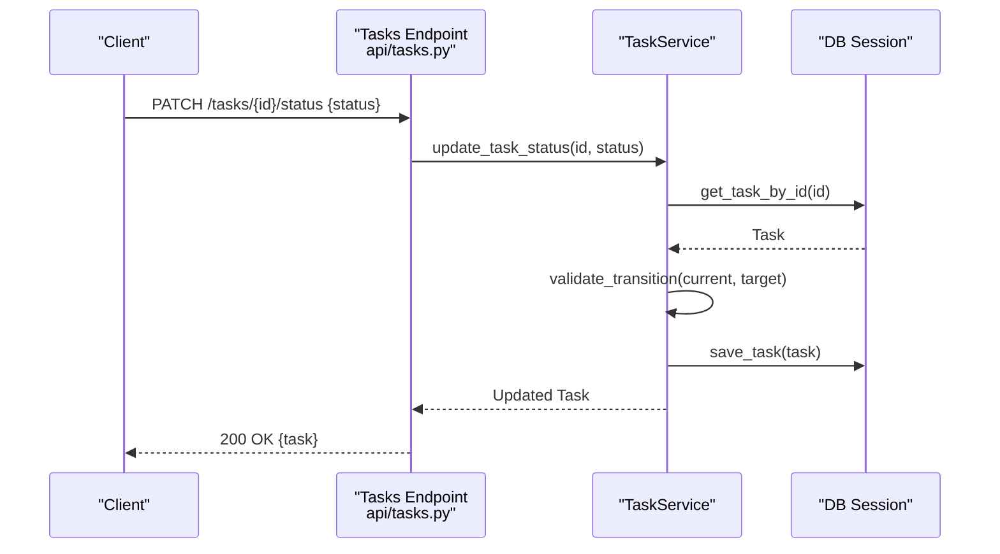

**Diagram sources**
- [tasks.py](file://backend/api/tasks.py)
- [schemas.py](file://backend/models/schemas.py)

**Section sources**
- [tasks.py](file://backend/api/tasks.py)
- [schemas.py](file://backend/models/schemas.py)

### Templates API
- Template listing and retrieval
- Slug-based template resolution
- Versioned template content

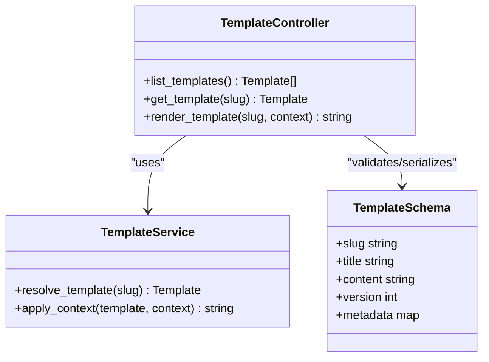

**Diagram sources**
- [templates.py](file://backend/api/templates.py)
- [schemas.py](file://backend/models/schemas.py)

**Section sources**
- [templates.py](file://backend/api/templates.py)
- [schemas.py](file://backend/models/schemas.py)

### Catalog API
- Resource catalog management
- Filtering and search capabilities
- Metadata enrichment

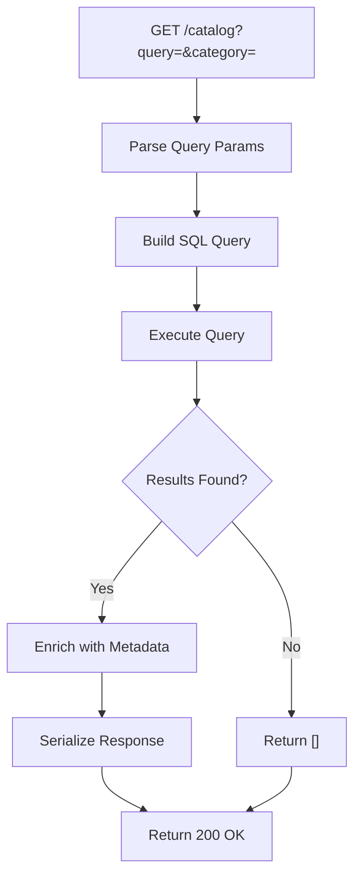

**Diagram sources**
- [catalog.py](file://backend/api/catalog.py)
- [schemas.py](file://backend/models/schemas.py)

**Section sources**
- [catalog.py](file://backend/api/catalog.py)
- [schemas.py](file://backend/models/schemas.py)

### Files API
- File upload and download
- Signed URL generation
- Content type validation

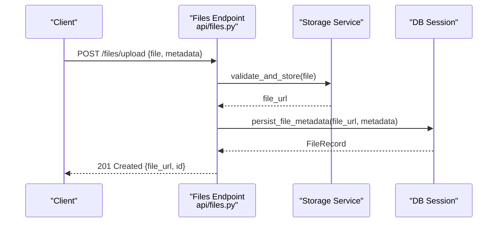

**Diagram sources**
- [files.py](file://backend/api/files.py)
- [schemas.py](file://backend/models/schemas.py)

**Section sources**
- [files.py](file://backend/api/files.py)
- [schemas.py](file://backend/models/schemas.py)

### Live Sessions API
- Real-time session management
- WebSocket support for live interactions
- Session state persistence

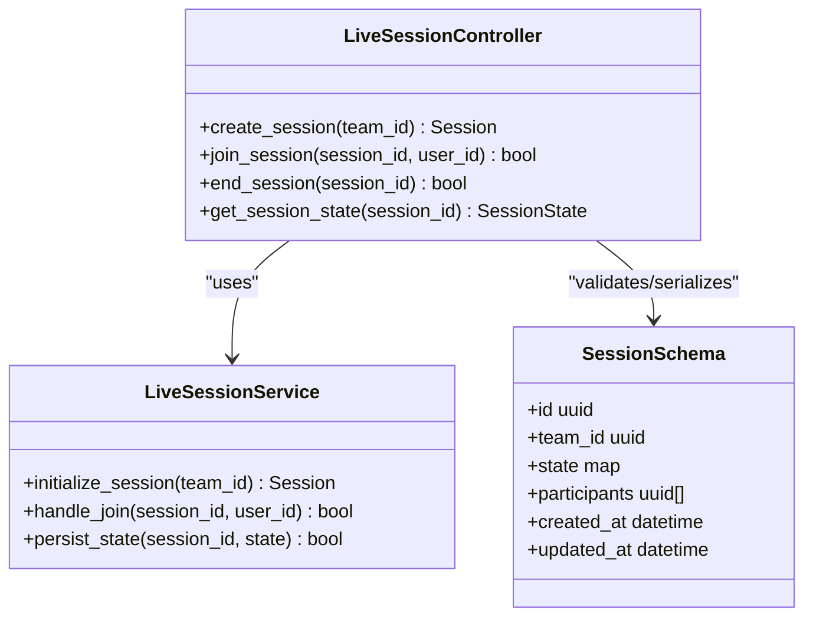

**Diagram sources**
- [live.py](file://backend/api/live.py)
- [schemas.py](file://backend/models/schemas.py)

**Section sources**
- [live.py](file://backend/api/live.py)
- [schemas.py](file://backend/models/schemas.py)

### Team Live API
- Multi-user live collaboration
- Real-time event broadcasting
- Conflict resolution for concurrent updates

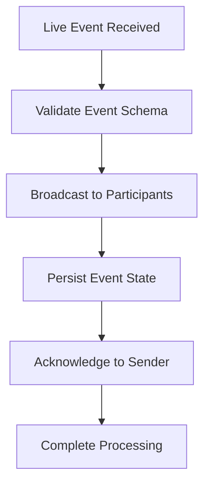

**Diagram sources**
- [team_live.py](file://backend/api/team_live.py)
- [schemas.py](file://backend/models/schemas.py)

**Section sources**
- [team_live.py](file://backend/api/team_live.py)
- [schemas.py](file://backend/models/schemas.py)

### Viva API
- AI-powered viva session management
- Prompt generation and execution
- Session analytics and reporting

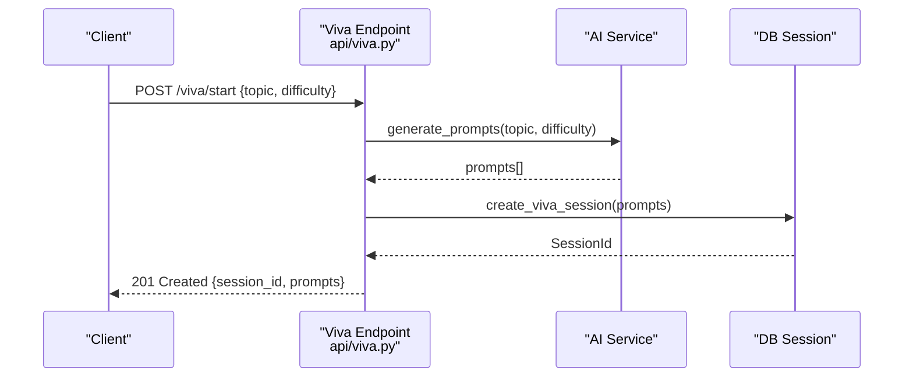

**Diagram sources**
- [viva.py](file://backend/api/viva.py)
- [schemas.py](file://backend/models/schemas.py)

**Section sources**
- [viva.py](file://backend/api/viva.py)
- [schemas.py](file://backend/models/schemas.py)

### Advanced Features API
- Sentiment analysis
- Weakness heatmap generation
- Code-aware viva sessions
- Delivery metrics calculation

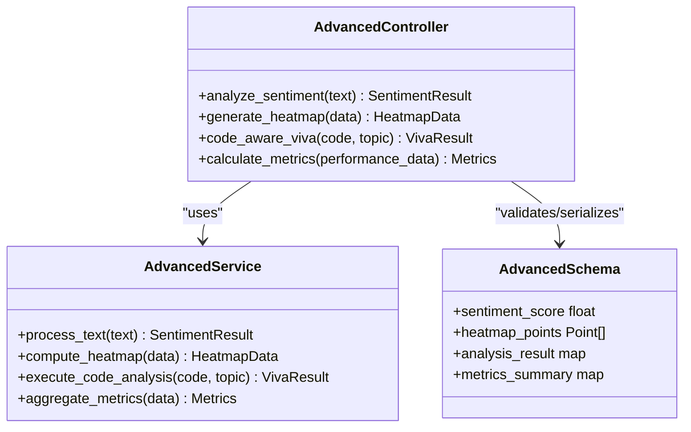

**Diagram sources**
- [advanced.py](file://backend/api/advanced.py)
- [schemas.py](file://backend/models/schemas.py)

**Section sources**
- [advanced.py](file://backend/api/advanced.py)
- [schemas.py](file://backend/models/schemas.py)

### Analytics API
- Usage analytics aggregation
- Performance metrics collection
- Dashboard data preparation

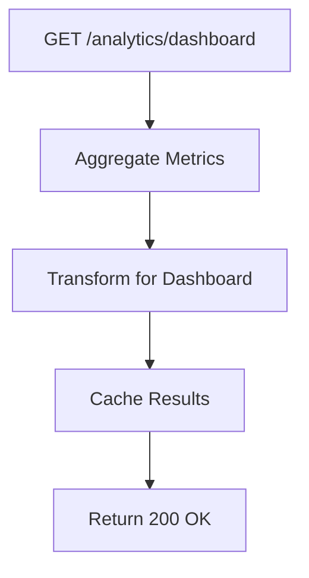

**Diagram sources**
- [analytics.py](file://backend/api/analytics.py)
- [schemas.py](file://backend/models/schemas.py)

**Section sources**
- [analytics.py](file://backend/api/analytics.py)
- [schemas.py](file://backend/models/schemas.py)

### Presentation API
- AI-generated presentation creation
- Slide deck management
- Export functionality

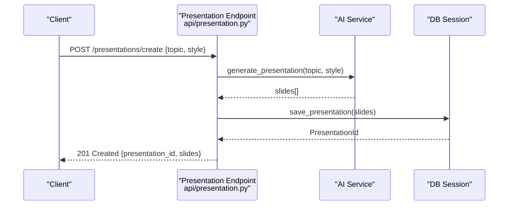

**Diagram sources**
- [presentation.py](file://backend/api/presentation.py)
- [schemas.py](file://backend/models/schemas.py)

**Section sources**
- [presentation.py](file://backend/api/presentation.py)
- [schemas.py](file://backend/models/schemas.py)

### Project-Team Linking API
- Bidirectional relationships between projects and teams
- Permission inheritance
- Bulk operations for team assignments

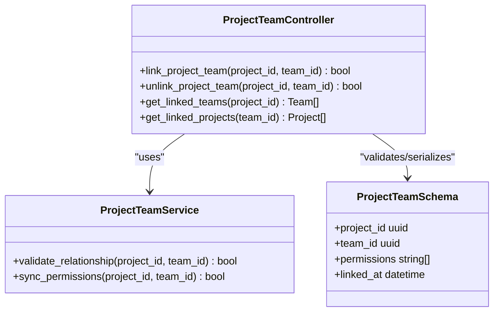

**Diagram sources**
- [project_team.py](file://backend/api/project_team.py)
- [schemas.py](file://backend/models/schemas.py)

**Section sources**
- [project_team.py](file://backend/api/project_team.py)
- [schemas.py](file://backend/models/schemas.py)

### Readiness API
- Readiness assessment calculations
- Progress tracking
- Recommendation engine

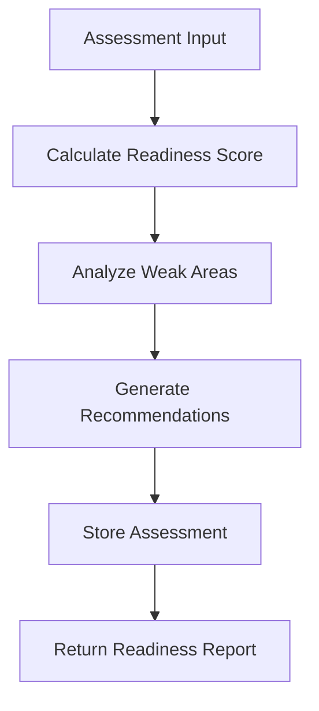

**Diagram sources**
- [readiness.py](file://backend/api/readiness.py)
- [schemas.py](file://backend/models/schemas.py)

**Section sources**
- [readiness.py](file://backend/api/readiness.py)
- [schemas.py](file://backend/models/schemas.py)

### Gamification API
- Achievement tracking
- Points and badges management
- Leaderboard calculations

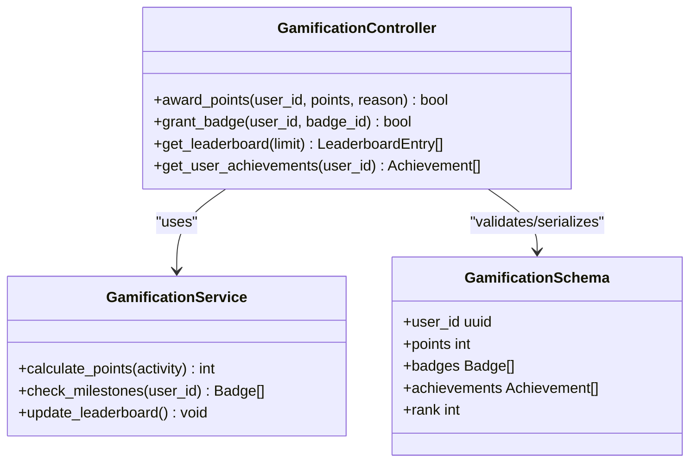

**Diagram sources**
- [gamification.py](file://backend/api/gamification.py)
- [schemas.py](file://backend/models/schemas.py)

**Section sources**
- [gamification.py](file://backend/api/gamification.py)
- [schemas.py](file://backend/models/schemas.py)

## Dependency Analysis
The dependency graph shows clear separation of concerns:
- Routers depend on services for business logic
- Services depend on data access layer for persistence
- All components use shared schemas for validation
- Authentication and authorization are cross-cutting concerns

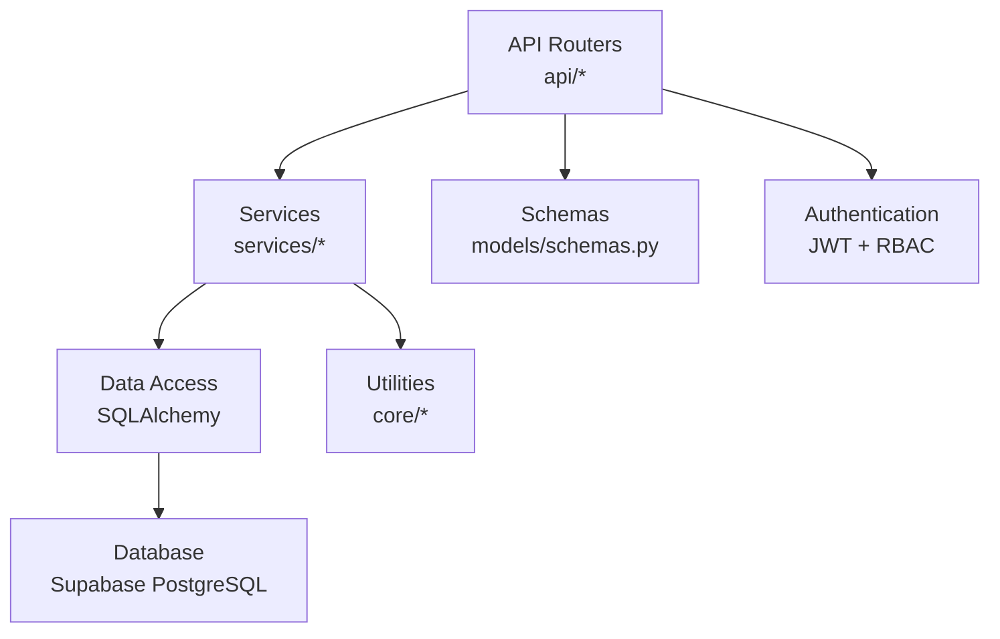

**Diagram sources**
- [deps.py](file://backend/core/deps.py)
- [database.py](file://backend/core/database.py)
- [schemas.py](file://backend/models/schemas.py)

**Section sources**
- [deps.py](file://backend/core/deps.py)
- [database.py](file://backend/core/database.py)
- [schemas.py](file://backend/models/schemas.py)

## Performance Considerations
- Connection pooling optimization for database queries
- Query optimization with proper indexing strategies
- Caching strategies for frequently accessed data
- Rate limiting implementation for API protection
- Asynchronous processing for long-running operations
- Memory management for large file uploads
- Response compression for bandwidth optimization

## Troubleshooting Guide
Common issues and solutions:
- Database connection failures: Check connection strings and network connectivity
- Authentication errors: Verify JWT tokens and expiration times
- Validation errors: Review request payload against schema definitions
- Permission denied: Check user roles and resource ownership
- Rate limiting: Monitor request frequency and adjust limits
- Performance bottlenecks: Profile slow endpoints and optimize queries

**Section sources**
- [errors.py](file://backend/core/errors.py)
- [database.py](file://backend/core/database.py)
- [auth.py](file://backend/api/auth.py)

## Conclusion
The Horux backend provides a robust, scalable API architecture built with FastAPI. The modular design separates concerns effectively, enabling maintainable code and easy testing. Comprehensive security measures protect user data while providing flexible access controls. The database layer leverages SQLAlchemy with Supabase PostgreSQL for reliable data persistence. Future enhancements should focus on performance optimization, monitoring, and additional API features.

## Appendices

### API Versioning Strategy
- URL-based versioning: `/api/v1/...`
- Header-based versioning: `X-API-Version: 1`
- Deprecation policy with sunset headers
- Backward compatibility maintenance

### Rate Limiting Configuration
- Per-user rate limits based on subscription tier
- Global rate limits for API protection
- Sliding window algorithm implementation
- Customizable limits per endpoint

### Monitoring and Observability
- Structured logging with correlation IDs
- Health check endpoints
- Metrics collection for key KPIs
- Error tracking and alerting
- Performance profiling tools

### Security Implementation Details
- JWT token structure and claims
- Password hashing with bcrypt
- Input validation with Pydantic
- CORS configuration for cross-origin requests
- CSRF protection for state-changing operations
- SQL injection prevention with parameterized queries

**Section sources**
- [config.py](file://backend/core/config.py)
- [errors.py](file://backend/core/errors.py)
- [auth.py](file://backend/api/auth.py)
- [database.py](file://backend/core/database.py)