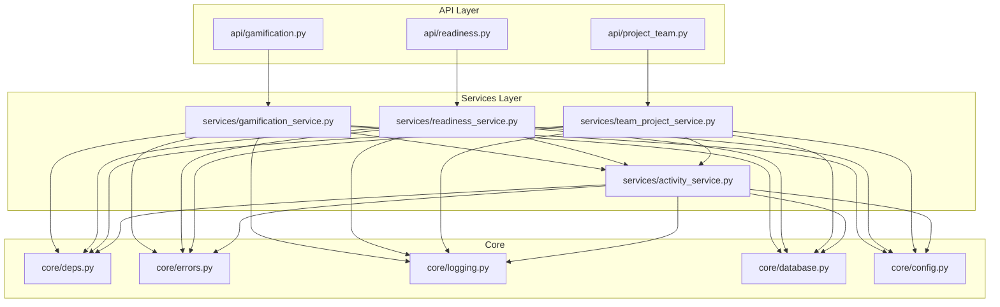
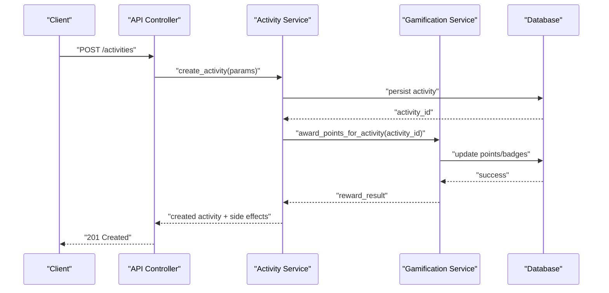
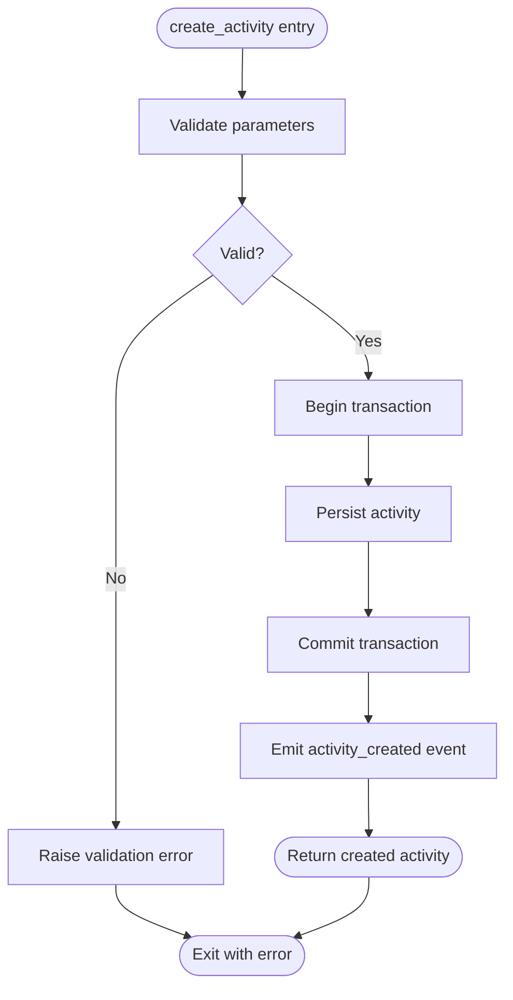
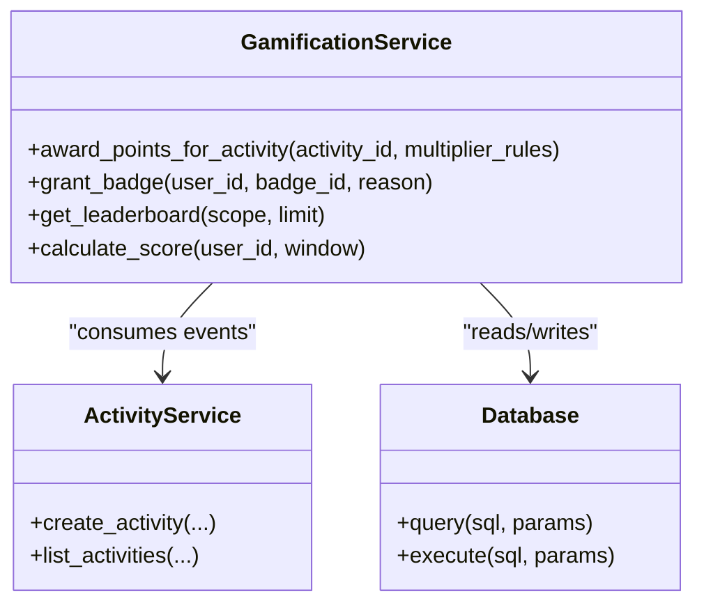
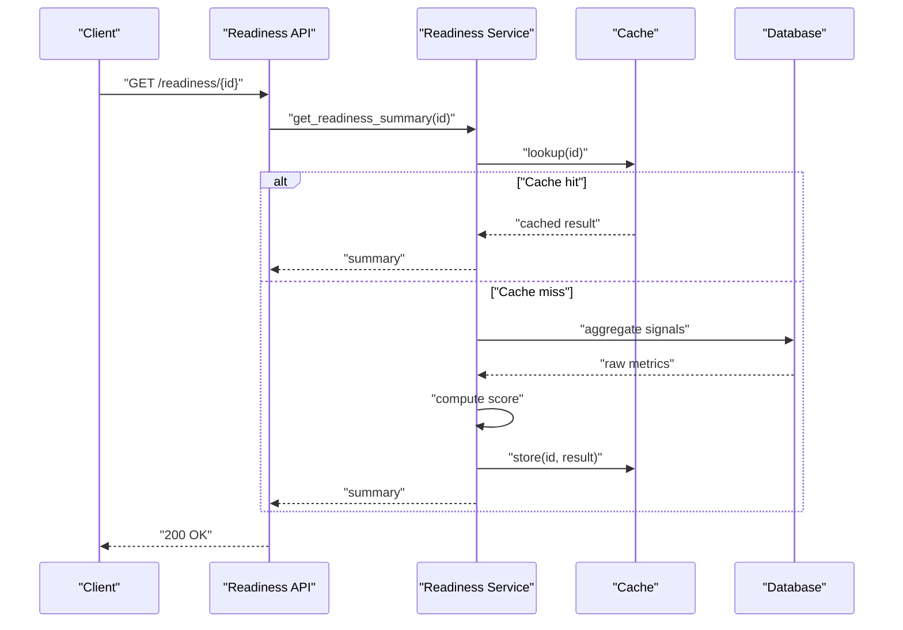
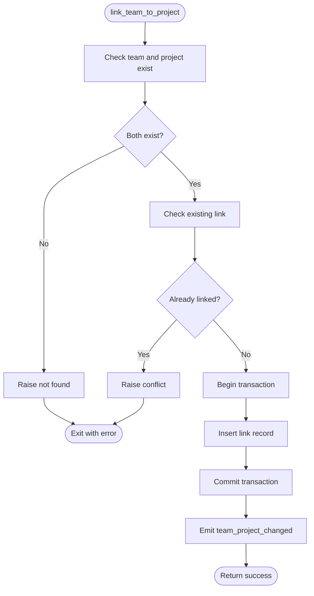
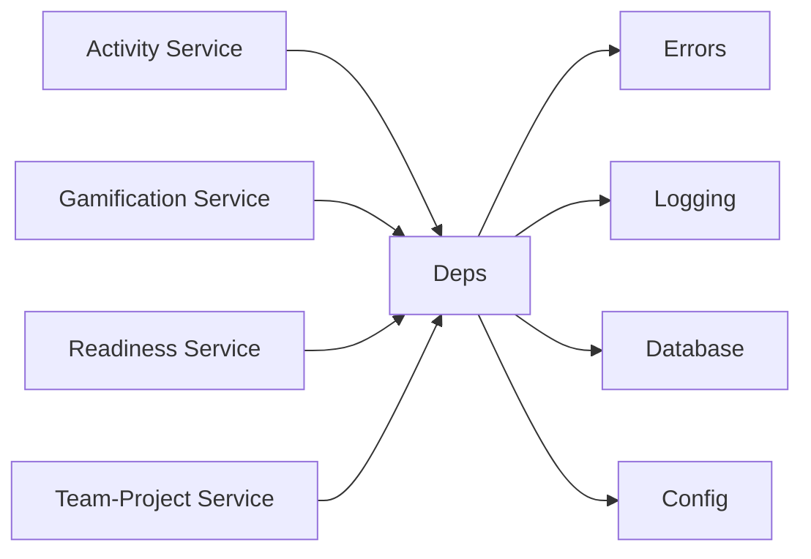

# Core Services Layer

<cite>
**Referenced Files in This Document**
- [activity_service.py](file://backend/services/activity_service.py)
- [gamification_service.py](file://backend/services/gamification_service.py)
- [readiness_service.py](file://backend/services/readiness_service.py)
- [team_project_service.py](file://backend/services/team_project_service.py)
- [deps.py](file://backend/core/deps.py)
- [errors.py](file://backend/core/errors.py)
- [logging.py](file://backend/core/logging.py)
- [database.py](file://backend/core/database.py)
- [config.py](file://backend/core/config.py)
- [api_gamification.py](file://backend/api/gamification.py)
- [api_readiness.py](file://backend/api/readiness.py)
- [api_project_team.py](file://backend/api/project_team.py)
</cite>

## Table of Contents
1. [Introduction](#introduction)
2. [Project Structure](#project-structure)
3. [Core Components](#core-components)
4. [Architecture Overview](#architecture-overview)
5. [Detailed Component Analysis](#detailed-component-analysis)
6. [Dependency Analysis](#dependency-analysis)
7. [Performance Considerations](#performance-considerations)
8. [Troubleshooting Guide](#troubleshooting-guide)
9. [Conclusion](#conclusion)
10. [Appendices](#appendices)

## Introduction
This document explains the core services layer architecture in the Horux backend. It focuses on the service-oriented design pattern, business logic abstraction, and dependency management between services. The four primary services covered are:
- Activity tracking
- Gamification engine
- Readiness assessment
- Team-project relationship management

The document details service interfaces, parameter validation, return value structures, error handling patterns, logging strategies, transaction management, composition patterns, event-driven communication, async processing capabilities, usage examples, testing approaches, and extension points for custom business logic.

## Project Structure
The services layer resides under backend/services and is consumed by API controllers under backend/api. Cross-cutting concerns (configuration, database access, errors, logging, dependency injection) live under backend/core.

**Diagram sources**
- [api_gamification.py](file://backend/api/gamification.py)
- [api_readiness.py](file://backend/api/readiness.py)
- [api_project_team.py](file://backend/api/project_team.py)
- [activity_service.py](file://backend/services/activity_service.py)
- [gamification_service.py](file://backend/services/gamification_service.py)
- [readiness_service.py](file://backend/services/readiness_service.py)
- [team_project_service.py](file://backend/services/team_project_service.py)
- [deps.py](file://backend/core/deps.py)
- [errors.py](file://backend/core/errors.py)
- [logging.py](file://backend/core/logging.py)
- [database.py](file://backend/core/database.py)
- [config.py](file://backend/core/config.py)

**Section sources**
- [deps.py](file://backend/core/deps.py)
- [errors.py](file://backend/core/errors.py)
- [logging.py](file://backend/core/logging.py)
- [database.py](file://backend/core/database.py)
- [config.py](file://backend/core/config.py)
- [api_gamification.py](file://backend/api/gamification.py)
- [api_readiness.py](file://backend/api/readiness.py)
- [api_project_team.py](file://backend/api/project_team.py)
- [activity_service.py](file://backend/services/activity_service.py)
- [gamification_service.py](file://backend/services/gamification_service.py)
- [readiness_service.py](file://backend/services/readiness_service.py)
- [team_project_service.py](file://backend/services/team_project_service.py)

## Core Components
This section summarizes each core service’s responsibilities and how they collaborate.

- Activity Service
  - Purpose: Centralized audit trail for user actions across features.
  - Key responsibilities: Record events with contextual metadata; aggregate activity counts; provide read APIs for dashboards.
  - Typical methods: create_activity, list_activities, count_by_entity.

- Gamification Service
  - Purpose: Award points, badges, and achievements based on activities and domain rules.
  - Key responsibilities: Evaluate eligibility, apply point multipliers, persist rewards, expose leaderboards.
  - Typical methods: award_points, grant_badge, get_leaderboard, calculate_score.

- Readiness Service
  - Purpose: Compute readiness scores from multiple signals including activity, gamification, and domain metrics.
  - Key responsibilities: Aggregate inputs, apply scoring model, cache results, expose readiness views.
  - Typical methods: compute_readiness, get_readiness_summary, update_readiness_cache.

- Team-Project Service
  - Purpose: Manage relationships between teams and projects, including membership and linkage.
  - Key responsibilities: Create team-project links, manage memberships, enforce constraints, expose listing/updates.
  - Typical methods: link_team_to_project, unlink_team_from_project, get_team_projects, add_member.

Service composition patterns:
- Composition over inheritance: Services depend on shared core utilities via dependency injection rather than deep class hierarchies.
- Event-driven hooks: Activities can trigger downstream effects (e.g., gamification), decoupled through a simple event bus or callback registry.
- Async processing: Heavy computations (e.g., readiness recalculations) can be offloaded to background tasks.

**Section sources**
- [activity_service.py](file://backend/services/activity_service.py)
- [gamification_service.py](file://backend/services/gamification_service.py)
- [readiness_service.py](file://backend/services/readiness_service.py)
- [team_project_service.py](file://backend/services/team_project_service.py)

## Architecture Overview
The services layer follows a clean separation of concerns:
- API controllers handle HTTP concerns and delegate to services.
- Services encapsulate business logic and orchestrate data access via core database helpers.
- Core modules provide DI, configuration, logging, and error primitives.

**Diagram sources**
- [api_gamification.py](file://backend/api/gamification.py)
- [activity_service.py](file://backend/services/activity_service.py)
- [gamification_service.py](file://backend/services/gamification_service.py)
- [database.py](file://backend/core/database.py)

## Detailed Component Analysis

### Activity Tracking Service
Responsibilities:
- Persist structured activity events with entity references and context.
- Provide queries for listing and aggregating activities.
- Emit side effects (e.g., notify gamification).

Key interface elements:
- Methods:
  - create_activity(entity_type, entity_id, action, actor_id, metadata)
  - list_activities(filters)
  - count_by_entity(entity_type, entity_id)
- Parameter validation:
  - Non-empty entity_type and action
  - Valid actor_id format
  - Metadata optional but must be serializable
- Return values:
  - create_activity returns created record id and normalized payload
  - list_activities returns paginated list
  - count_by_entity returns integer count

Error handling:
- Validation errors mapped to standardized error codes.
- Duplicate or invalid foreign keys raise domain-specific exceptions.

Logging:
- Structured logs for create/list/count operations with correlation ids.

Transaction management:
- create_activity runs within a transaction boundary to ensure consistency.

Async/eventing:
- Emits an activity_created event for downstream consumers (e.g., gamification).

Usage example:
- API controller receives request, validates input, calls create_activity, then responds with success or error.

Testing approach:
- Unit tests for validation and normalization.
- Integration tests asserting persistence and event emission.
- Mock external dependencies like notification channels.

Extension points:
- Pluggable processors invoked after create_activity (e.g., analytics sinks).
- Custom metadata schemas per entity type.

**Diagram sources**
- [activity_service.py](file://backend/services/activity_service.py)
- [errors.py](file://backend/core/errors.py)
- [logging.py](file://backend/core/logging.py)
- [database.py](file://backend/core/database.py)

**Section sources**
- [activity_service.py](file://backend/services/activity_service.py)
- [errors.py](file://backend/core/errors.py)
- [logging.py](file://backend/core/logging.py)
- [database.py](file://backend/core/database.py)

### Gamification Engine Service
Responsibilities:
- Apply point rules and badge grants based on activities and domain criteria.
- Maintain leaderboard snapshots and per-user score history.
- Expose endpoints for current scores and achievements.

Key interface elements:
- Methods:
  - award_points_for_activity(activity_id, multiplier_rules)
  - grant_badge(user_id, badge_id, reason)
  - get_leaderboard(scope, limit)
  - calculate_score(user_id, window)
- Parameter validation:
  - activity_id exists and is recent enough
  - multiplier_rules conform to schema
  - badge_id recognized in catalog
- Return values:
  - award_points returns updated points and any newly granted badges
  - get_leaderboard returns ordered list with scores
  - calculate_score returns numeric score and breakdown

Error handling:
- Unknown entities raise not found errors.
- Rule violations raise policy errors with actionable messages.

Logging:
- Log rule evaluations and outcomes for auditability.

Transaction management:
- award_points runs in a transaction to keep points and badges consistent.

Async/eventing:
- Subscribes to activity_created events to auto-award points.
- Leaderboard recomputation can be scheduled asynchronously.

Usage example:
- On successful activity creation, gamification service evaluates applicable rules and updates user scores.

Testing approach:
- Rule evaluation unit tests with synthetic activities.
- End-to-end tests verifying leaderboard correctness.
- Idempotency tests for repeated awards.

Extension points:
- Rule registry for adding new point/badge policies.
- Strategy pattern for different scoring windows.

**Diagram sources**
- [gamification_service.py](file://backend/services/gamification_service.py)
- [activity_service.py](file://backend/services/activity_service.py)
- [database.py](file://backend/core/database.py)

**Section sources**
- [gamification_service.py](file://backend/services/gamification_service.py)
- [activity_service.py](file://backend/services/activity_service.py)
- [database.py](file://backend/core/database.py)

### Readiness Assessment Service
Responsibilities:
- Aggregate signals from activity, gamification, and domain metrics to compute readiness scores.
- Cache computed results for performance.
- Provide summary views for UIs and reports.

Key interface elements:
- Methods:
  - compute_readiness(user_id_or_scope, filters)
  - get_readiness_summary(user_id_or_scope)
  - update_readiness_cache(user_id_or_scope)
- Parameter validation:
  - Scope identifiers validated against allowed types
  - Filters constrained to known fields
- Return values:
  - compute_readiness returns score, components, and timestamp
  - get_readiness_summary returns cached or freshly computed result

Error handling:
- Missing data handled gracefully with partial scores and warnings.
- Invalid scope raises scoped not found error.

Logging:
- Log computation inputs, intermediate components, and final score.

Transaction management:
- compute_readiness may use transactions when updating derived tables.

Async/eventing:
- Background jobs recompute readiness periodically or on-demand.

Usage example:
- Dashboard requests readiness summary; service returns cached result if fresh, otherwise triggers recomputation.

Testing approach:
- Deterministic tests with fixed inputs and expected scores.
- Performance tests validating caching behavior.

Extension points:
- Pluggable signal providers (e.g., code quality, delivery metrics).
- Configurable scoring weights.

**Diagram sources**
- [api_readiness.py](file://backend/api/readiness.py)
- [readiness_service.py](file://backend/services/readiness_service.py)
- [database.py](file://backend/core/database.py)

**Section sources**
- [readiness_service.py](file://backend/services/readiness_service.py)
- [api_readiness.py](file://backend/api/readiness.py)
- [database.py](file://backend/core/database.py)

### Team-Project Relationship Management Service
Responsibilities:
- Link/unlink teams to projects.
- Manage team memberships within project contexts.
- Enforce constraints (e.g., unique links, role permissions).

Key interface elements:
- Methods:
  - link_team_to_project(team_id, project_id, role)
  - unlink_team_from_project(team_id, project_id)
  - get_team_projects(team_id)
  - add_member(project_id, user_id, role)
- Parameter validation:
  - team_id and project_id exist and are active
  - role conforms to allowed set
- Return values:
  - link/unlink return confirmation and effective membership state
  - get_team_projects returns list of linked projects with roles
  - add_member returns membership record

Error handling:
- Duplicate link prevention with conflict errors.
- Missing entities raise not found errors.

Logging:
- Audit logs for all membership changes.

Transaction management:
- link/unlink operations run in transactions to maintain referential integrity.

Async/eventing:
- Emits team_project_changed events to notify dependent systems (e.g., readiness recalculations).

Usage example:
- Admin links a team to a project; service persists the link and emits an event for downstream updates.

Testing approach:
- Tests for constraint enforcement and idempotent linking.
- Integration tests verifying event emission and downstream reactions.

Extension points:
- Role-based permission checks via pluggable policy engine.
- Custom notifications on membership changes.

**Diagram sources**
- [team_project_service.py](file://backend/services/team_project_service.py)
- [errors.py](file://backend/core/errors.py)
- [logging.py](file://backend/core/logging.py)
- [database.py](file://backend/core/database.py)

**Section sources**
- [team_project_service.py](file://backend/services/team_project_service.py)
- [errors.py](file://backend/core/errors.py)
- [logging.py](file://backend/core/logging.py)
- [database.py](file://backend/core/database.py)

## Dependency Analysis
Services depend on core modules for configuration, database access, logging, and error primitives. Dependency injection centralizes wiring and simplifies testing.

**Diagram sources**
- [deps.py](file://backend/core/deps.py)
- [errors.py](file://backend/core/errors.py)
- [logging.py](file://backend/core/logging.py)
- [database.py](file://backend/core/database.py)
- [config.py](file://backend/core/config.py)
- [activity_service.py](file://backend/services/activity_service.py)
- [gamification_service.py](file://backend/services/gamification_service.py)
- [readiness_service.py](file://backend/services/readiness_service.py)
- [team_project_service.py](file://backend/services/team_project_service.py)

**Section sources**
- [deps.py](file://backend/core/deps.py)
- [errors.py](file://backend/core/errors.py)
- [logging.py](file://backend/core/logging.py)
- [database.py](file://backend/core/database.py)
- [config.py](file://backend/core/config.py)

## Performance Considerations
- Prefer batched writes for bulk activities to reduce transaction overhead.
- Use caching for readiness summaries and leaderboards with appropriate invalidation strategies.
- Index frequently queried columns (entity_type, entity_id, actor_id, timestamps).
- Offload heavy computations to background workers to keep API latency low.
- Implement pagination and field selection to minimize payload sizes.

[No sources needed since this section provides general guidance]

## Troubleshooting Guide
Common issues and resolutions:
- Validation failures: Ensure required fields are present and conform to expected formats. Review error responses for specific field-level messages.
- Transaction rollbacks: Check for constraint violations or deadlocks; retry with backoff for transient errors.
- Stale readiness data: Verify cache TTL and invalidation triggers; force recomputation if necessary.
- Missing events: Confirm event emission paths and consumer health; inspect logs for dropped events.

Operational tips:
- Enable structured logging with correlation ids to trace requests across services.
- Use centralized error codes to standardize client-side handling.
- Monitor key metrics: activity throughput, award latency, readiness computation time, and cache hit rates.

**Section sources**
- [errors.py](file://backend/core/errors.py)
- [logging.py](file://backend/core/logging.py)
- [database.py](file://backend/core/database.py)

## Conclusion
The Horux backend services layer implements a clear service-oriented architecture with strong separation of concerns, robust error handling, structured logging, and transactional integrity. Services compose via dependency injection and communicate through well-defined interfaces and events. Extensibility is supported through pluggable rules, signal providers, and processors, enabling customization without invasive changes.

[No sources needed since this section summarizes without analyzing specific files]

## Appendices

### Service Interfaces Summary
- Activity Service
  - create_activity(entity_type, entity_id, action, actor_id, metadata) -> created_record
  - list_activities(filters) -> paginated_list
  - count_by_entity(entity_type, entity_id) -> int
- Gamification Service
  - award_points_for_activity(activity_id, multiplier_rules) -> reward_result
  - grant_badge(user_id, badge_id, reason) -> badge_grant
  - get_leaderboard(scope, limit) -> leaderboard
  - calculate_score(user_id, window) -> score_breakdown
- Readiness Service
  - compute_readiness(user_id_or_scope, filters) -> readiness_result
  - get_readiness_summary(user_id_or_scope) -> summary
  - update_readiness_cache(user_id_or_scope) -> void
- Team-Project Service
  - link_team_to_project(team_id, project_id, role) -> link_confirmation
  - unlink_team_from_project(team_id, project_id) -> confirmation
  - get_team_projects(team_id) -> project_list
  - add_member(project_id, user_id, role) -> membership

[No sources needed since this section aggregates previously analyzed content]