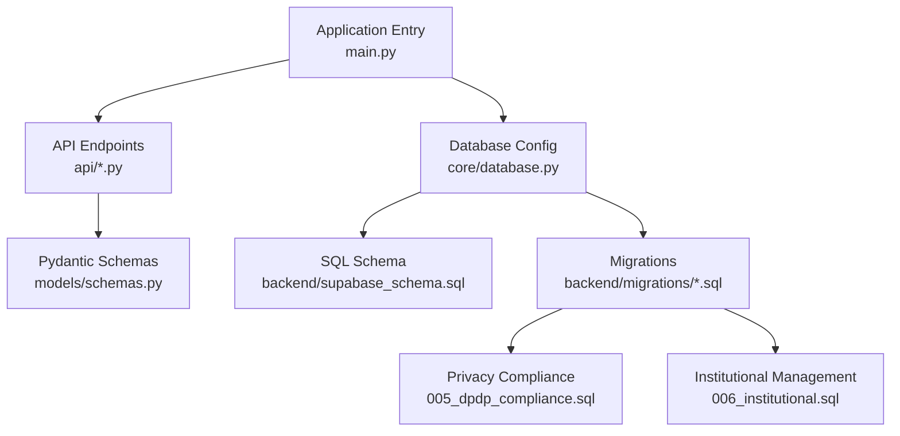
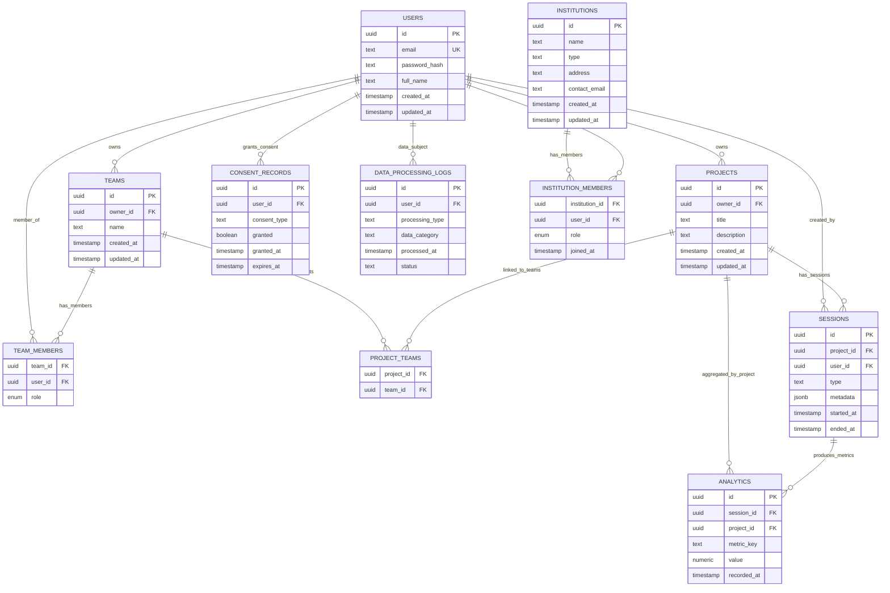
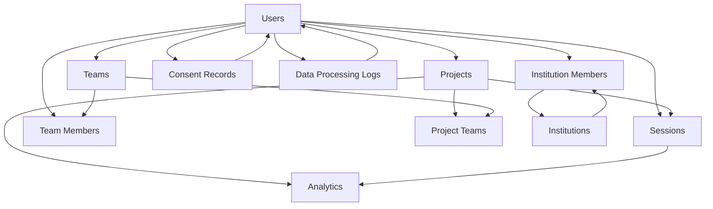

# Database Schema & Models

<cite>
**Referenced Files in This Document**
- [supabase_schema.sql](file://backend/supabase_schema.sql)
- [001_platform_enhancement.sql](file://backend/migrations/001_platform_enhancement.sql)
- [002_quality_upgrade.sql](file://backend/migrations/002_quality_upgrade.sql)
- [003_team_project_linking.sql](file://backend/migrations/003_team_project_linking.sql)
- [004_team_viva_voice.sql](file://backend/migrations/004_team_viva_voice.sql)
- [005_dpdp_compliance.sql](file://backend/migrations/005_dpdp_compliance.sql)
- [006_institutional.sql](file://backend/migrations/006_institutional.sql)
- [database.py](file://backend/core/database.py)
- [schemas.py](file://backend/models/schemas.py)
- [projects.py](file://backend/api/projects.py)
- [teams.py](file://backend/api/teams.py)
- [project_team.py](file://backend/api/project_team.py)
- [analytics.py](file://backend/api/analytics.py)
- [auth.py](file://backend/api/auth.py)
- [privacy.py](file://backend/api/privacy.py)
- [institution.py](file://backend/api/institution.py)
- [main.py](file://backend/main.py)
</cite>

## Update Summary
**Changes Made**
- Added comprehensive documentation for two new database migrations: 005_dpdp_compliance.sql and 006_institutional.sql
- Updated entity relationship diagrams to include privacy compliance tracking and institutional management tables
- Enhanced migration strategy section with new compliance and institutional migration files
- Added new sections covering consent records, data processing logs, and institutional profiles
- Updated dependency analysis to reflect new privacy and institutional relationships

## Table of Contents
1. [Introduction](#introduction)
2. [Project Structure](#project-structure)
3. [Core Components](#core-components)
4. [Architecture Overview](#architecture-overview)
5. [Detailed Component Analysis](#detailed-component-analysis)
6. [Privacy Compliance & Institutional Management](#privacy-compliance--institutional-management)
7. [Dependency Analysis](#dependency-analysis)
8. [Performance Considerations](#performance-considerations)
9. [Troubleshooting Guide](#troubleshooting-guide)
10. [Conclusion](#conclusion)
11. [Appendices](#appendices)

## Introduction
This document provides comprehensive data model documentation for the Horux platform database schema. It covers entity relationships, field definitions, data types, constraints, primary and foreign key relationships, indexes, triggers, migration strategy, version control practices, rollback procedures, validation rules, business logic constraints, referential integrity policies, query patterns, common joins, performance considerations for large datasets, sample queries, data access patterns, and ORM usage examples with SQLAlchemy models.

The schema is defined using SQL files under the backend directory and consumed by the FastAPI application via a database configuration module. The migrations are organized as numbered SQL scripts to evolve the schema over time, now including privacy compliance tracking and institutional relationship management capabilities.

## Project Structure
The database-related artifacts relevant to this documentation are located under the backend directory:
- Schema definition: supabase_schema.sql
- Migrations: 001_platform_enhancement.sql, 002_quality_upgrade.sql, 003_team_project_linking.sql, 004_team_viva_voice.sql, 005_dpdp_compliance.sql, 006_institutional.sql
- Database configuration: core/database.py
- Pydantic schemas (models): models/schemas.py
- API endpoints that interact with the schema: api/projects.py, api/teams.py, api/project_team.py, api/analytics.py, api/auth.py, api/privacy.py, api/institution.py
- Application entry point: main.py

**Diagram sources**
- [main.py](file://backend/main.py)
- [database.py](file://backend/core/database.py)
- [supabase_schema.sql](file://backend/supabase_schema.sql)
- [001_platform_enhancement.sql](file://backend/migrations/001_platform_enhancement.sql)
- [002_quality_upgrade.sql](file://backend/migrations/002_quality_upgrade.sql)
- [003_team_project_linking.sql](file://backend/migrations/003_team_project_linking.sql)
- [004_team_viva_voice.sql](file://backend/migrations/004_team_viva_voice.sql)
- [005_dpdp_compliance.sql](file://backend/migrations/005_dpdp_compliance.sql)
- [006_institutional.sql](file://backend/migrations/006_institutional.sql)
- [schemas.py](file://backend/models/schemas.py)
- [projects.py](file://backend/api/projects.py)
- [teams.py](file://backend/api/teams.py)
- [project_team.py](file://backend/api/project_team.py)
- [analytics.py](file://backend/api/analytics.py)
- [auth.py](file://backend/api/auth.py)
- [privacy.py](file://backend/api/privacy.py)
- [institution.py](file://backend/api/institution.py)

**Section sources**
- [supabase_schema.sql](file://backend/supabase_schema.sql)
- [001_platform_enhancement.sql](file://backend/migrations/001_platform_enhancement.sql)
- [002_quality_upgrade.sql](file://backend/migrations/002_quality_upgrade.sql)
- [003_team_project_linking.sql](file://backend/migrations/003_team_project_linking.sql)
- [004_team_viva_voice.sql](file://backend/migrations/004_team_viva_voice.sql)
- [005_dpdp_compliance.sql](file://backend/migrations/005_dpdp_compliance.sql)
- [006_institutional.sql](file://backend/migrations/006_institutional.sql)
- [database.py](file://backend/core/database.py)
- [schemas.py](file://backend/models/schemas.py)
- [projects.py](file://backend/api/projects.py)
- [teams.py](file://backend/api/teams.py)
- [project_team.py](file://backend/api/project_team.py)
- [analytics.py](file://backend/api/analytics.py)
- [auth.py](file://backend/api/auth.py)
- [privacy.py](file://backend/api/privacy.py)
- [institution.py](file://backend/api/institution.py)
- [main.py](file://backend/main.py)

## Core Components
The core data model components include:
- Users: identity and authentication information
- Projects: project entities and metadata
- Teams: team entities and membership
- Sessions: live or recorded sessions associated with projects and users
- Analytics: metrics and analytics data tied to sessions, projects, and teams
- Privacy Compliance: consent records and data processing logs for regulatory compliance
- Institutional Management: institutional profiles and relationships for organizational structure

These components are modeled through SQL tables and enforced via constraints, indexes, and triggers. Pydantic schemas provide request/response validation at the API layer.

Key responsibilities:
- Users: manage user accounts and roles
- Projects: encapsulate project lifecycle and ownership
- Teams: group users and link to projects
- Sessions: capture session events and outcomes
- Analytics: aggregate metrics for reporting and insights
- Privacy Compliance: track consent records and data processing activities
- Institutional Management: maintain institutional profiles and relationships

**Section sources**
- [supabase_schema.sql](file://backend/supabase_schema.sql)
- [005_dpdp_compliance.sql](file://backend/migrations/005_dpdp_compliance.sql)
- [006_institutional.sql](file://backend/migrations/006_institutional.sql)
- [schemas.py](file://backend/models/schemas.py)

## Architecture Overview
The database architecture follows a relational model with clear separation between core entities and their relationships. Indexes optimize read-heavy operations such as listing projects per team or querying analytics by date ranges. Triggers enforce data integrity and maintain derived fields where necessary. The recent additions enhance privacy compliance tracking and institutional relationship management.

**Diagram sources**
- [supabase_schema.sql](file://backend/supabase_schema.sql)
- [005_dpdp_compliance.sql](file://backend/migrations/005_dpdp_compliance.sql)
- [006_institutional.sql](file://backend/migrations/006_institutional.sql)

## Detailed Component Analysis

### Users
- Purpose: Represents authenticated users with profile attributes.
- Key fields:
  - id: Primary key, unique identifier
  - email: Unique email address
  - password_hash: Secure hash for authentication
  - full_name: Display name
  - created_at, updated_at: Timestamps
- Constraints:
  - Primary key on id
  - Unique constraint on email
- Indexes:
  - Email index for fast lookups during authentication
- Relationships:
  - One-to-many with Projects (owner)
  - One-to-many with Teams (owner)
  - Many-to-many with Teams via Team Members
  - One-to-many with Sessions (creator)
  - One-to-many with Consent Records (consent granter)
  - One-to-many with Data Processing Logs (data subject)
  - Many-to-many with Institutions via Institution Members

Validation rules:
- Email must be valid format
- Password hash must not be empty
- Full name optional but validated if present

Business logic constraints:
- User deletion cascades to dependent records based on referential integrity policy

Sample query patterns:
- Find user by email
- List all projects owned by a user
- Get all consent records for a user
- Find institutional memberships for a user

ORM usage example (SQLAlchemy model outline):
- Define a User model with mapped columns corresponding to table fields
- Use relationship attributes for Projects, Teams, Sessions, ConsentRecords, DataProcessingLogs, Institutions

**Section sources**
- [supabase_schema.sql](file://backend/supabase_schema.sql)
- [005_dpdp_compliance.sql](file://backend/migrations/005_dpdp_compliance.sql)
- [006_institutional.sql](file://backend/migrations/006_institutional.sql)
- [auth.py](file://backend/api/auth.py)

### Projects
- Purpose: Encapsulates project entities with ownership and metadata.
- Key fields:
  - id: Primary key
  - owner_id: Foreign key to Users
  - title, description: Textual metadata
  - created_at, updated_at: Timestamps
- Constraints:
  - Primary key on id
  - Foreign key to Users(owner_id)
- Indexes:
  - Owner_id index for efficient filtering by owner
- Relationships:
  - Many-to-one with Users (owner)
  - Many-to-many with Teams via Project Teams
  - One-to-many with Sessions
  - One-to-many with Analytics (aggregation)

Validation rules:
- Title required and non-empty
- Description optional but validated if provided

Business logic constraints:
- Project cannot be deleted if it has active sessions unless cascade policy allows

Sample query patterns:
- List projects by owner
- Join with teams to find linked teams

ORM usage example (SQLAlchemy model outline):
- Define a Project model with mapped columns
- Use relationship attributes for Owner, Teams, Sessions, Analytics

**Section sources**
- [supabase_schema.sql](file://backend/supabase_schema.sql)
- [projects.py](file://backend/api/projects.py)

### Teams
- Purpose: Groups users and links to projects.
- Key fields:
  - id: Primary key
  - owner_id: Foreign key to Users
  - name: Team name
  - created_at, updated_at: Timestamps
- Constraints:
  - Primary key on id
  - Foreign key to Users(owner_id)
- Indexes:
  - Owner_id index for filtering by owner
- Relationships:
  - Many-to-one with Users (owner)
  - Many-to-many with Projects via Project Teams
  - Many-to-many with Users via Team Members

Validation rules:
- Name required and non-empty

Business logic constraints:
- Team deletion cascades to members and project links based on policy

Sample query patterns:
- List teams by owner
- Find projects linked to a team

ORM usage example (SQLAlchemy model outline):
- Define a Team model with mapped columns
- Use relationship attributes for Owner, Projects, Members

**Section sources**
- [supabase_schema.sql](file://backend/supabase_schema.sql)
- [teams.py](file://backend/api/teams.py)

### Sessions
- Purpose: Captures session events and outcomes for projects and users.
- Key fields:
  - id: Primary key
  - project_id: Foreign key to Projects
  - user_id: Foreign key to Users
  - type: Session type discriminator
  - metadata: JSONB for flexible session data
  - started_at, ended_at: Timestamps
- Constraints:
  - Primary key on id
  - Foreign keys to Projects(project_id), Users(user_id)
- Indexes:
  - project_id and user_id indexes for filtering
  - started_at index for time-range queries
- Relationships:
  - Many-to-one with Projects
  - Many-to-one with Users
  - One-to-many with Analytics

Validation rules:
- Type must be a valid enum value
- Metadata must conform to expected schema

Business logic constraints:
- Session end time must be after start time

Sample query patterns:
- List sessions by project and date range
- Aggregate metrics by session

ORM usage example (SQLAlchemy model outline):
- Define a Session model with mapped columns
- Use relationship attributes for Project, User, Analytics

**Section sources**
- [supabase_schema.sql](file://backend/supabase_schema.sql)
- [analytics.py](file://backend/api/analytics.py)

### Analytics
- Purpose: Stores metrics and analytics data aggregated from sessions and projects.
- Key fields:
  - id: Primary key
  - session_id: Foreign key to Sessions
  - project_id: Foreign key to Projects
  - metric_key: Identifier for the metric
  - value: Numeric value
  - recorded_at: Timestamp
- Constraints:
  - Primary key on id
  - Foreign keys to Sessions(session_id), Projects(project_id)
- Indexes:
  - session_id and project_id indexes for aggregation queries
  - recorded_at index for time-series analysis
- Relationships:
  - Many-to-one with Sessions
  - Many-to-one with Projects

Validation rules:
- Metric key must be valid and recognized
- Value must be numeric and within acceptable range

Business logic constraints:
- Duplicate metric entries may be prevented via unique constraints or upsert logic

Sample query patterns:
- Aggregate metrics by project over time
- Retrieve session-specific metrics

ORM usage example (SQLAlchemy model outline):
- Define an Analytics model with mapped columns
- Use relationship attributes for Session, Project

**Section sources**
- [supabase_schema.sql](file://backend/supabase_schema.sql)
- [analytics.py](file://backend/api/analytics.py)

### Team Members and Project Teams (Linking Tables)
- Purpose: Implement many-to-many relationships between Teams and Users, and between Projects and Teams.
- Key fields:
  - Team Members: team_id, user_id, role
  - Project Teams: project_id, team_id
- Constraints:
  - Composite primary keys or unique constraints on pairs
  - Foreign keys to ensure referential integrity
- Indexes:
  - team_id and user_id indexes for membership queries
  - project_id and team_id indexes for linking queries

Validation rules:
- Role must be a valid enum value
- Links must reference existing entities

Business logic constraints:
- Prevent duplicate memberships or links

Sample query patterns:
- List members of a team
- Find teams linked to a project

ORM usage example (SQLAlchemy model outline):
- Define association models for TeamMembers and ProjectTeams
- Use relationship attributes to navigate associations

**Section sources**
- [supabase_schema.sql](file://backend/supabase_schema.sql)
- [project_team.py](file://backend/api/project_team.py)

## Privacy Compliance & Institutional Management

### Consent Records
- Purpose: Tracks user consent for data processing activities to ensure regulatory compliance.
- Key fields:
  - id: Primary key, unique identifier
  - user_id: Foreign key to Users (consent granter)
  - consent_type: Type of consent (e.g., data_processing, marketing, analytics)
  - granted: Boolean indicating whether consent was granted
  - granted_at: Timestamp when consent was given
  - expires_at: Optional timestamp for consent expiration
- Constraints:
  - Primary key on id
  - Foreign key to Users(user_id)
  - Not null constraints on essential fields
- Indexes:
  - user_id index for retrieving all consent records for a user
  - consent_type index for filtering by consent category
  - granted_at index for time-based consent queries

Validation rules:
- consent_type must be a valid predefined value
- granted must be boolean
- expires_at must be after granted_at if provided

Business logic constraints:
- Consent can be revoked but previous records must be preserved for audit trail
- Expired consents should trigger automatic notifications

Sample query patterns:
- Get all active consents for a user
- Find expired consents requiring renewal
- Audit consent history for a specific consent type

**Section sources**
- [005_dpdp_compliance.sql](file://backend/migrations/005_dpdp_compliance.sql)
- [privacy.py](file://backend/api/privacy.py)

### Data Processing Logs
- Purpose: Maintains detailed logs of data processing activities for audit and compliance purposes.
- Key fields:
  - id: Primary key, unique identifier
  - user_id: Foreign key to Users (data subject)
  - processing_type: Type of data processing operation
  - data_category: Category of data being processed
  - processed_at: Timestamp when processing occurred
  - status: Status of the processing operation
  - details: Additional context about the processing activity
- Constraints:
  - Primary key on id
  - Foreign key to Users(user_id)
  - Not null constraints on essential fields
- Indexes:
  - user_id index for retrieving all processing logs for a user
  - processed_at index for time-based queries
  - processing_type index for filtering by operation type

Validation rules:
- processing_type must be a valid predefined value
- data_category must be a recognized data classification
- status must be a valid processing state

Business logic constraints:
- All data processing must be logged for compliance
- Log retention must follow regulatory requirements

Sample query patterns:
- Get all processing logs for a user within a date range
- Audit data processing activities by type
- Generate compliance reports for data handling

**Section sources**
- [005_dpdp_compliance.sql](file://backend/migrations/005_dpdp_compliance.sql)
- [privacy.py](file://backend/api/privacy.py)

### Institutions
- Purpose: Manages institutional profiles and organizational structures.
- Key fields:
  - id: Primary key, unique identifier
  - name: Institution name
  - type: Institution type (e.g., university, company, research_lab)
  - address: Physical address
  - contact_email: Primary contact email
  - created_at, updated_at: Timestamps
- Constraints:
  - Primary key on id
  - Not null constraints on essential fields
- Indexes:
  - name index for searching institutions
  - type index for filtering by institution category

Validation rules:
- name must be non-empty and unique
- type must be a valid predefined value
- contact_email must be valid email format

Business logic constraints:
- Institution deletion requires handling of member relationships
- Contact information updates should trigger notifications

Sample query patterns:
- Search institutions by name or type
- Get all members of an institution
- Find institutions by contact email

**Section sources**
- [006_institutional.sql](file://backend/migrations/006_institutional.sql)
- [institution.py](file://backend/api/institution.py)

### Institution Members
- Purpose: Implements many-to-many relationships between Users and Institutions.
- Key fields:
  - institution_id: Foreign key to Institutions
  - user_id: Foreign key to Users
  - role: Member role within the institution
  - joined_at: Timestamp when membership began
- Constraints:
  - Composite primary key on (institution_id, user_id)
  - Foreign keys to ensure referential integrity
- Indexes:
  - institution_id index for finding all members of an institution
  - user_id index for finding all institutional memberships of a user

Validation rules:
- role must be a valid predefined value
- joined_at must be before current timestamp

Business logic constraints:
- Prevent duplicate memberships
- Handle membership termination gracefully

Sample query patterns:
- List all members of an institution
- Find all institutions a user belongs to
- Get member details with role information

**Section sources**
- [006_institutional.sql](file://backend/migrations/006_institutional.sql)
- [institution.py](file://backend/api/institution.py)

## Dependency Analysis
The database schema exhibits clear dependency chains with enhanced privacy and institutional relationships:
- Users are referenced by Projects, Teams, Sessions, Team Members, Consent Records, Data Processing Logs, and Institution Members
- Projects are referenced by Sessions, Analytics, and Project Teams
- Teams are referenced by Team Members and Project Teams
- Sessions are referenced by Analytics
- Institutions are referenced by Institution Members

**Diagram sources**
- [supabase_schema.sql](file://backend/supabase_schema.sql)
- [005_dpdp_compliance.sql](file://backend/migrations/005_dpdp_compliance.sql)
- [006_institutional.sql](file://backend/migrations/006_institutional.sql)

**Section sources**
- [supabase_schema.sql](file://backend/supabase_schema.sql)
- [005_dpdp_compliance.sql](file://backend/migrations/005_dpdp_compliance.sql)
- [006_institutional.sql](file://backend/migrations/006_institutional.sql)

## Performance Considerations
- Indexing strategy:
  - Create indexes on frequently filtered columns (email, owner_id, project_id, user_id, started_at, recorded_at)
  - Add indexes for privacy compliance queries (user_id, consent_type, processed_at)
  - Optimize institutional queries with name and type indexes
  - Composite indexes for common join patterns (e.g., project_id + started_at for session queries)
- Query optimization:
  - Use selective WHERE clauses to reduce result sets
  - Avoid SELECT *; specify only needed columns
  - Leverage pagination for large result sets
  - Use appropriate JOIN strategies for complex queries involving privacy and institutional data
- Data volume management:
  - Partition large tables by time (e.g., Analytics by month, Data Processing Logs by quarter)
  - Archive old sessions and analytics data
  - Implement log rotation for data processing logs
  - Consider partitioning consent records by expiration date
- Concurrency:
  - Use transactions for multi-step writes to maintain consistency
  - Avoid long-running transactions that lock resources
  - Implement proper locking mechanisms for consent updates

## Troubleshooting Guide
Common issues and resolutions:
- Constraint violations:
  - Check foreign key references before inserts/updates
  - Validate input data against Pydantic schemas
  - Ensure consent records have valid consent types
  - Verify institutional member roles are properly set
- Performance bottlenecks:
  - Analyze slow queries with EXPLAIN plans
  - Add missing indexes or refine existing ones
  - Monitor privacy compliance query performance
  - Optimize institutional relationship queries
- Migration failures:
  - Review migration scripts for syntax errors
  - Ensure dependencies are applied in correct order
  - Test privacy compliance migrations thoroughly
  - Validate institutional data integrity after migration
- Privacy compliance issues:
  - Audit consent records for completeness
  - Verify data processing logs are accurate
  - Check consent expiration handling
  - Ensure GDPR/regulatory compliance requirements are met

**Section sources**
- [database.py](file://backend/core/database.py)
- [schemas.py](file://backend/models/schemas.py)
- [privacy.py](file://backend/api/privacy.py)
- [institution.py](file://backend/api/institution.py)

## Conclusion
The Horux platform database schema is designed with clear entity relationships, robust constraints, and performance-oriented indexing. The recent additions of privacy compliance tracking and institutional relationship management enhance the platform's ability to handle regulatory requirements and organizational structures. Migrations provide a structured approach to evolving the schema, while Pydantic schemas ensure data validation at the API boundary. Following the recommended query patterns and performance guidelines will help maintain scalability and reliability as the dataset grows, particularly with the increased complexity of privacy and institutional data management.

## Appendices

### Migration Strategy
- Version control:
  - Each migration is a numbered SQL file to ensure ordered execution
  - Maintain a migration history log to track changes
  - New migrations include privacy compliance (005_dpdp_compliance.sql) and institutional management (006_institutional.sql)
- Rollback procedures:
  - Prepare reverse migration scripts for each forward migration
  - Test rollbacks in staging environments before production deployment
  - Special attention to privacy compliance data preservation during rollbacks
  - Ensure institutional data integrity is maintained during rollback operations
- Execution:
  - Apply migrations in sequence using a migration runner
  - Verify schema state after each migration
  - Validate privacy compliance tables and constraints
  - Test institutional relationship functionality

**Section sources**
- [001_platform_enhancement.sql](file://backend/migrations/001_platform_enhancement.sql)
- [002_quality_upgrade.sql](file://backend/migrations/002_quality_upgrade.sql)
- [003_team_project_linking.sql](file://backend/migrations/003_team_project_linking.sql)
- [004_team_viva_voice.sql](file://backend/migrations/004_team_viva_voice.sql)
- [005_dpdp_compliance.sql](file://backend/migrations/005_dpdp_compliance.sql)
- [006_institutional.sql](file://backend/migrations/006_institutional.sql)

### Sample Queries
- Find user by email:
  - SELECT * FROM users WHERE email = 'user@example.com'
- List projects by owner:
  - SELECT * FROM projects WHERE owner_id = 'uuid'
- Get sessions for a project in a date range:
  - SELECT * FROM sessions WHERE project_id = 'uuid' AND started_at BETWEEN 'start' AND 'end'
- Aggregate analytics by project:
  - SELECT project_id, SUM(value) FROM analytics GROUP BY project_id
- Get active consent records for a user:
  - SELECT * FROM consent_records WHERE user_id = 'uuid' AND granted = true AND (expires_at IS NULL OR expires_at > NOW())
- Find data processing logs for a user:
  - SELECT * FROM data_processing_logs WHERE user_id = 'uuid' ORDER BY processed_at DESC
- List institution members:
  - SELECT u.*, im.role, im.joined_at FROM users u JOIN institution_members im ON u.id = im.user_id WHERE im.institution_id = 'uuid'
- Get institutional memberships for a user:
  - SELECT i.*, im.role, im.joined_at FROM institutions i JOIN institution_members im ON i.id = im.institution_id WHERE im.user_id = 'uuid'

**Section sources**
- [supabase_schema.sql](file://backend/supabase_schema.sql)
- [005_dpdp_compliance.sql](file://backend/migrations/005_dpdp_compliance.sql)
- [006_institutional.sql](file://backend/migrations/006_institutional.sql)

### ORM Usage Examples (SQLAlchemy)
- Define models mapping to tables
- Use relationship attributes to navigate associations
- Perform CRUD operations with session management
- Execute complex queries with joins and filters
- Implement privacy compliance queries with proper filtering
- Handle institutional relationship queries efficiently

**Section sources**
- [schemas.py](file://backend/models/schemas.py)