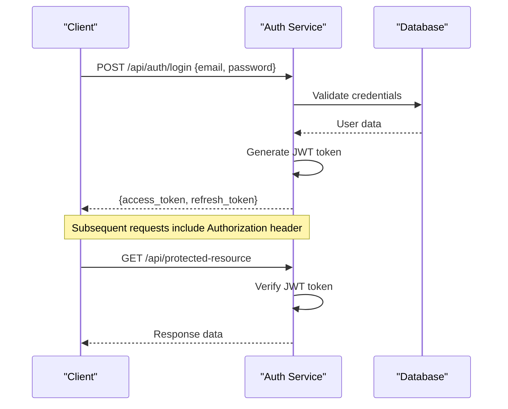
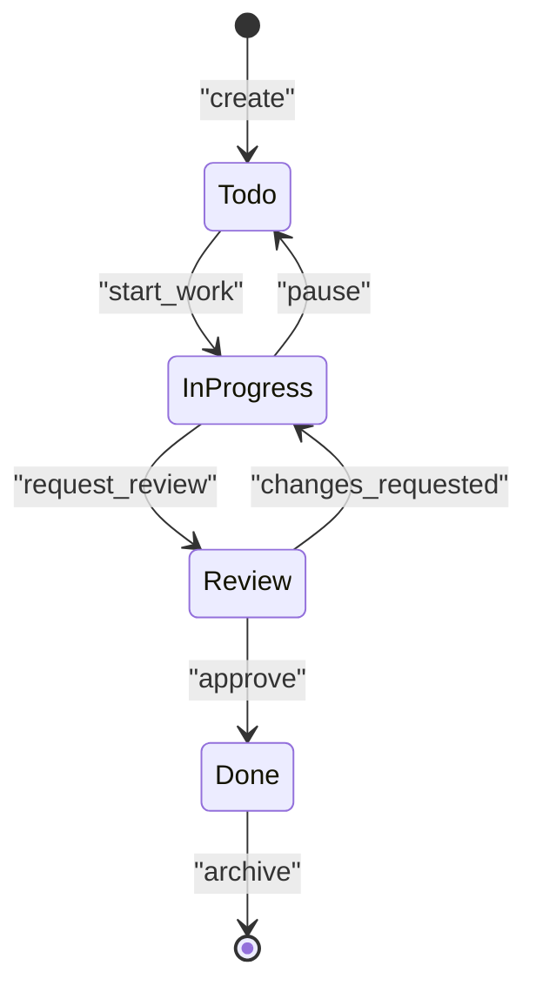
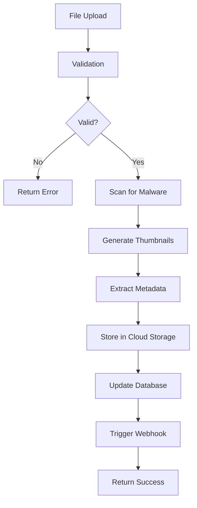
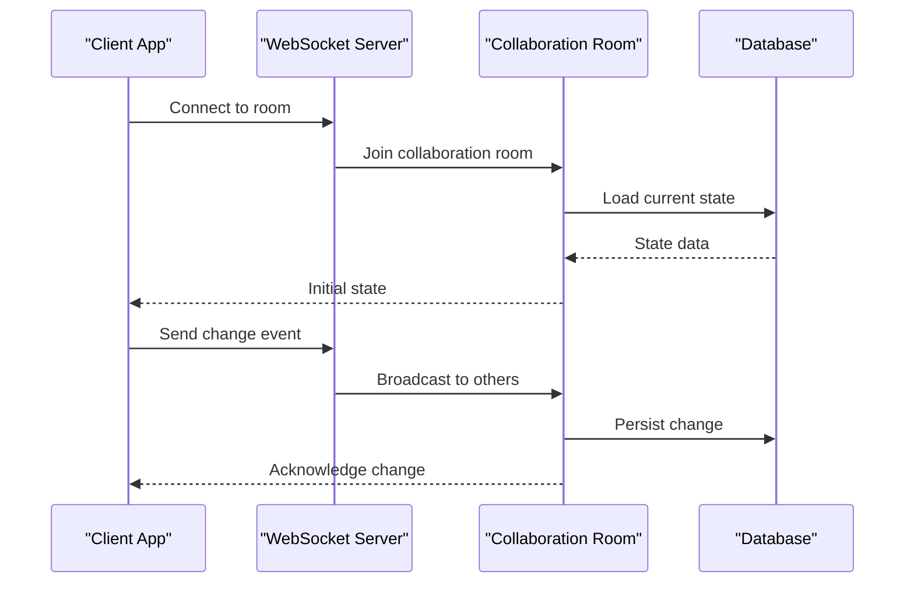

# Domain-Specific APIs

<cite>
**Referenced Files in This Document**
- [main.py](file://backend/main.py)
- [projects.py](file://backend/api/projects.py)
- [teams.py](file://backend/api/teams.py)
- [tasks.py](file://backend/api/tasks.py)
- [templates.py](file://backend/api/templates.py)
- [files.py](file://backend/api/files.py)
- [auth.py](file://backend/api/auth.py)
- [schemas.py](file://backend/models/schemas.py)
- [errors.py](file://backend/core/errors.py)
- [config.py](file://backend/core/config.py)
</cite>

## Table of Contents
1. [Introduction](#introduction)
2. [Authentication & Authorization](#authentication--authorization)
3. [Projects API](#projects-api)
4. [Teams API](#teams-api)
5. [Tasks API](#tasks-api)
6. [Templates API](#templates-api)
7. [Files API](#files-api)
8. [Error Handling](#error-handling)
9. [Real-time Features](#real-time-features)
10. [API Examples](#api-examples)
11. [Performance Considerations](#performance-considerations)
12. [Troubleshooting Guide](#troubleshooting-guide)

## Introduction

This document provides comprehensive API documentation for the domain-specific endpoints covering projects, teams, tasks, templates, and file management. The API follows RESTful principles and provides CRUD operations, bulk actions, filtering, pagination, and search capabilities across all domains.

The backend is built using FastAPI with Pydantic models for data validation and Supabase for database operations. Authentication is handled through JWT tokens with role-based access control.

## Authentication & Authorization

### Authentication Flow

All API endpoints require authentication except for public endpoints like registration and password reset. Authentication is handled via JWT tokens passed in the Authorization header.



### Authentication Endpoints

#### Login
- **Endpoint**: `POST /api/auth/login`
- **Description**: Authenticates user and returns JWT tokens
- **Request Body**:
  ```json
  {
    "email": "string",
    "password": "string"
  }
  ```
- **Response**: 
  ```json
  {
    "access_token": "string",
    "refresh_token": "string",
    "token_type": "bearer"
  }
  ```

#### Register
- **Endpoint**: `POST /api/auth/register`
- **Description**: Creates new user account
- **Request Body**:
  ```json
  {
    "email": "string",
    "password": "string",
    "name": "string"
  }
  ```

#### Refresh Token
- **Endpoint**: `POST /api/auth/refresh`
- **Description**: Refreshes expired access token
- **Request Body**:
  ```json
  {
    "refresh_token": "string"
  }
  ```

### Permission Levels

| Role | Description | Permissions |
|------|-------------|-------------|
| Admin | Full system access | All operations including user management |
| Project Manager | Project-level admin | Manage projects, teams, and tasks within assigned projects |
| Team Lead | Team-level admin | Manage team members and tasks within assigned teams |
| Member | Basic user | View and update own tasks, collaborate on projects |

**Section sources**
- [auth.py](file://backend/api/auth.py)
- [config.py](file://backend/core/config.py)

## Projects API

### Overview

The Projects API provides complete CRUD operations for managing projects, including team assignment, task management, and progress tracking.

### Endpoints

#### Create Project
- **Method**: `POST /api/projects`
- **Description**: Creates a new project
- **Authentication**: Required (Project Manager or Admin)
- **Request Body**:
  ```json
  {
    "name": "string (required)",
    "description": "string",
    "status": "enum: active|inactive|archived",
    "team_ids": ["uuid"],
    "start_date": "date",
    "end_date": "date"
  }
  ```
- **Response**: Project object with created metadata

#### Get Project
- **Method**: `GET /api/projects/{project_id}`
- **Description**: Retrieves project details by ID
- **Authentication**: Required
- **Path Parameters**:
  - `project_id`: UUID of the project
- **Response**: Project object with related teams and tasks

#### Update Project
- **Method**: `PUT /api/projects/{project_id}`
- **Description**: Updates project information
- **Authentication**: Required (Project Manager or Admin)
- **Request Body**: Partial project object (only fields to update)

#### Delete Project
- **Method**: `DELETE /api/projects/{project_id}`
- **Description**: Deletes a project and associated data
- **Authentication**: Required (Project Manager or Admin)

#### List Projects
- **Method**: `GET /api/projects`
- **Description**: Lists all accessible projects with filtering and pagination
- **Query Parameters**:
  - `page`: integer (default: 1)
  - `limit`: integer (default: 20, max: 100)
  - `status`: enum filter
  - `search`: string (searches name and description)
  - `sort_by`: string (name, created_at, status)
  - `sort_order`: enum (asc, desc)
- **Response**: Paginated list of projects

#### Bulk Operations
- **Method**: `PATCH /api/projects/bulk`
- **Description**: Performs bulk operations on multiple projects
- **Request Body**:
  ```json
  {
    "operations": [
      {
        "action": "update|delete|assign_team",
        "project_ids": ["uuid"],
        "data": {}
      }
    ]
  }
  ```

### Data Validation Rules

- **Name**: Required, 3-100 characters, alphanumeric with spaces
- **Status**: Must be one of predefined enum values
- **Dates**: End date must be after start date if both provided
- **Team IDs**: Must reference existing teams where user has permission

### Business Logic

- Projects can only be deleted if they have no active tasks
- Team assignments require user to have manager permissions
- Status changes trigger notifications to team members
- Archive operation soft-deletes project data

**Section sources**
- [projects.py](file://backend/api/projects.py)
- [schemas.py](file://backend/models/schemas.py)

## Teams API

### Overview

The Teams API manages team creation, member management, and team-project relationships.

### Endpoints

#### Create Team
- **Method**: `POST /api/teams`
- **Description**: Creates a new team
- **Authentication**: Required (Admin or Project Manager)
- **Request Body**:
  ```json
  {
    "name": "string (required)",
    "description": "string",
    "project_id": "uuid",
    "member_ids": ["uuid"]
  }
  ```

#### Get Team
- **Method**: `GET /api/teams/{team_id}`
- **Description**: Retrieves team details including members and projects
- **Authentication**: Required

#### Update Team
- **Method**: `PUT /api/teams/{team_id}`
- **Description**: Updates team information and membership
- **Authentication**: Required (Team Lead or higher)

#### Add Team Member
- **Method**: `POST /api/teams/{team_id}/members`
- **Description**: Adds a user to the team
- **Request Body**:
  ```json
  {
    "user_id": "uuid",
    "role": "enum: member|lead"
  }
  ```

#### Remove Team Member
- **Method**: `DELETE /api/teams/{team_id}/members/{user_id}`
- **Description**: Removes a user from the team

#### List Teams
- **Method**: `GET /api/teams`
- **Description**: Lists teams with filtering options
- **Query Parameters**:
  - `project_id`: Filter by project
  - `member_id`: Filter by team membership
  - `search`: Search team names
  - Pagination parameters (same as projects)

### Permission Model

- **Team Lead**: Can manage members, assign tasks, view analytics
- **Team Member**: Can view team info, update own tasks, collaborate
- **Project Manager**: Can create teams, assign leads, view all team data

**Section sources**
- [teams.py](file://backend/api/teams.py)
- [schemas.py](file://backend/models/schemas.py)

## Tasks API

### Overview

The Tasks API provides comprehensive task management including creation, assignment, status updates, and progress tracking.

### Endpoints

#### Create Task
- **Method**: `POST /api/tasks`
- **Description**: Creates a new task
- **Authentication**: Required
- **Request Body**:
  ```json
  {
    "title": "string (required)",
    "description": "string",
    "project_id": "uuid (required)",
    "team_id": "uuid",
    "assigned_to": "uuid",
    "priority": "enum: low|medium|high|urgent",
    "status": "enum: todo|in_progress|review|done",
    "due_date": "datetime",
    "tags": ["string"],
    "estimated_hours": number
  }
  ```

#### Get Task
- **Method**: `GET /api/tasks/{task_id}`
- **Description**: Retrieves task details with full context
- **Authentication**: Required

#### Update Task
- **Method**: `PUT /api/tasks/{task_id}`
- **Description**: Updates task properties
- **Authentication**: Required (assigned user or manager)

#### Delete Task
- **Method**: `DELETE /api/tasks/{task_id}`
- **Description**: Deletes a task permanently
- **Authentication**: Required (creator or manager)

#### List Tasks
- **Method**: `GET /api/tasks`
- **Description**: Lists tasks with advanced filtering
- **Query Parameters**:
  - `project_id`: Filter by project
  - `team_id`: Filter by team
  - `assigned_to`: Filter by assignee
  - `status`: Filter by status
  - `priority`: Filter by priority
  - `due_date_before`: Date filter
  - `due_date_after`: Date filter
  - `search`: Search title and description
  - `tags`: Filter by tags
  - Pagination and sorting parameters

#### Bulk Task Operations
- **Method**: `PATCH /api/tasks/bulk`
- **Description**: Performs bulk operations on multiple tasks
- **Request Body**:
  ```json
  {
    "operations": [
      {
        "action": "update_status|reassign|update_priority",
        "task_ids": ["uuid"],
        "data": {
          "status": "enum",
          "assigned_to": "uuid",
          "priority": "enum"
        }
      }
    ]
  }
  ```

#### Reorder Tasks
- **Method**: `PUT /api/tasks/reorder`
- **Description**: Updates task order within a project/team
- **Request Body**:
  ```json
  {
    "task_order": [
      {"task_id": "uuid", "position": number}
    ]
  }
  ```

### Task Lifecycle



### Validation Rules

- **Title**: Required, 3-200 characters
- **Priority**: Must be valid enum value
- **Due Date**: Optional, future date if provided
- **Assigned To**: Must be team member if specified
- **Estimated Hours**: Positive number if provided

**Section sources**
- [tasks.py](file://backend/api/tasks.py)
- [schemas.py](file://backend/models/schemas.py)

## Templates API

### Overview

The Templates API manages reusable templates for projects, tasks, and workflows.

### Endpoints

#### Create Template
- **Method**: `POST /api/templates`
- **Description**: Creates a new template
- **Authentication**: Required (Admin or Project Manager)
- **Request Body**:
  ```json
  {
    "name": "string (required)",
    "type": "enum: project|task|workflow",
    "content": "object (required)",
    "description": "string",
    "is_public": boolean,
    "tags": ["string"]
  }
  ```

#### Get Template
- **Method**: `GET /api/templates/{template_id}`
- **Description**: Retrieves template details
- **Authentication**: Required

#### Update Template
- **Method**: `PUT /api/templates/{template_id}`
- **Description**: Updates template content
- **Authentication**: Required (template owner or admin)

#### Delete Template
- **Method**: `DELETE /api/templates/{template_id}`
- **Description**: Deletes a template
- **Authentication**: Required (template owner or admin)

#### List Templates
- **Method**: `GET /api/templates`
- **Description**: Lists available templates
- **Query Parameters**:
  - `type`: Filter by template type
  - `is_public`: Filter public templates
  - `search`: Search template names
  - `tags`: Filter by tags
  - Pagination parameters

#### Use Template
- **Method**: `POST /api/templates/{template_id}/use`
- **Description**: Creates instance from template
- **Request Body**:
  ```json
  {
    "target_type": "enum: project|task",
    "target_id": "uuid",
    "customizations": "object"
  }
  ```

### Template Structure

Templates support dynamic content with variable substitution:

```json
{
  "variables": ["project_name", "team_size", "deadline"],
  "content": {
    "title": "{{project_name}} Development",
    "description": "Development project for {{project_name}}",
    "tasks": [
      {
        "title": "Setup development environment",
        "estimated_hours": 8
      }
    ]
  }
}
```

**Section sources**
- [templates.py](file://backend/api/templates.py)
- [schemas.py](file://backend/models/schemas.py)

## Files API

### Overview

The Files API handles file uploads, downloads, and management for projects, tasks, and templates.

### Endpoints

#### Upload File
- **Method**: `POST /api/files/upload`
- **Description**: Uploads a file to the system
- **Authentication**: Required
- **Content-Type**: `multipart/form-data`
- **Form Fields**:
  - `file`: File object (required)
  - `project_id`: UUID (optional)
  - `task_id`: UUID (optional)
  - `metadata`: JSON string (optional)
- **Supported Formats**: Images, documents, code files, archives
- **Max Size**: 50MB per file

#### Download File
- **Method**: `GET /api/files/{file_id}`
- **Description**: Downloads a file
- **Authentication**: Required
- **Query Parameters**:
  - `download`: boolean (force download vs preview)

#### List Files
- **Method**: `GET /api/files`
- **Description**: Lists files with filtering
- **Query Parameters**:
  - `project_id`: Filter by project
  - `task_id`: Filter by task
  - `file_type`: Filter by extension
  - `uploaded_by`: Filter by uploader
  - `date_from`: Filter by upload date
  - `date_to`: Filter by upload date
  - Pagination parameters

#### Delete File
- **Method**: `DELETE /api/files/{file_id}`
- **Description**: Permanently deletes a file
- **Authentication**: Required (file owner or manager)

#### Update File Metadata
- **Method**: `PUT /api/files/{file_id}`
- **Description**: Updates file metadata
- **Request Body**:
  ```json
  {
    "name": "string",
    "description": "string",
    "tags": ["string"],
    "visibility": "enum: private|shared|public"
  }
  ```

### File Processing Pipeline



### Security Measures

- Virus scanning for all uploaded files
- Content-type validation
- File size limits enforced
- Access control based on project/team permissions
- Secure file URLs with expiration tokens

**Section sources**
- [files.py](file://backend/api/files.py)
- [schemas.py](file://backend/models/schemas.py)

## Error Handling

### Standard Error Response Format

All API errors follow a consistent format:

```json
{
  "error": {
    "code": "ERROR_CODE",
    "message": "Human-readable error message",
    "details": {},
    "timestamp": "ISO 8601 timestamp",
    "request_id": "unique_request_id"
  }
}
```

### HTTP Status Codes

| Code | Description | Common Scenarios |
|------|-------------|------------------|
| 200 | OK | Successful request |
| 201 | Created | Resource successfully created |
| 204 | No Content | Successful deletion |
| 400 | Bad Request | Invalid input data |
| 401 | Unauthorized | Missing or invalid authentication |
| 403 | Forbidden | Insufficient permissions |
| 404 | Not Found | Resource doesn't exist |
| 409 | Conflict | Resource already exists |
| 422 | Unprocessable Entity | Validation errors |
| 429 | Too Many Requests | Rate limit exceeded |
| 500 | Internal Server Error | Server-side error |

### Common Error Codes

- `VALIDATION_ERROR`: Input validation failed
- `AUTHENTICATION_FAILED`: Invalid credentials or token
- `PERMISSION_DENIED`: Insufficient permissions
- `RESOURCE_NOT_FOUND`: Requested resource doesn't exist
- `RATE_LIMIT_EXCEEDED`: Too many requests
- `FILE_UPLOAD_FAILED`: File processing error
- `DUPLICATE_ENTRY`: Resource already exists

### Error Response Examples

#### Validation Error
```json
{
  "error": {
    "code": "VALIDATION_ERROR",
    "message": "Invalid input data",
    "details": {
      "field_errors": [
        {
          "field": "email",
          "message": "Invalid email format"
        },
        {
          "field": "password",
          "message": "Password must be at least 8 characters"
        }
      ]
    }
  }
}
```

#### Permission Error
```json
{
  "error": {
    "code": "PERMISSION_DENIED",
    "message": "You don't have permission to perform this action",
    "details": {
      "required_role": "project_manager",
      "current_role": "member"
    }
  }
}
```

**Section sources**
- [errors.py](file://backend/core/errors.py)

## Real-time Features

### WebSocket Integration

The API supports real-time features through WebSocket connections for live collaboration and notifications.

### Live Collaboration



### Real-time Endpoints

#### Join Collaboration Room
- **Protocol**: WebSocket
- **Connection URL**: `wss://api.example.com/ws/collaboration/{room_id}`
- **Authentication**: JWT token in connection header
- **Events**:
  - `user_joined`: New user joined room
  - `user_left`: User left room
  - `state_update`: Real-time state changes
  - `cursor_move`: Cursor position updates

#### Live Notifications
- **Protocol**: WebSocket
- **Connection URL**: `wss://api.example.com/ws/notifications`
- **Events**:
  - `task_assigned`: New task assignment
  - `comment_added`: New comment notification
  - `deadline_approaching`: Deadline reminder
  - `mention_received`: @mention notification

### Event Types

| Event | Description | Payload |
|-------|-------------|---------|
| `task_updated` | Task status or details changed | `{task_id, changes, updated_by}` |
| `comment_added` | New comment on task/project | `{entity_id, comment, author}` |
| `file_uploaded` | New file added to entity | `{file_id, entity_id, uploader}` |
| `user_action` | User performed action | `{user_id, action, target}` |

**Section sources**
- [live.py](file://backend/api/live.py)
- [team_live.py](file://backend/api/team_live.py)

## API Examples

### Complete Workflow Example

#### 1. Authentication
```bash
curl -X POST https://api.example.com/api/auth/login \
  -H "Content-Type: application/json" \
  -d '{
    "email": "user@example.com",
    "password": "secure_password"
  }'
```

#### 2. Create Project
```bash
curl -X POST https://api.example.com/api/projects \
  -H "Authorization: Bearer YOUR_ACCESS_TOKEN" \
  -H "Content-Type: application/json" \
  -d '{
    "name": "Mobile App Development",
    "description": "iOS and Android app development project",
    "status": "active",
    "start_date": "2024-01-01",
    "end_date": "2024-06-30"
  }'
```

#### 3. Create Team
```bash
curl -X POST https://api.example.com/api/teams \
  -H "Authorization: Bearer YOUR_ACCESS_TOKEN" \
  -H "Content-Type: application/json" \
  -d '{
    "name": "Development Team",
    "description": "Core development team",
    "project_id": "PROJECT_UUID",
    "member_ids": ["USER_UUID_1", "USER_UUID_2"]
  }'
```

#### 4. Create Task
```bash
curl -X POST https://api.example.com/api/tasks \
  -H "Authorization: Bearer YOUR_ACCESS_TOKEN" \
  -H "Content-Type: application/json" \
  -d '{
    "title": "Implement User Authentication",
    "description": "Add login and registration functionality",
    "project_id": "PROJECT_UUID",
    "team_id": "TEAM_UUID",
    "assigned_to": "USER_UUID",
    "priority": "high",
    "status": "todo",
    "due_date": "2024-01-15T18:00:00Z",
    "tags": ["authentication", "security"],
    "estimated_hours": 16
  }'
```

#### 5. Upload File
```bash
curl -X POST https://api.example.com/api/files/upload \
  -H "Authorization: Bearer YOUR_ACCESS_TOKEN" \
  -F "file=@/path/to/document.pdf" \
  -F "project_id=PROJECT_UUID" \
  -F "metadata={\"category\": \"requirements\", \"version\": \"1.0\"}"
```

#### 6. List Tasks with Filtering
```bash
curl -X GET "https://api.example.com/api/tasks?project_id=PROJECT_UUID&status=todo&priority=high&page=1&limit=10" \
  -H "Authorization: Bearer YOUR_ACCESS_TOKEN"
```

#### 7. Update Task Status
```bash
curl -X PUT https://api.example.com/api/tasks/TASK_UUID \
  -H "Authorization: Bearer YOUR_ACCESS_TOKEN" \
  -H "Content-Type: application/json" \
  -d '{
    "status": "in_progress",
    "updated_at": "2024-01-10T10:00:00Z"
  }'
```

## Performance Considerations

### Pagination Strategy

All list endpoints implement cursor-based pagination for better performance:

- Default page size: 20 items
- Maximum page size: 100 items
- Cursor-based navigation for large datasets
- Total count included in response metadata

### Caching Layer

- Redis cache for frequently accessed data
- Cache invalidation on resource updates
- TTL-based cache expiration
- Cache warming for popular resources

### Database Optimization

- Indexed queries for common filters
- Connection pooling for database efficiency
- Query optimization for complex joins
- Read replicas for heavy read operations

### Rate Limiting

- 100 requests per minute for authenticated users
- 20 requests per minute for unauthenticated users
- Burst allowance for critical operations
- Custom limits per endpoint based on complexity

## Troubleshooting Guide

### Common Issues and Solutions

#### Authentication Problems
- **Issue**: 401 Unauthorized errors
- **Solution**: Check token expiration and refresh mechanism
- **Debug**: Enable detailed auth logging

#### Permission Denied Errors
- **Issue**: 403 Forbidden responses
- **Solution**: Verify user roles and resource ownership
- **Debug**: Check permission evaluation logs

#### File Upload Failures
- **Issue**: File upload timeouts or failures
- **Solution**: Check file size limits and network connectivity
- **Debug**: Enable file upload debugging mode

#### Performance Issues
- **Issue**: Slow API responses
- **Solution**: Monitor query performance and cache hit rates
- **Debug**: Enable slow query logging

### Debugging Tools

#### Request Logging
Enable detailed request logging for troubleshooting:
```python
app.add_middleware(RequestLoggingMiddleware)
```

#### Health Check Endpoint
Monitor API health and dependencies:
```bash
curl https://api.example.com/api/health
```

#### Metrics Collection
Access API performance metrics:
```bash
curl https://api.example.com/api/metrics
```

### Support Resources

- **API Documentation**: Available at `/api/docs`
- **Error Codes Reference**: See Error Handling section
- **Rate Limit Information**: Check response headers
- **Support Contact**: api-support@example.com