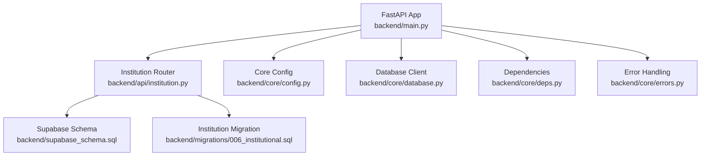
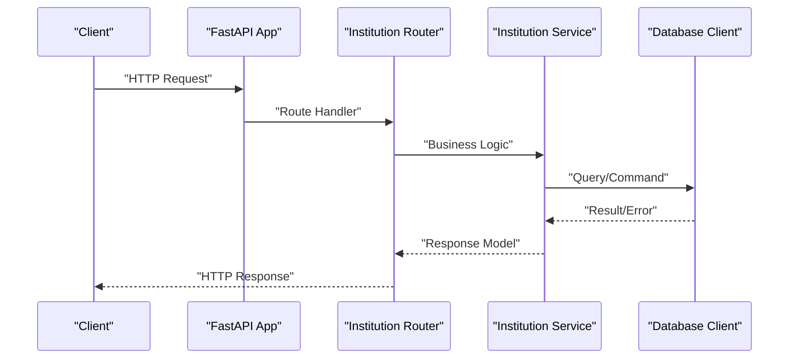
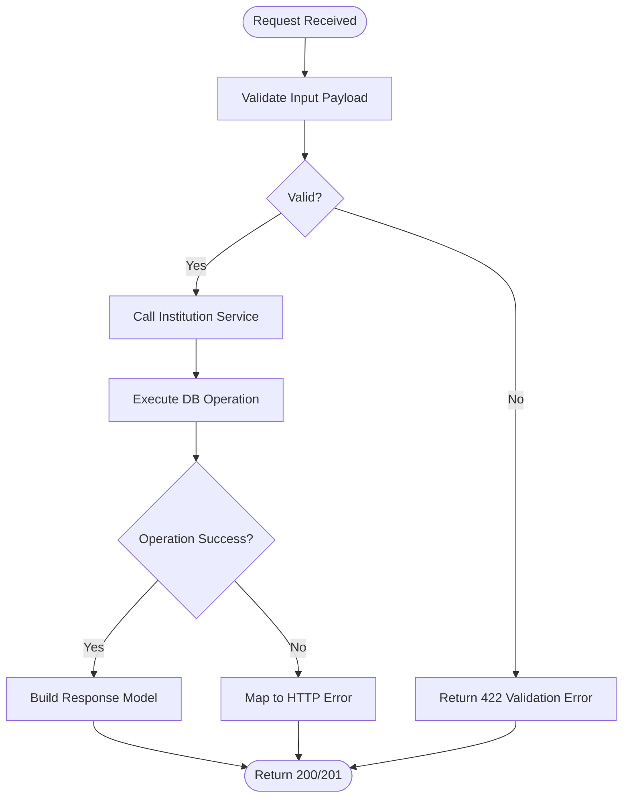
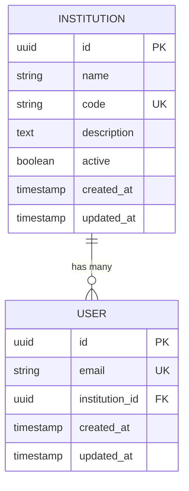
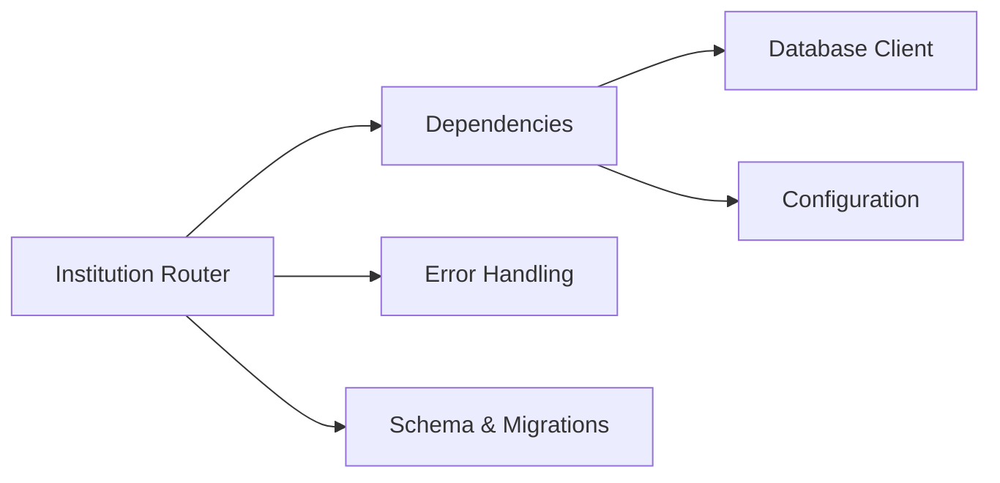

# Institutional Management API

<cite>
**Referenced Files in This Document**
- [main.py](file://backend/main.py)
- [institution.py](file://backend/api/institution.py)
- [config.py](file://backend/core/config.py)
- [database.py](file://backend/core/database.py)
- [deps.py](file://backend/core/deps.py)
- [errors.py](file://backend/core/errors.py)
- [supabase_schema.sql](file://backend/supabase_schema.sql)
- [006_institutional.sql](file://backend/migrations/006_institutional.sql)
</cite>

## Table of Contents
1. [Introduction](#introduction)
2. [Project Structure](#project-structure)
3. [Core Components](#core-components)
4. [Architecture Overview](#architecture-overview)
5. [Detailed Component Analysis](#detailed-component-analysis)
6. [Dependency Analysis](#dependency-analysis)
7. [Performance Considerations](#performance-considerations)
8. [Troubleshooting Guide](#troubleshooting-guide)
9. [Conclusion](#conclusion)

## Introduction
This document describes the Institutional Management API implemented in the backend. It focuses on how institutional entities are modeled, exposed via REST endpoints, and persisted through the database layer. The goal is to provide a clear understanding of the system architecture, data flows, and integration points for both technical and non-technical readers.

## Project Structure
The backend follows a modular FastAPI structure:
- API routes are organized by feature under backend/api.
- Core utilities (configuration, database, dependencies, errors) live under backend/core.
- Database schema and migrations are maintained under backend/migrations and backend/supabase_schema.sql.
- The application entry point initializes the FastAPI app and registers routers.

**Diagram sources**
- [main.py](file://backend/main.py)
- [institution.py](file://backend/api/institution.py)
- [config.py](file://backend/core/config.py)
- [database.py](file://backend/core/database.py)
- [deps.py](file://backend/core/deps.py)
- [errors.py](file://backend/core/errors.py)
- [supabase_schema.sql](file://backend/supabase_schema.sql)
- [006_institutional.sql](file://backend/migrations/006_institutional.sql)

**Section sources**
- [main.py](file://backend/main.py)
- [institution.py](file://backend/api/institution.py)
- [config.py](file://backend/core/config.py)
- [database.py](file://backend/core/database.py)
- [deps.py](file://backend/core/deps.py)
- [errors.py](file://backend/core/errors.py)
- [supabase_schema.sql](file://backend/supabase_schema.sql)
- [006_institutional.sql](file://backend/migrations/006_institutional.sql)

## Core Components
- Application Entry Point: Initializes the FastAPI application, configures middleware, and mounts routers.
- Institution API: Defines endpoints for institutional management operations such as listing, creating, updating, and deleting institutions.
- Configuration: Centralized settings for environment variables and runtime behavior.
- Database Layer: Provides connection and query helpers to interact with Supabase/PostgreSQL.
- Dependencies: Shared dependency injection for DB clients and services.
- Error Handling: Standardized error responses and exception mapping.

Key responsibilities:
- Route handlers validate inputs, call service or repository logic, and return structured JSON responses.
- Database interactions use typed models and migrations to ensure schema consistency.
- Errors are normalized to consistent HTTP status codes and payloads.

**Section sources**
- [main.py](file://backend/main.py)
- [institution.py](file://backend/api/institution.py)
- [config.py](file://backend/core/config.py)
- [database.py](file://backend/core/database.py)
- [deps.py](file://backend/core/deps.py)
- [errors.py](file://backend/core/errors.py)

## Architecture Overview
The Institutional Management API follows a layered architecture:
- Presentation Layer: FastAPI route handlers expose REST endpoints.
- Service/Repository Layer: Business logic and data access are encapsulated for reusability and testability.
- Data Layer: Supabase/PostgreSQL stores institutional records with enforced constraints from migrations.

**Diagram sources**
- [main.py](file://backend/main.py)
- [institution.py](file://backend/api/institution.py)
- [database.py](file://backend/core/database.py)

## Detailed Component Analysis

### Institution API Endpoints
The institution router exposes endpoints for managing institutional entities. Typical operations include:
- List institutions with optional filters and pagination.
- Create a new institution with validation.
- Update an existing institution by identifier.
- Delete an institution by identifier.

Input validation uses Pydantic models to enforce required fields, types, and constraints. Responses are standardized using response models.

**Diagram sources**
- [institution.py](file://backend/api/institution.py)
- [errors.py](file://backend/core/errors.py)

**Section sources**
- [institution.py](file://backend/api/institution.py)
- [errors.py](file://backend/core/errors.py)

### Database Models and Migrations
Institutional data is persisted using a relational schema defined in SQL migrations and the central schema file. Key aspects include:
- Primary keys and foreign key constraints for referential integrity.
- Indexes to optimize common queries (e.g., filtering by name or code).
- Timestamps for auditability and lifecycle tracking.

**Diagram sources**
- [supabase_schema.sql](file://backend/supabase_schema.sql)
- [006_institutional.sql](file://backend/migrations/006_institutional.sql)

**Section sources**
- [supabase_schema.sql](file://backend/supabase_schema.sql)
- [006_institutional.sql](file://backend/migrations/006_institutional.sql)

### Configuration and Environment
Configuration is centralized to support environment-specific settings:
- Database connection parameters (URL, credentials, pool size).
- Feature flags and toggles for institutional features.
- Logging levels and output formats.

Access patterns:
- Read-only configuration objects injected into routers and services.
- Validation at startup to fail fast on missing or invalid settings.

**Section sources**
- [config.py](file://backend/core/config.py)

### Dependency Injection and Services
Shared dependencies are provided via FastAPI’s dependency injection:
- Database client instances scoped per request.
- Service classes encapsulating business logic for institutions.
- Reusable validators and formatters.

Benefits:
- Decoupled components improve testability.
- Consistent resource management across endpoints.

**Section sources**
- [deps.py](file://backend/core/deps.py)
- [institution.py](file://backend/api/institution.py)

### Error Handling Strategy
Errors are normalized to consistent HTTP responses:
- Validation errors return 422 with detailed messages.
- Not found errors return 404 with entity identifiers.
- Internal server errors return 500 with sanitized messages.

Custom exceptions map to appropriate status codes and payloads.

**Section sources**
- [errors.py](file://backend/core/errors.py)

## Dependency Analysis
The Institutional Management API depends on core modules for configuration, database access, dependency injection, and error handling.

**Diagram sources**
- [institution.py](file://backend/api/institution.py)
- [deps.py](file://backend/core/deps.py)
- [errors.py](file://backend/core/errors.py)
- [database.py](file://backend/core/database.py)
- [config.py](file://backend/core/config.py)
- [supabase_schema.sql](file://backend/supabase_schema.sql)
- [006_institutional.sql](file://backend/migrations/006_institutional.sql)

**Section sources**
- [institution.py](file://backend/api/institution.py)
- [deps.py](file://backend/core/deps.py)
- [errors.py](file://backend/core/errors.py)
- [database.py](file://backend/core/database.py)
- [config.py](file://backend/core/config.py)
- [supabase_schema.sql](file://backend/supabase_schema.sql)
- [006_institutional.sql](file://backend/migrations/006_institutional.sql)

## Performance Considerations
- Use indexes on frequently queried columns (e.g., institution code, name).
- Apply pagination and filtering to avoid large result sets.
- Leverage connection pooling for database operations.
- Cache read-heavy endpoints where appropriate.
- Monitor slow queries and optimize with EXPLAIN ANALYZE.

[No sources needed since this section provides general guidance]

## Troubleshooting Guide
Common issues and resolutions:
- Validation failures: Check request payload against model constraints.
- Database connectivity: Verify environment configuration and network access.
- Missing entities: Ensure correct IDs and existence checks before updates/deletes.
- Error logs: Inspect structured logs for stack traces and context.

Use standardized error responses to identify root causes quickly.

**Section sources**
- [errors.py](file://backend/core/errors.py)
- [config.py](file://backend/core/config.py)
- [database.py](file://backend/core/database.py)

## Conclusion
The Institutional Management API provides a robust, layered implementation for managing institutional entities. With clear separation of concerns, standardized error handling, and a well-defined schema, it supports scalable and maintainable operations. Following the performance and troubleshooting recommendations will help ensure reliability and efficiency in production environments.