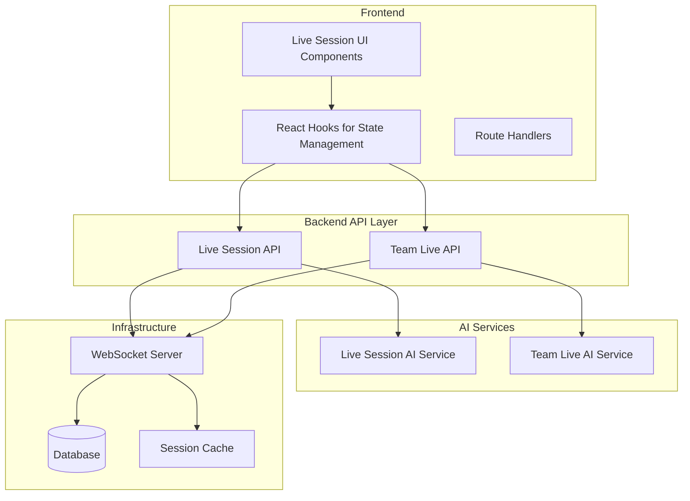
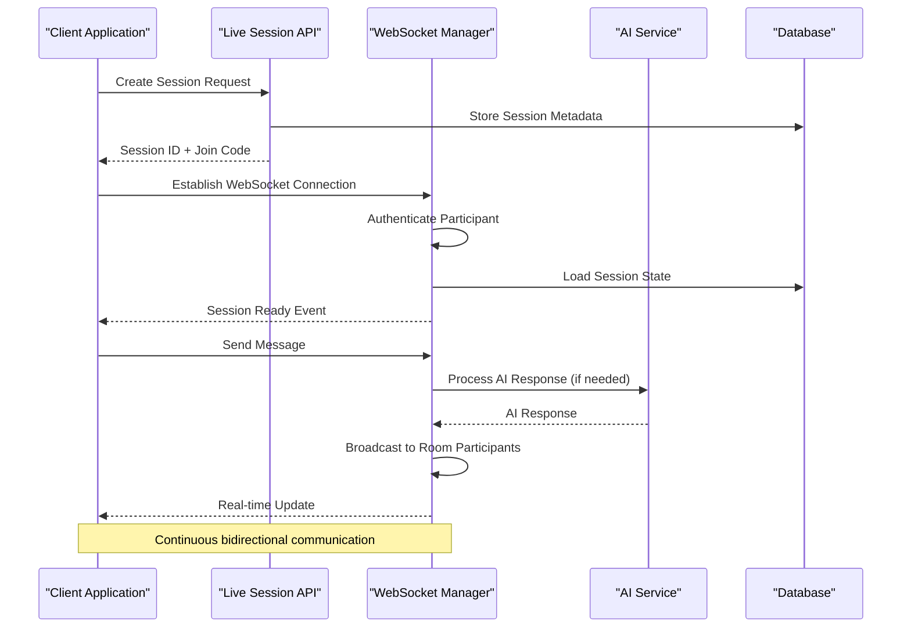
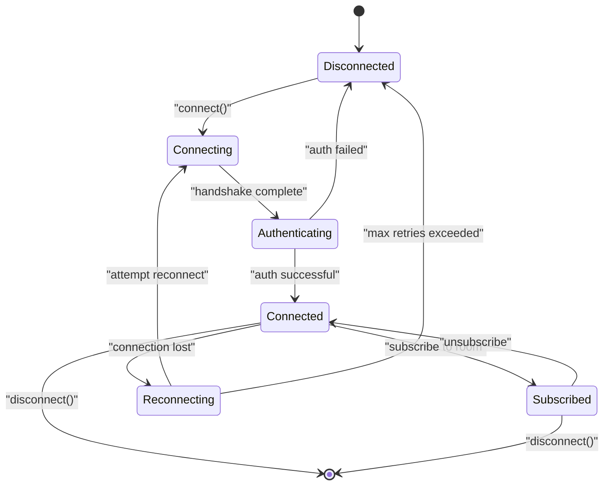
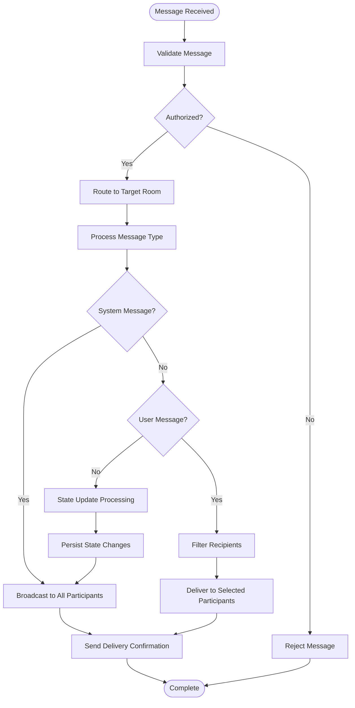
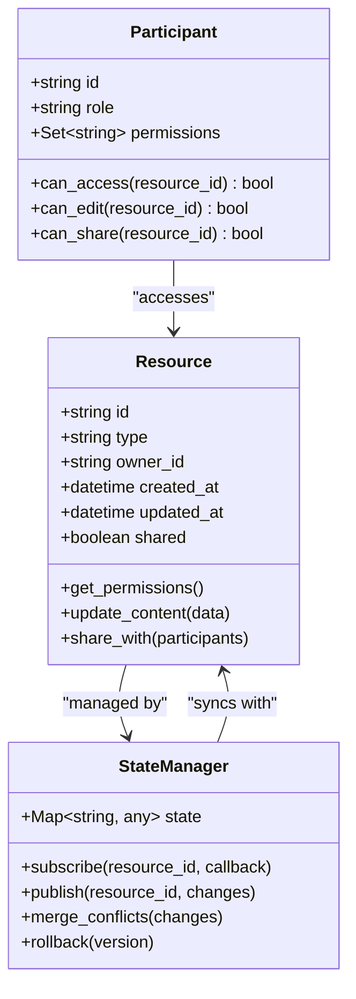
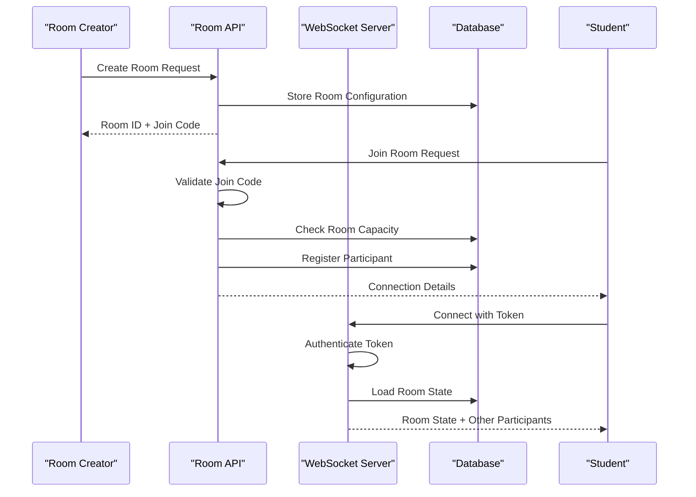
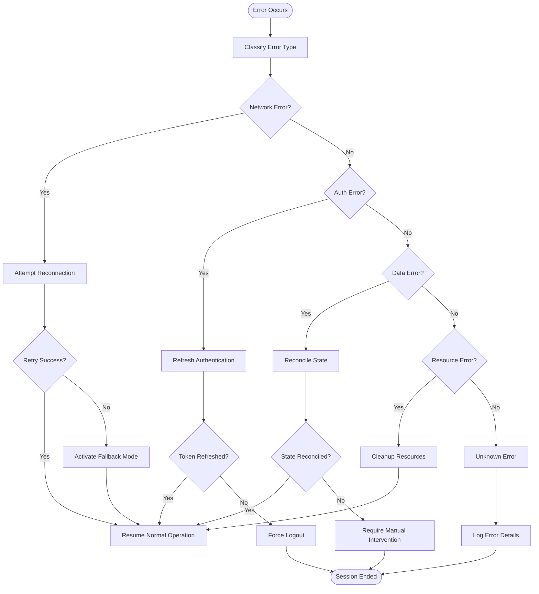
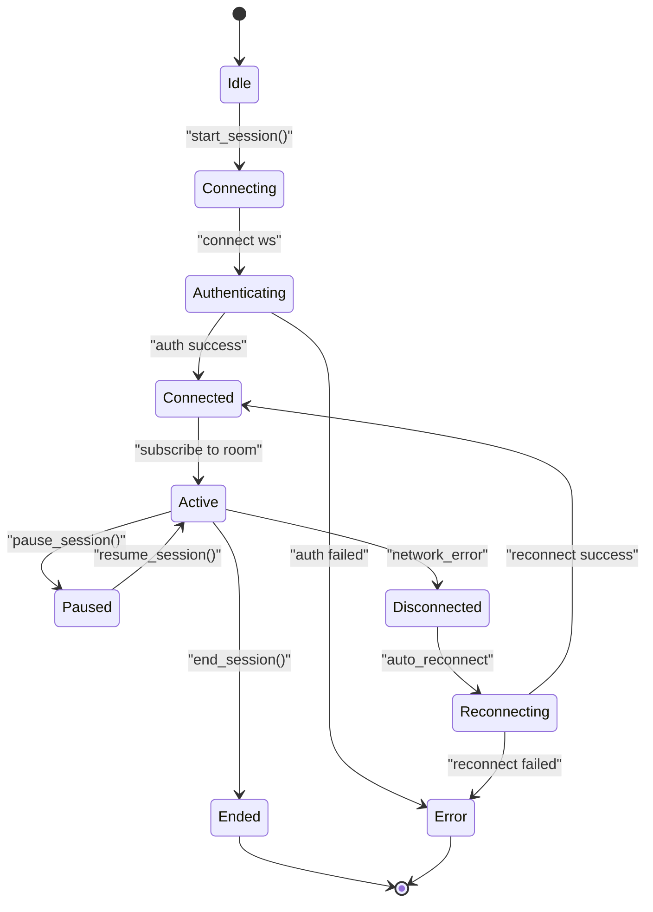

# Live Session & Real-Time APIs

<cite>
**Referenced Files in This Document**
- [backend/api/live.py](file://backend/api/live.py)
- [backend/api/team_live.py](file://backend/api/team_live.py)
- [backend/ai/live_service.py](file://backend/ai/live_service.py)
- [backend/ai/team_live_service.py](file://backend/ai/team_live_service.py)
- [src/lib/useLiveSession.ts](file://src/lib/useLiveSession.ts)
- [src/lib/useTeamViva.ts](file://src/lib/useTeamViva.ts)
- [src/components/live/live-session-runner.tsx](file://src/components/live/live-session-runner.tsx)
- [src/components/live/team-viva-room.tsx](file://src/components/live/team-viva-room.tsx)
- [src/routes/advanced/viva-team_.join.$joinCode.tsx](file://src/routes/advanced/viva-team_.join.$joinCode.tsx)
- [backend/core/config.py](file://backend/core/config.py)
- [backend/core/database.py](file://backend/core/database.py)
</cite>

## Table of Contents
1. [Introduction](#introduction)
2. [Project Structure](#project-structure)
3. [Core Components](#core-components)
4. [Architecture Overview](#architecture-overview)
5. [Detailed Component Analysis](#detailed-component-analysis)
6. [WebSocket Connection Management](#websocket-connection-management)
7. [Session Lifecycle Endpoints](#session-lifecycle-endpoints)
8. [Real-Time Message Broadcasting](#real-time-message-broadcasting)
9. [Participant Coordination](#participant-coordination)
10. [Resource Sharing and State Synchronization](#resource-sharing-and-state-synchronization)
11. [Room Creation and Joining Protocols](#room-creation-and-joining-protocols)
12. [Participant Permissions](#participant-permissions)
13. [Session Persistence](#session-persistence)
14. [AI-Powered Live Tutoring Features](#ai-powered-live-tutoring-features)
15. [Automated Assessment During Live Sessions](#automated-assessment-during-live-sessions)
16. [Real-Time Feedback Mechanisms](#real-time-feedback-mechanisms)
17. [Error Recovery and Connection Resilience](#error-recovery-and-connection-resilience)
18. [Scalability Considerations](#scalability-considerations)
19. [Client-Server Communication Patterns](#client-server-communication-patterns)
20. [Event Handling and State Management](#event-handling-and-state-management)
21. [Troubleshooting Guide](#troubleshooting-guide)
22. [Conclusion](#conclusion)

## Introduction

This document provides comprehensive documentation for the live session and real-time communication APIs that power collaborative learning features in the platform. The system enables multiple participants to engage in interactive learning sessions with real-time collaboration, AI-powered tutoring, automated assessment, and synchronized state management across clients.

The architecture supports concurrent sessions with robust WebSocket connections, ensuring reliable communication between clients and the server while maintaining data consistency and providing seamless user experiences.

## Project Structure

The live session functionality is distributed across backend API endpoints, AI services, and frontend components:

**Diagram sources**
- [backend/api/live.py:1-50](file://backend/api/live.py#L1-L50)
- [backend/api/team_live.py:1-50](file://backend/api/team_live.py#L1-L50)
- [backend/ai/live_service.py:1-50](file://backend/ai/live_service.py#L1-L50)
- [backend/ai/team_live_service.py:1-50](file://backend/ai/team_live_service.py#L1-L50)

**Section sources**
- [backend/api/live.py:1-100](file://backend/api/live.py#L1-L100)
- [backend/api/team_live.py:1-100](file://backend/api/team_live.py#L1-L100)
- [src/lib/useLiveSession.ts:1-100](file://src/lib/useLiveSession.ts#L1-L100)

## Core Components

The live session system consists of several key components working together to provide real-time collaboration:

### Backend API Layer
- **Live Session API**: Handles individual participant sessions and WebSocket connections
- **Team Live API**: Manages group sessions and team-based collaboration

### AI Services
- **Live Service**: Provides AI-powered tutoring and assessment capabilities
- **Team Live Service**: Coordinates AI interactions across multiple participants

### Frontend Integration
- **useLiveSession Hook**: Manages client-side WebSocket connections and state
- **useTeamViva Hook**: Handles team-specific real-time features
- **Live Session Components**: User interface for session management

**Section sources**
- [backend/api/live.py:1-150](file://backend/api/live.py#L1-L150)
- [backend/api/team_live.py:1-150](file://backend/api/team_live.py#L1-L150)
- [backend/ai/live_service.py:1-100](file://backend/ai/live_service.py#L1-L100)
- [backend/ai/team_live_service.py:1-100](file://backend/ai/team_live_service.py#L1-L100)
- [src/lib/useLiveSession.ts:1-200](file://src/lib/useLiveSession.ts#L1-L200)
- [src/lib/useTeamViva.ts:1-150](file://src/lib/useTeamViva.ts#L1-L150)

## Architecture Overview

The system follows a microservices architecture pattern with clear separation of concerns:

**Diagram sources**
- [backend/api/live.py:50-150](file://backend/api/live.py#L50-L150)
- [backend/ai/live_service.py:50-150](file://backend/ai/live_service.py#L50-L150)
- [src/lib/useLiveSession.ts:100-250](file://src/lib/useLiveSession.ts#L100-L250)

## Detailed Component Analysis

### Live Session API Component

The Live Session API manages individual participant sessions and coordinates with the WebSocket layer for real-time communication.

#### Key Responsibilities:
- Session creation and lifecycle management
- WebSocket connection handling
- Message routing and broadcasting
- Authentication and authorization
- Session state synchronization

#### Core Methods:
- `create_session()`: Initializes new live sessions
- `join_session()`: Handles participant joining requests
- `handle_message()`: Processes incoming messages
- `broadcast_to_room()`: Distributes messages to room participants
- `cleanup_session()`: Manages session termination and cleanup

**Section sources**
- [backend/api/live.py:1-200](file://backend/api/live.py#L1-L200)

### Team Live API Component

The Team Live API extends individual session functionality to support collaborative team environments with shared resources and coordinated activities.

#### Enhanced Features:
- Multi-participant coordination
- Shared resource management
- Team-wide messaging
- Collaborative state synchronization
- Role-based permissions

**Section sources**
- [backend/api/team_live.py:1-200](file://backend/api/team_live.py#L1-L200)

### AI Service Components

The AI services provide intelligent tutoring capabilities and automated assessment features during live sessions.

#### Live Service Features:
- Real-time question answering
- Adaptive learning paths
- Performance analysis
- Personalized feedback generation

#### Team Live Service Features:
- Group dynamics analysis
- Collaborative problem-solving assistance
- Peer learning facilitation
- Team performance metrics

**Section sources**
- [backend/ai/live_service.py:1-200](file://backend/ai/live_service.py#L1-L200)
- [backend/ai/team_live_service.py:1-200](file://backend/ai/team_live_service.py#L1-L200)

## WebSocket Connection Management

The WebSocket implementation ensures reliable, low-latency communication between clients and the server:

### Connection Lifecycle:
1. **Handshake**: Initial HTTP upgrade to WebSocket protocol
2. **Authentication**: Token validation and permission checks
3. **Room Assignment**: Participant joins appropriate session room
4. **State Sync**: Initial state synchronization upon connection
5. **Message Exchange**: Bidirectional real-time communication
6. **Graceful Disconnect**: Proper cleanup and state persistence

### Connection Management Features:
- Automatic reconnection with exponential backoff
- Heartbeat mechanism for connection health monitoring
- Message queuing during temporary disconnections
- Connection pooling for optimal resource utilization

**Diagram sources**
- [src/lib/useLiveSession.ts:150-300](file://src/lib/useLiveSession.ts#L150-L300)

**Section sources**
- [src/lib/useLiveSession.ts:1-300](file://src/lib/useLiveSession.ts#L1-L300)

## Session Lifecycle Endpoints

The API provides comprehensive endpoints for managing the complete lifecycle of live sessions:

### Session Management Endpoints:

| Endpoint | Method | Description | Parameters | Response |
|----------|--------|-------------|------------|----------|
| `/api/live/sessions` | POST | Create new live session | session_config | {session_id, join_code} |
| `/api/live/sessions/{id}` | GET | Get session details | session_id | session_metadata |
| `/api/live/sessions/{id}/join` | POST | Join existing session | session_id, participant_info | {ws_url, initial_state} |
| `/api/live/sessions/{id}/leave` | POST | Leave active session | session_id, participant_id | success_status |
| `/api/live/sessions/{id}/end` | DELETE | End session prematurely | session_id, reason | cleanup_status |

### Session States:
- **CREATED**: Session initialized but no participants
- **ACTIVE**: Session running with one or more participants
- **PAUSED**: Session temporarily suspended
- **ENDED**: Session completed normally
- **FAILED**: Session terminated due to error

**Section sources**
- [backend/api/live.py:100-300](file://backend/api/live.py#L100-L300)
- [backend/api/team_live.py:100-300](file://backend/api/team_live.py#L100-L300)

## Real-Time Message Broadcasting

The message broadcasting system ensures reliable delivery of real-time updates to all participants in a session:

### Message Types:
- **System Messages**: Session lifecycle events, participant joins/leaves
- **User Messages**: Chat, questions, and general communication
- **State Updates**: Resource changes, progress updates, collaborative edits
- **AI Responses**: Automated feedback and tutoring responses
- **Assessment Data**: Quiz results, performance metrics, and analytics

### Broadcasting Strategy:
- **Room-Based Routing**: Messages delivered only to relevant session participants
- **Priority Queuing**: Critical messages processed before informational updates
- **Delivery Confirmation**: Acknowledgment system for important messages
- **Offline Support**: Message history available after reconnection

**Diagram sources**
- [backend/api/live.py:200-400](file://backend/api/live.py#L200-L400)
- [backend/api/team_live.py:200-400](file://backend/api/team_live.py#L200-L400)

**Section sources**
- [backend/api/live.py:200-500](file://backend/api/live.py#L200-L500)
- [backend/api/team_live.py:200-500](file://backend/api/team_live.py#L200-L500)

## Participant Coordination

The system provides sophisticated participant coordination mechanisms for effective collaboration:

### Coordination Features:
- **Role Management**: Instructor, student, observer roles with specific permissions
- **Speaking Queue**: Managed turn-taking for verbal participation
- **Screen Sharing**: Controlled screen sharing with participant approval
- **Collaborative Whiteboard**: Real-time drawing and annotation sharing
- **Breakout Rooms**: Dynamic grouping for small group activities

### Permission System:
- **Granular Access Control**: Fine-grained permissions for different actions
- **Dynamic Role Assignment**: Runtime role changes based on context
- **Audit Logging**: Complete audit trail of permission changes
- **Conflict Resolution**: Automated resolution of permission conflicts

**Section sources**
- [backend/api/team_live.py:300-500](file://backend/api/team_live.py#L300-L500)

## Resource Sharing and State Synchronization

The platform enables seamless resource sharing and maintains consistent state across all connected clients:

### Resource Types:
- **Documents**: Shared documents with real-time editing capabilities
- **Media Files**: Images, videos, and audio files accessible to all participants
- **Code Snippets**: Collaborative code editing with syntax highlighting
- **Whiteboard Content**: Drawing, diagrams, and visual annotations
- **Quiz Questions**: Interactive assessments with immediate feedback

### State Synchronization:
- **Operational Transformation**: Conflict-free merging of concurrent edits
- **Version Control**: Change tracking and rollback capabilities
- **Optimistic Updates**: Immediate UI feedback with background sync
- **Conflict Resolution**: Automated and manual conflict resolution strategies

**Diagram sources**
- [backend/api/live.py:300-600](file://backend/api/live.py#L300-L600)
- [backend/api/team_live.py:300-600](file://backend/api/team_live.py#L300-L600)

**Section sources**
- [backend/api/live.py:300-700](file://backend/api/live.py#L300-L700)
- [backend/api/team_live.py:300-700](file://backend/api/team_live.py#L300-L700)

## Room Creation and Joining Protocols

The room system provides flexible session management with secure joining mechanisms:

### Room Creation Protocol:
1. **Validation**: Verify session configuration and capacity limits
2. **Initialization**: Create room metadata and default settings
3. **Token Generation**: Generate unique join codes and authentication tokens
4. **Notification**: Alert administrators of new room creation
5. **Resource Allocation**: Reserve system resources for the session

### Joining Protocol:
1. **Code Validation**: Verify join code authenticity and expiration
2. **Capacity Check**: Ensure room has available slots
3. **Authentication**: Validate participant credentials
4. **Permission Grant**: Assign appropriate permissions based on role
5. **State Sync**: Provide current room state to new participant

**Diagram sources**
- [backend/api/live.py:150-350](file://backend/api/live.py#L150-L350)
- [backend/api/team_live.py:150-350](file://backend/api/team_live.py#L150-L350)

**Section sources**
- [backend/api/live.py:150-400](file://backend/api/live.py#L150-L400)
- [backend/api/team_live.py:150-400](file://backend/api/team_live.py#L150-L400)

## Participant Permissions

The permission system provides granular control over participant actions and access levels:

### Permission Levels:
- **Owner**: Full control over session settings and participant management
- **Instructor**: Can manage content, moderate discussions, and assess participants
- **Student**: Can participate in activities, submit work, and interact with peers
- **Observer**: Read-only access to observe sessions without participating

### Permission Matrix:

| Action | Owner | Instructor | Student | Observer |
|--------|-------|------------|---------|----------|
| Create Session | ✓ | ✗ | ✗ | ✗ |
| Modify Settings | ✓ | ✓ | ✗ | ✗ |
| Share Resources | ✓ | ✓ | ✓ | ✗ |
| Edit Content | ✓ | ✓ | Limited | ✗ |
| Moderate Chat | ✓ | ✓ | ✗ | ✗ |
| Assess Participants | ✓ | ✓ | ✗ | ✗ |
| View Analytics | ✓ | ✓ | Partial | ✗ |

**Section sources**
- [backend/api/team_live.py:400-600](file://backend/api/team_live.py#L400-L600)

## Session Persistence

The system ensures data durability and recovery through comprehensive persistence mechanisms:

### Persistent Data:
- **Session Metadata**: Basic information about session configuration and participants
- **Activity Logs**: Complete audit trail of all session activities
- **Content Changes**: Versioned storage of shared resources and collaborative edits
- **Assessment Results**: Scores, feedback, and performance analytics
- **Chat History**: Complete conversation logs for review and analysis

### Recovery Strategies:
- **Automatic Backup**: Regular snapshots of critical session state
- **Crash Recovery**: Resume sessions from last known good state
- **Data Migration**: Schema evolution with backward compatibility
- **Archive Management**: Long-term storage of completed sessions

**Section sources**
- [backend/core/database.py:1-200](file://backend/core/database.py#L1-L200)

## AI-Powered Live Tutoring Features

The AI integration provides intelligent tutoring capabilities that enhance the learning experience:

### AI Capabilities:
- **Adaptive Questioning**: Dynamic difficulty adjustment based on participant performance
- **Personalized Feedback**: Context-aware suggestions and explanations
- **Knowledge Gap Detection**: Identification of areas needing additional support
- **Learning Path Optimization**: Customized progression through material
- **Multilingual Support**: AI assistance in multiple languages

### Implementation Features:
- **Real-time Processing**: Instant AI responses without session interruption
- **Context Awareness**: Understanding of ongoing discussion and activities
- **Confidence Scoring**: Reliability indicators for AI-generated content
- **Human Override**: Ability for instructors to modify or reject AI suggestions

**Section sources**
- [backend/ai/live_service.py:1-300](file://backend/ai/live_service.py#L1-L300)
- [backend/ai/team_live_service.py:1-300](file://backend/ai/team_live_service.py#L1-L300)

## Automated Assessment During Live Sessions

The assessment system provides continuous evaluation and feedback throughout live sessions:

### Assessment Types:
- **Formative Assessment**: Ongoing checks for understanding during activities
- **Summative Assessment**: Comprehensive evaluations at session milestones
- **Peer Assessment**: Structured peer review and feedback mechanisms
- **Self-Assessment**: Guided reflection and self-evaluation tools

### Real-time Features:
- **Instant Feedback**: Immediate response to quiz answers and exercises
- **Performance Analytics**: Live dashboards showing participant progress
- **Adaptive Difficulty**: Dynamic adjustment of challenge levels
- **Collaborative Problem Solving**: Group-based assessment scenarios

**Section sources**
- [backend/ai/live_service.py:200-400](file://backend/ai/live_service.py#L200-L400)

## Real-Time Feedback Mechanisms

The feedback system ensures participants receive timely and actionable guidance:

### Feedback Channels:
- **Visual Indicators**: Progress bars, completion markers, and status updates
- **Audio Cues**: Sound effects for achievements and notifications
- **Text Notifications**: Contextual messages and suggestions
- **Haptic Feedback**: Device-specific tactile responses (mobile)

### Feedback Types:
- **Corrective Feedback**: Error identification and correction guidance
- **Encouraging Feedback**: Positive reinforcement and motivation
- **Instructional Feedback**: Step-by-step guidance and hints
- **Analytical Feedback**: Performance insights and improvement suggestions

**Section sources**
- [backend/ai/live_service.py:300-500](file://backend/ai/live_service.py#L300-L500)

## Error Recovery and Connection Resilience

The system implements robust error handling and recovery mechanisms to ensure reliability:

### Error Categories:
- **Network Errors**: Connection failures, timeouts, and network interruptions
- **Authentication Errors**: Invalid tokens, expired sessions, and permission issues
- **Data Errors**: Corrupted messages, invalid states, and synchronization failures
- **Resource Errors**: Memory constraints, storage limitations, and capacity issues

### Recovery Strategies:
- **Automatic Retry**: Exponential backoff with jitter for transient failures
- **State Reconciliation**: Automatic synchronization after reconnection
- **Graceful Degradation**: Fallback modes when primary features are unavailable
- **User Notification**: Clear communication about errors and recovery status

**Diagram sources**
- [backend/core/errors.py:1-200](file://backend/core/errors.py#L1-L200)

**Section sources**
- [backend/core/errors.py:1-200](file://backend/core/errors.py#L1-L200)

## Scalability Considerations

The architecture is designed to handle high concurrency and scale horizontally:

### Scaling Strategies:
- **Horizontal Scaling**: Multiple server instances behind load balancer
- **Connection Pooling**: Efficient WebSocket connection management
- **Message Broadcasting**: Optimized fan-out for large participant groups
- **State Sharding**: Distributed state management across nodes
- **Caching Layer**: Redis-based caching for frequently accessed data

### Performance Metrics:
- **Concurrent Connections**: Support for thousands of simultaneous connections
- **Message Latency**: Sub-100ms latency for real-time communication
- **Memory Usage**: Optimized memory footprint per connection
- **CPU Utilization**: Efficient processing with minimal overhead
- **Storage Throughput**: High-throughput database operations

### Load Balancing:
- **Sticky Sessions**: WebSocket affinity for connection persistence
- **Health Checks**: Automatic removal of unhealthy instances
- **Auto-scaling**: Dynamic scaling based on demand patterns
- **Geographic Distribution**: Multi-region deployment for global users

**Section sources**
- [backend/core/config.py:1-100](file://backend/core/config.py#L1-L100)

## Client-Server Communication Patterns

The system implements efficient communication patterns for optimal performance:

### Request-Response Patterns:
- **RESTful APIs**: Standard HTTP endpoints for session management
- **GraphQL Queries**: Flexible data fetching for complex queries
- **Batch Operations**: Grouped requests for improved efficiency
- **Streaming Responses**: Real-time data streaming for live updates

### Event-Driven Patterns:
- **Publish-Subscribe**: Decoupled communication between components
- **Event Sourcing**: Immutable event log for state reconstruction
- **Command Pattern**: Encapsulated operations with undo/redo support
- **Observer Pattern**: Reactive updates to dependent components

### Message Formats:
- **JSON Payloads**: Standardized message structures
- **Binary Protocols**: Efficient serialization for large data transfers
- **Compression**: Optional compression for bandwidth optimization
- **Encryption**: End-to-end encryption for sensitive data

**Section sources**
- [src/lib/useLiveSession.ts:200-400](file://src/lib/useLiveSession.ts#L200-L400)

## Event Handling and State Management

The frontend implements sophisticated event handling and state management for seamless user experiences:

### Event Handling:
- **WebSocket Events**: Real-time message processing and reaction
- **Lifecycle Events**: Session start, pause, resume, and end events
- **User Actions**: Click, input, and interaction event handling
- **System Events**: Error, warning, and notification events

### State Management:
- **Local State**: Component-specific state with React hooks
- **Global State**: Application-wide state with context providers
- **Server State**: Cached server data with automatic synchronization
- **UI State**: Loading, error, and modal state management

**Diagram sources**
- [src/lib/useLiveSession.ts:300-500](file://src/lib/useLiveSession.ts#L300-L500)

**Section sources**
- [src/lib/useLiveSession.ts:200-500](file://src/lib/useLiveSession.ts#L200-L500)
- [src/lib/useTeamViva.ts:100-300](file://src/lib/useTeamViva.ts#L100-L300)

## Troubleshooting Guide

Common issues and their solutions for live session functionality:

### Connection Issues:
- **Symptom**: WebSocket connection fails
  - **Cause**: Firewall blocking WebSocket ports or invalid authentication
  - **Solution**: Check network configuration and verify authentication tokens
  
- **Symptom**: Frequent disconnections
  - **Cause**: Network instability or server overload
  - **Solution**: Implement retry logic and check server health endpoints

### Session Problems:
- **Symptom**: Participants cannot join sessions
  - **Cause**: Invalid join codes or session capacity reached
  - **Solution**: Verify join code format and check session limits

- **Symptom**: Real-time updates not appearing
  - **Cause**: Message routing issues or permission problems
  - **Solution**: Check room membership and message filtering rules

### Performance Issues:
- **Symptom**: Slow message delivery
  - **Cause**: Large payload sizes or excessive broadcasting
  - **Solution**: Optimize message size and implement selective broadcasting

- **Symptom**: High memory usage
  - **Cause**: Memory leaks or excessive state retention
  - **Solution**: Monitor memory usage and implement proper cleanup

**Section sources**
- [backend/core/errors.py:100-300](file://backend/core/errors.py#L100-L300)

## Conclusion

The live session and real-time communication system provides a comprehensive foundation for collaborative learning experiences. The architecture successfully balances real-time responsiveness with scalability, reliability, and maintainability.

Key strengths include:
- Robust WebSocket implementation with automatic reconnection
- Flexible permission system supporting various participant roles
- AI-powered tutoring capabilities integrated seamlessly
- Comprehensive error handling and recovery mechanisms
- Scalable architecture supporting concurrent sessions

Future enhancements could include:
- Advanced analytics and reporting capabilities
- Mobile-first responsive design improvements
- Enhanced accessibility features
- Integration with external learning management systems
- Advanced collaboration tools like video conferencing

The system demonstrates best practices in real-time application development and provides a solid foundation for educational technology platforms requiring sophisticated collaborative features.