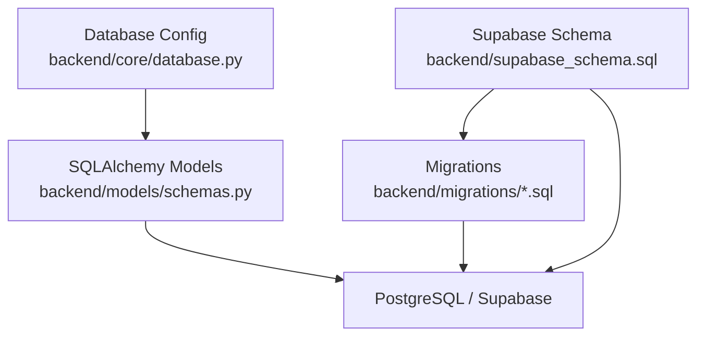
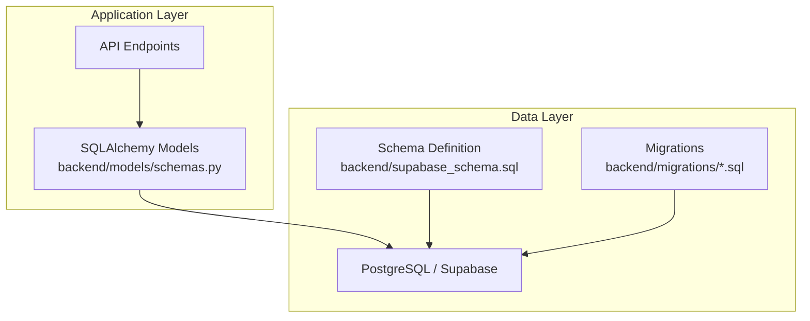
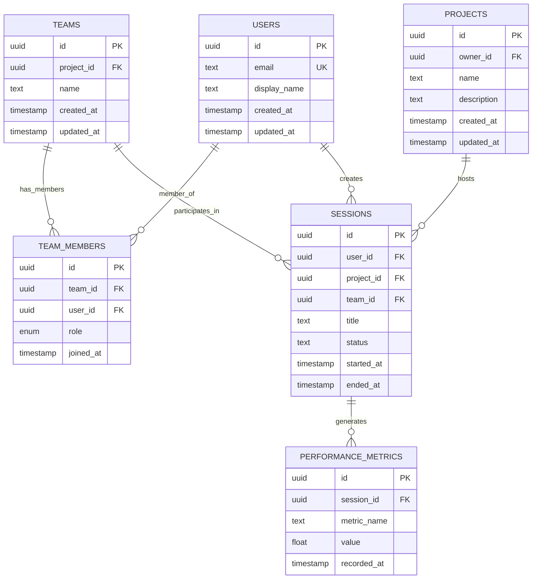
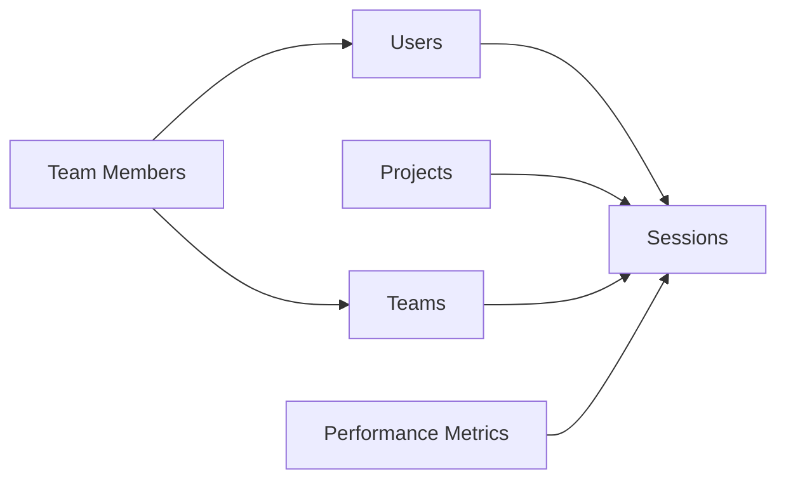

# Database Design

<cite>
**Referenced Files in This Document**
- [supabase_schema.sql](file://backend/supabase_schema.sql)
- [database.py](file://backend/core/database.py)
- [schemas.py](file://backend/models/schemas.py)
- [001_platform_enhancement.sql](file://backend/migrations/001_platform_enhancement.sql)
- [002_quality_upgrade.sql](file://backend/migrations/002_quality_upgrade.sql)
- [003_team_project_linking.sql](file://backend/migrations/003_team_project_linking.sql)
- [004_team_viva_voice.sql](file://backend/migrations/004_team_viva_voice.sql)
</cite>

## Table of Contents
1. [Introduction](#introduction)
2. [Project Structure](#project-structure)
3. [Core Components](#core-components)
4. [Architecture Overview](#architecture-overview)
5. [Detailed Component Analysis](#detailed-component-analysis)
6. [Dependency Analysis](#dependency-analysis)
7. [Performance Considerations](#performance-considerations)
8. [Troubleshooting Guide](#troubleshooting-guide)
9. [Conclusion](#conclusion)
10. [Appendices](#appendices)

## Introduction
This document provides comprehensive data model documentation for the Horux platform’s Supabase PostgreSQL database. It covers entity relationships (users, projects, teams, sessions, and performance metrics), primary and foreign keys, indexes, constraints, and validation rules. It also explains schema evolution through migration files, data access patterns using SQLAlchemy ORM, query optimization techniques, caching strategies, lifecycle policies, retention and archival procedures, security considerations, sample queries, and performance tuning recommendations.

## Project Structure
The database design is defined primarily by a SQL schema file and a set of versioned migrations. The backend integrates with the database via configuration and models:
- Schema definition: backend/supabase_schema.sql
- Migrations: backend/migrations/*.sql
- Database configuration: backend/core/database.py
- Data models: backend/models/schemas.py

**Diagram sources**
- [supabase_schema.sql](file://backend/supabase_schema.sql)
- [001_platform_enhancement.sql](file://backend/migrations/001_platform_enhancement.sql)
- [002_quality_upgrade.sql](file://backend/migrations/002_quality_upgrade.sql)
- [003_team_project_linking.sql](file://backend/migrations/003_team_project_linking.sql)
- [004_team_viva_voice.sql](file://backend/migrations/004_team_viva_voice.sql)
- [database.py](file://backend/core/database.py)
- [schemas.py](file://backend/models/schemas.py)

**Section sources**
- [supabase_schema.sql](file://backend/supabase_schema.sql)
- [database.py](file://backend/core/database.py)
- [schemas.py](file://backend/models/schemas.py)
- [001_platform_enhancement.sql](file://backend/migrations/001_platform_enhancement.sql)
- [002_quality_upgrade.sql](file://backend/migrations/002_quality_upgrade.sql)
- [003_team_project_linking.sql](file://backend/migrations/003_team_project_linking.sql)
- [004_team_viva_voice.sql](file://backend/migrations/004_team_viva_voice.sql)

## Core Components
The core data components include:
- Users: identity and account information
- Projects: workspaces or initiatives
- Teams: groups collaborating on projects
- Sessions: live or recorded interactions tied to users and projects
- Performance Metrics: analytics and measurements derived from sessions and activities

These entities are modeled in the schema and enforced via constraints and indexes. SQLAlchemy models provide an object-oriented interface for querying and persistence.

**Section sources**
- [supabase_schema.sql](file://backend/supabase_schema.sql)
- [schemas.py](file://backend/models/schemas.py)

## Architecture Overview
The database architecture centers on a normalized relational schema with clear separation between identity, collaboration, session management, and analytics. Migrations drive incremental changes, while the application layer uses SQLAlchemy ORM to interact with the database.

**Diagram sources**
- [schemas.py](file://backend/models/schemas.py)
- [supabase_schema.sql](file://backend/supabase_schema.sql)
- [001_platform_enhancement.sql](file://backend/migrations/001_platform_enhancement.sql)
- [002_quality_upgrade.sql](file://backend/migrations/002_quality_upgrade.sql)
- [003_team_project_linking.sql](file://backend/migrations/003_team_project_linking.sql)
- [004_team_viva_voice.sql](file://backend/migrations/004_team_viva_voice.sql)

## Detailed Component Analysis

### Entity Relationships and Data Model
The following diagram illustrates the primary entities and their relationships:

**Diagram sources**
- [supabase_schema.sql](file://backend/supabase_schema.sql)

**Section sources**
- [supabase_schema.sql](file://backend/supabase_schema.sql)

### Primary Keys, Foreign Keys, and Constraints
- Primary Keys: Each table defines a unique identifier column (e.g., id) as the primary key.
- Foreign Keys: Cross-entity relationships are enforced via foreign keys (e.g., sessions reference users, projects, and teams; team members reference teams and users).
- Constraints: Not-null constraints ensure required fields; unique constraints prevent duplicate emails; check constraints enforce valid statuses and roles where applicable.
- Indexes: Frequently queried columns (e.g., user_id, project_id, session timestamps) are indexed to optimize read performance.

Validation rules are applied at both the database level (constraints, checks) and the application level (ORM validations, input sanitization).

**Section sources**
- [supabase_schema.sql](file://backend/supabase_schema.sql)

### Schema Evolution Strategy and Version Management
Schema evolution is managed through versioned migration files:
- 001_platform_enhancement.sql
- 002_quality_upgrade.sql
- 003_team_project_linking.sql
- 004_team_viva_voice.sql

Each migration introduces incremental changes such as new tables, columns, indexes, or constraints. The base schema is maintained in supabase_schema.sql, which serves as the canonical reference. Migrations should be applied in order to maintain consistency across environments.

Best practices:
- Always write idempotent migrations when possible.
- Include rollback scripts or reversible changes.
- Document breaking changes and data transformations.
- Test migrations against staging before production deployment.

**Section sources**
- [supabase_schema.sql](file://backend/supabase_schema.sql)
- [001_platform_enhancement.sql](file://backend/migrations/001_platform_enhancement.sql)
- [002_quality_upgrade.sql](file://backend/migrations/002_quality_upgrade.sql)
- [003_team_project_linking.sql](file://backend/migrations/003_team_project_linking.sql)
- [004_team_viva_voice.sql](file://backend/migrations/004_team_viva_voice.sql)

### Data Access Patterns Using SQLAlchemy ORM
The application uses SQLAlchemy ORM to abstract database operations:
- Models map to tables and define relationships.
- Queries are constructed using ORM methods for readability and safety.
- Transactions are used to ensure consistency for multi-step writes.

Typical patterns:
- Create: Instantiate model objects and add to session, then commit.
- Read: Use filtered queries with joins for related entities.
- Update: Modify attributes within a transaction and commit.
- Delete: Cascade deletes where appropriate to maintain referential integrity.

Caching strategies:
- Application-level caches (in-memory or Redis) for frequently accessed data like team memberships.
- Query result caching for read-heavy endpoints.
- Cache invalidation on write operations to maintain consistency.

**Section sources**
- [schemas.py](file://backend/models/schemas.py)
- [database.py](file://backend/core/database.py)

### Data Lifecycle Policies, Retention Rules, and Archival Procedures
Lifecycle policies govern how long data is retained and when it is archived or purged:
- Sessions: Keep active sessions indefinitely; archive completed sessions after a retention period (e.g., 90 days).
- Performance Metrics: Aggregate into summary tables and purge raw metrics after a defined window.
- Team Memberships: Retain historical membership records for audit purposes.
- User Accounts: Soft-delete accounts with a grace period before permanent removal.

Archival procedures:
- Move old sessions and metrics to archive tables or separate schemas.
- Maintain referential integrity by preserving foreign key relationships in archives.
- Implement scheduled jobs to automate archival and cleanup.

Retention rules:
- Enforce minimum and maximum retention periods based on compliance requirements.
- Provide mechanisms for data deletion upon user request where applicable.

**Section sources**
- [supabase_schema.sql](file://backend/supabase_schema.sql)

### Security Considerations
Security measures include:
- Encryption at rest: Enabled by Supabase/PostgreSQL storage provider settings.
- Access controls: Row-level security policies restrict data access based on user roles and ownership.
- Audit logging: Track critical operations (create, update, delete) with timestamps and actor information.
- Input validation: Sanitize and validate all inputs at the application layer to prevent injection attacks.
- Least privilege: Database users have minimal permissions necessary for operation.

Recommendations:
- Regularly review and rotate credentials.
- Monitor access logs for anomalies.
- Encrypt sensitive data at the application level if additional protection is needed.

**Section sources**
- [supabase_schema.sql](file://backend/supabase_schema.sql)

### Sample Queries
Examples of common queries:
- Retrieve all sessions for a user within a date range.
- Calculate average performance metrics per project over time.
- List team members with their roles for a given team.
- Find inactive projects that have not had sessions in the last 30 days.

Optimization tips:
- Use indexes on filter and join columns.
- Avoid SELECT *; specify only needed columns.
- Use EXPLAIN ANALYZE to identify slow queries.
- Partition large tables (e.g., performance metrics) by time ranges.

**Section sources**
- [supabase_schema.sql](file://backend/supabase_schema.sql)

## Dependency Analysis
The database schema depends on consistent application of migrations and proper ORM mappings. Changes in one entity can cascade to others through foreign key relationships.

**Diagram sources**
- [supabase_schema.sql](file://backend/supabase_schema.sql)

**Section sources**
- [supabase_schema.sql](file://backend/supabase_schema.sql)

## Performance Considerations
Key performance considerations:
- Indexing strategy: Ensure indexes on frequently queried columns (user_id, project_id, timestamps).
- Query optimization: Use efficient joins and avoid N+1 queries by leveraging eager loading.
- Connection pooling: Configure SQLAlchemy connection pools to handle concurrent requests.
- Caching: Implement cache layers for hot data and use cache invalidation strategies.
- Monitoring: Track slow queries and resource usage with database monitoring tools.

Tuning recommendations:
- Adjust PostgreSQL settings (shared_buffers, work_mem) based on workload.
- Use materialized views for complex aggregations.
- Schedule regular vacuum and analyze operations to maintain statistics.

[No sources needed since this section provides general guidance]

## Troubleshooting Guide
Common issues and resolutions:
- Migration failures: Verify migration order and idempotency; check for missing dependencies.
- Constraint violations: Inspect data integrity and ensure referential constraints are satisfied.
- Slow queries: Analyze execution plans and add appropriate indexes.
- Connection errors: Validate database credentials and network connectivity.

Debugging steps:
- Enable detailed logging for database operations.
- Use database client tools to inspect schema and data.
- Reproduce issues in staging environment with identical data.

**Section sources**
- [database.py](file://backend/core/database.py)
- [supabase_schema.sql](file://backend/supabase_schema.sql)

## Conclusion
The Horux platform’s database design emphasizes clarity, scalability, and security through a well-structured schema, robust migrations, and efficient ORM usage. By adhering to best practices in indexing, caching, and security, the system can support growing user bases and complex analytical workloads. Continuous monitoring and iterative improvements will ensure optimal performance and reliability.

[No sources needed since this section summarizes without analyzing specific files]

## Appendices

### Migration Timeline
- 001_platform_enhancement.sql: Initial platform enhancements
- 002_quality_upgrade.sql: Quality improvements and optimizations
- 003_team_project_linking.sql: Added team-project relationships
- 004_team_viva_voice.sql: Enhanced team viva voice features

**Section sources**
- [001_platform_enhancement.sql](file://backend/migrations/001_platform_enhancement.sql)
- [002_quality_upgrade.sql](file://backend/migrations/002_quality_upgrade.sql)
- [003_team_project_linking.sql](file://backend/migrations/003_team_project_linking.sql)
- [004_team_viva_voice.sql](file://backend/migrations/004_team_viva_voice.sql)