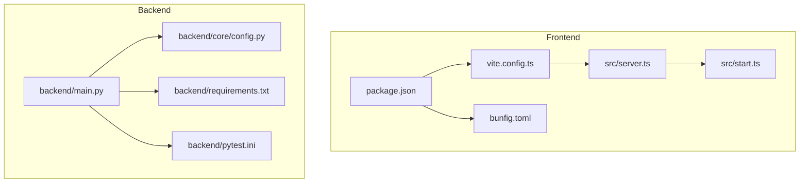
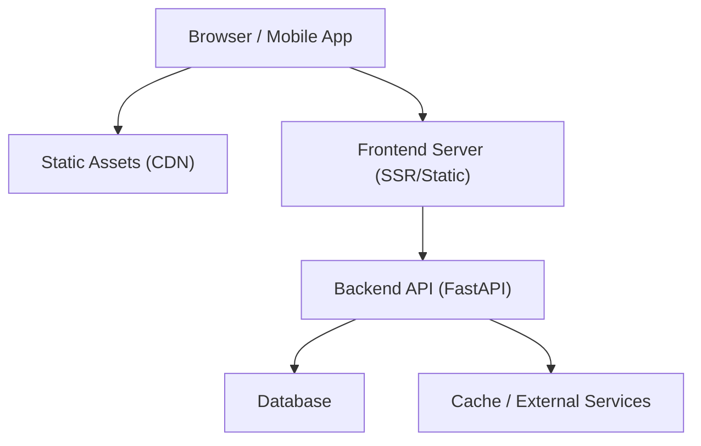
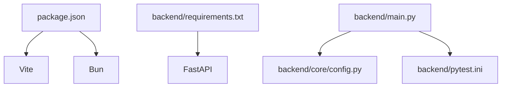

# Deployment & DevOps

<cite>
**Referenced Files in This Document**
- [package.json](file://package.json)
- [vite.config.ts](file://vite.config.ts)
- [bunfig.toml](file://bunfig.toml)
- [backend/main.py](file://backend/main.py)
- [backend/core/config.py](file://backend/core/config.py)
- [backend/requirements.txt](file://backend/requirements.txt)
- [backend/pytest.ini](file://backend/pytest.ini)
- [src/server.ts](file://src/server.ts)
- [src/start.ts](file://src/start.ts)
- [README.md](file://README.md)
</cite>

## Table of Contents
1. [Introduction](#introduction)
2. [Project Structure](#project-structure)
3. [Core Components](#core-components)
4. [Architecture Overview](#architecture-overview)
5. [Detailed Component Analysis](#detailed-component-analysis)
6. [Dependency Analysis](#dependency-analysis)
7. [Performance Considerations](#performance-considerations)
8. [Troubleshooting Guide](#troubleshooting-guide)
9. [Conclusion](#conclusion)
10. [Appendices](#appendices)

## Introduction
This document provides comprehensive deployment and DevOps guidance for the Horux platform, covering build processes for frontend and backend, containerization with Docker, CI/CD pipeline configuration, environment variable management, secrets handling, deployment strategies across environments, rollback procedures, monitoring setup, scaling considerations, performance optimization, and maintenance procedures. It is intended for engineers responsible for building, deploying, operating, and maintaining Horux in development, staging, and production environments.

## Project Structure
Horux is a full-stack application with:
- Frontend built with Vite and Bun, including server-side rendering entry points and runtime configuration.
- Backend implemented in Python (FastAPI), with dependency management, test configuration, and core configuration modules.
- Shared scripts and tooling at the repository root for local development and startup.

**Diagram sources**
- [package.json](file://package.json)
- [vite.config.ts](file://vite.config.ts)
- [bunfig.toml](file://bunfig.toml)
- [src/server.ts](file://src/server.ts)
- [src/start.ts](file://src/start.ts)
- [backend/main.py](file://backend/main.py)
- [backend/core/config.py](file://backend/core/config.py)
- [backend/requirements.txt](file://backend/requirements.txt)
- [backend/pytest.ini](file://backend/pytest.ini)

**Section sources**
- [README.md](file://README.md)
- [package.json](file://package.json)
- [vite.config.ts](file://vite.config.ts)
- [bunfig.toml](file://bunfig.toml)
- [backend/main.py](file://backend/main.py)
- [backend/core/config.py](file://backend/core/config.py)
- [backend/requirements.txt](file://backend/requirements.txt)
- [backend/pytest.ini](file://backend/pytest.ini)

## Core Components
- Frontend build system: Vite-based bundling and asset optimization configured via project config files.
- Frontend runtime: Server entrypoints for SSR and static serving.
- Backend service: FastAPI application with configuration loading and dependency management.
- Test harnesses: Frontend and backend test configurations to support automated quality gates.

Key responsibilities:
- Build: Compile TypeScript/JS assets, optimize images/styles, generate production bundles.
- Runtime: Serve static assets and API endpoints; load environment-specific settings.
- Tests: Unit and integration tests executed during CI to ensure correctness.

**Section sources**
- [package.json](file://package.json)
- [vite.config.ts](file://vite.config.ts)
- [bunfig.toml](file://bunfig.toml)
- [src/server.ts](file://src/server.ts)
- [src/start.ts](file://src/start.ts)
- [backend/main.py](file://backend/main.py)
- [backend/core/config.py](file://backend/core/config.py)
- [backend/requirements.txt](file://backend/requirements.txt)
- [backend/pytest.ini](file://backend/pytest.ini)

## Architecture Overview
The platform consists of two primary services:
- Frontend: Bundled by Vite and served statically or via SSR depending on configuration.
- Backend: Python FastAPI service exposing REST APIs and business logic.

[No sources needed since this diagram shows conceptual architecture]

## Detailed Component Analysis

### Frontend Build Process
- Entry points and bundler configuration are defined in the project’s configuration files.
- Asset optimization includes minification, tree-shaking, and code splitting as per Vite defaults and customizations.
- Environment variables are consumed at build time or runtime based on configuration.

Recommended steps:
- Install dependencies using the package manager specified in the project.
- Run the build command to produce optimized static assets.
- Verify output directories and asset naming patterns for caching.

Operational notes:
- Use environment-specific configs to toggle features and endpoints.
- Ensure cache-busting filenames for long-term browser caching.

**Section sources**
- [package.json](file://package.json)
- [vite.config.ts](file://vite.config.ts)
- [bunfig.toml](file://bunfig.toml)

### Frontend Runtime and SSR
- The server entrypoint initializes the runtime and serves either SSR pages or static assets.
- Startup script coordinates process initialization and port binding.

Deployment considerations:
- Configure reverse proxy to serve static assets directly when possible.
- Enable HTTP/2 and compression at the edge for improved performance.

**Section sources**
- [src/server.ts](file://src/server.ts)
- [src/start.ts](file://src/start.ts)

### Backend Build and Runtime
- Dependencies are managed via requirements file.
- Application entrypoint loads configuration from environment variables and initializes routes.
- Test configuration supports running unit and integration tests.

Build and run:
- Create a virtual environment and install dependencies.
- Start the server with appropriate environment variables.
- Execute tests before deployment to validate behavior.

**Section sources**
- [backend/main.py](file://backend/main.py)
- [backend/core/config.py](file://backend/core/config.py)
- [backend/requirements.txt](file://backend/requirements.txt)
- [backend/pytest.ini](file://backend/pytest.ini)

### Containerization Strategy
Use multi-stage builds to minimize image size and improve security:
- Stage 1: Build frontend assets using Node/Bun and Vite.
- Stage 2: Build backend dependencies and compile artifacts.
- Final stage: Minimal runtime image containing only necessary binaries and assets.

Best practices:
- Pin base image versions and use distroless or Alpine variants where applicable.
- Copy only required files into final image.
- Set non-root user and read-only filesystems where possible.
- Inject secrets at runtime via environment variables or secret managers.

Example structure:
- Frontend build stage produces static assets.
- Backend build stage installs dependencies and compiles.
- Runtime stage runs both services behind a lightweight web server or process manager.

[No sources needed since this section provides general guidance]

### CI/CD Pipeline Configuration
Automate testing, building, and deployment:
- Lint and type-check frontend and backend.
- Run unit and integration tests.
- Build frontend assets and backend artifacts.
- Push container images to registry with semantic version tags.
- Deploy to target environments with environment-specific variables.

Pipeline stages:
- Validate: lint, format checks, dependency audits.
- Test: unit tests, integration tests, contract tests.
- Build: frontend bundle, backend wheel/image.
- Package: create container images and push to registry.
- Deploy: apply manifests or run deployment scripts per environment.

Secrets management:
- Store secrets in CI/CD secret store.
- Inject secrets as environment variables or mounted volumes at runtime.
- Avoid committing secrets to repository.

**Section sources**
- [package.json](file://package.json)
- [backend/pytest.ini](file://backend/pytest.ini)

### Environment Variables and Secrets Handling
Environment configuration:
- Define variables for API endpoints, feature flags, logging levels, and database credentials.
- Separate configuration per environment (development, staging, production).
- Validate required variables at startup and fail fast if missing.

Secrets best practices:
- Use secret managers (e.g., cloud provider secret stores) instead of plaintext env vars.
- Rotate secrets regularly and audit access.
- Limit secret scope to minimum required permissions.

Configuration validation:
- Enforce schema validation for environment variables.
- Provide clear error messages for misconfiguration.

**Section sources**
- [backend/core/config.py](file://backend/core/config.py)

### Deployment Strategies
- Development: Local containers or direct process execution with hot reload enabled.
- Staging: Canary or blue-green deployments to validate changes with real traffic patterns.
- Production: Blue-green or canary releases with automated rollback on failure.

Rollback procedures:
- Maintain previous image tags and manifests.
- Automate rollback by redeploying last known good version.
- Monitor health checks and metrics to trigger automatic rollbacks.

**Section sources**
- [package.json](file://package.json)
- [backend/main.py](file://backend/main.py)

### Monitoring and Observability
- Metrics: expose application metrics and integrate with monitoring systems.
- Logging: structured logs with correlation IDs and log levels configurable via environment.
- Tracing: distributed tracing for request flows across frontend and backend.
- Health checks: readiness and liveness probes for orchestration platforms.

Alerting:
- Define SLOs and alert thresholds for latency, error rates, and resource usage.
- Integrate alerts with incident response channels.

**Section sources**
- [backend/core/config.py](file://backend/core/config.py)

### Scaling Considerations
Horizontal scaling:
- Stateless services scale horizontally behind load balancers.
- Use connection pooling and rate limiting for backend services.
- Cache frequently accessed data to reduce database load.

Vertical scaling:
- Increase CPU/memory for compute-bound tasks.
- Tune worker processes and threads based on workload characteristics.

Resource limits:
- Set CPU and memory requests/limits in orchestrator configurations.
- Monitor resource utilization and adjust accordingly.

[No sources needed since this section provides general guidance]

### Performance Optimization
Frontend:
- Enable gzip/brotli compression and HTTP/2.
- Leverage CDN caching with immutable asset URLs.
- Minimize payload sizes through code splitting and lazy loading.

Backend:
- Optimize database queries and add indexes where necessary.
- Implement caching layers for expensive computations.
- Use asynchronous processing for long-running tasks.

[No sources needed since this section provides general guidance]

### Maintenance Procedures
- Dependency updates: schedule regular updates and security patches.
- Database migrations: plan zero-downtime migrations with backward compatibility.
- Log rotation and retention policies to manage storage costs.
- Periodic disaster recovery drills and backup verification.

[No sources needed since this section provides general guidance]

## Dependency Analysis
Frontend dependencies are declared in the package manifest and resolved by the package manager. Backend dependencies are listed in the requirements file.

**Diagram sources**
- [package.json](file://package.json)
- [backend/requirements.txt](file://backend/requirements.txt)
- [backend/main.py](file://backend/main.py)
- [backend/core/config.py](file://backend/core/config.py)
- [backend/pytest.ini](file://backend/pytest.ini)

**Section sources**
- [package.json](file://package.json)
- [backend/requirements.txt](file://backend/requirements.txt)
- [backend/main.py](file://backend/main.py)
- [backend/core/config.py](file://backend/core/config.py)
- [backend/pytest.ini](file://backend/pytest.ini)

## Performance Considerations
- Prefer static asset delivery via CDN and reverse proxy for low-latency responses.
- Use connection pooling and query optimization for database interactions.
- Apply rate limiting and circuit breakers for external service calls.
- Profile critical paths and address bottlenecks iteratively.

[No sources needed since this section provides general guidance]

## Troubleshooting Guide
Common issues and resolutions:
- Missing environment variables: validate required variables at startup and provide clear errors.
- Build failures: check dependency resolution and lockfiles; ensure consistent toolchain versions.
- Container runtime errors: verify non-root user permissions and volume mounts.
- Health check failures: inspect readiness/liveness probe definitions and underlying service status.

Debugging tips:
- Enable verbose logging in development and staging.
- Capture request traces and correlate logs across services.
- Use feature flags to isolate problematic changes.

**Section sources**
- [backend/core/config.py](file://backend/core/config.py)
- [backend/pytest.ini](file://backend/pytest.ini)

## Conclusion
This guide outlines the end-to-end deployment and DevOps practices for Horux, covering build pipelines, containerization, CI/CD automation, environment and secrets management, deployment strategies, monitoring, scaling, performance tuning, and maintenance. Following these recommendations will help ensure reliable, secure, and efficient operations across all environments.

## Appendices

### Build Commands Reference
- Frontend: install dependencies and build assets using the package manager and Vite.
- Backend: install dependencies and start the server with environment variables.

**Section sources**
- [package.json](file://package.json)
- [backend/requirements.txt](file://backend/requirements.txt)

### Example Multi-Stage Dockerfile Outline
- Stage 1: Build frontend assets.
- Stage 2: Build backend dependencies.
- Final: Minimal runtime image with compiled artifacts and environment configuration.

[No sources needed since this section provides general guidance]