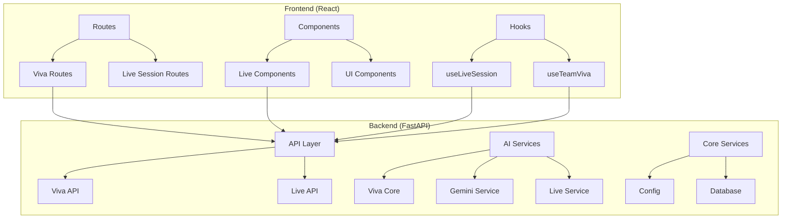
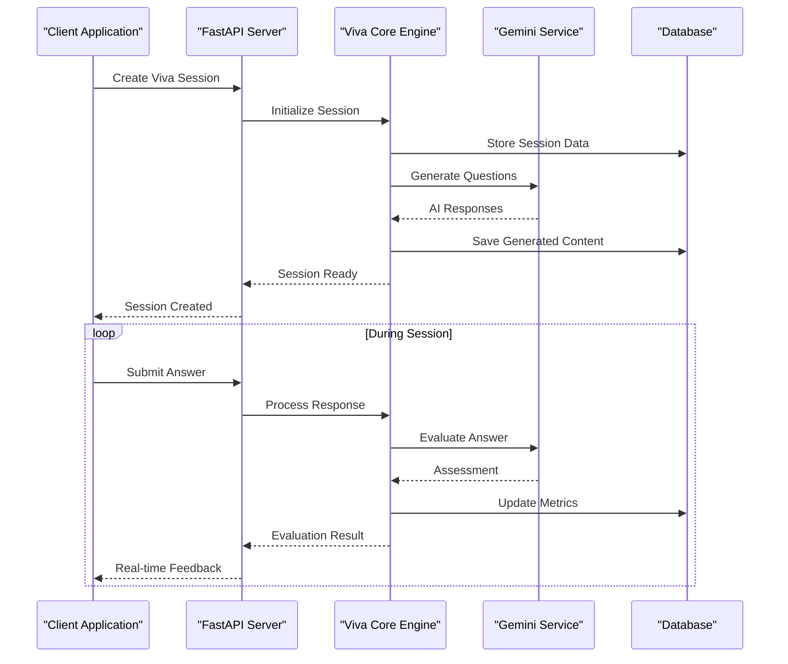
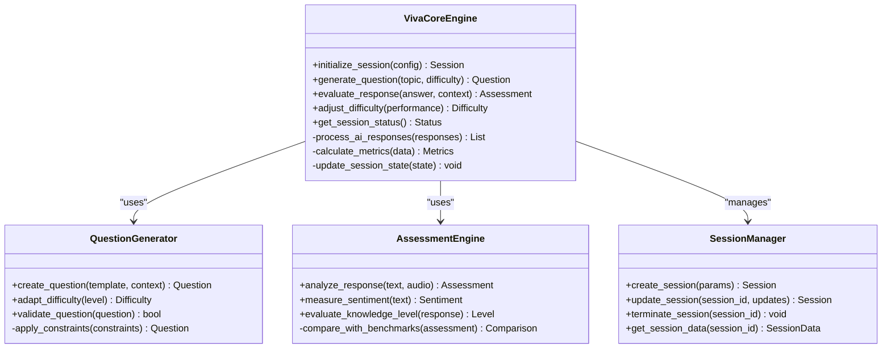
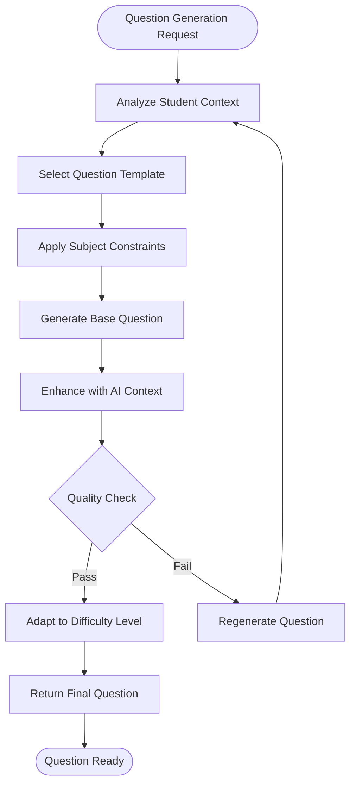
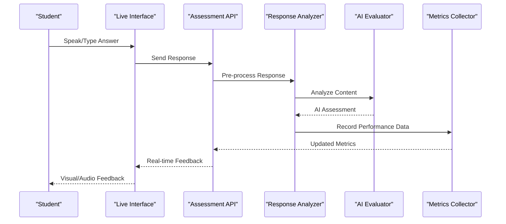
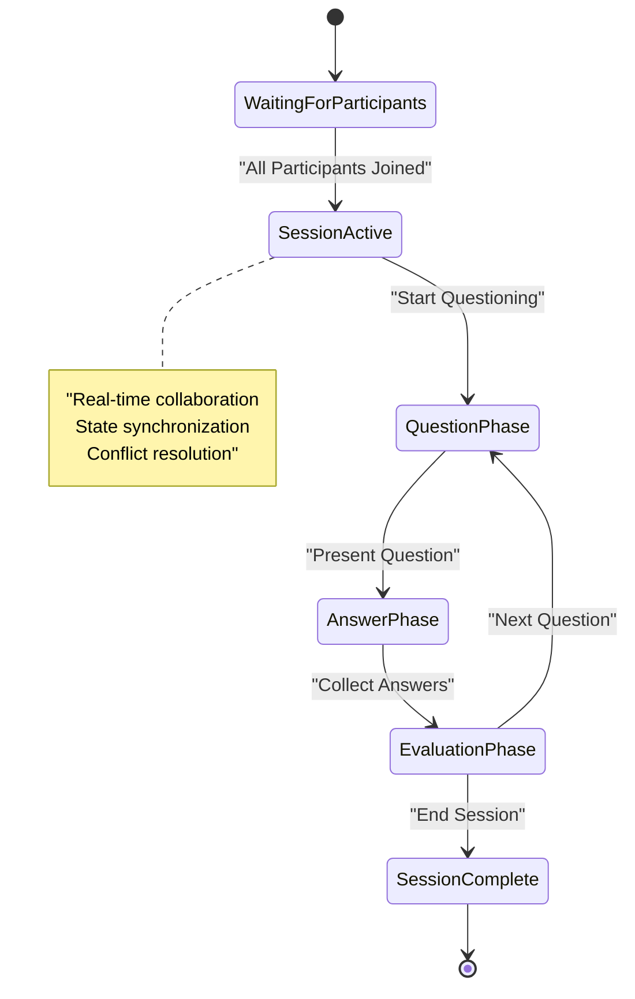
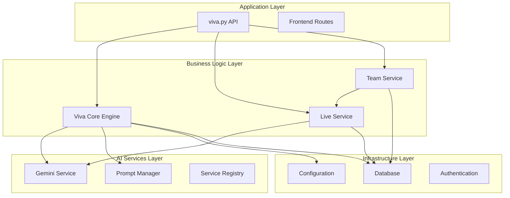
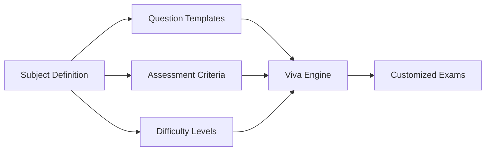

# AI Viva System

<cite>
**Referenced Files in This Document**
- [viva_core.py](file://backend/ai/viva_core.py)
- [gemini_service.py](file://backend/ai/gemini_service.py)
- [prompts.py](file://backend/ai/prompts.py)
- [viva.py](file://backend/api/viva.py)
- [live_service.py](file://backend/ai/live_service.py)
- [team_live_service.py](file://backend/ai/team_live_service.py)
- [registry.py](file://backend/ai/registry.py)
- [report_service.py](file://backend/ai/report_service.py)
- [sentiment_analyzer.py](file://backend/ai/sentiment_analyzer.py)
- [delivery_metrics.py](file://backend/ai/delivery_metrics.py)
- [weakness_heatmap.py](file://backend/ai/weakness_heatmap.py)
- [code_aware_viva.py](file://backend/ai/code_aware_viva.py)
- [index.tsx](file://src/routes/ai-viva/index.tsx)
- [new.tsx](file://src/routes/ai-viva/new.tsx)
- [session.$id.tsx](file://src/routes/ai-viva/session.$id.tsx)
- [useLiveSession.ts](file://src/lib/useLiveSession.ts)
- [useTeamViva.ts](file://src/lib/useTeamViva.ts)
- [live-session-runner.tsx](file://src/components/live/live-session-runner.tsx)
- [live-stage.tsx](file://src/components/live/live-stage.tsx)
- [team-viva-room.tsx](file://src/components/live/team-viva-room.tsx)
- [config.py](file://backend/core/config.py)
- [database.py](file://backend/core/database.py)
- [deps.py](file://backend/core/deps.py)
- [errors.py](file://backend/core/errors.py)
- [main.py](file://backend/main.py)
</cite>

## Table of Contents
1. [Introduction](#introduction)
2. [Project Structure](#project-structure)
3. [Core Components](#core-components)
4. [Architecture Overview](#architecture-overview)
5. [Detailed Component Analysis](#detailed-component-analysis)
6. [Dependency Analysis](#dependency-analysis)
7. [Performance Considerations](#performance-considerations)
8. [Troubleshooting Guide](#troubleshooting-guide)
9. [Configuration and Customization](#configuration-and-customization)
10. [User Interface Components](#user-interface-components)
11. [API Reference](#api-reference)
12. [Conclusion](#conclusion)

## Introduction

The AI Viva System is a comprehensive examination platform that leverages artificial intelligence to conduct dynamic, adaptive oral examinations. Built with a modern full-stack architecture, it combines Google Gemini AI services with real-time assessment capabilities to provide intelligent evaluation of student knowledge across various subject areas.

The system supports both individual and team-based viva sessions, featuring adaptive difficulty adjustment, sentiment analysis, code-aware questioning, and comprehensive performance analytics. It provides administrators with powerful tools for session management while offering students an intuitive interface for interactive examination experiences.

## Project Structure

The AI Viva System follows a modular architecture with clear separation between backend services, frontend components, and configuration management:

**Diagram sources**
- [main.py:1-50](file://backend/main.py#L1-L50)
- [index.tsx:1-30](file://src/routes/ai-viva/index.tsx#L1-L30)

**Section sources**
- [main.py:1-100](file://backend/main.py#L1-L100)
- [router.tsx:1-50](file://src/router.tsx#L1-L50)

## Core Components

### Viva Core Engine

The viva core engine serves as the central orchestrator for examination sessions, managing question generation, difficulty adaptation, and real-time assessment. It coordinates multiple AI services to provide comprehensive evaluation capabilities.

Key responsibilities include:
- Session lifecycle management
- Question generation and adaptation
- Real-time response analysis
- Performance tracking and scoring
- Integration with external AI services

### Gemini AI Integration

The Gemini service provides the foundation for AI-powered question generation and assessment. It handles communication with Google's Gemini API, including prompt engineering, response parsing, and error handling.

Features:
- Dynamic prompt generation
- Context-aware question creation
- Multi-modal response processing
- Rate limiting and retry logic

### Live Session Management

The live service manages real-time aspects of viva sessions, including WebSocket connections, concurrent user handling, and state synchronization across multiple participants.

Capabilities:
- Real-time communication
- Concurrent session management
- State persistence
- Error recovery mechanisms

**Section sources**
- [viva_core.py:1-200](file://backend/ai/viva_core.py#L1-L200)
- [gemini_service.py:1-150](file://backend/ai/gemini_service.py#L1-L150)
- [live_service.py:1-180](file://backend/ai/live_service.py#L1-L180)

## Architecture Overview

The system follows a microservices-inspired architecture with clear separation of concerns:

**Diagram sources**
- [viva.py:1-100](file://backend/api/viva.py#L1-L100)
- [viva_core.py:1-150](file://backend/ai/viva_core.py#L1-L150)
- [gemini_service.py:1-120](file://backend/ai/gemini_service.py#L1-L120)

## Detailed Component Analysis

### Viva Core Engine Architecture

The viva core engine implements a sophisticated orchestration pattern that manages the complete examination lifecycle:

**Diagram sources**
- [viva_core.py:1-300](file://backend/ai/viva_core.py#L1-L300)
- [registry.py:1-100](file://backend/ai/registry.py#L1-L100)

### Question Generation Algorithm

The question generation system employs a multi-layered approach combining template-based generation with AI-enhanced customization:

**Diagram sources**
- [prompts.py:1-200](file://backend/ai/prompts.py#L1-L200)
- [viva_core.py:150-350](file://backend/ai/viva_core.py#L150-L350)

### Real-time Assessment Pipeline

The real-time assessment system processes student responses through multiple analytical layers:

**Diagram sources**
- [live_service.py:1-200](file://backend/ai/live_service.py#L1-L200)
- [sentiment_analyzer.py:1-150](file://backend/ai/sentiment_analyzer.py#L1-L150)

### Team Viva Collaboration System

The team viva system enables collaborative examination experiences with synchronized state management:

**Diagram sources**
- [team_live_service.py:1-200](file://backend/ai/team_live_service.py#L1-L200)
- [team_room.py:1-150](file://backend/ai/team_room.py#L1-L150)

**Section sources**
- [viva_core.py:1-400](file://backend/ai/viva_core.py#L1-L400)
- [live_service.py:1-250](file://backend/ai/live_service.py#L1-L250)
- [team_live_service.py:1-200](file://backend/ai/team_live_service.py#L1-L200)

## Dependency Analysis

The system exhibits a well-structured dependency hierarchy with clear separation between core business logic and infrastructure concerns:

**Diagram sources**
- [viva.py:1-150](file://backend/api/viva.py#L1-L150)
- [deps.py:1-100](file://backend/core/deps.py#L1-L100)
- [config.py:1-150](file://backend/core/config.py#L1-L150)

**Section sources**
- [deps.py:1-200](file://backend/core/deps.py#L1-L200)
- [registry.py:1-150](file://backend/ai/registry.py#L1-L150)

## Performance Considerations

The AI Viva System incorporates several performance optimization strategies:

### Caching Strategies
- **Question Cache**: Pre-generated questions stored for frequently accessed topics
- **Response Cache**: Cached assessments for similar answer patterns
- **Session State Cache**: Redis-backed session state for high-concurrency scenarios

### Concurrency Management
- **Async Processing**: Non-blocking AI service calls using async/await patterns
- **Connection Pooling**: Efficient database connection management
- **Rate Limiting**: Controlled API usage to prevent service degradation

### Memory Optimization
- **Streaming Responses**: Large AI responses processed in chunks
- **Lazy Loading**: On-demand loading of heavy components
- **Garbage Collection**: Proper resource cleanup for long-running sessions

## Troubleshooting Guide

### Common Issues and Solutions

#### AI Service Connectivity
- **Symptom**: Timeout errors during question generation
- **Solution**: Check network connectivity and API rate limits
- **Diagnostic**: Review service health endpoints and retry logs

#### Session State Corruption
- **Symmetric**: Sessions losing progress or data inconsistencies
- **Solution**: Implement session recovery mechanisms and data validation
- **Prevention**: Regular state snapshots and conflict resolution

#### Performance Degradation
- **Symptom**: Slow response times during peak usage
- **Solution**: Scale horizontally and optimize database queries
- **Monitoring**: Track key performance indicators and set alerts

### Debugging Tools

The system includes comprehensive logging and debugging utilities:

- **Structured Logging**: JSON-formatted logs with correlation IDs
- **Performance Profiling**: Built-in metrics collection and analysis
- **Error Tracking**: Centralized error reporting with stack traces
- **Session Replay**: Ability to replay problematic sessions for analysis

**Section sources**
- [errors.py:1-100](file://backend/core/errors.py#L1-L100)
- [logging.py:1-150](file://backend/core/logging.py#L1-L150)

## Configuration and Customization

### Subject Area Configuration

The system supports configurable subject areas with specialized question templates and assessment criteria:

**Diagram sources**
- [config.py:1-200](file://backend/core/config.py#L1-L200)
- [prompts.py:1-300](file://backend/ai/prompts.py#L1-L300)

### Scoring Mechanisms

The scoring system supports multiple evaluation approaches:

- **Rubric-based Scoring**: Traditional grading with defined criteria
- **AI-enhanced Assessment**: Machine learning-based evaluation
- **Peer Comparison**: Relative performance within cohorts
- **Progress Tracking**: Longitudinal improvement measurement

### Custom Question Templates

Administrators can create custom question templates using the built-in template editor:

- **Template Variables**: Dynamic content insertion
- **Conditional Logic**: Branching based on student responses
- **Multimedia Support**: Images, code snippets, and audio integration
- **Validation Rules**: Input constraints and format checking

**Section sources**
- [config.py:1-250](file://backend/core/config.py#L1-L250)
- [prompts.py:1-400](file://backend/ai/prompts.py#L1-L400)

## User Interface Components

### Exam Administration Dashboard

The admin interface provides comprehensive session management capabilities:

- **Session Creation Wizard**: Guided setup for new viva sessions
- **Participant Management**: Bulk enrollment and role assignment
- **Real-time Monitoring**: Live session observation and intervention
- **Analytics Dashboard**: Comprehensive performance reporting

### Student Interaction Interface

The student-facing interface offers an intuitive examination experience:

- **Responsive Design**: Optimized for desktop and mobile devices
- **Accessibility Features**: Screen reader support and keyboard navigation
- **Progress Indicators**: Visual feedback on session status
- **Help System**: Contextual assistance and guidance

### Result Analysis Tools

Advanced analytics capabilities for performance interpretation:

- **Individual Reports**: Detailed student performance breakdowns
- **Cohort Analysis**: Comparative statistics and trends
- **Skill Mapping**: Knowledge area proficiency visualization
- **Export Capabilities**: Multiple format support for reporting

**Section sources**
- [index.tsx:1-200](file://src/routes/ai-viva/index.tsx#L1-L200)
- [new.tsx:1-150](file://src/routes/ai-viva/new.tsx#L1-L150)
- [session.$id.tsx:1-300](file://src/routes/ai-viva/session.$id.tsx#L1-L300)

## API Reference

### Viva Session Management

#### Create New Session
- **Endpoint**: `POST /api/viva/sessions`
- **Request Body**: Session configuration parameters
- **Response**: Session ID and initial status
- **Authentication**: Admin privileges required

#### Get Session Status
- **Endpoint**: `GET /api/viva/sessions/{session_id}`
- **Response**: Current session state and metrics
- **Real-time Updates**: WebSocket connection available

#### Terminate Session
- **Endpoint**: `DELETE /api/viva/sessions/{session_id}`
- **Response**: Confirmation and final metrics
- **Cleanup**: Automatic resource deallocation

### Live Session APIs

#### Join Session
- **Endpoint**: `WS /ws/viva/join/{session_id}`
- **Authentication**: Session-specific token
- **Message Types**: Bidirectional communication protocol

#### Submit Response
- **Endpoint**: `POST /api/viva/sessions/{session_id}/responses`
- **Payload**: Text, audio, or multimedia responses
- **Processing**: Real-time analysis and feedback

**Section sources**
- [viva.py:1-300](file://backend/api/viva.py#L1-L300)
- [live.py:1-200](file://backend/api/live.py#L1-L200)

## Conclusion

The AI Viva System represents a comprehensive solution for intelligent examination delivery, combining advanced AI capabilities with robust real-time processing and intuitive user interfaces. Its modular architecture ensures scalability and maintainability while providing extensive customization options for diverse educational contexts.

The system's strength lies in its ability to adapt to individual student needs while maintaining rigorous assessment standards. Through continuous monitoring and analytics, it provides valuable insights into student performance and learning patterns, enabling educators to make data-driven decisions about curriculum and instruction.

Future enhancements may include expanded AI model integration, enhanced multimodal assessment capabilities, and deeper integration with existing educational technology ecosystems.