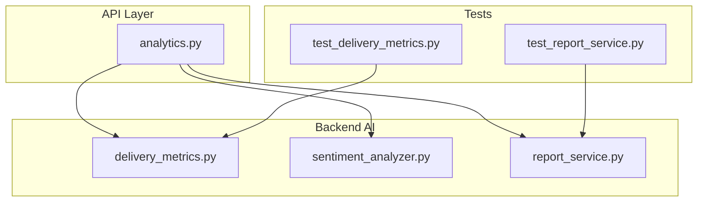
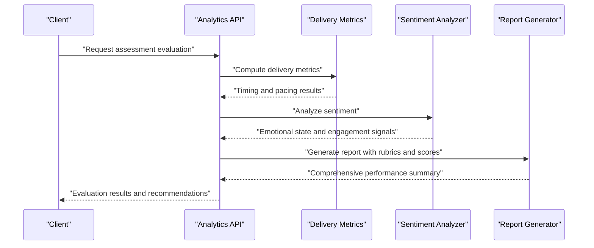
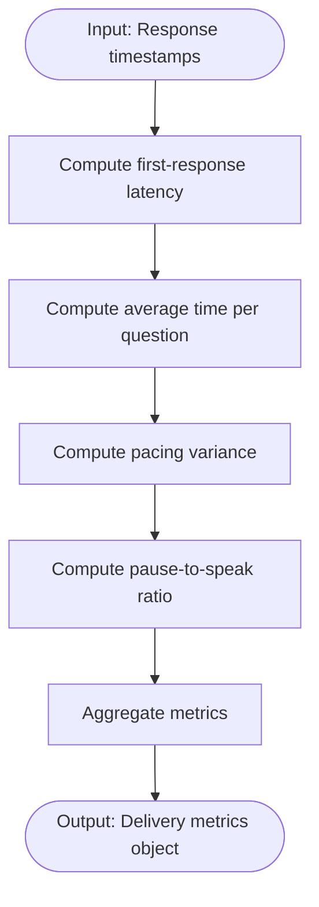
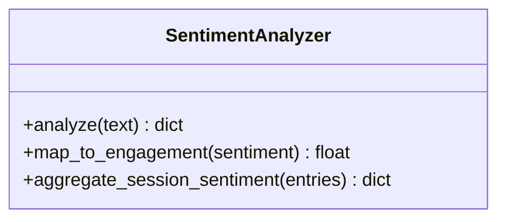
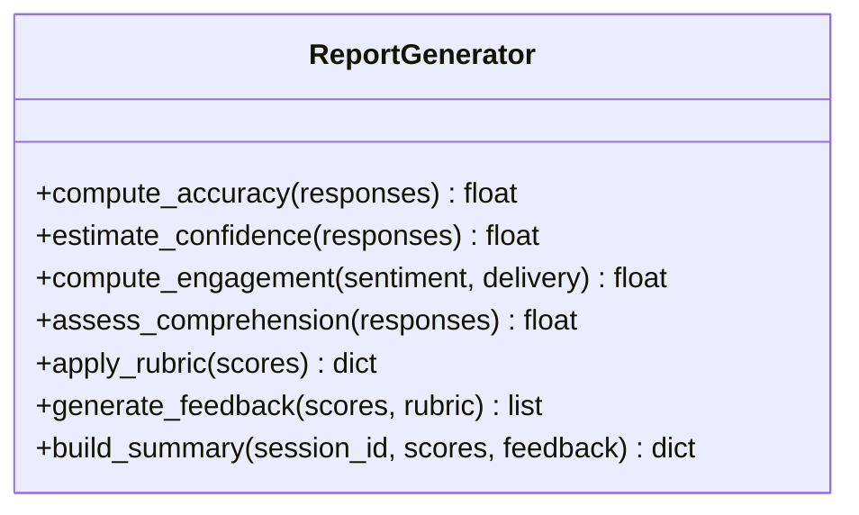
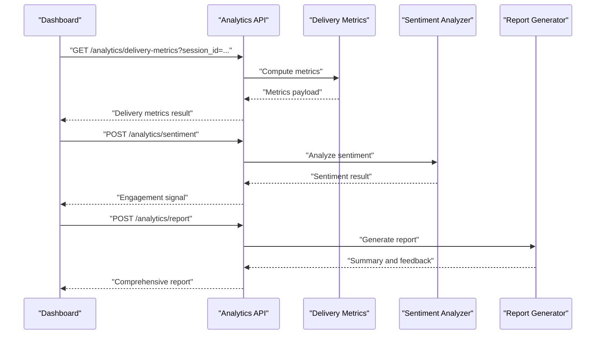
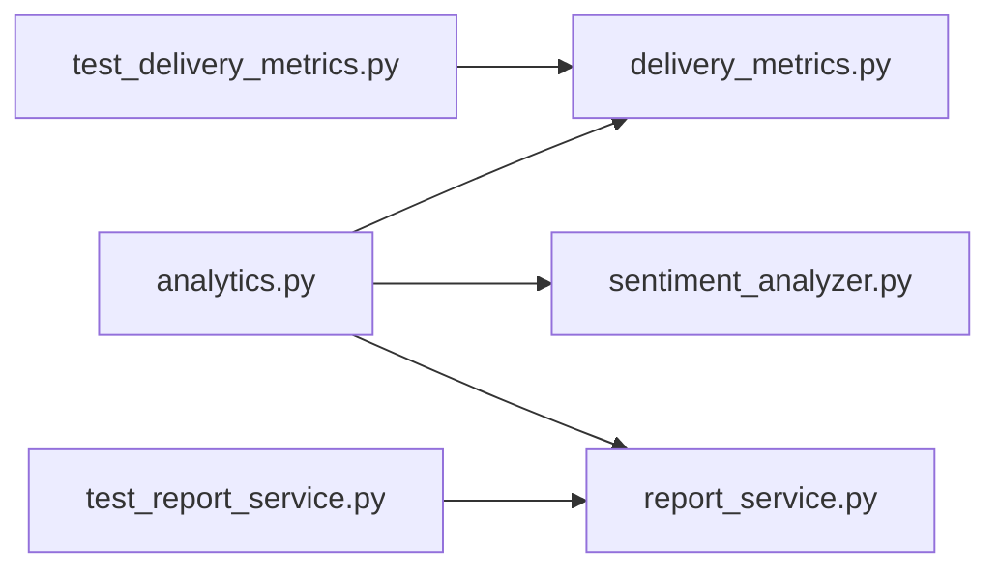

# Assessment & Evaluation

<cite>
**Referenced Files in This Document**
- [backend/ai/delivery_metrics.py](file://backend/ai/delivery_metrics.py)
- [backend/ai/sentiment_analyzer.py](file://backend/ai/sentiment_analyzer.py)
- [backend/ai/report_service.py](file://backend/ai/report_service.py)
- [backend/api/analytics.py](file://backend/api/analytics.py)
- [backend/tests/test_delivery_metrics.py](file://backend/tests/test_delivery_metrics.py)
- [backend/tests/test_report_service.py](file://backend/tests/test_report_service.py)
</cite>

## Table of Contents
1. [Introduction](#introduction)
2. [Project Structure](#project-structure)
3. [Core Components](#core-components)
4. [Architecture Overview](#architecture-overview)
5. [Detailed Component Analysis](#detailed-component-analysis)
6. [Dependency Analysis](#dependency-analysis)
7. [Performance Considerations](#performance-considerations)
8. [Troubleshooting Guide](#troubleshooting-guide)
9. [Conclusion](#conclusion)
10. [Appendices](#appendices)

## Introduction
This document explains the assessment and evaluation system that analyzes student responses across multiple dimensions: accuracy, confidence, engagement, and comprehension. It covers sentiment analysis integration for gauging emotional states and learning engagement, a delivery metrics system for tracking response patterns and timing, and a report generation service that produces comprehensive performance summaries. The guide also details scoring algorithms, rubric implementation, automated feedback generation, customization of evaluation criteria, interpretation of performance reports, and integration with third-party assessment tools.

## Project Structure
The assessment and evaluation features are implemented primarily under the backend AI module and exposed via API endpoints. Key files include:
- Delivery metrics computation and aggregation
- Sentiment analysis for emotional state inference
- Report generation for consolidated performance summaries
- Analytics API endpoints to consume these services
- Tests validating behavior and correctness

**Diagram sources**
- [backend/ai/delivery_metrics.py](file://backend/ai/delivery_metrics.py)
- [backend/ai/sentiment_analyzer.py](file://backend/ai/sentiment_analyzer.py)
- [backend/ai/report_service.py](file://backend/ai/report_service.py)
- [backend/api/analytics.py](file://backend/api/analytics.py)
- [backend/tests/test_delivery_metrics.py](file://backend/tests/test_delivery_metrics.py)
- [backend/tests/test_report_service.py](file://backend/tests/test_report_service.py)

**Section sources**
- [backend/ai/delivery_metrics.py](file://backend/ai/delivery_metrics.py)
- [backend/ai/sentiment_analyzer.py](file://backend/ai/sentiment_analyzer.py)
- [backend/ai/report_service.py](file://backend/ai/report_service.py)
- [backend/api/analytics.py](file://backend/api/analytics.py)
- [backend/tests/test_delivery_metrics.py](file://backend/tests/test_delivery_metrics.py)
- [backend/tests/test_report_service.py](file://backend/tests/test_report_service.py)

## Core Components
- Delivery Metrics System: Computes timing-based indicators such as first-response latency, average time per question, pacing consistency, and pause-to-speak ratios. These metrics reflect response patterns and cadence during assessments.
- Sentiment Analyzer: Infers emotional states from textual or audio-derived transcripts to estimate engagement and affective factors influencing performance.
- Report Generation Service: Aggregates multi-dimensional scores (accuracy, confidence, engagement, comprehension), applies rubrics, and produces structured summaries with actionable insights and recommendations.
- Analytics API: Exposes endpoints to compute metrics, run sentiment analysis, and retrieve generated reports for consumption by dashboards and integrations.

**Section sources**
- [backend/ai/delivery_metrics.py](file://backend/ai/delivery_metrics.py)
- [backend/ai/sentiment_analyzer.py](file://backend/ai/sentiment_analyzer.py)
- [backend/ai/report_service.py](file://backend/ai/report_service.py)
- [backend/api/analytics.py](file://backend/api/analytics.py)

## Architecture Overview
The system follows a layered architecture where the analytics API orchestrates calls to AI services. Data flows from raw session inputs into metrics and sentiment computations, which feed into the report generator to produce final outputs.

**Diagram sources**
- [backend/api/analytics.py](file://backend/api/analytics.py)
- [backend/ai/delivery_metrics.py](file://backend/ai/delivery_metrics.py)
- [backend/ai/sentiment_analyzer.py](file://backend/ai/sentiment_analyzer.py)
- [backend/ai/report_service.py](file://backend/ai/report_service.py)

## Detailed Component Analysis

### Delivery Metrics System
The delivery metrics component focuses on timing and pacing characteristics of student responses. It computes indicators such as:
- First-response latency
- Average time per question
- Pacing variance
- Pause-to-speak ratio

These metrics help identify hesitation patterns, fluency, and cognitive load during assessments.

**Diagram sources**
- [backend/ai/delivery_metrics.py](file://backend/ai/delivery_metrics.py)

**Section sources**
- [backend/ai/delivery_metrics.py](file://backend/ai/delivery_metrics.py)
- [backend/tests/test_delivery_metrics.py](file://backend/tests/test_delivery_metrics.py)

### Sentiment Analyzer
The sentiment analyzer infers emotional states from input text or derived transcripts. It contributes to the engagement dimension by mapping sentiment to engagement levels and providing contextual cues for performance interpretation.

**Diagram sources**
- [backend/ai/sentiment_analyzer.py](file://backend/ai/sentiment_analyzer.py)

**Section sources**
- [backend/ai/sentiment_analyzer.py](file://backend/ai/sentiment_analyzer.py)

### Report Generation Service
The report generator consolidates multi-dimensional scores and rubric-based evaluations into comprehensive summaries. It includes:
- Accuracy score calculation based on answer correctness
- Confidence estimation derived from response certainty indicators
- Engagement index combining sentiment and delivery metrics
- Comprehension assessment inferred from reasoning quality and depth
- Automated feedback generation with targeted recommendations

**Diagram sources**
- [backend/ai/report_service.py](file://backend/ai/report_service.py)

**Section sources**
- [backend/ai/report_service.py](file://backend/ai/report_service.py)
- [backend/tests/test_report_service.py](file://backend/tests/test_report_service.py)

### Analytics API Endpoints
The analytics layer exposes endpoints to orchestrate evaluation workflows. Typical requests include computing delivery metrics, running sentiment analysis, and generating reports. Responses contain structured data suitable for dashboards and downstream integrations.

**Diagram sources**
- [backend/api/analytics.py](file://backend/api/analytics.py)
- [backend/ai/delivery_metrics.py](file://backend/ai/delivery_metrics.py)
- [backend/ai/sentiment_analyzer.py](file://backend/ai/sentiment_analyzer.py)
- [backend/ai/report_service.py](file://backend/ai/report_service.py)

**Section sources**
- [backend/api/analytics.py](file://backend/api/analytics.py)

## Dependency Analysis
The analytics API depends on the AI services for core evaluation logic. Tests validate the behavior of delivery metrics and report generation components.

**Diagram sources**
- [backend/api/analytics.py](file://backend/api/analytics.py)
- [backend/ai/delivery_metrics.py](file://backend/ai/delivery_metrics.py)
- [backend/ai/sentiment_analyzer.py](file://backend/ai/sentiment_analyzer.py)
- [backend/ai/report_service.py](file://backend/ai/report_service.py)
- [backend/tests/test_delivery_metrics.py](file://backend/tests/test_delivery_metrics.py)
- [backend/tests/test_report_service.py](file://backend/tests/test_report_service.py)

**Section sources**
- [backend/api/analytics.py](file://backend/api/analytics.py)
- [backend/ai/delivery_metrics.py](file://backend/ai/delivery_metrics.py)
- [backend/ai/sentiment_analyzer.py](file://backend/ai/sentiment_analyzer.py)
- [backend/ai/report_service.py](file://backend/ai/report_service.py)
- [backend/tests/test_delivery_metrics.py](file://backend/tests/test_delivery_metrics.py)
- [backend/tests/test_report_service.py](file://backend/tests/test_report_service.py)

## Performance Considerations
- Batch processing: Group multiple sessions when possible to reduce API overhead and improve throughput.
- Caching: Cache intermediate results like sentiment embeddings or delivery metric aggregates for repeated queries within short time windows.
- Asynchronous execution: Offload heavy computations (e.g., sentiment analysis) to background tasks to keep API responses responsive.
- Metric normalization: Ensure consistent scaling across dimensions to avoid dominance by any single metric in composite scores.
- Resource limits: Implement timeouts and rate limiting for external dependencies used by sentiment analysis or LLM-based components.

[No sources needed since this section provides general guidance]

## Troubleshooting Guide
Common issues and resolutions:
- Missing timestamps: Delivery metrics require accurate timestamps; ensure input payloads include precise event times.
- Empty sentiment input: Provide valid text or transcript content; otherwise, sentiment analysis returns neutral defaults.
- Rubric misconfiguration: Validate rubric definitions before generating reports; incorrect thresholds can skew scores.
- API errors: Check request parameters and session IDs; verify that required fields are present and correctly formatted.

**Section sources**
- [backend/ai/delivery_metrics.py](file://backend/ai/delivery_metrics.py)
- [backend/ai/sentiment_analyzer.py](file://backend/ai/sentiment_analyzer.py)
- [backend/ai/report_service.py](file://backend/ai/report_service.py)
- [backend/api/analytics.py](file://backend/api/analytics.py)

## Conclusion
The assessment and evaluation system integrates delivery metrics, sentiment analysis, and report generation to provide a robust, multi-dimensional view of student performance. By leveraging scoring algorithms, rubric-based evaluation, and automated feedback, educators and systems can interpret engagement, comprehension, and confidence effectively. Customization of criteria and integration points enable adaptation to diverse educational contexts and third-party toolchains.

[No sources needed since this section summarizes without analyzing specific files]

## Appendices

### Scoring Algorithms and Rubric Implementation
- Accuracy: Derived from correctness of answers against expected keys or model-generated ground truth.
- Confidence: Estimated from self-reported certainty or behavioral cues such as response speed and hesitation.
- Engagement: Composite of sentiment signals and delivery metrics indicating active participation.
- Comprehension: Inferred from depth of reasoning, coherence, and alignment with learning objectives.
- Rubrics: Define thresholds and weights per dimension; apply weighted aggregation to produce final scores.

**Section sources**
- [backend/ai/report_service.py](file://backend/ai/report_service.py)

### Customizing Evaluation Criteria
- Adjust rubric weights to emphasize specific dimensions (e.g., higher weight for comprehension).
- Modify thresholds for engagement classification based on domain-specific baselines.
- Extend sentiment mappings to incorporate domain-relevant emotional indicators.

**Section sources**
- [backend/ai/report_service.py](file://backend/ai/report_service.py)
- [backend/ai/sentiment_analyzer.py](file://backend/ai/sentiment_analyzer.py)

### Interpreting Performance Reports
- Review composite scores to identify strengths and areas for improvement.
- Use feedback recommendations to tailor interventions and learning pathways.
- Track changes over time to measure progress and engagement trends.

**Section sources**
- [backend/ai/report_service.py](file://backend/ai/report_service.py)

### Integrating Third-Party Assessment Tools
- Use analytics endpoints to export structured evaluation results.
- Map internal metrics to external schemas via transformation layers.
- Securely transmit data using authentication and encryption mechanisms supported by your platform.

**Section sources**
- [backend/api/analytics.py](file://backend/api/analytics.py)