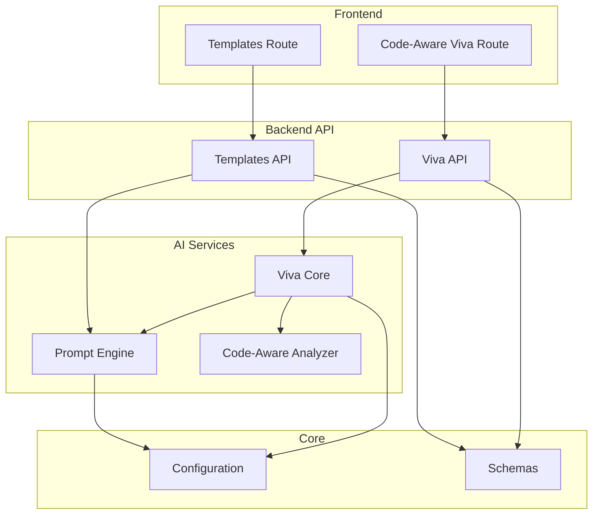
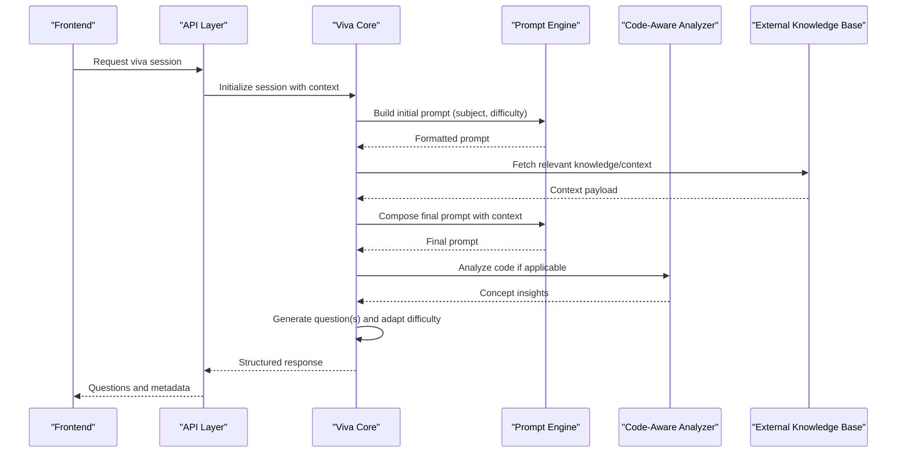
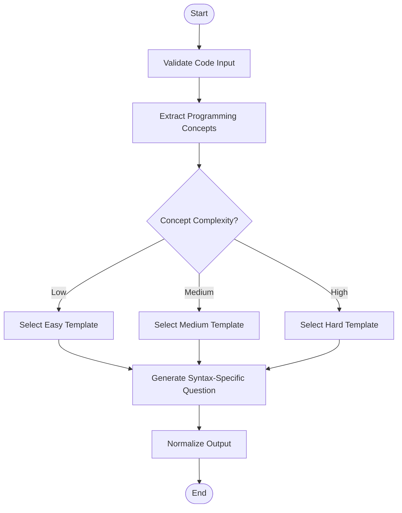
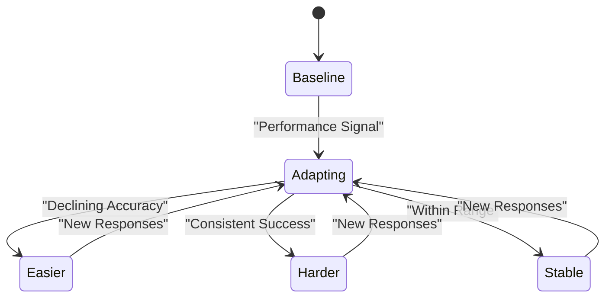
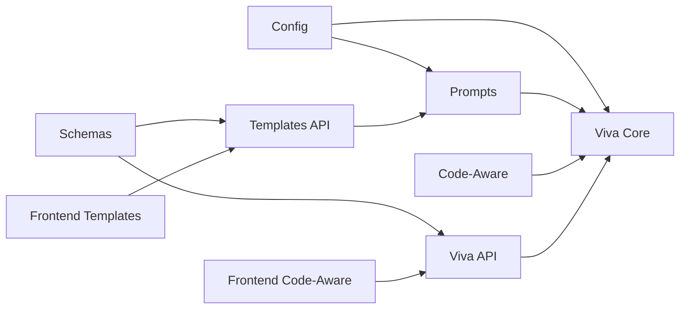

# Question Generation System

<cite>
**Referenced Files in This Document**
- [backend/ai/prompts.py](file://backend/ai/prompts.py)
- [backend/ai/viva_core.py](file://backend/ai/viva_core.py)
- [backend/ai/code_aware_viva.py](file://backend/ai/code_aware_viva.py)
- [backend/api/templates.py](file://backend/api/templates.py)
- [backend/core/config.py](file://backend/core/config.py)
- [backend/models/schemas.py](file://backend/models/schemas.py)
- [src/routes/advanced/viva-code-aware.tsx](file://src/routes/advanced/viva-code-aware.tsx)
- [src/routes/templates/index.tsx](file://src/routes/templates/index.tsx)
</cite>

## Table of Contents
1. [Introduction](#introduction)
2. [Project Structure](#project-structure)
3. [Core Components](#core-components)
4. [Architecture Overview](#architecture-overview)
5. [Detailed Component Analysis](#detailed-component-analysis)
6. [Dependency Analysis](#dependency-analysis)
7. [Performance Considerations](#performance-considerations)
8. [Troubleshooting Guide](#troubleshooting-guide)
9. [Conclusion](#conclusion)
10. [Appendices](#appendices)

## Introduction
This document explains the intelligent question generation system that produces contextually appropriate questions tailored to subject matter, difficulty levels, and student performance history. It covers:
- Prompt engineering framework for generating domain-specific questions
- Code-aware question generation that analyzes programming concepts and creates syntax-specific queries
- Template system for subject-specific question formats
- Adaptive algorithm adjusting complexity based on real-time performance
- Integration with external knowledge bases and AI services
- Examples and best practices for custom templates and domain prompts

## Project Structure
The system spans backend AI services, API endpoints, data schemas, and frontend routes:
- Backend AI layer: prompt orchestration, code-aware analysis, and viva session control
- API layer: exposes template management and viva endpoints
- Core configuration and schemas: environment settings and request/response models
- Frontend routes: user flows for code-aware sessions and template browsing

**Diagram sources**
- [backend/ai/prompts.py](file://backend/ai/prompts.py)
- [backend/ai/viva_core.py](file://backend/ai/viva_core.py)
- [backend/ai/code_aware_viva.py](file://backend/ai/code_aware_viva.py)
- [backend/api/templates.py](file://backend/api/templates.py)
- [backend/core/config.py](file://backend/core/config.py)
- [backend/models/schemas.py](file://backend/models/schemas.py)
- [src/routes/templates/index.tsx](file://src/routes/templates/index.tsx)
- [src/routes/advanced/viva-code-aware.tsx](file://src/routes/advanced/viva-code-aware.tsx)

**Section sources**
- [backend/ai/prompts.py](file://backend/ai/prompts.py)
- [backend/ai/viva_core.py](file://backend/ai/viva_core.py)
- [backend/ai/code_aware_viva.py](file://backend/ai/code_aware_viva.py)
- [backend/api/templates.py](file://backend/api/templates.py)
- [backend/core/config.py](file://backend/core/config.py)
- [backend/models/schemas.py](file://backend/models/schemas.py)
- [src/routes/templates/index.tsx](file://src/routes/templates/index.tsx)
- [src/routes/advanced/viva-code-aware.tsx](file://src/routes/advanced/viva-code-aware.tsx)

## Core Components
- Prompt engine: constructs subject-aware prompts, injects difficulty and context, and formats outputs consistently
- Viva core: orchestrates session flow, adapts difficulty based on performance, and coordinates AI calls
- Code-aware analyzer: parses code snippets, identifies concepts, and generates syntax-specific questions
- Templates API: manages subject-specific question templates and their metadata
- Configuration: centralizes model providers, keys, and behavior flags
- Schemas: defines validated request/response structures for APIs

Key responsibilities:
- Maintain a unified prompt format across subjects and difficulty levels
- Track student responses and adjust complexity dynamically
- Provide extensible templates for new domains
- Ensure robust error handling and logging

**Section sources**
- [backend/ai/prompts.py](file://backend/ai/prompts.py)
- [backend/ai/viva_core.py](file://backend/ai/viva_core.py)
- [backend/ai/code_aware_viva.py](file://backend/ai/code_aware_viva.py)
- [backend/api/templates.py](file://backend/api/templates.py)
- [backend/core/config.py](file://backend/core/config.py)
- [backend/models/schemas.py](file://backend/models/schemas.py)

## Architecture Overview
The system follows a layered architecture:
- Frontend routes trigger API calls for template retrieval and viva sessions
- API endpoints validate inputs using schemas and delegate to AI services
- AI services compose prompts, call external models, and return structured results
- Configuration controls provider selection and runtime behavior

**Diagram sources**
- [backend/ai/viva_core.py](file://backend/ai/viva_core.py)
- [backend/ai/prompts.py](file://backend/ai/prompts.py)
- [backend/ai/code_aware_viva.py](file://backend/ai/code_aware_viva.py)
- [backend/models/schemas.py](file://backend/models/schemas.py)

## Detailed Component Analysis

### Prompt Engineering Framework
Responsibilities:
- Construct subject-aware prompts with consistent structure
- Inject difficulty level, learning objectives, and constraints
- Format outputs into standardized JSON or text for downstream processing
- Support multiple model providers via configuration

Adaptive behavior:
- Adjusts tone and depth based on difficulty parameters
- Incorporates prior performance signals when available
- Ensures safety and educational alignment through constraints

Best practices:
- Use explicit placeholders for subject, difficulty, and context
- Keep prompts deterministic where possible
- Separate content from formatting instructions

**Section sources**
- [backend/ai/prompts.py](file://backend/ai/prompts.py)
- [backend/core/config.py](file://backend/core/config.py)

### Code-Aware Question Generation
Responsibilities:
- Parse code snippets to identify programming concepts
- Map concepts to difficulty-appropriate question types
- Generate syntax-specific queries aligned with language features
- Provide feedback grounded in code semantics

Processing pipeline:
- Input validation and sanitization
- Concept extraction and classification
- Template selection based on concept and difficulty
- Output normalization and validation

**Diagram sources**
- [backend/ai/code_aware_viva.py](file://backend/ai/code_aware_viva.py)

**Section sources**
- [backend/ai/code_aware_viva.py](file://backend/ai/code_aware_viva.py)

### Template System for Subject-Specific Formats
Responsibilities:
- Define reusable templates per subject and difficulty
- Manage metadata such as tags, prerequisites, and learning outcomes
- Provide APIs to create, update, and retrieve templates
- Enforce schema validation for template integrity

Template lifecycle:
- Creation with validation
- Versioning and rollback support
- Activation and deactivation
- Usage analytics and performance tracking

Usage example outline:
- Create a new template with subject, difficulty, and question structure
- Associate metadata and constraints
- Publish and test against sample inputs
- Monitor usage and refine over time

**Section sources**
- [backend/api/templates.py](file://backend/api/templates.py)
- [backend/models/schemas.py](file://backend/models/schemas.py)

### Adaptive Algorithm for Real-Time Performance Adjustment
Responsibilities:
- Track student responses and accuracy
- Compute performance metrics (e.g., success rate, time-to-answer)
- Adjust difficulty dynamically to maintain optimal challenge
- Provide explanations for difficulty changes

Algorithm overview:
- Collect response signals
- Update performance state
- Select next difficulty tier
- Generate follow-up questions accordingly

**Diagram sources**
- [backend/ai/viva_core.py](file://backend/ai/viva_core.py)

**Section sources**
- [backend/ai/viva_core.py](file://backend/ai/viva_core.py)

### Integration with External Knowledge Bases
Responsibilities:
- Retrieve domain-specific context to enrich prompts
- Cache frequently accessed knowledge to reduce latency
- Handle provider errors and fallback strategies
- Maintain consistency across different knowledge sources

Integration pattern:
- Query knowledge base with topic and difficulty filters
- Merge retrieved context into prompt composition
- Validate and sanitize external content
- Log and monitor integration health

**Section sources**
- [backend/ai/viva_core.py](file://backend/ai/viva_core.py)
- [backend/core/config.py](file://backend/core/config.py)

## Dependency Analysis
Component relationships:
- Viva core depends on prompt engine and code-aware analyzer
- Templates API depends on schemas for validation
- All AI services depend on configuration for provider settings
- Frontend routes depend on API endpoints for functionality

**Diagram sources**
- [backend/core/config.py](file://backend/core/config.py)
- [backend/models/schemas.py](file://backend/models/schemas.py)
- [backend/ai/prompts.py](file://backend/ai/prompts.py)
- [backend/ai/viva_core.py](file://backend/ai/viva_core.py)
- [backend/ai/code_aware_viva.py](file://backend/ai/code_aware_viva.py)
- [backend/api/templates.py](file://backend/api/templates.py)
- [src/routes/templates/index.tsx](file://src/routes/templates/index.tsx)
- [src/routes/advanced/viva-code-aware.tsx](file://src/routes/advanced/viva-code-aware.tsx)

**Section sources**
- [backend/core/config.py](file://backend/core/config.py)
- [backend/models/schemas.py](file://backend/models/schemas.py)
- [backend/ai/prompts.py](file://backend/ai/prompts.py)
- [backend/ai/viva_core.py](file://backend/ai/viva_core.py)
- [backend/ai/code_aware_viva.py](file://backend/ai/code_aware_viva.py)
- [backend/api/templates.py](file://backend/api/templates.py)
- [src/routes/templates/index.tsx](file://src/routes/templates/index.tsx)
- [src/routes/advanced/viva-code-aware.tsx](file://src/routes/advanced/viva-code-aware.tsx)

## Performance Considerations
- Caching knowledge base responses to reduce latency
- Batch processing for multiple questions when possible
- Efficient prompt construction to minimize token usage
- Asynchronous operations for long-running analyses
- Monitoring and alerting for provider timeouts and errors

[No sources needed since this section provides general guidance]

## Troubleshooting Guide
Common issues and resolutions:
- Provider authentication failures: verify configuration keys and permissions
- Schema validation errors: ensure request payloads match expected structures
- Template rendering issues: check placeholder usage and required fields
- Code parsing errors: validate input format and encoding
- Adaptive algorithm instability: review performance signal thresholds and smoothing

Debugging steps:
- Inspect logs for error traces and warnings
- Validate inputs against schemas before sending
- Test prompts with known-good examples
- Isolate components by disabling optional integrations

**Section sources**
- [backend/core/config.py](file://backend/core/config.py)
- [backend/models/schemas.py](file://backend/models/schemas.py)

## Conclusion
The intelligent question generation system combines prompt engineering, code-aware analysis, adaptive difficulty, and template-driven customization to deliver high-quality, contextually relevant questions. Its modular architecture supports extensibility, robustness, and scalability across diverse educational contexts.

[No sources needed since this section summarizes without analyzing specific files]

## Appendices

### Creating Custom Question Templates
Steps:
- Define template structure with placeholders for subject, difficulty, and context
- Attach metadata including tags, prerequisites, and learning outcomes
- Validate template against schema before publishing
- Test with sample inputs and iterate based on feedback

Example outline:
- Create template with subject-specific phrasing
- Set difficulty tiers and constraints
- Publish and monitor usage metrics

**Section sources**
- [backend/api/templates.py](file://backend/api/templates.py)
- [backend/models/schemas.py](file://backend/models/schemas.py)

### Implementing Domain-Specific Prompts
Approach:
- Identify key concepts and terminology for the domain
- Design prompt templates that emphasize domain-relevant cues
- Incorporate constraints to ensure educational alignment
- Validate outputs against domain standards

Best practices:
- Use explicit instructions for tone and depth
- Include examples where helpful
- Avoid ambiguous language

**Section sources**
- [backend/ai/prompts.py](file://backend/ai/prompts.py)

### Optimizing Question Generation for Different Educational Contexts
Strategies:
- Adjust difficulty curves based on learner profiles
- Customize templates for curriculum alignment
- Integrate domain knowledge bases for richer context
- Monitor performance and refine algorithms iteratively

[No sources needed since this section provides general guidance]