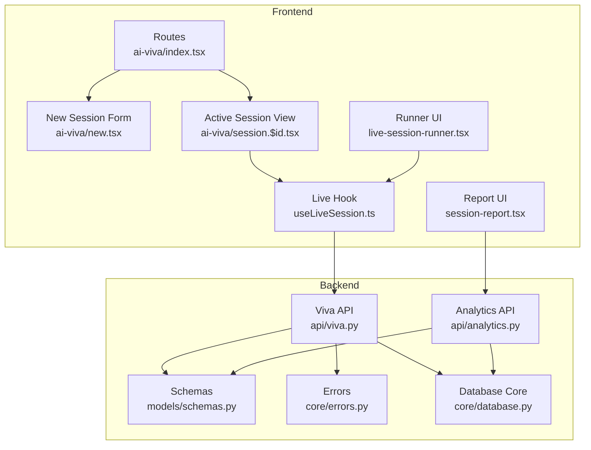
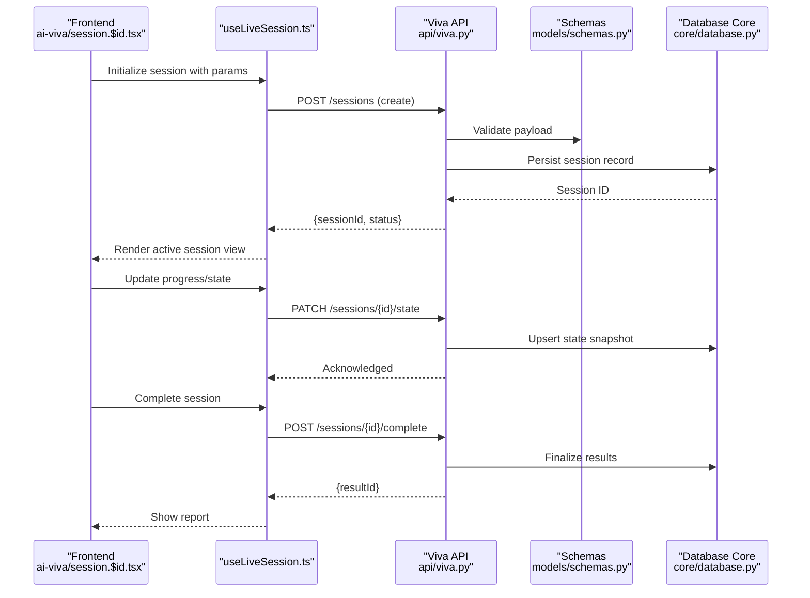
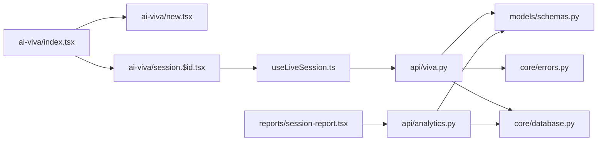

# Session Management

<cite>
**Referenced Files in This Document**
- [backend/api/viva.py](file://backend/api/viva.py)
- [backend/api/analytics.py](file://backend/api/analytics.py)
- [backend/core/errors.py](file://backend/core/errors.py)
- [backend/core/database.py](file://backend/core/database.py)
- [backend/models/schemas.py](file://backend/models/schemas.py)
- [backend/tests/test_viva_sessions.py](file://backend/tests/test_viva_sessions.py)
- [src/routes/ai-viva/index.tsx](file://src/routes/ai-viva/index.tsx)
- [src/routes/ai-viva/new.tsx](file://src/routes/ai-viva/new.tsx)
- [src/routes/ai-viva/session.$id.tsx](file://src/routes/ai-viva/session.$id.tsx)
- [src/lib/useLiveSession.ts](file://src/lib/useLiveSession.ts)
- [src/components/live/live-session-runner.tsx](file://src/components/live/live-session-runner.tsx)
- [src/components/reports/session-report.tsx](file://src/components/reports/session-report.tsx)
</cite>

## Table of Contents
1. [Introduction](#introduction)
2. [Project Structure](#project-structure)
3. [Core Components](#core-components)
4. [Architecture Overview](#architecture-overview)
5. [Detailed Component Analysis](#detailed-component-analysis)
6. [Dependency Analysis](#dependency-analysis)
7. [Performance Considerations](#performance-considerations)
8. [Troubleshooting Guide](#troubleshooting-guide)
9. [Conclusion](#conclusion)
10. [Appendices](#appendices)

## Introduction
This document explains the viva session management system end-to-end, covering the full lifecycle from session creation to completion. It details how sessions are initialized, how participants are managed, how progress is tracked and persisted, and how results are stored and analyzed. It also documents the frontend components for creating new sessions, configuring exam parameters, and managing active sessions, as well as the backend API endpoints for CRUD operations, state synchronization, and data persistence. Finally, it provides examples for customized exam sessions, concurrent session handling, timeouts, analytics retrieval, error handling, recovery strategies, and data migration considerations.

## Project Structure
The viva session management spans both backend and frontend layers:
- Backend: FastAPI-based APIs under backend/api, core utilities (errors, database), models/schemas, and tests.
- Frontend: React routes for AI Viva flows, hooks for live session orchestration, and UI components for session runner and reporting.

**Diagram sources**
- [src/routes/ai-viva/index.tsx](file://src/routes/ai-viva/index.tsx)
- [src/routes/ai-viva/new.tsx](file://src/routes/ai-viva/new.tsx)
- [src/routes/ai-viva/session.$id.tsx](file://src/routes/ai-viva/session.$id.tsx)
- [src/lib/useLiveSession.ts](file://src/lib/useLiveSession.ts)
- [src/components/live/live-session-runner.tsx](file://src/components/live/live-session-runner.tsx)
- [src/components/reports/session-report.tsx](file://src/components/reports/session-report.tsx)
- [backend/api/viva.py](file://backend/api/viva.py)
- [backend/api/analytics.py](file://backend/api/analytics.py)
- [backend/models/schemas.py](file://backend/models/schemas.py)
- [backend/core/errors.py](file://backend/core/errors.py)
- [backend/core/database.py](file://backend/core/database.py)

**Section sources**
- [backend/api/viva.py](file://backend/api/viva.py)
- [backend/api/analytics.py](file://backend/api/analytics.py)
- [backend/models/schemas.py](file://backend/models/schemas.py)
- [backend/core/errors.py](file://backend/core/errors.py)
- [backend/core/database.py](file://backend/core/database.py)
- [src/routes/ai-viva/index.tsx](file://src/routes/ai-viva/index.tsx)
- [src/routes/ai-viva/new.tsx](file://src/routes/ai-viva/new.tsx)
- [src/routes/ai-viva/session.$id.tsx](file://src/routes/ai-viva/session.$id.tsx)
- [src/lib/useLiveSession.ts](file://src/lib/useLiveSession.ts)
- [src/components/live/live-session-runner.tsx](file://src/components/live/live-session-runner.tsx)
- [src/components/reports/session-report.tsx](file://src/components/reports/session-report.tsx)

## Core Components
- Backend API layer:
  - Viva API: defines endpoints for session CRUD, participant management, state sync, and result storage.
  - Analytics API: exposes metrics and summaries for completed or ongoing sessions.
  - Schemas: request/response models and validation rules for session entities.
  - Errors: standardized error types and messages used across endpoints.
  - Database core: connection and query helpers used by services.
- Frontend:
  - Routes: entry points for listing, creating, and viewing viva sessions.
  - Live hook: orchestrates real-time session state, events, and persistence calls.
  - Runner UI: renders the active session flow and controls.
  - Report UI: displays post-session analytics and outcomes.

Key responsibilities:
- Create and configure sessions with exam parameters.
- Manage participants and their roles during a session.
- Track progress and persist intermediate states.
- Store final results and expose analytics.

**Section sources**
- [backend/api/viva.py](file://backend/api/viva.py)
- [backend/api/analytics.py](file://backend/api/analytics.py)
- [backend/models/schemas.py](file://backend/models/schemas.py)
- [backend/core/errors.py](file://backend/core/errors.py)
- [backend/core/database.py](file://backend/core/database.py)
- [src/routes/ai-viva/index.tsx](file://src/routes/ai-viva/index.tsx)
- [src/routes/ai-viva/new.tsx](file://src/routes/ai-viva/new.tsx)
- [src/routes/ai-viva/session.$id.tsx](file://src/routes/ai-viva/session.$id.tsx)
- [src/lib/useLiveSession.ts](file://src/lib/useLiveSession.ts)
- [src/components/live/live-session-runner.tsx](file://src/components/live/live-session-runner.tsx)
- [src/components/reports/session-report.tsx](file://src/components/reports/session-report.tsx)

## Architecture Overview
The system follows a client-server architecture with clear separation between UI, API, and persistence. The frontend uses a dedicated hook to manage session state and communicate with the backend. The backend validates inputs using schemas, persists data via the database core, and returns structured responses. Analytics are served through a separate endpoint set.

**Diagram sources**
- [src/routes/ai-viva/session.$id.tsx](file://src/routes/ai-viva/session.$id.tsx)
- [src/lib/useLiveSession.ts](file://src/lib/useLiveSession.ts)
- [backend/api/viva.py](file://backend/api/viva.py)
- [backend/models/schemas.py](file://backend/models/schemas.py)
- [backend/core/database.py](file://backend/core/database.py)

## Detailed Component Analysis

### Backend API Endpoints (Viva Sessions)
Responsibilities:
- Create, read, update, delete sessions.
- Manage participants and roles.
- Sync partial state snapshots during live sessions.
- Finalize results upon completion.
- Return standardized errors.

Typical endpoints include:
- Create session: POST /sessions
- Get session: GET /sessions/{id}
- Update session: PATCH /sessions/{id}
- Delete session: DELETE /sessions/{id}
- Update state: PATCH /sessions/{id}/state
- Complete session: POST /sessions/{id}/complete
- List participants: GET /sessions/{id}/participants
- Add/remove participant: POST/PATCH /sessions/{id}/participants

Validation and persistence:
- Request/response payloads are validated against schemas.
- Data is persisted via the database core helpers.
- Errors are normalized using the core error module.

**Section sources**
- [backend/api/viva.py](file://backend/api/viva.py)
- [backend/models/schemas.py](file://backend/models/schemas.py)
- [backend/core/errors.py](file://backend/core/errors.py)
- [backend/core/database.py](file://backend/core/database.py)

### Backend Analytics API
Responsibilities:
- Provide session-level metrics and summaries.
- Aggregate performance indicators and outcome distributions.
- Support filtering by date range, user, or session type.

Common endpoints:
- GET /analytics/sessions/{id}
- GET /analytics/sessions?from=&to=&user_id=...

Data sources:
- Reads from persisted session records and results tables via the database core.

**Section sources**
- [backend/api/analytics.py](file://backend/api/analytics.py)
- [backend/core/database.py](file://backend/core/database.py)

### Frontend: New Session Creation and Configuration
- Entry route lists existing sessions and navigates to create a new one.
- New session form collects exam parameters such as duration, difficulty, topics, and participant constraints.
- On submit, the form calls the viva API to create a session and redirects to the active session view.

User interactions:
- Parameter selection and validation before submission.
- Error feedback on invalid configurations.
- Redirect to session view upon successful creation.

**Section sources**
- [src/routes/ai-viva/index.tsx](file://src/routes/ai-viva/index.tsx)
- [src/routes/ai-viva/new.tsx](file://src/routes/ai-viva/new.tsx)
- [backend/api/viva.py](file://backend/api/viva.py)

### Frontend: Active Session Management
- Session view loads session metadata and delegates control to the live hook.
- The live hook manages:
  - Real-time state updates.
  - Progress tracking and periodic persistence.
  - Participant coordination signals.
  - Completion signaling and result retrieval.
- Runner UI renders stage transitions, prompts, and controls based on session state.

Operational behaviors:
- Auto-save state snapshots at intervals or on significant events.
- Graceful reconnection and state reconciliation on network interruptions.
- Timeout handling with warnings and safe fallbacks.

**Section sources**
- [src/routes/ai-viva/session.$id.tsx](file://src/routes/ai-viva/session.$id.tsx)
- [src/lib/useLiveSession.ts](file://src/lib/useLiveSession.ts)
- [src/components/live/live-session-runner.tsx](file://src/components/live/live-session-runner.tsx)
- [backend/api/viva.py](file://backend/api/viva.py)

### Frontend: Reports and Analytics
- After completion, the report UI fetches analytics and renders insights.
- Displays scores, strengths/weaknesses, and recommendations.
- Supports exporting or sharing reports where applicable.

**Section sources**
- [src/components/reports/session-report.tsx](file://src/components/reports/session-report.tsx)
- [backend/api/analytics.py](file://backend/api/analytics.py)

### Data Models and Validation
- Schemas define session attributes, participant entries, state snapshots, and result structures.
- Enforce required fields, enums, and ranges for exam parameters.
- Ensure consistent serialization across frontend and backend.

**Section sources**
- [backend/models/schemas.py](file://backend/models/schemas.py)

### Error Handling Strategy
- Centralized error types and codes for consistent client-side handling.
- HTTP status mapping to actionable messages.
- Retry policies for transient failures; user-facing guidance for recoverable errors.

**Section sources**
- [backend/core/errors.py](file://backend/core/errors.py)

## Dependency Analysis
The following diagram shows key dependencies among modules involved in session management.

**Diagram sources**
- [src/routes/ai-viva/index.tsx](file://src/routes/ai-viva/index.tsx)
- [src/routes/ai-viva/new.tsx](file://src/routes/ai-viva/new.tsx)
- [src/routes/ai-viva/session.$id.tsx](file://src/routes/ai-viva/session.$id.tsx)
- [src/lib/useLiveSession.ts](file://src/lib/useLiveSession.ts)
- [src/components/reports/session-report.tsx](file://src/components/reports/session-report.tsx)
- [backend/api/viva.py](file://backend/api/viva.py)
- [backend/api/analytics.py](file://backend/api/analytics.py)
- [backend/models/schemas.py](file://backend/models/schemas.py)
- [backend/core/errors.py](file://backend/core/errors.py)
- [backend/core/database.py](file://backend/core/database.py)

**Section sources**
- [backend/api/viva.py](file://backend/api/viva.py)
- [backend/api/analytics.py](file://backend/api/analytics.py)
- [backend/models/schemas.py](file://backend/models/schemas.py)
- [backend/core/errors.py](file://backend/core/errors.py)
- [backend/core/database.py](file://backend/core/database.py)
- [src/routes/ai-viva/index.tsx](file://src/routes/ai-viva/index.tsx)
- [src/routes/ai-viva/new.tsx](file://src/routes/ai-viva/new.tsx)
- [src/routes/ai-viva/session.$id.tsx](file://src/routes/ai-viva/session.$id.tsx)
- [src/lib/useLiveSession.ts](file://src/lib/useLiveSession.ts)
- [src/components/reports/session-report.tsx](file://src/components/reports/session-report.tsx)

## Performance Considerations
- Batched state updates: Coalesce frequent state changes into periodic snapshots to reduce write load.
- Idempotent operations: Design create/update endpoints to be idempotent to support retries safely.
- Pagination and filtering: For analytics and session listings, use server-side pagination and filters to limit payload sizes.
- Connection resilience: Implement exponential backoff and reconnection logic in the live hook.
- Indexing: Ensure database indexes on frequently queried fields (e.g., session IDs, timestamps, user IDs).

[No sources needed since this section provides general guidance]

## Troubleshooting Guide
Common issues and resolutions:
- Session creation fails due to invalid parameters:
  - Verify schema constraints and required fields.
  - Check error responses for specific validation messages.
- State not syncing:
  - Inspect network requests and retry behavior.
  - Confirm that PATCH state endpoints accept expected payloads.
- Timeouts during long sessions:
  - Extend timeout thresholds and implement heartbeat checks.
  - Use auto-save to preserve progress.
- Recovery after crash:
  - Rehydrate session state from last persisted snapshot.
  - Resume from last known stable state rather than restarting.
- Analytics discrepancies:
  - Ensure completion endpoint finalizes all results before analytics queries.
  - Validate aggregation logic and time windows.

Relevant implementation references:
- Error definitions and mappings.
- Tests validating session lifecycle and edge cases.

**Section sources**
- [backend/core/errors.py](file://backend/core/errors.py)
- [backend/tests/test_viva_sessions.py](file://backend/tests/test_viva_sessions.py)

## Conclusion
The viva session management system provides a robust, layered architecture for creating, running, and analyzing viva sessions. Clear separation between frontend orchestration and backend services ensures maintainability and scalability. With strong validation, centralized error handling, and resilient state synchronization, the system supports complex exam scenarios, concurrent sessions, and comprehensive analytics.

[No sources needed since this section summarizes without analyzing specific files]

## Appendices

### Example Workflows

#### Creating a Customized Exam Session
- Configure parameters such as duration, difficulty, topics, and participant limits.
- Submit to the create endpoint; receive a session ID.
- Navigate to the active session view and begin the exam.

References:
- [src/routes/ai-viva/new.tsx](file://src/routes/ai-viva/new.tsx)
- [backend/api/viva.py](file://backend/api/viva.py)

#### Managing Multiple Concurrent Sessions
- Each session maintains an independent state and ID.
- The live hook isolates per-session connections and state.
- Use list endpoints to switch between active sessions.

References:
- [src/lib/useLiveSession.ts](file://src/lib/useLiveSession.ts)
- [backend/api/viva.py](file://backend/api/viva.py)

#### Handling Session Timeouts
- Implement heartbeat and idle detection.
- Warn users before expiration and allow extension if permitted.
- Persist last state snapshot prior to timeout.

References:
- [src/lib/useLiveSession.ts](file://src/lib/useLiveSession.ts)
- [backend/api/viva.py](file://backend/api/viva.py)

#### Retrieving Session Analytics
- Fetch analytics for a given session or filtered sets.
- Render insights in the report UI.

References:
- [backend/api/analytics.py](file://backend/api/analytics.py)
- [src/components/reports/session-report.tsx](file://src/components/reports/session-report.tsx)

### Error Handling and Recovery Patterns
- Normalize errors centrally and present actionable messages.
- Retry transient failures with backoff.
- Recover from crashes by loading last snapshot and resuming.

References:
- [backend/core/errors.py](file://backend/core/errors.py)
- [backend/tests/test_viva_sessions.py](file://backend/tests/test_viva_sessions.py)

### Data Migration Scenarios
- When evolving schemas, ensure backward compatibility for clients.
- Introduce versioned endpoints or migration flags.
- Validate data integrity post-migration and provide rollback procedures.

References:
- [backend/models/schemas.py](file://backend/models/schemas.py)
- [backend/core/database.py](file://backend/core/database.py)