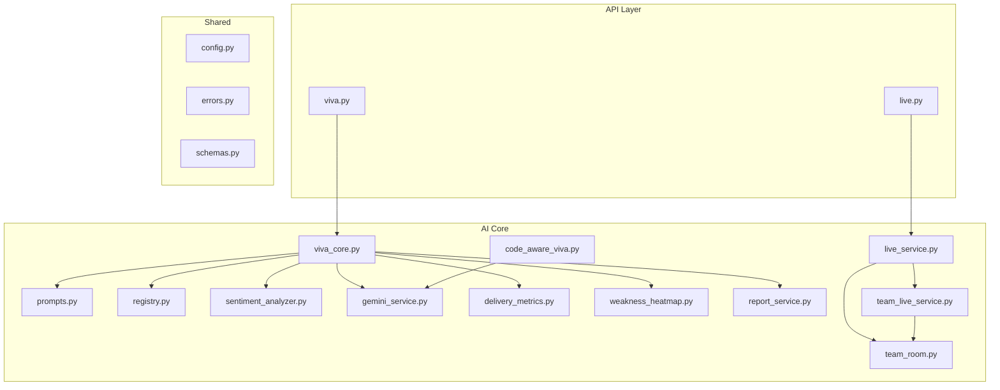
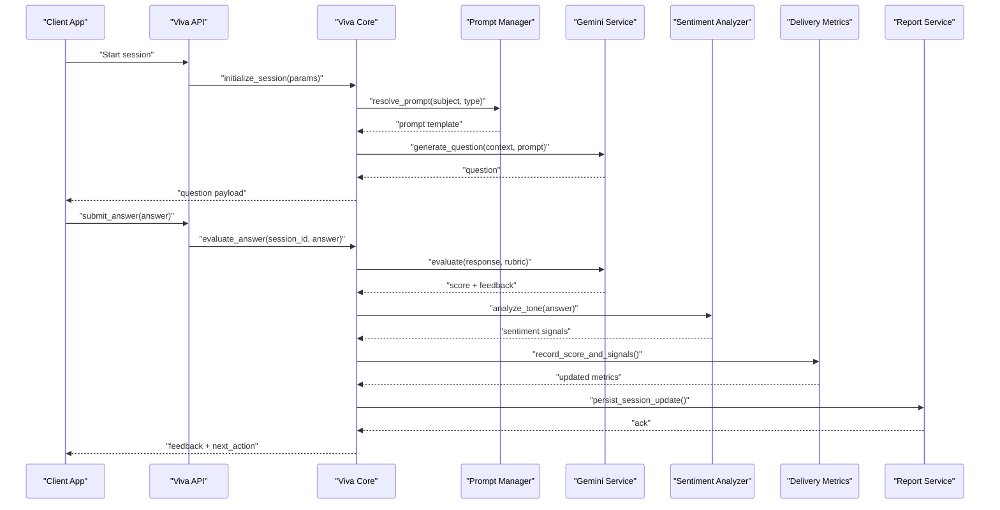
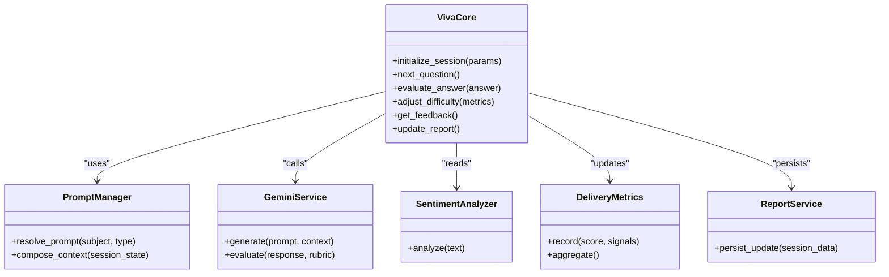
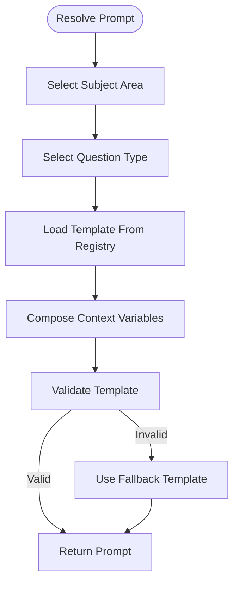
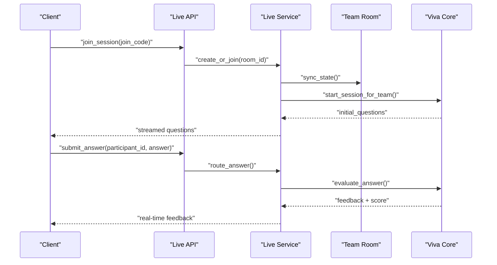
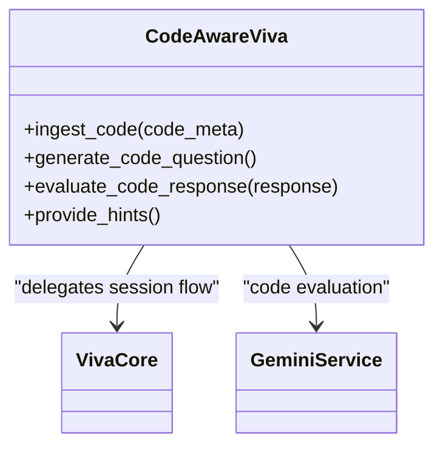
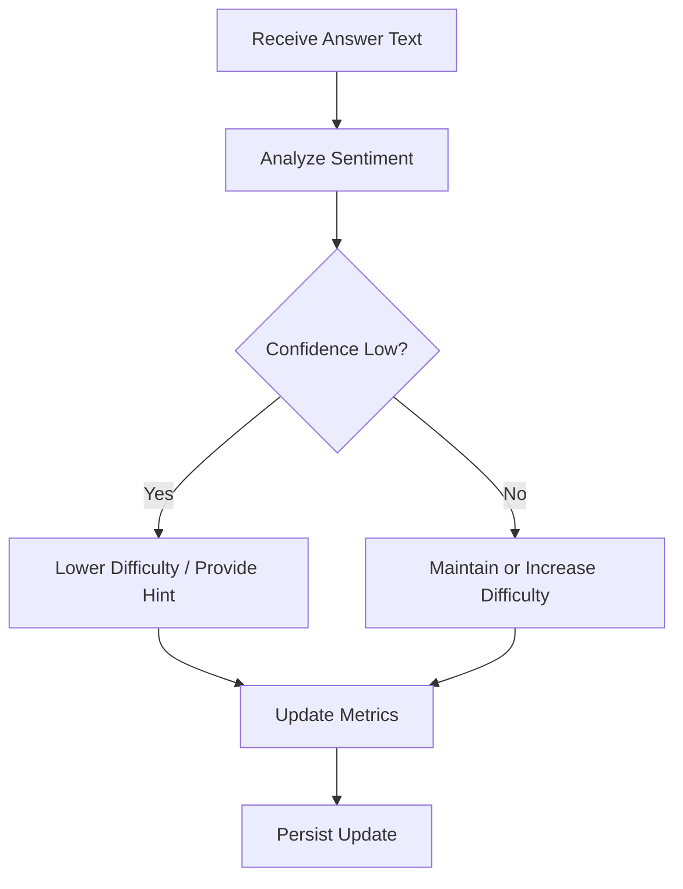
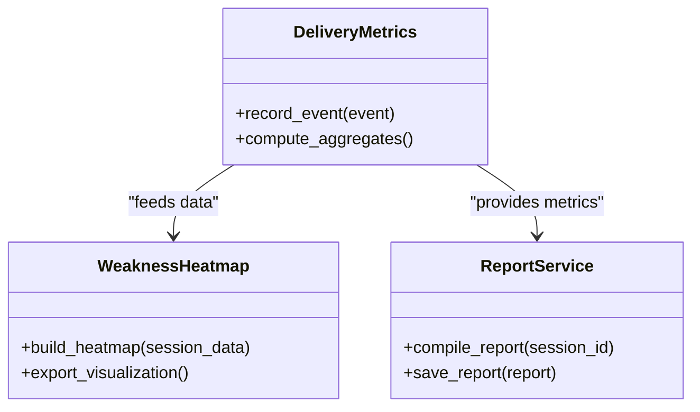
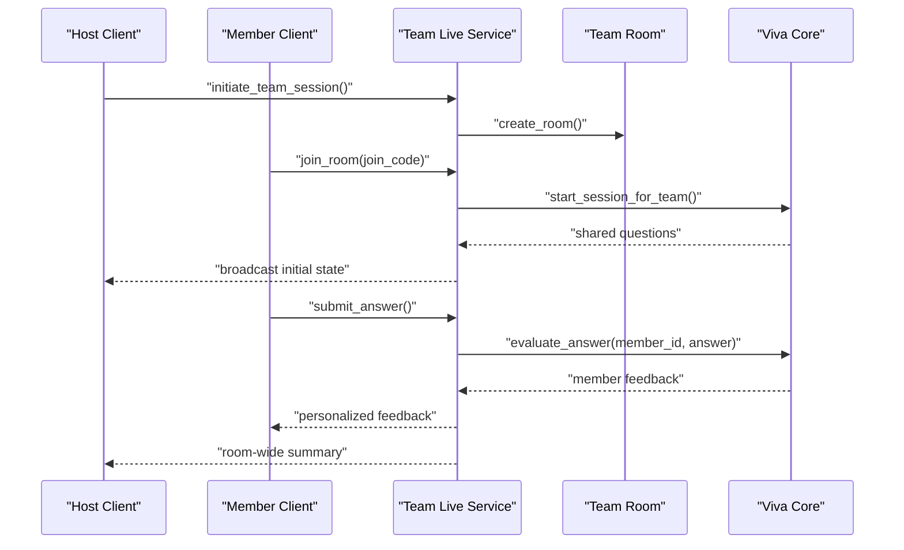
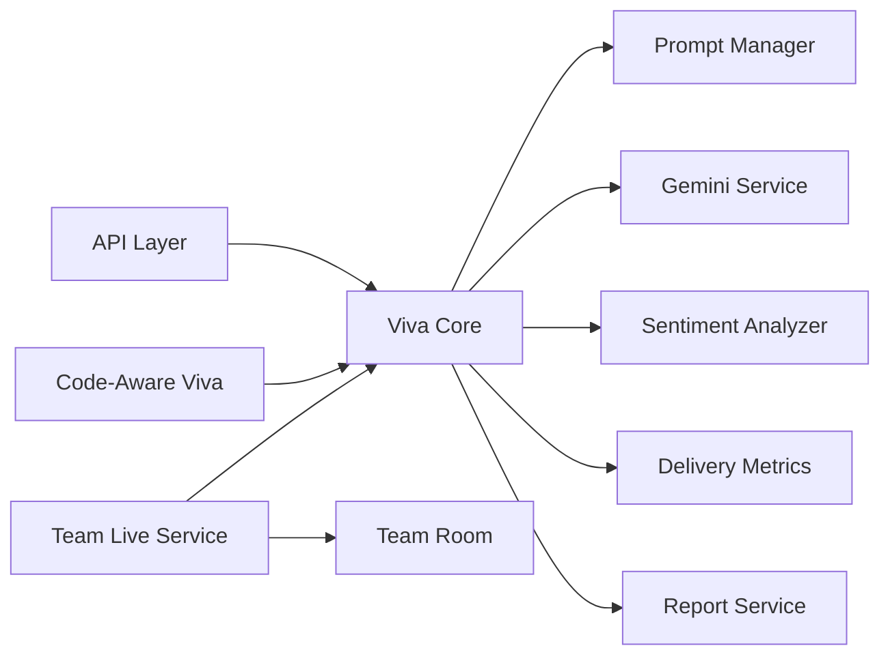

# Viva Core Engine

<cite>
**Referenced Files in This Document**
- [viva_core.py](file://backend/ai/viva_core.py)
- [prompts.py](file://backend/ai/prompts.py)
- [registry.py](file://backend/ai/registry.py)
- [live_service.py](file://backend/ai/live_service.py)
- [code_aware_viva.py](file://backend/ai/code_aware_viva.py)
- [sentiment_analyzer.py](file://backend/ai/sentiment_analyzer.py)
- [gemini_service.py](file://backend/ai/gemini_service.py)
- [delivery_metrics.py](file://backend/ai/delivery_metrics.py)
- [weakness_heatmap.py](file://backend/ai/weakness_heatmap.py)
- [report_service.py](file://backend/ai/report_service.py)
- [team_live_service.py](file://backend/ai/team_live_service.py)
- [team_room.py](file://backend/ai/team_room.py)
- [viva.py](file://backend/api/viva.py)
- [live.py](file://backend/api/live.py)
- [config.py](file://backend/core/config.py)
- [errors.py](file://backend/core/errors.py)
- [schemas.py](file://backend/models/schemas.py)
</cite>

## Table of Contents
1. [Introduction](#introduction)
2. [Project Structure](#project-structure)
3. [Core Components](#core-components)
4. [Architecture Overview](#architecture-overview)
5. [Detailed Component Analysis](#detailed-component-analysis)
6. [Dependency Analysis](#dependency-analysis)
7. [Performance Considerations](#performance-considerations)
8. [Troubleshooting Guide](#troubleshooting-guide)
9. [Conclusion](#conclusion)
10. [Appendices](#appendices)

## Introduction
This document describes the Viva Core Engine, the central processing unit of the AI-powered examination system. It explains how the engine orchestrates question generation, adaptive difficulty adjustment, real-time assessment, and feedback delivery. It also documents the prompt management system across subject areas and question types, configuration options for exam parameters and scoring, and extension points for integrating new domains and evaluation algorithms.

## Project Structure
The Viva Core Engine is implemented primarily under backend/ai with supporting API routes under backend/api and shared configuration and models under backend/core and backend/models. The key modules include:
- Core orchestration and session state
- Prompt templates and registry
- Live session handling and team collaboration
- Code-aware viva flows
- Sentiment analysis and metrics
- External LLM integration
- Reporting and analytics

**Diagram sources**
- [viva.py](file://backend/api/viva.py)
- [live.py](file://backend/api/live.py)
- [viva_core.py](file://backend/ai/viva_core.py)
- [prompts.py](file://backend/ai/prompts.py)
- [registry.py](file://backend/ai/registry.py)
- [live_service.py](file://backend/ai/live_service.py)
- [code_aware_viva.py](file://backend/ai/code_aware_viva.py)
- [sentiment_analyzer.py](file://backend/ai/sentiment_analyzer.py)
- [gemini_service.py](file://backend/ai/gemini_service.py)
- [delivery_metrics.py](file://backend/ai/delivery_metrics.py)
- [weakness_heatmap.py](file://backend/ai/weakness_heatmap.py)
- [report_service.py](file://backend/ai/report_service.py)
- [team_live_service.py](file://backend/ai/team_live_service.py)
- [team_room.py](file://backend/ai/team_room.py)
- [config.py](file://backend/core/config.py)
- [errors.py](file://backend/core/errors.py)
- [schemas.py](file://backend/models/schemas.py)

**Section sources**
- [viva.py](file://backend/api/viva.py)
- [live.py](file://backend/api/live.py)
- [viva_core.py](file://backend/ai/viva_core.py)
- [prompts.py](file://backend/ai/prompts.py)
- [registry.py](file://backend/ai/registry.py)
- [live_service.py](file://backend/ai/live_service.py)
- [code_aware_viva.py](file://backend/ai/code_aware_viva.py)
- [sentiment_analyzer.py](file://backend/ai/sentiment_analyzer.py)
- [gemini_service.py](file://backend/ai/gemini_service.py)
- [delivery_metrics.py](file://backend/ai/delivery_metrics.py)
- [weakness_heatmap.py](file://backend/ai/weakness_heatmap.py)
- [report_service.py](file://backend/ai/report_service.py)
- [team_live_service.py](file://backend/ai/team_live_service.py)
- [team_room.py](file://backend/ai/team_room.py)
- [config.py](file://backend/core/config.py)
- [errors.py](file://backend/core/errors.py)
- [schemas.py](file://backend/models/schemas.py)

## Core Components
- Viva Core Orchestrator: Manages session lifecycle, question flow, difficulty adaptation, and response evaluation.
- Prompt Management System: Centralizes prompts per subject area, question type, and evaluation criteria; supports dynamic composition.
- Live Session Service: Handles real-time interactions, streaming responses, and concurrent participant coordination.
- Code-Aware Viva: Extends core logic to analyze code submissions and provide domain-specific feedback.
- Sentiment Analyzer: Evaluates tone and confidence from textual responses to inform adaptive behavior.
- Metrics and Analytics: Tracks delivery performance, knowledge gaps, and progress over time.
- External LLM Integration: Provides model access for generation and evaluation tasks.
- Team Collaboration: Enables multi-participant sessions with synchronized state and shared artifacts.

**Section sources**
- [viva_core.py](file://backend/ai/viva_core.py)
- [prompts.py](file://backend/ai/prompts.py)
- [registry.py](file://backend/ai/registry.py)
- [live_service.py](file://backend/ai/live_service.py)
- [code_aware_viva.py](file://backend/ai/code_aware_viva.py)
- [sentiment_analyzer.py](file://backend/ai/sentiment_analyzer.py)
- [delivery_metrics.py](file://backend/ai/delivery_metrics.py)
- [weakness_heatmap.py](file://backend/ai/weakness_heatmap.py)
- [report_service.py](file://backend/ai/report_service.py)
- [team_live_service.py](file://backend/ai/team_live_service.py)
- [team_room.py](file://backend/ai/team_room.py)
- [gemini_service.py](file://backend/ai/gemini_service.py)

## Architecture Overview
The Viva Core Engine follows a layered architecture:
- API Layer exposes endpoints for single-user and live sessions.
- Core Engine coordinates prompts, LLM calls, sentiment analysis, and metrics.
- Domain Extensions (e.g., code-aware) plug into the core via well-defined interfaces.
- Persistence and reporting are handled through services that aggregate session data.

**Diagram sources**
- [viva.py](file://backend/api/viva.py)
- [viva_core.py](file://backend/ai/viva_core.py)
- [prompts.py](file://backend/ai/prompts.py)
- [gemini_service.py](file://backend/ai/gemini_service.py)
- [sentiment_analyzer.py](file://backend/ai/sentiment_analyzer.py)
- [delivery_metrics.py](file://backend/ai/delivery_metrics.py)
- [report_service.py](file://backend/ai/report_service.py)

## Detailed Component Analysis

### Viva Core Orchestrator
Responsibilities:
- Session initialization and lifecycle management
- Question generation using resolved prompts and context
- Adaptive difficulty based on performance and sentiment signals
- Evaluation pipeline coordinating LLM scoring and feedback
- Metrics recording and report updates

Key behaviors:
- Resolves subject-specific prompts and question types
- Maintains state for difficulty progression and topic coverage
- Integrates sentiment analysis to refine adaptivity
- Persists incremental results and aggregates metrics

**Diagram sources**
- [viva_core.py](file://backend/ai/viva_core.py)
- [prompts.py](file://backend/ai/prompts.py)
- [gemini_service.py](file://backend/ai/gemini_service.py)
- [sentiment_analyzer.py](file://backend/ai/sentiment_analyzer.py)
- [delivery_metrics.py](file://backend/ai/delivery_metrics.py)
- [report_service.py](file://backend/ai/report_service.py)

**Section sources**
- [viva_core.py](file://backend/ai/viva_core.py)
- [prompts.py](file://backend/ai/prompts.py)
- [gemini_service.py](file://backend/ai/gemini_service.py)
- [sentiment_analyzer.py](file://backend/ai/sentiment_analyzer.py)
- [delivery_metrics.py](file://backend/ai/delivery_metrics.py)
- [report_service.py](file://backend/ai/report_service.py)

### Prompt Management System
Responsibilities:
- Centralized repository of prompts by subject area and question type
- Dynamic composition with contextual variables (session state, user profile)
- Registry-based discovery and validation of prompt templates
- Versioning and fallback strategies for robustness

Integration points:
- Core orchestrator requests prompts for current step
- Code-aware module may inject code-specific context
- Reports can reference prompt versions for traceability

**Diagram sources**
- [prompts.py](file://backend/ai/prompts.py)
- [registry.py](file://backend/ai/registry.py)

**Section sources**
- [prompts.py](file://backend/ai/prompts.py)
- [registry.py](file://backend/ai/registry.py)

### Live Session Service
Responsibilities:
- Real-time session orchestration for single or multiple participants
- Streaming question delivery and answer ingestion
- Coordination with team room state and shared artifacts
- Event-driven updates to clients

**Diagram sources**
- [live.py](file://backend/api/live.py)
- [live_service.py](file://backend/ai/live_service.py)
- [team_room.py](file://backend/ai/team_room.py)
- [viva_core.py](file://backend/ai/viva_core.py)

**Section sources**
- [live.py](file://backend/api/live.py)
- [live_service.py](file://backend/ai/live_service.py)
- [team_room.py](file://backend/ai/team_room.py)
- [viva_core.py](file://backend/ai/viva_core.py)

### Code-Aware Viva Extension
Responsibilities:
- Ingests code snippets and execution metadata
- Generates code-focused questions and evaluates responses against rubrics
- Produces domain-specific feedback and hints

Integration:
- Uses core orchestrator for session control
- Leverages external LLM for code understanding and evaluation

**Diagram sources**
- [code_aware_viva.py](file://backend/ai/code_aware_viva.py)
- [viva_core.py](file://backend/ai/viva_core.py)
- [gemini_service.py](file://backend/ai/gemini_service.py)

**Section sources**
- [code_aware_viva.py](file://backend/ai/code_aware_viva.py)
- [viva_core.py](file://backend/ai/viva_core.py)
- [gemini_service.py](file://backend/ai/gemini_service.py)

### Sentiment Analysis and Adaptive Difficulty
Responsibilities:
- Analyzes textual responses for tone and confidence indicators
- Feeds sentiment signals into adaptive difficulty adjustments
- Helps tailor follow-up questions to reinforce weak areas

**Diagram sources**
- [sentiment_analyzer.py](file://backend/ai/sentiment_analyzer.py)
- [viva_core.py](file://backend/ai/viva_core.py)
- [delivery_metrics.py](file://backend/ai/delivery_metrics.py)

**Section sources**
- [sentiment_analyzer.py](file://backend/ai/sentiment_analyzer.py)
- [viva_core.py](file://backend/ai/viva_core.py)
- [delivery_metrics.py](file://backend/ai/delivery_metrics.py)

### Metrics, Heatmaps, and Reporting
Responsibilities:
- Track delivery performance and session outcomes
- Generate weakness heatmaps to visualize knowledge gaps
- Aggregate and persist reports for review and analytics

**Diagram sources**
- [delivery_metrics.py](file://backend/ai/delivery_metrics.py)
- [weakness_heatmap.py](file://backend/ai/weakness_heatmap.py)
- [report_service.py](file://backend/ai/report_service.py)

**Section sources**
- [delivery_metrics.py](file://backend/ai/delivery_metrics.py)
- [weakness_heatmap.py](file://backend/ai/weakness_heatmap.py)
- [report_service.py](file://backend/ai/report_service.py)

### Team Live Service and Room State
Responsibilities:
- Coordinate multi-participant sessions
- Maintain shared room state and synchronization
- Route answers and feedback per participant while preserving group coherence

**Diagram sources**
- [team_live_service.py](file://backend/ai/team_live_service.py)
- [team_room.py](file://backend/ai/team_room.py)
- [viva_core.py](file://backend/ai/viva_core.py)

**Section sources**
- [team_live_service.py](file://backend/ai/team_live_service.py)
- [team_room.py](file://backend/ai/team_room.py)
- [viva_core.py](file://backend/ai/viva_core.py)

## Dependency Analysis
The engine exhibits clear separation between API, core orchestration, domain extensions, and analytics. Dependencies are primarily unidirectional:
- API depends on AI services
- Core depends on prompt manager, LLM service, sentiment analyzer, metrics, and reporting
- Code-aware and team features extend core without circular dependencies

**Diagram sources**
- [viva.py](file://backend/api/viva.py)
- [live.py](file://backend/api/live.py)
- [viva_core.py](file://backend/ai/viva_core.py)
- [prompts.py](file://backend/ai/prompts.py)
- [gemini_service.py](file://backend/ai/gemini_service.py)
- [sentiment_analyzer.py](file://backend/ai/sentiment_analyzer.py)
- [delivery_metrics.py](file://backend/ai/delivery_metrics.py)
- [report_service.py](file://backend/ai/report_service.py)
- [code_aware_viva.py](file://backend/ai/code_aware_viva.py)
- [team_live_service.py](file://backend/ai/team_live_service.py)
- [team_room.py](file://backend/ai/team_room.py)

**Section sources**
- [viva.py](file://backend/api/viva.py)
- [live.py](file://backend/api/live.py)
- [viva_core.py](file://backend/ai/viva_core.py)
- [prompts.py](file://backend/ai/prompts.py)
- [gemini_service.py](file://backend/ai/gemini_service.py)
- [sentiment_analyzer.py](file://backend/ai/sentiment_analyzer.py)
- [delivery_metrics.py](file://backend/ai/delivery_metrics.py)
- [report_service.py](file://backend/ai/report_service.py)
- [code_aware_viva.py](file://backend/ai/code_aware_viva.py)
- [team_live_service.py](file://backend/ai/team_live_service.py)
- [team_room.py](file://backend/ai/team_room.py)

## Performance Considerations
- Batch operations: Group metric updates and report writes to reduce I/O overhead.
- Streaming responses: Use server-sent events or WebSocket streams for low-latency feedback.
- Prompt caching: Cache resolved prompts and frequently used contexts to minimize recomputation.
- Model call optimization: Implement retry/backoff and request coalescing for LLM calls.
- Concurrency control: Limit parallel evaluations per session to prevent resource contention.
- Memory management: Stream large artifacts (e.g., code diffs) and avoid retaining full transcripts indefinitely.

[No sources needed since this section provides general guidance]

## Troubleshooting Guide
Common issues and resolutions:
- LLM failures: Inspect error codes and implement retries with exponential backoff. Check rate limits and quota usage.
- Prompt resolution errors: Validate registry entries and ensure required variables are present in session context.
- Sentiment analysis anomalies: Normalize input text and handle edge cases like very short responses.
- Live session sync conflicts: Ensure idempotent event processing and conflict resolution strategies in team room state.
- Metric inconsistencies: Verify event ordering and deduplication before aggregation.

Operational references:
- Error definitions and handling patterns
- Configuration toggles for logging and diagnostics
- Schema contracts for request/response payloads

**Section sources**
- [errors.py](file://backend/core/errors.py)
- [config.py](file://backend/core/config.py)
- [schemas.py](file://backend/models/schemas.py)

## Conclusion
The Viva Core Engine provides a robust, extensible foundation for AI-powered examinations. Its modular design enables easy integration of new subjects, question types, and evaluation algorithms. With strong support for real-time interaction, adaptive difficulty, and comprehensive analytics, it delivers immediate, actionable feedback to learners and instructors alike.

[No sources needed since this section summarizes without analyzing specific files]

## Appendices

### Configuration Options
- Exam parameters: number of questions, time limits, topic coverage weights
- Scoring mechanisms: rubric weights, penalty rules, pass thresholds
- Performance metrics: latency targets, throughput goals, error budgets
- Feature flags: enable/disable sentiment analysis, code-aware mode, team features

**Section sources**
- [config.py](file://backend/core/config.py)

### Integration Examples
- Adding a new subject domain:
  - Register new prompt templates and registry entries
  - Extend core orchestrator to recognize subject-specific question types
  - Provide custom evaluation rubrics and feedback generators
- Modifying evaluation algorithms:
  - Swap or augment LLM evaluators via the gemini service interface
  - Integrate additional signals (e.g., code execution results) into scoring
- Extending capabilities:
  - Implement new domain adapters (similar to code-aware viva)
  - Add analytics dashboards by consuming metrics and heatmap outputs

**Section sources**
- [prompts.py](file://backend/ai/prompts.py)
- [registry.py](file://backend/ai/registry.py)
- [viva_core.py](file://backend/ai/viva_core.py)
- [code_aware_viva.py](file://backend/ai/code_aware_viva.py)
- [gemini_service.py](file://backend/ai/gemini_service.py)
- [delivery_metrics.py](file://backend/ai/delivery_metrics.py)
- [weakness_heatmap.py](file://backend/ai/weakness_heatmap.py)