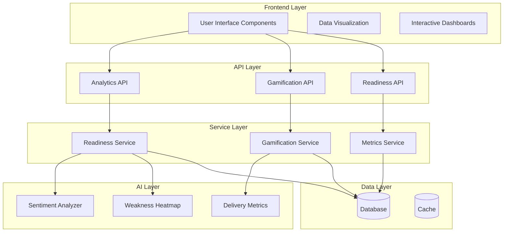
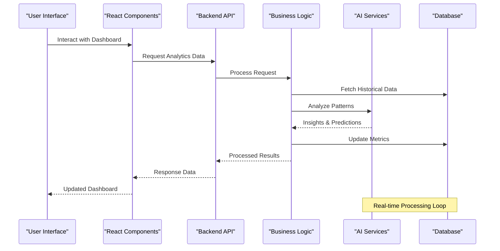
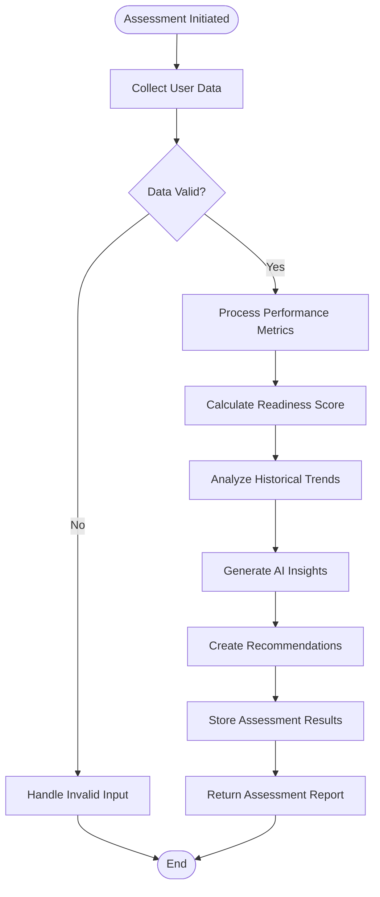
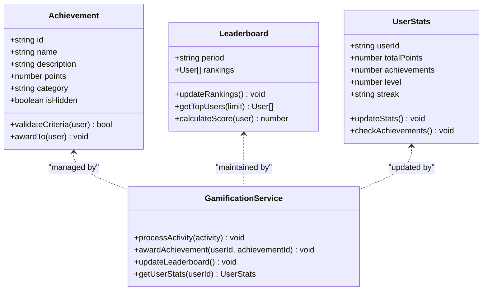
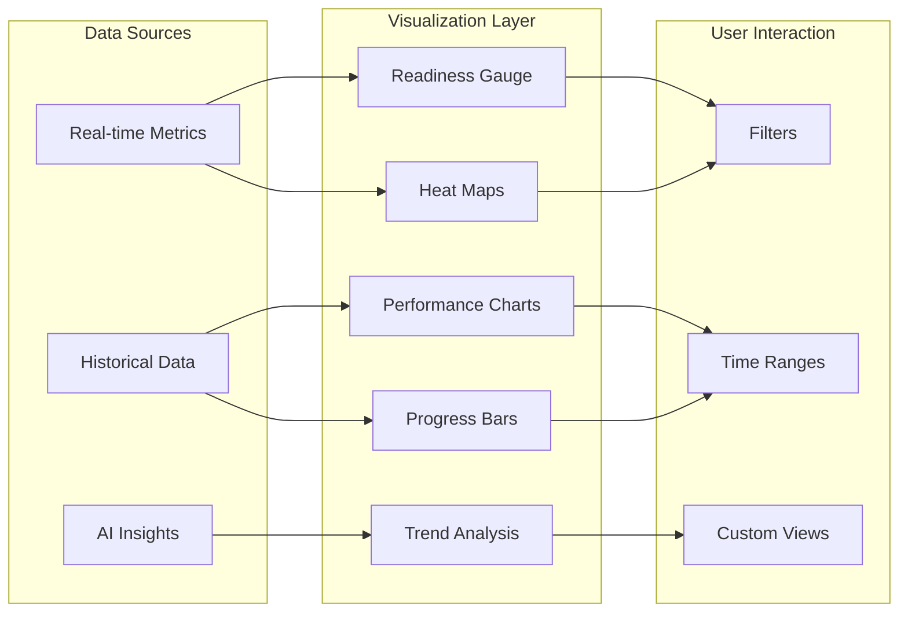
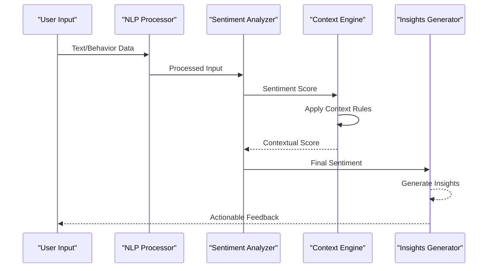
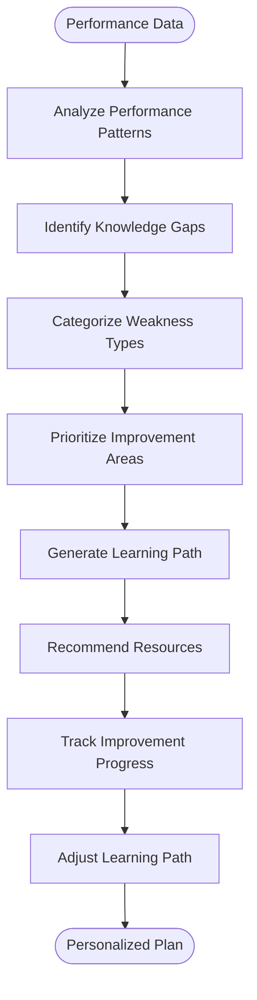
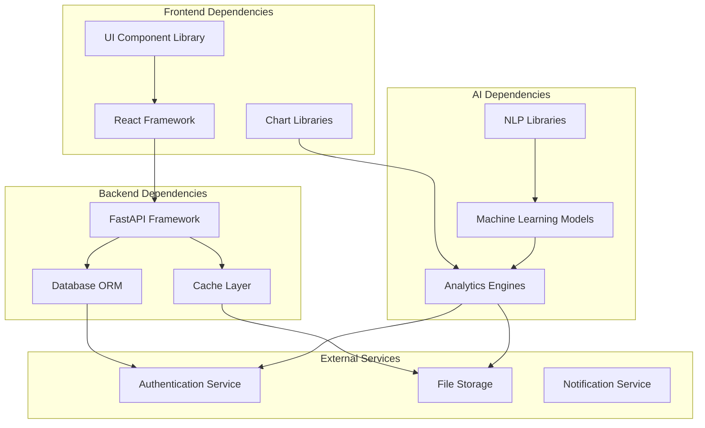

# Analytics & Performance Dashboard

<cite>
**Referenced Files in This Document**
- [backend/api/analytics.py](file://backend/api/analytics.py)
- [backend/api/gamification.py](file://backend/api/gamification.py)
- [backend/services/readiness_service.py](file://backend/services/readiness_service.py)
- [backend/ai/sentiment_analyzer.py](file://backend/ai/sentiment_analyzer.py)
- [backend/ai/weakness_heatmap.py](file://backend/ai/weakness_heatmap.py)
- [src/routes/readiness.tsx](file://src/routes/readiness.tsx)
- [src/routes/leaderboard.tsx](file://src/routes/leaderboard.tsx)
- [src/routes/progress.tsx](file://src/routes/progress.tsx)
- [src/components/readiness-gauge.tsx](file://src/components/readiness-gauge.tsx)
- [src/components/gamification-strip.tsx](file://src/components/gamification-strip.tsx)
- [src/components/achievements-card.tsx](file://src/components/achievements-card.tsx)
- [src/components/ui/chart.tsx](file://src/components/ui/chart.tsx)
- [src/components/ui/progress.tsx](file://src/components/ui/progress.tsx)
- [backend/ai/delivery_metrics.py](file://backend/ai/delivery_metrics.py)
- [backend/services/gamification_service.py](file://backend/services/gamification_service.py)
</cite>

## Table of Contents
1. [Introduction](#introduction)
2. [Project Structure](#project-structure)
3. [Core Components](#core-components)
4. [Architecture Overview](#architecture-overview)
5. [Detailed Component Analysis](#detailed-component-analysis)
6. [Dependency Analysis](#dependency-analysis)
7. [Performance Considerations](#performance-considerations)
8. [Troubleshooting Guide](#troubleshooting-guide)
9. [Conclusion](#conclusion)
10. [Appendices](#appendices)

## Introduction

The Analytics & Performance Dashboard system is a comprehensive platform designed to provide real-time insights into user performance, readiness assessment, and engagement metrics. The system combines advanced analytics, gamification elements, and AI-powered sentiment analysis to deliver personalized learning experiences and actionable insights for improvement strategies.

This documentation covers the complete architecture including the readiness assessment engine, performance metrics calculation, progress tracking algorithms, gamification systems, data visualization components, and AI-driven behavioral insights.

## Project Structure

The system follows a modern full-stack architecture with clear separation between backend services, API endpoints, and frontend components:



**Diagram sources**
- [backend/api/analytics.py](file://backend/api/analytics.py)
- [backend/api/gamification.py](file://backend/api/gamification.py)
- [backend/services/readiness_service.py](file://backend/services/readiness_service.py)

**Section sources**
- [README.md](file://README.md)
- [package.json](file://package.json)

## Core Components

### Readiness Assessment Engine

The readiness assessment engine evaluates user preparedness across multiple dimensions using sophisticated algorithms that consider historical performance, current engagement levels, and predictive indicators.

#### Key Features:
- Multi-dimensional readiness scoring
- Real-time assessment updates
- Historical trend analysis
- Predictive readiness modeling

#### Data Sources:
- Performance history
- Engagement metrics
- Skill assessments
- Behavioral patterns

### Performance Metrics Calculation

The system calculates comprehensive performance metrics through a multi-layered approach that aggregates data from various sources and applies weighted scoring algorithms.

#### Metrics Categories:
- **Technical Performance**: Code quality, delivery speed, error rates
- **Engagement Metrics**: Session duration, interaction frequency, completion rates
- **Learning Progress**: Skill acquisition, knowledge retention, improvement trends
- **Behavioral Indicators**: Consistency, adaptability, problem-solving approaches

### Progress Tracking Algorithms

Progress tracking employs sophisticated algorithms that monitor user advancement across different competency areas while maintaining historical context and providing meaningful feedback.

#### Tracking Mechanisms:
- Real-time progress monitoring
- Milestone achievement detection
- Regression detection and recovery
- Personalized goal setting and tracking

**Section sources**
- [backend/services/readiness_service.py](file://backend/services/readiness_service.py)
- [backend/ai/delivery_metrics.py](file://backend/ai/delivery_metrics.py)

## Architecture Overview

The system architecture follows a microservices pattern with clear separation of concerns and robust data flow management:



**Diagram sources**
- [backend/api/analytics.py](file://backend/api/analytics.py)
- [backend/services/readiness_service.py](file://backend/services/readiness_service.py)
- [backend/ai/sentiment_analyzer.py](file://backend/ai/sentiment_analyzer.py)

## Detailed Component Analysis

### Readiness Assessment Engine

The readiness assessment engine serves as the core analytical component, processing multiple data streams to generate comprehensive readiness scores and recommendations.

#### Assessment Algorithm Flow:



**Diagram sources**
- [backend/services/readiness_service.py](file://backend/services/readiness_service.py)
- [backend/ai/sentiment_analyzer.py](file://backend/ai/sentiment_analyzer.py)

#### Key Components:
- **Data Collection Module**: Aggregates performance data from multiple sources
- **Scoring Engine**: Applies weighted algorithms to calculate readiness scores
- **Trend Analysis**: Identifies patterns and trajectories in user performance
- **Recommendation System**: Generates personalized improvement suggestions

### Gamification System

The gamification system enhances user engagement through achievement tracking, leaderboards, and reward mechanisms that motivate continued participation and improvement.

#### Achievement System Architecture:



**Diagram sources**
- [backend/api/gamification.py](file://backend/api/gamification.py)
- [backend/services/gamification_service.py](file://backend/services/gamification_service.py)

#### Engagement Metrics:
- **Streak Tracking**: Monitors consecutive activity periods
- **Point System**: Awards points for various activities and achievements
- **Level Progression**: Advances users through skill-based levels
- **Social Features**: Enables competition and collaboration

### Data Visualization Components

The visualization layer provides interactive charts, graphs, and dashboards that present complex analytics data in user-friendly formats.

#### Chart Components:



**Diagram sources**
- [src/components/readiness-gauge.tsx](file://src/components/readiness-gauge.tsx)
- [src/components/ui/chart.tsx](file://src/components/ui/chart.tsx)
- [src/components/ui/progress.tsx](file://src/components/ui/progress.tsx)

#### Interactive Features:
- **Dynamic Filtering**: Real-time data filtering and segmentation
- **Zoom and Pan**: Detailed exploration of time series data
- **Cross-referencing**: Correlation between different metrics
- **Export Capabilities**: Data export in multiple formats

### Sentiment Analysis Integration

The sentiment analysis component processes user interactions, feedback, and behavioral patterns to provide insights into emotional states and engagement levels.

#### Sentiment Processing Pipeline:



**Diagram sources**
- [backend/ai/sentiment_analyzer.py](file://backend/ai/sentiment_analyzer.py)

#### Behavioral Insights:
- **Emotional State Detection**: Identifies frustration, confidence, confusion
- **Engagement Level Assessment**: Measures attention and interest
- **Learning Style Recognition**: Adapts to individual preferences
- **Motivation Tracking**: Monitors intrinsic and extrinsic motivation factors

### Weakness Identification System

The weakness identification system analyzes performance patterns to identify areas requiring improvement and generates personalized learning paths.

#### Weakness Detection Algorithm:



**Diagram sources**
- [backend/ai/weakness_heatmap.py](file://backend/ai/weakness_heatmap.py)

#### Personalization Features:
- **Adaptive Difficulty**: Adjusts content complexity based on performance
- **Resource Matching**: Connects users with relevant learning materials
- **Milestone Planning**: Sets achievable short-term goals
- **Progress Monitoring**: Tracks improvement over time

## Dependency Analysis

The system exhibits a well-structured dependency hierarchy with clear separation between layers and minimal coupling:



**Diagram sources**
- [backend/main.py](file://backend/main.py)
- [package.json](file://package.json)

### Coupling Analysis:
- **Low Coupling**: Clear interfaces between modules minimize dependencies
- **High Cohesion**: Related functionality grouped within modules
- **Modular Design**: Independent components enable easy maintenance
- **Service-oriented**: Microservices architecture supports scalability

## Performance Considerations

### Optimization Strategies:
- **Caching Layer**: Redis implementation for frequently accessed data
- **Database Indexing**: Optimized queries for large datasets
- **Lazy Loading**: On-demand resource loading for better performance
- **Async Processing**: Background tasks for heavy computations
- **CDN Integration**: Static asset distribution for faster delivery

### Scalability Features:
- **Horizontal Scaling**: Stateless services support load balancing
- **Database Sharding**: Distributed data storage for large datasets
- **Message Queues**: Asynchronous processing for high-volume operations
- **Microservices**: Independent scaling of service components

## Troubleshooting Guide

### Common Issues and Solutions:

#### Performance Issues:
- **Slow Dashboard Loading**: Check database query optimization and caching effectiveness
- **Real-time Updates Lag**: Verify WebSocket connections and message queue health
- **Memory Leaks**: Monitor application memory usage and garbage collection

#### Data Accuracy Problems:
- **Inconsistent Metrics**: Validate data pipeline integrity and transformation logic
- **Missing Historical Data**: Check data ingestion pipelines and storage reliability
- **Incorrect Calculations**: Review algorithm implementations and edge case handling

#### Integration Failures:
- **API Connection Errors**: Verify endpoint availability and authentication tokens
- **AI Service Timeouts**: Implement retry mechanisms and fallback strategies
- **Database Connectivity**: Monitor connection pools and query timeouts

### Debugging Tools:
- **Logging Framework**: Comprehensive application logging with structured logs
- **Monitoring Dashboard**: Real-time system health and performance metrics
- **Error Tracking**: Automated error detection and alerting
- **Performance Profiling**: Application performance analysis tools

## Conclusion

The Analytics & Performance Dashboard system provides a comprehensive solution for tracking user performance, assessing readiness, and delivering personalized learning experiences. The integration of AI-powered sentiment analysis, gamification elements, and advanced data visualization creates an engaging and insightful platform that adapts to individual user needs.

The modular architecture ensures maintainability and scalability, while the robust error handling and monitoring capabilities provide operational reliability. The system's ability to generate actionable insights and personalized recommendations makes it a valuable tool for continuous learning and improvement.

Future enhancements should focus on expanding AI capabilities, improving real-time processing, and enhancing the personalization algorithms to provide even more accurate and relevant insights.

## Appendices

### Configuration Examples

#### Dashboard Configuration:
```json
{
  "dashboard": {
    "refresh_interval": 30,
    "data_retention_days": 365,
    "cache_ttl": 300,
    "max_users_per_leaderboard": 100,
    "achievement_thresholds": {
      "bronze": 100,
      "silver": 500,
      "gold": 1000,
      "platinum": 2500
    }
  }
}
```

#### Performance Metrics Configuration:
```json
{
  "metrics": {
    "readiness_weights": {
      "technical_performance": 0.4,
      "engagement": 0.3,
      "learning_progress": 0.2,
      "behavioral_indicators": 0.1
    },
    "update_frequency": "real-time",
    "historical_window": "12_months"
  }
}
```

### API Endpoints Reference

#### Analytics Endpoints:
- `GET /api/analytics/readiness` - Get readiness assessment
- `POST /api/analytics/metrics` - Submit performance metrics
- `GET /api/analytics/trends` - Retrieve trend analysis
- `POST /api/analytics/recommendations` - Get personalized recommendations

#### Gamification Endpoints:
- `GET /api/gamification/achievements` - List available achievements
- `POST /api/gamification/award` - Award achievement to user
- `GET /api/gamification/leaderboard` - Get leaderboard rankings
- `GET /api/gamification/stats` - Get user gamification stats

**Section sources**
- [backend/api/analytics.py](file://backend/api/analytics.py)
- [backend/api/gamification.py](file://backend/api/gamification.py)
- [backend/services/readiness_service.py](file://backend/services/readiness_service.py)
- [backend/services/gamification_service.py](file://backend/services/gamification_service.py)