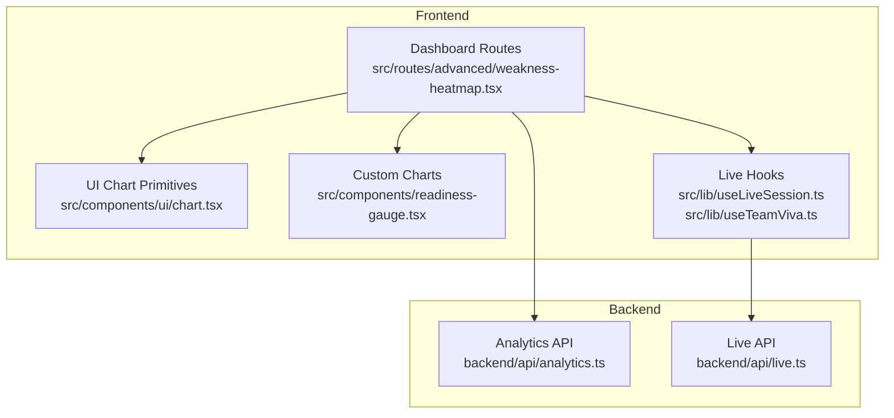
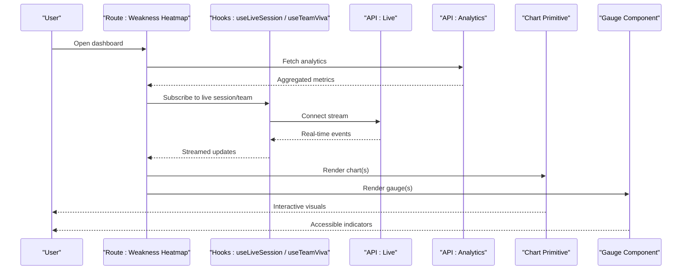
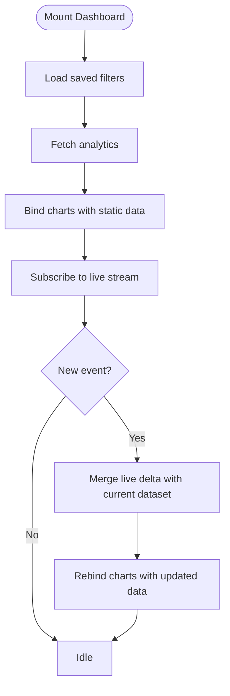
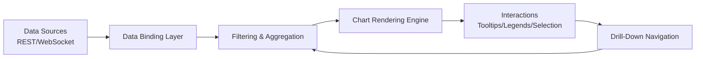
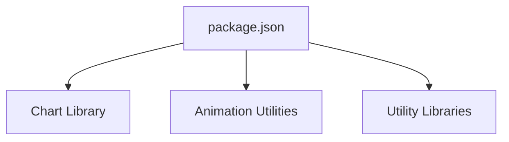

# Data Visualization & Dashboards

<cite>
**Referenced Files in This Document**
- [chart.tsx](file://src/components/ui/chart.tsx)
- [readiness-gauge.tsx](file://src/components/readiness-gauge.tsx)
- [weakness-heatmap.tsx](file://src/routes/advanced/weakness-heatmap.tsx)
- [analytics.ts](file://backend/api/analytics.ts)
- [live.ts](file://backend/api/live.ts)
- [useLiveSession.ts](file://src/lib/useLiveSession.ts)
- [useTeamViva.ts](file://src/lib/useTeamViva.ts)
- [package.json](file://package.json)
</cite>

## Table of Contents
1. [Introduction](#introduction)
2. [Project Structure](#project-structure)
3. [Core Components](#core-components)
4. [Architecture Overview](#architecture-overview)
5. [Detailed Component Analysis](#detailed-component-analysis)
6. [Dependency Analysis](#dependency-analysis)
7. [Performance Considerations](#performance-considerations)
8. [Troubleshooting Guide](#troubleshooting-guide)
9. [Conclusion](#conclusion)
10. [Appendices](#appendices)

## Introduction
This document explains the data visualization and dashboard components across the application, focusing on chart library integration, custom chart implementations, responsive design patterns, dashboard layout, data binding, interactivity (filtering and drill-down), real-time updates, performance optimization for large datasets, accessibility considerations, and cross-browser compatibility strategies. It provides actionable guidance for building custom visualizations and integrating them into dashboards with robust UX and performance characteristics.

## Project Structure
The visualization features are implemented primarily in:
- UI-level chart primitives and reusable components under src/components/ui and src/components
- Route-level dashboards and specialized charts under src/routes
- Backend APIs that supply analytics and live metrics under backend/api
- Client-side hooks for live sessions and team interactions under src/lib

**Diagram sources**
- [chart.tsx](file://src/components/ui/chart.tsx)
- [readiness-gauge.tsx](file://src/components/readiness-gauge.tsx)
- [weakness-heatmap.tsx](file://src/routes/advanced/weakness-heatmap.tsx)
- [analytics.ts](file://backend/api/analytics.ts)
- [live.ts](file://backend/api/live.ts)
- [useLiveSession.ts](file://src/lib/useLiveSession.ts)
- [useTeamViva.ts](file://src/lib/useTeamViva.ts)

**Section sources**
- [chart.tsx](file://src/components/ui/chart.tsx)
- [readiness-gauge.tsx](file://src/components/readiness-gauge.tsx)
- [weakness-heatmap.tsx](file://src/routes/advanced/weakness-heatmap.tsx)
- [analytics.ts](file://backend/api/analytics.ts)
- [live.ts](file://backend/api/live.ts)
- [useLiveSession.ts](file://src/lib/useLiveSession.ts)
- [useTeamViva.ts](file://src/lib/useTeamViva.ts)

## Core Components
- Chart primitives and shared configuration: The UI chart component centralizes chart options, theme integration, and rendering logic used by dashboards.
- Custom gauge visualization: A readiness gauge component encapsulates domain-specific metric display with accessible labels and responsive sizing.
- Dashboard route: A dedicated route composes multiple charts, manages filters, and binds to live or analytics data sources.

Key responsibilities:
- Encapsulate chart configuration and styling
- Provide consistent data contracts for series, categories, and values
- Expose props for interactivity (tooltips, legends, selection)
- Integrate with theme and responsive utilities

**Section sources**
- [chart.tsx](file://src/components/ui/chart.tsx)
- [readiness-gauge.tsx](file://src/components/readiness-gauge.tsx)
- [weakness-heatmap.tsx](file://src/routes/advanced/weakness-heatmap.tsx)

## Architecture Overview
The system follows a layered architecture:
- Presentation layer: React components render charts using a shared chart primitive and custom visualizations.
- Data layer: Client hooks subscribe to live streams and fetch analytics endpoints.
- API layer: Backend endpoints serve aggregated metrics and real-time events.

**Diagram sources**
- [weakness-heatmap.tsx](file://src/routes/advanced/weakness-heatmap.tsx)
- [useLiveSession.ts](file://src/lib/useLiveSession.ts)
- [useTeamViva.ts](file://src/lib/useTeamViva.ts)
- [live.ts](file://backend/api/live.ts)
- [analytics.ts](file://backend/api/analytics.ts)
- [chart.tsx](file://src/components/ui/chart.tsx)
- [readiness-gauge.tsx](file://src/components/readiness-gauge.tsx)

## Detailed Component Analysis

### Chart Library Integration
- Centralized chart primitive: Provides a single entry point for configuring chart types, themes, tooltips, legends, and responsive behavior.
- Theme integration: Uses global theme tokens to ensure consistent colors and typography across charts.
- Data contract: Accepts normalized series arrays with category/value fields, enabling reuse across different dashboards.

Implementation notes:
- Normalize incoming data before passing to the chart primitive to reduce branching inside rendering logic.
- Memoize chart options to avoid unnecessary re-renders when inputs have not changed.
- Debounce resize handlers to maintain smooth responsiveness.

**Section sources**
- [chart.tsx](file://src/components/ui/chart.tsx)

### Custom Gauge Visualization
- Purpose: Display readiness or progress metrics with clear, accessible indicators.
- Features:
  - Responsive arc or bar rendering based on container size
  - Semantic labeling for screen readers
  - Color thresholds mapped to status semantics (e.g., low, medium, high)
- Props:
  - Value and range
  - Label text and aria attributes
  - Optional threshold markers and tooltip content

Accessibility:
- Provide aria-valuenow, aria-valuemin, aria-valuemax, and aria-label equivalents.
- Ensure sufficient color contrast and offer non-color cues where applicable.

**Section sources**
- [readiness-gauge.tsx](file://src/components/readiness-gauge.tsx)

### Dashboard Route: Weakness Heatmap
- Composition: Orchestrates multiple chart instances and gauges, applies filters, and binds to both analytics and live data.
- Interactivity:
  - Filters by time window, category, or team
  - Drill-down via click handlers that update query parameters or navigate to detail views
- Data binding:
  - Reads from analytics endpoint for historical context
  - Subscribes to live events for near-real-time updates
- State management:
  - Local state for active filters and selected segments
  - Derived state for filtered datasets passed to charts

**Diagram sources**
- [weakness-heatmap.tsx](file://src/routes/advanced/weakness-heatmap.tsx)
- [analytics.ts](file://backend/api/analytics.ts)
- [live.ts](file://backend/api/live.ts)
- [useLiveSession.ts](file://src/lib/useLiveSession.ts)
- [useTeamViva.ts](file://src/lib/useTeamViva.ts)

**Section sources**
- [weakness-heatmap.tsx](file://src/routes/advanced/weakness-heatmap.tsx)
- [analytics.ts](file://backend/api/analytics.ts)
- [live.ts](file://backend/api/live.ts)
- [useLiveSession.ts](file://src/lib/useLiveSession.ts)
- [useTeamViva.ts](file://src/lib/useTeamViva.ts)

### Conceptual Overview
The following conceptual diagram illustrates how dashboards typically integrate chart libraries, manage data flows, and expose interactive features without mapping to specific files.

[No sources needed since this diagram shows conceptual workflow, not actual code structure]

## Dependency Analysis
External dependencies relevant to visualization include the charting library and any animation or utility packages. Review package.json to confirm versions and peer dependencies.

**Diagram sources**
- [package.json](file://package.json)

**Section sources**
- [package.json](file://package.json)

## Performance Considerations
- Data normalization: Preprocess datasets to flat structures with stable IDs to minimize diffing overhead during updates.
- Virtualization: For large lists or dense heatmaps, consider virtualizing rows/columns to limit DOM nodes.
- Memoization: Use memoized selectors and chart option objects to prevent redundant renders.
- Throttling/debouncing: Apply to resize and scroll events; debounce filter changes to batch updates.
- Incremental updates: Prefer patching existing series rather than full re-renders when receiving live deltas.
- Canvas/SVG trade-offs: Choose canvas for very large datasets; SVG for rich interactivity at moderate scales.
- Memory management: Dispose of subscriptions and cancel pending requests on unmount to prevent leaks.

[No sources needed since this section provides general guidance]

## Troubleshooting Guide
Common issues and resolutions:
- No data displayed: Verify API responses and data shape; ensure normalization matches chart expectations.
- Stale filters: Clear local storage or reset state on navigation; validate derived state computations.
- Live stream interruptions: Implement reconnection logic with exponential backoff; surface connection status to users.
- Accessibility failures: Confirm aria attributes and keyboard navigation; test with screen readers.
- Cross-browser inconsistencies: Normalize CSS transforms and font rendering; polyfill missing APIs if necessary.

Operational checks:
- Inspect network payloads for analytics and live endpoints.
- Validate event ordering and deduplicate incoming live messages.
- Log chart option diffs to identify unexpected re-renders.

**Section sources**
- [analytics.ts](file://backend/api/analytics.ts)
- [live.ts](file://backend/api/live.ts)
- [useLiveSession.ts](file://src/lib/useLiveSession.ts)
- [useTeamViva.ts](file://src/lib/useTeamViva.ts)

## Conclusion
The visualization stack combines a centralized chart primitive, domain-specific components like the readiness gauge, and route-level dashboards that bind to analytics and live data. By normalizing data, memoizing configurations, and implementing incremental updates, dashboards remain performant and interactive. Accessibility and cross-browser strategies ensure inclusive and reliable experiences across devices and browsers.

[No sources needed since this section summarizes without analyzing specific files]

## Appendices

### Creating a Custom Visualization
Steps:
- Define a data contract (series, categories, values).
- Build a component that accepts normalized data and exposes props for interactivity.
- Integrate with the chart primitive for consistent theming and responsiveness.
- Add semantic labels and keyboard support for accessibility.
- Wrap with a hook to fetch and update data incrementally.

[No sources needed since this section provides general guidance]

### Implementing Real-Time Updates
Patterns:
- Subscribe to live endpoints via hooks.
- Merge deltas into existing datasets while preserving order and IDs.
- Debounce frequent updates and coalesce multiple events into a single render cycle.
- Surface connection health and allow manual refresh.

**Section sources**
- [useLiveSession.ts](file://src/lib/useLiveSession.ts)
- [useTeamViva.ts](file://src/lib/useTeamViva.ts)
- [live.ts](file://backend/api/live.ts)

### Optimizing for Large Datasets
Recommendations:
- Aggregate data server-side when possible.
- Paginate or slice datasets client-side for initial loads.
- Use virtual scrolling for tabular overlays behind charts.
- Limit tooltip payload sizes and lazy-load details on demand.

[No sources needed since this section provides general guidance]

### Accessibility Checklist
- Provide descriptive labels and roles for all visual elements.
- Ensure focus management and keyboard operability for controls.
- Maintain color contrast ratios and provide alternative indicators.
- Announce dynamic updates via live regions or announcements.

[No sources needed since this section provides general guidance]

### Cross-Browser Compatibility Strategies
- Normalize CSS resets and typography.
- Test touch gestures and pointer events across platforms.
- Polyfill or feature-detect advanced APIs used by the chart engine.
- Gracefully degrade complex animations on lower-end devices.

[No sources needed since this section provides general guidance]