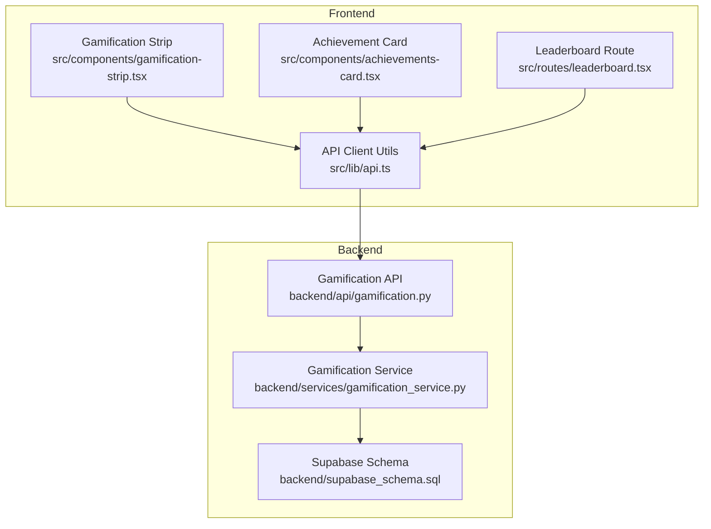
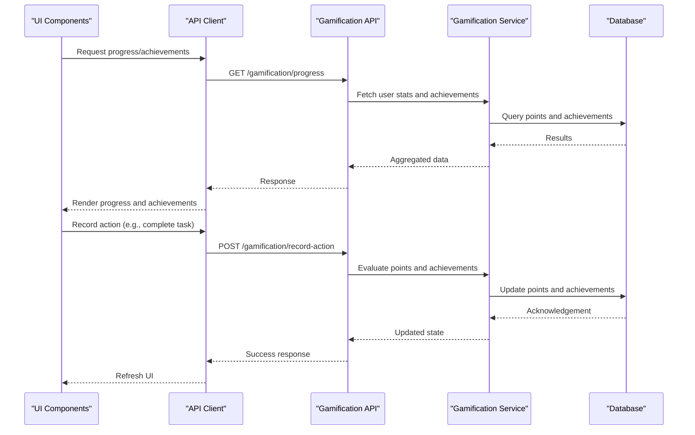
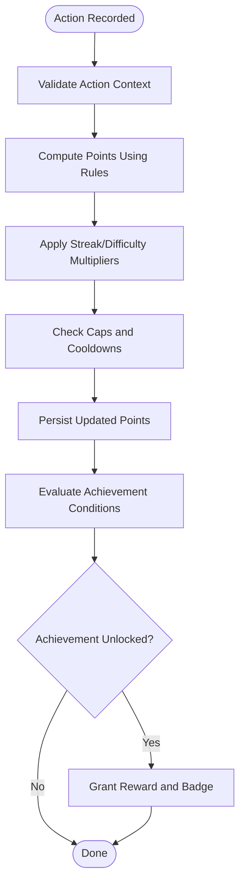
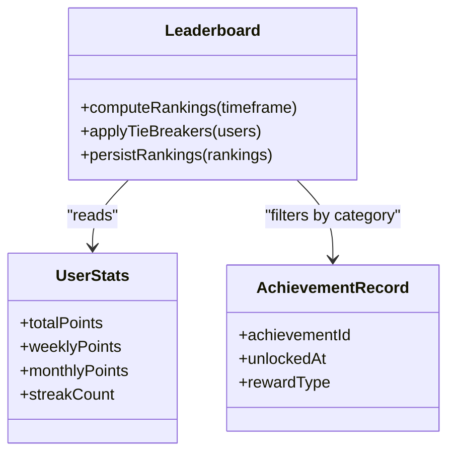
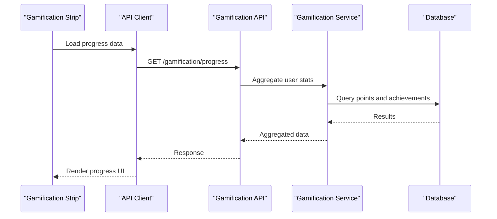
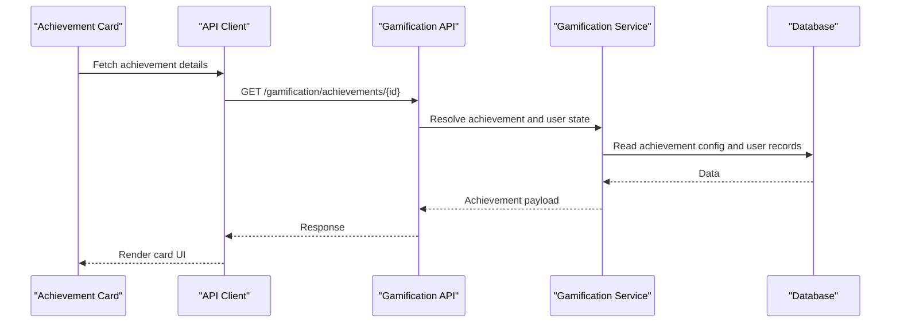
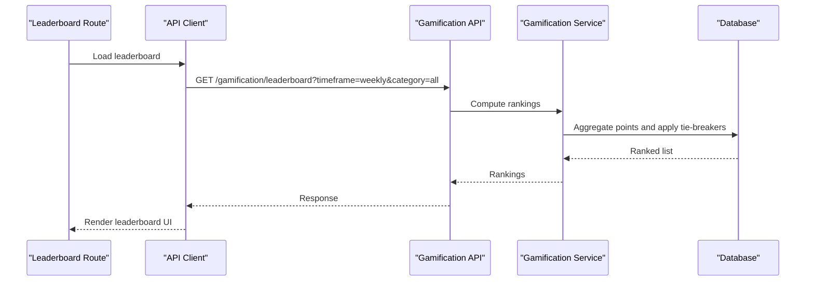
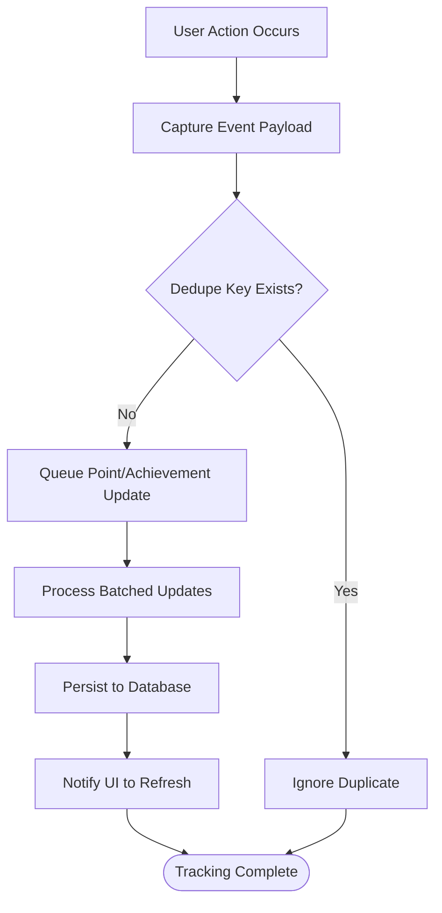
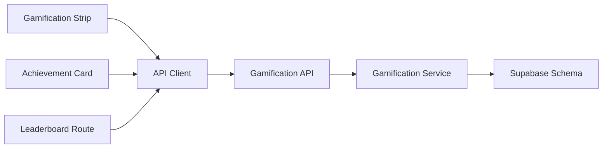

# Gamification & Engagement System

<cite>
**Referenced Files in This Document**
- [gamification.py](file://backend/api/gamification.py)
- [gamification_service.py](file://backend/services/gamification_service.py)
- [supabase_schema.sql](file://backend/supabase_schema.sql)
- [gamification-strip.tsx](file://src/components/gamification-strip.tsx)
- [achievements-card.tsx](file://src/components/achievements-card.tsx)
- [leaderboard.tsx](file://src/routes/leaderboard.tsx)
- [api.ts](file://src/lib/api.ts)
</cite>

## Table of Contents
1. [Introduction](#introduction)
2. [Project Structure](#project-structure)
3. [Core Components](#core-components)
4. [Architecture Overview](#architecture-overview)
5. [Detailed Component Analysis](#detailed-component-analysis)
6. [Dependency Analysis](#dependency-analysis)
7. [Performance Considerations](#performance-considerations)
8. [Troubleshooting Guide](#troubleshooting-guide)
9. [Conclusion](#conclusion)
10. [Appendices](#appendices)

## Introduction
This document explains the gamification and engagement system, focusing on:
- Achievement engine and point calculation algorithms
- Leaderboard ranking systems
- Frontend components: gamification strip and achievement card
- Engagement tracking mechanisms
- Integration patterns for adding gamification to existing features
- Strategies for maintaining user engagement through progressive challenges and rewards

The system is implemented with a backend API and service layer that compute points, track achievements, and rank users, alongside React components that render progress indicators, achievement cards, and leaderboards.

## Project Structure
Gamification-related code spans both backend and frontend:
- Backend API endpoint for gamification operations
- Service layer implementing achievement evaluation and point calculations
- Database schema defining entities for points, achievements, and rankings
- Frontend components for displaying progress and achievements
- A leaderboard route for browsing rankings
- Shared API client utilities used by frontend components

**Diagram sources**
- [gamification-strip.tsx](file://src/components/gamification-strip.tsx)
- [achievements-card.tsx](file://src/components/achievements-card.tsx)
- [leaderboard.tsx](file://src/routes/leaderboard.tsx)
- [api.ts](file://src/lib/api.ts)
- [gamification.py](file://backend/api/gamification.py)
- [gamification_service.py](file://backend/services/gamification_service.py)
- [supabase_schema.sql](file://backend/supabase_schema.sql)

**Section sources**
- [gamification.py](file://backend/api/gamification.py)
- [gamification_service.py](file://backend/services/gamification_service.py)
- [supabase_schema.sql](file://backend/supabase_schema.sql)
- [gamification-strip.tsx](file://src/components/gamification-strip.tsx)
- [achievements-card.tsx](file://src/components/achievements-card.tsx)
- [leaderboard.tsx](file://src/routes/leaderboard.tsx)
- [api.ts](file://src/lib/api.ts)

## Core Components
- Gamification API: Exposes endpoints to record actions, evaluate achievements, and retrieve rankings. It coordinates with the service layer for business logic.
- Gamification Service: Implements point calculation rules, achievement checks, and leaderboard computations. It persists data via the database schema.
- Database Schema: Defines tables for user points, achievements, and rankings, including constraints and indexes for performance.
- Gamification Strip: Displays current progress toward goals and recent milestones at a glance.
- Achievement Card: Renders individual achievement details, status, and reward information.
- Leaderboard Route: Presents ranked users based on computed scores or points.
- API Client Utilities: Provides typed calls to backend endpoints from frontend components.

Key responsibilities:
- Point accumulation and validation
- Achievement condition evaluation
- Ranking computation and updates
- UI rendering of progress and achievements
- Data synchronization between client and server

**Section sources**
- [gamification.py](file://backend/api/gamification.py)
- [gamification_service.py](file://backend/services/gamification_service.py)
- [supabase_schema.sql](file://backend/supabase_schema.sql)
- [gamification-strip.tsx](file://src/components/gamification-strip.tsx)
- [achievements-card.tsx](file://src/components/achievements-card.tsx)
- [leaderboard.tsx](file://src/routes/leaderboard.tsx)
- [api.ts](file://src/lib/api.ts)

## Architecture Overview
The system follows a layered architecture:
- Frontend components call the API client to interact with backend endpoints.
- The API layer validates requests and delegates to the service layer.
- The service layer applies point algorithms and achievement rules, then persists results to the database.
- Rankings are computed and exposed via dedicated endpoints.

**Diagram sources**
- [gamification.py](file://backend/api/gamification.py)
- [gamification_service.py](file://backend/services/gamification_service.py)
- [supabase_schema.sql](file://backend/supabase_schema.sql)
- [api.ts](file://src/lib/api.ts)
- [gamification-strip.tsx](file://src/components/gamification-strip.tsx)
- [achievements-card.tsx](file://src/components/achievements-card.tsx)

## Detailed Component Analysis

### Achievement Engine and Point Calculation
The achievement engine evaluates conditions against user activity and updates points accordingly. Points are calculated using defined algorithms that may include:
- Base points per action type
- Multipliers for streaks or difficulty
- Caps and cooldowns to prevent abuse
- Cumulative thresholds for tiered achievements

**Diagram sources**
- [gamification_service.py](file://backend/services/gamification_service.py)
- [supabase_schema.sql](file://backend/supabase_schema.sql)

**Section sources**
- [gamification_service.py](file://backend/services/gamification_service.py)
- [supabase_schema.sql](file://backend/supabase_schema.sql)

### Leaderboard Ranking Systems
Leaderboards rank users based on aggregated scores or points. Ranking strategies include:
- Total points over all time
- Weekly or monthly rolling windows
- Category-specific rankings (e.g., by team or project)
- Tie-breaking rules (e.g., recency, consistency)

**Diagram sources**
- [gamification_service.py](file://backend/services/gamification_service.py)
- [supabase_schema.sql](file://backend/supabase_schema.sql)

**Section sources**
- [gamification_service.py](file://backend/services/gamification_service.py)
- [supabase_schema.sql](file://backend/supabase_schema.sql)

### Gamification Strip Component
The gamification strip provides a compact view of current progress and recent milestones. It integrates with the API client to fetch real-time data and renders:
- Current points and target thresholds
- Progress bars toward next achievements
- Quick links to detailed achievement views

**Diagram sources**
- [gamification-strip.tsx](file://src/components/gamification-strip.tsx)
- [api.ts](file://src/lib/api.ts)
- [gamification.py](file://backend/api/gamification.py)
- [gamification_service.py](file://backend/services/gamification_service.py)
- [supabase_schema.sql](file://backend/supabase_schema.sql)

**Section sources**
- [gamification-strip.tsx](file://src/components/gamification-strip.tsx)
- [api.ts](file://src/lib/api.ts)
- [gamification.py](file://backend/api/gamification.py)
- [gamification_service.py](file://backend/services/gamification_service.py)
- [supabase_schema.sql](file://backend/supabase_schema.sql)

### Achievement Card Implementation
The achievement card displays an individual achievement’s details, including:
- Title and description
- Status (completed, in-progress, locked)
- Reward type and value
- Progress indicator if applicable

It uses the API client to load achievement metadata and user completion state.

**Diagram sources**
- [achievements-card.tsx](file://src/components/achievements-card.tsx)
- [api.ts](file://src/lib/api.ts)
- [gamification.py](file://backend/api/gamification.py)
- [gamification_service.py](file://backend/services/gamification_service.py)
- [supabase_schema.sql](file://backend/supabase_schema.sql)

**Section sources**
- [achievements-card.tsx](file://src/components/achievements-card.tsx)
- [api.ts](file://src/lib/api.ts)
- [gamification.py](file://backend/api/gamification.py)
- [gamification_service.py](file://backend/services/gamification_service.py)
- [supabase_schema.sql](file://backend/supabase_schema.sql)

### Leaderboard Route
The leaderboard route presents ranked users and supports filtering by timeframe and category. It leverages the API client to request leaderboard data and renders interactive lists with sorting options.

**Diagram sources**
- [leaderboard.tsx](file://src/routes/leaderboard.tsx)
- [api.ts](file://src/lib/api.ts)
- [gamification.py](file://backend/api/gamification.py)
- [gamification_service.py](file://backend/services/gamification_service.py)
- [supabase_schema.sql](file://backend/supabase_schema.sql)

**Section sources**
- [leaderboard.tsx](file://src/routes/leaderboard.tsx)
- [api.ts](file://src/lib/api.ts)
- [gamification.py](file://backend/api/gamification.py)
- [gamification_service.py](file://backend/services/gamification_service.py)
- [supabase_schema.sql](file://backend/supabase_schema.sql)

### Engagement Tracking Mechanisms
Engagement tracking captures user actions that contribute to points and achievements. Patterns include:
- Event-driven recording of meaningful interactions
- Batched updates to reduce write overhead
- Idempotency keys to avoid duplicate scoring
- Audit logs for fairness and dispute resolution

**Diagram sources**
- [gamification_service.py](file://backend/services/gamification_service.py)
- [supabase_schema.sql](file://backend/supabase_schema.sql)

**Section sources**
- [gamification_service.py](file://backend/services/gamification_service.py)
- [supabase_schema.sql](file://backend/supabase_schema.sql)

## Dependency Analysis
The following diagram shows dependencies among key modules:

**Diagram sources**
- [gamification-strip.tsx](file://src/components/gamification-strip.tsx)
- [achievements-card.tsx](file://src/components/achievements-card.tsx)
- [leaderboard.tsx](file://src/routes/leaderboard.tsx)
- [api.ts](file://src/lib/api.ts)
- [gamification.py](file://backend/api/gamification.py)
- [gamification_service.py](file://backend/services/gamification_service.py)
- [supabase_schema.sql](file://backend/supabase_schema.sql)

**Section sources**
- [gamification-strip.tsx](file://src/components/gamification-strip.tsx)
- [achievements-card.tsx](file://src/components/achievements-card.tsx)
- [leaderboard.tsx](file://src/routes/leaderboard.tsx)
- [api.ts](file://src/lib/api.ts)
- [gamification.py](file://backend/api/gamification.py)
- [gamification_service.py](file://backend/services/gamification_service.py)
- [supabase_schema.sql](file://backend/supabase_schema.sql)

## Performance Considerations
- Use indexes on frequently queried columns (user_id, timestamp, category) to speed up leaderboard and progress queries.
- Cache aggregated stats for short periods to reduce database load during high traffic.
- Implement pagination and limit clauses for leaderboard endpoints.
- Prefer batch writes for multiple point updates to minimize round trips.
- Avoid recalculating entire leaderboards; use incremental updates where possible.

[No sources needed since this section provides general guidance]

## Troubleshooting Guide
Common issues and resolutions:
- Duplicate point awards: Ensure idempotency keys are enforced and deduplication logic runs before persistence.
- Inconsistent leaderboard ranks: Verify tie-breaking rules and windowing logic; confirm that updates are applied atomically.
- UI not reflecting latest achievements: Add explicit refresh triggers after successful point updates and handle optimistic updates carefully.
- High latency on progress queries: Add caching layers and optimize SQL queries with appropriate indexes.

**Section sources**
- [gamification_service.py](file://backend/services/gamification_service.py)
- [supabase_schema.sql](file://backend/supabase_schema.sql)

## Conclusion
The gamification and engagement system combines robust backend logic with intuitive frontend components to drive user motivation through points, achievements, and leaderboards. By following the integration patterns and performance recommendations outlined here, teams can extend gamification across features while maintaining fair and engaging experiences.

[No sources needed since this section summarizes without analyzing specific files]

## Appendices

### Defining New Achievements
Steps:
- Define achievement criteria in the service configuration or database schema.
- Implement condition checks within the achievement evaluation flow.
- Assign base points and optional multipliers tied to difficulty or rarity.
- Wire UI components to display new achievements and their statuses.

**Section sources**
- [gamification_service.py](file://backend/services/gamification_service.py)
- [supabase_schema.sql](file://backend/supabase_schema.sql)
- [achievements-card.tsx](file://src/components/achievements-card.tsx)

### Configuring Reward Systems
Guidelines:
- Centralize reward definitions to ensure consistent application across achievements.
- Support different reward types (badges, access unlocks, cosmetic items).
- Enforce caps and cooldowns to balance progression.
- Log reward grants for auditability.

**Section sources**
- [gamification_service.py](file://backend/services/gamification_service.py)
- [supabase_schema.sql](file://backend/supabase_schema.sql)

### Customizing Leaderboards
Options:
- Timeframes: daily, weekly, monthly, all-time.
- Categories: global, team-based, project-based.
- Tie-breakers: recency, consistency, diversity of actions.
- Filters: role, region, cohort.

**Section sources**
- [gamification_service.py](file://backend/services/gamification_service.py)
- [leaderboard.tsx](file://src/routes/leaderboard.tsx)
- [supabase_schema.sql](file://backend/supabase_schema.sql)

### Integration Patterns for Existing Features
Patterns:
- Emit events from feature flows to the gamification service upon meaningful completions.
- Use middleware or hooks to capture actions consistently.
- Provide UI feedback (toast, progress update) when points or achievements change.
- Maintain backward compatibility by versioning achievement rules.

**Section sources**
- [gamification.py](file://backend/api/gamification.py)
- [gamification_service.py](file://backend/services/gamification_service.py)
- [api.ts](file://src/lib/api.ts)

### Strategies for Progressive Challenges and Rewards
Recommendations:
- Design a progression curve with increasing difficulty and escalating rewards.
- Introduce streak bonuses to encourage regular participation.
- Offer milestone badges to mark significant accomplishments.
- Provide visible progress indicators to sustain motivation.

[No sources needed since this section provides general guidance]