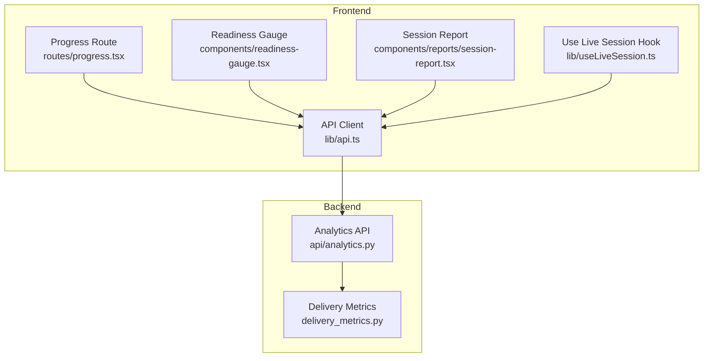
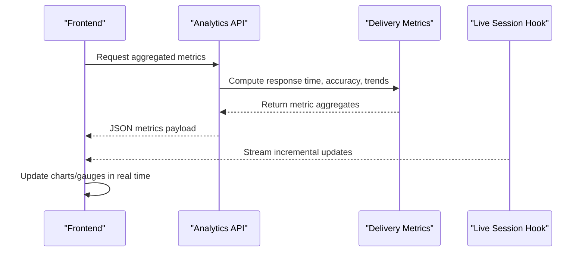
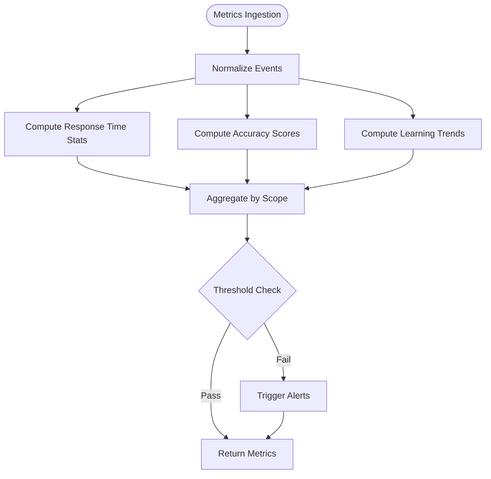
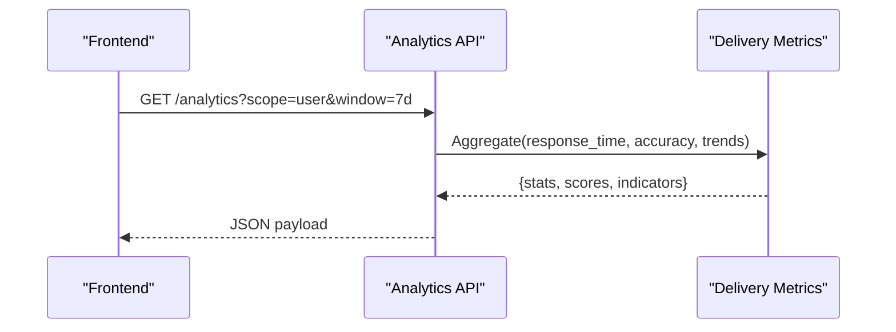
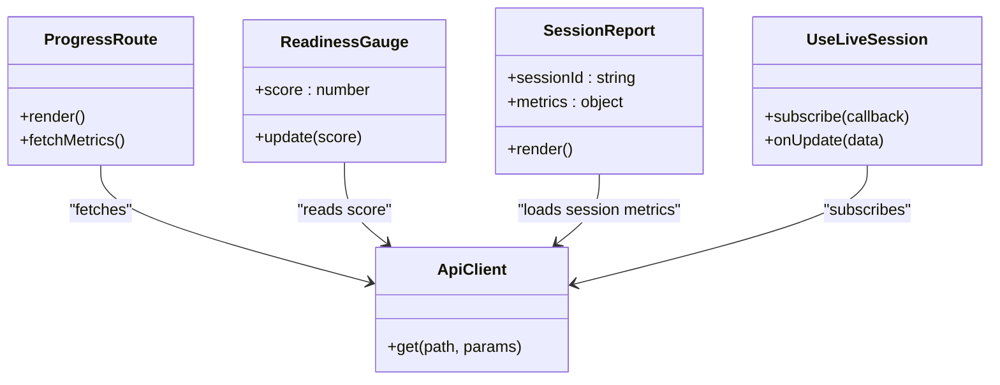
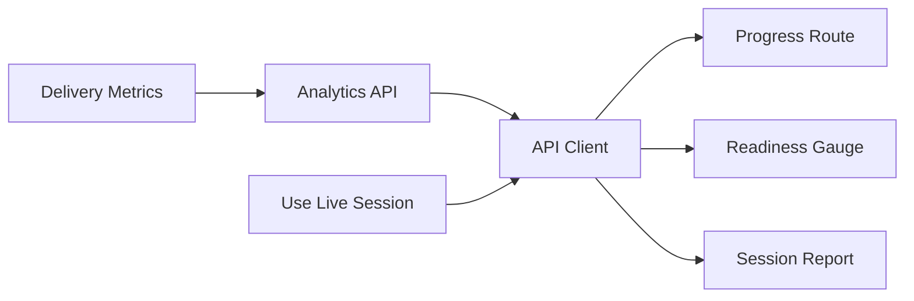

# Performance Metrics & Tracking

<cite>
**Referenced Files in This Document**
- [delivery_metrics.py](file://backend/ai/delivery_metrics.py)
- [analytics.py](file://backend/api/analytics.py)
- [test_delivery_metrics.py](file://backend/tests/test_delivery_metrics.py)
- [progress.tsx](file://src/routes/progress.tsx)
- [readiness-gauge.tsx](file://src/components/readiness-gauge.tsx)
- [session-report.tsx](file://src/components/reports/session-report.tsx)
- [useLiveSession.ts](file://src/lib/useLiveSession.ts)
- [api.ts](file://src/lib/api.ts)
</cite>

## Table of Contents
1. [Introduction](#introduction)
2. [Project Structure](#project-structure)
3. [Core Components](#core-components)
4. [Architecture Overview](#architecture-overview)
5. [Detailed Component Analysis](#detailed-component-analysis)
6. [Dependency Analysis](#dependency-analysis)
7. [Performance Considerations](#performance-considerations)
8. [Troubleshooting Guide](#troubleshooting-guide)
9. [Conclusion](#conclusion)
10. [Appendices](#appendices)

## Introduction
This document explains the performance metrics and tracking system for delivery evaluation, focusing on how response time analysis, accuracy scoring, and learning progress indicators are computed and visualized. It covers data collection mechanisms, metric aggregation algorithms, real-time monitoring, custom metric definitions, threshold configurations, alerting, and frontend integration for dashboards and progress tracking.

## Project Structure
The metrics and tracking system spans backend services and frontend components:
- Backend: Delivery metrics computation and analytics endpoints
- Frontend: Progress pages, readiness gauges, session reports, and live session hooks that consume analytics APIs

**Diagram sources**
- [delivery_metrics.py](file://backend/ai/delivery_metrics.py)
- [analytics.py](file://backend/api/analytics.py)
- [progress.tsx](file://src/routes/progress.tsx)
- [readiness-gauge.tsx](file://src/components/readiness-gauge.tsx)
- [session-report.tsx](file://src/components/reports/session-report.tsx)
- [useLiveSession.ts](file://src/lib/useLiveSession.ts)
- [api.ts](file://src/lib/api.ts)

**Section sources**
- [delivery_metrics.py](file://backend/ai/delivery_metrics.py)
- [analytics.py](file://backend/api/analytics.py)
- [progress.tsx](file://src/routes/progress.tsx)
- [readiness-gauge.tsx](file://src/components/readiness-gauge.tsx)
- [session-report.tsx](file://src/components/reports/session-report.tsx)
- [useLiveSession.ts](file://src/lib/useLiveSession.ts)
- [api.ts](file://src/lib/api.ts)

## Core Components
- Delivery Metrics Engine: Computes response time statistics, accuracy scores, and learning progress indicators from session events and evaluations.
- Analytics API: Exposes endpoints to aggregate and retrieve metrics for dashboards and progress views.
- Frontend Progress and Reporting: Consumes analytics endpoints to render charts, gauges, and summaries; integrates with live session hooks for real-time updates.

Key responsibilities:
- Data ingestion and normalization
- Metric calculation (response time percentiles, accuracy windows, trend indicators)
- Aggregation by session, user, or team
- Real-time streaming via live session hooks
- Threshold-based alerting and visualization

**Section sources**
- [delivery_metrics.py](file://backend/ai/delivery_metrics.py)
- [analytics.py](file://backend/api/analytics.py)
- [useLiveSession.ts](file://src/lib/useLiveSession.ts)
- [api.ts](file://src/lib/api.ts)

## Architecture Overview
The system follows a clear separation between computation and presentation:
- Backend computes metrics and exposes them through an analytics API
- Frontend fetches aggregated metrics and renders progress visuals
- Live session hooks push incremental updates for real-time dashboards

**Diagram sources**
- [analytics.py](file://backend/api/analytics.py)
- [delivery_metrics.py](file://backend/ai/delivery_metrics.py)
- [useLiveSession.ts](file://src/lib/useLiveSession.ts)
- [api.ts](file://src/lib/api.ts)

## Detailed Component Analysis

### Delivery Metrics Engine
Responsibilities:
- Response time analysis: compute mean, median, p95/p99, variance across sessions
- Accuracy scoring: evaluate correctness against reference answers or rubrics, windowed averages
- Learning progress indicators: track improvement over time using rolling windows and trend detection
- Custom metric definitions: allow pluggable metric functions and thresholds
- Aggregation: roll up metrics by session, user, or team with configurable windows

Implementation highlights:
- Time-series friendly computations for efficient streaming updates
- Configurable thresholds for alerts and status flags
- Deterministic aggregation to ensure consistent dashboard values

**Diagram sources**
- [delivery_metrics.py](file://backend/ai/delivery_metrics.py)

**Section sources**
- [delivery_metrics.py](file://backend/ai/delivery_metrics.py)
- [test_delivery_metrics.py](file://backend/tests/test_delivery_metrics.py)

### Analytics API
Responsibilities:
- Provide REST endpoints for fetching aggregated metrics
- Support filtering by session, user, team, and time windows
- Integrate with delivery metrics engine to compute on-demand or cached results
- Return structured payloads consumed by frontend components

Integration points:
- Accepts query parameters for scope and granularity
- Delegates computation to delivery metrics engine
- Returns standardized metric objects for consistent UI rendering

**Diagram sources**
- [analytics.py](file://backend/api/analytics.py)
- [delivery_metrics.py](file://backend/ai/delivery_metrics.py)

**Section sources**
- [analytics.py](file://backend/api/analytics.py)

### Frontend Progress and Reporting
Components:
- Progress route: displays overall learning progress and key metrics
- Readiness gauge: shows readiness score derived from accuracy and response time
- Session report: summarizes individual session metrics and trends
- Live session hook: streams incremental updates to keep dashboards current

Data flow:
- Fetch aggregated metrics via API client
- Render charts and gauges based on returned structures
- Subscribe to live updates for real-time changes

**Diagram sources**
- [progress.tsx](file://src/routes/progress.tsx)
- [readiness-gauge.tsx](file://src/components/readiness-gauge.tsx)
- [session-report.tsx](file://src/components/reports/session-report.tsx)
- [useLiveSession.ts](file://src/lib/useLiveSession.ts)
- [api.ts](file://src/lib/api.ts)

**Section sources**
- [progress.tsx](file://src/routes/progress.tsx)
- [readiness-gauge.tsx](file://src/components/readiness-gauge.tsx)
- [session-report.tsx](file://src/components/reports/session-report.tsx)
- [useLiveSession.ts](file://src/lib/useLiveSession.ts)
- [api.ts](file://src/lib/api.ts)

## Dependency Analysis
- Backend dependencies:
  - Analytics API depends on delivery metrics engine for computation
  - Tests validate metric calculations and edge cases
- Frontend dependencies:
  - Progress, readiness gauge, and session report depend on API client
  - Live session hook provides real-time updates to UI components

**Diagram sources**
- [delivery_metrics.py](file://backend/ai/delivery_metrics.py)
- [analytics.py](file://backend/api/analytics.py)
- [api.ts](file://src/lib/api.ts)
- [progress.tsx](file://src/routes/progress.tsx)
- [readiness-gauge.tsx](file://src/components/readiness-gauge.tsx)
- [session-report.tsx](file://src/components/reports/session-report.tsx)
- [useLiveSession.ts](file://src/lib/useLiveSession.ts)

**Section sources**
- [delivery_metrics.py](file://backend/ai/delivery_metrics.py)
- [analytics.py](file://backend/api/analytics.py)
- [api.ts](file://src/lib/api.ts)
- [progress.tsx](file://src/routes/progress.tsx)
- [readiness-gauge.tsx](file://src/components/readiness-gauge.tsx)
- [session-report.tsx](file://src/components/reports/session-report.tsx)
- [useLiveSession.ts](file://src/lib/useLiveSession.ts)

## Performance Considerations
- Efficient aggregation: use rolling windows and incremental updates to minimize recomputation
- Streaming updates: leverage live session hooks to avoid polling overhead
- Caching: cache aggregated metrics for common scopes and time windows
- Threshold tuning: adjust thresholds based on domain-specific SLAs and user expectations
- Visualization optimization: debounce chart updates and batch metric payloads

[No sources needed since this section provides general guidance]

## Troubleshooting Guide
Common issues and resolutions:
- Missing metrics: verify event ingestion and normalization steps
- Incorrect accuracy scores: check reference answers and scoring rubrics
- Stale dashboards: ensure live session subscriptions are active and reconnecting
- Threshold misfires: review configured thresholds and recent metric distributions

Validation resources:
- Unit tests for delivery metrics help identify calculation errors and edge cases

**Section sources**
- [test_delivery_metrics.py](file://backend/tests/test_delivery_metrics.py)

## Conclusion
The performance metrics and tracking system combines robust backend computation with responsive frontend visualization. By leveraging delivery metrics for accurate scoring and response time analysis, and integrating real-time updates through live session hooks, the system delivers actionable insights for learners and instructors. Proper configuration of thresholds and careful attention to aggregation strategies ensure reliable and timely performance monitoring.

[No sources needed since this section summarizes without analyzing specific files]

## Appendices

### Example Custom Metric Definitions
- Define a new metric function that accepts normalized events and returns a scalar or vector
- Register the metric with the delivery metrics engine for inclusion in aggregations
- Configure thresholds and alert rules for the new metric

[No sources needed since this section provides general guidance]

### Threshold Configuration Examples
- Set minimum acceptable response time percentiles
- Define accuracy score ranges for pass/fail states
- Configure alert triggers for significant deviations from baseline

[No sources needed since this section provides general guidance]

### Dashboard Integration Notes
- Ensure API responses match expected shapes for chart libraries
- Map metric fields to UI components consistently
- Handle loading and error states gracefully

[No sources needed since this section provides general guidance]