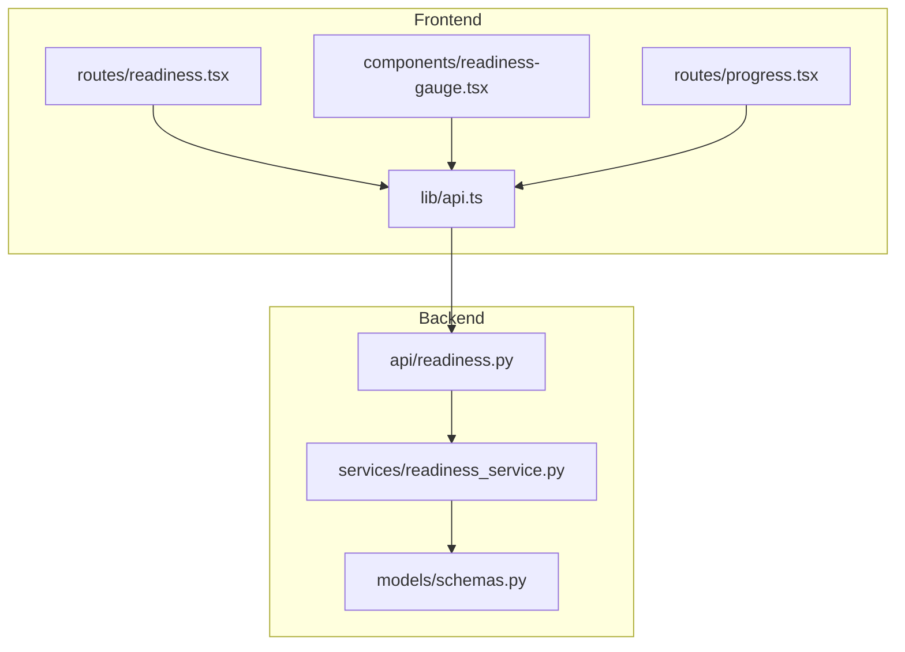
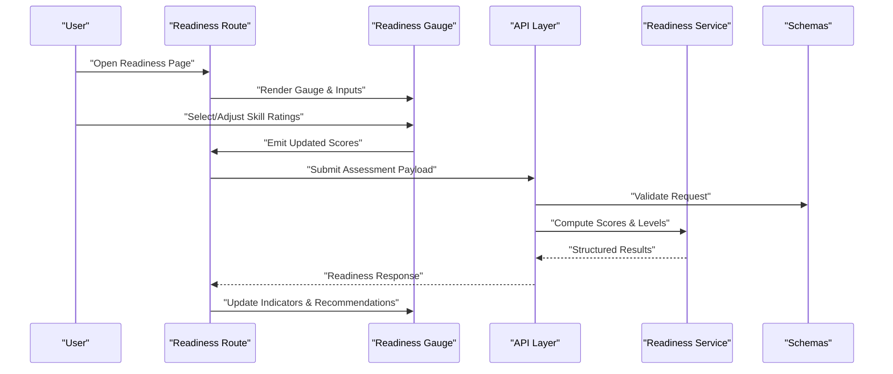
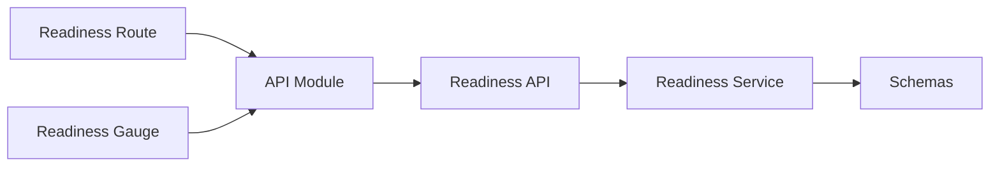

# Readiness Assessment Engine

<cite>
**Referenced Files in This Document**
- [readiness.tsx](file://src/routes/readiness.tsx)
- [readiness-gauge.tsx](file://src/components/readiness-gauge.tsx)
- [readiness.py](file://backend/api/readiness.py)
- [readiness_service.py](file://backend/services/readiness_service.py)
- [schemas.py](file://backend/models/schemas.py)
- [api.ts](file://src/lib/api.ts)
- [progress.tsx](file://src/routes/progress.tsx)
</cite>

## Table of Contents
1. [Introduction](#introduction)
2. [Project Structure](#project-structure)
3. [Core Components](#core-components)
4. [Architecture Overview](#architecture-overview)
5. [Detailed Component Analysis](#detailed-component-analysis)
6. [Dependency Analysis](#dependency-analysis)
7. [Performance Considerations](#performance-considerations)
8. [Troubleshooting Guide](#troubleshooting-guide)
9. [Conclusion](#conclusion)
10. [Appendices](#appendices)

## Introduction
This document explains the readiness assessment engine that evaluates user preparedness across skill domains, computes scores and readiness levels, maps competencies to actionable insights, and renders a readiness gauge with visual indicators and interactive features. It covers algorithms, scoring methodology, competency mapping, configuration examples, interpretation of results, and personalized improvement recommendations.

## Project Structure
The readiness assessment feature spans both frontend and backend:
- Frontend routes and components handle user interaction, data fetching, and visualization.
- Backend API endpoints and services implement assessment logic, scoring, and persistence.

**Diagram sources**
- [readiness.tsx](file://src/routes/readiness.tsx)
- [readiness-gauge.tsx](file://src/components/readiness-gauge.tsx)
- [api.ts](file://src/lib/api.ts)
- [readiness.py](file://backend/api/readiness.py)
- [readiness_service.py](file://backend/services/readiness_service.py)
- [schemas.py](file://backend/models/schemas.py)
- [progress.tsx](file://src/routes/progress.tsx)

**Section sources**
- [readiness.tsx](file://src/routes/readiness.tsx)
- [readiness-gauge.tsx](file://src/components/readiness-gauge.tsx)
- [readiness.py](file://backend/api/readiness.py)
- [readiness_service.py](file://backend/services/readiness_service.py)
- [schemas.py](file://backend/models/schemas.py)
- [api.ts](file://src/lib/api.ts)
- [progress.tsx](file://src/routes/progress.tsx)

## Core Components
- Readiness Route (frontend): Orchestrates the assessment flow, collects inputs, triggers evaluation, and displays results.
- Readiness Gauge (frontend): Visualizes readiness scores per domain with interactive controls and tooltips.
- Readiness API (backend): Exposes endpoints for submitting assessments and retrieving computed readiness metrics.
- Readiness Service (backend): Implements scoring algorithms, competency mapping, and readiness level calculations.
- Schemas (backend): Defines request/response models and validation rules for assessment data.
- Progress Route (frontend): Displays historical readiness trends and contextual insights.

Key responsibilities:
- Input validation and normalization
- Domain-specific scoring and weighting
- Aggregation into overall readiness
- Mapping scores to competency levels
- Generating personalized recommendations
- Persisting and retrieving results

**Section sources**
- [readiness.tsx](file://src/routes/readiness.tsx)
- [readiness-gauge.tsx](file://src/components/readiness-gauge.tsx)
- [readiness.py](file://backend/api/readiness.py)
- [readiness_service.py](file://backend/services/readiness_service.py)
- [schemas.py](file://backend/models/schemas.py)
- [progress.tsx](file://src/routes/progress.tsx)

## Architecture Overview
The system follows a client-server architecture where the frontend collects user responses and renders the readiness gauge, while the backend performs deterministic scoring and returns structured results.

**Diagram sources**
- [readiness.tsx](file://src/routes/readiness.tsx)
- [readiness-gauge.tsx](file://src/components/readiness-gauge.tsx)
- [readiness.py](file://backend/api/readiness.py)
- [readiness_service.py](file://backend/services/readiness_service.py)
- [schemas.py](file://backend/models/schemas.py)

## Detailed Component Analysis

### Readiness Route (Frontend)
Responsibilities:
- Manage state for assessment inputs and results
- Call API endpoints to submit and retrieve readiness data
- Render the readiness gauge and display recommendations
- Handle loading and error states

Data flow:
- Collects domain ratings from the gauge component
- Normalizes and validates payload before sending
- Updates UI upon receiving computed readiness metrics

Interactions:
- Uses the shared API module for HTTP calls
- Integrates with progress route for historical context

**Section sources**
- [readiness.tsx](file://src/routes/readiness.tsx)
- [api.ts](file://src/lib/api.ts)
- [progress.tsx](file://src/routes/progress.tsx)

### Readiness Gauge (Frontend)
Responsibilities:
- Display per-domain readiness indicators (e.g., color-coded segments or arcs)
- Provide interactive controls (sliders, toggles, or numeric inputs)
- Show tooltips and labels explaining each domain’s meaning
- Emit real-time updates to the parent route

Visual indicators:
- Color thresholds mapped to readiness levels
- Animated transitions on score changes
- Compact summary view and detailed breakdown

Accessibility:
- Keyboard navigation and screen reader support
- High contrast mode compatibility

**Section sources**
- [readiness-gauge.tsx](file://src/components/readiness-gauge.tsx)

### Readiness API (Backend)
Responsibilities:
- Define endpoints for submission and retrieval
- Validate payloads using schemas
- Delegate computation to the readiness service
- Return standardized response structures

Error handling:
- Input validation errors
- Internal server errors
- Unauthorized access checks

**Section sources**
- [readiness.py](file://backend/api/readiness.py)
- [schemas.py](file://backend/models/schemas.py)

### Readiness Service (Backend)
Responsibilities:
- Implement scoring algorithms per domain
- Apply weights and aggregation rules
- Map raw scores to competency levels
- Generate personalized improvement recommendations

Scoring methodology:
- Normalize inputs to consistent scales
- Weighted average across domains
- Threshold-based level classification
- Confidence bands based on variance or missing data

Competency mapping:
- Maps numerical scores to descriptive levels (e.g., Novice, Competent, Proficient, Expert)
- Provides domain-specific descriptors

Recommendation engine:
- Identifies weakest domains
- Suggests targeted learning resources or practice activities
- Prioritizes actions by impact and feasibility

**Section sources**
- [readiness_service.py](file://backend/services/readiness_service.py)
- [schemas.py](file://backend/models/schemas.py)

### Data Models (Schemas)
Responsibilities:
- Define request/response shapes for assessment submissions and results
- Enforce field types, ranges, and required fields
- Support versioning and backward compatibility

Key entities:
- Assessment input model (domain ratings, weights, metadata)
- Readiness result model (per-domain scores, overall readiness, levels, recommendations)

**Section sources**
- [schemas.py](file://backend/models/schemas.py)

## Dependency Analysis
The readiness feature has clear separation between presentation and computation:
- Frontend depends on the API layer for data operations
- Backend API depends on the readiness service for business logic
- Schemas provide contracts between API and service layers

**Diagram sources**
- [readiness.tsx](file://src/routes/readiness.tsx)
- [readiness-gauge.tsx](file://src/components/readiness-gauge.tsx)
- [api.ts](file://src/lib/api.ts)
- [readiness.py](file://backend/api/readiness.py)
- [readiness_service.py](file://backend/services/readiness_service.py)
- [schemas.py](file://backend/models/schemas.py)

**Section sources**
- [readiness.tsx](file://src/routes/readiness.tsx)
- [readiness-gauge.tsx](file://src/components/readiness-gauge.tsx)
- [api.ts](file://src/lib/api.ts)
- [readiness.py](file://backend/api/readiness.py)
- [readiness_service.py](file://backend/services/readiness_service.py)
- [schemas.py](file://backend/models/schemas.py)

## Performance Considerations
- Client-side rendering: Keep gauge interactions responsive by debouncing heavy computations and batching updates.
- Server-side scoring: Ensure deterministic algorithms with minimal I/O; cache static configuration like weights and thresholds.
- Network efficiency: Use pagination for historical progress and minimize payload size by omitting unnecessary fields.
- Error resilience: Implement retries with exponential backoff for transient failures.

[No sources needed since this section provides general guidance]

## Troubleshooting Guide
Common issues and resolutions:
- Validation errors: Check schema constraints and ensure all required fields are present with valid ranges.
- Incorrect scores: Verify domain weights and normalization steps; confirm input scaling matches expected ranges.
- Missing recommendations: Confirm competency thresholds and recommendation rules are configured correctly.
- UI not updating: Ensure event handlers propagate state changes and API responses update local state.

Debugging tips:
- Inspect network payloads and responses for correctness.
- Log intermediate values in the readiness service during development.
- Use browser dev tools to validate gauge interactions and accessibility attributes.

**Section sources**
- [readiness.py](file://backend/api/readiness.py)
- [readiness_service.py](file://backend/services/readiness_service.py)
- [schemas.py](file://backend/models/schemas.py)
- [readiness-gauge.tsx](file://src/components/readiness-gauge.tsx)

## Conclusion
The readiness assessment engine combines a user-friendly frontend with robust backend scoring to deliver actionable insights. By standardizing inputs, applying transparent algorithms, and mapping results to competency levels, it enables personalized improvement pathways. The readiness gauge provides immediate visual feedback, while the service ensures accurate and consistent evaluations.

[No sources needed since this section summarizes without analyzing specific files]

## Appendices

### Scoring Methodology and Readiness Level Calculations
- Input normalization: Convert raw ratings to a common scale (e.g., 0–100).
- Weighted aggregation: Compute domain scores using predefined weights; overall readiness is a weighted average.
- Level classification: Map scores to levels using thresholds (e.g., 0–39 Novice, 40–69 Competent, 70–89 Proficient, 90–100 Expert).
- Confidence estimation: Adjust confidence based on data completeness and variance.

[No sources needed since this section provides general guidance]

### Configuring Assessment Criteria
- Define domains and their descriptions.
- Set weights per domain to reflect importance.
- Configure threshold boundaries for competency levels.
- Customize recommendation templates per domain and level.

[No sources needed since this section provides general guidance]

### Interpreting Readiness Scores
- Per-domain scores indicate strength areas and gaps.
- Overall readiness reflects aggregate preparedness.
- Confidence bands highlight reliability of results.
- Historical trends show progress over time.

[No sources needed since this section provides general guidance]

### Generating Personalized Improvement Recommendations
- Identify lowest-scoring domains.
- Match recommendations to competency level and domain focus.
- Prioritize actions by impact and effort.
- Track completion and re-evaluate readiness periodically.

[No sources needed since this section provides general guidance]