# Features & Modules

<cite>
**Referenced Files in This Document**
- [backend/ai/viva_core.py](file://backend/ai/viva_core.py)
- [backend/api/viva.py](file://backend/api/viva.py)
- [backend/api/projects.py](file://backend/api/projects.py)
- [backend/api/tasks.py](file://backend/api/tasks.py)
- [backend/api/teams.py](file://backend/api/teams.py)
- [backend/api/analytics.py](file://backend/api/analytics.py)
- [backend/api/templates.py](file://backend/api/templates.py)
- [backend/api/files.py](file://backend/api/files.py)
- [src/routes/ai-viva/index.tsx](file://src/routes/ai-viva/index.tsx)
- [src/routes/projects/index.tsx](file://src/routes/projects/index.tsx)
- [src/routes/teams/index.tsx](file://src/routes/teams/index.tsx)
- [src/components/live/team-viva-room.tsx](file://src/components/live/team-viva-room.tsx)
- [src/components/tasks/kanban-board.tsx](file://src/components/tasks/kanban-board.tsx)
</cite>

## Table of Contents
1. [Introduction](#introduction)
2. [Project Structure](#project-structure)
3. [Core Components](#core-components)
4. [Architecture Overview](#architecture-overview)
5. [Detailed Component Analysis](#detailed-component-analysis)
6. [Dependency Analysis](#dependency-analysis)
7. [Performance Considerations](#performance-considerations)
8. [Troubleshooting Guide](#troubleshooting-guide)
9. [Conclusion](#conclusion)

## Introduction
Horux is an AI-powered learning and assessment platform designed to enhance student readiness through intelligent viva examinations, collaborative project management, real-time team communication, and advanced analytics. The platform integrates multiple modules to provide a comprehensive educational experience that combines AI-driven assessments with traditional project management and collaboration tools.

The core features include:
- AI-powered viva examination system with adaptive questioning
- Project management with task tracking and team assignment
- Real-time collaboration workspace with shared resources
- Advanced analytics dashboard with performance metrics and gamification
- Template system for customizable learning experiences
- File management capabilities for resource sharing

## Project Structure
The Horux platform follows a modern full-stack architecture with clear separation between frontend and backend components:

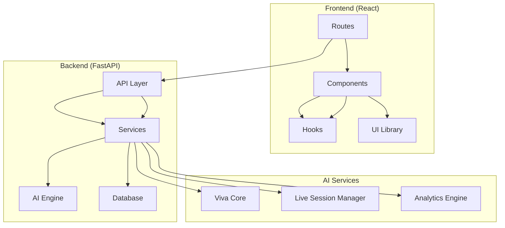

**Diagram sources**
- [src/router.tsx](file://src/router.tsx)
- [backend/main.py](file://backend/main.py)
- [backend/ai/viva_core.py](file://backend/ai/viva_core.py)

**Section sources**
- [src/router.tsx](file://src/router.tsx)
- [backend/main.py](file://backend/main.py)

## Core Components

### AI-Powered Viva Examination System
The viva examination system represents the flagship feature of Horux, providing intelligent, adaptive questioning capabilities powered by AI models.

#### Key Features:
- **Session Management**: Creation, configuration, and lifecycle management of viva sessions
- **Adaptive Questioning**: AI-generated questions based on user responses and knowledge gaps
- **Real-time Evaluation**: Instant feedback and performance scoring during live sessions
- **Multi-modal Support**: Text, audio, and code-aware questioning capabilities

#### Technical Architecture:
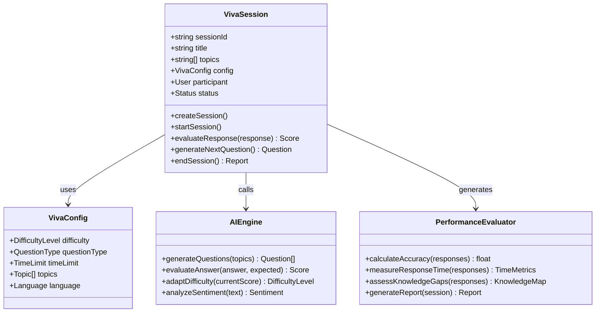

**Diagram sources**
- [backend/ai/viva_core.py](file://backend/ai/viva_core.py)
- [backend/api/viva.py](file://backend/api/viva.py)

**Section sources**
- [backend/ai/viva_core.py](file://backend/ai/viva_core.py)
- [backend/api/viva.py](file://backend/api/viva.py)
- [src/routes/ai-viva/index.tsx](file://src/routes/ai-viva/index.tsx)

### Project Management Module
The project management system provides comprehensive tools for organizing, tracking, and managing academic projects with team collaboration capabilities.

#### Core Functionality:
- **Project Lifecycle Management**: Creation, planning, execution, and completion tracking
- **Task Management**: Kanban-style boards with drag-and-drop functionality
- **Team Assignment**: Role-based access control and responsibility assignment
- **Progress Monitoring**: Real-time progress tracking and milestone achievement

#### Data Flow Architecture:
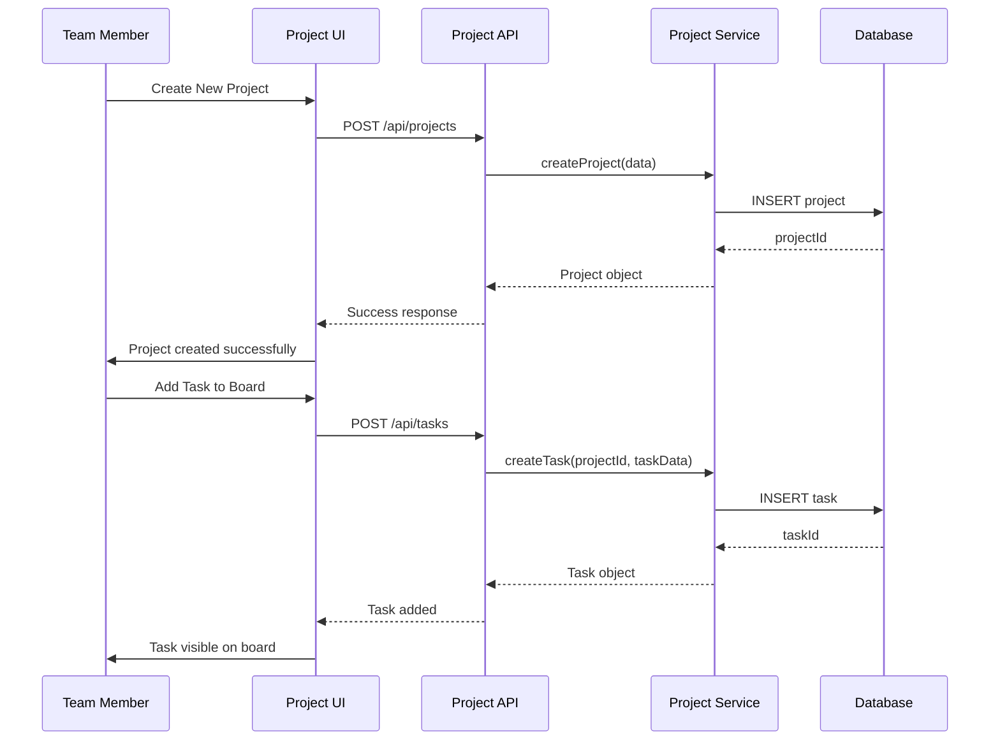

**Diagram sources**
- [backend/api/projects.py](file://backend/api/projects.py)
- [backend/api/tasks.py](file://backend/api/tasks.py)
- [src/components/tasks/kanban-board.tsx](file://src/components/tasks/kanban-board.tsx)

**Section sources**
- [backend/api/projects.py](file://backend/api/projects.py)
- [backend/api/tasks.py](file://backend/api/tasks.py)
- [src/routes/projects/index.tsx](file://src/routes/projects/index.tsx)
- [src/components/tasks/kanban-board.tsx](file://src/components/tasks/kanban-board.tsx)

### Team Collaboration Workspace
The collaboration workspace enables real-time communication and resource sharing among team members working on projects or viva preparation.

#### Key Features:
- **Real-time Communication**: Live chat and messaging within teams
- **Shared Resources**: Document sharing and collaborative editing
- **Live Sessions**: Integrated viva practice sessions with multiple participants
- **Resource Management**: Centralized file storage and organization

#### Real-time Architecture:
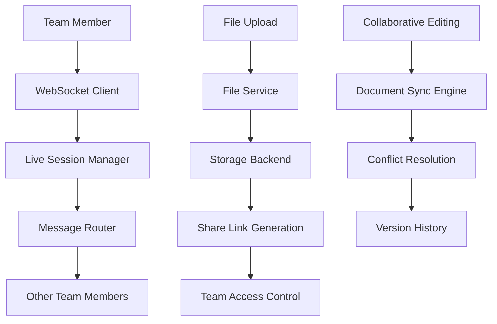

**Diagram sources**
- [backend/api/teams.py](file://backend/api/teams.py)
- [backend/api/live.py](file://backend/api/live.py)
- [src/components/live/team-viva-room.tsx](file://src/components/live/team-viva-room.tsx)

**Section sources**
- [backend/api/teams.py](file://backend/api/teams.py)
- [backend/api/live.py](file://backend/api/live.py)
- [src/routes/teams/index.tsx](file://src/routes/teams/index.tsx)
- [src/components/live/team-viva-room.tsx](file://src/components/live/team-viva-room.tsx)

### Advanced Analytics Dashboard
The analytics dashboard provides comprehensive insights into user performance, readiness assessment, and gamification elements to motivate learning.

#### Analytics Components:
- **Performance Metrics**: Detailed analysis of viva performance across different domains
- **Readiness Assessment**: AI-powered evaluation of exam readiness and improvement areas
- **Gamification Elements**: Achievement systems, leaderboards, and progress badges
- **Trend Analysis**: Historical performance tracking and prediction algorithms

#### Analytics Processing Pipeline:
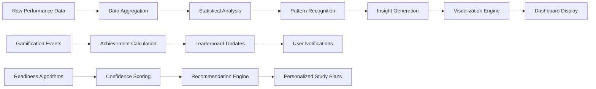

**Diagram sources**
- [backend/api/analytics.py](file://backend/api/analytics.py)
- [backend/services/gamification_service.py](file://backend/services/gamification_service.py)
- [backend/services/readiness_service.py](file://backend/services/readiness_service.py)

**Section sources**
- [backend/api/analytics.py](file://backend/api/analytics.py)
- [backend/services/gamification_service.py](file://backend/services/gamification_service.py)
- [backend/services/readiness_service.py](file://backend/services/readiness_service.py)

### Template System
The template system enables creation and management of customizable learning experiences and assessment configurations.

#### Template Features:
- **Template Creation**: Visual template builder for different assessment types
- **Customization Options**: Configurable parameters for difficulty, topics, and formats
- **Sharing and Distribution**: Template marketplace and team sharing capabilities
- **Version Control**: Template versioning and rollback capabilities

#### Template Architecture:
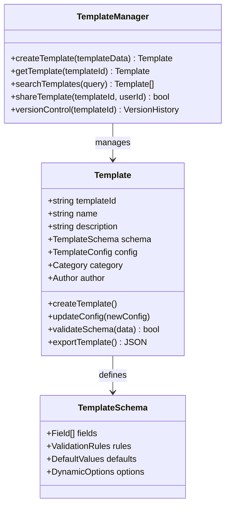

**Diagram sources**
- [backend/api/templates.py](file://backend/api/templates.py)

**Section sources**
- [backend/api/templates.py](file://backend/api/templates.py)

### File Management Capabilities
The file management system provides secure storage, sharing, and collaborative editing capabilities for documents and resources.

#### File Management Features:
- **Secure Storage**: Encrypted file storage with access controls
- **Version Control**: Automatic versioning and change tracking
- **Collaborative Editing**: Real-time document collaboration
- **Search and Organization**: Advanced search and categorization

**Section sources**
- [backend/api/files.py](file://backend/api/files.py)

## Architecture Overview

The Horux platform follows a microservices-inspired architecture with clear separation of concerns:

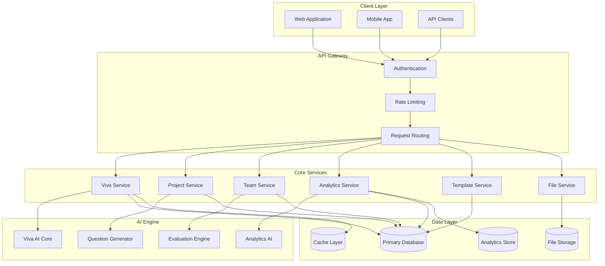

**Diagram sources**
- [backend/main.py](file://backend/main.py)
- [backend/core/config.py](file://backend/core/config.py)

## Detailed Component Analysis

### AI Viva System Deep Dive

The AI viva system represents the most complex component of the platform, integrating multiple AI services and real-time processing capabilities.

#### Session Lifecycle Management:
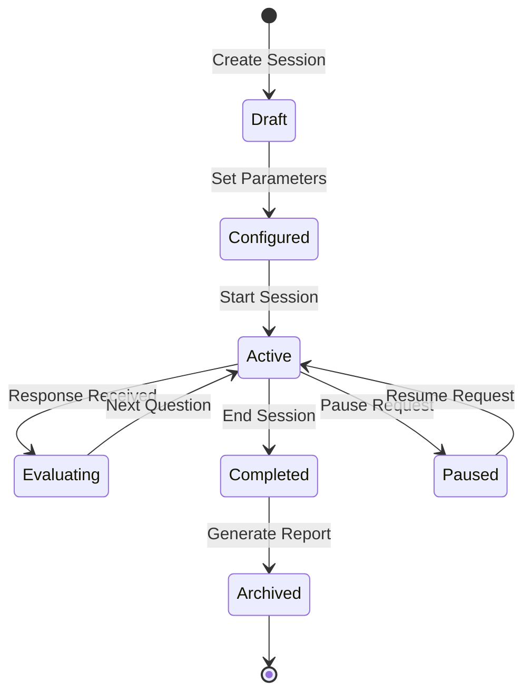

**Diagram sources**
- [backend/ai/viva_core.py](file://backend/ai/viva_core.py)

#### Question Generation Algorithm:
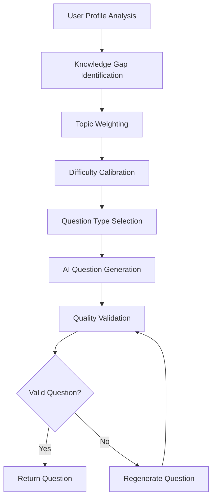

**Diagram sources**
- [backend/ai/viva_core.py](file://backend/ai/viva_core.py)

**Section sources**
- [backend/ai/viva_core.py](file://backend/ai/viva_core.py)
- [backend/api/viva.py](file://backend/api/viva.py)

### Project Management Workflow

The project management system implements a comprehensive workflow from project creation to completion:

#### Task Management Flow:
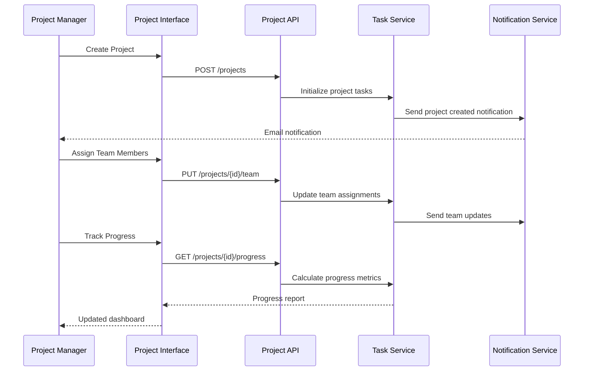

**Diagram sources**
- [backend/api/projects.py](file://backend/api/projects.py)
- [backend/api/tasks.py](file://backend/api/tasks.py)

**Section sources**
- [backend/api/projects.py](file://backend/api/projects.py)
- [backend/api/tasks.py](file://backend/api/tasks.py)

### Real-time Collaboration Architecture

The collaboration system leverages WebSocket connections for real-time communication:

#### WebSocket Connection Flow:
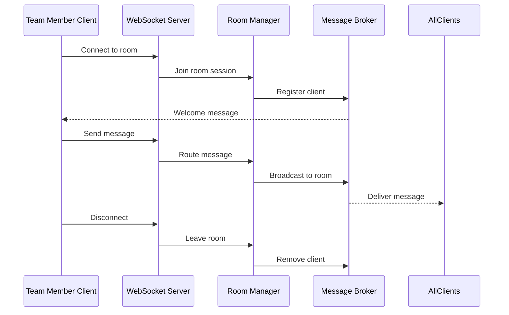

**Diagram sources**
- [backend/api/live.py](file://backend/api/live.py)
- [backend/api/teams.py](file://backend/api/teams.py)

**Section sources**
- [backend/api/live.py](file://backend/api/live.py)
- [backend/api/teams.py](file://backend/api/teams.py)

## Dependency Analysis

The platform exhibits a well-structured dependency hierarchy with clear service boundaries:

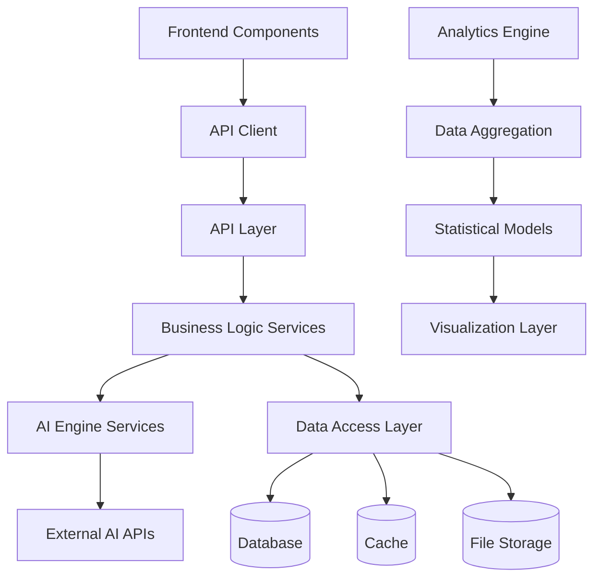

**Diagram sources**
- [backend/main.py](file://backend/main.py)
- [backend/core/config.py](file://backend/core/config.py)

**Section sources**
- [backend/main.py](file://backend/main.py)
- [backend/core/config.py](file://backend/core/config.py)

## Performance Considerations

The Horux platform incorporates several performance optimization strategies:

### Caching Strategy
- **Session State Caching**: Redis-backed caching for active viva sessions
- **Template Caching**: In-memory caching for frequently accessed templates
- **Analytics Pre-computation**: Batch processing for complex analytics queries

### Scalability Patterns
- **Horizontal Scaling**: Stateless API design enabling easy horizontal scaling
- **Load Balancing**: Distributed request handling across multiple instances
- **Connection Pooling**: Optimized database and external API connection management

### Memory Management
- **Streaming Responses**: Large file downloads and analytics reports use streaming
- **Garbage Collection Optimization**: Efficient memory usage patterns for long-running sessions
- **Resource Cleanup**: Automatic cleanup of temporary files and expired sessions

## Troubleshooting Guide

### Common Issues and Solutions

#### Viva Session Problems
- **Session Timeout**: Implement automatic session recovery and state persistence
- **AI Service Unavailability**: Configure fallback mechanisms and graceful degradation
- **Real-time Connection Drops**: Implement reconnection logic and message queuing

#### Performance Bottlenecks
- **Slow Question Generation**: Cache common question patterns and optimize AI prompts
- **Database Query Performance**: Implement query optimization and indexing strategies
- **Memory Leaks**: Monitor long-running processes and implement proper resource cleanup

#### Integration Issues
- **External API Failures**: Implement circuit breaker patterns and retry logic
- **WebSocket Connection Issues**: Configure proper heartbeat mechanisms and error handling
- **File Upload Failures**: Implement chunked uploads and resume capabilities

**Section sources**
- [backend/core/errors.py](file://backend/core/errors.py)
- [backend/core/logging.py](file://backend/core/logging.py)

## Conclusion

The Horux platform represents a comprehensive educational technology solution that successfully integrates AI-powered assessment capabilities with traditional project management and collaboration tools. The modular architecture ensures scalability and maintainability while providing rich functionality for both individual learners and team-based educational environments.

Key strengths of the platform include:
- Sophisticated AI integration for adaptive learning experiences
- Robust real-time collaboration capabilities
- Comprehensive analytics and reporting features
- Flexible template system for customization
- Strong foundation for future feature expansion

The platform's design principles emphasize user experience, performance, and extensibility, making it suitable for various educational contexts from individual study to institutional deployment.