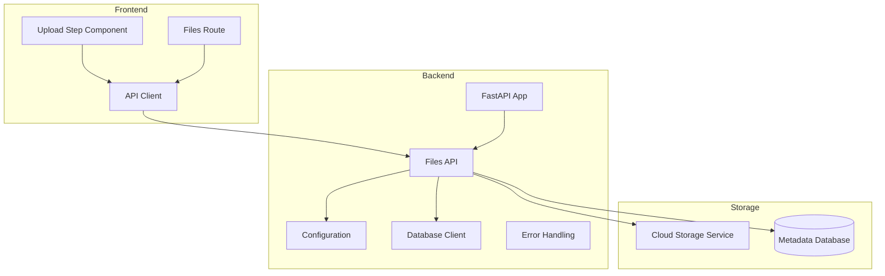
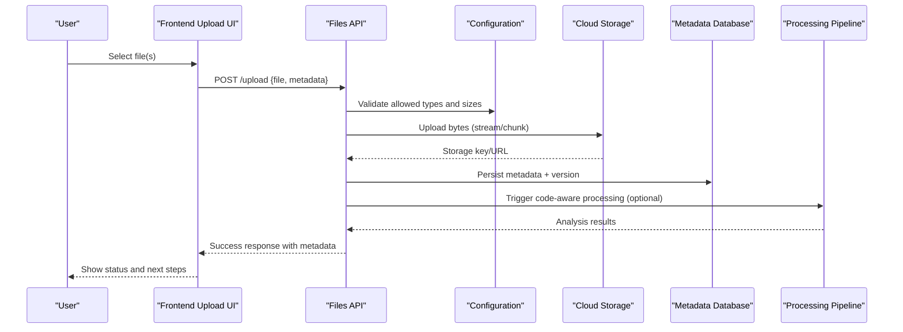
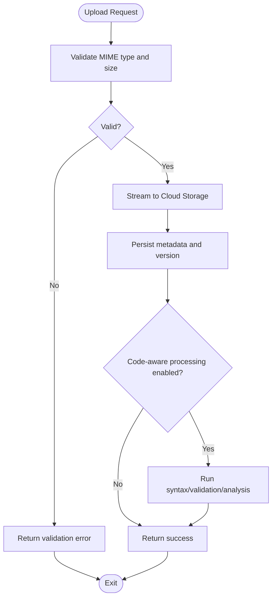
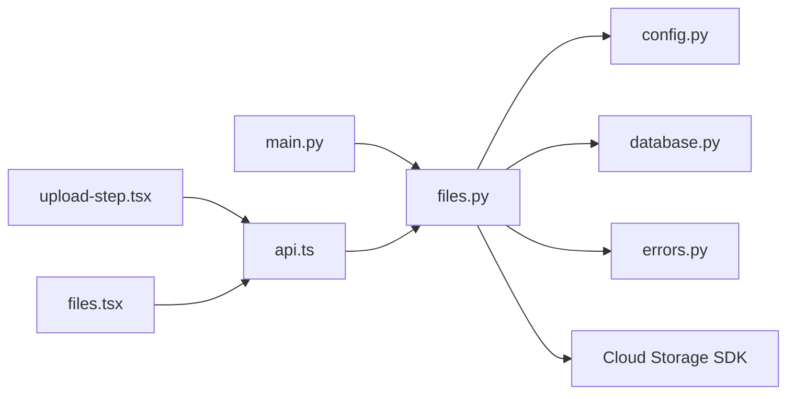

# File Management System

<cite>
**Referenced Files in This Document**
- [files.py](file://backend/api/files.py)
- [config.py](file://backend/core/config.py)
- [errors.py](file://backend/core/errors.py)
- [database.py](file://backend/core/database.py)
- [main.py](file://backend/main.py)
- [upload-step.tsx](file://src/components/code-aware/upload-step.tsx)
- [files.tsx](file://src/routes/files.tsx)
- [api.ts](file://src/lib/api.ts)
- [supabase_schema.sql](file://backend/supabase_schema.sql)
</cite>

## Table of Contents
1. [Introduction](#introduction)
2. [Project Structure](#project-structure)
3. [Core Components](#core-components)
4. [Architecture Overview](#architecture-overview)
5. [Detailed Component Analysis](#detailed-component-analysis)
6. [Dependency Analysis](#dependency-analysis)
7. [Performance Considerations](#performance-considerations)
8. [Troubleshooting Guide](#troubleshooting-guide)
9. [Conclusion](#conclusion)
10. [Appendices](#appendices)

## Introduction
This document explains the file management system implemented in the project, focusing on upload and download mechanisms, validation, storage optimization, security, supported file types, size limits, processing pipelines, cloud integration, versioning, access control, code-aware processing for programming assignments, syntax validation, automated analysis, virus scanning, content filtering, and practical examples for uploads, document libraries, and external storage integrations.

## Project Structure
The file management system spans backend API endpoints, configuration, database schema, and frontend components:
- Backend API: file upload/download endpoints and orchestration logic
- Core: configuration, error handling, database client
- Frontend: upload UI and routes for managing files
- Schema: database tables for file metadata and relationships

**Diagram sources**
- [main.py](file://backend/main.py)
- [files.py](file://backend/api/files.py)
- [config.py](file://backend/core/config.py)
- [database.py](file://backend/core/database.py)
- [upload-step.tsx](file://src/components/code-aware/upload-step.tsx)
- [files.tsx](file://src/routes/files.tsx)
- [api.ts](file://src/lib/api.ts)

**Section sources**
- [main.py](file://backend/main.py)
- [files.py](file://backend/api/files.py)
- [config.py](file://backend/core/config.py)
- [database.py](file://backend/core/database.py)
- [upload-step.tsx](file://src/components/code-aware/upload-step.tsx)
- [files.tsx](file://src/routes/files.tsx)
- [api.ts](file://src/lib/api.ts)

## Core Components
- Files API: Endpoints for uploading, downloading, listing, and managing files; validates inputs, enforces size/type limits, integrates with cloud storage, and records metadata.
- Configuration: Centralized settings for storage backends, allowed MIME types, max sizes, and security policies.
- Database Client: Persistent storage of file metadata, versions, ownership, and access controls.
- Error Handling: Standardized error responses for validation failures, permission issues, and storage errors.
- Frontend Upload UI: User-facing component to select files, show progress, handle errors, and trigger server-side processing.
- Files Route: Page that lists, searches, and manages documents within the application context.

Key responsibilities:
- Validate file type and size before upload
- Stream or chunk uploads to optimize memory usage
- Store files in cloud storage with secure URLs
- Maintain versioned metadata and audit trails
- Enforce access control based on user roles and ownership
- Provide code-aware processing pipeline for programming assignments

**Section sources**
- [files.py](file://backend/api/files.py)
- [config.py](file://backend/core/config.py)
- [database.py](file://backend/core/database.py)
- [errors.py](file://backend/core/errors.py)
- [upload-step.tsx](file://src/components/code-aware/upload-step.tsx)
- [files.tsx](file://src/routes/files.tsx)

## Architecture Overview
The system follows a layered architecture:
- Frontend components initiate uploads via an API client
- Backend API validates requests, interacts with storage services, and persists metadata
- Cloud storage holds binary content; database stores structured metadata and permissions
- Optional processing pipeline handles code-aware tasks (syntax checks, static analysis)

**Diagram sources**
- [files.py](file://backend/api/files.py)
- [config.py](file://backend/core/config.py)
- [database.py](file://backend/core/database.py)
- [upload-step.tsx](file://src/components/code-aware/upload-step.tsx)

## Detailed Component Analysis

### Files API: Upload and Download Mechanisms
Responsibilities:
- Accept multipart/form-data uploads
- Validate MIME types against allowlist
- Enforce maximum file size from configuration
- Stream data to cloud storage efficiently
- Generate secure, time-limited download links
- Record versioned metadata and ownership
- Support batch operations where applicable

Security considerations:
- Reject unknown or dangerous MIME types
- Sanitize filenames and metadata
- Enforce per-user and per-project access controls
- Use signed URLs for downloads

Supported file types and size limitations:
- Config-driven allowlist of MIME types and extensions
- Global and per-file size limits enforced at the API layer
- Chunked upload support for large files

Processing pipeline:
- Post-upload triggers optional code-aware analysis
- Syntax validation for programming languages
- Automated metrics and feedback generation

**Diagram sources**
- [files.py](file://backend/api/files.py)
- [config.py](file://backend/core/config.py)

**Section sources**
- [files.py](file://backend/api/files.py)
- [config.py](file://backend/core/config.py)

### Configuration: Allowed Types, Size Limits, and Security Policies
- Centralized configuration for allowed MIME types and file extensions
- Global and per-endpoint size limits
- Storage backend selection and credentials
- Security policies for filename sanitization and content filtering
- Feature flags for enabling code-aware processing and virus scanning

Best practices:
- Keep allowlists minimal and explicit
- Separate environment-specific settings
- Log configuration changes for auditability

**Section sources**
- [config.py](file://backend/core/config.py)

### Database Client: Metadata, Versioning, and Access Control
- Stores file metadata including owner, project, timestamps, and version numbers
- Tracks access permissions and role-based visibility
- Supports soft deletes and audit logs
- Provides efficient queries for listing and searching files

Versioning model:
- Each upload increments version for the same logical file
- Previous versions retained for rollback and history
- Metadata includes checksums for integrity verification

Access control:
- Ownership checks at read/write boundaries
- Role-based permissions for team/project contexts

**Section sources**
- [database.py](file://backend/core/database.py)
- [supabase_schema.sql](file://backend/supabase_schema.sql)

### Error Handling: Standardized Responses and Diagnostics
- Consistent error codes for validation, permission, and storage failures
- Human-readable messages for frontend display
- Structured logging for debugging and monitoring
- Graceful degradation when storage is unavailable

Common errors:
- Invalid file type or oversized payload
- Unauthorized access or missing ownership
- Storage service timeouts or rate limits

**Section sources**
- [errors.py](file://backend/core/errors.py)

### Frontend Upload UI: User Experience and Progress Tracking
- Drag-and-drop and file picker interactions
- Real-time progress indicators and retry logic
- Clear error messaging and guidance
- Integration with backend API for upload initiation and status polling

Features:
- Multi-file upload with queue management
- Preview for supported media types
- Code-aware upload flow with language detection

**Section sources**
- [upload-step.tsx](file://src/components/code-aware/upload-step.tsx)

### Files Route: Document Library Management
- Lists files with filters by project, owner, and date
- Search by name and tags
- Actions: view details, download, delete, share
- Bulk operations for administrative tasks

Integration points:
- Fetches metadata from backend API
- Displays version history and access permissions
- Triggers reprocessing for code files when needed

**Section sources**
- [files.tsx](file://src/routes/files.tsx)

### API Client: Encapsulating Upload and Download Calls
- Abstraction over HTTP methods for uploads and downloads
- Handles headers, authentication tokens, and retries
- Normalizes responses and errors for consistent handling

Usage patterns:
- Multipart form submission for uploads
- Streaming downloads for large files
- Polling for long-running processing jobs

**Section sources**
- [api.ts](file://src/lib/api.ts)

## Dependency Analysis
The file management system depends on:
- FastAPI application entry point for routing and middleware
- Configuration module for runtime settings
- Database client for persistence
- Cloud storage SDK for object storage operations
- Frontend components for user interaction

**Diagram sources**
- [main.py](file://backend/main.py)
- [files.py](file://backend/api/files.py)
- [config.py](file://backend/core/config.py)
- [database.py](file://backend/core/database.py)
- [errors.py](file://backend/core/errors.py)
- [upload-step.tsx](file://src/components/code-aware/upload-step.tsx)
- [files.tsx](file://src/routes/files.tsx)
- [api.ts](file://src/lib/api.ts)

**Section sources**
- [main.py](file://backend/main.py)
- [files.py](file://backend/api/files.py)
- [config.py](file://backend/core/config.py)
- [database.py](file://backend/core/database.py)
- [errors.py](file://backend/core/errors.py)
- [upload-step.tsx](file://src/components/code-aware/upload-step.tsx)
- [files.tsx](file://src/routes/files.tsx)
- [api.ts](file://src/lib/api.ts)

## Performance Considerations
- Stream uploads directly to cloud storage to minimize memory footprint
- Use chunked transfers for large files to improve resilience
- Cache frequently accessed metadata and avoid redundant reads
- Implement pagination and filtering for large file lists
- Enable compression for text-based files when appropriate
- Monitor storage latency and adjust timeouts accordingly

[No sources needed since this section provides general guidance]

## Troubleshooting Guide
Common issues and resolutions:
- Validation errors: Check allowed MIME types and size limits in configuration
- Permission denied: Verify user roles, ownership, and project membership
- Upload failures: Inspect network connectivity and storage service availability
- Processing delays: Review job queues and resource utilization
- Download timeouts: Use signed URLs and ensure proper expiration settings

Diagnostic steps:
- Enable detailed logging for upload/download flows
- Validate request payloads and headers
- Check database constraints and indexes
- Test storage SDK credentials and bucket permissions

**Section sources**
- [errors.py](file://backend/core/errors.py)
- [config.py](file://backend/core/config.py)
- [database.py](file://backend/core/database.py)

## Conclusion
The file management system provides a robust, secure, and scalable foundation for handling uploads, downloads, and code-aware processing. With configurable validation, cloud storage integration, versioning, and access control, it supports diverse use cases from simple document libraries to advanced programming assignment workflows. Proper configuration, monitoring, and adherence to security best practices ensure reliability and performance at scale.

[No sources needed since this section summarizes without analyzing specific files]

## Appendices

### Supported File Types and Size Limitations
- Allowed MIME types are defined centrally and enforced at upload time
- Maximum file size is configurable globally and per endpoint
- Filename sanitization prevents path traversal and special characters

[No sources needed since this section provides general guidance]

### Cloud Storage Integration Examples
- Configure storage backend credentials and bucket names
- Use streaming uploads for large files
- Generate signed URLs for secure downloads
- Handle retries and exponential backoff for transient errors

[No sources needed since this section provides general guidance]

### File Versioning and Access Control
- Each upload creates a new version linked to the same logical file
- Previous versions remain accessible for rollback and auditing
- Access control enforces ownership and role-based permissions

[No sources needed since this section provides general guidance]

### Code-Aware Processing for Programming Assignments
- Language detection based on file extension and content hints
- Syntax validation using language-specific parsers
- Automated analysis for complexity, style, and potential issues
- Results stored alongside metadata for display and reporting

[No sources needed since this section provides general guidance]

### Security Measures for File Handling
- Strict MIME type allowlists and extension checks
- Content filtering for malicious payloads
- Virus scanning integration for uploaded binaries
- Signed URLs and short-lived tokens for downloads
- Audit logs for all file operations

[No sources needed since this section provides general guidance]

### Practical Examples
- Implementing file uploads: Use multipart form data, handle progress events, and manage errors gracefully
- Managing document libraries: List, search, filter, and perform bulk actions on files
- Integrating with external storage services: Configure SDKs, set up buckets, and handle authentication securely

[No sources needed since this section provides general guidance]