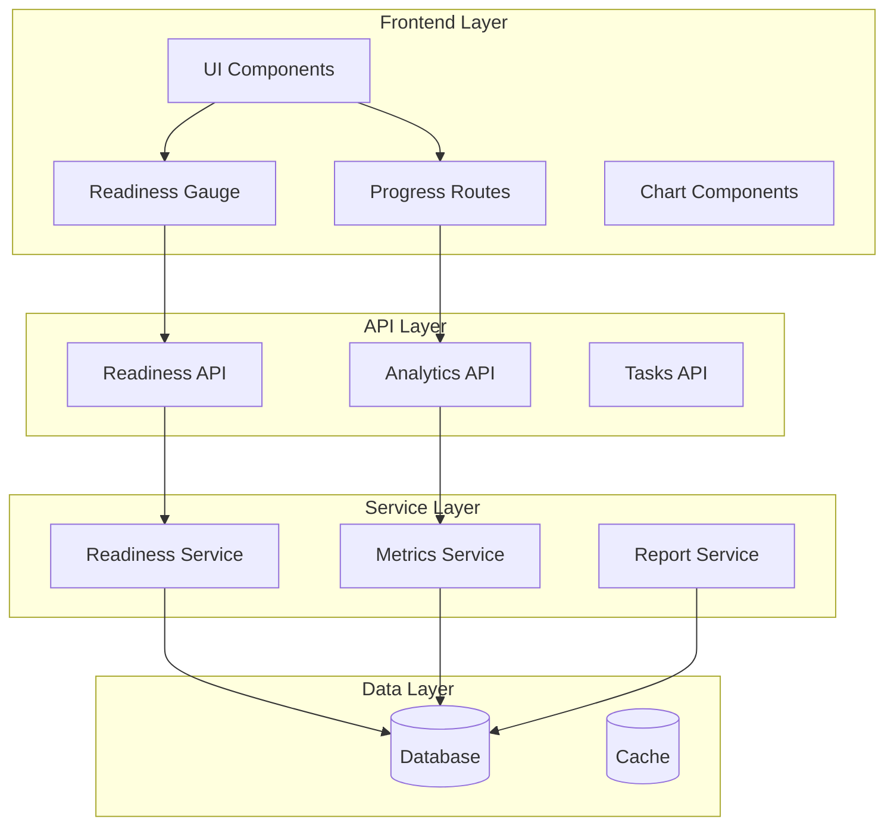
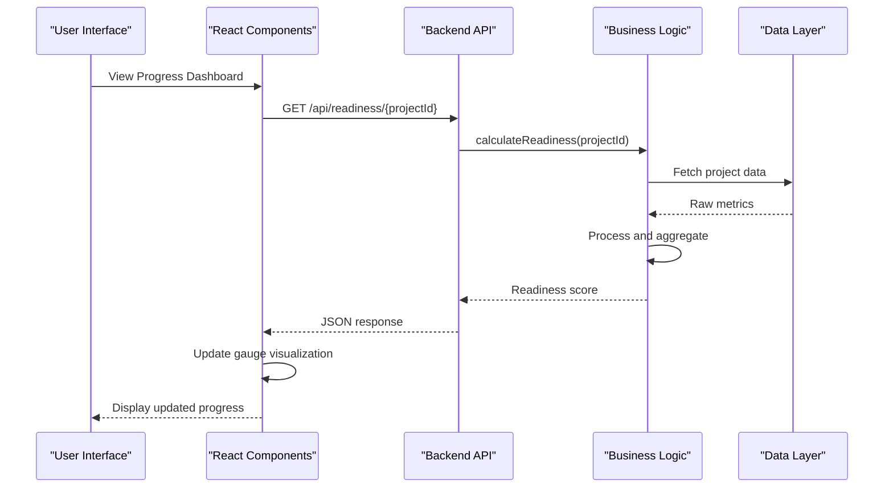
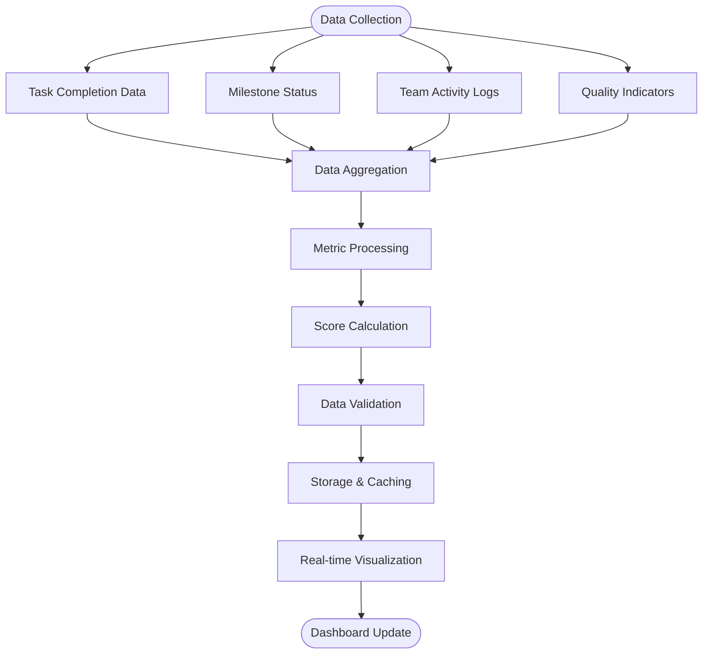
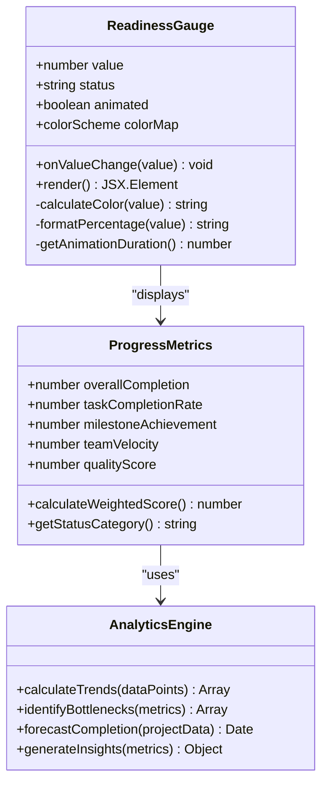
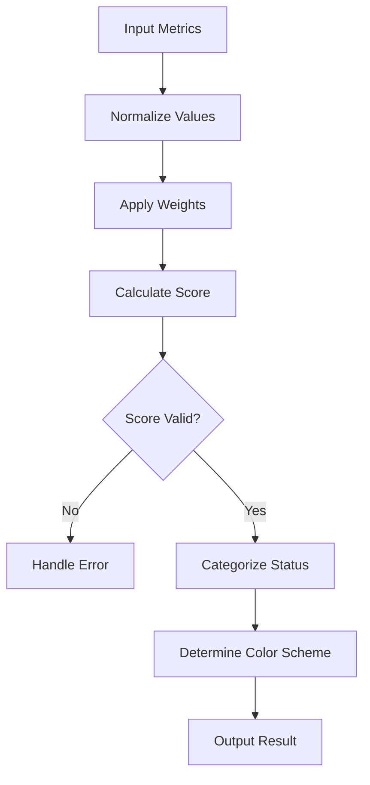
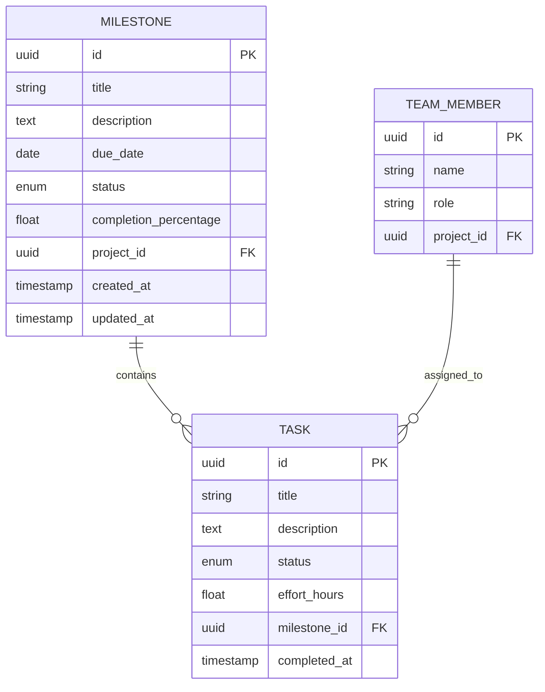
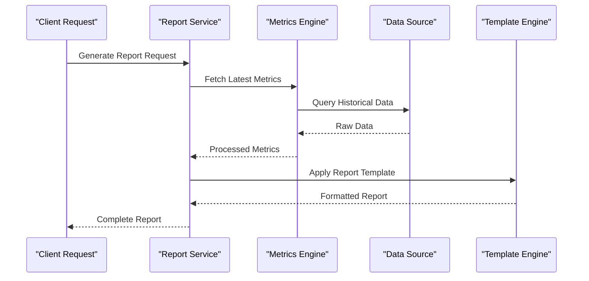
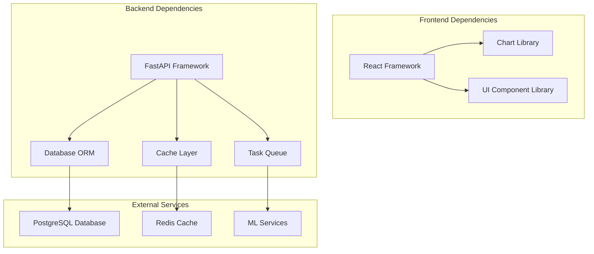

# Progress Tracking & Analytics

<cite>
**Referenced Files in This Document**
- [readiness.py](file://backend/api/readiness.py)
- [readiness_service.py](file://backend/services/readiness_service.py)
- [analytics.py](file://backend/api/analytics.py)
- [readiness-gauge.tsx](file://src/components/readiness-gauge.tsx)
- [progress.tsx](file://src/routes/progress.tsx)
- [readiness.tsx](file://src/routes/readiness.tsx)
- [delivery_metrics.py](file://backend/ai/delivery_metrics.py)
- [report_service.py](file://backend/ai/report_service.py)
- [chart.tsx](file://src/components/ui/chart.tsx)
- [progress.tsx](file://src/components/ui/progress.tsx)
</cite>

## Table of Contents
1. [Introduction](#introduction)
2. [Project Structure](#project-structure)
3. [Core Components](#core-components)
4. [Architecture Overview](#architecture-overview)
5. [Detailed Component Analysis](#detailed-component-analysis)
6. [Dependency Analysis](#dependency-analysis)
7. [Performance Considerations](#performance-considerations)
8. [Troubleshooting Guide](#troubleshooting-guide)
9. [Conclusion](#conclusion)

## Introduction

This document provides comprehensive documentation for the progress tracking and analytics features in the Horux project management platform. The system implements sophisticated readiness assessment algorithms, real-time progress metrics calculation, and interactive visualization components to help teams track project completion, identify bottlenecks, and forecast delivery timelines.

The platform combines backend services for data aggregation and metric computation with frontend components for intuitive progress visualization, enabling stakeholders to make data-driven decisions about project status and resource allocation.

## Project Structure

The progress tracking and analytics system is organized across multiple layers:

**Diagram sources**
- [readiness-gauge.tsx](file://src/components/readiness-gauge.tsx)
- [progress.tsx](file://src/routes/progress.tsx)
- [readiness.py](file://backend/api/readiness.py)
- [readiness_service.py](file://backend/services/readiness_service.py)

**Section sources**
- [readiness-gauge.tsx](file://src/components/readiness-gauge.tsx)
- [progress.tsx](file://src/routes/progress.tsx)
- [readiness.py](file://backend/api/readiness.py)
- [readiness_service.py](file://backend/services/readiness_service.py)

## Core Components

### Readiness Assessment Engine

The readiness assessment engine calculates project readiness scores using multiple factors including task completion rates, milestone achievement, team velocity, and quality metrics. The algorithm considers weighted contributions from different project dimensions to provide a comprehensive readiness score.

### Progress Metrics Calculator

The metrics calculator computes various progress indicators including:
- Overall completion percentage
- Task completion rate by category
- Team performance metrics
- Velocity trends over time
- Risk indicators and bottleneck identification

### Visualization Components

Interactive visualizations include:
- Readiness gauge with dynamic color coding
- Progress bars with milestone markers
- Trend charts for historical analysis
- Heat maps for bottleneck identification
- Real-time status updates

**Section sources**
- [readiness_service.py](file://backend/services/readiness_service.py)
- [delivery_metrics.py](file://backend/ai/delivery_metrics.py)
- [readiness-gauge.tsx](file://src/components/readiness-gauge.tsx)

## Architecture Overview

The progress tracking system follows a layered architecture pattern with clear separation of concerns:

**Diagram sources**
- [readiness.py](file://backend/api/readiness.py)
- [readiness_service.py](file://backend/services/readiness_service.py)
- [readiness-gauge.tsx](file://src/components/readiness-gauge.tsx)

### Data Flow Architecture

**Diagram sources**
- [readiness_service.py](file://backend/services/readiness_service.py)
- [analytics.py](file://backend/api/analytics.py)

## Detailed Component Analysis

### Readiness Gauge Implementation

The readiness gauge component provides visual feedback on project readiness through an interactive circular gauge with dynamic color coding and animated transitions.

#### Class Structure

**Diagram sources**
- [readiness-gauge.tsx](file://src/components/readiness-gauge.tsx)
- [readiness_service.py](file://backend/services/readiness_service.py)

#### Algorithm Implementation

The readiness calculation algorithm uses a weighted scoring system:

**Diagram sources**
- [readiness_service.py](file://backend/services/readiness_service.py)

### Milestone Tracking System

The milestone tracking system monitors project milestones and their completion status, providing detailed insights into project progression.

#### Data Model

**Diagram sources**
- [readiness_service.py](file://backend/services/readiness_service.py)

### Completion Reporting System

The completion reporting system generates comprehensive reports on project completion status, team performance, and delivery metrics.

#### Report Generation Pipeline

**Diagram sources**
- [report_service.py](file://backend/ai/report_service.py)
- [delivery_metrics.py](file://backend/ai/delivery_metrics.py)

**Section sources**
- [readiness-gauge.tsx](file://src/components/readiness-gauge.tsx)
- [readiness_service.py](file://backend/services/readiness_service.py)
- [report_service.py](file://backend/ai/report_service.py)
- [delivery_metrics.py](file://backend/ai/delivery_metrics.py)

## Dependency Analysis

The progress tracking system has well-defined dependencies between components:

**Diagram sources**
- [readiness-gauge.tsx](file://src/components/readiness-gauge.tsx)
- [readiness.py](file://backend/api/readiness.py)
- [readiness_service.py](file://backend/services/readiness_service.py)

### Component Coupling Analysis

The system maintains loose coupling between components through well-defined interfaces:

- **API Layer**: Provides RESTful endpoints for data access
- **Service Layer**: Contains business logic and calculations
- **Data Layer**: Handles persistence and caching
- **Presentation Layer**: Manages user interface and interactions

**Section sources**
- [readiness.py](file://backend/api/readiness.py)
- [readiness_service.py](file://backend/services/readiness_service.py)

## Performance Considerations

### Caching Strategy

The system implements multi-level caching to optimize performance:

1. **Browser Cache**: Client-side caching for frequently accessed data
2. **Application Cache**: In-memory caching for computed metrics
3. **Database Cache**: Query result caching for expensive operations
4. **CDN Cache**: Static asset caching for UI components

### Real-time Updates

Real-time progress updates are implemented using WebSocket connections for live dashboard updates and event-driven architecture for immediate data synchronization.

### Optimization Techniques

- **Lazy Loading**: Components load only when needed
- **Debounced Updates**: Prevent excessive re-renders during rapid data changes
- **Batch Processing**: Aggregate multiple updates into single operations
- **Index Optimization**: Database indexes for frequently queried fields

## Troubleshooting Guide

### Common Issues and Solutions

#### Readiness Score Not Updating

**Symptoms**: Readiness gauge shows stale data or doesn't reflect recent changes

**Resolution Steps**:
1. Verify WebSocket connection status
2. Check cache invalidation triggers
3. Validate data pipeline connectivity
4. Review error logs for processing failures

#### Performance Degradation

**Symptoms**: Slow dashboard loading or delayed metric updates

**Resolution Steps**:
1. Monitor database query performance
2. Check cache hit ratios
3. Analyze memory usage patterns
4. Review background job queue status

#### Data Accuracy Issues

**Symptoms**: Incorrect progress calculations or inconsistent metrics

**Resolution Steps**:
1. Validate input data integrity
2. Check calculation algorithm implementations
3. Review data transformation pipelines
4. Verify unit test coverage for critical calculations

**Section sources**
- [readiness_service.py](file://backend/services/readiness_service.py)
- [analytics.py](file://backend/api/analytics.py)

## Conclusion

The progress tracking and analytics system in Horux provides a comprehensive solution for monitoring project health, team performance, and delivery timelines. The modular architecture ensures scalability and maintainability while the real-time capabilities enable proactive project management decisions.

Key strengths of the system include:

- **Comprehensive Metrics**: Multiple dimensions of progress tracking
- **Real-time Updates**: Live dashboard with instant feedback
- **Advanced Analytics**: Predictive insights and trend analysis
- **Scalable Architecture**: Modular design supporting growth
- **User-friendly Interface**: Intuitive visualizations for stakeholders

Future enhancements should focus on advanced machine learning capabilities for predictive analytics, expanded integration options, and enhanced customization features for different project methodologies.