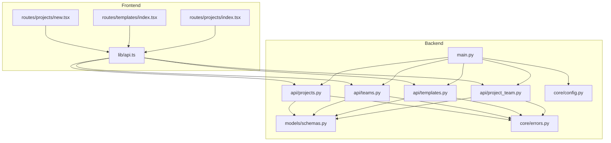
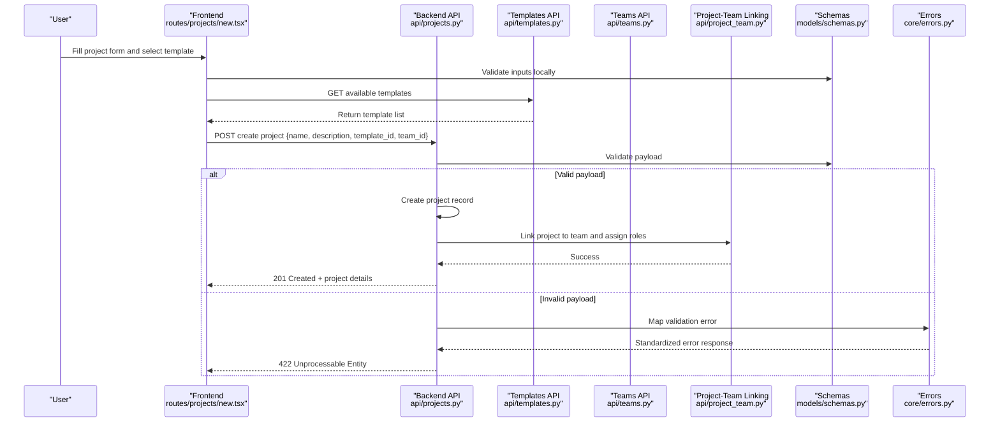
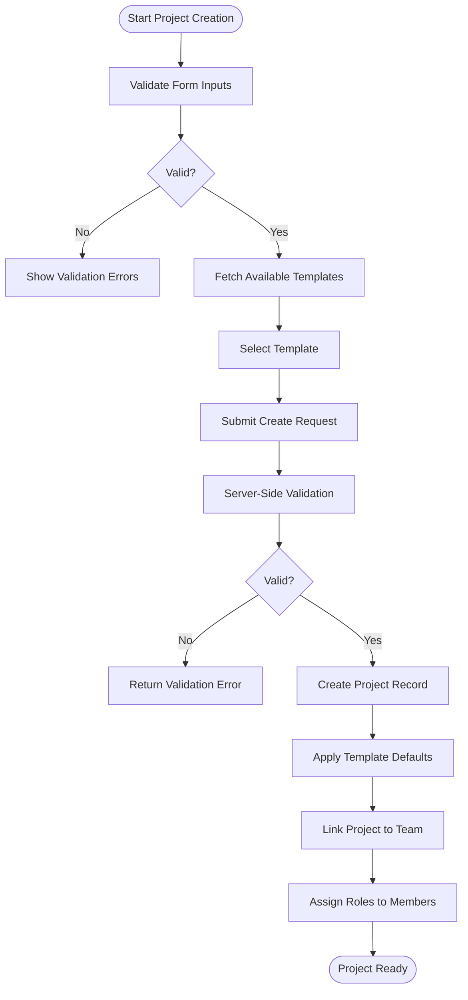
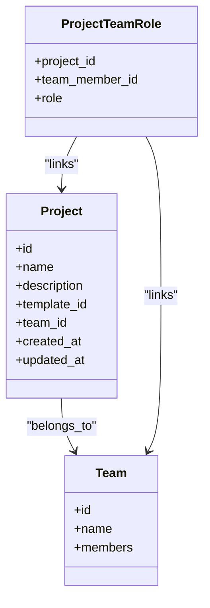
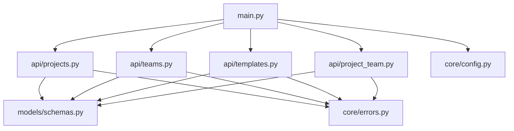

# Project Creation & Setup

<cite>
**Referenced Files in This Document**
- [backend/api/projects.py](file://backend/api/projects.py)
- [backend/api/teams.py](file://backend/api/teams.py)
- [backend/api/templates.py](file://backend/api/templates.py)
- [backend/api/project_team.py](file://backend/api/project_team.py)
- [backend/models/schemas.py](file://backend/models/schemas.py)
- [backend/core/errors.py](file://backend/core/errors.py)
- [backend/core/config.py](file://backend/core/config.py)
- [src/routes/projects/new.tsx](file://src/routes/projects/new.tsx)
- [src/routes/projects/index.tsx](file://src/routes/projects/index.tsx)
- [src/routes/templates/index.tsx](file://src/routes/templates/index.tsx)
- [src/lib/api.ts](file://src/lib/api.ts)
- [backend/main.py](file://backend/main.py)
</cite>

## Table of Contents
1. [Introduction](#introduction)
2. [Project Structure](#project-structure)
3. [Core Components](#core-components)
4. [Architecture Overview](#architecture-overview)
5. [Detailed Component Analysis](#detailed-component-analysis)
6. [Dependency Analysis](#dependency-analysis)
7. [Performance Considerations](#performance-considerations)
8. [Troubleshooting Guide](#troubleshooting-guide)
9. [Conclusion](#conclusion)

## Introduction
This document explains how projects are created and configured in the application, covering the end-to-end workflow from the frontend form to backend validation, template selection, team linkage, permissions, and initial configuration. It also documents the relevant API endpoints, data validation rules, error handling, and common setup scenarios for different project types.

## Project Structure
The project creation feature spans both frontend routes and backend APIs:
- Frontend routes handle user input, form validation, and API calls for creating projects and managing teams and templates.
- Backend APIs expose endpoints for project CRUD, team management, template operations, and linking projects to teams with role-based access control.
- Shared schemas define request/response models and validation rules.
- Core modules provide configuration and error handling utilities.

**Diagram sources**
- [src/routes/projects/new.tsx](file://src/routes/projects/new.tsx)
- [src/routes/templates/index.tsx](file://src/routes/templates/index.tsx)
- [src/routes/projects/index.tsx](file://src/routes/projects/index.tsx)
- [src/lib/api.ts](file://src/lib/api.ts)
- [backend/main.py](file://backend/main.py)
- [backend/api/projects.py](file://backend/api/projects.py)
- [backend/api/teams.py](file://backend/api/teams.py)
- [backend/api/templates.py](file://backend/api/templates.py)
- [backend/api/project_team.py](file://backend/api/project_team.py)
- [backend/models/schemas.py](file://backend/models/schemas.py)
- [backend/core/errors.py](file://backend/core/errors.py)
- [backend/core/config.py](file://backend/core/config.py)

**Section sources**
- [backend/main.py](file://backend/main.py)
- [backend/api/projects.py](file://backend/api/projects.py)
- [backend/api/teams.py](file://backend/api/teams.py)
- [backend/api/templates.py](file://backend/api/templates.py)
- [backend/api/project_team.py](file://backend/api/project_team.py)
- [backend/models/schemas.py](file://backend/models/schemas.py)
- [backend/core/errors.py](file://backend/core/errors.py)
- [backend/core/config.py](file://backend/core/config.py)
- [src/routes/projects/new.tsx](file://src/routes/projects/new.tsx)
- [src/routes/templates/index.tsx](file://src/routes/templates/index.tsx)
- [src/routes/projects/index.tsx](file://src/routes/projects/index.tsx)
- [src/lib/api.ts](file://src/lib/api.ts)

## Core Components
- Project creation endpoint(s): Accepts validated payload, creates a project record, and returns the new project details.
- Template selection: Retrieves available templates and applies selected template defaults during project initialization.
- Team linkage: Associates the newly created project with a team and assigns roles for access control.
- Validation and errors: Centralized schema definitions and error responses ensure consistent behavior across endpoints.

Key responsibilities:
- Input validation via shared schemas.
- Transactional creation of project and related entities (team membership, roles).
- Error mapping to standardized HTTP responses.

**Section sources**
- [backend/api/projects.py](file://backend/api/projects.py)
- [backend/api/templates.py](file://backend/api/templates.py)
- [backend/api/project_team.py](file://backend/api/project_team.py)
- [backend/models/schemas.py](file://backend/models/schemas.py)
- [backend/core/errors.py](file://backend/core/errors.py)

## Architecture Overview
The project creation flow involves coordinated interactions between the frontend UI, API layer, and shared schemas. The sequence below illustrates the typical path when a user creates a new project.

**Diagram sources**
- [src/routes/projects/new.tsx](file://src/routes/projects/new.tsx)
- [backend/api/projects.py](file://backend/api/projects.py)
- [backend/api/templates.py](file://backend/api/templates.py)
- [backend/api/teams.py](file://backend/api/teams.py)
- [backend/api/project_team.py](file://backend/api/project_team.py)
- [backend/models/schemas.py](file://backend/models/schemas.py)
- [backend/core/errors.py](file://backend/core/errors.py)

## Detailed Component Analysis

### Project Creation Workflow
- Form validation: The frontend validates required fields before submission.
- Template selection: Users choose a template that preconfigures project settings.
- Initial configuration: The backend applies template defaults and sets up default workflows or tasks based on the chosen template.
- Team association: The project is linked to a team, and the creator is assigned an appropriate role.

**Diagram sources**
- [src/routes/projects/new.tsx](file://src/routes/projects/new.tsx)
- [backend/api/projects.py](file://backend/api/projects.py)
- [backend/api/templates.py](file://backend/api/templates.py)
- [backend/api/project_team.py](file://backend/api/project_team.py)
- [backend/models/schemas.py](file://backend/models/schemas.py)

**Section sources**
- [src/routes/projects/new.tsx](file://src/routes/projects/new.tsx)
- [backend/api/projects.py](file://backend/api/projects.py)
- [backend/api/templates.py](file://backend/api/templates.py)
- [backend/api/project_team.py](file://backend/api/project_team.py)
- [backend/models/schemas.py](file://backend/models/schemas.py)

### API Endpoints for Project Creation
- Create Project: Accepts a validated payload including name, description, optional template identifier, and team identifier. Returns the created project.
- List Templates: Provides available templates for selection during project creation.
- Team Management: Supports adding members and assigning roles to the project’s team context.
- Project-Team Linking: Establishes relationships between projects and teams and manages role assignments.

Validation rules:
- Required fields enforced by schemas (e.g., project name, team association).
- Type checks and constraints applied server-side.
- Consistent error responses for invalid payloads.

Error handling:
- Standardized error codes and messages.
- Mapping of database or business rule violations to HTTP status codes.

**Section sources**
- [backend/api/projects.py](file://backend/api/projects.py)
- [backend/api/templates.py](file://backend/api/templates.py)
- [backend/api/teams.py](file://backend/api/teams.py)
- [backend/api/project_team.py](file://backend/api/project_team.py)
- [backend/models/schemas.py](file://backend/models/schemas.py)
- [backend/core/errors.py](file://backend/core/errors.py)

### Relationship Between Projects and Teams
- A project belongs to a team; team membership determines who can access and manage the project.
- Role-based access control is applied when linking a project to a team, ensuring only authorized users can perform actions.
- During setup, the creator typically becomes a manager or owner depending on policy.

**Diagram sources**
- [backend/models/schemas.py](file://backend/models/schemas.py)
- [backend/api/project_team.py](file://backend/api/project_team.py)
- [backend/api/teams.py](file://backend/api/teams.py)
- [backend/api/projects.py](file://backend/api/projects.py)

**Section sources**
- [backend/models/schemas.py](file://backend/models/schemas.py)
- [backend/api/project_team.py](file://backend/api/project_team.py)
- [backend/api/teams.py](file://backend/api/teams.py)
- [backend/api/projects.py](file://backend/api/projects.py)

### Permission Assignment and Access Control
- Roles are assigned when a project is linked to a team.
- Permissions are derived from roles to control read/write access to project resources.
- Admin-level operations may require elevated roles or additional authorization checks.

Best practices:
- Enforce least privilege by default.
- Validate role changes through dedicated endpoints.
- Log permission-related events for auditability.

**Section sources**
- [backend/api/project_team.py](file://backend/api/project_team.py)
- [backend/api/teams.py](file://backend/api/teams.py)
- [backend/core/errors.py](file://backend/core/errors.py)

### Examples of Creating Different Project Types
- Code-focused project: Select a code-aware template to initialize repositories, linting, and CI steps.
- Presentation project: Choose a presentation template to scaffold slides and assets.
- Viva session project: Use a viva-specific template to configure sessions and prompts.

Steps:
- Navigate to the project creation route.
- Select the appropriate template.
- Provide required metadata (name, description).
- Associate with a team and confirm member roles.

**Section sources**
- [src/routes/projects/new.tsx](file://src/routes/projects/new.tsx)
- [src/routes/templates/index.tsx](file://src/routes/templates/index.tsx)
- [backend/api/templates.py](file://backend/api/templates.py)
- [backend/api/projects.py](file://backend/api/projects.py)

### Setting Up Team Members
- Add team members via the team management endpoint.
- Assign roles such as viewer, editor, or manager based on responsibilities.
- Ensure the project is linked to the team so members gain access accordingly.

Operational notes:
- Validate email or user identifiers before adding members.
- Handle duplicate member additions gracefully.
- Confirm role changes with appropriate permissions.

**Section sources**
- [backend/api/teams.py](file://backend/api/teams.py)
- [backend/api/project_team.py](file://backend/api/project_team.py)

### Configuring Project Templates
- Retrieve available templates and their metadata.
- Apply template defaults during project creation to preconfigure workflows, tasks, and settings.
- Allow customization after creation if supported by the template.

Template lifecycle:
- List templates.
- Inspect template details.
- Apply template during project creation.

**Section sources**
- [backend/api/templates.py](file://backend/api/templates.py)
- [src/routes/templates/index.tsx](file://src/routes/templates/index.tsx)

### Initializing Project Workflows
- Templates drive initial workflow setup (tasks, stages, automation rules).
- After project creation, verify that default workflows are present and accessible.
- Adjust workflows as needed using project settings or dedicated workflow endpoints.

**Section sources**
- [backend/api/projects.py](file://backend/api/projects.py)
- [backend/api/templates.py](file://backend/api/templates.py)

## Dependency Analysis
The project creation feature depends on several backend modules and shared schemas. The diagram below shows key dependencies among components.

**Diagram sources**
- [backend/main.py](file://backend/main.py)
- [backend/api/projects.py](file://backend/api/projects.py)
- [backend/api/teams.py](file://backend/api/teams.py)
- [backend/api/templates.py](file://backend/api/templates.py)
- [backend/api/project_team.py](file://backend/api/project_team.py)
- [backend/models/schemas.py](file://backend/models/schemas.py)
- [backend/core/errors.py](file://backend/core/errors.py)
- [backend/core/config.py](file://backend/core/config.py)

**Section sources**
- [backend/main.py](file://backend/main.py)
- [backend/api/projects.py](file://backend/api/projects.py)
- [backend/api/teams.py](file://backend/api/teams.py)
- [backend/api/templates.py](file://backend/api/templates.py)
- [backend/api/project_team.py](file://backend/api/project_team.py)
- [backend/models/schemas.py](file://backend/models/schemas.py)
- [backend/core/errors.py](file://backend/core/errors.py)
- [backend/core/config.py](file://backend/core/config.py)

## Performance Considerations
- Batch operations where possible to reduce round trips (e.g., fetching templates once).
- Cache frequently accessed template metadata at the frontend level.
- Optimize database queries for project listing and team membership lookups.
- Avoid unnecessary re-validation by leveraging frontend and backend validations consistently.

[No sources needed since this section provides general guidance]

## Troubleshooting Guide
Common issues and resolutions:
- Validation errors: Check required fields and data types; review error messages returned by the server.
- Template not found: Verify template IDs and availability; ensure the correct template is selected.
- Team linkage failures: Confirm team exists and the user has permission to link projects to it.
- Permission denied: Review role assignments and ensure the user holds sufficient privileges.

Debugging tips:
- Inspect network requests and responses in browser dev tools.
- Log server-side errors and trace stack traces for root causes.
- Validate environment configuration and database connectivity.

**Section sources**
- [backend/core/errors.py](file://backend/core/errors.py)
- [backend/api/projects.py](file://backend/api/projects.py)
- [backend/api/templates.py](file://backend/api/templates.py)
- [backend/api/teams.py](file://backend/api/teams.py)
- [backend/api/project_team.py](file://backend/api/project_team.py)

## Conclusion
Project creation and setup involve coordinated frontend and backend processes, robust validation, template-driven initialization, and secure team linkage with role-based access control. By following the documented workflows and troubleshooting steps, users can reliably create and configure projects tailored to their needs.

[No sources needed since this section summarizes without analyzing specific files]