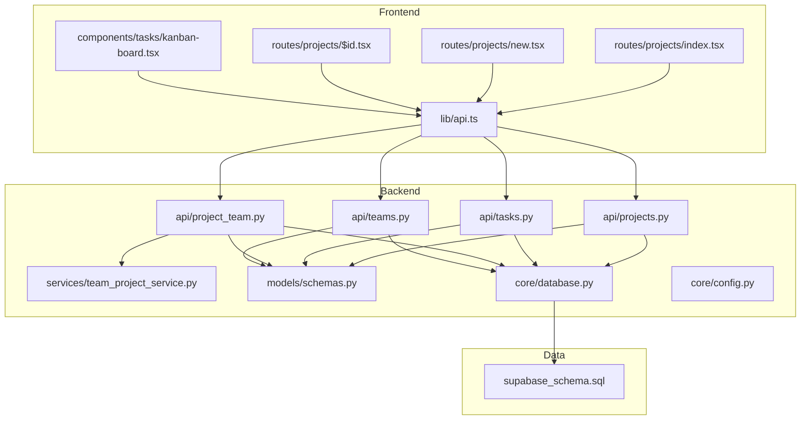
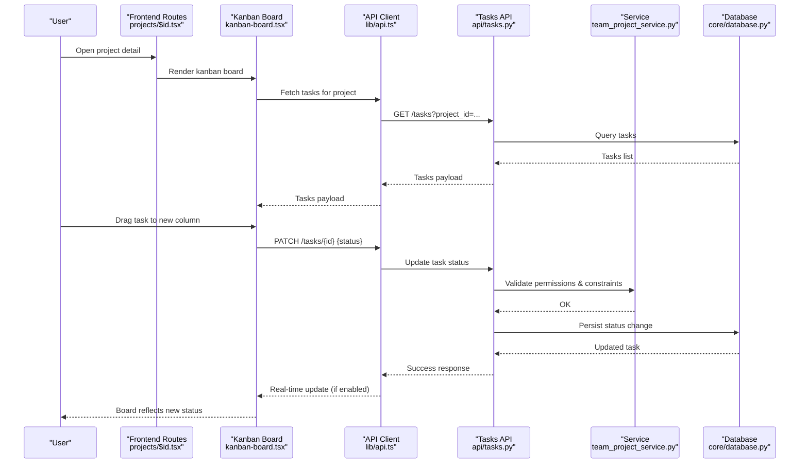
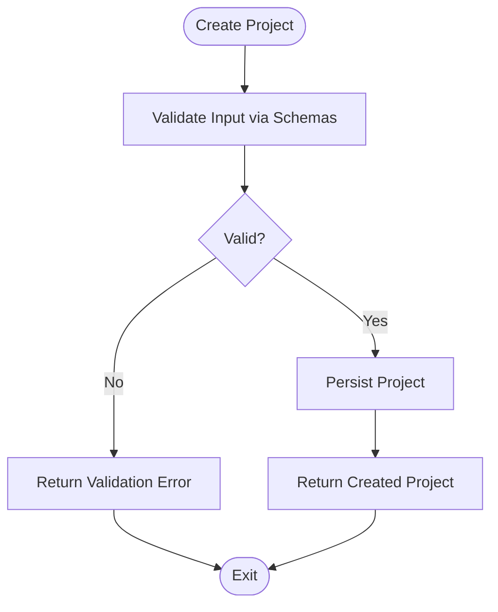
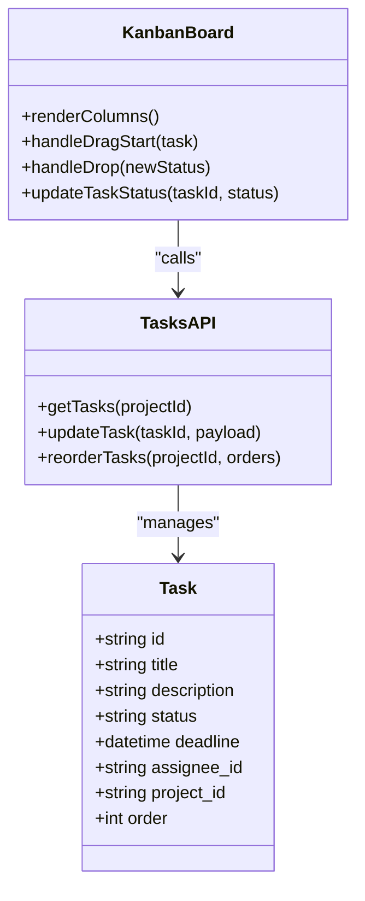
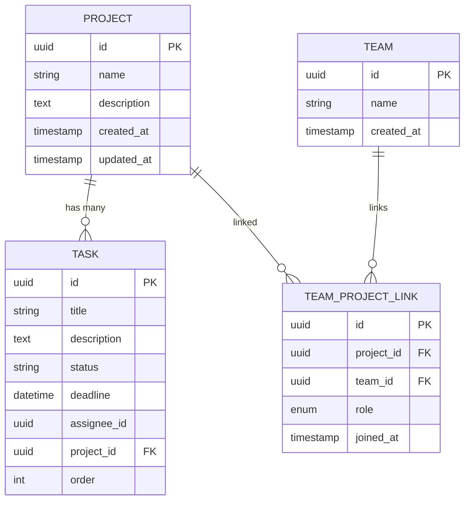
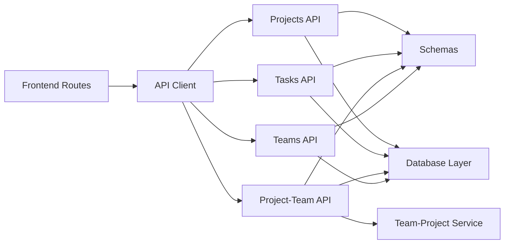

# Project Management

<cite>
**Referenced Files in This Document**
- [projects.py](file://backend/api/projects.py)
- [tasks.py](file://backend/api/tasks.py)
- [project_team.py](file://backend/api/project_team.py)
- [teams.py](file://backend/api/teams.py)
- [team_project_service.py](file://backend/services/team_project_service.py)
- [schemas.py](file://backend/models/schemas.py)
- [database.py](file://backend/core/database.py)
- [config.py](file://backend/core/config.py)
- [kanban-board.tsx](file://src/components/tasks/kanban-board.tsx)
- [projects/index.tsx](file://src/routes/projects/index.tsx)
- [projects/new.tsx](file://src/routes/projects/new.tsx)
- [projects/$id.tsx](file://src/routes/projects/$id.tsx)
- [api.ts](file://src/lib/api.ts)
- [supabase_schema.sql](file://backend/supabase_schema.sql)
</cite>

## Table of Contents
1. [Introduction](#introduction)
2. [Project Structure](#project-structure)
3. [Core Components](#core-components)
4. [Architecture Overview](#architecture-overview)
5. [Detailed Component Analysis](#detailed-component-analysis)
6. [Dependency Analysis](#dependency-analysis)
7. [Performance Considerations](#performance-considerations)
8. [Troubleshooting Guide](#troubleshooting-guide)
9. [Conclusion](#conclusion)
10. [Appendices](#appendices)

## Introduction
This document provides comprehensive documentation for the project management module, focusing on:
- Project creation and lifecycle management
- Task tracking with a kanban board and drag-and-drop
- Team assignment and permissions
- Progress monitoring and reporting
- Backend services for persistence and real-time synchronization
- Workflow patterns for setup, delegation, milestones, and completion

The module integrates frontend components (React-based routes and UI) with backend APIs (FastAPI-style endpoints), data models, and database schemas to deliver a collaborative project experience.

## Project Structure
The project management feature spans both frontend and backend layers:
- Frontend routes define user flows for listing, creating, and viewing projects, as well as interacting with tasks via a kanban board.
- Backend APIs expose endpoints for projects, tasks, teams, and team-project relationships.
- Services encapsulate business logic for linking teams to projects and managing related operations.
- Data models define request/response schemas and validation rules.
- Database schema defines tables and relationships for projects, tasks, teams, and memberships.

**Diagram sources**
- [projects/index.tsx](file://src/routes/projects/index.tsx)
- [projects/new.tsx](file://src/routes/projects/new.tsx)
- [projects/$id.tsx](file://src/routes/projects/$id.tsx)
- [kanban-board.tsx](file://src/components/tasks/kanban-board.tsx)
- [api.ts](file://src/lib/api.ts)
- [projects.py](file://backend/api/projects.py)
- [tasks.py](file://backend/api/tasks.py)
- [project_team.py](file://backend/api/project_team.py)
- [teams.py](file://backend/api/teams.py)
- [team_project_service.py](file://backend/services/team_project_service.py)
- [schemas.py](file://backend/models/schemas.py)
- [database.py](file://backend/core/database.py)
- [config.py](file://backend/core/config.py)
- [supabase_schema.sql](file://backend/supabase_schema.sql)

**Section sources**
- [projects/index.tsx](file://src/routes/projects/index.tsx)
- [projects/new.tsx](file://src/routes/projects/new.tsx)
- [projects/$id.tsx](file://src/routes/projects/$id.tsx)
- [kanban-board.tsx](file://src/components/tasks/kanban-board.tsx)
- [api.ts](file://src/lib/api.ts)
- [projects.py](file://backend/api/projects.py)
- [tasks.py](file://backend/api/tasks.py)
- [project_team.py](file://backend/api/project_team.py)
- [teams.py](file://backend/api/teams.py)
- [team_project_service.py](file://backend/services/team_project_service.py)
- [schemas.py](file://backend/models/schemas.py)
- [database.py](file://backend/core/database.py)
- [config.py](file://backend/core/config.py)
- [supabase_schema.sql](file://backend/supabase_schema.sql)

## Core Components
- Projects API: Endpoints to create, read, update, and delete projects; list projects for users or teams.
- Tasks API: Endpoints to manage tasks within a project, including status transitions, deadlines, and reordering.
- Project-Team API: Endpoints to link teams to projects and manage memberships.
- Teams API: Endpoints to manage teams and their attributes.
- Team-Project Service: Business logic for linking teams to projects and enforcing constraints.
- Data Models: Pydantic-like schemas for input/output validation and serialization.
- Database Layer: Abstraction over Supabase/PostgreSQL for CRUD operations and transactions.
- Frontend Routes: User flows for project listing, creation, and detail views.
- Kanban Board: Drag-and-drop task management with status columns and deadline indicators.

Key responsibilities:
- Enforce role-based access control when assigning team members and modifying tasks.
- Maintain consistent task statuses across the board and persist changes atomically.
- Provide real-time updates where applicable (e.g., live collaboration).

**Section sources**
- [projects.py](file://backend/api/projects.py)
- [tasks.py](file://backend/api/tasks.py)
- [project_team.py](file://backend/api/project_team.py)
- [teams.py](file://backend/api/teams.py)
- [team_project_service.py](file://backend/services/team_project_service.py)
- [schemas.py](file://backend/models/schemas.py)
- [database.py](file://backend/core/database.py)
- [kanban-board.tsx](file://src/components/tasks/kanban-board.tsx)
- [projects/index.tsx](file://src/routes/projects/index.tsx)
- [projects/new.tsx](file://src/routes/projects/new.tsx)
- [projects/$id.tsx](file://src/routes/projects/$id.tsx)

## Architecture Overview
The system follows a layered architecture:
- Presentation layer (frontend routes and components) handles user interactions and renders the kanban board.
- API layer exposes REST endpoints for projects, tasks, teams, and team-project relationships.
- Service layer encapsulates business logic such as team-project linking and permission checks.
- Data layer persists entities to the database using an abstraction that supports transactions and queries.

**Diagram sources**
- [projects/$id.tsx](file://src/routes/projects/$id.tsx)
- [kanban-board.tsx](file://src/components/tasks/kanban-board.tsx)
- [api.ts](file://src/lib/api.ts)
- [tasks.py](file://backend/api/tasks.py)
- [team_project_service.py](file://backend/services/team_project_service.py)
- [database.py](file://backend/core/database.py)

## Detailed Component Analysis

### Projects API
Responsibilities:
- Create new projects with metadata (name, description, deadlines, visibility).
- Retrieve project details and lists filtered by user or team context.
- Update project settings and archive/delete projects.

Typical workflow:
- Frontend route calls API client to create a project.
- Backend validates input via schemas, persists via database layer, and returns created entity.
- Subsequent reads fetch project details and associated tasks.

**Diagram sources**
- [projects.py](file://backend/api/projects.py)
- [schemas.py](file://backend/models/schemas.py)
- [database.py](file://backend/core/database.py)

**Section sources**
- [projects.py](file://backend/api/projects.py)
- [schemas.py](file://backend/models/schemas.py)
- [database.py](file://backend/core/database.py)

### Tasks API and Kanban Board
Responsibilities:
- Manage tasks within a project: create, read, update, delete.
- Support status transitions (e.g., To Do, In Progress, Review, Done).
- Track deadlines and reorder tasks within columns.
- Enforce permissions based on team membership and roles.

Kanban board implementation:
- Renders columns per status with draggable task cards.
- On drop, triggers a PATCH request to update task status.
- Optionally subscribes to real-time updates for live collaboration.

**Diagram sources**
- [kanban-board.tsx](file://src/components/tasks/kanban-board.tsx)
- [tasks.py](file://backend/api/tasks.py)
- [schemas.py](file://backend/models/schemas.py)

**Section sources**
- [tasks.py](file://backend/api/tasks.py)
- [kanban-board.tsx](file://src/components/tasks/kanban-board.tsx)
- [schemas.py](file://backend/models/schemas.py)

### Project-Team Relationship Model and Permissions
Responsibilities:
- Link teams to projects and manage memberships.
- Enforce role-based permissions for editing tasks and changing project settings.
- Provide endpoints to add/remove members and query team-project associations.

Workflow pattern:
- Admin creates a project and links a team.
- Members are assigned roles (e.g., owner, editor, viewer).
- Permission checks ensure only authorized users can modify tasks or project settings.

**Diagram sources**
- [project_team.py](file://backend/api/project_team.py)
- [team_project_service.py](file://backend/services/team_project_service.py)
- [supabase_schema.sql](file://backend/supabase_schema.sql)

**Section sources**
- [project_team.py](file://backend/api/project_team.py)
- [team_project_service.py](file://backend/services/team_project_service.py)
- [supabase_schema.sql](file://backend/supabase_schema.sql)

### Teams API
Responsibilities:
- Create, update, and delete teams.
- List teams available for assignment to projects.
- Provide team metadata used by project-team linking.

Integration points:
- Used by project-team service to validate team existence and roles.
- Consumed by frontend to populate team selection during project setup.

**Section sources**
- [teams.py](file://backend/api/teams.py)
- [team_project_service.py](file://backend/services/team_project_service.py)

### Data Models and Persistence
Responsibilities:
- Define request/response schemas for all endpoints.
- Validate inputs and serialize outputs consistently.
- Abstract database operations for reliability and testability.

Key aspects:
- Strict typing and validation reduce error surface.
- Database layer supports transactions for atomic updates (e.g., task reordering).

**Section sources**
- [schemas.py](file://backend/models/schemas.py)
- [database.py](file://backend/core/database.py)
- [config.py](file://backend/core/config.py)

### Frontend Routes and User Flows
Responsibilities:
- Provide routes for listing projects, creating new projects, and viewing project details.
- Integrate with API client to fetch and mutate data.
- Render kanban board and handle user interactions.

User flow example:
- Navigate to project detail page.
- Load tasks and render kanban board.
- Drag tasks between columns to update status.
- Save changes via API and reflect updates in real time.

**Section sources**
- [projects/index.tsx](file://src/routes/projects/index.tsx)
- [projects/new.tsx](file://src/routes/projects/new.tsx)
- [projects/$id.tsx](file://src/routes/projects/$id.tsx)
- [api.ts](file://src/lib/api.ts)
- [kanban-board.tsx](file://src/components/tasks/kanban-board.tsx)

## Dependency Analysis
The module exhibits clear separation of concerns:
- Frontend depends on API client for data operations.
- Backend APIs depend on services for business logic and database layer for persistence.
- Schemas provide contracts between frontend and backend.

**Diagram sources**
- [projects/index.tsx](file://src/routes/projects/index.tsx)
- [projects/new.tsx](file://src/routes/projects/new.tsx)
- [projects/$id.tsx](file://src/routes/projects/$id.tsx)
- [api.ts](file://src/lib/api.ts)
- [projects.py](file://backend/api/projects.py)
- [tasks.py](file://backend/api/tasks.py)
- [project_team.py](file://backend/api/project_team.py)
- [teams.py](file://backend/api/teams.py)
- [team_project_service.py](file://backend/services/team_project_service.py)
- [schemas.py](file://backend/models/schemas.py)
- [database.py](file://backend/core/database.py)

**Section sources**
- [api.ts](file://src/lib/api.ts)
- [projects.py](file://backend/api/projects.py)
- [tasks.py](file://backend/api/tasks.py)
- [project_team.py](file://backend/api/project_team.py)
- [teams.py](file://backend/api/teams.py)
- [team_project_service.py](file://backend/services/team_project_service.py)
- [schemas.py](file://backend/models/schemas.py)
- [database.py](file://backend/core/database.py)

## Performance Considerations
- Batch operations: Reorder tasks in a single transaction to minimize round trips.
- Caching: Cache project and team metadata at the API layer to reduce database load.
- Pagination: Implement pagination for large task lists to improve rendering performance.
- Real-time updates: Use efficient event channels to push minimal diffs to clients.
- Indexing: Ensure database indexes on frequently queried fields (project_id, status, deadline).

[No sources needed since this section provides general guidance]

## Troubleshooting Guide
Common issues and resolutions:
- Validation errors: Check schema definitions and input payloads for missing or invalid fields.
- Permission denied: Verify team membership and roles; ensure the user has required permissions.
- Task not updating: Confirm API endpoint is called with correct task ID and status; check database constraints.
- Real-time sync failures: Inspect event channel configuration and network connectivity.

Debugging steps:
- Enable detailed logging in the API layer.
- Validate requests/responses using API client logs.
- Inspect database state after mutations to confirm persistence.

**Section sources**
- [schemas.py](file://backend/models/schemas.py)
- [database.py](file://backend/core/database.py)
- [tasks.py](file://backend/api/tasks.py)
- [project_team.py](file://backend/api/project_team.py)

## Conclusion
The project management module delivers a robust foundation for collaborative project workflows. It combines a user-friendly kanban board with secure, scalable backend services to support task tracking, team collaboration, and progress monitoring. By adhering to clear architectural boundaries and strong data contracts, the system ensures reliability and extensibility.

[No sources needed since this section summarizes without analyzing specific files]

## Appendices

### Example Workflows

- Creating a project:
  - Frontend route calls API client to create a project with validated payload.
  - Backend persists the project and returns the created entity.
  - Assign a team and set initial tasks.

- Assigning team members:
  - Link a team to the project via project-team API.
  - Set roles for members and verify permissions.

- Managing tasks:
  - Create tasks with titles, descriptions, deadlines, and assignees.
  - Drag tasks across columns to update status.
  - Reorder tasks within columns to prioritize work.

- Generating progress reports:
  - Aggregate task statuses and deadlines to compute completion metrics.
  - Present insights via charts or summary views.

[No sources needed since this section provides conceptual examples]