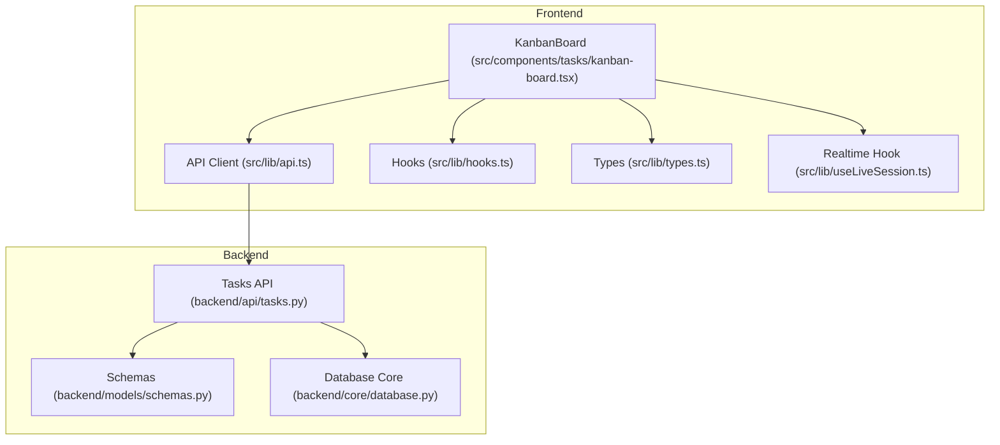
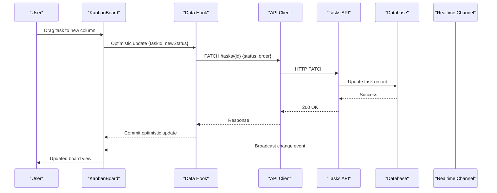
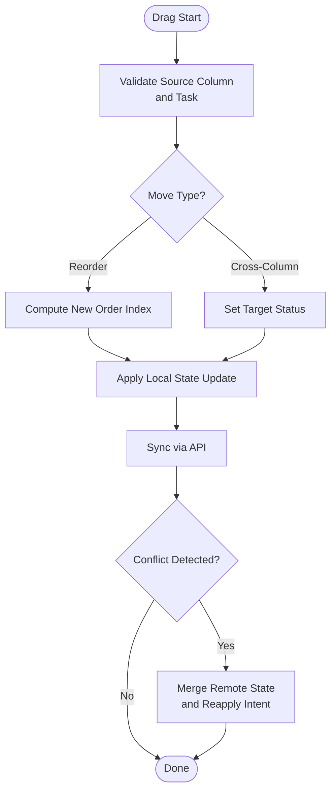
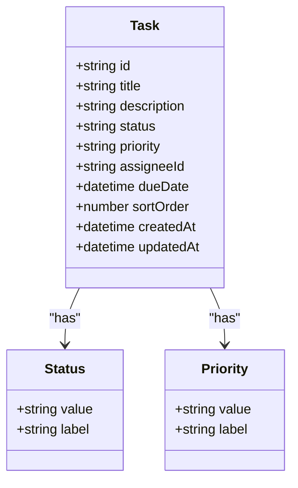
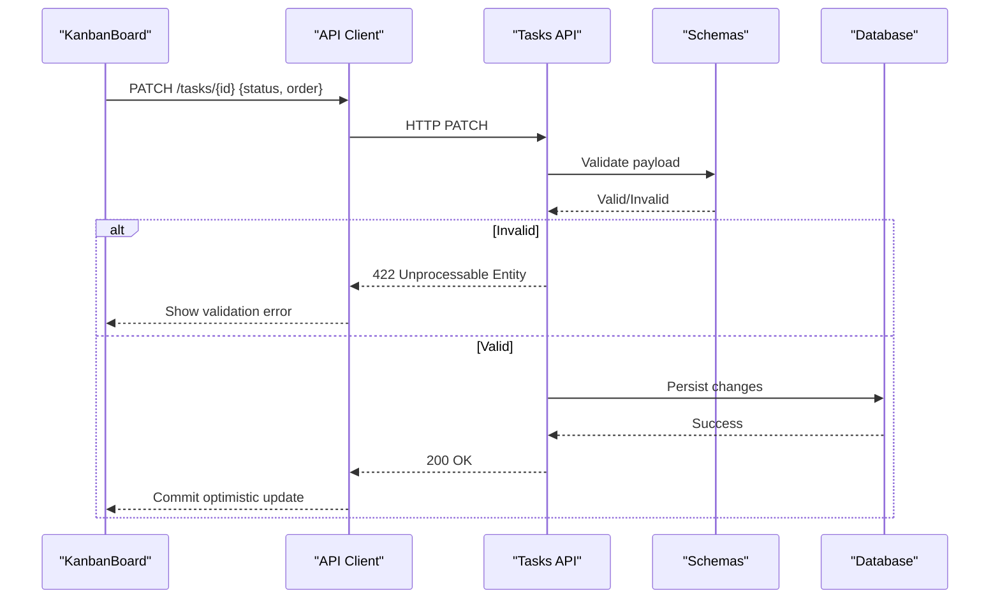
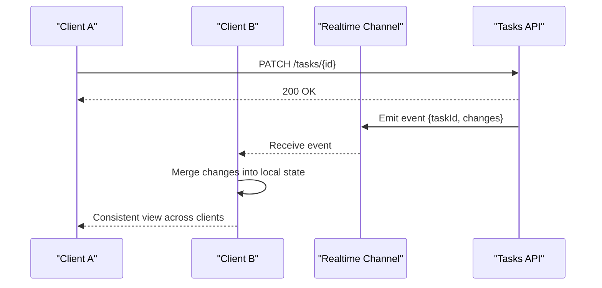
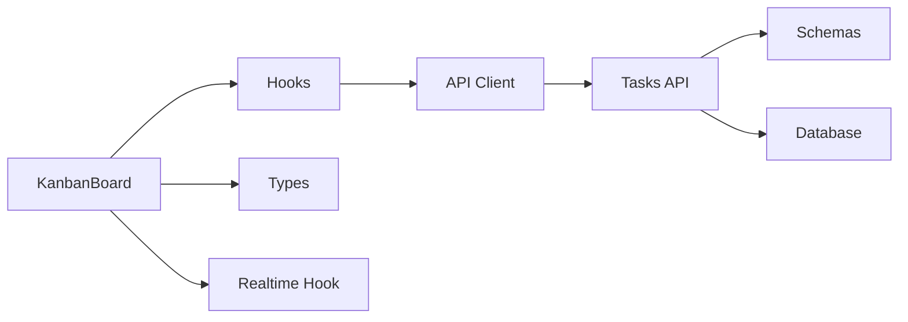

# Task Management & Kanban Board

<cite>
**Referenced Files in This Document**
- [kanban-board.tsx](file://src/components/tasks/kanban-board.tsx)
- [tasks.py](file://backend/api/tasks.py)
- [schemas.py](file://backend/models/schemas.py)
- [database.py](file://backend/core/database.py)
- [api.ts](file://src/lib/api.ts)
- [hooks.ts](file://src/lib/hooks.ts)
- [types.ts](file://src/lib/types.ts)
- [useLiveSession.ts](file://src/lib/useLiveSession.ts)
- [test_tasks_reorder.py](file://backend/tests/test_tasks_reorder.py)
</cite>

## Table of Contents
1. [Introduction](#introduction)
2. [Project Structure](#project-structure)
3. [Core Components](#core-components)
4. [Architecture Overview](#architecture-overview)
5. [Detailed Component Analysis](#detailed-component-analysis)
6. [Dependency Analysis](#dependency-analysis)
7. [Performance Considerations](#performance-considerations)
8. [Troubleshooting Guide](#troubleshooting-guide)
9. [Conclusion](#conclusion)

## Introduction
This document explains the task management system and kanban board implementation, focusing on:
- Drag-and-drop interactions for moving tasks across columns
- Task status transitions and lifecycle
- Real-time synchronization across team members
- Data models for tasks, statuses, priorities, and deadlines
- UI components for the kanban board, column management, and visual task representation
- Practical examples for creating tasks, assigning responsibilities, setting deadlines, and tracking progress
- Performance optimization for large lists, conflict resolution strategies, and offline capabilities

## Project Structure
The task management feature spans both frontend and backend layers:
- Frontend UI and state are implemented in React components and hooks under src/components/tasks and src/lib
- Backend APIs and data schemas are defined under backend/api and backend/models
- Database access is centralized in backend/core/database
- Tests validate reorder behavior and API contracts

**Diagram sources**
- [kanban-board.tsx](file://src/components/tasks/kanban-board.tsx)
- [api.ts](file://src/lib/api.ts)
- [hooks.ts](file://src/lib/hooks.ts)
- [types.ts](file://src/lib/types.ts)
- [useLiveSession.ts](file://src/lib/useLiveSession.ts)
- [tasks.py](file://backend/api/tasks.py)
- [schemas.py](file://backend/models/schemas.py)
- [database.py](file://backend/core/database.py)

**Section sources**
- [kanban-board.tsx](file://src/components/tasks/kanban-board.tsx)
- [tasks.py](file://backend/api/tasks.py)
- [schemas.py](file://backend/models/schemas.py)
- [database.py](file://backend/core/database.py)
- [api.ts](file://src/lib/api.ts)
- [hooks.ts](file://src/lib/hooks.ts)
- [types.ts](file://src/lib/types.ts)
- [useLiveSession.ts](file://src/lib/useLiveSession.ts)

## Core Components
- KanbanBoard component renders columns and tasks, handles drag-and-drop events, and updates local state before syncing with the server.
- Tasks API exposes endpoints to create, update, move, and delete tasks; validates payloads against schemas.
- Schemas define task fields including status, priority, assignee, due date, and ordering metadata.
- Database layer provides persistence and transactional operations for task mutations.
- API client abstracts HTTP calls from UI components.
- Hooks encapsulate data fetching, caching, and optimistic updates.
- Realtime hook enables live collaboration by broadcasting changes to connected clients.

Key responsibilities:
- UI: render columns, cards, and controls; manage drag-and-drop state
- State: maintain local cache, handle optimistic updates, reconcile conflicts
- Network: call backend endpoints, handle errors, retry logic
- Realtime: subscribe to channel events, merge remote changes

**Section sources**
- [kanban-board.tsx](file://src/components/tasks/kanban-board.tsx)
- [tasks.py](file://backend/api/tasks.py)
- [schemas.py](file://backend/models/schemas.py)
- [database.py](file://backend/core/database.py)
- [api.ts](file://src/lib/api.ts)
- [hooks.ts](file://src/lib/hooks.ts)
- [useLiveSession.ts](file://src/lib/useLiveSession.ts)

## Architecture Overview
The system follows a layered architecture:
- Presentation layer (React components) manages user interactions and local state
- Service layer (hooks and API client) orchestrates data flow and network requests
- Domain layer (schemas) defines validation rules and types
- Infrastructure layer (database) persists data and enforces constraints

**Diagram sources**
- [kanban-board.tsx](file://src/components/tasks/kanban-board.tsx)
- [hooks.ts](file://src/lib/hooks.ts)
- [api.ts](file://src/lib/api.ts)
- [tasks.py](file://backend/api/tasks.py)
- [database.py](file://backend/core/database.py)
- [useLiveSession.ts](file://src/lib/useLiveSession.ts)

## Detailed Component Analysis

### Kanban Board UI and Drag-and-Drop
- Columns represent task statuses; each column displays tasks in a list
- Drag-and-drop allows reordering within a column and moving between columns
- On drop, the UI performs an optimistic update to reflect immediate feedback
- The component emits events for task creation, assignment, deadline updates, and moves

**Diagram sources**
- [kanban-board.tsx](file://src/components/tasks/kanban-board.tsx)
- [hooks.ts](file://src/lib/hooks.ts)
- [api.ts](file://src/lib/api.ts)

**Section sources**
- [kanban-board.tsx](file://src/components/tasks/kanban-board.tsx)
- [hooks.ts](file://src/lib/hooks.ts)
- [api.ts](file://src/lib/api.ts)

### Task Data Model and Status Definitions
- Task entity includes identifiers, title, description, status, priority, assignee, due date, timestamps, and ordering metadata
- Status values define workflow stages (e.g., backlog, todo, in-progress, review, done)
- Priority levels indicate urgency (e.g., low, medium, high, critical)
- Deadline management supports due dates and optional reminders
- Ordering fields support stable sorting and reordering within columns

**Diagram sources**
- [schemas.py](file://backend/models/schemas.py)
- [types.ts](file://src/lib/types.ts)

**Section sources**
- [schemas.py](file://backend/models/schemas.py)
- [types.ts](file://src/lib/types.ts)

### API Endpoints and Validation
- Create task: POST /tasks with payload validated against schema
- Update task: PATCH /tasks/{id} for status, priority, assignee, due date, and order
- Delete task: DELETE /tasks/{id}
- List tasks: GET /tasks?projectId=...&status=...&assignee=...
- Reorder tasks: PATCH /tasks/{id}/reorder or batch reorder endpoint
- Validation ensures required fields, enum constraints, and date formats

**Diagram sources**
- [tasks.py](file://backend/api/tasks.py)
- [schemas.py](file://backend/models/schemas.py)
- [api.ts](file://src/lib/api.ts)

**Section sources**
- [tasks.py](file://backend/api/tasks.py)
- [schemas.py](file://backend/models/schemas.py)
- [api.ts](file://src/lib/api.ts)

### Real-Time Synchronization
- Realtime channel broadcasts task changes to all connected clients
- Clients merge incoming events with local state using conflict resolution strategies
- Offline mode queues mutations and replays them when connectivity resumes

**Diagram sources**
- [useLiveSession.ts](file://src/lib/useLiveSession.ts)
- [tasks.py](file://backend/api/tasks.py)

**Section sources**
- [useLiveSession.ts](file://src/lib/useLiveSession.ts)
- [tasks.py](file://backend/api/tasks.py)

### Examples of Common Workflows
- Creating a task: Fill form fields, submit via API client, display card in target column
- Moving a task: Drag to another column, trigger PATCH request, update status and order
- Assigning responsibility: Select assignee from dropdown, update task payload
- Setting deadlines: Choose date/time, validate format, persist due date
- Tracking progress: Observe status changes, visualize in board and analytics

[No sources needed since this section describes usage patterns without analyzing specific files]

## Dependency Analysis
The task management system has clear dependencies:
- UI depends on hooks and API client for data operations
- Hooks depend on types for runtime validation and IDE support
- Backend API depends on schemas for validation and database for persistence
- Realtime integration depends on channel subscriptions and event handling

**Diagram sources**
- [kanban-board.tsx](file://src/components/tasks/kanban-board.tsx)
- [hooks.ts](file://src/lib/hooks.ts)
- [types.ts](file://src/lib/types.ts)
- [api.ts](file://src/lib/api.ts)
- [tasks.py](file://backend/api/tasks.py)
- [schemas.py](file://backend/models/schemas.py)
- [database.py](file://backend/core/database.py)
- [useLiveSession.ts](file://src/lib/useLiveSession.ts)

**Section sources**
- [kanban-board.tsx](file://src/components/tasks/kanban-board.tsx)
- [hooks.ts](file://src/lib/hooks.ts)
- [types.ts](file://src/lib/types.ts)
- [api.ts](file://src/lib/api.ts)
- [tasks.py](file://backend/api/tasks.py)
- [schemas.py](file://backend/models/schemas.py)
- [database.py](file://backend/core/database.py)
- [useLiveSession.ts](file://src/lib/useLiveSession.ts)

## Performance Considerations
- Virtualization: Render only visible tasks in large lists to reduce DOM size
- Pagination: Load tasks in batches based on viewport and filters
- Debouncing: Throttle input changes and frequent updates during drag-and-drop
- Optimistic updates: Improve perceived responsiveness by updating UI immediately
- Conflict resolution: Use versioned updates and last-write-wins with reconciliation
- Caching: Cache task lists and details to minimize network calls
- Indexing: Optimize database queries with indexes on status, assignee, and due date

[No sources needed since this section provides general guidance]

## Troubleshooting Guide
Common issues and resolutions:
- Drag-and-drop not updating: Verify optimistic update logic and API response handling
- Status not changing: Check schema validation and enum constraints
- Realtime sync delays: Inspect channel subscription and event merging
- Offline mutations lost: Ensure queue persistence and replay on reconnect
- Performance lag: Enable virtualization and pagination for large datasets

**Section sources**
- [test_tasks_reorder.py](file://backend/tests/test_tasks_reorder.py)

## Conclusion
The task management and kanban board implementation provides a robust foundation for collaborative task tracking. It combines intuitive UI interactions with reliable backend services, real-time synchronization, and scalable data handling. By following the documented workflows and performance recommendations, teams can efficiently manage tasks, track progress, and collaborate in real time.

[No sources needed since this section summarizes without analyzing specific files]