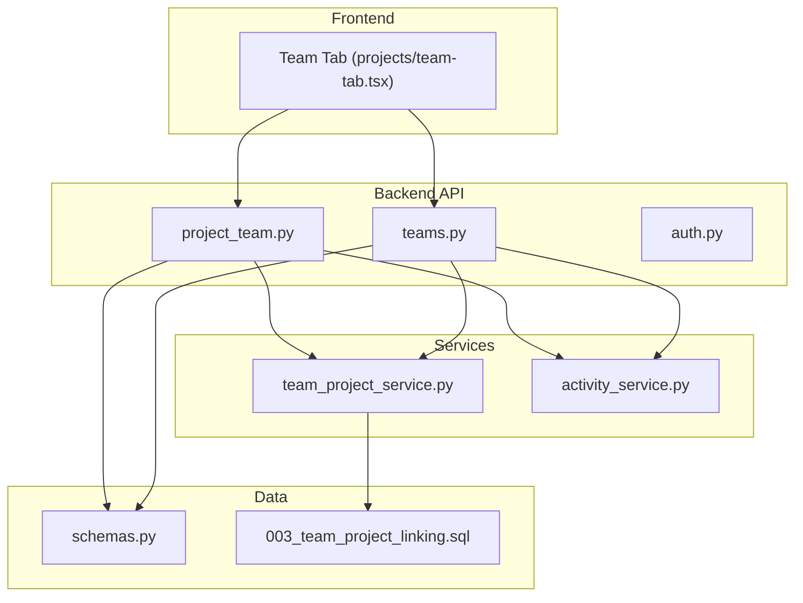
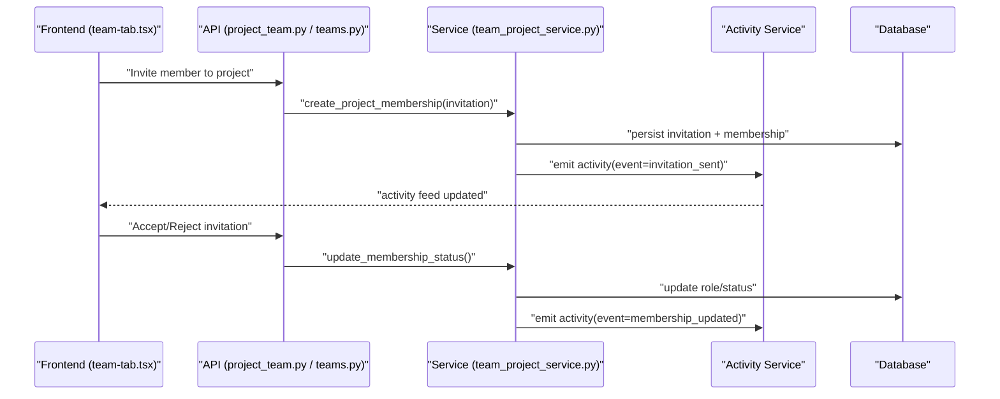
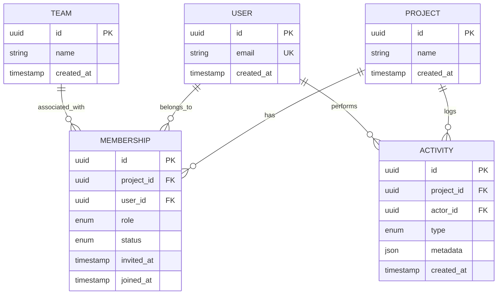
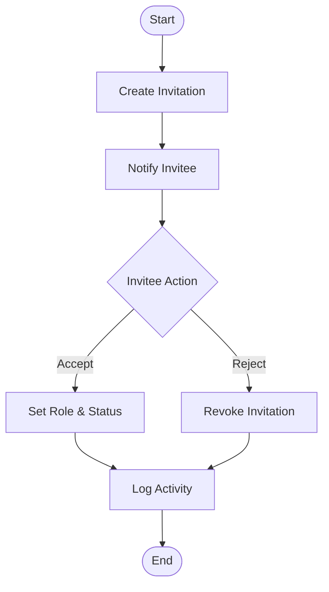
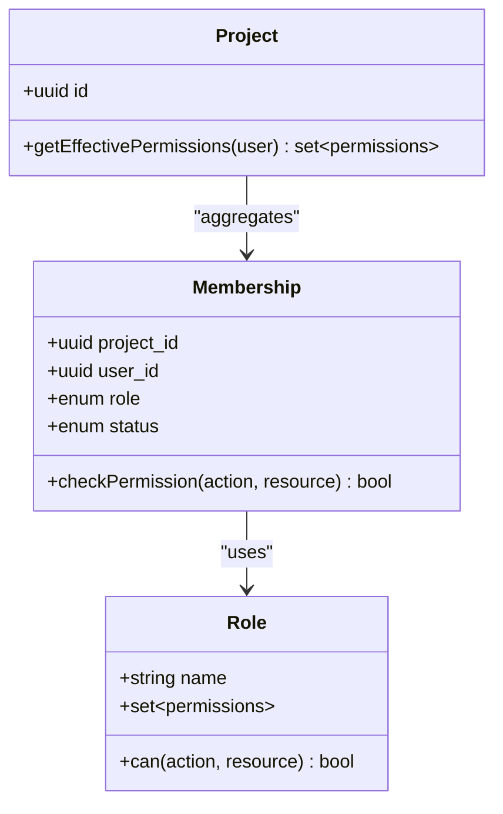
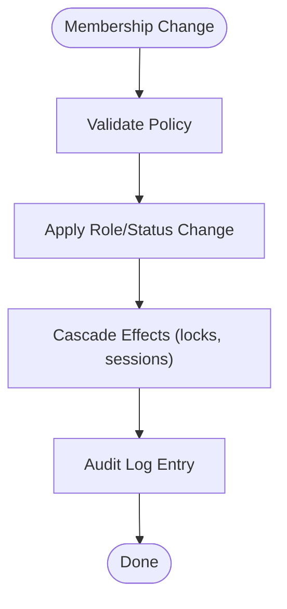
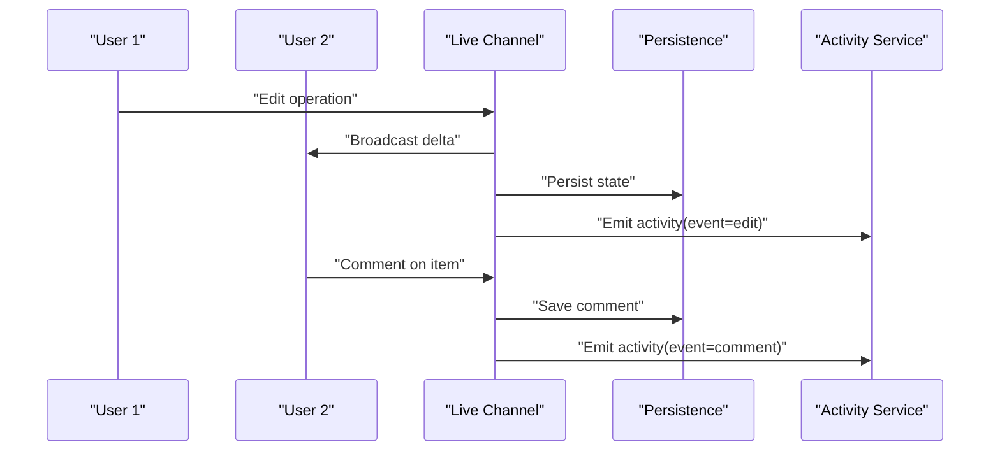
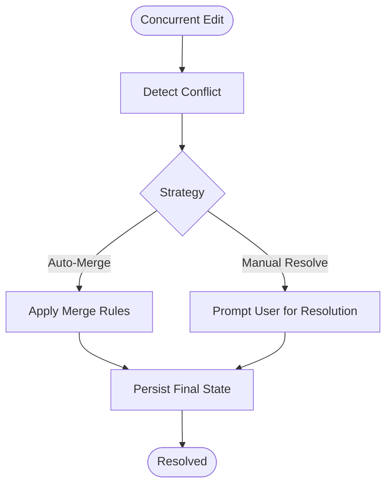
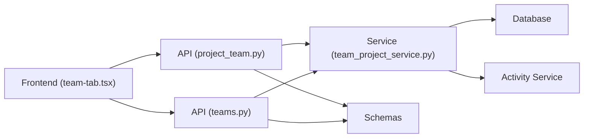

# Team Collaboration & Permissions

<cite>
**Referenced Files in This Document**
- [project_team.py](file://backend/api/project_team.py)
- [teams.py](file://backend/api/teams.py)
- [team_project_service.py](file://backend/services/team_project_service.py)
- [schemas.py](file://backend/models/schemas.py)
- [team-tab.tsx](file://src/components/projects/team-tab.tsx)
- [003_team_project_linking.sql](file://backend/migrations/003_team_project_linking.sql)
- [test_project_team_linking.py](file://backend/tests/test_project_team_linking.py)
- [auth.py](file://backend/api/auth.py)
- [activity_service.py](file://backend/services/activity_service.py)
</cite>

## Table of Contents
1. [Introduction](#introduction)
2. [Project Structure](#project-structure)
3. [Core Components](#core-components)
4. [Architecture Overview](#architecture-overview)
5. [Detailed Component Analysis](#detailed-component-analysis)
6. [Dependency Analysis](#dependency-analysis)
7. [Performance Considerations](#performance-considerations)
8. [Troubleshooting Guide](#troubleshooting-guide)
9. [Conclusion](#conclusion)

## Introduction
This document explains how team collaboration works in the project management system, including member assignment, role-based permissions, access control, invitations, membership management, shared editing, comments, and activity tracking. It also covers security considerations, permission inheritance, and conflict resolution strategies.

## Project Structure
The collaboration features span backend APIs, services, data models, database schema, and frontend components:
- Backend APIs expose endpoints for team and project-team operations.
- Services encapsulate business logic for team-project linking and activities.
- Data models define request/response schemas.
- Database migrations implement team-project relationships.
- Frontend components provide UI for managing teams within projects.

**Diagram sources**
- [project_team.py](file://backend/api/project_team.py)
- [teams.py](file://backend/api/teams.py)
- [team_project_service.py](file://backend/services/team_project_service.py)
- [activity_service.py](file://backend/services/activity_service.py)
- [schemas.py](file://backend/models/schemas.py)
- [003_team_project_linking.sql](file://backend/migrations/003_team_project_linking.sql)
- [team-tab.tsx](file://src/components/projects/team-tab.tsx)

**Section sources**
- [project_team.py](file://backend/api/project_team.py)
- [teams.py](file://backend/api/teams.py)
- [team_project_service.py](file://backend/services/team_project_service.py)
- [schemas.py](file://backend/models/schemas.py)
- [team-tab.tsx](file://src/components/projects/team-tab.tsx)
- [003_team_project_linking.sql](file://backend/migrations/003_team_project_linking.sql)

## Core Components
- Team and Project APIs: Endpoints to manage teams and link them to projects.
- Team-Project Service: Business logic for adding/removing members, setting roles, and enforcing permissions.
- Activity Service: Tracks collaborative actions such as edits, comments, and membership changes.
- Data Models: Request/response validation for team operations.
- Database Schema: Tables and constraints that enforce team-project relationships and roles.
- Frontend Team Tab: UI for inviting members, assigning roles, and viewing activity.

Key responsibilities:
- Role-based access control (RBAC) for project resources.
- Invitation lifecycle management.
- Membership updates with audit trails.
- Shared editing coordination via real-time channels (if enabled).
- Commenting and activity feed integration.

**Section sources**
- [project_team.py](file://backend/api/project_team.py)
- [teams.py](file://backend/api/teams.py)
- [team_project_service.py](file://backend/services/team_project_service.py)
- [activity_service.py](file://backend/services/activity_service.py)
- [schemas.py](file://backend/models/schemas.py)
- [003_team_project_linking.sql](file://backend/migrations/003_team_project_linking.sql)
- [team-tab.tsx](file://src/components/projects/team-tab.tsx)

## Architecture Overview
The collaboration architecture follows a layered approach:
- Frontend components call backend APIs for team operations.
- API handlers validate inputs using schemas and delegate to services.
- Services enforce RBAC, manage invitations, update memberships, and emit activity events.
- Persistence layer stores relationships and audit logs.

**Diagram sources**
- [project_team.py](file://backend/api/project_team.py)
- [teams.py](file://backend/api/teams.py)
- [team_project_service.py](file://backend/services/team_project_service.py)
- [activity_service.py](file://backend/services/activity_service.py)
- [003_team_project_linking.sql](file://backend/migrations/003_team_project_linking.sql)

## Detailed Component Analysis

### Project-Team Relationship Model
- Entities: Project, Team, Member, Role, Invitation, Activity.
- Relationships:
  - A Project has many Members through Team associations.
  - A Team has many Members with distinct Roles.
  - Invitations bridge Users and Projects until accepted.
  - Activities log all membership and collaboration events.

**Diagram sources**
- [003_team_project_linking.sql](file://backend/migrations/003_team_project_linking.sql)
- [schemas.py](file://backend/models/schemas.py)

**Section sources**
- [003_team_project_linking.sql](file://backend/migrations/003_team_project_linking.sql)
- [schemas.py](file://backend/models/schemas.py)

### Invitation Workflow
- Owner or admin invites a user by email or ID.
- System creates an invitation record and notifies the invitee.
- Invitee accepts or rejects; acceptance sets role and status.
- All steps are logged as activities.

**Diagram sources**
- [project_team.py](file://backend/api/project_team.py)
- [team_project_service.py](file://backend/services/team_project_service.py)
- [activity_service.py](file://backend/services/activity_service.py)

**Section sources**
- [project_team.py](file://backend/api/project_team.py)
- [team_project_service.py](file://backend/services/team_project_service.py)
- [activity_service.py](file://backend/services/activity_service.py)

### Role-Based Permissions and Access Control
- Roles define granular permissions per project resource (e.g., view, edit, manage).
- Permission checks occur at API boundaries before service execution.
- Inheritance:
  - Project-level roles apply to all members unless overridden by team-specific roles.
  - Team-level roles can extend or restrict project-level defaults.
- Deny-by-default principle ensures least privilege.

**Diagram sources**
- [team_project_service.py](file://backend/services/team_project_service.py)
- [schemas.py](file://backend/models/schemas.py)

**Section sources**
- [team_project_service.py](file://backend/services/team_project_service.py)
- [schemas.py](file://backend/models/schemas.py)

### Membership Management
- Add members via invitation or direct assignment (subject to policy).
- Update roles and statuses (pending, active, revoked).
- Remove members with cascading effects on shared resources.
- Enforce minimum required roles (e.g., owner/admin presence).

**Diagram sources**
- [team_project_service.py](file://backend/services/team_project_service.py)
- [activity_service.py](file://backend/services/activity_service.py)

**Section sources**
- [team_project_service.py](file://backend/services/team_project_service.py)
- [activity_service.py](file://backend/services/activity_service.py)

### Collaborative Features
- Shared Editing:
  - Real-time synchronization via live channels when enabled.
  - Conflict resolution strategies include operational transforms or CRDTs.
- Comment System:
  - Threaded comments attached to entities with mentions and reactions.
  - Visibility constrained by project permissions.
- Activity Tracking:
  - Centralized feed of actions (edits, comments, membership changes).
  - Filters by entity, user, and time range.

**Diagram sources**
- [activity_service.py](file://backend/services/activity_service.py)
- [team-tab.tsx](file://src/components/projects/team-tab.tsx)

**Section sources**
- [activity_service.py](file://backend/services/activity_service.py)
- [team-tab.tsx](file://src/components/projects/team-tab.tsx)

### Security Considerations
- Authentication:
  - Require valid session/token for all team operations.
- Authorization:
  - Enforce RBAC at API entry points.
  - Validate ownership and role inheritance before mutations.
- Input Validation:
  - Use schemas to sanitize and validate payloads.
- Auditability:
  - Log all sensitive actions with actor context and timestamps.
- Secrets and Tokens:
  - Avoid logging secrets; use secure storage and rotation policies.

**Section sources**
- [auth.py](file://backend/api/auth.py)
- [project_team.py](file://backend/api/project_team.py)
- [team_project_service.py](file://backend/services/team_project_service.py)
- [activity_service.py](file://backend/services/activity_service.py)

### Conflict Resolution in Collaborative Environments
- Concurrency:
  - Optimistic locking for concurrent edits.
  - Merge strategies for overlapping changes.
- Conflicts:
  - Detect and notify users of conflicts.
  - Provide merge UI with diff and accept/reject options.
- Consistency:
  - Ensure eventual consistency across replicas.
  - Maintain transactional integrity for membership changes.

[No sources needed since this diagram shows conceptual workflow, not actual code structure]

## Dependency Analysis
- API Layer depends on Services for business logic and on Schemas for validation.
- Services depend on Database for persistence and Activity Service for auditing.
- Frontend depends on APIs for all team operations and consumes activity feeds.

**Diagram sources**
- [project_team.py](file://backend/api/project_team.py)
- [teams.py](file://backend/api/teams.py)
- [team_project_service.py](file://backend/services/team_project_service.py)
- [activity_service.py](file://backend/services/activity_service.py)
- [schemas.py](file://backend/models/schemas.py)
- [team-tab.tsx](file://src/components/projects/team-tab.tsx)

**Section sources**
- [project_team.py](file://backend/api/project_team.py)
- [teams.py](file://backend/api/teams.py)
- [team_project_service.py](file://backend/services/team_project_service.py)
- [activity_service.py](file://backend/services/activity_service.py)
- [schemas.py](file://backend/models/schemas.py)
- [team-tab.tsx](file://src/components/projects/team-tab.tsx)

## Performance Considerations
- Indexing:
  - Index foreign keys in membership and activity tables for fast queries.
- Pagination:
  - Paginate activity feeds and membership lists.
- Caching:
  - Cache effective permissions for authenticated users.
- Batching:
  - Batch activity emissions to reduce write load.
- Concurrency:
  - Use connection pooling and short-lived transactions.

[No sources needed since this section provides general guidance]

## Troubleshooting Guide
Common issues and resolutions:
- Permission denied errors:
  - Verify user role and inheritance rules.
  - Check API authorization middleware.
- Invitation not received:
  - Confirm notification pipeline and email delivery.
  - Review invitation status and expiration.
- Activity feed gaps:
  - Inspect activity emission points and error handling.
  - Validate database writes and retries.
- Conflicting edits:
  - Enable conflict detection and review merge logs.
  - Ensure clients handle optimistic concurrency.

**Section sources**
- [activity_service.py](file://backend/services/activity_service.py)
- [team_project_service.py](file://backend/services/team_project_service.py)
- [project_team.py](file://backend/api/project_team.py)

## Conclusion
The collaboration system provides robust team management, role-based access control, invitation workflows, and activity tracking. By adhering to least privilege, enforcing permission inheritance, and implementing strong auditability, it supports secure and efficient teamwork. The modular design enables scalable enhancements like advanced conflict resolution and richer collaboration features.