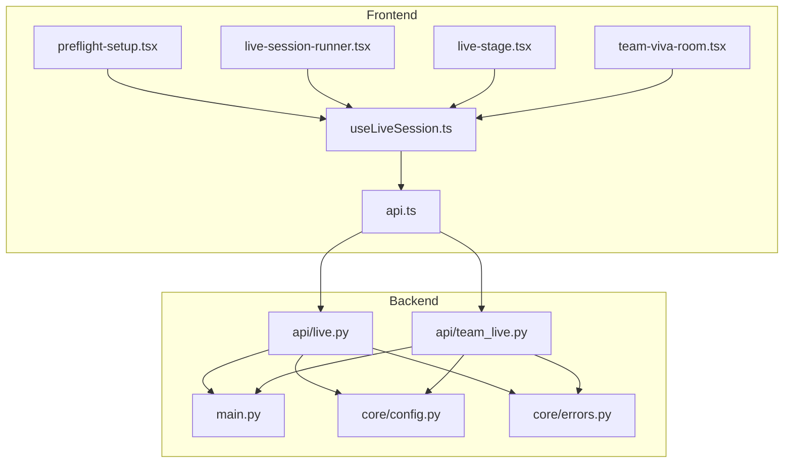
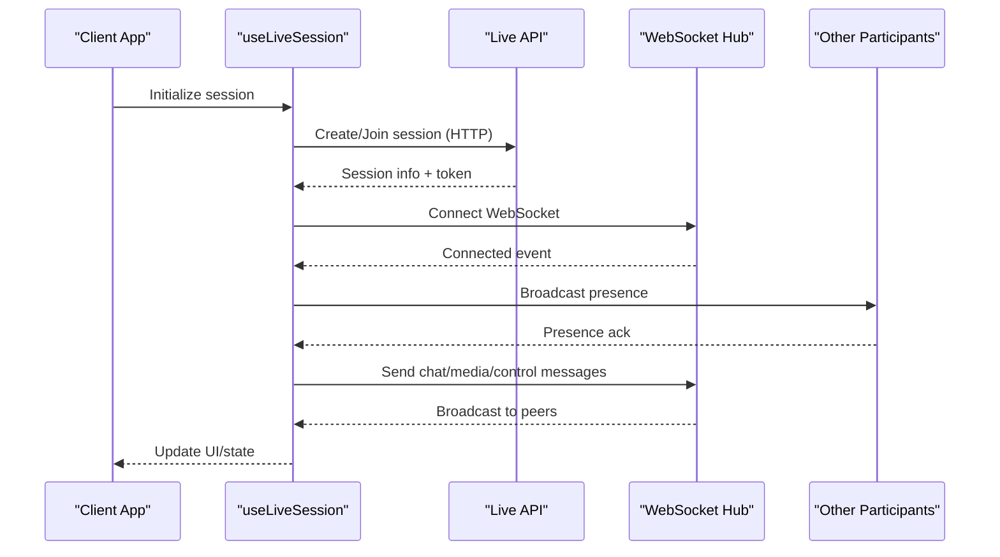
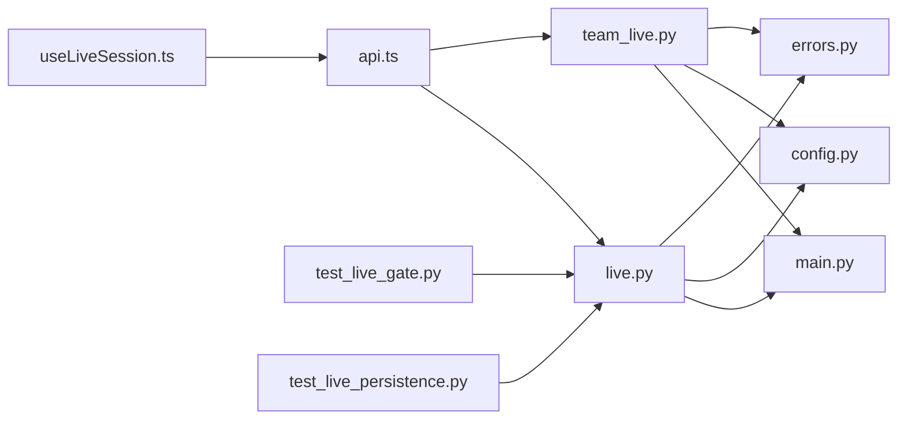

# Live Session System

<cite>
**Referenced Files in This Document**
- [live.py](file://backend/api/live.py)
- [team_live.py](file://backend/api/team_live.py)
- [useLiveSession.ts](file://src/lib/useLiveSession.ts)
- [preflight-setup.tsx](file://src/components/live/preflight-setup.tsx)
- [live-session-runner.tsx](file://src/components/live/live-session-runner.tsx)
- [live-stage.tsx](file://src/components/live/live-stage.tsx)
- [team-viva-room.tsx](file://src/components/live/team-viva-room.tsx)
- [api.ts](file://src/lib/api.ts)
- [main.py](file://backend/main.py)
- [config.py](file://backend/core/config.py)
- [errors.py](file://backend/core/errors.py)
- [test_live_gate.py](file://backend/tests/test_live_gate.py)
- [test_live_persistence.py](file://backend/tests/test_live_persistence.py)
</cite>

## Table of Contents
1. [Introduction](#introduction)
2. [Project Structure](#project-structure)
3. [Core Components](#core-components)
4. [Architecture Overview](#architecture-overview)
5. [Detailed Component Analysis](#detailed-component-analysis)
6. [Dependency Analysis](#dependency-analysis)
7. [Performance Considerations](#performance-considerations)
8. [Troubleshooting Guide](#troubleshooting-guide)
9. [Conclusion](#conclusion)
10. [Appendices](#appendices)

## Introduction
This document explains the live session system that powers real-time collaborative learning experiences. It covers session lifecycle management, participant coordination, and resource synchronization across clients. It also details WebSocket connection handling, message broadcasting, state synchronization, preflight setup procedures, audio/video configuration, and network connectivity checks. Practical examples are provided for creating sessions, managing participants, handling session events, and implementing collaborative features. The document concludes with guidance on session persistence, error recovery, and scalability considerations.

## Project Structure
The live session system spans backend APIs and frontend components:
- Backend APIs expose endpoints to create, join, and manage live sessions, as well as team-based live rooms.
- Frontend hooks and components implement preflight checks, media capture, WebSocket communication, and UI orchestration for live sessions.

**Diagram sources**
- [main.py](file://backend/main.py)
- [live.py](file://backend/api/live.py)
- [team_live.py](file://backend/api/team_live.py)
- [config.py](file://backend/core/config.py)
- [errors.py](file://backend/core/errors.py)
- [useLiveSession.ts](file://src/lib/useLiveSession.ts)
- [preflight-setup.tsx](file://src/components/live/preflight-setup.tsx)
- [live-session-runner.tsx](file://src/components/live/live-session-runner.tsx)
- [live-stage.tsx](file://src/components/live/live-stage.tsx)
- [team-viva-room.tsx](file://src/components/live/team-viva-room.tsx)
- [api.ts](file://src/lib/api.ts)

**Section sources**
- [main.py](file://backend/main.py)
- [live.py](file://backend/api/live.py)
- [team_live.py](file://backend/api/team_live.py)
- [useLiveSession.ts](file://src/lib/useLiveSession.ts)
- [preflight-setup.tsx](file://src/components/live/preflight-setup.tsx)
- [live-session-runner.tsx](file://src/components/live/live-session-runner.tsx)
- [live-stage.tsx](file://src/components/live/live-stage.tsx)
- [team-viva-room.tsx](file://src/components/live/team-viva-room.tsx)
- [api.ts](file://src/lib/api.ts)

## Core Components
- Live API endpoints: Create, join, and manage sessions; broadcast messages; coordinate participants.
- Team Live API endpoints: Manage team-based live rooms and shared resources.
- Frontend hook (useLiveSession): Encapsulates WebSocket lifecycle, event handling, and state synchronization.
- Preflight Setup: Validates device permissions, media capabilities, and network connectivity before joining a session.
- Live Session Runner and Stage: Orchestrate session flow, media streams, and collaborative UI states.
- Team Viva Room: Coordinates multi-participant collaboration within a team context.

**Section sources**
- [live.py](file://backend/api/live.py)
- [team_live.py](file://backend/api/team_live.py)
- [useLiveSession.ts](file://src/lib/useLiveSession.ts)
- [preflight-setup.tsx](file://src/components/live/preflight-setup.tsx)
- [live-session-runner.tsx](file://src/components/live/live-session-runner.tsx)
- [live-stage.tsx](file://src/components/live/live-stage.tsx)
- [team-viva-room.tsx](file://src/components/live/team-viva-room.tsx)

## Architecture Overview
The system follows a client-server architecture with WebSocket-based real-time communication:
- Clients connect via WebSocket to the server’s live endpoints.
- The server maintains session state, participant lists, and broadcasts messages to relevant clients.
- Frontend components handle preflight checks, media capture, and UI updates based on server events.

**Diagram sources**
- [useLiveSession.ts](file://src/lib/useLiveSession.ts)
- [live.py](file://backend/api/live.py)
- [team_live.py](file://backend/api/team_live.py)

## Detailed Component Analysis

### Live API Endpoints
Responsibilities:
- Create sessions and assign roles.
- Join sessions with authentication and validation.
- Broadcast messages to participants.
- Manage participant lifecycle (join/leave).
- Coordinate resource synchronization (e.g., shared state, media metadata).

Key behaviors:
- Input validation and error responses.
- Rate limiting and concurrency controls.
- Event-driven broadcasting to connected clients.

**Section sources**
- [live.py](file://backend/api/live.py)
- [errors.py](file://backend/core/errors.py)

### Team Live API Endpoints
Responsibilities:
- Manage team-based live rooms.
- Synchronize shared resources among team members.
- Handle role-based access control within teams.

Key behaviors:
- Team membership validation.
- Shared state synchronization.
- Collaborative actions (e.g., co-editing, voting).

**Section sources**
- [team_live.py](file://backend/api/team_live.py)
- [errors.py](file://backend/core/errors.py)

### Frontend Hook: useLiveSession
Responsibilities:
- Establish and maintain WebSocket connections.
- Handle reconnection logic and backoff strategies.
- Subscribe to session events and update local state.
- Emit user actions (chat, media control, collaborative commands).

Key behaviors:
- Connection lifecycle management (connect, reconnect, disconnect).
- Message serialization and deserialization.
- Error handling and fallback mechanisms.

**Section sources**
- [useLiveSession.ts](file://src/lib/useLiveSession.ts)
- [api.ts](file://src/lib/api.ts)

### Preflight Setup
Responsibilities:
- Check device permissions (camera, microphone).
- Validate media capabilities and constraints.
- Perform network connectivity checks (latency, bandwidth estimation).
- Present user feedback and guide through required configurations.

Key behaviors:
- Permission prompts and error handling.
- Media stream initialization and validation.
- Network probing and adaptive quality settings.

**Section sources**
- [preflight-setup.tsx](file://src/components/live/preflight-setup.tsx)

### Live Session Runner and Stage
Responsibilities:
- Orchestrate session flow from start to end.
- Manage media streams and participant views.
- Render collaborative UI elements (chat, whiteboard, polls).

Key behaviors:
- State transitions between stages (setup, active, ended).
- Resource cleanup and graceful shutdown.
- Real-time UI updates based on server events.

**Section sources**
- [live-session-runner.tsx](file://src/components/live/live-session-runner.tsx)
- [live-stage.tsx](file://src/components/live/live-stage.tsx)

### Team Viva Room
Responsibilities:
- Coordinate multi-participant collaboration within a team.
- Synchronize shared resources and actions.
- Manage team-specific features (roles, permissions).

Key behaviors:
- Role-based access control.
- Shared state synchronization.
- Collaborative workflows and feedback loops.

**Section sources**
- [team-viva-room.tsx](file://src/components/live/team-viva-room.tsx)

## Dependency Analysis
The live session system has clear separation between frontend and backend concerns:
- Frontend depends on the useLiveSession hook for WebSocket and state management.
- Backend APIs depend on core configuration and error handling modules.
- Tests validate gatekeeping and persistence behaviors.

**Diagram sources**
- [useLiveSession.ts](file://src/lib/useLiveSession.ts)
- [api.ts](file://src/lib/api.ts)
- [live.py](file://backend/api/live.py)
- [team_live.py](file://backend/api/team_live.py)
- [main.py](file://backend/main.py)
- [config.py](file://backend/core/config.py)
- [errors.py](file://backend/core/errors.py)
- [test_live_gate.py](file://backend/tests/test_live_gate.py)
- [test_live_persistence.py](file://backend/tests/test_live_persistence.py)

**Section sources**
- [useLiveSession.ts](file://src/lib/useLiveSession.ts)
- [api.ts](file://src/lib/api.ts)
- [live.py](file://backend/api/live.py)
- [team_live.py](file://backend/api/team_live.py)
- [main.py](file://backend/main.py)
- [config.py](file://backend/core/config.py)
- [errors.py](file://backend/core/errors.py)
- [test_live_gate.py](file://backend/tests/test_live_gate.py)
- [test_live_persistence.py](file://backend/tests/test_live_persistence.py)

## Performance Considerations
- WebSocket scaling: Use horizontal scaling with sticky sessions or a message broker for multi-instance deployments.
- Message batching: Aggregate frequent updates to reduce network overhead.
- Adaptive media quality: Adjust bitrate and resolution based on network conditions.
- State synchronization: Implement conflict resolution strategies for concurrent edits.
- Connection resilience: Exponential backoff and jitter for reconnection attempts.

[No sources needed since this section provides general guidance]

## Troubleshooting Guide
Common issues and resolutions:
- WebSocket connection failures: Verify endpoint URLs, authentication tokens, and firewall rules.
- Media permission errors: Ensure browser prompts are allowed and devices are accessible.
- Message delivery delays: Check server load and network latency; implement acknowledgment and retry mechanisms.
- State inconsistencies: Validate event ordering and implement idempotent operations.

**Section sources**
- [errors.py](file://backend/core/errors.py)
- [test_live_gate.py](file://backend/tests/test_live_gate.py)
- [test_live_persistence.py](file://backend/tests/test_live_persistence.py)

## Conclusion
The live session system provides a robust foundation for real-time collaborative learning. By combining secure API endpoints, resilient WebSocket communication, and comprehensive frontend orchestration, it enables seamless participant coordination and resource synchronization. Proper attention to performance, error handling, and scalability ensures reliable operation under varying loads and network conditions.

[No sources needed since this section summarizes without analyzing specific files]

## Appendices

### Example Workflows

#### Creating a Session
1. Call the create session endpoint with user context and session parameters.
2. Receive session ID and connection details.
3. Initialize WebSocket connection using the provided token.
4. Join the session and receive participant list.

**Section sources**
- [live.py](file://backend/api/live.py)
- [useLiveSession.ts](file://src/lib/useLiveSession.ts)

#### Managing Participants
1. Authenticate users and validate session membership.
2. Broadcast participant join/leave events.
3. Maintain participant state and permissions.
4. Handle disconnections and cleanup resources.

**Section sources**
- [live.py](file://backend/api/live.py)
- [team_live.py](file://backend/api/team_live.py)

#### Handling Session Events
1. Subscribe to session events (join, leave, chat, media control).
2. Update local state and UI accordingly.
3. Implement error handling for failed operations.
4. Provide user feedback for critical events.

**Section sources**
- [useLiveSession.ts](file://src/lib/useLiveSession.ts)
- [live-stage.tsx](file://src/components/live/live-stage.tsx)

#### Implementing Collaborative Features
1. Define shared state schema and update protocols.
2. Implement conflict resolution for concurrent edits.
3. Broadcast changes to all participants.
4. Maintain version consistency and rollback capabilities.

**Section sources**
- [team-live.py](file://backend/api/team_live.py)
- [team-viva-room.tsx](file://src/components/live/team-viva-room.tsx)

### Session Persistence and Recovery
- Persist session metadata and participant logs.
- Implement checkpointing for long-running sessions.
- Provide recovery mechanisms for interrupted connections.
- Archive session data for analytics and reporting.

**Section sources**
- [test_live_persistence.py](file://backend/tests/test_live_persistence.py)

### Scalability Considerations
- Horizontal scaling with load balancers and sticky sessions.
- Message queue integration for distributed broadcasting.
- Database sharding for large participant counts.
- CDN integration for static assets and media distribution.

[No sources needed since this section provides general guidance]