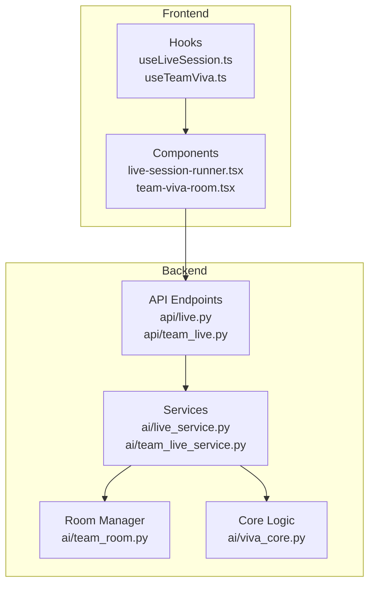
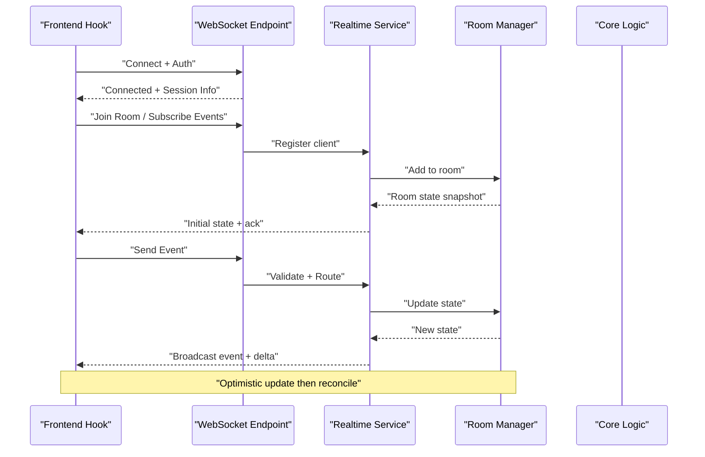
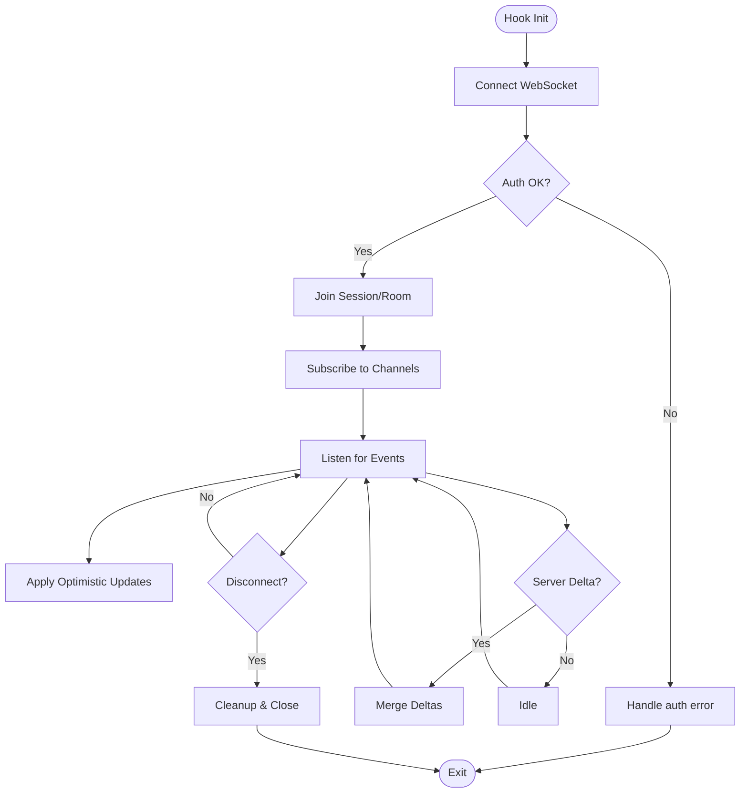
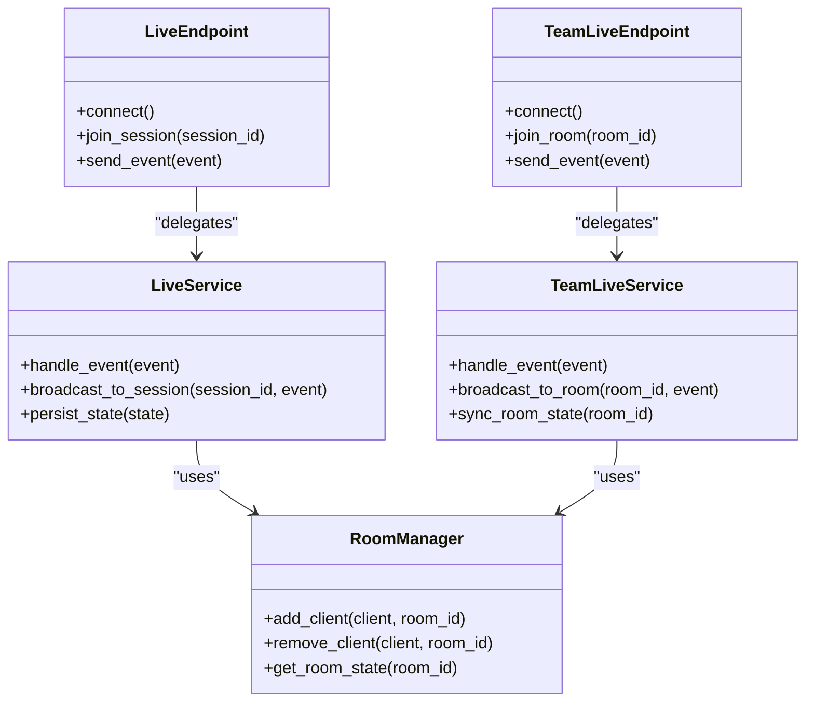
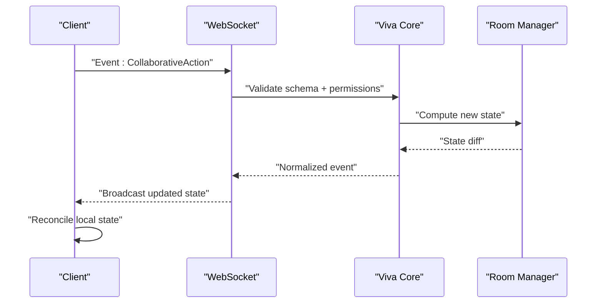
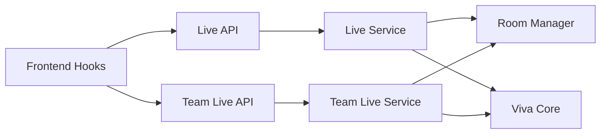

# Real-Time Communication Layer

<cite>
**Referenced Files in This Document**
- [useLiveSession.ts](file://src/lib/useLiveSession.ts)
- [useTeamViva.ts](file://src/lib/useTeamViva.ts)
- [live.py](file://backend/api/live.py)
- [team_live.py](file://backend/api/team_live.py)
- [live_service.py](file://backend/ai/live_service.py)
- [team_live_service.py](file://backend/ai/team_live_service.py)
- [team_room.py](file://backend/ai/team_room.py)
- [viva_core.py](file://backend/ai/viva_core.py)
- [main.py](file://backend/main.py)
- [live-session-runner.tsx](file://src/components/live/live-session-runner.tsx)
- [team-viva-room.tsx](file://src/components/live/team-viva-room.tsx)
</cite>

## Table of Contents
1. [Introduction](#introduction)
2. [Project Structure](#project-structure)
3. [Core Components](#core-components)
4. [Architecture Overview](#architecture-overview)
5. [Detailed Component Analysis](#detailed-component-analysis)
6. [Dependency Analysis](#dependency-analysis)
7. [Performance Considerations](#performance-considerations)
8. [Troubleshooting Guide](#troubleshooting-guide)
9. [Conclusion](#conclusion)

## Introduction
This document explains the real-time communication layer that powers team collaboration features. It covers WebSocket implementation, connection management, message routing, event-driven architecture, message formats, and state synchronization protocols. It also documents the frontend hooks useLiveSession and useTeamViva for real-time functionality, including connection establishment, event handling, disconnection management, and collaborative feature patterns. Performance optimization, error handling, and scalability considerations are addressed to help you build robust, responsive collaborative experiences.

## Project Structure
The real-time system spans both backend and frontend:
- Backend (Python/FastAPI): WebSocket endpoints, room/state management, and integration with AI services.
- Frontend (TypeScript/React): Hooks and components that manage connections, events, and UI state.

**Diagram sources**
- [useLiveSession.ts](file://src/lib/useLiveSession.ts)
- [useTeamViva.ts](file://src/lib/useTeamViva.ts)
- [live.py](file://backend/api/live.py)
- [team_live.py](file://backend/api/team_live.py)
- [live_service.py](file://backend/ai/live_service.py)
- [team_live_service.py](file://backend/ai/team_live_service.py)
- [team_room.py](file://backend/ai/team_room.py)
- [viva_core.py](file://backend/ai/viva_core.py)

**Section sources**
- [main.py](file://backend/main.py)
- [live.py](file://backend/api/live.py)
- [team_live.py](file://backend/api/team_live.py)
- [useLiveSession.ts](file://src/lib/useLiveSession.ts)
- [useTeamViva.ts](file://src/lib/useTeamViva.ts)
- [live-session-runner.tsx](file://src/components/live/live-session-runner.tsx)
- [team-viva-room.tsx](file://src/components/live/team-viva-room.tsx)

## Core Components
- useLiveSession (frontend hook): Manages a single live session’s WebSocket lifecycle, event subscriptions, local state sync, reconnection, and error handling.
- useTeamViva (frontend hook): Extends real-time capabilities for team rooms, managing multi-user presence, shared state, and collaborative actions.
- Backend API endpoints: Expose HTTP and WebSocket routes for session creation, joining rooms, and broadcasting messages.
- Services and Room Manager: Implement event routing, state synchronization, and persistence across clients.

Key responsibilities:
- Connection lifecycle: connect, authenticate, subscribe, unsubscribe, reconnect, disconnect.
- Message routing: route by session ID or room ID; fan-out to participants; filter by event type.
- State synchronization: optimistic updates, conflict resolution, and eventual consistency.
- Error handling: network errors, server errors, and graceful degradation.

**Section sources**
- [useLiveSession.ts](file://src/lib/useLiveSession.ts)
- [useTeamViva.ts](file://src/lib/useTeamViva.ts)
- [live.py](file://backend/api/live.py)
- [team_live.py](file://backend/api/team_live.py)
- [live_service.py](file://backend/ai/live_service.py)
- [team_live_service.py](file://backend/ai/team_live_service.py)
- [team_room.py](file://backend/ai/team_room.py)

## Architecture Overview
The real-time layer follows an event-driven architecture:
- Clients connect via WebSocket using the hooks.
- The server authenticates and assigns clients to sessions/rooms.
- Messages are routed to relevant participants based on room/session context.
- State is synchronized through structured events and acknowledgments.

**Diagram sources**
- [useLiveSession.ts](file://src/lib/useLiveSession.ts)
- [useTeamViva.ts](file://src/lib/useTeamViva.ts)
- [live.py](file://backend/api/live.py)
- [team_live.py](file://backend/api/team_live.py)
- [live_service.py](file://backend/ai/live_service.py)
- [team_live_service.py](file://backend/ai/team_live_service.py)
- [team_room.py](file://backend/ai/team_room.py)

## Detailed Component Analysis

### Frontend Hooks: useLiveSession and useTeamViva
- Connection Management
  - Establishes WebSocket connections with authentication tokens.
  - Handles reconnection with exponential backoff and jitter.
  - Subscribes/unsubscribes to event channels per session or room.
- Event Handling
  - Centralized event listeners for presence, state changes, and collaborative actions.
  - Normalizes incoming payloads into typed events for consistent processing.
- State Synchronization
  - Maintains local optimistic state and reconciles with server snapshots.
  - Applies deltas to minimize UI churn and reduce memory pressure.
- Disconnection and Recovery
  - Detects network drops and triggers reconnect logic.
  - Re-subscribes to channels and resynchronizes state upon reconnection.

**Diagram sources**
- [useLiveSession.ts](file://src/lib/useLiveSession.ts)
- [useTeamViva.ts](file://src/lib/useTeamViva.ts)

**Section sources**
- [useLiveSession.ts](file://src/lib/useLiveSession.ts)
- [useTeamViva.ts](file://src/lib/useTeamViva.ts)
- [live-session-runner.tsx](file://src/components/live/live-session-runner.tsx)
- [team-viva-room.tsx](file://src/components/live/team-viva-room.tsx)

### Backend WebSocket Endpoints and Routing
- Endpoints
  - Live session endpoint for single-session real-time interactions.
  - Team live endpoint for multi-user room-based collaboration.
- Authentication and Authorization
  - Validates tokens and maps clients to users and roles.
- Message Routing
  - Routes messages by session ID or room ID.
  - Supports broadcast to all participants or targeted delivery.
- State Persistence
  - Persists critical state transitions and maintains snapshots for recovery.

**Diagram sources**
- [live.py](file://backend/api/live.py)
- [team_live.py](file://backend/api/team_live.py)
- [live_service.py](file://backend/ai/live_service.py)
- [team_live_service.py](file://backend/ai/team_live_service.py)
- [team_room.py](file://backend/ai/team_room.py)

**Section sources**
- [live.py](file://backend/api/live.py)
- [team_live.py](file://backend/api/team_live.py)
- [live_service.py](file://backend/ai/live_service.py)
- [team_live_service.py](file://backend/ai/team_live_service.py)
- [team_room.py](file://backend/ai/team_room.py)

### Core Logic and State Synchronization
- Viva Core
  - Defines core event schemas and state transition rules.
  - Ensures deterministic updates and conflict resolution strategies.
- State Protocols
  - Snapshot + delta model for efficient synchronization.
  - Acknowledgment and retry mechanisms for reliability.
- Collaboration Features
  - Presence tracking, cursor sharing, and collaborative edits.
  - Conflict-free operations where possible; otherwise merge strategies.

**Diagram sources**
- [viva_core.py](file://backend/ai/viva_core.py)
- [team_room.py](file://backend/ai/team_room.py)
- [live_service.py](file://backend/ai/live_service.py)
- [team_live_service.py](file://backend/ai/team_live_service.py)

**Section sources**
- [viva_core.py](file://backend/ai/viva_core.py)
- [team_room.py](file://backend/ai/team_room.py)
- [live_service.py](file://backend/ai/live_service.py)
- [team_live_service.py](file://backend/ai/team_live_service.py)

## Dependency Analysis
The real-time layer has clear separation between API endpoints, services, and room/state management. Frontend hooks depend on stable WebSocket contracts defined by the backend.

**Diagram sources**
- [useLiveSession.ts](file://src/lib/useLiveSession.ts)
- [useTeamViva.ts](file://src/lib/useTeamViva.ts)
- [live.py](file://backend/api/live.py)
- [team_live.py](file://backend/api/team_live.py)
- [live_service.py](file://backend/ai/live_service.py)
- [team_live_service.py](file://backend/ai/team_live_service.py)
- [team_room.py](file://backend/ai/team_room.py)
- [viva_core.py](file://backend/ai/viva_core.py)

**Section sources**
- [main.py](file://backend/main.py)
- [live.py](file://backend/api/live.py)
- [team_live.py](file://backend/api/team_live.py)
- [useLiveSession.ts](file://src/lib/useLiveSession.ts)
- [useTeamViva.ts](file://src/lib/useTeamViva.ts)

## Performance Considerations
- Network Efficiency
  - Use delta updates instead of full snapshots when possible.
  - Batch small events to reduce overhead.
  - Compress large payloads if necessary.
- Concurrency and Scalability
  - Scale horizontally by sharding rooms/sessions across processes.
  - Use connection pooling and async I/O for high throughput.
- Memory Management
  - Limit in-memory state size; evict stale data.
  - Avoid retaining large objects in event handlers.
- UI Responsiveness
  - Debounce frequent updates; coalesce state changes.
  - Render only affected parts of the UI.

[No sources needed since this section provides general guidance]

## Troubleshooting Guide
Common issues and resolutions:
- Connection Failures
  - Verify authentication tokens and endpoint URLs.
  - Check firewall/proxy settings for WebSocket support.
- Frequent Reconnections
  - Inspect network stability and implement exponential backoff with jitter.
  - Ensure proper cleanup on component unmount.
- Message Loss or Duplication
  - Implement idempotent event handlers and acknowledgment tracking.
  - Use sequence numbers or timestamps for ordering.
- State Drift
  - Compare local vs server state periodically; force reconciliation on drift detection.
  - Log conflicts and provide user feedback.

**Section sources**
- [useLiveSession.ts](file://src/lib/useLiveSession.ts)
- [useTeamViva.ts](file://src/lib/useTeamViva.ts)
- [live.py](file://backend/api/live.py)
- [team_live.py](file://backend/api/team_live.py)

## Conclusion
The real-time communication layer combines robust WebSocket endpoints, event-driven routing, and efficient state synchronization to deliver seamless team collaboration. The useLiveSession and useTeamViva hooks abstract complexity while providing reliable connectivity, resilient reconnection, and consistent state management. By following the outlined patterns and performance guidelines, teams can build scalable, responsive collaborative features that meet modern user expectations.

[No sources needed since this section summarizes without analyzing specific files]