# Team Collaboration Workspace

<cite>
**Referenced Files in This Document**
- [backend/main.py](file://backend/main.py)
- [backend/api/teams.py](file://backend/api/teams.py)
- [backend/api/team_live.py](file://backend/api/team_live.py)
- [backend/api/live.py](file://backend/api/live.py)
- [backend/api/project_team.py](file://backend/api/project_team.py)
- [backend/api/viva.py](file://backend/api/viva.py)
- [backend/core/config.py](file://backend/core/config.py)
- [backend/core/database.py](file://backend/core/database.py)
- [backend/services/activity_service.py](file://backend/services/activity_service.py)
- [backend/ai/team_room.py](file://backend/ai/team_room.py)
- [backend/ai/team_live_service.py](file://backend/ai/team_live_service.py)
- [src/routes/teams/index.tsx](file://src/routes/teams/index.tsx)
- [src/routes/teams/$id.tsx](file://src/routes/teams/$id.tsx)
- [src/routes/advanced/viva-team.tsx](file://src/routes/advanced/viva-team.tsx)
- [src/routes/advanced/viva-team_.join.$joinCode.tsx](file://src/routes/advanced/viva-team_.join.$joinCode.tsx)
- [src/components/live/team-viva-room.tsx](file://src/components/live/team-viva-room.tsx)
- [src/lib/useTeamViva.ts](file://src/lib/useTeamViva.ts)
- [src/lib/useLiveSession.ts](file://src/lib/useLiveSession.ts)
- [src/server.ts](file://src/server.ts)
- [src/start.ts](file://src/start.ts)
</cite>

## Table of Contents
1. [Introduction](#introduction)
2. [Project Structure](#project-structure)
3. [Core Components](#core-components)
4. [Architecture Overview](#architecture-overview)
5. [Detailed Component Analysis](#detailed-component-analysis)
6. [Dependency Analysis](#dependency-analysis)
7. [Performance Considerations](#performance-considerations)
8. [Troubleshooting Guide](#troubleshooting-guide)
9. [Conclusion](#conclusion)
10. [Appendices](#appendices)

## Introduction
This document explains the team collaboration workspace that provides real-time communication, shared resources, and collaborative learning environments. It covers live session management, participant coordination, resource sharing, team room architecture, WebSocket-based real-time features, collaborative editing interfaces, team formation, role-based permissions, activity tracking, and the advanced viva team mode for group assessments and peer learning. Practical examples are included to demonstrate creating teams, managing members, conducting live sessions, and facilitating collaborative work.

## Project Structure
The workspace is implemented as a full-stack application with:
- Backend API services for teams, live sessions, project-team linking, and viva workflows
- Real-time capabilities via WebSocket channels and event-driven processing
- Frontend routes and components for team dashboards, live rooms, and advanced viva modes
- Shared hooks for live session state and team viva orchestration
- Activity tracking and analytics services

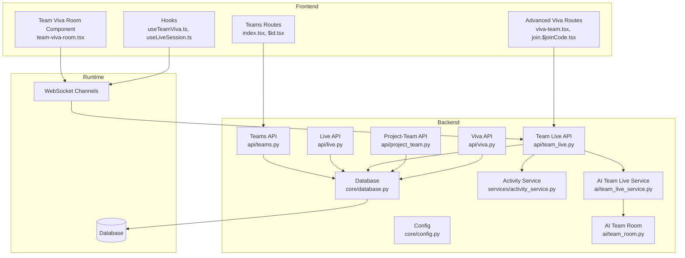

**Diagram sources**
- [backend/api/teams.py](file://backend/api/teams.py)
- [backend/api/live.py](file://backend/api/live.py)
- [backend/api/team_live.py](file://backend/api/team_live.py)
- [backend/api/project_team.py](file://backend/api/project_team.py)
- [backend/api/viva.py](file://backend/api/viva.py)
- [backend/core/config.py](file://backend/core/config.py)
- [backend/core/database.py](file://backend/core/database.py)
- [backend/services/activity_service.py](file://backend/services/activity_service.py)
- [backend/ai/team_room.py](file://backend/ai/team_room.py)
- [backend/ai/team_live_service.py](file://backend/ai/team_live_service.py)
- [src/routes/teams/index.tsx](file://src/routes/teams/index.tsx)
- [src/routes/teams/$id.tsx](file://src/routes/teams/$id.tsx)
- [src/routes/advanced/viva-team.tsx](file://src/routes/advanced/viva-team.tsx)
- [src/routes/advanced/viva-team_.join.$joinCode.tsx](file://src/routes/advanced/viva-team_.join.$joinCode.tsx)
- [src/components/live/team-viva-room.tsx](file://src/components/live/team-viva-room.tsx)
- [src/lib/useTeamViva.ts](file://src/lib/useTeamViva.ts)
- [src/lib/useLiveSession.ts](file://src/lib/useLiveSession.ts)

**Section sources**
- [backend/main.py](file://backend/main.py)
- [src/server.ts](file://src/server.ts)
- [src/start.ts](file://src/start.ts)

## Core Components
- Teams API: Create, update, list, and manage teams; assign roles and permissions; link teams to projects.
- Live API: Manage live sessions, participants, and events; coordinate real-time interactions.
- Team Live API: Orchestrates team-level live sessions, broadcasting events to participants and coordinating AI-assisted facilitation.
- Project-Team API: Links projects to teams for shared resources and collaborative workspaces.
- Viva API: Manages viva sessions, including advanced team viva workflows.
- Activity Service: Tracks user actions across teams and sessions for analytics and audit trails.
- AI Team Room and Team Live Service: Provide AI-enhanced moderation, prompts, and insights during live sessions.
- Frontend Routes and Components: Provide UI for team dashboards, joining via codes, and live team viva rooms.
- Hooks: Encapsulate real-time state and event handling for live sessions and team viva flows.

**Section sources**
- [backend/api/teams.py](file://backend/api/teams.py)
- [backend/api/live.py](file://backend/api/live.py)
- [backend/api/team_live.py](file://backend/api/team_live.py)
- [backend/api/project_team.py](file://backend/api/project_team.py)
- [backend/api/viva.py](file://backend/api/viva.py)
- [backend/services/activity_service.py](file://backend/services/activity_service.py)
- [backend/ai/team_room.py](file://backend/ai/team_room.py)
- [backend/ai/team_live_service.py](file://backend/ai/team_live_service.py)
- [src/routes/teams/index.tsx](file://src/routes/teams/index.tsx)
- [src/routes/teams/$id.tsx](file://src/routes/teams/$id.tsx)
- [src/routes/advanced/viva-team.tsx](file://src/routes/advanced/viva-team.tsx)
- [src/routes/advanced/viva-team_.join.$joinCode.tsx](file://src/routes/advanced/viva-team_.join.$joinCode.tsx)
- [src/components/live/team-viva-room.tsx](file://src/components/live/team-viva-room.tsx)
- [src/lib/useTeamViva.ts](file://src/lib/useTeamViva.ts)
- [src/lib/useLiveSession.ts](file://src/lib/useLiveSession.ts)

## Architecture Overview
The system uses a layered architecture:
- Presentation layer (frontend routes and components) interacts with backend APIs and WebSocket channels.
- API layer exposes REST endpoints for CRUD operations on teams, sessions, and resources.
- Real-time layer manages WebSocket connections, broadcasts events, and coordinates participant states.
- Services layer encapsulates business logic, including activity tracking and AI assistance.
- Data layer persists entities and relationships through a database.

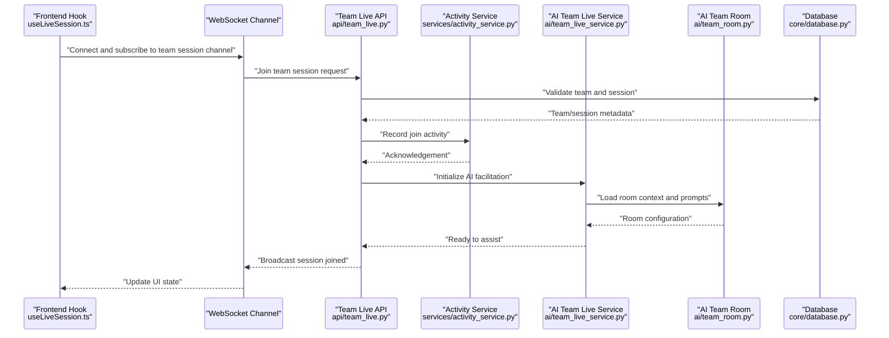

**Diagram sources**
- [src/lib/useLiveSession.ts](file://src/lib/useLiveSession.ts)
- [backend/api/team_live.py](file://backend/api/team_live.py)
- [backend/services/activity_service.py](file://backend/services/activity_service.py)
- [backend/ai/team_live_service.py](file://backend/ai/team_live_service.py)
- [backend/ai/team_room.py](file://backend/ai/team_room.py)
- [backend/core/database.py](file://backend/core/database.py)

## Detailed Component Analysis

### Teams Management
- Creation and membership: Teams can be created with a name, description, and initial members. Roles determine permissions for editing, moderating, and accessing resources.
- Role-based permissions: Admins can manage members, change roles, and control session settings. Members can collaborate within constraints defined by their role.
- Project linkage: Teams can be linked to projects to share resources, tasks, and files collaboratively.

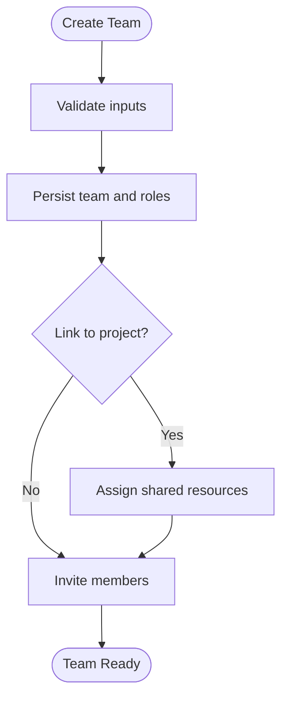

**Diagram sources**
- [backend/api/teams.py](file://backend/api/teams.py)
- [backend/api/project_team.py](file://backend/api/project_team.py)

**Section sources**
- [backend/api/teams.py](file://backend/api/teams.py)
- [backend/api/project_team.py](file://backend/api/project_team.py)

### Live Session Management
- Session lifecycle: Sessions are created, started, paused, and ended with clear state transitions.
- Participant coordination: Participants join via secure links or codes; presence and permissions are enforced.
- Event broadcasting: Real-time events (chat, reactions, stage changes) are broadcast to all connected clients.

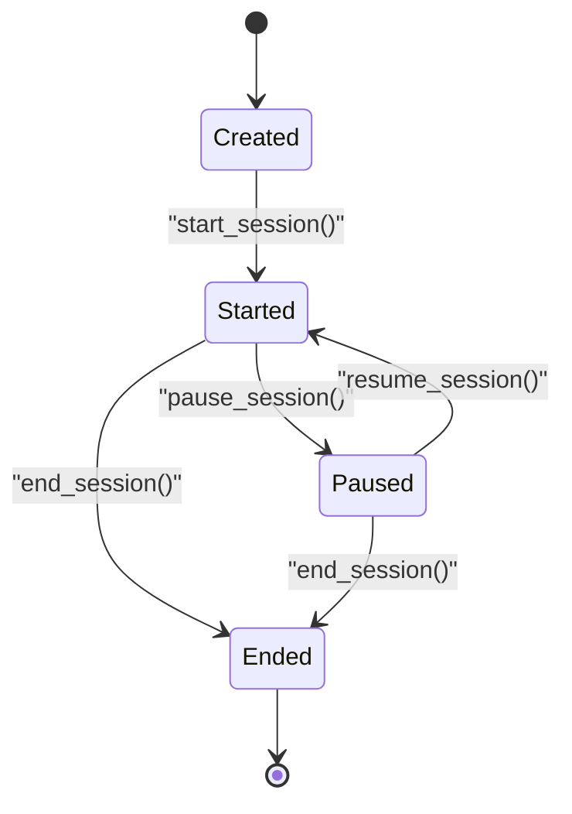

**Diagram sources**
- [backend/api/live.py](file://backend/api/live.py)

**Section sources**
- [backend/api/live.py](file://backend/api/live.py)

### Team Live Orchestration
- Orchestrator responsibilities: Coordinates multi-participant sessions, enforces rules, and integrates AI assistance.
- AI integration: Uses AI prompts and room context to guide discussions, generate feedback, and track participation metrics.
- Activity tracking: Logs participant actions for analytics and reporting.

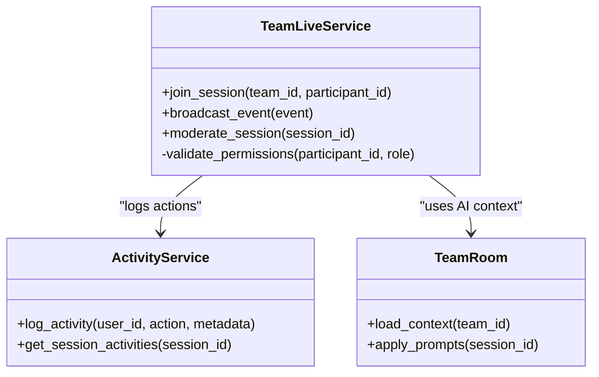

**Diagram sources**
- [backend/ai/team_live_service.py](file://backend/ai/team_live_service.py)
- [backend/services/activity_service.py](file://backend/services/activity_service.py)
- [backend/ai/team_room.py](file://backend/ai/team_room.py)

**Section sources**
- [backend/api/team_live.py](file://backend/api/team_live.py)
- [backend/ai/team_live_service.py](file://backend/ai/team_live_service.py)
- [backend/services/activity_service.py](file://backend/services/activity_service.py)
- [backend/ai/team_room.py](file://backend/ai/team_room.py)

### Advanced Viva Team Mode
- Group assessment: Facilitates structured viva sessions with multiple participants, roles, and evaluation criteria.
- Peer learning: Encourages collaborative problem-solving and knowledge sharing through guided prompts and feedback loops.
- Join flow: Participants join using a join code; the system validates access and initializes the room state.

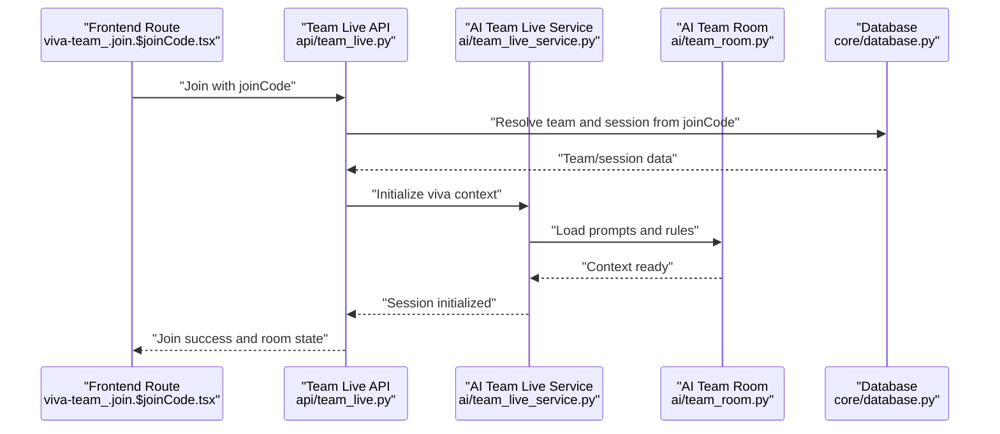

**Diagram sources**
- [src/routes/advanced/viva-team_.join.$joinCode.tsx](file://src/routes/advanced/viva-team_.join.$joinCode.tsx)
- [backend/api/team_live.py](file://backend/api/team_live.py)
- [backend/ai/team_live_service.py](file://backend/ai/team_live_service.py)
- [backend/ai/team_room.py](file://backend/ai/team_room.py)
- [backend/core/database.py](file://backend/core/database.py)

**Section sources**
- [src/routes/advanced/viva-team.tsx](file://src/routes/advanced/viva-team.tsx)
- [src/routes/advanced/viva-team_.join.$joinCode.tsx](file://src/routes/advanced/viva-team_.join.$joinCode.tsx)
- [backend/api/viva.py](file://backend/api/viva.py)

### Collaborative Editing Interfaces
- Real-time synchronization: Edits are broadcast to all participants with conflict resolution strategies.
- Presence indicators: Shows who is editing which section and cursor positions.
- Versioning and history: Maintains edit history for rollback and review.

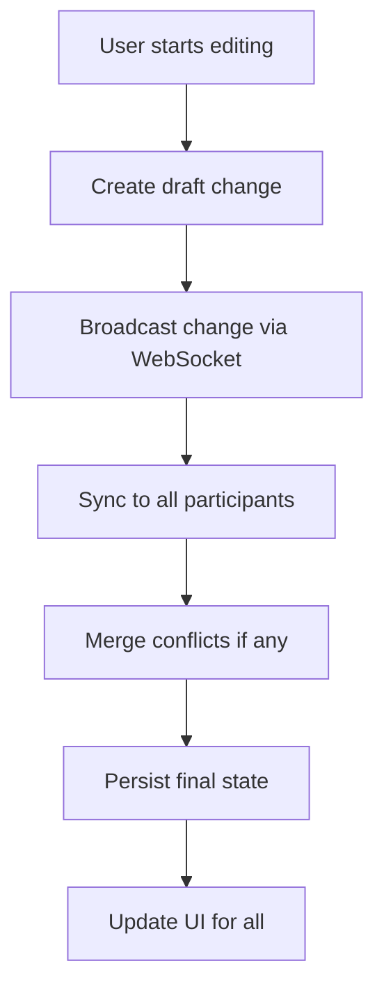

[No sources needed since this diagram shows conceptual workflow, not actual code structure]

**Section sources**
- [src/components/live/team-viva-room.tsx](file://src/components/live/team-viva-room.tsx)
- [src/lib/useLiveSession.ts](file://src/lib/useLiveSession.ts)

### Team Formation Process
- Steps:
  - Create a team with a unique identifier and metadata.
  - Invite members and assign roles (admin, moderator, member).
  - Link the team to a project for shared resources.
  - Initialize a live session when collaboration begins.

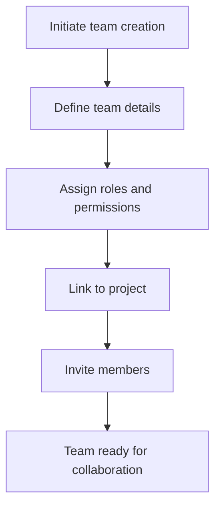

**Diagram sources**
- [backend/api/teams.py](file://backend/api/teams.py)
- [backend/api/project_team.py](file://backend/api/project_team.py)

**Section sources**
- [backend/api/teams.py](file://backend/api/teams.py)
- [backend/api/project_team.py](file://backend/api/project_team.py)

### Role-Based Permissions
- Admin: Full control over team settings, member roles, and session configurations.
- Moderator: Can manage live sessions, moderate discussions, and view analytics.
- Member: Participate in sessions, collaborate on resources, and contribute content within constraints.

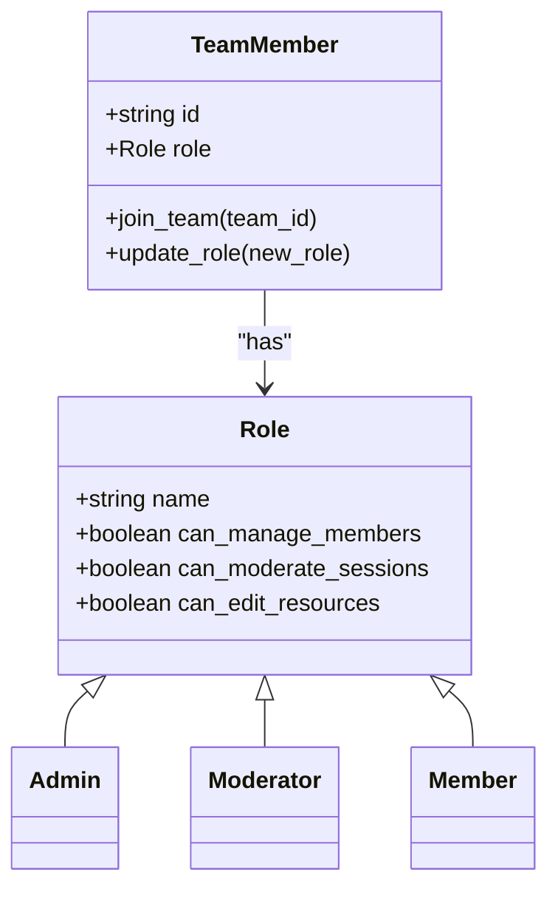

[No sources needed since this diagram shows conceptual model, not actual code structure]

**Section sources**
- [backend/api/teams.py](file://backend/api/teams.py)

### Activity Tracking
- Captures join/leave events, edits, chat messages, and session state changes.
- Aggregates metrics for participation, engagement, and performance.
- Provides audit logs for compliance and review.

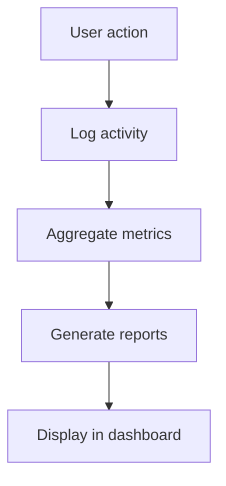

**Diagram sources**
- [backend/services/activity_service.py](file://backend/services/activity_service.py)

**Section sources**
- [backend/services/activity_service.py](file://backend/services/activity_service.py)

## Dependency Analysis
Key dependencies include:
- Frontend hooks depend on WebSocket channels and backend APIs for real-time updates.
- Backend APIs depend on database models and services for persistence and business logic.
- AI services depend on team room context and prompts to enhance live sessions.
- Activity service depends on consistent event schemas for reliable tracking.

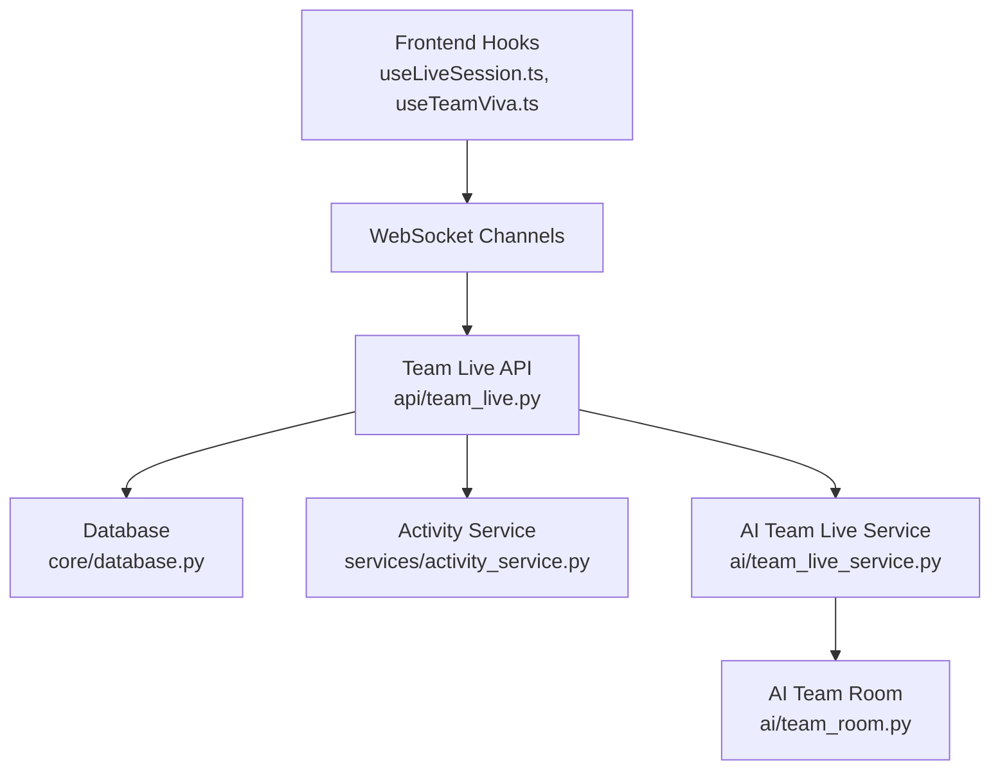

**Diagram sources**
- [src/lib/useLiveSession.ts](file://src/lib/useLiveSession.ts)
- [src/lib/useTeamViva.ts](file://src/lib/useTeamViva.ts)
- [backend/api/team_live.py](file://backend/api/team_live.py)
- [backend/core/database.py](file://backend/core/database.py)
- [backend/services/activity_service.py](file://backend/services/activity_service.py)
- [backend/ai/team_live_service.py](file://backend/ai/team_live_service.py)
- [backend/ai/team_room.py](file://backend/ai/team_room.py)

**Section sources**
- [backend/core/config.py](file://backend/core/config.py)
- [backend/core/database.py](file://backend/core/database.py)

## Performance Considerations
- WebSocket scaling: Use connection pooling and message batching to handle high concurrency.
- Database optimization: Index frequently queried fields (team_id, session_id, participant_id) and use read replicas for analytics.
- AI latency: Cache prompts and room contexts; implement asynchronous processing for heavy computations.
- Frontend efficiency: Debounce frequent updates and use optimistic UI for better responsiveness.

[No sources needed since this section provides general guidance]

## Troubleshooting Guide
Common issues and resolutions:
- WebSocket connection failures: Verify server availability, network policies, and CORS settings.
- Permission errors: Check role assignments and ensure proper token validation.
- Session state inconsistencies: Re-sync client state from server and validate event ordering.
- AI prompt errors: Inspect room context loading and fallback mechanisms.

**Section sources**
- [backend/core/errors.py](file://backend/core/errors.py)
- [backend/core/config.py](file://backend/core/config.py)

## Conclusion
The team collaboration workspace delivers robust real-time communication, shared resources, and collaborative learning through a well-architected system. With strong team management, live session orchestration, AI-enhanced facilitation, and comprehensive activity tracking, it supports both everyday collaboration and advanced viva scenarios. The modular design ensures scalability and maintainability while providing rich user experiences.

[No sources needed since this section summarizes without analyzing specific files]

## Appendices
- Examples:
  - Creating a team: Use the teams API to define team details and invite members.
  - Managing members: Assign roles and adjust permissions via the teams API.
  - Conducting live sessions: Start a session, invite participants, and broadcast events.
  - Facilitating collaborative work: Use the team viva room component for real-time editing and discussion.

[No sources needed since this section provides general guidance]