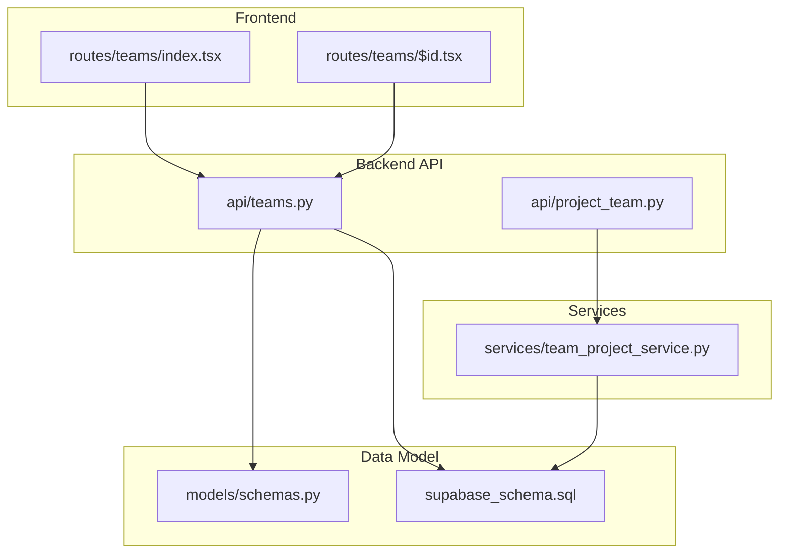
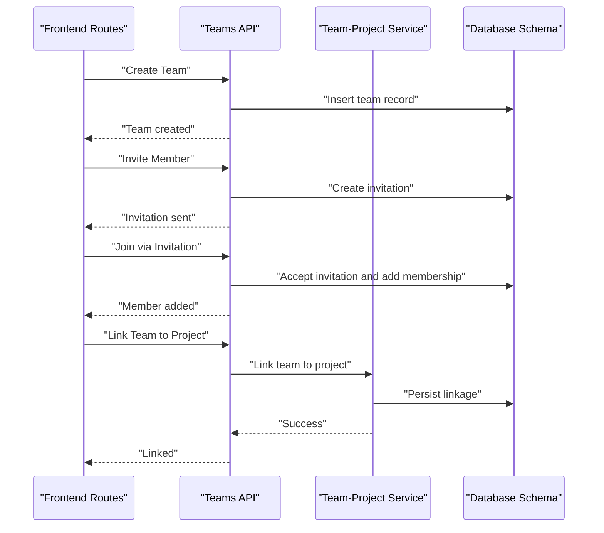
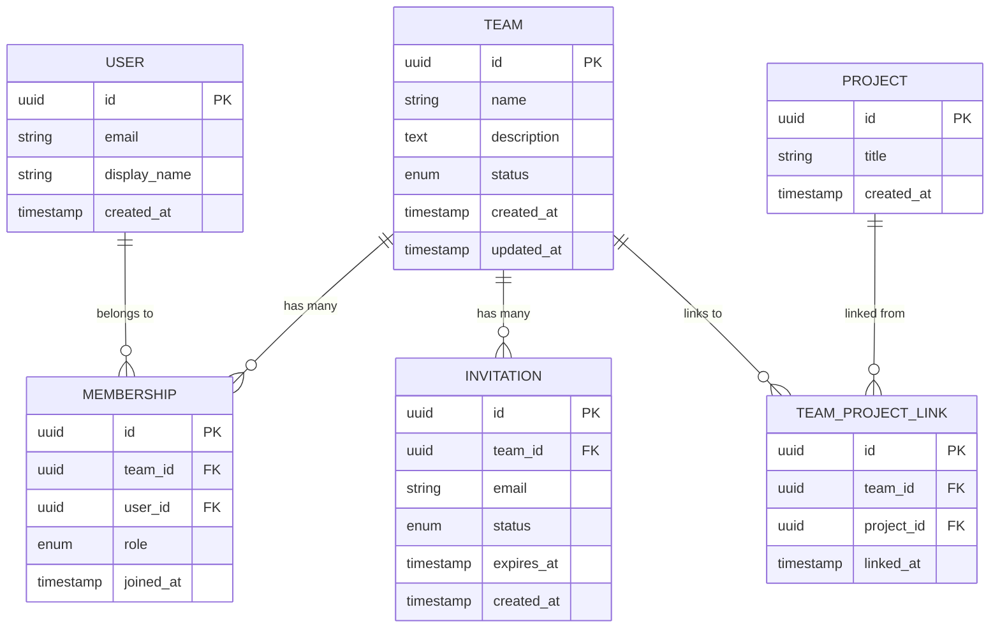
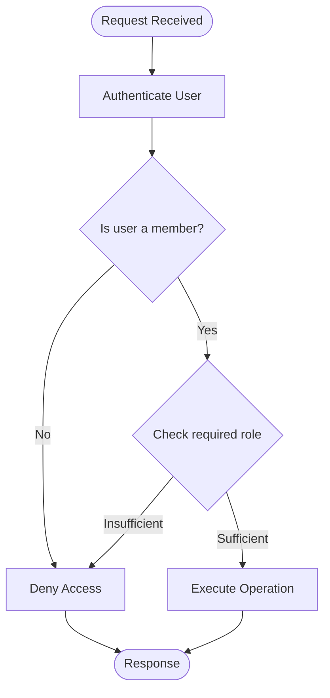
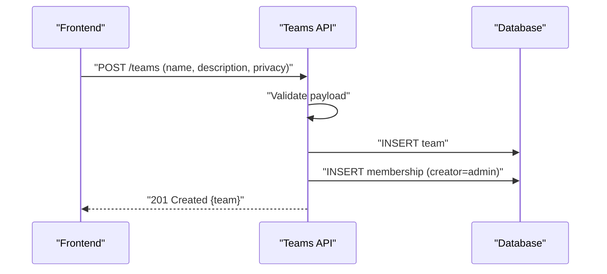
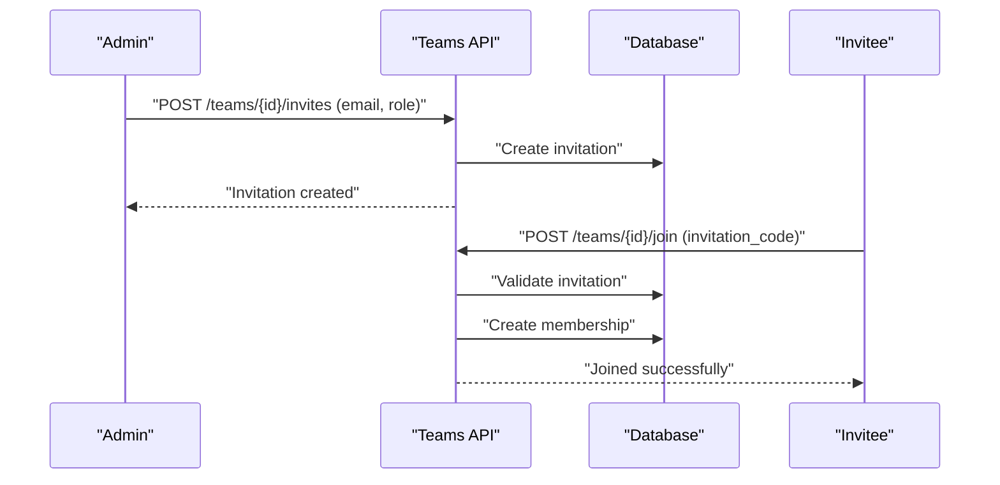
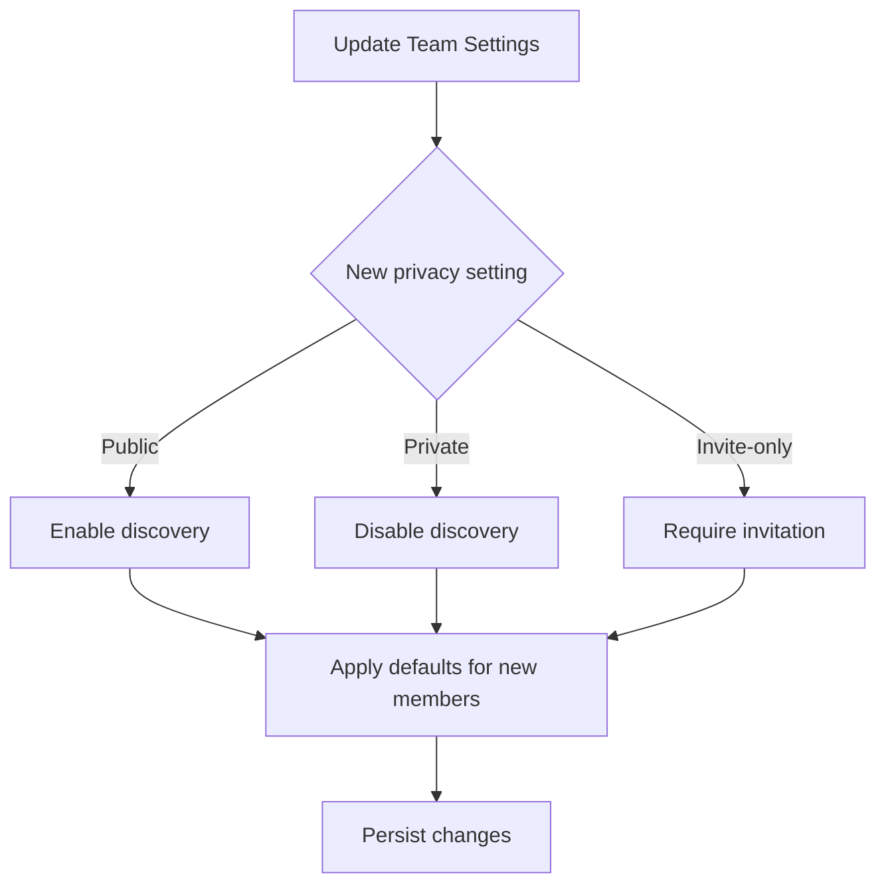
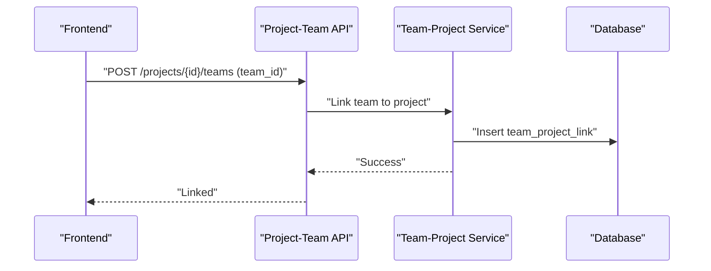
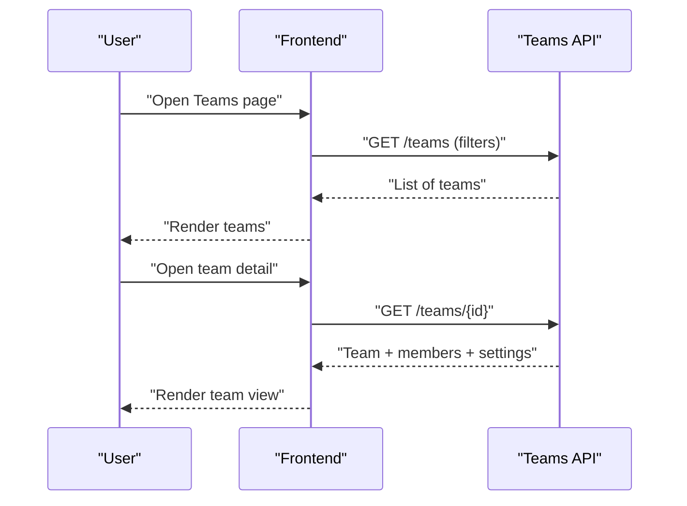
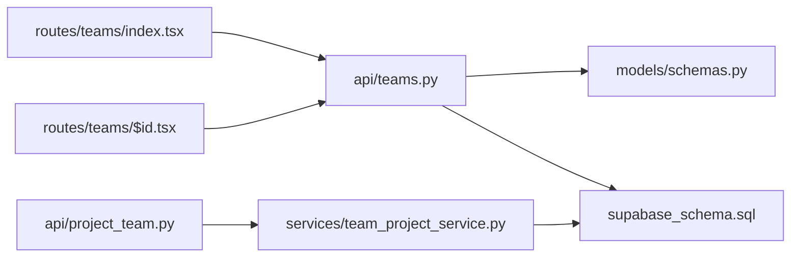

# Team Management & Administration

<cite>
**Referenced Files in This Document**
- [teams.py](file://backend/api/teams.py)
- [schemas.py](file://backend/models/schemas.py)
- [supabase_schema.sql](file://backend/supabase_schema.sql)
- [index.tsx](file://src/routes/teams/index.tsx)
- [$id.tsx](file://src/routes/teams/$id.tsx)
- [project_team.py](file://backend/api/project_team.py)
- [team_project_service.py](file://backend/services/team_project_service.py)
- [test_teams_create.py](file://backend/tests/test_teams_create.py)
</cite>

## Table of Contents
1. [Introduction](#introduction)
2. [Project Structure](#project-structure)
3. [Core Components](#core-components)
4. [Architecture Overview](#architecture-overview)
5. [Detailed Component Analysis](#detailed-component-analysis)
6. [Dependency Analysis](#dependency-analysis)
7. [Performance Considerations](#performance-considerations)
8. [Troubleshooting Guide](#troubleshooting-guide)
9. [Conclusion](#conclusion)

## Introduction
This document explains the team management and administration features across the application’s backend API, data model, and frontend routes. It covers team creation workflows, member invitation systems, role-based permissions, lifecycle management, settings and privacy controls, discovery and search, and integration with project management. The goal is to help developers and administrators understand how teams are modeled, accessed, and governed end-to-end.

## Project Structure
The team feature spans multiple layers:
- Backend API endpoints for team operations (create, update, members, invites, settings).
- Data schemas and database schema definitions for teams, memberships, roles, and invitations.
- Frontend routes for listing and managing teams.
- Services that connect teams to projects and other domain features.

**Diagram sources**
- [index.tsx](file://src/routes/teams/index.tsx)
- [$id.tsx](file://src/routes/teams/$id.tsx)
- [teams.py](file://backend/api/teams.py)
- [project_team.py](file://backend/api/project_team.py)
- [team_project_service.py](file://backend/services/team_project_service.py)
- [schemas.py](file://backend/models/schemas.py)
- [supabase_schema.sql](file://backend/supabase_schema.sql)

**Section sources**
- [index.tsx](file://src/routes/teams/index.tsx)
- [$id.tsx](file://src/routes/teams/$id.tsx)
- [teams.py](file://backend/api/teams.py)
- [project_team.py](file://backend/api/project_team.py)
- [team_project_service.py](file://backend/services/team_project_service.py)
- [schemas.py](file://backend/models/schemas.py)
- [supabase_schema.sql](file://backend/supabase_schema.sql)

## Core Components
- Team API endpoints: Provide CRUD for teams, membership management, invitations, settings, and visibility controls.
- Data schemas: Define request/response models for teams, members, roles, and invitations.
- Database schema: Defines tables for teams, memberships, roles, invitations, and relationships to users and projects.
- Frontend routes: Provide UI flows for listing teams and viewing/managing a specific team.
- Project-team integration: Connects teams to projects via services and API endpoints.

Key responsibilities:
- Enforce role-based access control (RBAC) for admin/member/guest roles.
- Manage team lifecycle (create, update, archive/delete).
- Handle member invitations and acceptance flows.
- Configure team settings and privacy controls.
- Support discovery/search for public or discoverable teams.
- Integrate with project management to link teams to projects.

**Section sources**
- [teams.py](file://backend/api/teams.py)
- [schemas.py](file://backend/models/schemas.py)
- [supabase_schema.sql](file://backend/supabase_schema.sql)
- [index.tsx](file://src/routes/teams/index.tsx)
- [$id.tsx](file://src/routes/teams/$id.tsx)
- [project_team.py](file://backend/api/project_team.py)
- [team_project_service.py](file://backend/services/team_project_service.py)

## Architecture Overview
The system follows a layered architecture:
- Frontend routes call backend APIs.
- API endpoints validate requests using Pydantic-like schemas and enforce RBAC.
- Services encapsulate business logic (e.g., linking teams to projects).
- Database layer persists entities and enforces constraints.

**Diagram sources**
- [teams.py](file://backend/api/teams.py)
- [project_team.py](file://backend/api/project_team.py)
- [team_project_service.py](file://backend/services/team_project_service.py)
- [supabase_schema.sql](file://backend/supabase_schema.sql)

## Detailed Component Analysis

### Team Data Model
The data model centers around teams, memberships, roles, and invitations, with relationships to users and projects.

Notes:
- Roles include at least admin, member, and guest.
- Invitations track email, status, and expiration.
- Team-project linkage supports many-to-many relationships.

**Diagram sources**
- [supabase_schema.sql](file://backend/supabase_schema.sql)

**Section sources**
- [supabase_schema.sql](file://backend/supabase_schema.sql)

### Role-Based Permissions and Access Control
Roles define what actions users can perform within a team:
- Admin: Full control over team settings, members, and links.
- Member: Can participate in team activities and limited settings.
- Guest: Read-only or restricted access depending on team privacy.

Access control checks occur at API endpoints before executing mutations. Typical enforcement includes:
- Verifying membership and role prior to updates.
- Restricting sensitive operations (e.g., deleting team, changing privacy) to admins.
- Validating invitation acceptance only when invited and not already a member.

**Diagram sources**
- [teams.py](file://backend/api/teams.py)
- [schemas.py](file://backend/models/schemas.py)

**Section sources**
- [teams.py](file://backend/api/teams.py)
- [schemas.py](file://backend/models/schemas.py)

### Team Creation Workflow
Typical steps:
- Frontend collects team details (name, description, privacy).
- API validates inputs against schemas.
- Creates team record and assigns creator as admin.
- Returns team ID for subsequent operations.

**Diagram sources**
- [teams.py](file://backend/api/teams.py)
- [supabase_schema.sql](file://backend/supabase_schema.sql)

**Section sources**
- [teams.py](file://backend/api/teams.py)
- [supabase_schema.sql](file://backend/supabase_schema.sql)

### Member Invitation System
Invitations allow adding members without pre-existing accounts:
- Admin creates an invitation with target email and optional role.
- Invitation stored with expiration and status.
- Invitee accepts via join flow; if account exists, membership is created; otherwise, account creation may be prompted.

**Diagram sources**
- [teams.py](file://backend/api/teams.py)
- [supabase_schema.sql](file://backend/supabase_schema.sql)

**Section sources**
- [teams.py](file://backend/api/teams.py)
- [supabase_schema.sql](file://backend/supabase_schema.sql)

### Team Settings and Privacy Controls
Settings include:
- Visibility (public, private, invite-only).
- Join policy (approval required vs direct join).
- Default role for new members.
- Feature toggles (e.g., project linking enabled).

Privacy affects discovery and join behavior:
- Public teams appear in discovery/search.
- Private teams require explicit invites or approvals.
- Invite-only teams restrict joining to valid invitations.

**Diagram sources**
- [teams.py](file://backend/api/teams.py)
- [supabase_schema.sql](file://backend/supabase_schema.sql)

**Section sources**
- [teams.py](file://backend/api/teams.py)
- [supabase_schema.sql](file://backend/supabase_schema.sql)

### Administrative Tools
Administrators can:
- Update team metadata and settings.
- Manage members (add, remove, change roles).
- Revoke invitations.
- Link/unlink projects.
- Archive or delete teams (with safeguards).

These operations are guarded by admin role checks and audit-friendly logging where applicable.

**Section sources**
- [teams.py](file://backend/api/teams.py)

### Discovery and Search
Discovery surfaces teams based on privacy and search criteria:
- Filters by keywords, tags, or categories.
- Respects privacy rules (public/invite-only).
- Pagination and sorting for performance.

Search queries should leverage indexed fields (e.g., team name, description) and avoid full-table scans.

**Section sources**
- [teams.py](file://backend/api/teams.py)
- [supabase_schema.sql](file://backend/supabase_schema.sql)

### Integration with Project Management
Teams can be linked to projects to coordinate work:
- API endpoint to link/unlink a team to a project.
- Service enforces constraints (e.g., team must exist, project must exist).
- Frontend displays linked projects within team context.

**Diagram sources**
- [project_team.py](file://backend/api/project_team.py)
- [team_project_service.py](file://backend/services/team_project_service.py)
- [supabase_schema.sql](file://backend/supabase_schema.sql)

**Section sources**
- [project_team.py](file://backend/api/project_team.py)
- [team_project_service.py](file://backend/services/team_project_service.py)
- [supabase_schema.sql](file://backend/supabase_schema.sql)

### Frontend Team Flows
- Listing teams: Displays available teams with filters and pagination.
- Team detail: Shows members, settings, linked projects, and invites.
- Actions: Create team, invite members, manage roles, update settings.

**Diagram sources**
- [index.tsx](file://src/routes/teams/index.tsx)
- [$id.tsx](file://src/routes/teams/$id.tsx)
- [teams.py](file://backend/api/teams.py)

**Section sources**
- [index.tsx](file://src/routes/teams/index.tsx)
- [$id.tsx](file://src/routes/teams/$id.tsx)
- [teams.py](file://backend/api/teams.py)

## Dependency Analysis
High-level dependencies:
- Frontend routes depend on Teams API endpoints.
- Teams API depends on data schemas and database schema.
- Project-team API depends on team-project service.
- Service depends on database schema for persistence.

**Diagram sources**
- [index.tsx](file://src/routes/teams/index.tsx)
- [$id.tsx](file://src/routes/teams/$id.tsx)
- [teams.py](file://backend/api/teams.py)
- [project_team.py](file://backend/api/project_team.py)
- [team_project_service.py](file://backend/services/team_project_service.py)
- [schemas.py](file://backend/models/schemas.py)
- [supabase_schema.sql](file://backend/supabase_schema.sql)

**Section sources**
- [index.tsx](file://src/routes/teams/index.tsx)
- [$id.tsx](file://src/routes/teams/$id.tsx)
- [teams.py](file://backend/api/teams.py)
- [project_team.py](file://backend/api/project_team.py)
- [team_project_service.py](file://backend/services/team_project_service.py)
- [schemas.py](file://backend/models/schemas.py)
- [supabase_schema.sql](file://backend/supabase_schema.sql)

## Performance Considerations
- Indexing: Ensure indexes on frequently filtered fields (team name, email for invitations, membership team_id/user_id).
- Pagination: Implement cursor or offset pagination for team lists and member lists.
- Caching: Cache public team listings and search results with appropriate invalidation on updates.
- Query optimization: Avoid N+1 queries when loading team details with members and linked projects.
- Rate limiting: Protect invitation and join endpoints against abuse.

[No sources needed since this section provides general guidance]

## Troubleshooting Guide
Common issues and resolutions:
- Permission denied errors: Verify user role and membership; ensure admin-only endpoints are called by admins.
- Invitation expired: Extend expiry or reissue invitation; check expiration field handling.
- Duplicate membership: Prevent creating memberships for existing members; handle idempotency.
- Project linkage failures: Validate both team and project existence; check foreign key constraints.
- Search performance: Review query plans and add indexes for search predicates.

Operational checks:
- Confirm RBAC middleware is applied to protected endpoints.
- Validate schema constraints for roles and statuses.
- Inspect logs for failed joins or permission denials.

**Section sources**
- [teams.py](file://backend/api/teams.py)
- [supabase_schema.sql](file://backend/supabase_schema.sql)

## Conclusion
The team management system provides a robust foundation for organizing users into teams with clear roles, secure access controls, and flexible settings. It integrates seamlessly with project management through explicit linkages and supports discovery and search for collaborative workflows. By following the documented workflows and best practices, teams can efficiently manage their members, configure privacy, and collaborate on projects.

[No sources needed since this section summarizes without analyzing specific files]