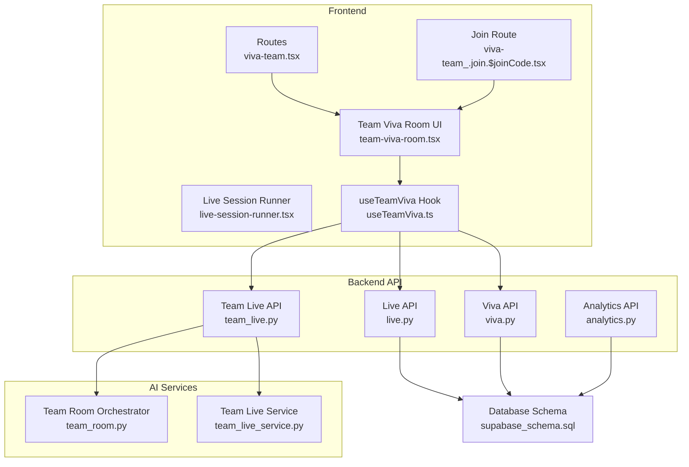
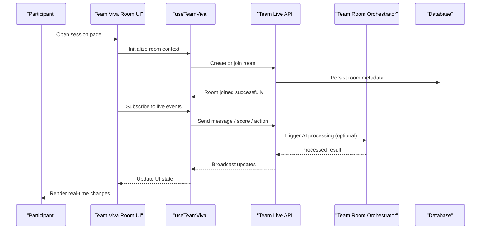
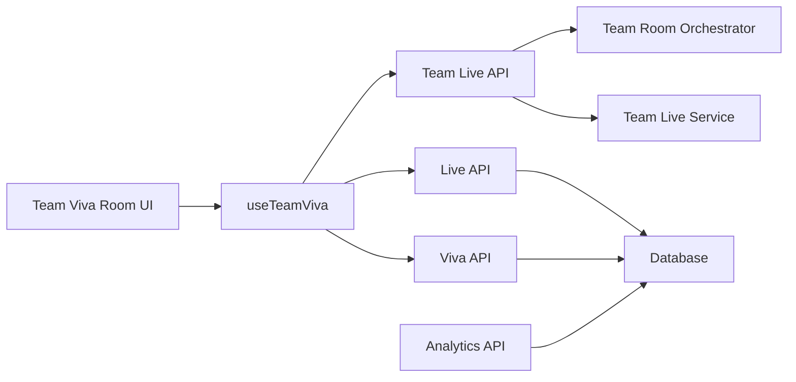

# Team Viva Room

<cite>
**Referenced Files in This Document**
- [team-viva-room.tsx](file://src/components/live/team-viva-room.tsx)
- [live-session-runner.tsx](file://src/components/live/live-session-runner.tsx)
- [useTeamViva.ts](file://src/lib/useTeamViva.ts)
- [viva-team.tsx](file://src/routes/advanced/viva-team.tsx)
- [viva-team_.join.$joinCode.tsx](file://src/routes/advanced/viva-team_.join.$joinCode.tsx)
- [team_live.py](file://backend/api/team_live.py)
- [team_room.py](file://backend/ai/team_room.py)
- [team_live_service.py](file://backend/ai/team_live_service.py)
- [live.py](file://backend/api/live.py)
- [viva.py](file://backend/api/viva.py)
- [analytics.py](file://backend/api/analytics.py)
- [supabase_schema.sql](file://backend/supabase_schema.sql)
</cite>

## Table of Contents
1. [Introduction](#introduction)
2. [Project Structure](#project-structure)
3. [Core Components](#core-components)
4. [Architecture Overview](#architecture-overview)
5. [Detailed Component Analysis](#detailed-component-analysis)
6. [Dependency Analysis](#dependency-analysis)
7. [Performance Considerations](#performance-considerations)
8. [Troubleshooting Guide](#troubleshooting-guide)
9. [Conclusion](#conclusion)
10. [Appendices](#appendices)

## Introduction
Team Viva Room is a collaborative assessment and peer learning environment that enables multiple participants to engage in real-time viva-style sessions. It supports group assessments, shared questioning, collective evaluation, moderation tools, participation tracking, and analytics. The feature spans both frontend components and backend services to deliver live collaboration with persistence and insights.

## Project Structure
The Team Viva Room feature is implemented across:
- Frontend routes for session creation and joining
- Live room UI component for participant interaction
- Real-time hooks for state synchronization
- Backend APIs for session lifecycle, chat, and scoring
- AI-powered team room orchestration and metrics
- Database schema for persistence

**Diagram sources**
- [viva-team.tsx](file://src/routes/advanced/viva-team.tsx)
- [viva-team_.join.$joinCode.tsx](file://src/routes/advanced/viva-team_.join.$joinCode.tsx)
- [team-viva-room.tsx](file://src/components/live/team-viva-room.tsx)
- [live-session-runner.tsx](file://src/components/live/live-session-runner.tsx)
- [useTeamViva.ts](file://src/lib/useTeamViva.ts)
- [team_live.py](file://backend/api/team_live.py)
- [live.py](file://backend/api/live.py)
- [viva.py](file://backend/api/viva.py)
- [analytics.py](file://backend/api/analytics.py)
- [team_room.py](file://backend/ai/team_room.py)
- [team_live_service.py](file://backend/ai/team_live_service.py)
- [supabase_schema.sql](file://backend/supabase_schema.sql)

**Section sources**
- [viva-team.tsx](file://src/routes/advanced/viva-team.tsx)
- [viva-team_.join.$joinCode.tsx](file://src/routes/advanced/viva-team_.join.$joinCode.tsx)
- [team-viva-room.tsx](file://src/components/live/team-viva-room.tsx)
- [live-session-runner.tsx](file://src/components/live/live-session-runner.tsx)
- [useTeamViva.ts](file://src/lib/useTeamViva.ts)
- [team_live.py](file://backend/api/team_live.py)
- [live.py](file://backend/api/live.py)
- [viva.py](file://backend/api/viva.py)
- [analytics.py](file://backend/api/analytics.py)
- [team_room.py](file://backend/ai/team_room.py)
- [team_live_service.py](file://backend/ai/team_live_service.py)
- [supabase_schema.sql](file://backend/supabase_schema.sql)

## Core Components
- Team Viva Room UI: Provides the main interface for participants to join, ask questions, share resources, and evaluate peers during a live session.
- Live Session Runner: Coordinates session lifecycle events (start, pause, resume, end), orchestrates transitions between stages, and integrates with the room UI.
- useTeamViva Hook: Encapsulates real-time state management, event subscriptions, and API calls for team viva operations such as joining, messaging, and scoring.
- Backend Team Live API: Exposes endpoints for creating/joining rooms, broadcasting messages, managing scores, and retrieving session data.
- AI Team Room Orchestrator: Manages advanced features like moderated discussions, question routing, and feedback synthesis.
- Analytics API: Aggregates participation metrics, evaluation distributions, and performance indicators for post-session review.

**Section sources**
- [team-viva-room.tsx](file://src/components/live/team-viva-room.tsx)
- [live-session-runner.tsx](file://src/components/live/live-session-runner.tsx)
- [useTeamViva.ts](file://src/lib/useTeamViva.ts)
- [team_live.py](file://backend/api/team_live.py)
- [team_room.py](file://backend/ai/team_room.py)
- [analytics.py](file://backend/api/analytics.py)

## Architecture Overview
The system follows a client-server architecture with real-time communication:
- Frontend routes initialize or join a session and render the Team Viva Room UI.
- The UI uses the useTeamViva hook to subscribe to live events and call backend APIs.
- Backend team live API coordinates room state, persists data, and delegates AI-driven tasks to the team room orchestrator.
- Analytics API aggregates session data for reporting and dashboards.

**Diagram sources**
- [team-viva-room.tsx](file://src/components/live/team-viva-room.tsx)
- [useTeamViva.ts](file://src/lib/useTeamViva.ts)
- [team_live.py](file://backend/api/team_live.py)
- [team_room.py](file://backend/ai/team_room.py)
- [supabase_schema.sql](file://backend/supabase_schema.sql)

## Detailed Component Analysis

### Team Viva Room UI
Responsibilities:
- Display participant list, chat, and shared content panels
- Provide controls for raising hands, asking questions, sharing resources, and submitting evaluations
- Integrate with the live session runner to manage stage transitions
- Show moderation controls for facilitators (e.g., mute, pin, spotlight)

Key interactions:
- Join via code or link from route parameters
- Emit actions through the hook to backend APIs
- Receive real-time updates and reflect them in the UI

**Section sources**
- [team-viva-room.tsx](file://src/components/live/team-viva-room.tsx)

### Live Session Runner
Responsibilities:
- Manage session lifecycle states (idle, running, paused, ended)
- Coordinate transitions between stages (intro, Q&A, evaluation, wrap-up)
- Ensure consistent state across participants by syncing with backend

Integration points:
- Calls backend APIs to start/pause/resume/end sessions
- Emits events consumed by the Team Viva Room UI

**Section sources**
- [live-session-runner.tsx](file://src/components/live/live-session-runner.tsx)

### useTeamViva Hook
Responsibilities:
- Maintain local state for room membership, messages, scores, and moderation flags
- Handle reconnection and error recovery for real-time channels
- Wrap API calls for create/join room, send/receive messages, submit evaluations, and fetch analytics

Data flow:
- Subscribes to server events and updates local state
- Debounces heavy operations and batches updates where appropriate

**Section sources**
- [useTeamViva.ts](file://src/lib/useTeamViva.ts)

### Backend Team Live API
Responsibilities:
- Endpoints for room creation, joining, and lifecycle management
- Message broadcasting and presence tracking
- Evaluation submission and aggregation
- Moderation actions (mute, pin, spotlight)

Security and validation:
- Validates user roles and permissions
- Enforces rate limits and input sanitization

**Section sources**
- [team_live.py](file://backend/api/team_live.py)

### AI Team Room Orchestrator
Responsibilities:
- Facilitate moderated discussions and structured Q&A flows
- Synthesize peer feedback into actionable insights
- Generate summaries and highlight key discussion points

Integration:
- Called by the Team Live API when AI-enhanced features are enabled
- Returns processed results to be broadcast to participants

**Section sources**
- [team_room.py](file://backend/ai/team_room.py)
- [team_live_service.py](file://backend/ai/team_live_service.py)

### Analytics API
Responsibilities:
- Aggregate participation metrics (messages sent, evaluations submitted, time-on-task)
- Compute distribution of peer scores and identify outliers
- Provide exportable reports for facilitators and administrators

Outputs:
- Dashboards and downloadable reports
- Real-time counters for active participants and pending evaluations

**Section sources**
- [analytics.py](file://backend/api/analytics.py)

### Routes: Session Creation and Joining
- Session creation route initializes a new team viva session and returns a join code/link.
- Join route accepts a join code and navigates participants into the same room.

User flow:
- Creator opens the session page, sets options, and starts the session.
- Participants open the join page, enter the code, and connect to the room.

**Section sources**
- [viva-team.tsx](file://src/routes/advanced/viva-team.tsx)
- [viva-team_.join.$joinCode.tsx](file://src/routes/advanced/viva-team_.join.$joinCode.tsx)

### Data Persistence and Schema
The database schema defines core entities for rooms, participants, messages, evaluations, and analytics snapshots. It ensures consistency across live sessions and supports historical analysis.

Key considerations:
- Unique identifiers for rooms and participants
- Timestamps for auditability and analytics
- Indexes on frequently queried fields (room_id, participant_id, created_at)

**Section sources**
- [supabase_schema.sql](file://backend/supabase_schema.sql)

## Dependency Analysis
The following diagram highlights dependencies among major modules:

**Diagram sources**
- [team-viva-room.tsx](file://src/components/live/team-viva-room.tsx)
- [useTeamViva.ts](file://src/lib/useTeamViva.ts)
- [team_live.py](file://backend/api/team_live.py)
- [live.py](file://backend/api/live.py)
- [viva.py](file://backend/api/viva.py)
- [team_room.py](file://backend/ai/team_room.py)
- [team_live_service.py](file://backend/ai/team_live_service.py)
- [analytics.py](file://backend/api/analytics.py)
- [supabase_schema.sql](file://backend/supabase_schema.sql)

**Section sources**
- [team-viva-room.tsx](file://src/components/live/team-viva-room.tsx)
- [useTeamViva.ts](file://src/lib/useTeamViva.ts)
- [team_live.py](file://backend/api/team_live.py)
- [live.py](file://backend/api/live.py)
- [viva.py](file://backend/api/viva.py)
- [team_room.py](file://backend/ai/team_room.py)
- [team_live_service.py](file://backend/ai/team_live_service.py)
- [analytics.py](file://backend/api/analytics.py)
- [supabase_schema.sql](file://backend/supabase_schema.sql)

## Performance Considerations
- Use batching for high-frequency updates (e.g., chat messages) to reduce network overhead.
- Implement optimistic UI updates with rollback on failure to improve perceived responsiveness.
- Apply pagination and lazy loading for large participant lists and message histories.
- Cache read-only analytics data and invalidate on session end.
- Monitor WebSocket connection health and auto-reconnect with exponential backoff.

[No sources needed since this section provides general guidance]

## Troubleshooting Guide
Common issues and resolutions:
- Connection failures: Verify network connectivity and check reconnection logic in the hook.
- Missing participants: Confirm room ID and join code correctness; ensure backend presence tracking is functioning.
- Stale evaluations: Refresh analytics and re-fetch latest scores from the backend.
- Moderation not applied: Validate role permissions and confirm moderation endpoints are invoked.

Operational checks:
- Inspect browser console for WebSocket errors.
- Review backend logs for API request/response cycles.
- Validate database constraints and indexes if queries are slow.

**Section sources**
- [useTeamViva.ts](file://src/lib/useTeamViva.ts)
- [team_live.py](file://backend/api/team_live.py)
- [analytics.py](file://backend/api/analytics.py)

## Conclusion
Team Viva Room delivers a robust platform for collaborative assessment and peer learning. Its modular architecture separates UI concerns, real-time state management, and backend orchestration, enabling scalable and maintainable development. With built-in moderation, participation tracking, and analytics, it supports effective facilitation and continuous improvement of group learning outcomes.

[No sources needed since this section summarizes without analyzing specific files]

## Appendices

### Example Workflows

#### Setting Up a Team Viva Session
- Navigate to the session creation route and configure session options.
- Start the session to generate a join code/link.
- Share the join code with participants.

**Section sources**
- [viva-team.tsx](file://src/routes/advanced/viva-team.tsx)

#### Joining a Session
- Open the join route and enter the provided join code.
- Connect to the room and begin participating.

**Section sources**
- [viva-team_.join.$joinCode.tsx](file://src/routes/advanced/viva-team_.join.$joinCode.tsx)

#### Facilitating Group Discussions
- Use moderation controls to manage turn-taking and focus.
- Pin important messages and spotlight contributors.
- Leverage AI-generated summaries to guide next steps.

**Section sources**
- [team-viva-room.tsx](file://src/components/live/team-viva-room.tsx)
- [team_room.py](file://backend/ai/team_room.py)

#### Managing Collaborative Evaluations
- Participants submit peer evaluations through the UI.
- Backend aggregates scores and publishes updated analytics.
- Facilitators review distributions and provide targeted feedback.

**Section sources**
- [team_live.py](file://backend/api/team_live.py)
- [analytics.py](file://backend/api/analytics.py)