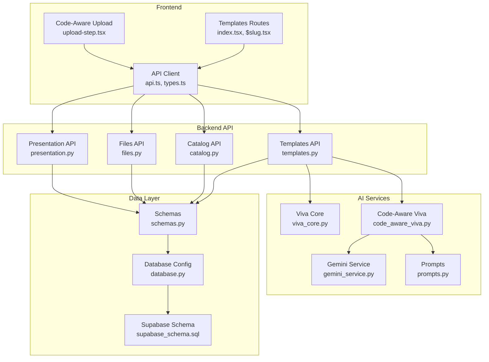
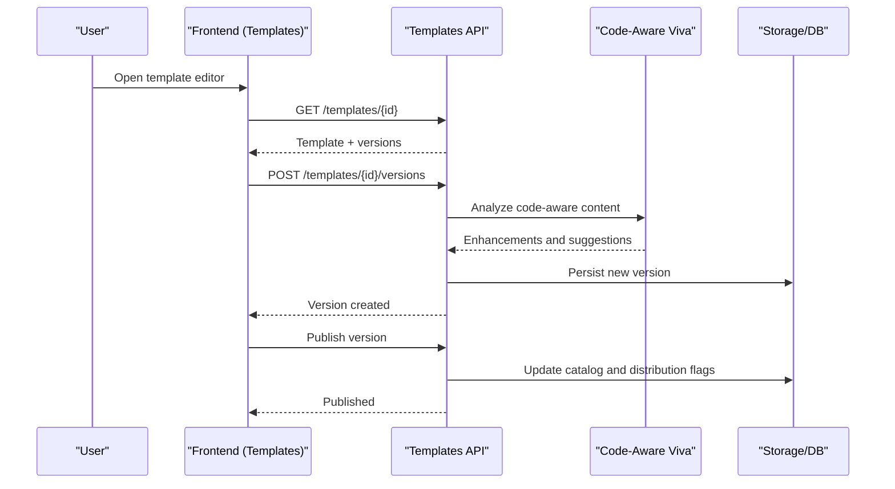
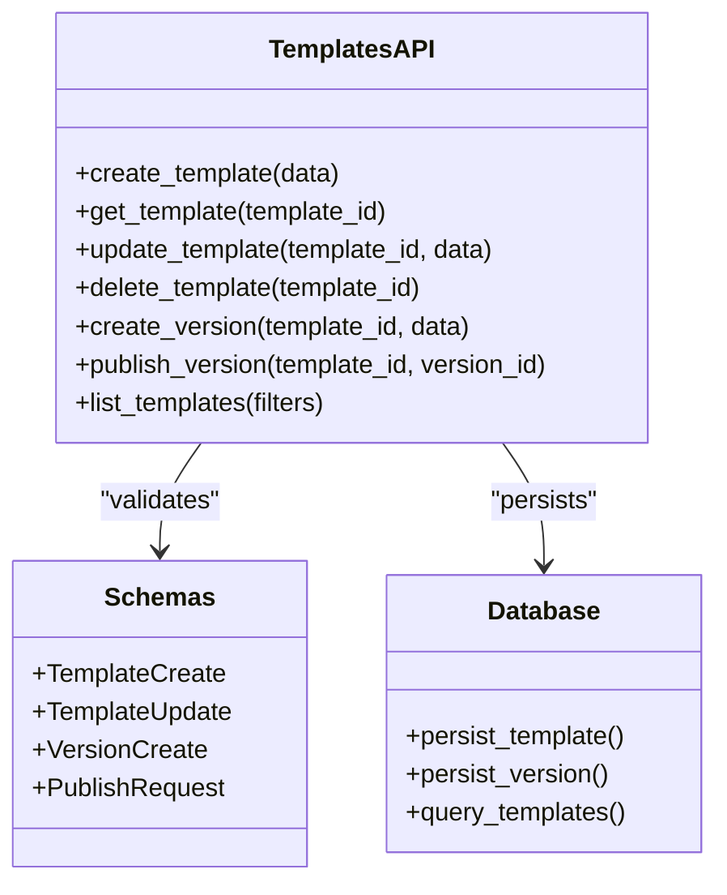
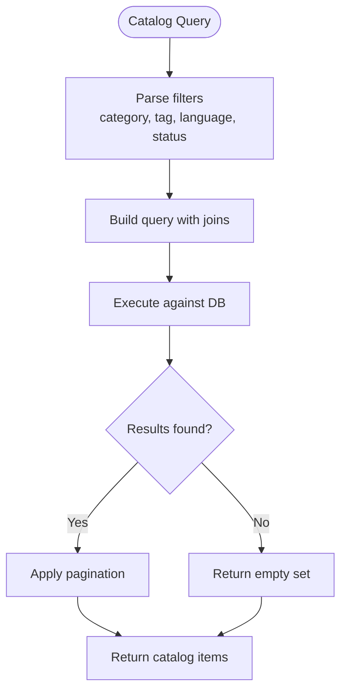
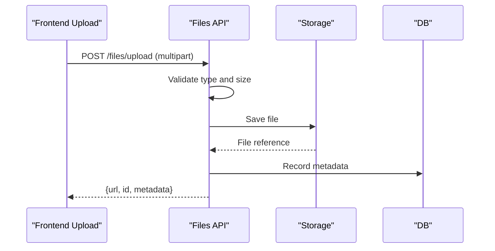
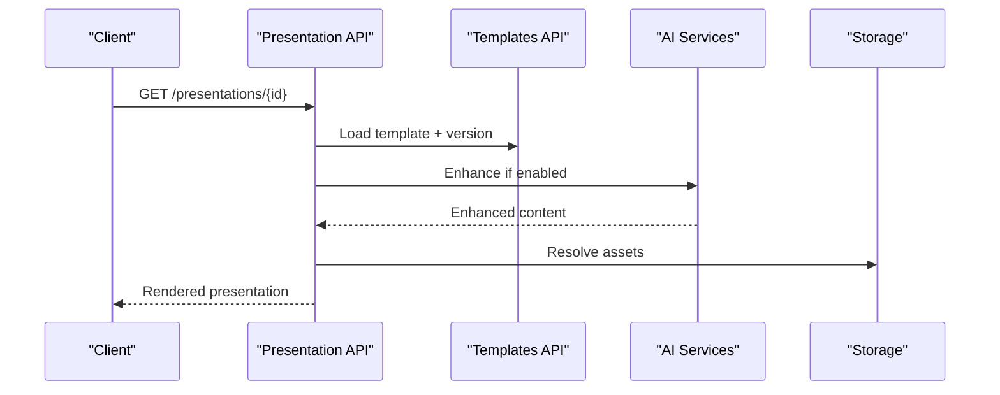
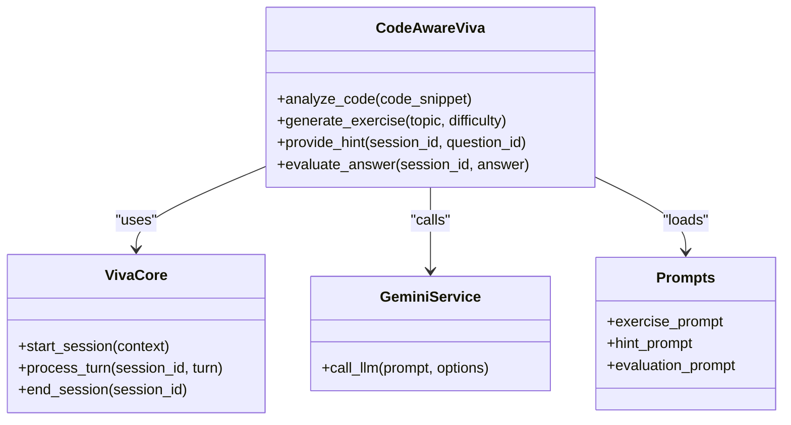
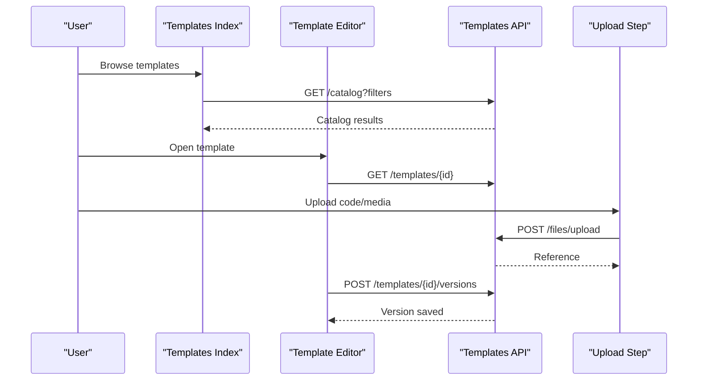
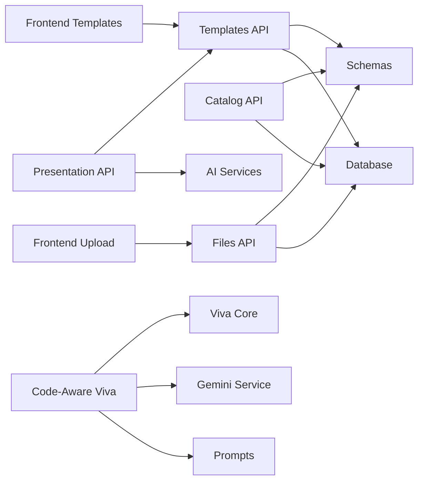
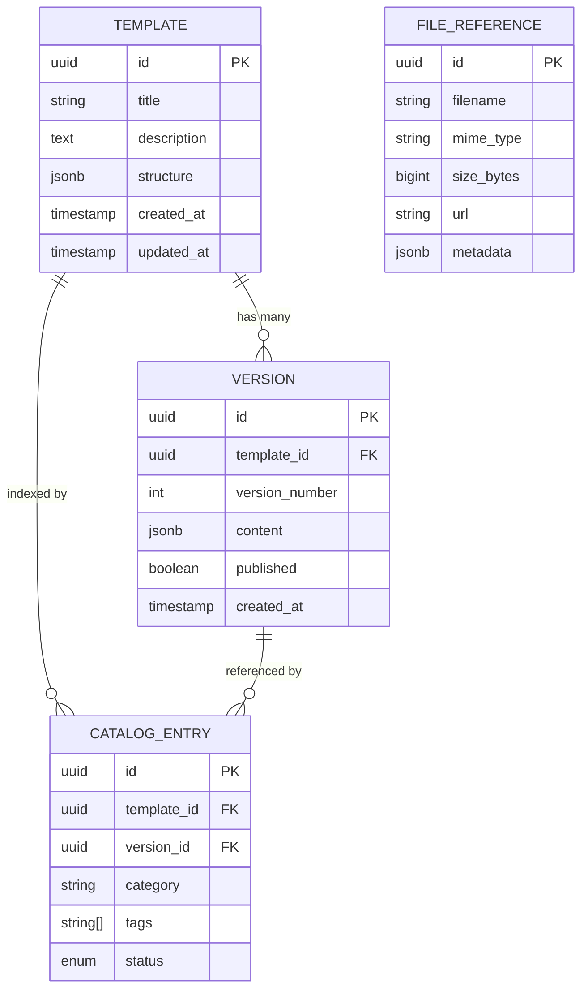

# Template & Content Management

<cite>
**Referenced Files in This Document**
- [templates.py](file://backend/api/templates.py)
- [catalog.py](file://backend/api/catalog.py)
- [files.py](file://backend/api/files.py)
- [presentation.py](file://backend/api/presentation.py)
- [viva_core.py](file://backend/ai/viva_core.py)
- [code_aware_viva.py](file://backend/ai/code_aware_viva.py)
- [gemini_service.py](file://backend/ai/gemini_service.py)
- [prompts.py](file://backend/ai/prompts.py)
- [schemas.py](file://backend/models/schemas.py)
- [database.py](file://backend/core/database.py)
- [config.py](file://backend/core/config.py)
- [index.tsx](file://src/routes/templates/index.tsx)
- [$slug.tsx](file://src/routes/templates/$slug.tsx)
- [upload-step.tsx](file://src/components/code-aware/upload-step.tsx)
- [api.ts](file://src/lib/api.ts)
- [types.ts](file://src/lib/types.ts)
- [supabase_schema.sql](file://backend/supabase_schema.sql)
</cite>

## Table of Contents
1. [Introduction](#introduction)
2. [Project Structure](#project-structure)
3. [Core Components](#core-components)
4. [Architecture Overview](#architecture-overview)
5. [Detailed Component Analysis](#detailed-component-analysis)
6. [Dependency Analysis](#dependency-analysis)
7. [Performance Considerations](#performance-considerations)
8. [Troubleshooting Guide](#troubleshooting-guide)
9. [Conclusion](#conclusion)
10. [Appendices](#appendices)

## Introduction
This document explains the template and content management system that powers educational material creation, organization, and delivery. It covers:
- Template creation workflow and versioning
- Dynamic content generation and customization
- Code-aware templates for programming education
- File upload capabilities and validation
- Catalog management for organizing materials
- AI integration for content enhancement
- Responsive design patterns across learning contexts
- Examples for creating custom templates, uploading content, and managing libraries

The system is implemented with a FastAPI backend and a React frontend, integrating AI services to enhance and adapt content dynamically.

## Project Structure
Key areas relevant to templates and content management:
- Backend API endpoints for templates, catalog, files, and presentations
- AI services for code-aware viva and content enhancement
- Data models and database schema
- Frontend routes and components for template browsing, editing, and uploads

**Diagram sources**
- [templates.py](file://backend/api/templates.py)
- [catalog.py](file://backend/api/catalog.py)
- [files.py](file://backend/api/files.py)
- [presentation.py](file://backend/api/presentation.py)
- [viva_core.py](file://backend/ai/viva_core.py)
- [code_aware_viva.py](file://backend/ai/code_aware_viva.py)
- [gemini_service.py](file://backend/ai/gemini_service.py)
- [prompts.py](file://backend/ai/prompts.py)
- [schemas.py](file://backend/models/schemas.py)
- [database.py](file://backend/core/database.py)
- [supabase_schema.sql](file://backend/supabase_schema.sql)
- [index.tsx](file://src/routes/templates/index.tsx)
- [$slug.tsx](file://src/routes/templates/$slug.tsx)
- [upload-step.tsx](file://src/components/code-aware/upload-step.tsx)
- [api.ts](file://src/lib/api.ts)
- [types.ts](file://src/lib/types.ts)

**Section sources**
- [templates.py](file://backend/api/templates.py)
- [catalog.py](file://backend/api/catalog.py)
- [files.py](file://backend/api/files.py)
- [presentation.py](file://backend/api/presentation.py)
- [viva_core.py](file://backend/ai/viva_core.py)
- [code_aware_viva.py](file://backend/ai/code_aware_viva.py)
- [gemini_service.py](file://backend/ai/gemini_service.py)
- [prompts.py](file://backend/ai/prompts.py)
- [schemas.py](file://backend/models/schemas.py)
- [database.py](file://backend/core/database.py)
- [supabase_schema.sql](file://backend/supabase_schema.sql)
- [index.tsx](file://src/routes/templates/index.tsx)
- [$slug.tsx](file://src/routes/templates/$slug.tsx)
- [upload-step.tsx](file://src/components/code-aware/upload-step.tsx)
- [api.ts](file://src/lib/api.ts)
- [types.ts](file://src/lib/types.ts)

## Core Components
- Templates API: CRUD operations for templates, versioning, publishing, and distribution hooks.
- Catalog API: Organizes templates and content into collections, tags, and categories; supports search and filtering.
- Files API: Handles secure file uploads, storage references, and metadata validation.
- Presentation API: Renders templates with dynamic content and integrates with AI-generated enhancements.
- AI Integration: Code-aware viva engine and Gemini-based content enhancement using prompt templates.
- Data Layer: Pydantic schemas for request/response validation and Supabase-backed persistence.
- Frontend: Template browser, editor, and upload flows with responsive UI components.

**Section sources**
- [templates.py](file://backend/api/templates.py)
- [catalog.py](file://backend/api/catalog.py)
- [files.py](file://backend/api/files.py)
- [presentation.py](file://backend/api/presentation.py)
- [viva_core.py](file://backend/ai/viva_core.py)
- [code_aware_viva.py](file://backend/ai/code_aware_viva.py)
- [gemini_service.py](file://backend/ai/gemini_service.py)
- [prompts.py](file://backend/ai/prompts.py)
- [schemas.py](file://backend/models/schemas.py)
- [database.py](file://backend/core/database.py)
- [index.tsx](file://src/routes/templates/index.tsx)
- [$slug.tsx](file://src/routes/templates/$slug.tsx)
- [upload-step.tsx](file://src/components/code-aware/upload-step.tsx)
- [api.ts](file://src/lib/api.ts)
- [types.ts](file://src/lib/types.ts)

## Architecture Overview
The system follows a layered architecture:
- Frontend routes and components orchestrate user interactions for template selection, editing, and uploads.
- Backend APIs expose REST endpoints for template and content operations.
- AI services provide code-aware analysis and content enhancement via prompts and external LLMs.
- Data layer enforces schema validation and persists data through Supabase.

**Diagram sources**
- [templates.py](file://backend/api/templates.py)
- [code_aware_viva.py](file://backend/ai/code_aware_viva.py)
- [viva_core.py](file://backend/ai/viva_core.py)
- [schemas.py](file://backend/models/schemas.py)
- [database.py](file://backend/core/database.py)
- [index.tsx](file://src/routes/templates/index.tsx)
- [$slug.tsx](file://src/routes/templates/$slug.tsx)

## Detailed Component Analysis

### Templates API
Responsibilities:
- Create, read, update, delete templates
- Manage versions and publish states
- Integrate with AI for code-aware enhancements
- Distribute published templates to catalogs

Key behaviors:
- Versioning: Each update creates a new version record; only published versions are discoverable.
- Validation: Request bodies validated against Pydantic schemas.
- AI integration: Optional code-aware analysis triggers before saving or publishing.

**Diagram sources**
- [templates.py](file://backend/api/templates.py)
- [schemas.py](file://backend/models/schemas.py)
- [database.py](file://backend/core/database.py)

**Section sources**
- [templates.py](file://backend/api/templates.py)
- [schemas.py](file://backend/models/schemas.py)
- [database.py](file://backend/core/database.py)

### Catalog Management
Responsibilities:
- Organize templates and content into collections, categories, and tags
- Support search and filtering by metadata
- Track distribution status and visibility

Key behaviors:
- Filtering: By category, tag, language, difficulty, and publication state.
- Indexing: Catalog entries reference template IDs and version IDs.
- Discovery: Public endpoints list curated or trending items.

**Diagram sources**
- [catalog.py](file://backend/api/catalog.py)
- [schemas.py](file://backend/models/schemas.py)
- [database.py](file://backend/core/database.py)

**Section sources**
- [catalog.py](file://backend/api/catalog.py)
- [schemas.py](file://backend/models/schemas.py)
- [database.py](file://backend/core/database.py)

### File Upload and Validation
Responsibilities:
- Accept multipart file uploads
- Validate file type, size, and content safety
- Store files and return stable references for templates and presentations

Key behaviors:
- Validation: Enforce allowed MIME types and maximum sizes.
- Storage: Save to persistent storage and record metadata.
- References: Provide URLs or signed tokens for access.

**Diagram sources**
- [files.py](file://backend/api/files.py)
- [schemas.py](file://backend/models/schemas.py)
- [database.py](file://backend/core/database.py)

**Section sources**
- [files.py](file://backend/api/files.py)
- [schemas.py](file://backend/models/schemas.py)
- [database.py](file://backend/core/database.py)

### Presentation Rendering and Distribution
Responsibilities:
- Render templates with dynamic content
- Apply AI-enhanced sections where applicable
- Serve presentation assets and track usage metrics

Key behaviors:
- Rendering: Merge template structure with provided content variables.
- Enhancement: Optionally invoke AI services to enrich slides or explanations.
- Distribution: Generate shareable links and embed codes.

**Diagram sources**
- [presentation.py](file://backend/api/presentation.py)
- [templates.py](file://backend/api/templates.py)
- [viva_core.py](file://backend/ai/viva_core.py)
- [code_aware_viva.py](file://backend/ai/code_aware_viva.py)
- [gemini_service.py](file://backend/ai/gemini_service.py)

**Section sources**
- [presentation.py](file://backend/api/presentation.py)
- [templates.py](file://backend/api/templates.py)
- [viva_core.py](file://backend/ai/viva_core.py)
- [code_aware_viva.py](file://backend/ai/code_aware_viva.py)
- [gemini_service.py](file://backend/ai/gemini_service.py)

### Code-Aware Template System
Responsibilities:
- Analyze uploaded code samples and generate tailored exercises
- Provide hints, feedback, and adaptive difficulty levels
- Integrate with viva core for interactive sessions

Key behaviors:
- Code parsing: Extract structure and complexity indicators.
- Prompt engineering: Use structured prompts to guide AI responses.
- Session management: Maintain context across multi-turn interactions.

**Diagram sources**
- [code_aware_viva.py](file://backend/ai/code_aware_viva.py)
- [viva_core.py](file://backend/ai/viva_core.py)
- [gemini_service.py](file://backend/ai/gemini_service.py)
- [prompts.py](file://backend/ai/prompts.py)

**Section sources**
- [code_aware_viva.py](file://backend/ai/code_aware_viva.py)
- [viva_core.py](file://backend/ai/viva_core.py)
- [gemini_service.py](file://backend/ai/gemini_service.py)
- [prompts.py](file://backend/ai/prompts.py)

### Frontend Template Flows
Responsibilities:
- Browse and select templates from the catalog
- Edit templates and manage versions
- Upload code and media content
- Render presentations responsively

Key behaviors:
- Routing: Dedicated routes for listing and editing templates.
- State management: Local state for draft versions and preview.
- Upload flow: Step-by-step guided upload with validation feedback.

**Diagram sources**
- [index.tsx](file://src/routes/templates/index.tsx)
- [$slug.tsx](file://src/routes/templates/$slug.tsx)
- [upload-step.tsx](file://src/components/code-aware/upload-step.tsx)
- [api.ts](file://src/lib/api.ts)
- [types.ts](file://src/lib/types.ts)
- [templates.py](file://backend/api/templates.py)
- [files.py](file://backend/api/files.py)

**Section sources**
- [index.tsx](file://src/routes/templates/index.tsx)
- [$slug.tsx](file://src/routes/templates/$slug.tsx)
- [upload-step.tsx](file://src/components/code-aware/upload-step.tsx)
- [api.ts](file://src/lib/api.ts)
- [types.ts](file://src/lib/types.ts)
- [templates.py](file://backend/api/templates.py)
- [files.py](file://backend/api/files.py)

## Dependency Analysis
Component relationships and coupling:
- Templates API depends on Schemas and Database for validation and persistence.
- Catalog API depends on Schemas and Database for querying and filtering.
- Files API depends on Schemas and Database for metadata recording.
- Presentation API depends on Templates API and AI services for rendering and enhancement.
- Code-Aware Viva depends on Viva Core, Gemini Service, and Prompts for analysis and generation.
- Frontend routes depend on API client and types for consistent contracts.

**Diagram sources**
- [templates.py](file://backend/api/templates.py)
- [catalog.py](file://backend/api/catalog.py)
- [files.py](file://backend/api/files.py)
- [presentation.py](file://backend/api/presentation.py)
- [viva_core.py](file://backend/ai/viva_core.py)
- [code_aware_viva.py](file://backend/ai/code_aware_viva.py)
- [gemini_service.py](file://backend/ai/gemini_service.py)
- [prompts.py](file://backend/ai/prompts.py)
- [schemas.py](file://backend/models/schemas.py)
- [database.py](file://backend/core/database.py)
- [index.tsx](file://src/routes/templates/index.tsx)
- [upload-step.tsx](file://src/components/code-aware/upload-step.tsx)

**Section sources**
- [templates.py](file://backend/api/templates.py)
- [catalog.py](file://backend/api/catalog.py)
- [files.py](file://backend/api/files.py)
- [presentation.py](file://backend/api/presentation.py)
- [viva_core.py](file://backend/ai/viva_core.py)
- [code_aware_viva.py](file://backend/ai/code_aware_viva.py)
- [gemini_service.py](file://backend/ai/gemini_service.py)
- [prompts.py](file://backend/ai/prompts.py)
- [schemas.py](file://backend/models/schemas.py)
- [database.py](file://backend/core/database.py)
- [index.tsx](file://src/routes/templates/index.tsx)
- [upload-step.tsx](file://src/components/code-aware/upload-step.tsx)

## Performance Considerations
- Caching: Cache catalog queries and frequently accessed templates to reduce DB load.
- Pagination: Always paginate catalog and template lists to limit payload sizes.
- Streaming: Stream large presentation assets and AI-generated content when possible.
- Batching: Batch file metadata writes to minimize transaction overhead.
- Rate limiting: Protect AI endpoints with rate limits to prevent abuse and ensure stability.
- Asset optimization: Compress images and minify static assets served by presentations.

[No sources needed since this section provides general guidance]

## Troubleshooting Guide
Common issues and resolutions:
- Validation errors: Check Pydantic schema constraints for template and file payloads.
- Upload failures: Verify file type and size limits; inspect storage service connectivity.
- AI timeouts: Monitor LLM response times and implement retries with backoff.
- Version conflicts: Ensure optimistic locking or explicit version checks during updates.
- Catalog inconsistencies: Rebuild indexes after bulk imports or migrations.

Operational tips:
- Enable detailed logging around API entry points and AI calls.
- Use health checks for storage and AI services.
- Implement audit trails for template changes and publishes.

**Section sources**
- [schemas.py](file://backend/models/schemas.py)
- [files.py](file://backend/api/files.py)
- [templates.py](file://backend/api/templates.py)
- [catalog.py](file://backend/api/catalog.py)
- [gemini_service.py](file://backend/ai/gemini_service.py)

## Conclusion
The template and content management system provides a robust foundation for creating, organizing, and delivering educational materials. With code-aware AI integration, flexible versioning, and responsive front-end flows, it supports diverse learning contexts and scales effectively. Adopting the recommended performance and troubleshooting practices will ensure reliability and maintainability.

[No sources needed since this section summarizes without analyzing specific files]

## Appendices

### Example Workflows

#### Creating a Custom Template
- Define template metadata and structure via the templates API.
- Add initial version and optional AI-enhanced sections.
- Publish the version to make it available in the catalog.

**Section sources**
- [templates.py](file://backend/api/templates.py)
- [catalog.py](file://backend/api/catalog.py)
- [schemas.py](file://backend/models/schemas.py)

#### Uploading Educational Content
- Use the upload endpoint to submit code samples or media.
- Validate file types and sizes; store and record metadata.
- Attach file references to templates or presentations.

**Section sources**
- [files.py](file://backend/api/files.py)
- [schemas.py](file://backend/models/schemas.py)
- [database.py](file://backend/core/database.py)

#### Managing Content Libraries
- Query the catalog with filters to discover relevant materials.
- Curate collections and apply tags for better navigation.
- Track distribution status and usage metrics.

**Section sources**
- [catalog.py](file://backend/api/catalog.py)
- [schemas.py](file://backend/models/schemas.py)
- [database.py](file://backend/core/database.py)

### Data Model Overview
High-level entities involved in templates and content management:
- Template: Defines structure, metadata, and version history.
- Version: Snapshot of a template at a point in time with publish state.
- CatalogEntry: Indexes templates for discovery and filtering.
- FileReference: Stores metadata and access info for uploaded assets.

**Diagram sources**
- [supabase_schema.sql](file://backend/supabase_schema.sql)
- [schemas.py](file://backend/models/schemas.py)