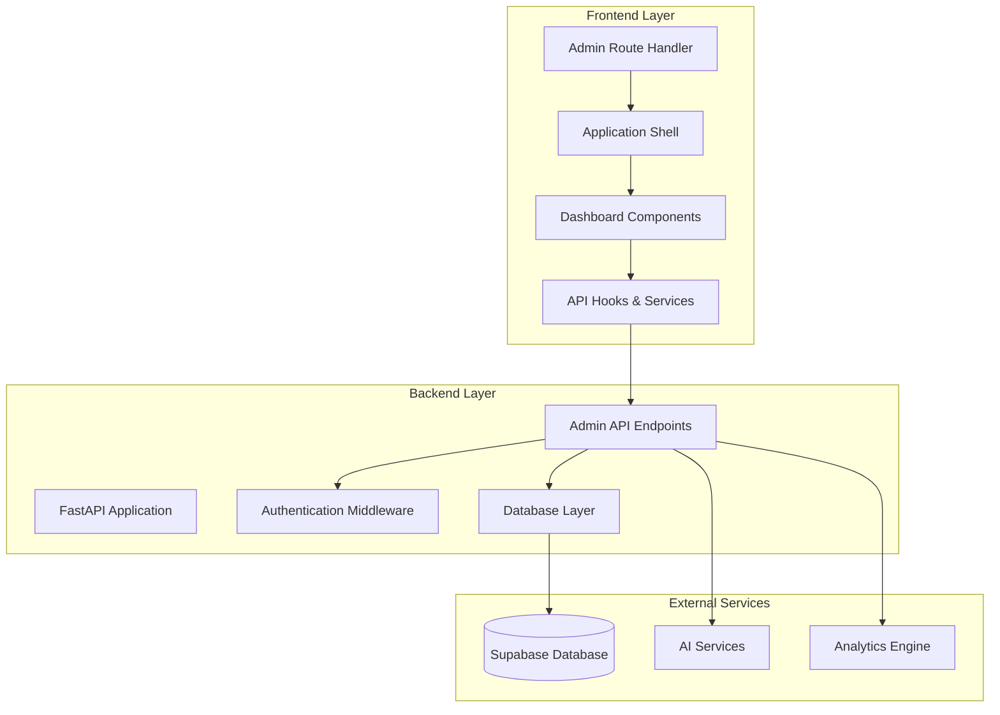
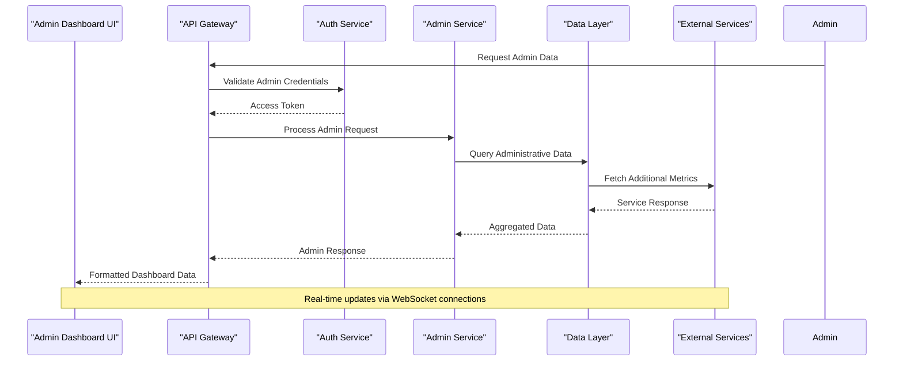
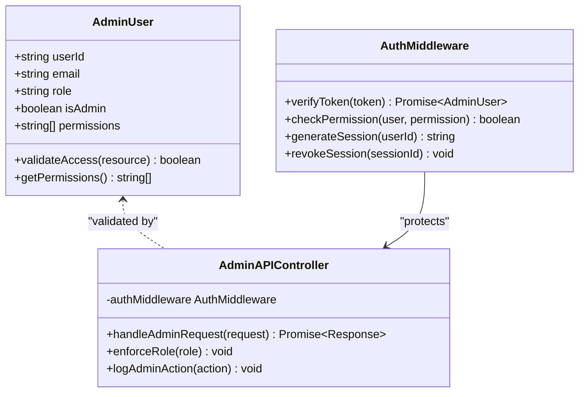
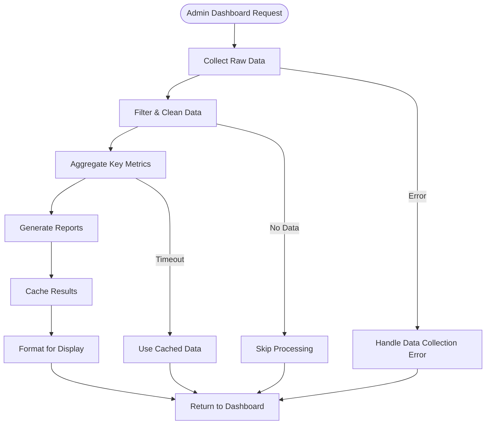
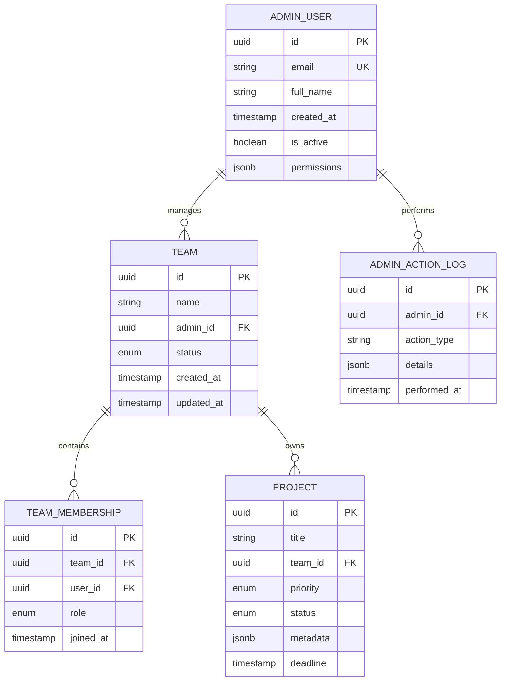
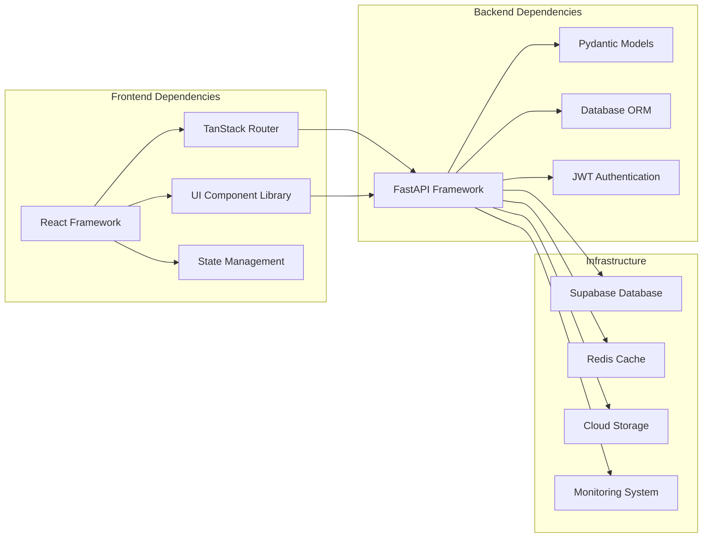

# Administrative Dashboard

<cite>
**Referenced Files in This Document**
- [README.md](file://README.md)
- [backend/main.py](file://backend/main.py)
- [src/routes/admin/index.tsx](file://src/routes/admin/index.tsx)
- [src/router.tsx](file://src/router.tsx)
- [package.json](file://package.json)
- [backend/api/auth.py](file://backend/api/auth.py)
- [backend/api/analytics.py](file://backend/api/analytics.py)
- [backend/api/teams.py](file://backend/api/teams.py)
- [backend/api/projects.py](file://backend/api/projects.py)
- [backend/core/config.py](file://backend/core/config.py)
- [backend/core/database.py](file://backend/core/database.py)
- [src/lib/api.ts](file://src/lib/api.ts)
- [src/components/app-shell.tsx](file://src/components/app-shell.tsx)
</cite>

## Table of Contents
1. [Introduction](#introduction)
2. [Project Structure](#project-structure)
3. [Core Components](#core-components)
4. [Architecture Overview](#architecture-overview)
5. [Detailed Component Analysis](#detailed-component-analysis)
6. [Dependency Analysis](#dependency-analysis)
7. [Performance Considerations](#performance-considerations)
8. [Troubleshooting Guide](#troubleshooting-guide)
9. [Conclusion](#conclusion)

## Introduction

The Administrative Dashboard is a comprehensive management interface within the Horux platform that provides administrators with powerful tools to monitor, manage, and analyze the entire ecosystem. This dashboard serves as the central control panel for overseeing teams, projects, analytics, user management, and system performance metrics.

The administrative functionality spans both backend API endpoints and frontend components, creating a seamless experience for platform administrators to manage all aspects of the application. The dashboard integrates with various AI services, real-time collaboration features, and comprehensive analytics systems to provide actionable insights and operational controls.

## Project Structure

The Administrative Dashboard follows a modular architecture with clear separation between frontend and backend concerns:

**Diagram sources**
- [src/router.tsx](file://src/router.tsx)
- [backend/main.py](file://backend/main.py)
- [src/components/app-shell.tsx](file://src/components/app-shell.tsx)

**Section sources**
- [README.md](file://README.md)
- [package.json](file://package.json)

## Core Components

### Frontend Administrative Interface

The frontend administrative dashboard is built using React with TanStack Router for navigation and modern UI components. Key features include:

- **Real-time Analytics**: Live monitoring of platform metrics and user activity
- **Team Management**: Comprehensive oversight of team structures and member roles
- **Project Administration**: Monitoring and managing all active projects
- **User Management**: Administrative controls over user accounts and permissions
- **System Health Monitoring**: Performance metrics and system status indicators

### Backend Administrative APIs

The backend provides robust RESTful APIs specifically designed for administrative operations:

- **Authentication & Authorization**: Role-based access control for administrative functions
- **Data Aggregation**: Complex queries for generating administrative reports
- **Audit Logging**: Comprehensive tracking of administrative actions
- **Configuration Management**: Dynamic system configuration capabilities
- **Bulk Operations**: Efficient batch processing for large-scale administrative tasks

**Section sources**
- [src/routes/admin/index.tsx](file://src/routes/admin/index.tsx)
- [backend/api/auth.py](file://backend/api/auth.py)
- [backend/api/analytics.py](file://backend/api/analytics.py)

## Architecture Overview

The Administrative Dashboard follows a microservices-inspired architecture with clear separation of concerns:

**Diagram sources**
- [backend/main.py](file://backend/main.py)
- [backend/api/auth.py](file://backend/api/auth.py)
- [src/lib/api.ts](file://src/lib/api.ts)

## Detailed Component Analysis

### Authentication & Authorization System

The administrative dashboard implements a sophisticated authentication and authorization system that ensures only authorized personnel can access sensitive administrative functions.

**Diagram sources**
- [backend/api/auth.py](file://backend/api/auth.py)
- [backend/core/config.py](file://backend/core/config.py)

### Analytics & Reporting Engine

The analytics engine processes vast amounts of data to generate comprehensive administrative reports and real-time dashboards.

**Diagram sources**
- [backend/api/analytics.py](file://backend/api/analytics.py)
- [backend/services/benchmark_service.py](file://backend/services/benchmark_service.py)

### Team & Project Management

Administrative oversight of teams and projects includes comprehensive CRUD operations, membership management, and performance monitoring.

**Diagram sources**
- [backend/models/schemas.py](file://backend/models/schemas.py)
- [backend/api/teams.py](file://backend/api/teams.py)
- [backend/api/projects.py](file://backend/api/projects.py)

**Section sources**
- [backend/api/auth.py](file://backend/api/auth.py)
- [backend/api/analytics.py](file://backend/api/analytics.py)
- [backend/api/teams.py](file://backend/api/teams.py)
- [backend/api/projects.py](file://backend/api/projects.py)

## Dependency Analysis

The administrative dashboard has well-defined dependencies that ensure maintainability and scalability:

**Diagram sources**
- [package.json](file://package.json)
- [backend/requirements.txt](file://backend/requirements.txt)

**Section sources**
- [package.json](file://package.json)
- [backend/requirements.txt](file://backend/requirements.txt)

## Performance Considerations

The administrative dashboard is optimized for handling large datasets and providing real-time updates:

### Caching Strategy
- **Multi-level caching**: Browser cache, CDN cache, server-side cache, and database query cache
- **Intelligent invalidation**: Event-driven cache invalidation for real-time accuracy
- **Lazy loading**: Progressive loading of dashboard sections based on user interaction

### Database Optimization
- **Query optimization**: Complex aggregations with proper indexing strategies
- **Connection pooling**: Efficient database connection management
- **Read replicas**: Separation of read and write operations for better scalability

### Frontend Performance
- **Code splitting**: Modular loading of administrative features
- **Virtual scrolling**: Efficient rendering of large datasets
- **Debounced search**: Optimized search and filtering operations

## Troubleshooting Guide

### Common Administrative Issues

#### Authentication Problems
- **Symptoms**: Admin users unable to access dashboard or specific features
- **Resolution**: Verify JWT token validity, check role assignments, review audit logs
- **Prevention**: Implement token refresh mechanisms and session validation

#### Performance Degradation
- **Symptoms**: Slow dashboard loading, delayed report generation
- **Resolution**: Monitor database query performance, optimize caching strategies, scale infrastructure
- **Prevention**: Regular performance audits and capacity planning

#### Data Consistency Issues
- **Symptoms**: Inconsistent metrics across different dashboard views
- **Resolution**: Check data pipeline integrity, verify aggregation logic, validate cache synchronization
- **Prevention**: Implement data validation checks and consistency monitoring

### Debugging Tools

#### Backend Debugging
- **Structured logging**: JSON-formatted logs with correlation IDs
- **Performance profiling**: Built-in request timing and resource usage tracking
- **Error tracking**: Centralized error collection and analysis

#### Frontend Debugging
- **Network inspection**: API call monitoring and response analysis
- **Component debugging**: React DevTools integration for state inspection
- **Performance profiling**: Frontend performance metrics and bundle analysis

**Section sources**
- [backend/core/logging.py](file://backend/core/logging.py)
- [backend/core/errors.py](file://backend/core/errors.py)
- [src/lib/error-capture.ts](file://src/lib/error-capture.ts)

## Conclusion

The Administrative Dashboard represents a comprehensive solution for platform management, combining advanced analytics, real-time monitoring, and intuitive administration interfaces. The system's modular architecture ensures scalability and maintainability while providing powerful tools for platform administrators.

Key strengths of the implementation include:

- **Robust Security**: Multi-layered authentication and authorization with comprehensive audit trails
- **Scalable Architecture**: Microservices-inspired design supporting horizontal scaling
- **Rich Analytics**: Advanced data processing and visualization capabilities
- **Real-time Features**: Live updates and monitoring for immediate operational awareness
- **Comprehensive Coverage**: Complete administrative coverage from user management to system health monitoring

The dashboard successfully balances complexity with usability, providing powerful administrative capabilities through an intuitive interface that scales with organizational needs.