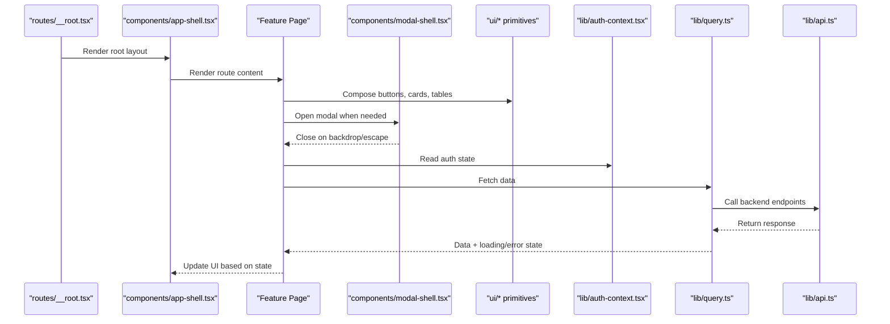
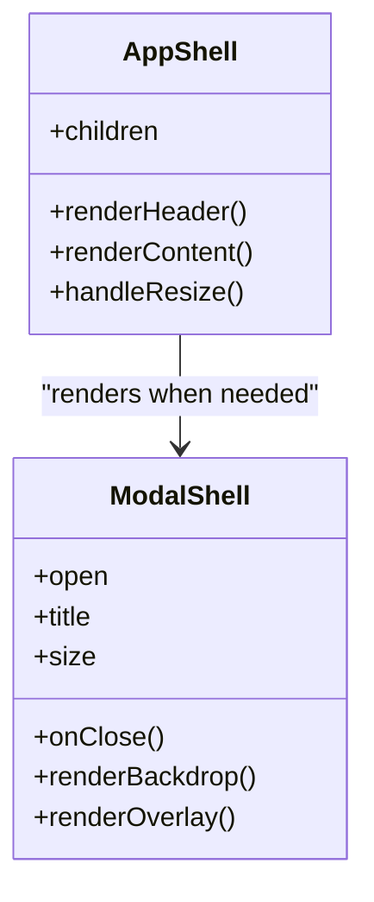
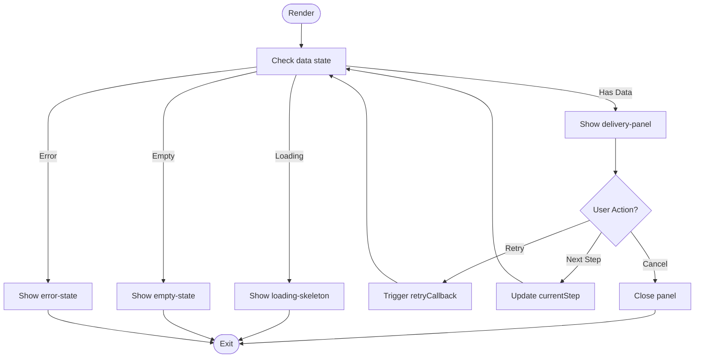
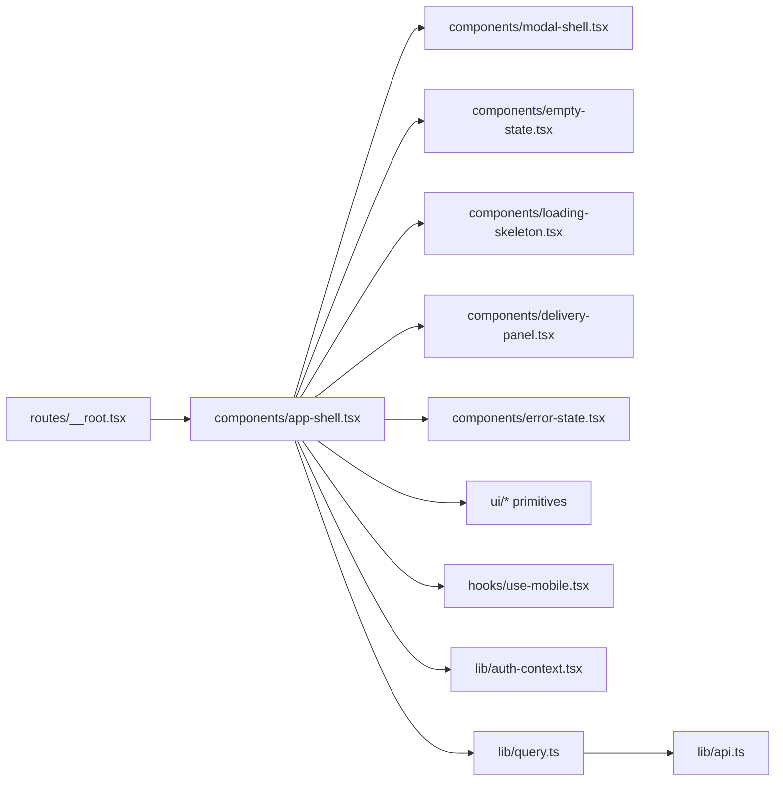

# Component Architecture

<cite>
**Referenced Files in This Document**
- [app-shell.tsx](file://src/components/app-shell.tsx)
- [modal-shell.tsx](file://src/components/modal-shell.tsx)
- [empty-state.tsx](file://src/components/empty-state.tsx)
- [loading-skeleton.tsx](file://src/components/loading-skeleton.tsx)
- [delivery-panel.tsx](file://src/components/delivery-panel.tsx)
- [error-state.tsx](file://src/components/error-state.tsx)
- [button.tsx](file://src/components/ui/button.tsx)
- [card.tsx](file://src/components/ui/card.tsx)
- [dialog.tsx](file://src/components/ui/dialog.tsx)
- [skeleton.tsx](file://src/components/ui/skeleton.tsx)
- [tabs.tsx](file://src/components/ui/tabs.tsx)
- [table.tsx](file://src/components/ui/table.tsx)
- [input.tsx](file://src/components/ui/input.tsx)
- [label.tsx](file://src/components/ui/label.tsx)
- [form.tsx](file://src/components/ui/form.tsx)
- [use-mobile.tsx](file://src/hooks/use-mobile.tsx)
- [auth-context.tsx](file://src/lib/auth-context.tsx)
- [query.ts](file://src/lib/query.ts)
- [api.ts](file://src/lib/api.ts)
- [__root.tsx](file://src/routes/__root.tsx)
</cite>

## Table of Contents
1. [Introduction](#introduction)
2. [Project Structure](#project-structure)
3. [Core Components](#core-components)
4. [Architecture Overview](#architecture-overview)
5. [Detailed Component Analysis](#detailed-component-analysis)
6. [Dependency Analysis](#dependency-analysis)
7. [Performance Considerations](#performance-considerations)
8. [Troubleshooting Guide](#troubleshooting-guide)
9. [Conclusion](#conclusion)
10. [Appendices](#appendices)

## Introduction
This document explains the Horux React component architecture with a focus on:
- Shell components that provide layout and shared behavior (app-shell, modal-shell)
- Reusable UI primitives and patterns (empty states, loading skeletons, delivery panels)
- Composition strategies, prop interfaces, and event handling
- Guidelines for creating new components using TypeScript and Tailwind CSS
- Testing strategies and performance optimization techniques

The goal is to help developers understand how components are organized, how they compose together, and how to extend the system consistently.

## Project Structure
At a high level, the frontend organizes code by feature and layer:
- src/components: Feature and shell components, plus shared UI primitives under ui/
- src/hooks: Shared hooks (e.g., responsive utilities)
- src/lib: Utilities, contexts, data fetching, and cross-cutting concerns
- src/routes: Route-based pages and layouts

```mermaid
graph TB
subgraph "Routes"
RRoot["routes/__root.tsx"]
end
subgraph "Shell Components"
AppShell["components/app-shell.tsx"]
ModalShell["components/modal-shell.tsx"]
end
subgraph "Reusable UI Primitives"
EmptyState["components/empty-state.tsx"]
LoadingSkeleton["components/loading-skeleton.tsx"]
DeliveryPanel["components/delivery-panel.tsx"]
ErrorState["components/error-state.tsx"]
end
subgraph "UI Primitives (ui/)"
Button["ui/button.tsx"]
Card["ui/card.tsx"]
Dialog["ui/dialog.tsx"]
Skeleton["ui/skeleton.tsx"]
Tabs["ui/tabs.tsx"]
Table["ui/table.tsx"]
Input["ui/input.tsx"]
Label["ui/label.tsx"]
Form["ui/form.tsx"]
end
subgraph "Shared"
UseMobile["hooks/use-mobile.tsx"]
AuthCtx["lib/auth-context.tsx"]
QueryLib["lib/query.ts"]
ApiLib["lib/api.ts"]
end
RRoot --> AppShell
AppShell --> ModalShell
AppShell --> EmptyState
AppShell --> LoadingSkeleton
AppShell --> DeliveryPanel
AppShell --> ErrorState
AppShell --> Button
AppShell --> Card
AppShell --> Dialog
AppShell --> Skeleton
AppShell --> Tabs
AppShell --> Table
AppShell --> Input
AppShell --> Label
AppShell --> Form
AppShell --> UseMobile
AppShell --> AuthCtx
AppShell --> QueryLib
AppShell --> ApiLib
```

**Diagram sources**
- [__root.tsx](file://src/routes/__root.tsx)
- [app-shell.tsx](file://src/components/app-shell.tsx)
- [modal-shell.tsx](file://src/components/modal-shell.tsx)
- [empty-state.tsx](file://src/components/empty-state.tsx)
- [loading-skeleton.tsx](file://src/components/loading-skeleton.tsx)
- [delivery-panel.tsx](file://src/components/delivery-panel.tsx)
- [error-state.tsx](file://src/components/error-state.tsx)
- [button.tsx](file://src/components/ui/button.tsx)
- [card.tsx](file://src/components/ui/card.tsx)
- [dialog.tsx](file://src/components/ui/dialog.tsx)
- [skeleton.tsx](file://src/components/ui/skeleton.tsx)
- [tabs.tsx](file://src/components/ui/tabs.tsx)
- [table.tsx](file://src/components/ui/table.tsx)
- [input.tsx](file://src/components/ui/input.tsx)
- [label.tsx](file://src/components/ui/label.tsx)
- [form.tsx](file://src/components/ui/form.tsx)
- [use-mobile.tsx](file://src/hooks/use-mobile.tsx)
- [auth-context.tsx](file://src/lib/auth-context.tsx)
- [query.ts](file://src/lib/query.ts)
- [api.ts](file://src/lib/api.ts)

**Section sources**
- [__root.tsx](file://src/routes/__root.tsx)
- [app-shell.tsx](file://src/components/app-shell.tsx)
- [modal-shell.tsx](file://src/components/modal-shell.tsx)
- [empty-state.tsx](file://src/components/empty-state.tsx)
- [loading-skeleton.tsx](file://src/components/loading-skeleton.tsx)
- [delivery-panel.tsx](file://src/components/delivery-panel.tsx)
- [error-state.tsx](file://src/components/error-state.tsx)
- [button.tsx](file://src/components/ui/button.tsx)
- [card.tsx](file://src/components/ui/card.tsx)
- [dialog.tsx](file://src/components/ui/dialog.tsx)
- [skeleton.tsx](file://src/components/ui/skeleton.tsx)
- [tabs.tsx](file://src/components/ui/tabs.tsx)
- [table.tsx](file://src/components/ui/table.tsx)
- [input.tsx](file://src/components/ui/input.tsx)
- [label.tsx](file://src/components/ui/label.tsx)
- [form.tsx](file://src/components/ui/form.tsx)
- [use-mobile.tsx](file://src/hooks/use-mobile.tsx)
- [auth-context.tsx](file://src/lib/auth-context.tsx)
- [query.ts](file://src/lib/query.ts)
- [api.ts](file://src/lib/api.ts)

## Core Components
This section summarizes the responsibilities and typical usage patterns of key components.

- app-shell
  - Purpose: Top-level layout container providing consistent chrome (header, navigation, content area).
  - Responsibilities: Global layout structure, theme integration, routing outlet, and composition of other shells or page content.
  - Typical props: children, optional header/footer toggles, mobile drawer state.
  - Event handling: Delegates user interactions to child components; may expose global actions via context.

- modal-shell
  - Purpose: Encapsulates modal dialog behavior and layout.
  - Responsibilities: Focus management, backdrop click-to-close, keyboard escape, and accessible overlay.
  - Typical props: open, onClose, title, children, size variants.
  - Event handling: Controlled open/close via props; forwards events to inner content.

- empty-state
  - Purpose: Communicates when there is no data to display.
  - Responsibilities: Illustrative icon/message, call-to-action button, and optional secondary action.
  - Typical props: title, description, primaryAction, secondaryAction.
  - Event handling: Emits callbacks for actions.

- loading-skeleton
  - Purpose: Provides placeholder visuals during data loading.
  - Responsibilities: Renders skeleton shapes aligned with expected content blocks.
  - Typical props: variant (text, card, table), count, animate.
  - Event handling: None; purely presentational.

- delivery-panel
  - Purpose: Presents structured delivery information (e.g., steps, status, metadata).
  - Responsibilities: Aggregates sections like progress, details, and actions.
  - Typical props: steps, currentStep, actions, status.
  - Event handling: Emits step changes and action callbacks.

- error-state
  - Purpose: Displays recoverable errors with retry options.
  - Responsibilities: Error message, suggested actions, and optional diagnostics link.
  - Typical props: message, retryCallback, details.
  - Event handling: Emits retry and diagnostic actions.

- UI primitives (ui/*)
  - Provide accessible, composable building blocks styled with Tailwind CSS.
  - Examples include button, card, dialog, skeleton, tabs, table, input, label, form.
  - These components standardize styling, accessibility, and interaction patterns across the app.

**Section sources**
- [app-shell.tsx](file://src/components/app-shell.tsx)
- [modal-shell.tsx](file://src/components/modal-shell.tsx)
- [empty-state.tsx](file://src/components/empty-state.tsx)
- [loading-skeleton.tsx](file://src/components/loading-skeleton.tsx)
- [delivery-panel.tsx](file://src/components/delivery-panel.tsx)
- [error-state.tsx](file://src/components/error-state.tsx)
- [button.tsx](file://src/components/ui/button.tsx)
- [card.tsx](file://src/components/ui/card.tsx)
- [dialog.tsx](file://src/components/ui/dialog.tsx)
- [skeleton.tsx](file://src/components/ui/skeleton.tsx)
- [tabs.tsx](file://src/components/ui/tabs.tsx)
- [table.tsx](file://src/components/ui/table.tsx)
- [input.tsx](file://src/components/ui/input.tsx)
- [label.tsx](file://src/components/ui/label.tsx)
- [form.tsx](file://src/components/ui/form.tsx)

## Architecture Overview
The application follows a layered approach:
- Routes render into a root layout that wraps the app-shell.
- The app-shell provides global layout and delegates to feature pages or modal-shells.
- Feature pages compose reusable UI primitives and domain-specific components.
- Shared libraries provide authentication context, data fetching, and API clients.

**Diagram sources**
- [__root.tsx](file://src/routes/__root.tsx)
- [app-shell.tsx](file://src/components/app-shell.tsx)
- [modal-shell.tsx](file://src/components/modal-shell.tsx)
- [auth-context.tsx](file://src/lib/auth-context.tsx)
- [query.ts](file://src/lib/query.ts)
- [api.ts](file://src/lib/api.ts)

## Detailed Component Analysis

### Shell Components
- app-shell
  - Layout strategy: Uses a fixed header/sidebar and scrollable main region. Integrates with responsive breakpoints via use-mobile.
  - Composition: Wraps route outlets and conditionally renders modals or drawers.
  - Styling: Applies consistent spacing and typography through Tailwind utility classes.
  - Accessibility: Ensures proper roles and aria attributes for landmarks.

- modal-shell
  - Behavior: Manages open state, focus trapping, and backdrop dismissal.
  - Composition: Accepts a title and arbitrary children; supports size variants.
  - Events: Forwards close events upward; emits internal events for actions within the modal.

**Diagram sources**
- [app-shell.tsx](file://src/components/app-shell.tsx)
- [modal-shell.tsx](file://src/components/modal-shell.tsx)

**Section sources**
- [app-shell.tsx](file://src/components/app-shell.tsx)
- [modal-shell.tsx](file://src/components/modal-shell.tsx)
- [use-mobile.tsx](file://src/hooks/use-mobile.tsx)

### Reusable UI Components
- empty-state
  - Props: title, description, primaryAction, secondaryAction.
  - Usage: Show when collections are empty or after successful deletion.
  - Styling: Centered layout with clear hierarchy and prominent action.

- loading-skeleton
  - Props: variant, count, animate.
  - Usage: Replace heavy content while queries load.
  - Performance: Lightweight SVG/CSS placeholders; avoid reflows by stable dimensions.

- delivery-panel
  - Props: steps, currentStep, actions, status.
  - Usage: Step-by-step flows with progress indicators and contextual actions.
  - Events: Emits step change and action callbacks.

- error-state
  - Props: message, retryCallback, details.
  - Usage: Display actionable errors with retry and diagnostics.

**Diagram sources**
- [empty-state.tsx](file://src/components/empty-state.tsx)
- [loading-skeleton.tsx](file://src/components/loading-skeleton.tsx)
- [delivery-panel.tsx](file://src/components/delivery-panel.tsx)
- [error-state.tsx](file://src/components/error-state.tsx)

**Section sources**
- [empty-state.tsx](file://src/components/empty-state.tsx)
- [loading-skeleton.tsx](file://src/components/loading-skeleton.tsx)
- [delivery-panel.tsx](file://src/components/delivery-panel.tsx)
- [error-state.tsx](file://src/components/error-state.tsx)

### UI Primitives (ui/*)
- button
  - Variants: primary, secondary, ghost, destructive.
  - States: disabled, loading.
  - Accessibility: Keyboard support, focus styles.

- card
  - Purpose: Content container with padding and subtle elevation.
  - Composition: Header, body, footer slots via children.

- dialog
  - Purpose: Accessible modal wrapper used by modal-shell.
  - Features: Backdrop, focus trap, escape to close.

- skeleton
  - Purpose: Low-level placeholder shape for text, avatar, etc.

- tabs
  - Purpose: Tabbed navigation with keyboard support.

- table
  - Purpose: Structured data presentation with headers and rows.

- input, label, form
  - Purpose: Form controls with labels and validation hooks.

These primitives are composed by higher-level components to maintain consistent look-and-feel and behavior.

**Section sources**
- [button.tsx](file://src/components/ui/button.tsx)
- [card.tsx](file://src/components/ui/card.tsx)
- [dialog.tsx](file://src/components/ui/dialog.tsx)
- [skeleton.tsx](file://src/components/ui/skeleton.tsx)
- [tabs.tsx](file://src/components/ui/tabs.tsx)
- [table.tsx](file://src/components/ui/table.tsx)
- [input.tsx](file://src/components/ui/input.tsx)
- [label.tsx](file://src/components/ui/label.tsx)
- [form.tsx](file://src/components/ui/form.tsx)

## Dependency Analysis
High-level dependencies among core modules:

**Diagram sources**
- [__root.tsx](file://src/routes/__root.tsx)
- [app-shell.tsx](file://src/components/app-shell.tsx)
- [modal-shell.tsx](file://src/components/modal-shell.tsx)
- [empty-state.tsx](file://src/components/empty-state.tsx)
- [loading-skeleton.tsx](file://src/components/loading-skeleton.tsx)
- [delivery-panel.tsx](file://src/components/delivery-panel.tsx)
- [error-state.tsx](file://src/components/error-state.tsx)
- [use-mobile.tsx](file://src/hooks/use-mobile.tsx)
- [auth-context.tsx](file://src/lib/auth-context.tsx)
- [query.ts](file://src/lib/query.ts)
- [api.ts](file://src/lib/api.ts)

**Section sources**
- [__root.tsx](file://src/routes/__root.tsx)
- [app-shell.tsx](file://src/components/app-shell.tsx)
- [modal-shell.tsx](file://src/components/modal-shell.tsx)
- [empty-state.tsx](file://src/components/empty-state.tsx)
- [loading-skeleton.tsx](file://src/components/loading-skeleton.tsx)
- [delivery-panel.tsx](file://src/components/delivery-panel.tsx)
- [error-state.tsx](file://src/components/error-state.tsx)
- [use-mobile.tsx](file://src/hooks/use-mobile.tsx)
- [auth-context.tsx](file://src/lib/auth-context.tsx)
- [query.ts](file://src/lib/query.ts)
- [api.ts](file://src/lib/api.ts)

## Performance Considerations
- Prefer memoization for expensive computations and large lists.
- Use lazy loading for heavy routes and modals.
- Keep skeletons lightweight and dimension-stable to avoid layout thrash.
- Debounce or throttle frequent events (e.g., resize, search input).
- Leverage query caching and pagination to reduce network overhead.
- Avoid unnecessary re-renders by splitting components and stabilizing props.

[No sources needed since this section provides general guidance]

## Troubleshooting Guide
Common issues and resolutions:
- Modal not closing on escape/backdrop
  - Ensure modal-shell handles keyboard and backdrop events and forwards onClose.
- Empty state shown unexpectedly
  - Verify data loading state transitions and null checks before rendering empty-state.
- Skeleton flicker
  - Stabilize sizes and avoid conditional reflows; ensure loading state is set before mount.
- Form inputs uncontrolled
  - Bind value and onChange consistently; use form primitives from ui/form.

**Section sources**
- [modal-shell.tsx](file://src/components/modal-shell.tsx)
- [empty-state.tsx](file://src/components/empty-state.tsx)
- [loading-skeleton.tsx](file://src/components/loading-skeleton.tsx)
- [form.tsx](file://src/components/ui/form.tsx)

## Conclusion
Horux’s component architecture centers around a small set of shell components that orchestrate layout and modality, combined with a rich library of reusable UI primitives. Domain-specific components like delivery-panel compose these primitives to deliver consistent experiences. By following the composition patterns, TypeScript interfaces, and Tailwind styling guidelines outlined here, teams can extend the system predictably and maintain high quality.

[No sources needed since this section summarizes without analyzing specific files]

## Appendices

### Creating New Components: Guidelines
- File organization
  - Place feature-specific components under src/components/<feature>.
  - Place shared UI primitives under src/components/ui.
- Prop interfaces
  - Define explicit TypeScript interfaces for all props.
  - Default values should be documented and type-safe.
- Composition
  - Favor small, focused components; compose larger ones from smaller ones.
  - Use children and slot-like props to keep components flexible.
- Styling
  - Use Tailwind utility classes consistently.
  - Extract common style patterns into reusable wrappers when appropriate.
- Accessibility
  - Ensure semantic HTML, keyboard navigation, and ARIA attributes where needed.
- State and events
  - Prefer controlled props for open/close and form state.
  - Emit typed callbacks for side effects (e.g., onSave, onDelete).
- Data flow
  - Keep data fetching in lib/query and pass derived state down as props.
  - Use contexts sparingly; prefer prop drilling for local state.

[No sources needed since this section provides general guidance]

### Testing Strategies
- Unit tests
  - Test component rendering with different props and edge cases.
  - Mock external dependencies (context, API) to isolate behavior.
- Interaction tests
  - Simulate user actions (clicks, keyboard) and assert outcomes.
- Snapshot tests
  - Use sparingly; prefer assertions over snapshots for critical paths.
- Integration tests
  - Validate workflows spanning multiple components (e.g., form submission).

[No sources needed since this section provides general guidance]