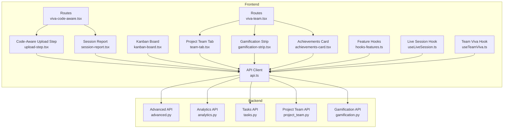
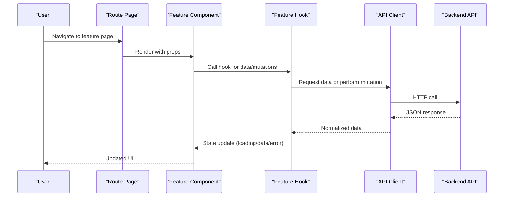
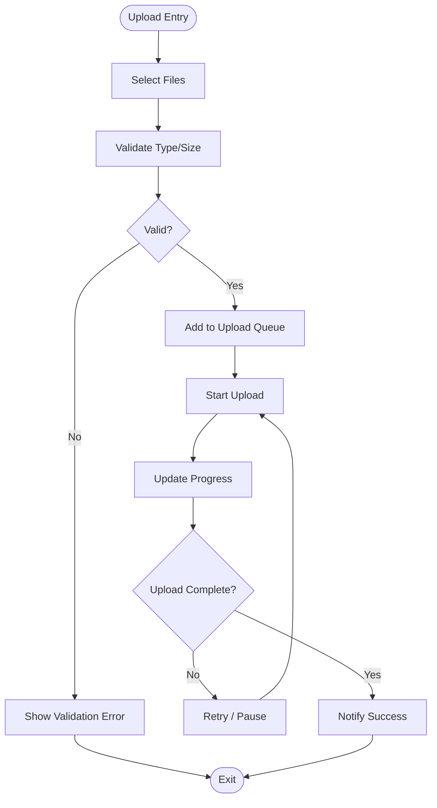
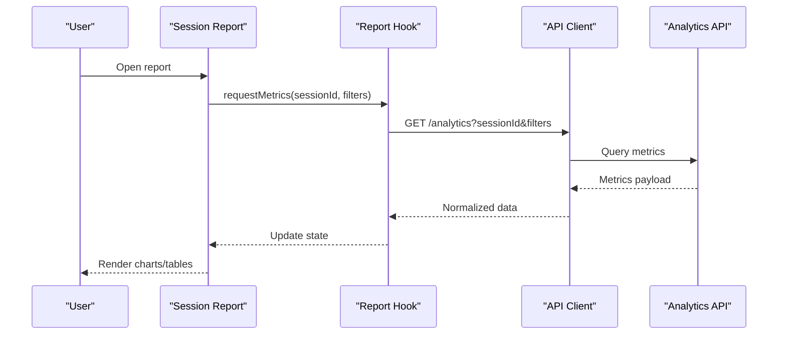
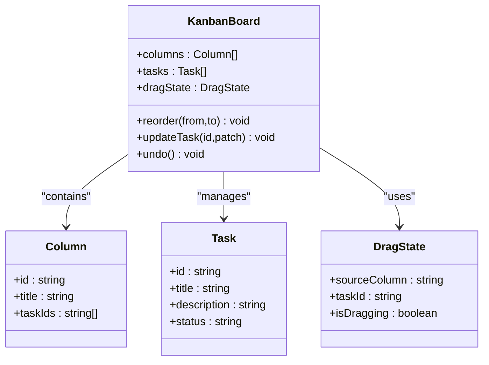
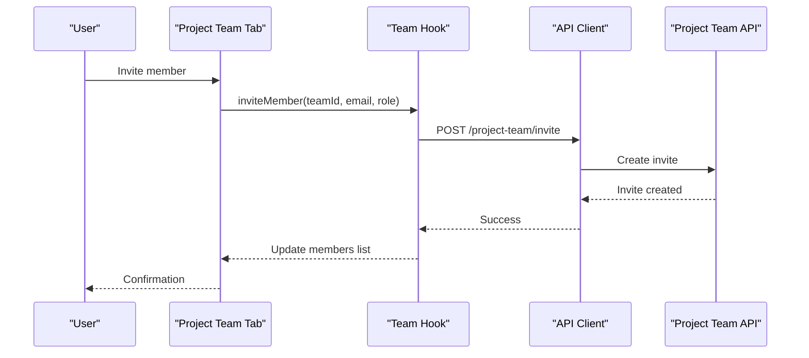
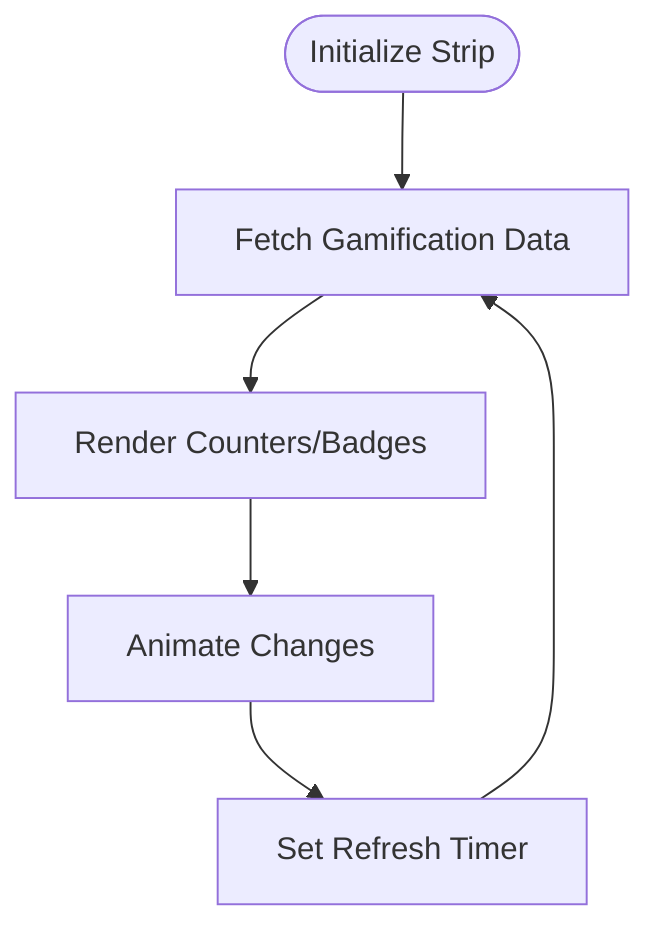
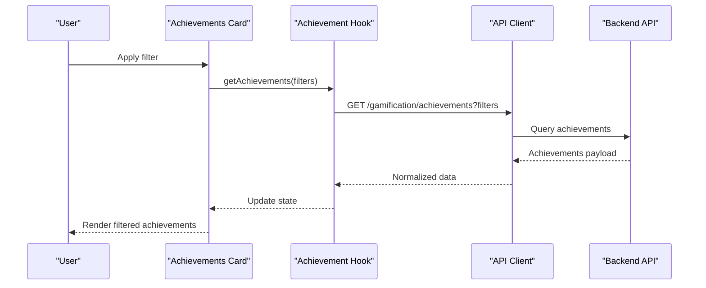
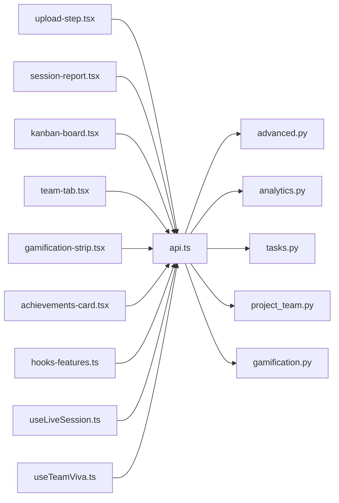

# Feature Components

<cite>
**Referenced Files in This Document**
- [upload-step.tsx](file://src/components/code-aware/upload-step.tsx)
- [session-report.tsx](file://src/components/reports/session-report.tsx)
- [kanban-board.tsx](file://src/components/tasks/kanban-board.tsx)
- [team-tab.tsx](file://src/components/projects/team-tab.tsx)
- [gamification-strip.tsx](file://src/components/gamification-strip.tsx)
- [achievements-card.tsx](file://src/components/achievements-card.tsx)
- [api.ts](file://src/lib/api.ts)
- [hooks-features.ts](file://src/lib/hooks-features.ts)
- [useLiveSession.ts](file://src/lib/useLiveSession.ts)
- [useTeamViva.ts](file://src/lib/useTeamViva.ts)
- [advanced.py](file://backend/api/advanced.py)
- [analytics.py](file://backend/api/analytics.py)
- [tasks.py](file://backend/api/tasks.py)
- [project_team.py](file://backend/api/project_team.py)
- [gamification.py](file://backend/api/gamification.py)
- [viva_code_aware.tsx](file://src/routes/advanced/viva-code-aware.tsx)
- [viva-team.tsx](file://src/routes/advanced/viva-team.tsx)
</cite>

## Table of Contents
1. [Introduction](#introduction)
2. [Project Structure](#project-structure)
3. [Core Components](#core-components)
4. [Architecture Overview](#architecture-overview)
5. [Detailed Component Analysis](#detailed-component-analysis)
6. [Dependency Analysis](#dependency-analysis)
7. [Performance Considerations](#performance-considerations)
8. [Accessibility and Responsive Design](#accessibility-and-responsive-design)
9. [Testing Strategies](#testing-strategies)
10. [Troubleshooting Guide](#troubleshooting-guide)
11. [Conclusion](#conclusion)

## Introduction
This document provides comprehensive documentation for Horux feature-specific components that implement core application functionality. It focuses on:
- Code-aware upload step for programming education features
- Session report generation for analytics
- Kanban board for task management
- Project team tab for collaboration
- Gamification strip for engagement tracking
- Achievements card for progress visualization

It explains component interactions with backend APIs, state management patterns, user interaction flows, data binding examples, error handling strategies, performance optimizations, accessibility considerations, responsive design patterns, and testing approaches for complex interactive components.

## Project Structure
The feature components are organized under src/components by domain (code-aware, reports, tasks, projects), with shared UI primitives under src/components/ui. Routes orchestrate feature pages and compose these components. Backend APIs are implemented under backend/api and provide REST endpoints consumed by the frontend via src/lib/api.ts and feature hooks.

**Diagram sources**
- [viva_code_aware.tsx](file://src/routes/advanced/viva-code-aware.tsx)
- [viva-team.tsx](file://src/routes/advanced/viva-team.tsx)
- [upload-step.tsx](file://src/components/code-aware/upload-step.tsx)
- [session-report.tsx](file://src/components/reports/session-report.tsx)
- [kanban-board.tsx](file://src/components/tasks/kanban-board.tsx)
- [team-tab.tsx](file://src/components/projects/team-tab.tsx)
- [gamification-strip.tsx](file://src/components/gamification-strip.tsx)
- [achievements-card.tsx](file://src/components/achievements-card.tsx)
- [api.ts](file://src/lib/api.ts)
- [hooks-features.ts](file://src/lib/hooks-features.ts)
- [useLiveSession.ts](file://src/lib/useLiveSession.ts)
- [useTeamViva.ts](file://src/lib/useTeamViva.ts)
- [advanced.py](file://backend/api/advanced.py)
- [analytics.py](file://backend/api/analytics.py)
- [tasks.py](file://backend/api/tasks.py)
- [project_team.py](file://backend/api/project_team.py)
- [gamification.py](file://backend/api/gamification.py)

**Section sources**
- [viva_code_aware.tsx](file://src/routes/advanced/viva-code-aware.tsx)
- [viva-team.tsx](file://src/routes/advanced/viva-team.tsx)
- [api.ts](file://src/lib/api.ts)
- [hooks-features.ts](file://src/lib/hooks-features.ts)
- [useLiveSession.ts](file://src/lib/useLiveSession.ts)
- [useTeamViva.ts](file://src/lib/useTeamViva.ts)
- [advanced.py](file://backend/api/advanced.py)
- [analytics.py](file://backend/api/analytics.py)
- [tasks.py](file://backend/api/tasks.py)
- [project_team.py](file://backend/api/project_team.py)
- [gamification.py](file://backend/api/gamification.py)

## Core Components
This section summarizes each feature component’s purpose, responsibilities, and key behaviors.

- Code-Aware Upload Step
  - Purpose: Enables learners to upload code artifacts relevant to a session or exercise.
  - Responsibilities: File selection/validation, progress indication, error feedback, integration with code-aware backend services.
  - State: Local file list, upload status, errors.
  - Data Binding: Controlled inputs for metadata; event-driven updates for progress and results.
  - Error Handling: Validation messages, retry logic, network failure notifications.
  - Performance: Chunked uploads, debounced validation, cancellation support.

- Session Report
  - Purpose: Generates and displays analytics for a live session.
  - Responsibilities: Fetching metrics, rendering charts/tables, exporting options.
  - State: Cached report data, loading/error states.
  - Data Binding: Props for session ID and filters; reactive updates on refetch.
  - Error Handling: Graceful fallbacks when metrics unavailable.
  - Performance: Memoization of derived data, pagination/lazy load for large datasets.

- Kanban Board
  - Purpose: Visual task management with drag-and-drop reordering.
  - Responsibilities: Column/task CRUD, reorder operations, optimistic updates, conflict resolution.
  - State: Columns, tasks, drag state, undo history.
  - Data Binding: Two-way binding for task fields; controlled drag events.
  - Error Handling: Rollback on failed mutations, conflict prompts.
  - Performance: Virtualized lists for large boards, batched updates.

- Project Team Tab
  - Purpose: Collaboration view for project members and roles.
  - Responsibilities: Member listing, role assignment, invites, permissions.
  - State: Members list, invite form, loading/error flags.
  - Data Binding: Form controls bound to member attributes; real-time sync where applicable.
  - Error Handling: Duplicate member detection, permission errors.
  - Performance: Pagination, selective field fetching.

- Gamification Strip
  - Purpose: Displays engagement metrics such as streaks, points, badges.
  - Responsibilities: Fetching gamification data, updating counters, animations.
  - State: Points, streaks, badge inventory, refresh timers.
  - Data Binding: Reactive props from hooks; animated transitions on changes.
  - Error Handling: Silent fallbacks if service unavailable.
  - Performance: Debounced refresh, lightweight animations.

- Achievements Card
  - Purpose: Progress visualization for achievements and milestones.
  - Responsibilities: Rendering achievement cards, filtering, progress bars.
  - State: Achievement list, filter criteria, selected item.
  - Data Binding: Controlled filters; computed progress percentages.
  - Error Handling: Empty states and retry actions.
  - Performance: Memoized computations, lazy rendering of off-screen items.

**Section sources**
- [upload-step.tsx](file://src/components/code-aware/upload-step.tsx)
- [session-report.tsx](file://src/components/reports/session-report.tsx)
- [kanban-board.tsx](file://src/components/tasks/kanban-board.tsx)
- [team-tab.tsx](file://src/components/projects/team-tab.tsx)
- [gamification-strip.tsx](file://src/components/gamification-strip.tsx)
- [achievements-card.tsx](file://src/components/achievements-card.tsx)

## Architecture Overview
The feature components interact with backend APIs through a centralized client and feature-specific hooks. Routes compose components and manage high-level state. The architecture emphasizes separation of concerns: UI components remain stateless where possible, while hooks encapsulate data fetching and mutation logic.

**Diagram sources**
- [viva_code_aware.tsx](file://src/routes/advanced/viva-code-aware.tsx)
- [viva-team.tsx](file://src/routes/advanced/viva-team.tsx)
- [hooks-features.ts](file://src/lib/hooks-features.ts)
- [useLiveSession.ts](file://src/lib/useLiveSession.ts)
- [useTeamViva.ts](file://src/lib/useTeamViva.ts)
- [api.ts](file://src/lib/api.ts)
- [advanced.py](file://backend/api/advanced.py)
- [analytics.py](file://backend/api/analytics.py)
- [tasks.py](file://backend/api/tasks.py)
- [project_team.py](file://backend/api/project_team.py)
- [gamification.py](file://backend/api/gamification.py)

## Detailed Component Analysis

### Code-Aware Upload Step
- Responsibilities:
  - Accept code files, validate types/sizes, show progress, handle success/failure.
  - Integrate with code-aware backend services for analysis or storage.
- State Management:
  - Local state for file queue and per-file status.
  - Optional global context for cross-component sharing.
- Data Binding:
  - Controlled input elements for metadata (title, description).
  - Event handlers update state synchronously; async effects trigger uploads.
- Error Handling:
  - Immediate validation errors (type/size).
  - Network errors surfaced with retry buttons.
  - Partial failures handled with granular status.
- Performance:
  - Debounce validation to avoid excessive checks.
  - Cancelable uploads and chunked transfers for large files.
  - Avoid re-renders by memoizing derived values.

**Diagram sources**
- [upload-step.tsx](file://src/components/code-aware/upload-step.tsx)
- [api.ts](file://src/lib/api.ts)
- [advanced.py](file://backend/api/advanced.py)

**Section sources**
- [upload-step.tsx](file://src/components/code-aware/upload-step.tsx)
- [api.ts](file://src/lib/api.ts)
- [advanced.py](file://backend/api/advanced.py)

### Session Report
- Responsibilities:
  - Fetch session analytics, render charts/tables, allow export.
- State Management:
  - Cached data via hooks; loading/error states managed centrally.
- Data Binding:
  - Props for session ID and filters; reactive updates on refetch.
- Error Handling:
  - Fallback empty states; retry actions; graceful degradation.
- Performance:
  - Memoize chart data; paginate or virtualize large tables.
  - Use background refetch strategies to keep UI responsive.

**Diagram sources**
- [session-report.tsx](file://src/components/reports/session-report.tsx)
- [hooks-features.ts](file://src/lib/hooks-features.ts)
- [api.ts](file://src/lib/api.ts)
- [analytics.py](file://backend/api/analytics.py)

**Section sources**
- [session-report.tsx](file://src/components/reports/session-report.tsx)
- [hooks-features.ts](file://src/lib/hooks-features.ts)
- [api.ts](file://src/lib/api.ts)
- [analytics.py](file://backend/api/analytics.py)

### Kanban Board
- Responsibilities:
  - Display columns and tasks; enable drag-and-drop reordering; persist changes.
- State Management:
  - Optimistic updates for reorder; rollback on failure; undo stack.
- Data Binding:
  - Controlled drag events; two-way binding for editable fields.
- Error Handling:
  - Conflict resolution prompts; server-side validation errors surfaced inline.
- Performance:
  - Virtualized lists for large boards; batched mutations; stable keys for items.

**Diagram sources**
- [kanban-board.tsx](file://src/components/tasks/kanban-board.tsx)
- [tasks.py](file://backend/api/tasks.py)
- [api.ts](file://src/lib/api.ts)

**Section sources**
- [kanban-board.tsx](file://src/components/tasks/kanban-board.tsx)
- [tasks.py](file://backend/api/tasks.py)
- [api.ts](file://src/lib/api.ts)

### Project Team Tab
- Responsibilities:
  - List members, assign roles, send invites, enforce permissions.
- State Management:
  - Members list, invite form state, loading/error flags.
- Data Binding:
  - Form controls bound to member attributes; real-time updates where supported.
- Error Handling:
  - Duplicate member detection; permission denied messages; retry flows.
- Performance:
  - Pagination for large teams; selective field fetching.

**Diagram sources**
- [team-tab.tsx](file://src/components/projects/team-tab.tsx)
- [hooks-features.ts](file://src/lib/hooks-features.ts)
- [api.ts](file://src/lib/api.ts)
- [project_team.py](file://backend/api/project_team.py)

**Section sources**
- [team-tab.tsx](file://src/components/projects/team-tab.tsx)
- [hooks-features.ts](file://src/lib/hooks-features.ts)
- [api.ts](file://src/lib/api.ts)
- [project_team.py](file://backend/api/project_team.py)

### Gamification Strip
- Responsibilities:
  - Display points, streaks, badges; animate changes; refresh periodically.
- State Management:
  - Lightweight local state synced with backend via hooks.
- Data Binding:
  - Reactive props; animated transitions on value changes.
- Error Handling:
  - Silent fallbacks; retry on connectivity issues.
- Performance:
  - Debounced refresh; minimal re-renders using memoization.

**Diagram sources**
- [gamification-strip.tsx](file://src/components/gamification-strip.tsx)
- [hooks-features.ts](file://src/lib/hooks-features.ts)
- [api.ts](file://src/lib/api.ts)
- [gamification.py](file://backend/api/gamification.py)

**Section sources**
- [gamification-strip.tsx](file://src/components/gamification-strip.tsx)
- [hooks-features.ts](file://src/lib/hooks-features.ts)
- [api.ts](file://src/lib/api.ts)
- [gamification.py](file://backend/api/gamification.py)

### Achievements Card
- Responsibilities:
  - Visualize achievements and milestones; filter and sort; show progress.
- State Management:
  - Achievement list, active filters, selected item.
- Data Binding:
  - Controlled filters; computed progress percentages.
- Error Handling:
  - Empty states; retry actions; graceful fallbacks.
- Performance:
  - Memoized computations; lazy rendering of off-screen items.

**Diagram sources**
- [achievements-card.tsx](file://src/components/achievements-card.tsx)
- [hooks-features.ts](file://src/lib/hooks-features.ts)
- [api.ts](file://src/lib/api.ts)
- [gamification.py](file://backend/api/gamification.py)

**Section sources**
- [achievements-card.tsx](file://src/components/achievements-card.tsx)
- [hooks-features.ts](file://src/lib/hooks-features.ts)
- [api.ts](file://src/lib/api.ts)
- [gamification.py](file://backend/api/gamification.py)

## Dependency Analysis
Components depend on:
- API client for HTTP calls
- Feature hooks for data fetching and mutations
- Live session and team viva hooks for real-time features
- Backend APIs for persistence and analytics

**Diagram sources**
- [upload-step.tsx](file://src/components/code-aware/upload-step.tsx)
- [session-report.tsx](file://src/components/reports/session-report.tsx)
- [kanban-board.tsx](file://src/components/tasks/kanban-board.tsx)
- [team-tab.tsx](file://src/components/projects/team-tab.tsx)
- [gamification-strip.tsx](file://src/components/gamification-strip.tsx)
- [achievements-card.tsx](file://src/components/achievements-card.tsx)
- [api.ts](file://src/lib/api.ts)
- [hooks-features.ts](file://src/lib/hooks-features.ts)
- [useLiveSession.ts](file://src/lib/useLiveSession.ts)
- [useTeamViva.ts](file://src/lib/useTeamViva.ts)
- [advanced.py](file://backend/api/advanced.py)
- [analytics.py](file://backend/api/analytics.py)
- [tasks.py](file://backend/api/tasks.py)
- [project_team.py](file://backend/api/project_team.py)
- [gamification.py](file://backend/api/gamification.py)

**Section sources**
- [api.ts](file://src/lib/api.ts)
- [hooks-features.ts](file://src/lib/hooks-features.ts)
- [useLiveSession.ts](file://src/lib/useLiveSession.ts)
- [useTeamViva.ts](file://src/lib/useTeamViva.ts)
- [advanced.py](file://backend/api/advanced.py)
- [analytics.py](file://backend/api/analytics.py)
- [tasks.py](file://backend/api/tasks.py)
- [project_team.py](file://backend/api/project_team.py)
- [gamification.py](file://backend/api/gamification.py)

## Performance Considerations
- Debounce and throttle user inputs to reduce unnecessary renders and API calls.
- Use memoization for derived data and expensive computations.
- Implement pagination or virtualization for large lists and boards.
- Prefer optimistic updates with rollback on failure for interactive components like Kanban.
- Cache frequently accessed data and use background refetch strategies.
- Minimize bundle size by lazy-loading heavy components and routes.

[No sources needed since this section provides general guidance]

## Accessibility and Responsive Design
- Provide semantic HTML landmarks and ARIA attributes for interactive components.
- Ensure keyboard navigation for drag-and-drop and form controls.
- Offer sufficient color contrast and focus indicators.
- Use responsive layouts and fluid typography for mobile-first design.
- Test screen reader compatibility and provide descriptive labels.

[No sources needed since this section provides general guidance]

## Testing Strategies
- Unit tests for pure functions and utility helpers.
- Component tests with mocked hooks and API responses to verify rendering and interactions.
- Integration tests for workflows spanning multiple components and hooks.
- E2E tests for critical user journeys (upload flow, task reordering, inviting team members).
- Performance regression tests for large datasets and animations.

[No sources needed since this section provides general guidance]

## Troubleshooting Guide
Common issues and resolutions:
- Upload failures: Check file type/size validation; inspect network logs; retry with backoff.
- Report not loading: Verify session ID and filters; ensure analytics endpoint availability; fallback to cached data.
- Kanban reorder conflicts: Detect server-side ordering differences; prompt user to refresh or resolve manually.
- Team invites failing: Validate email format; check permissions; surface specific error messages.
- Gamification data stale: Adjust refresh intervals; handle offline scenarios gracefully.

**Section sources**
- [upload-step.tsx](file://src/components/code-aware/upload-step.tsx)
- [session-report.tsx](file://src/components/reports/session-report.tsx)
- [kanban-board.tsx](file://src/components/tasks/kanban-board.tsx)
- [team-tab.tsx](file://src/components/projects/team-tab.tsx)
- [gamification-strip.tsx](file://src/components/gamification-strip.tsx)
- [achievements-card.tsx](file://src/components/achievements-card.tsx)

## Conclusion
Horux’s feature components are designed with clear separation of concerns, robust state management, and strong integration with backend APIs. By leveraging hooks for data flow, implementing optimistic updates, and applying performance and accessibility best practices, the system delivers an engaging and reliable experience across programming education, analytics, task management, collaboration, and gamification features.

[No sources needed since this section summarizes without analyzing specific files]