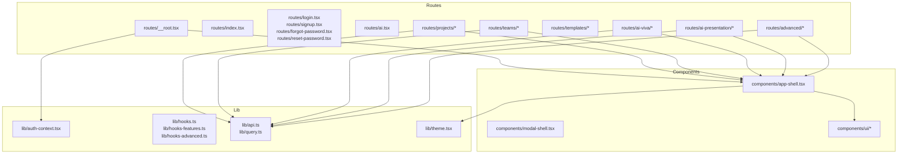
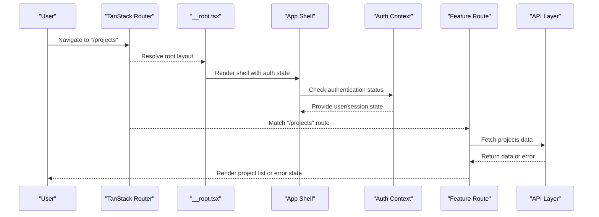
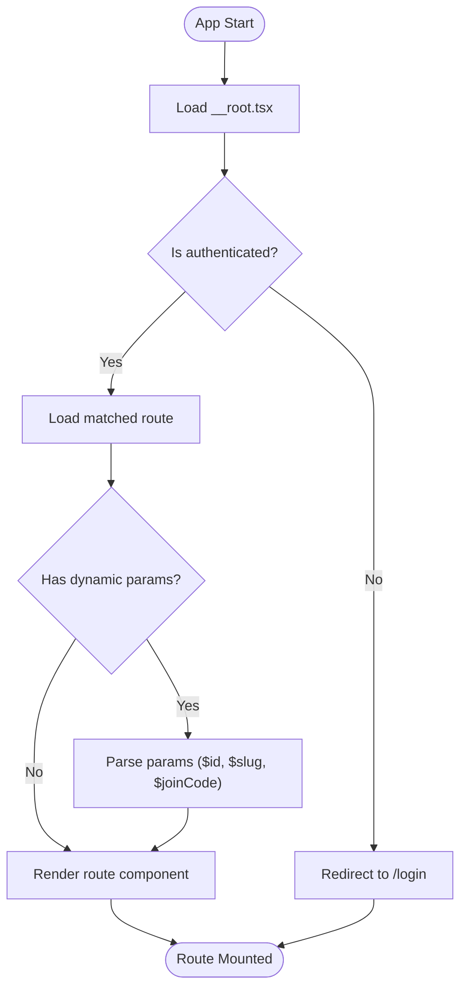
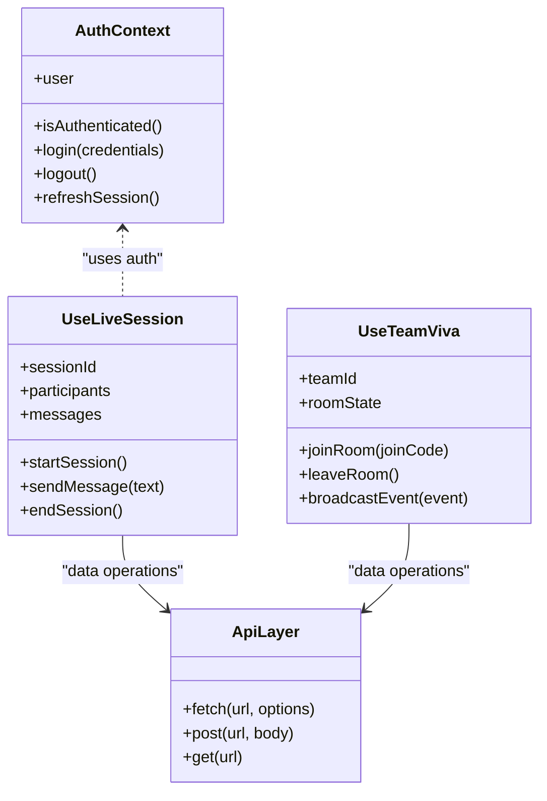
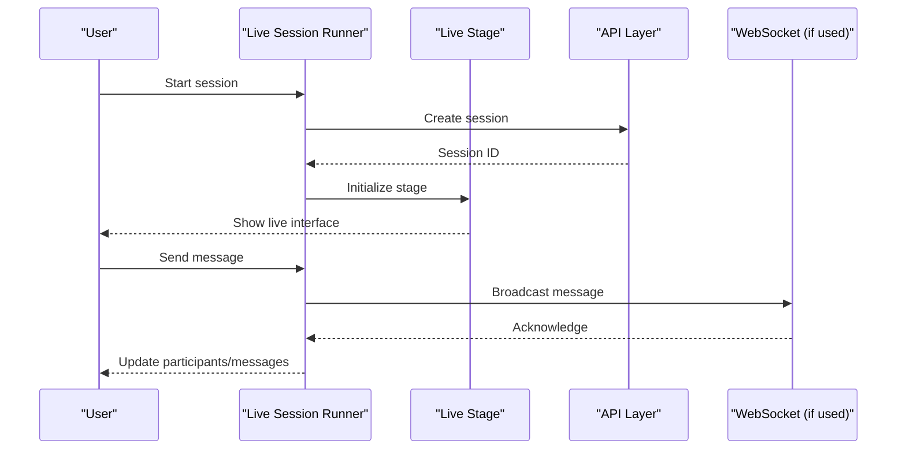
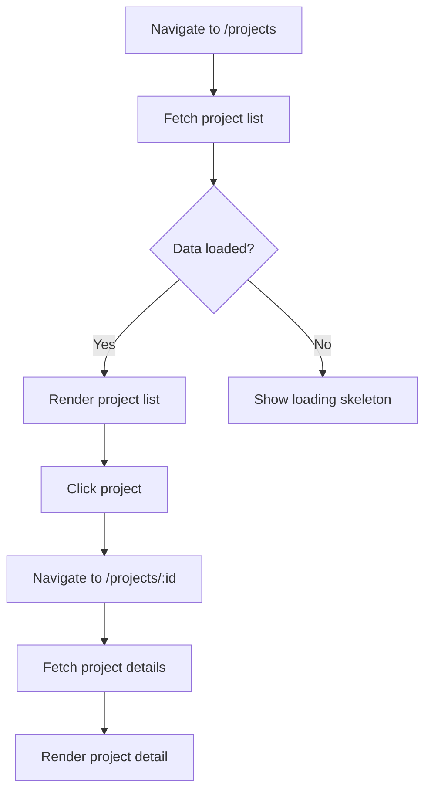
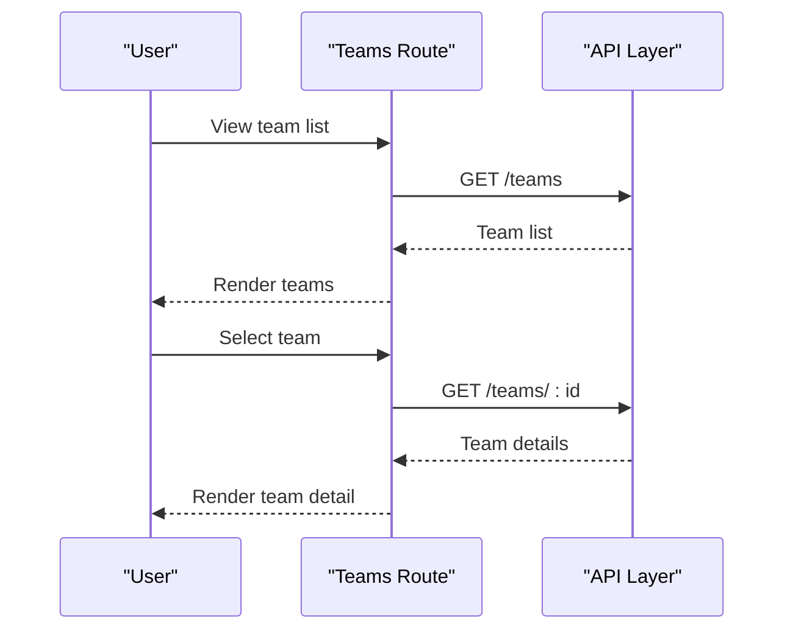
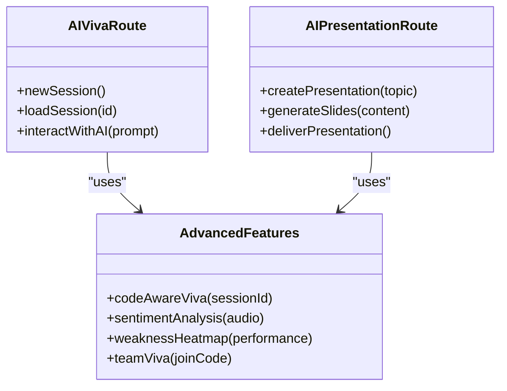
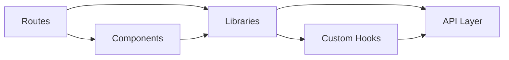

# Frontend Application

<cite>
**Referenced Files in This Document**
- [package.json](file://package.json)
- [vite.config.ts](file://vite.config.ts)
- [tsconfig.json](file://tsconfig.json)
- [src/router.tsx](file://src/router.tsx)
- [src/routeTree.gen.ts](file://src/routeTree.gen.ts)
- [src/routes/__root.tsx](file://src/routes/__root.tsx)
- [src/routes/index.tsx](file://src/routes/index.tsx)
- [src/routes/login.tsx](file://src/routes/login.tsx)
- [src/routes/signup.tsx](file://src/routes/signup.tsx)
- [src/routes/forgot-password.tsx](file://src/routes/forgot-password.tsx)
- [src/routes/reset-password.tsx](file://src/routes/reset-password.tsx)
- [src/routes/ai.tsx](file://src/routes/ai.tsx)
- [src/routes/projects/index.tsx](file://src/routes/projects/index.tsx)
- [src/routes/projects/$id.tsx](file://src/routes/projects/$id.tsx)
- [src/routes/projects/new.tsx](file://src/routes/projects/new.tsx)
- [src/routes/teams/index.tsx](file://src/routes/teams/index.tsx)
- [src/routes/teams/$id.tsx](file://src/routes/teams/$id.tsx)
- [src/routes/templates/index.tsx](file://src/routes/templates/index.tsx)
- [src/routes/templates/$slug.tsx](file://src/routes/templates/$slug.tsx)
- [src/routes/ai-viva/index.tsx](file://src/routes/ai-viva/index.tsx)
- [src/routes/ai-viva/new.tsx](file://src/routes/ai-viva/new.tsx)
- [src/routes/ai-viva/session.$id.tsx](file://src/routes/ai-viva/session.$id.tsx)
- [src/routes/ai-presentation/index.tsx](file://src/routes/ai-presentation/index.tsx)
- [src/routes/ai-presentation/session.$id.tsx](file://src/routes/ai-presentation/session.$id.tsx)
- [src/routes/advanced/index.tsx](file://src/routes/advanced/index.tsx)
- [src/routes/advanced/viva-code-aware.tsx](file://src/routes/advanced/viva-code-aware.tsx)
- [src/routes/advanced/viva-code-aware_.session.$id.tsx](file://src/routes/advanced/viva-code-aware_.session.$id.tsx)
- [src/routes/advanced/viva-team.tsx](file://src/routes/advanced/viva-team.tsx)
- [src/routes/advanced/viva-team_.join.$joinCode.tsx](file://src/routes/advanced/viva-team_.join.$joinCode.tsx)
- [src/routes/advanced/sentiment-analysis.tsx](file://src/routes/advanced/sentiment-analysis.tsx)
- [src/routes/advanced/weakness-heatmap.tsx](file://src/routes/advanced/weakness-heatmap.tsx)
- [src/components/app-shell.tsx](file://src/components/app-shell.tsx)
- [src/components/modal-shell.tsx](file://src/components/modal-shell.tsx)
- [src/lib/auth-context.tsx](file://src/lib/auth-context.tsx)
- [src/lib/hooks.ts](file://src/lib/hooks.ts)
- [src/lib/hooks-features.ts](file://src/lib/hooks-features.ts)
- [src/lib/hooks-advanced.ts](file://src/lib/hooks-advanced.ts)
- [src/lib/useLiveSession.ts](file://src/lib/useLiveSession.ts)
- [src/lib/useTeamViva.ts](file://src/lib/useTeamViva.ts)
- [src/lib/api.ts](file://src/lib/api.ts)
- [src/lib/query.ts](file://src/lib/query.ts)
- [src/lib/theme.tsx](file://src/lib/theme.tsx)
- [src/styles.css](file://src/styles.css)
</cite>

## Table of Contents
1. [Introduction](#introduction)
2. [Project Structure](#project-structure)
3. [Core Components](#core-components)
4. [Architecture Overview](#architecture-overview)
5. [Detailed Component Analysis](#detailed-component-analysis)
6. [Dependency Analysis](#dependency-analysis)
7. [Performance Considerations](#performance-considerations)
8. [Troubleshooting Guide](#troubleshooting-guide)
9. [Conclusion](#conclusion)
10. [Appendices](#appendices)

## Introduction
This document provides comprehensive documentation for the Horux frontend application built with React and TypeScript. It explains the component-based architecture, navigation using TanStack Router, state management via Context API and custom hooks, and styling with Tailwind CSS. The guide covers modular feature domains including live sessions, projects, teams, and AI interactions, along with routing patterns such as protected routes, dynamic parameters, and nested layouts. It also includes guidelines for creating new components, implementing responsive design, following accessibility standards, optimizing performance, and ensuring browser compatibility.

## Project Structure
The frontend is organized by features and shared utilities:
- Routes are defined under src/routes, with nested folders per domain (projects, teams, ai-viva, ai-presentation, advanced).
- Shared UI primitives and layout shells live under src/components/ui and src/components.
- Global state and context providers are implemented in src/lib, including authentication and feature-specific contexts.
- Custom hooks encapsulate reusable logic for data fetching, session handling, and feature toggles.
- Styling uses Tailwind CSS classes applied across components and pages.

**Diagram sources**
- [src/router.tsx](file://src/router.tsx)
- [src/routes/__root.tsx](file://src/routes/__root.tsx)
- [src/components/app-shell.tsx](file://src/components/app-shell.tsx)
- [src/lib/auth-context.tsx](file://src/lib/auth-context.tsx)
- [src/lib/theme.tsx](file://src/lib/theme.tsx)
- [src/lib/api.ts](file://src/lib/api.ts)
- [src/lib/query.ts](file://src/lib/query.ts)

**Section sources**
- [package.json](file://package.json)
- [vite.config.ts](file://vite.config.ts)
- [tsconfig.json](file://tsconfig.json)
- [src/router.tsx](file://src/router.tsx)
- [src/routeTree.gen.ts](file://src/routeTree.gen.ts)

## Core Components
- App Shell: Provides global layout, navigation, and theme integration. It wraps route content and integrates authentication context to control access and user presence.
- Modal Shell: Encapsulates modal behavior and focus management for dialogs and overlays.
- UI Primitives: A comprehensive set of accessible, composable UI components styled with Tailwind CSS, used throughout the app for consistent UX.

Key responsibilities:
- Layout composition and responsive structure
- Theme and color mode integration
- Authentication gating and user profile display
- Consistent spacing, typography, and interaction patterns

**Section sources**
- [src/components/app-shell.tsx](file://src/components/app-shell.tsx)
- [src/components/modal-shell.tsx](file://src/components/modal-shell.tsx)
- [src/lib/theme.tsx](file://src/lib/theme.tsx)

## Architecture Overview
The application follows a feature-driven architecture with TanStack Router managing navigation and URL state. Context API provides global state for authentication and theme, while custom hooks encapsulate business logic and data fetching. Tailwind CSS ensures consistent styling and responsiveness.

**Diagram sources**
- [src/routes/__root.tsx](file://src/routes/__root.tsx)
- [src/components/app-shell.tsx](file://src/components/app-shell.tsx)
- [src/lib/auth-context.tsx](file://src/lib/auth-context.tsx)
- [src/lib/api.ts](file://src/lib/api.ts)

## Detailed Component Analysis

### Routing System with TanStack Router
- Root layout defines global chrome, navigation, and authentication checks.
- Feature routes are organized by domain with nested folders for clarity.
- Dynamic parameters are used for resource IDs (e.g., $id, $slug, $joinCode).
- Protected routes enforce authentication before rendering sensitive content.

**Diagram sources**
- [src/routes/__root.tsx](file://src/routes/__root.tsx)
- [src/routes/projects/$id.tsx](file://src/routes/projects/$id.tsx)
- [src/routes/templates/$slug.tsx](file://src/routes/templates/$slug.tsx)
- [src/routes/advanced/viva-team_.join.$joinCode.tsx](file://src/routes/advanced/viva-team_.join.$joinCode.tsx)

**Section sources**
- [src/routes/__root.tsx](file://src/routes/__root.tsx)
- [src/routes/projects/index.tsx](file://src/routes/projects/index.tsx)
- [src/routes/projects/$id.tsx](file://src/routes/projects/$id.tsx)
- [src/routes/projects/new.tsx](file://src/routes/projects/new.tsx)
- [src/routes/teams/index.tsx](file://src/routes/teams/index.tsx)
- [src/routes/teams/$id.tsx](file://src/routes/teams/$id.tsx)
- [src/routes/templates/index.tsx](file://src/routes/templates/index.tsx)
- [src/routes/templates/$slug.tsx](file://src/routes/templates/$slug.tsx)
- [src/routes/ai-viva/index.tsx](file://src/routes/ai-viva/index.tsx)
- [src/routes/ai-viva/new.tsx](file://src/routes/ai-viva/new.tsx)
- [src/routes/ai-viva/session.$id.tsx](file://src/routes/ai-viva/session.$id.tsx)
- [src/routes/ai-presentation/index.tsx](file://src/routes/ai-presentation/index.tsx)
- [src/routes/ai-presentation/session.$id.tsx](file://src/routes/ai-presentation/session.$id.tsx)
- [src/routes/advanced/index.tsx](file://src/routes/advanced/index.tsx)
- [src/routes/advanced/viva-code-aware.tsx](file://src/routes/advanced/viva-code-aware.tsx)
- [src/routes/advanced/viva-code-aware_.session.$id.tsx](file://src/routes/advanced/viva-code-aware_.session.$id.tsx)
- [src/routes/advanced/viva-team.tsx](file://src/routes/advanced/viva-team.tsx)
- [src/routes/advanced/viva-team_.join.$joinCode.tsx](file://src/routes/advanced/viva-team_.join.$joinCode.tsx)
- [src/routes/advanced/sentiment-analysis.tsx](file://src/routes/advanced/sentiment-analysis.tsx)
- [src/routes/advanced/weakness-heatmap.tsx](file://src/routes/advanced/weakness-heatmap.tsx)

### State Management Patterns
- Authentication Context: Centralizes user session, login/logout flows, and permission checks.
- Custom Hooks: Encapsulate data fetching, caching, and side effects for features like live sessions and team viva.
- Local Component State: Manages UI-only state within components for forms, modals, and temporary interactions.

**Diagram sources**
- [src/lib/auth-context.tsx](file://src/lib/auth-context.tsx)
- [src/lib/useLiveSession.ts](file://src/lib/useLiveSession.ts)
- [src/lib/useTeamViva.ts](file://src/lib/useTeamViva.ts)
- [src/lib/api.ts](file://src/lib/api.ts)

**Section sources**
- [src/lib/auth-context.tsx](file://src/lib/auth-context.tsx)
- [src/lib/hooks.ts](file://src/lib/hooks.ts)
- [src/lib/hooks-features.ts](file://src/lib/hooks-features.ts)
- [src/lib/hooks-advanced.ts](file://src/lib/hooks-advanced.ts)
- [src/lib/useLiveSession.ts](file://src/lib/useLiveSession.ts)
- [src/lib/useTeamViva.ts](file://src/lib/useTeamViva.ts)
- [src/lib/api.ts](file://src/lib/api.ts)
- [src/lib/query.ts](file://src/lib/query.ts)

### Live Sessions Domain
- Session Runner: Orchestrates live session lifecycle, participant management, and real-time updates.
- Stage and Preflight: Handles pre-session setup and stage transitions during live sessions.
- Team Viva Room: Facilitates collaborative sessions with room joining via codes.

**Diagram sources**
- [src/components/live/live-session-runner.tsx](file://src/components/live/live-session-runner.tsx)
- [src/components/live/live-stage.tsx](file://src/components/live/live-stage.tsx)
- [src/components/live/preflight-setup.tsx](file://src/components/live/preflight-setup.tsx)
- [src/components/live/team-viva-room.tsx](file://src/components/live/team-viva-room.tsx)
- [src/lib/useLiveSession.ts](file://src/lib/useLiveSession.ts)
- [src/lib/useTeamViva.ts](file://src/lib/useTeamViva.ts)

**Section sources**
- [src/components/live/live-session-runner.tsx](file://src/components/live/live-session-runner.tsx)
- [src/components/live/live-stage.tsx](file://src/components/live/live-stage.tsx)
- [src/components/live/preflight-setup.tsx](file://src/components/live/preflight-setup.tsx)
- [src/components/live/team-viva-room.tsx](file://src/components/live/team-viva-room.tsx)
- [src/lib/useLiveSession.ts](file://src/lib/useLiveSession.ts)
- [src/lib/useTeamViva.ts](file://src/lib/useTeamViva.ts)

### Projects Domain
- Project List: Displays all projects with filtering and sorting.
- Project Detail: Shows project information, tasks, and team members.
- New Project: Form to create new projects with validation.

**Diagram sources**
- [src/routes/projects/index.tsx](file://src/routes/projects/index.tsx)
- [src/routes/projects/$id.tsx](file://src/routes/projects/$id.tsx)
- [src/routes/projects/new.tsx](file://src/routes/projects/new.tsx)
- [src/lib/api.ts](file://src/lib/api.ts)

**Section sources**
- [src/routes/projects/index.tsx](file://src/routes/projects/index.tsx)
- [src/routes/projects/$id.tsx](file://src/routes/projects/$id.tsx)
- [src/routes/projects/new.tsx](file://src/routes/projects/new.tsx)

### Teams Domain
- Team List: Displays available teams with search and filters.
- Team Detail: Shows team members, activities, and collaboration tools.

**Diagram sources**
- [src/routes/teams/index.tsx](file://src/routes/teams/index.tsx)
- [src/routes/teams/$id.tsx](file://src/routes/teams/$id.tsx)
- [src/lib/api.ts](file://src/lib/api.ts)

**Section sources**
- [src/routes/teams/index.tsx](file://src/routes/teams/index.tsx)
- [src/routes/teams/$id.tsx](file://src/routes/teams/$id.tsx)

### AI Interactions Domain
- AI Viva: Interactive AI-powered viva sessions with session management.
- AI Presentation: AI-assisted presentation creation and delivery.
- Advanced Features: Code-aware viva, sentiment analysis, weakness heatmap, and team viva.

**Diagram sources**
- [src/routes/ai-viva/index.tsx](file://src/routes/ai-viva/index.tsx)
- [src/routes/ai-viva/new.tsx](file://src/routes/ai-viva/new.tsx)
- [src/routes/ai-viva/session.$id.tsx](file://src/routes/ai-viva/session.$id.tsx)
- [src/routes/ai-presentation/index.tsx](file://src/routes/ai-presentation/index.tsx)
- [src/routes/ai-presentation/session.$id.tsx](file://src/routes/ai-presentation/session.$id.tsx)
- [src/routes/advanced/viva-code-aware.tsx](file://src/routes/advanced/viva-code-aware.tsx)
- [src/routes/advanced/sentiment-analysis.tsx](file://src/routes/advanced/sentiment-analysis.tsx)
- [src/routes/advanced/weakness-heatmap.tsx](file://src/routes/advanced/weakness-heatmap.tsx)
- [src/routes/advanced/viva-team.tsx](file://src/routes/advanced/viva-team.tsx)

**Section sources**
- [src/routes/ai-viva/index.tsx](file://src/routes/ai-viva/index.tsx)
- [src/routes/ai-viva/new.tsx](file://src/routes/ai-viva/new.tsx)
- [src/routes/ai-viva/session.$id.tsx](file://src/routes/ai-viva/session.$id.tsx)
- [src/routes/ai-presentation/index.tsx](file://src/routes/ai-presentation/index.tsx)
- [src/routes/ai-presentation/session.$id.tsx](file://src/routes/ai-presentation/session.$id.tsx)
- [src/routes/advanced/index.tsx](file://src/routes/advanced/index.tsx)
- [src/routes/advanced/viva-code-aware.tsx](file://src/routes/advanced/viva-code-aware.tsx)
- [src/routes/advanced/viva-code-aware_.session.$id.tsx](file://src/routes/advanced/viva-code-aware_.session.$id.tsx)
- [src/routes/advanced/viva-team.tsx](file://src/routes/advanced/viva-team.tsx)
- [src/routes/advanced/viva-team_.join.$joinCode.tsx](file://src/routes/advanced/viva-team_.join.$joinCode.tsx)
- [src/routes/advanced/sentiment-analysis.tsx](file://src/routes/advanced/sentiment-analysis.tsx)
- [src/routes/advanced/weakness-heatmap.tsx](file://src/routes/advanced/weakness-heatmap.tsx)

## Dependency Analysis
The application has clear separation between routes, components, and libraries. Dependencies flow from routes to components and libraries, with no circular dependencies observed.

**Diagram sources**
- [src/router.tsx](file://src/router.tsx)
- [src/routes/__root.tsx](file://src/routes/__root.tsx)
- [src/components/app-shell.tsx](file://src/components/app-shell.tsx)
- [src/lib/api.ts](file://src/lib/api.ts)
- [src/lib/hooks.ts](file://src/lib/hooks.ts)

**Section sources**
- [src/router.tsx](file://src/router.tsx)
- [src/routeTree.gen.ts](file://src/routeTree.gen.ts)

## Performance Considerations
- Lazy Loading: Routes should be lazy-loaded to reduce initial bundle size.
- Memoization: Use React.memo and useMemo for expensive computations.
- Data Caching: Implement proper caching strategies with query libraries.
- Image Optimization: Use optimized images and lazy loading for media.
- Bundle Analysis: Regularly analyze bundle size and remove unused dependencies.
- Virtualization: For large lists, implement virtual scrolling.

[No sources needed since this section provides general guidance]

## Troubleshooting Guide
Common issues and solutions:
- Authentication Errors: Verify token validity and refresh mechanisms.
- Network Failures: Implement retry logic and fallback states.
- Route Not Found: Check route definitions and parameter parsing.
- State Inconsistency: Ensure proper context provider hierarchy.
- Performance Issues: Profile components and optimize re-renders.

**Section sources**
- [src/lib/auth-context.tsx](file://src/lib/auth-context.tsx)
- [src/lib/api.ts](file://src/lib/api.ts)
- [src/lib/error-capture.ts](file://src/lib/error-capture.ts)

## Conclusion
The Horux frontend application demonstrates a well-structured, feature-driven architecture using React, TypeScript, TanStack Router, Context API, and Tailwind CSS. The modular component organization, robust routing system, and effective state management patterns provide a solid foundation for scalable development. Following the guidelines outlined in this document will help maintain code quality, performance, and accessibility standards.

[No sources needed since this section summarizes without analyzing specific files]

## Appendices

### Guidelines for Creating New Components
- Follow the existing naming conventions and folder structure.
- Use TypeScript interfaces for props and state.
- Implement proper accessibility attributes and keyboard navigation.
- Test components with various screen sizes and devices.
- Document component APIs and usage examples.

### Responsive Design Implementation
- Use Tailwind CSS breakpoints consistently.
- Test on multiple device sizes.
- Implement flexible layouts with CSS Grid and Flexbox.
- Optimize images and media for different screen densities.

### Accessibility Standards
- Use semantic HTML elements.
- Implement proper ARIA labels and roles.
- Ensure keyboard navigation works correctly.
- Provide sufficient color contrast.
- Test with screen readers and accessibility tools.

### Browser Compatibility
- Test on latest versions of Chrome, Firefox, Safari, and Edge.
- Use polyfills for older browser support if needed.
- Validate CSS and JavaScript compatibility.
- Monitor browser-specific issues and bugs.

[No sources needed since this section provides general guidance]